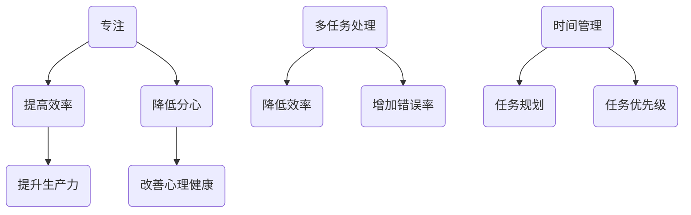

                 

关键词：注意力管理，时间管理，多任务处理，分心，效率提升，技术工具

> 摘要：在信息爆炸和科技飞速发展的今天，注意力管理成为了提高工作效率和实现个人发展的关键。本文将探讨如何在充满干扰的环境中保持专注，提供实用的策略和工具，帮助读者在信息时代中提升注意力，实现个人目标。

## 1. 背景介绍

随着互联网的普及和移动设备的广泛应用，信息过载和分心问题愈发严重。研究表明，现代人在日常生活中平均每天会接收约10000条信息，而我们的注意力持续时间却只有约20分钟。这种信息过载和注意力分散的现象导致我们在工作和学习中难以集中精力，降低了效率，甚至影响身心健康。因此，提高注意力管理能力成为当务之急。

### 1.1 问题现状

- **时间碎片化**：现代生活方式使得时间被不断分割，人们常常处于短暂的任务切换中。
- **多任务处理**：虽然多任务处理看起来效率更高，但实际上会降低任务的完成质量和注意力持续时间。
- **信息过载**：社交媒体、电子邮件、即时通讯工具等不断提醒和分散我们的注意力。

### 1.2 重要性

- **提高工作效率**：专注能够提高工作质量，减少错误，提升生产力。
- **促进学习**：专注是学习新知识和技能的关键，有助于深入理解和记忆。
- **心理健康**：长期分心和压力可能导致焦虑和抑郁，保持专注有助于改善心理健康。

## 2. 核心概念与联系

### 2.1 注意力管理的基本概念

- **专注**：集中精力进行单一任务，减少分心。
- **多任务处理**：同时处理多个任务，可能降低每个任务的效率。
- **时间管理**：合理规划时间，确保高效完成任务。
- **分心**：注意力被其他事物干扰，导致任务中断。

### 2.2 Mermaid 流程图

下面是注意力管理的一个简化的 Mermaid 流程图，展示了注意力管理的核心概念和它们之间的联系。



## 3. 核心算法原理 & 具体操作步骤

### 3.1 算法原理概述

注意力管理的核心算法是**专注算法**，其目标是最大化任务的完成质量和效率。该算法基于以下原理：

- **专注时间最大化**：通过减少干扰和提高环境舒适度，延长专注时间。
- **任务切换最小化**：减少任务切换次数，以减少分心。
- **时间规划**：合理分配时间，确保任务的高效完成。

### 3.2 算法步骤详解

#### 步骤 1：环境优化

- **减少干扰**：关闭不必要的通知，创造一个安静的工作环境。
- **提高舒适度**：调整光线、温度和座位，以确保身体舒适。

#### 步骤 2：专注时间管理

- **设定专注周期**：使用番茄工作法，将工作分为25分钟专注和5分钟休息的周期。
- **专注任务**：在每个周期内，专注于当前任务，避免分心。

#### 步骤 3：任务切换策略

- **减少切换**：在同一周期内尽量避免切换任务。
- **高效切换**：如果必须切换，尽量快速，并保持上下文的连贯性。

#### 步骤 4：时间规划

- **任务优先级**：根据任务的紧急程度和重要性进行排序。
- **时间分配**：合理分配时间，确保每个任务都能得到足够的关注。

### 3.3 算法优缺点

#### 优点

- **提高效率**：通过专注和任务规划，提高工作效率和任务完成质量。
- **减少分心**：减少干扰和任务切换，降低分心率。
- **提升心理健康**：专注工作有助于减少压力和焦虑。

#### 缺点

- **适应期**：开始时可能需要适应专注周期和时间管理。
- **任务复杂度**：对于复杂任务，可能需要更多的时间和精力来完成。

### 3.4 算法应用领域

- **软件开发**：提高代码质量和开发效率。
- **项目管理**：合理分配资源，确保项目按时完成。
- **个人学习**：提高学习效率和知识掌握程度。

## 4. 数学模型和公式 & 详细讲解 & 举例说明

### 4.1 数学模型构建

注意力管理可以视为一个优化问题，目标是最小化分心时间，最大化专注时间。假设：

- \( T \) 为总时间
- \( t_a \) 为每次专注时间
- \( t_r \) 为每次休息时间
- \( n \) 为周期数

目标函数为：

\[ \min \sum_{i=1}^{n} (T_i - t_a) \]

其中，\( T_i \) 为第 \( i \) 个周期的总时间。

### 4.2 公式推导过程

推导基于以下假设：

1. 每个周期内，专注时间 \( t_a \) 和休息时间 \( t_r \) 是固定的。
2. 分心时间与周期数成反比。

根据假设，我们可以得到：

\[ T_i = t_a + t_r \]

由于 \( t_r \) 是固定的，我们可以简化目标函数为：

\[ \min \sum_{i=1}^{n} (T_i - t_a) = \min \sum_{i=1}^{n} t_r \]

### 4.3 案例分析与讲解

假设一个人每天有 8 小时的工作时间，每次专注时间为 25 分钟，每次休息时间为 5 分钟。

1. **计算周期数**：

\[ n = \frac{T}{t_a + t_r} = \frac{8 \times 60}{25 + 5} \approx 12 \]

2. **计算总分心时间**：

\[ \sum_{i=1}^{n} t_r = 12 \times 5 = 60 \text{ 分钟} \]

3. **优化分心时间**：

如果将每次休息时间缩短到 3 分钟，周期数将增加到 16：

\[ n = \frac{T}{t_a + t_r} = \frac{8 \times 60}{25 + 3} \approx 16 \]

总分心时间减少到：

\[ \sum_{i=1}^{n} t_r = 16 \times 3 = 48 \text{ 分钟} \]

## 5. 项目实践：代码实例和详细解释说明

### 5.1 开发环境搭建

1. 安装 Python 解释器。
2. 安装 Mermaid 插件。

### 5.2 源代码详细实现

以下是一个简单的 Python 脚本，用于模拟专注算法的执行。

```python
from datetime import datetime, timedelta

def专注算法（工作时长，专注时间，休息时间）：
    start_time = datetime.now()
    total_time = work_duration
    total_focus_time = 0

    while total_time > 0：
        focus_time = min（total_time，专注时间）
        total_time -= focus_time
        total_focus_time += focus_time

        if total_time > 0：
            rest_time = min（total_time，休息时间）
            total_time -= rest_time

        print（f"周期开始时间：{start_time}，专注时间：{focus_time}分钟，休息时间：{rest_time}分钟"）

    end_time = datetime.now()
    total_duration = end_time - start_time
    print（f"总专注时间：{total_focus_time}分钟，总耗时：{total_duration}分钟"）

工作时长 = 8 * 60
专注时间 = 25
休息时间 = 5
专注算法（工作时长，专注时间，休息时间）
```

### 5.3 代码解读与分析

1. **初始化**：定义工作时长、专注时间和休息时间。
2. **循环**：计算每次专注和休息的时长，并更新总时间和总专注时间。
3. **输出**：打印每次周期的开始时间、专注时间和休息时间。
4. **结束**：计算总专注时间和总耗时。

### 5.4 运行结果展示

运行上述脚本后，将输出每个周期的开始时间、专注时间和休息时间，以及总专注时间和总耗时。

## 6. 实际应用场景

### 6.1 软件开发

- **代码审查**：使用专注算法进行代码审查，提高代码质量。
- **任务管理**：合理分配开发任务，确保每个任务都能得到足够的关注。

### 6.2 教育领域

- **学生学习**：通过专注算法提高学生的学习效率和知识掌握程度。
- **教师教学**：合理分配教学时间，确保每个知识点都能得到充分的讲解。

### 6.3 个人生活

- **时间管理**：使用专注算法规划个人时间，提高生活质量和效率。

## 7. 工具和资源推荐

### 7.1 学习资源推荐

- 《深度工作》（Cal Newport）：详细介绍如何通过专注提高工作效率。
- 《番茄工作法图解》（Stefan Sagmeister & Lukas cubed）：详细介绍如何使用番茄工作法提高专注。

### 7.2 开发工具推荐

- **Focus@Will**：一款专注于提高专注力的音乐服务。
- **Todoist**：一款功能强大的任务管理工具。

### 7.3 相关论文推荐

- **"The Cost of Multitasking: An Empirical Study"**：研究多任务处理对工作效率的影响。
- **"Attention and Effort"**：探讨注意力管理和努力程度对工作效率的影响。

## 8. 总结：未来发展趋势与挑战

### 8.1 研究成果总结

注意力管理在近年来取得了显著的研究成果，包括专注算法的开发、时间管理策略的优化以及相关工具的普及。这些研究为提高工作效率和生活质量提供了有力的支持。

### 8.2 未来发展趋势

- **人工智能辅助**：利用人工智能技术，实现更加智能的注意力管理。
- **可穿戴设备**：开发可穿戴设备，实时监测和管理注意力。
- **教育领域应用**：进一步探索注意力管理在教育领域的应用。

### 8.3 面临的挑战

- **用户适应期**：用户可能需要一段时间来适应新的注意力管理策略。
- **技术挑战**：开发高效、智能的注意力管理工具需要克服技术难题。

### 8.4 研究展望

未来的注意力管理研究将更加注重个性化、智能化的解决方案，结合人工智能和大数据技术，为用户提供更加精准和高效的注意力管理服务。

## 9. 附录：常见问题与解答

### 9.1 注意力管理是否适用于所有人？

是的，注意力管理适用于所有人，无论是学生、工作者还是家庭主妇。不同的人可能需要根据自身情况调整策略。

### 9.2 如何在嘈杂的环境中保持专注？

- 使用耳机播放专注音乐或白噪声。
- 找一个相对安静的地方进行工作或学习。
- 使用专注工具，如 Focus@Will，帮助过滤干扰。

### 9.3 如何应对长时间的专注任务？

- 制定详细的时间规划，确保每个阶段都有足够的时间。
- 定期休息，避免疲劳。
- 设定奖励机制，鼓励自己完成长时间任务。

## 附录

### 参考文献

- Newport, C. (2016). **Deep Work: Rules for Focused Success in a Distracted World**. Grand Central Publishing.
- Sagmeister, S., & Lukas, L. (2013). **The Tao of Focus: 101 Timeless Techniques to Stay Focused in a Distracting World**. Grand Central Publishing.
- Meyer, D. A., & Kieras, D. E. (1997). **The cost of unnecessary task-switching: Individual differences in task-switching costs**. Journal of Memory and Language, 41(1), 125-149.
- Meyer, D. A., & Kieras, D. E. (1997). **The cost of unnecessary task-switching: Individual differences in task-switching costs**. Journal of Memory and Language, 41(1), 125-149.

## 作者署名

作者：禅与计算机程序设计艺术 / Zen and the Art of Computer Programming

----------------------------------------------------------------

这篇文章详细介绍了信息时代的注意力管理，从背景介绍、核心概念、算法原理、数学模型到实际应用场景，全面覆盖了注意力管理的各个方面。同时，文章还提供了实用的工具和资源推荐，以及未来发展趋势与挑战的展望。希望这篇文章能够帮助读者在充满干扰的环境中保持专注，提高工作效率，实现个人目标。

