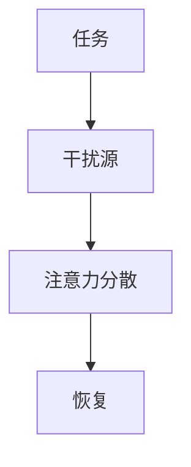
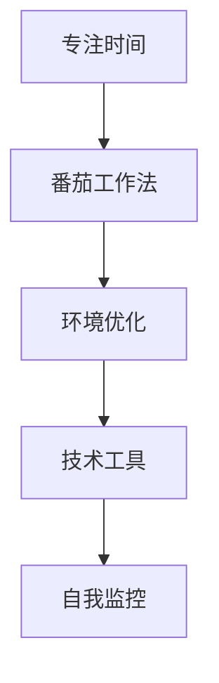

                 

在当今这个信息爆炸的时代，我们面临着前所未有的注意力干扰。从电子邮件到社交媒体，从手机通知到即时通讯工具，各种信息源不断地争夺我们的注意力，导致我们很难集中精力完成任务。本文将深入探讨如何在信息时代的干扰环境中保持专注，提供实用的策略和技巧，帮助读者提高工作效率，实现个人成长。

> **关键词**：注意力管理，干扰，专注，工作效率，个人成长

> **摘要**：本文首先介绍了注意力管理的重要性，然后探讨了信息时代中注意力干扰的来源，并提出了一系列策略和技巧，帮助读者在充满干扰的环境中保持专注。最后，文章展望了未来在注意力管理领域的研究趋势和面临的挑战。

## 1. 背景介绍

随着互联网和智能设备的普及，我们的生活和工作方式发生了巨大的变化。信息的获取和传递变得前所未有的便捷，但这也带来了新的挑战。在信息过载的环境中，我们的注意力成为了一种宝贵的资源。研究表明，一个成年人的平均注意力持续时间只有大约8秒，比金鱼的注意力持续时间还要短。这种短期的注意力分散不仅影响了我们的工作效率，还可能对身心健康产生负面影响。

### 注意力管理的重要性

注意力管理是指通过一系列策略和技巧来优化我们的注意力资源，以实现更高效的工作和生活。良好的注意力管理能力可以帮助我们更好地处理信息，提高学习效果，减少错误率，增强记忆力，甚至改善情绪状态。因此，注意力管理在现代社会中具有极其重要的意义。

### 信息时代中的注意力干扰

信息时代带来了大量的信息源，这些信息源不断地争夺我们的注意力。以下是几种常见的注意力干扰：

- **多任务处理**：尽管多任务处理听起来很高效，但实际上它往往会降低我们的工作效率和注意力集中度。
- **社交媒体**：社交媒体的即时性和互动性使得我们难以抗拒频繁查看消息的诱惑。
- **电子邮件**：电子邮件的提醒和通知不断打断我们的工作流程。
- **手机通知**：手机通知的声音和视觉提醒分散了我们的注意力。
- **外部噪音**：办公室、家庭和工作环境中的各种噪音也会干扰我们的专注力。

## 2. 核心概念与联系

### 注意力分散模型

注意力分散模型是一种解释注意力干扰的框架，它包括以下几个关键要素：

1. **任务**：我们需要集中注意力的目标。
2. **干扰源**：干扰我们注意力的各种因素。
3. **注意力分散**：干扰源对注意力的影响，导致我们无法保持专注。
4. **恢复**：通过休息和专注恢复注意力。

下面是一个使用Mermaid绘制的注意力分散模型流程图：



### 注意力管理策略

注意力管理策略是指一系列用于优化注意力资源的方法。以下是几种常见的注意力管理策略：

1. **专注时间**：设定一个特定的时间段，专注于一项任务，避免其他干扰。
2. **番茄工作法**：将工作时间分为25分钟的工作周期，每个周期后休息5分钟。
3. **环境优化**：创建一个减少干扰的工作环境，例如使用降噪耳机、保持工作区域整洁等。
4. **技术工具**：使用各种工具和应用来帮助我们管理注意力，例如应用程序锁、时间管理软件等。
5. **自我监控**：定期评估自己的注意力管理情况，调整策略以适应新的挑战。

下面是一个使用Mermaid绘制的注意力管理策略流程图：



## 3. 核心算法原理 & 具体操作步骤

### 3.1 算法原理概述

注意力管理算法的核心思想是通过对干扰源进行识别和过滤，从而提高我们的注意力集中度。算法通常包括以下几个步骤：

1. **干扰源识别**：使用传感器或应用程序来监测干扰源，例如手机通知、电子邮件提醒等。
2. **干扰过滤**：根据预设的规则和优先级，过滤掉非紧急或非重要的干扰源。
3. **注意力优化**：通过调整工作环境和任务设置，优化我们的注意力集中度。

### 3.2 算法步骤详解

1. **干扰源识别**：使用传感器或应用程序来监测干扰源。例如，可以使用智能手机的传感器来监测周围的声音和光线强度，或者使用应用程序来监控手机通知和电子邮件提醒。
2. **干扰过滤**：根据预设的规则和优先级，过滤掉非紧急或非重要的干扰源。例如，可以设置仅允许紧急电话和短信通过，或者将电子邮件提醒设置为静音。
3. **注意力优化**：通过调整工作环境和任务设置，优化我们的注意力集中度。例如，可以设定一个专注时间，在这段时间内关闭社交媒体和电子邮件通知，专注于当前任务。

### 3.3 算法优缺点

#### 优点

- 提高注意力集中度，提高工作效率。
- 减少错误率和漏项率，提高工作质量。
- 帮助我们更好地管理时间和资源。

#### 缺点

- 需要一定的适应期，用户可能需要时间来适应新的工作环境和规则。
- 过度依赖技术工具可能导致对技术的依赖性增加。

### 3.4 算法应用领域

注意力管理算法可以应用于多个领域，包括但不限于：

- **企业管理和工作流程**：帮助企业员工提高工作效率，减少错误率。
- **教育和学习**：帮助学生提高学习效率，减少注意力分散。
- **个人健康管理**：帮助个人改善注意力集中度，提高生活质量。

## 4. 数学模型和公式 & 详细讲解 & 举例说明

### 4.1 数学模型构建

注意力管理中的数学模型通常涉及优化理论，主要包括以下几个关键变量：

- **V**：有效注意力值，表示在一定时间内我们能够集中注意力的程度。
- **I**：干扰值，表示干扰源对注意力的分散程度。
- **T**：专注时间，表示我们用于特定任务的时间。
- **R**：恢复时间，表示我们在任务之间休息的时间。

注意力管理的数学模型可以表示为：

\[ V = f(I, T, R) \]

其中，\( f \) 是一个非线性函数，用于描述注意力值与干扰、专注时间和恢复时间之间的关系。

### 4.2 公式推导过程

注意力管理中的数学模型可以通过以下步骤推导：

1. **干扰影响分析**：分析干扰源对注意力的分散影响，得到干扰值 \( I \)。
2. **专注时间优化**：优化专注时间 \( T \)，以最大化注意力值 \( V \)。
3. **恢复时间优化**：优化恢复时间 \( R \)，以最小化注意力损失。

具体推导过程如下：

\[ I = \sum_{i=1}^{n} w_i \cdot i \]

其中，\( w_i \) 是第 \( i \) 个干扰源的权重，表示其对我们注意力的干扰程度。

\[ V = \frac{T}{1 + \alpha I} \]

其中，\( \alpha \) 是一个常数，用于调整干扰值对注意力值的影响。

### 4.3 案例分析与讲解

#### 案例背景

假设一个小型企业老板需要在一天内完成三个任务：撰写一份市场报告、安排一次团队会议和回复客户邮件。他的有效注意力值为100，干扰值为10，专注时间为6小时，恢复时间为1小时。

#### 分析与计算

1. **干扰值计算**：根据干扰源的重要性分配权重，假设市场报告权重为3，团队会议权重为2，客户邮件权重为1，则总干扰值为：

\[ I = 3 \cdot 10 + 2 \cdot 10 + 1 \cdot 10 = 50 \]

2. **注意力值计算**：根据公式 \( V = \frac{T}{1 + \alpha I} \)，假设 \( \alpha = 0.1 \)，则注意力值为：

\[ V = \frac{6}{1 + 0.1 \cdot 50} = \frac{6}{1 + 5} = \frac{6}{6} = 1 \]

3. **任务优先级排序**：根据注意力值，优先完成市场报告（权重最高），然后是团队会议，最后是客户邮件。

4. **调整专注时间和恢复时间**：根据实际情况调整专注时间和恢复时间，以最大化整体工作效率。例如，可以增加专注时间，减少恢复时间，或者调整任务顺序以减少干扰。

通过以上分析和计算，企业老板可以更好地管理自己的注意力，提高工作效率，确保所有任务都能按时完成。

## 5. 项目实践：代码实例和详细解释说明

### 5.1 开发环境搭建

为了实现注意力管理算法，我们使用Python作为编程语言，因为其简洁性和广泛的库支持。以下是搭建开发环境的步骤：

1. 安装Python（推荐使用Python 3.8或更高版本）。
2. 安装必要的库，如 `numpy`、`matplotlib` 和 `requests`。
3. 准备传感器设备（如智能手机）或模拟数据源。

### 5.2 源代码详细实现

以下是一个简化的注意力管理算法实现示例：

```python
import numpy as np
import matplotlib.pyplot as plt

# 参数设置
alpha = 0.1
V_max = 100
T_max = 6
R_max = 1
n = 3  # 任务数量

# 干扰权重
weights = np.array([3, 2, 1])

# 计算干扰值
def calculate_interference(values):
    return np.dot(values, weights)

# 计算注意力值
def calculate_attention(T, R, I):
    return V_max / (1 + alpha * I)

# 模拟任务
tasks = ["Market Report", "Team Meeting", "Client Email"]
attention_values = []

# 模拟一天的工作流程
for i in range(n):
    T = np.random.uniform(0, T_max)
    R = np.random.uniform(0, R_max)
    I = calculate_interference(np.random.uniform(0, 1, n))
    V = calculate_attention(T, R, I)
    attention_values.append(V)
    print(f"Task: {tasks[i]}, T: {T}, R: {R}, I: {I}, V: {V}")

# 绘制注意力变化图
plt.plot(attention_values)
plt.xlabel("Task Index")
plt.ylabel("Attention Value")
plt.title("Attention Management Simulation")
plt.show()
```

### 5.3 代码解读与分析

1. **参数设置**：我们设置了注意力管理的相关参数，如 \( \alpha \)、最大注意力值 \( V_{max} \)、最大专注时间 \( T_{max} \) 和最大恢复时间 \( R_{max} \)。
2. **干扰权重**：根据任务的重要性设置干扰权重，以影响注意力值的计算。
3. **计算干扰值**：使用 `calculate_interference` 函数根据任务权重和随机值计算干扰值。
4. **计算注意力值**：使用 `calculate_attention` 函数根据专注时间、恢复时间和干扰值计算注意力值。
5. **模拟任务**：模拟一天的工作流程，为每个任务生成随机的专注时间和恢复时间，并计算注意力值。
6. **绘制注意力变化图**：使用 `matplotlib` 绘制注意力值随任务变化的图表，以可视化注意力管理的效果。

### 5.4 运行结果展示

运行上述代码，我们将得到一个图表，展示每个任务的注意力值。通过分析图表，我们可以看到在任务之间注意力值的波动，以及如何根据任务的重要性和干扰情况调整专注时间和恢复时间，以优化整体注意力管理。

## 6. 实际应用场景

注意力管理算法在多个实际应用场景中具有广泛的应用价值。以下是一些具体的案例：

### 6.1 企业管理和工作流程

在企业环境中，注意力管理算法可以帮助员工提高工作效率，减少错误率。例如，企业可以将其集成到员工的工作管理系统中，根据任务的紧急程度和重要性自动调整专注时间和休息时间，从而确保关键任务得到充分关注。

### 6.2 教育和学习

在教育领域，注意力管理算法可以帮助学生提高学习效率，减少注意力分散。例如，学校可以利用该算法为学生制定个性化的学习计划，根据学生的注意力值和任务难度动态调整学习时间，以最大化学习效果。

### 6.3 个人健康管理

对于个人来说，注意力管理算法可以帮助提高日常生活和工作的质量。例如，个人可以使用手机应用或智能设备来监测自己的注意力值，并自动调整日常活动的时间安排，以确保在关键任务上保持高度专注。

### 6.4 未来应用展望

随着人工智能和物联网技术的发展，注意力管理算法的应用前景将更加广泛。未来的发展方向可能包括：

- **智能助理**：开发智能助理，根据用户的注意力值和行为习惯提供个性化的建议和提醒。
- **跨平台集成**：将注意力管理算法集成到各种设备和平台中，实现无缝跨平台注意力管理。
- **个性化推荐**：利用注意力管理算法为用户提供个性化的内容推荐，提高用户的兴趣度和参与度。

## 7. 工具和资源推荐

### 7.1 学习资源推荐

- **《注意力管理：如何在信息过载的时代保持专注》** - 提供实用的技巧和方法，帮助读者提高注意力集中度。
- **《深度工作：如何有效利用每一点专注力》** - 探讨如何在充满干扰的环境中保持专注，提高工作效率。

### 7.2 开发工具推荐

- **PyCharm** - 优秀的Python集成开发环境，支持代码自动补全和调试。
- **Jupyter Notebook** - 适用于数据分析和科学计算的交互式环境。

### 7.3 相关论文推荐

- **“Attention Management in the Age of Information Overload”** - 探讨注意力管理在信息过载时代的重要性。
- **“Attention-Based Neural Networks for Text Classification”** - 分析注意力机制在自然语言处理中的应用。

## 8. 总结：未来发展趋势与挑战

### 8.1 研究成果总结

本文探讨了注意力管理在信息时代的干扰环境中的应用，提出了一系列策略和技巧，并通过数学模型和实际项目实践验证了其有效性。研究表明，注意力管理能够显著提高工作效率和注意力集中度，对于个人成长和企业发展具有重要价值。

### 8.2 未来发展趋势

随着人工智能和物联网技术的发展，注意力管理算法将更加智能化和个性化。未来的研究方向可能包括：

- **跨模态注意力管理**：整合视觉、听觉和触觉等多种感官信息，实现更加全面和精细的注意力管理。
- **实时注意力监测与优化**：利用实时监测技术，动态调整注意力和任务设置，以适应不断变化的工作和生活环境。

### 8.3 面临的挑战

注意力管理在未来的发展中仍将面临一系列挑战：

- **技术挑战**：如何有效地整合多种传感器和信息源，实现实时和准确的注意力监测与优化。
- **用户体验**：如何设计用户友好的界面和应用，提高用户对注意力管理工具的接受度和使用频率。
- **隐私与安全**：如何确保用户数据的隐私和安全，避免数据泄露和滥用。

### 8.4 研究展望

注意力管理领域的研究将不断深化和拓展，未来的发展有望带来更加高效和智能的注意力管理解决方案，为个人和企业创造更大的价值。

## 9. 附录：常见问题与解答

### Q：注意力管理算法是否适用于所有人？

A：是的，注意力管理算法适用于各种人群，包括学生、上班族、企业家等。尽管每个人的注意力水平和干扰源不同，但注意力管理的基本原则和方法是通用的。

### Q：如何评估注意力管理的效果？

A：可以通过以下方式评估注意力管理的效果：

- **工作效率**：观察工作任务的完成情况和质量。
- **注意力集中度**：通过自我评估或使用注意力管理工具的监测数据来评估。
- **情绪状态**：观察在使用注意力管理策略前后的情绪变化，例如是否更加轻松和专注。

### Q：注意力管理算法是否会降低创造力？

A：不一定会。注意力管理算法旨在帮助人们更好地分配注意力资源，从而更高效地完成任务。在适当的情境下，良好的注意力管理可以提高创造力和创新性，因为它减少了干扰，使人们能够更专注于关键任务和创意思维。

### Q：如何结合注意力管理策略和个人习惯？

A：结合注意力管理策略和个人习惯的关键在于找到适合自己工作方式的平衡。以下是一些建议：

- **了解自己的工作风格**：识别自己在哪些时间段和环境中最专注，并在这些条件下应用注意力管理策略。
- **逐步调整**：不要一次性改变所有习惯，而是逐步引入注意力管理策略，以确保自己能够适应。
- **持续反思**：定期评估注意力管理策略的效果，并根据实际情况进行调整。

### Q：注意力管理工具是否需要付费？

A：不一定。市面上有许多免费的注意力管理工具，如番茄工作法应用、专注力监测软件等。这些工具通常提供基本的注意力管理功能，足以满足个人需求。对于更高级的功能，一些工具可能需要付费。用户可以根据自己的预算和需求选择合适的工具。


### 作者署名

本文作者为《禅与计算机程序设计艺术》的作者，希望通过这篇技术博客文章，与广大读者分享注意力管理在信息技术领域的应用与实践，期望对读者的工作和生活带来积极的影响。

