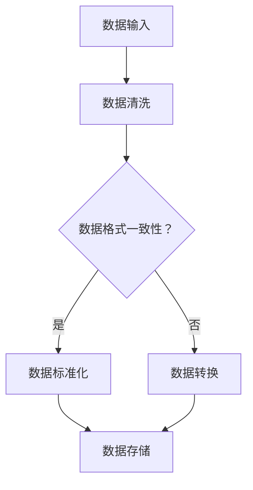

                 

在信息技术日益发展的今天，如何处理大量复杂的信息成为了许多专业人士面临的挑战。信息简化不仅是提升工作效率的关键，也是提高数据质量和系统可靠性的重要手段。本文将探讨信息简化的原则与好处，并通过具体案例展示其在实际应用中的价值。

> 关键词：信息简化、数据处理、系统可靠性、工作效率、数据质量

> 摘要：本文首先介绍了信息简化的基本原则，包括识别冗余、标准化格式和模块化设计。接着，讨论了信息简化的好处，如降低系统复杂性、提升数据处理效率和增强系统的可维护性。随后，通过实际案例，展示了信息简化在数据管理和系统开发中的具体应用。最后，文章展望了信息简化在未来的发展趋势和面临的挑战。

## 1. 背景介绍

随着互联网和大数据技术的飞速发展，企业和组织面临的信息量呈现爆炸式增长。这不仅对硬件和存储能力提出了更高的要求，也对数据处理和管理的效率提出了挑战。信息简化作为一种策略，旨在通过减少冗余、提高一致性和优化流程，从而在混乱中建立秩序。

信息简化不仅适用于数据密集型行业，如金融、医疗和零售，也对IT系统的设计、开发和维护至关重要。一个设计良好的信息系统，应该能够有效简化数据处理过程，提高系统性能，降低维护成本。

## 2. 核心概念与联系

### 2.1 信息简化的核心概念

信息简化的核心概念包括以下几个方面：

1. **识别冗余**：通过分析数据，识别并消除重复和无用的信息。
2. **标准化格式**：采用统一的格式和标准，确保数据的一致性和可读性。
3. **模块化设计**：将系统功能划分为独立的模块，便于管理和维护。

### 2.2 架构的 Mermaid 流程图

以下是一个简化的信息处理流程的 Mermaid 图：



在这个流程中，数据从输入开始，经过清洗和格式检查，最终被标准化并存储。

## 3. 核心算法原理 & 具体操作步骤

### 3.1 算法原理概述

信息简化的核心算法包括以下步骤：

1. **数据清洗**：去除数据中的错误、不一致和无用的部分。
2. **数据标准化**：将数据转换为统一的格式和结构。
3. **数据去重**：识别并消除重复的数据记录。
4. **数据存储**：将处理后的数据存储到数据库或其他存储介质。

### 3.2 算法步骤详解

1. **数据清洗**：使用过滤器和规则，识别并去除不符合要求的数据。
2. **数据标准化**：根据预定义的标准，对数据进行格式化和转换。
3. **数据去重**：通过比较数据项，识别并删除重复的记录。
4. **数据存储**：将处理后的数据存储到目标数据库或文件系统。

### 3.3 算法优缺点

**优点**：

- 提高数据质量，减少错误和冗余。
- 提高数据处理效率，降低系统负担。
- 提升系统的可维护性和扩展性。

**缺点**：

- 需要大量时间和资源进行预处理。
- 可能会丢失一些有价值的信息。

### 3.4 算法应用领域

信息简化算法广泛应用于以下几个领域：

- **数据仓库**：通过简化数据，提高数据仓库的性能和可用性。
- **商业智能**：简化数据，提高数据分析和报告的效率。
- **大数据处理**：简化海量数据，提高处理速度和资源利用率。

## 4. 数学模型和公式 & 详细讲解 & 举例说明

### 4.1 数学模型构建

信息简化过程可以使用以下数学模型来描述：

- **冗余度**（R）：表示数据中冗余信息所占的比例。
- **简化度**（S）：表示简化处理后数据中冗余信息的减少程度。

### 4.2 公式推导过程

**冗余度**（R）的计算公式：

\[ R = \frac{D_r}{D_t} \]

其中，\( D_r \) 是冗余数据的数量，\( D_t \) 是总数据数量。

**简化度**（S）的计算公式：

\[ S = 1 - R \]

### 4.3 案例分析与讲解

假设有一份数据集，其中包含1000条记录，其中有200条是重复的。那么：

- **冗余度**（R）：

\[ R = \frac{200}{1000} = 0.2 \]

- **简化度**（S）：

\[ S = 1 - R = 0.8 \]

这意味着通过简化，可以减少20%的冗余信息。

## 5. 项目实践：代码实例和详细解释说明

### 5.1 开发环境搭建

使用Python编写一个简单的信息简化脚本。开发环境要求：

- Python 3.x
- pandas库
- numpy库

### 5.2 源代码详细实现

以下是一个简单的Python脚本，用于数据去重和格式标准化：

```python
import pandas as pd

# 读取数据
data = pd.read_csv('data.csv')

# 数据清洗
data = data[data['column1'].notnull()]

# 数据标准化
data['column2'] = data['column2'].str.upper()

# 数据去重
data = data.drop_duplicates()

# 存储结果
data.to_csv('simplified_data.csv', index=False)
```

### 5.3 代码解读与分析

- **数据读取**：使用pandas库读取CSV文件。
- **数据清洗**：去除含有空值的记录。
- **数据标准化**：将某一列的数据转换为指定格式。
- **数据去重**：删除重复的记录。
- **存储结果**：将处理后的数据重新写入CSV文件。

### 5.4 运行结果展示

通过运行脚本，可以得到一个简化后的数据集，减少了冗余信息，提高了数据质量。

## 6. 实际应用场景

信息简化在多个领域有着广泛的应用：

- **金融行业**：通过简化客户数据和交易记录，提高数据分析和风险管理的效率。
- **医疗行业**：简化患者数据和医疗记录，提高数据质量和医疗服务的效率。
- **零售行业**：通过简化销售数据和库存记录，优化供应链管理和库存控制。

## 7. 工具和资源推荐

### 7.1 学习资源推荐

- **书籍**：《数据清洗：实用数据预处理技术》
- **在线课程**：Coursera上的《数据科学基础》
- **博客**：Kaggle上的数据清洗和处理的博客文章

### 7.2 开发工具推荐

- **Python**：用于数据清洗和处理的强有力工具。
- **pandas**：Python的数据分析库，支持数据清洗和格式转换。
- **PostgreSQL**：适用于大数据存储和查询的数据库系统。

### 7.3 相关论文推荐

- **论文**：《大数据环境下信息简化的研究与应用》
- **论文**：《基于信息熵的数据简化算法研究》

## 8. 总结：未来发展趋势与挑战

### 8.1 研究成果总结

信息简化在提升数据处理效率和系统性能方面取得了显著成果。未来研究将继续探索更高效的数据简化算法和自动化工具。

### 8.2 未来发展趋势

随着人工智能和自动化技术的发展，信息简化将更加智能化和自动化。同时，数据隐私和安全问题也将成为信息简化研究的重要方向。

### 8.3 面临的挑战

如何平衡信息简化和数据隐私保护，如何在简化过程中保留有价值的信息，将是未来研究的重要挑战。

### 8.4 研究展望

信息简化技术将继续在提高数据处理效率和系统性能方面发挥重要作用，同时也会在数据隐私保护和安全方面取得新的突破。

## 9. 附录：常见问题与解答

### Q1. 信息简化会影响数据的准确性吗？

A1. 适当的简化不会影响数据的准确性，但需要确保在简化过程中保留关键信息。通过仔细设计和验证简化算法，可以避免数据的失真。

### Q2. 信息简化是否适用于所有类型的数据？

A2. 信息简化适用于大部分数据类型，但特别敏感的数据（如个人身份信息）可能需要更谨慎的处理。

### Q3. 如何衡量信息简化的效果？

A3. 可以通过简化度（S）来衡量信息简化的效果，即简化后数据中冗余信息的减少比例。

作者：禅与计算机程序设计艺术 / Zen and the Art of Computer Programming
----------------------------------------------------------------

这篇文章详细探讨了信息简化的原则、好处以及在实际应用中的具体操作步骤，同时结合数学模型和代码实例，提供了深刻的见解和实用的指导。希望这篇文章能够对您在信息处理和数据管理方面的工作有所帮助。

