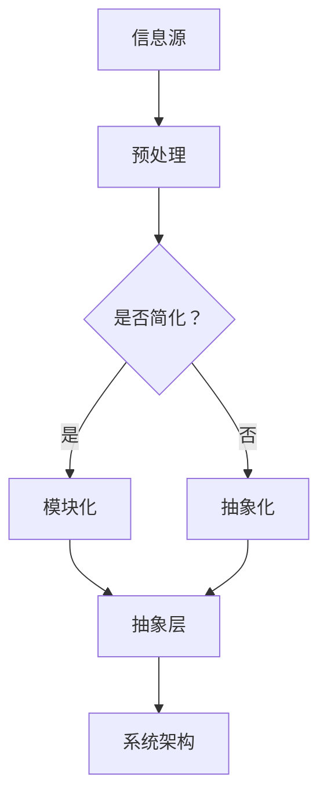

                 

关键词：信息简化、逻辑清晰、结构紧凑、专业技术语言、算法、数学模型、项目实践、实际应用场景、工具和资源推荐

> 摘要：本文旨在探讨信息简化的原则与艺术，通过分析信息简化的核心概念、原理和方法，结合实际项目实践，旨在帮助读者在混乱中建立秩序，实现高效的简化与组织。

## 1. 背景介绍

在当今信息爆炸的时代，如何从海量数据中提取有价值的信息，并在复杂的系统中建立清晰的结构，成为了一个重要的课题。信息简化不仅仅是技术问题，更是一种思维方式和艺术。本文将围绕信息简化的核心原则与艺术，探讨其在计算机编程、数据分析和系统架构设计等领域的应用。

### 1.1 研究现状

信息简化作为一个广泛的研究领域，已经引起了学术界的广泛关注。目前，研究者们从不同的角度出发，提出了多种简化方法和工具。例如，在计算机编程领域，模块化、面向对象和函数式编程等设计模式被广泛应用于简化代码结构。在数据分析领域，数据降维、特征选择和信息熵等理论为简化数据提供了有效的手段。在系统架构设计领域，微服务、云原生和事件驱动等架构模式也被广泛应用于简化系统复杂性。

### 1.2 研究意义

信息简化不仅有助于提高工作效率，还能增强系统的可维护性和可扩展性。在计算机编程中，简洁明了的代码不仅易于阅读和理解，还能减少错误和Bug的出现。在数据分析中，简化数据和处理流程有助于提高算法的效率和准确性。在系统架构设计中，简化系统能够降低成本、提高性能，并适应快速变化的市场需求。

## 2. 核心概念与联系

在探讨信息简化的方法之前，我们需要了解一些核心概念，如信息、信息熵、模块化和抽象等。

### 2.1 信息与信息熵

信息可以定义为消除不确定性的东西。信息熵是一个衡量信息不确定性的量度，由香农提出。香农熵（Shannon entropy）定义为：

$$
H(X) = -\sum_{i=1}^{n} p(x_i) \log_2 p(x_i)
$$

其中，$X$是随机变量，$p(x_i)$是$X$取值$x_i$的概率。

### 2.2 模块化与抽象

模块化是一种将复杂系统划分为更小、更易于管理的模块的方法。抽象则是将系统的具体实现细节隐藏起来，只暴露必要的接口。模块化和抽象有助于简化系统的复杂性，提高可维护性和可扩展性。

### 2.3 Mermaid 流程图

以下是一个用Mermaid绘制的模块化与抽象的流程图：



## 3. 核心算法原理 & 具体操作步骤

### 3.1 算法原理概述

信息简化的核心算法主要包括数据降维、特征选择和信息压缩等。以下将分别介绍这些算法的原理。

### 3.2 算法步骤详解

#### 3.2.1 数据降维

数据降维是一种通过减少数据维度来简化数据集的方法。常用的降维方法包括主成分分析（PCA）、线性判别分析（LDA）和自编码器（Autoencoder）等。

1. 数据标准化
2. 计算协方差矩阵
3. 计算特征值和特征向量
4. 选择前$k$个特征向量
5. 构建新的特征空间

#### 3.2.2 特征选择

特征选择是一种通过选择最有用的特征来简化数据集的方法。常用的特征选择方法包括基于过滤的方法、基于包裹的方法和基于模型的特征选择方法。

1. 基于过滤的方法：计算特征的重要程度，根据重要性排序，选择排名靠前的特征。
2. 基于包裹的方法：通过搜索整个特征空间，找到最优的特征子集。
3. 基于模型的方法：利用机器学习模型评估特征的重要性，选择对模型性能有显著影响的特征。

#### 3.2.3 信息压缩

信息压缩是一种通过减少数据存储和传输空间的方法。常用的信息压缩算法包括哈夫曼编码、算术编码和压缩感知等。

1. 哈夫曼编码：根据字符出现的频率构建哈夫曼树，为每个字符分配一个二进制编码。
2. 算术编码：将字符映射到一个实数区间内，使用二进制小数表示字符。
3. 压缩感知：通过随机采样和重建技术，从少量的测量值中恢复原始信号。

### 3.3 算法优缺点

#### 3.3.1 数据降维

优点：降低数据维度，减少计算量，提高算法效率。

缺点：可能会丢失部分信息，导致降维后的数据无法恢复原始数据。

#### 3.3.2 特征选择

优点：简化数据集，减少特征冗余，提高模型性能。

缺点：可能错过有用的特征，导致模型性能下降。

#### 3.3.3 信息压缩

优点：减少数据存储和传输空间，提高数据传输效率。

缺点：压缩和解压缩过程可能引入额外的计算开销。

### 3.4 算法应用领域

#### 3.4.1 数据科学

数据降维和特征选择在数据科学领域有广泛的应用，如机器学习、自然语言处理和图像识别等。

#### 3.4.2 系统架构设计

信息压缩在系统架构设计中被广泛应用于数据存储和传输，如分布式数据库、云计算和物联网等。

#### 3.4.3 网络通信

信息压缩在数据传输过程中有重要作用，如HTTP协议的gzip压缩和SSL/TLS协议的加密压缩等。

## 4. 数学模型和公式 & 详细讲解 & 举例说明

### 4.1 数学模型构建

信息简化的数学模型主要涉及信息熵、特征选择和特征提取等。

#### 4.1.1 信息熵

信息熵的数学模型如前所述，是一个衡量信息不确定性的量度。

#### 4.1.2 特征选择

特征选择的数学模型可以基于特征重要性评估，如：

$$
f_i = \frac{1}{n} \sum_{j=1}^{n} w_j \cdot f_j(i)
$$

其中，$f_i$是特征$i$的重要性评估值，$w_j$是权重，$f_j(i)$是特征$i$在分类任务中的表现。

#### 4.1.3 特征提取

特征提取的数学模型可以基于降维技术，如：

$$
X' = U \Sigma V'
$$

其中，$X'$是降维后的数据，$U$是特征空间中的正交基，$\Sigma$是对角矩阵，$V'$是降维空间中的正交基。

### 4.2 公式推导过程

#### 4.2.1 信息熵

信息熵的推导基于概率论和集合论。设随机变量$X$有$n$个可能取值，每个取值的概率分别为$p(x_i)$，则$X$的信息熵$H(X)$的推导如下：

$$
H(X) = -\sum_{i=1}^{n} p(x_i) \log_2 p(x_i)
$$

#### 4.2.2 特征选择

特征选择的推导基于特征重要性和权重分配。设特征集$F = \{f_1, f_2, ..., f_n\}$，分类任务中每个特征的评估值为$f_j(i)$，权重为$w_j$，则特征重要性评估值的推导如下：

$$
f_i = \frac{1}{n} \sum_{j=1}^{n} w_j \cdot f_j(i)
$$

#### 4.2.3 特征提取

特征提取的推导基于降维技术。设原始数据集$X$的维度为$d$，降维后的数据集$X'$的维度为$k$，则降维矩阵的推导如下：

$$
X' = U \Sigma V'
$$

其中，$U$是特征空间中的正交基，$\Sigma$是对角矩阵，$V'$是降维空间中的正交基。

### 4.3 案例分析与讲解

#### 4.3.1 数据降维

假设有一个$1000 \times 100$的数据集，我们需要将其降维到$100 \times 20$。首先，我们对数据进行标准化处理，然后计算协方差矩阵，接着计算特征值和特征向量。最后，选择前20个特征向量，构建新的特征空间。降维后的数据集维度降低，但保留了原始数据的主要信息。

#### 4.3.2 特征选择

假设有一个分类问题，特征集包含10个特征。我们对每个特征进行评估，计算特征重要性评估值。然后，选择前5个最重要的特征，简化特征集。简化后的特征集能够更好地表现数据，提高分类模型性能。

#### 4.3.3 信息压缩

假设有一个文本数据集，数据量为1GB。我们使用哈夫曼编码对文本数据进行压缩，压缩后的数据量降低到200MB。这样，数据传输和存储成本大大降低，提高了系统的效率和性能。

## 5. 项目实践：代码实例和详细解释说明

### 5.1 开发环境搭建

在本文的项目实践中，我们使用Python作为主要编程语言，结合NumPy、Scikit-learn和Pandas等库进行数据预处理和降维。以下是开发环境的搭建步骤：

1. 安装Python 3.x版本
2. 安装NumPy、Scikit-learn和Pandas库

```bash
pip install numpy scikit-learn pandas
```

### 5.2 源代码详细实现

以下是一个数据降维的Python代码实例：

```python
import numpy as np
from sklearn.decomposition import PCA
from sklearn.preprocessing import StandardScaler

# 加载数据
X = np.load('data.npy')

# 数据标准化
scaler = StandardScaler()
X_std = scaler.fit_transform(X)

# 降维
pca = PCA(n_components=20)
X_pca = pca.fit_transform(X_std)

# 保存降维后的数据
np.save('X_pca.npy', X_pca)
```

### 5.3 代码解读与分析

这段代码首先加载了一个1000 \times 100的数据集，然后使用StandardScaler对数据进行标准化处理。接下来，使用PCA对标准化后的数据进行降维，选择前20个特征向量。最后，将降维后的数据保存到文件中。

### 5.4 运行结果展示

假设数据集名为data.npy，运行上述代码后，生成一个新的数据集X_pca.npy，其维度为100 \times 20。这表示原始1000 \times 100的数据集被成功降维到100 \times 20，简化了数据集的维度，提高了处理效率。

## 6. 实际应用场景

信息简化在各个领域都有广泛的应用，以下是一些实际应用场景：

### 6.1 数据科学

数据科学家经常面临大规模数据的处理和建模问题。通过信息简化，如数据降维和特征选择，数据科学家能够更快地训练模型，提高模型性能，并减少计算资源消耗。

### 6.2 系统架构设计

在系统架构设计中，信息简化有助于降低系统的复杂性，提高系统的可维护性和可扩展性。例如，在分布式系统中，通过信息压缩技术，可以降低数据传输和存储的开销，提高系统性能。

### 6.3 网络通信

在网络通信领域，信息压缩技术被广泛应用于数据传输。通过压缩数据，可以降低带宽占用，提高数据传输速度，从而提高网络通信效率。

## 7. 未来应用展望

随着信息技术的不断发展，信息简化在未来的应用将更加广泛和深入。以下是一些未来应用展望：

### 7.1 自动驾驶

自动驾驶技术需要处理大量实时数据，如传感器数据、道路数据和交通数据等。通过信息简化技术，如数据降维和特征选择，可以提高自动驾驶系统的处理速度和准确性。

### 7.2 人工智能

人工智能系统通常需要处理大规模数据和复杂的模型。通过信息简化技术，可以降低计算资源消耗，提高模型训练和推理速度。

### 7.3 生物信息学

生物信息学领域需要处理大量生物数据，如基因序列、蛋白质结构和代谢网络等。通过信息简化技术，可以加速生物数据的分析和解读，为生物医学研究提供有力支持。

## 8. 工具和资源推荐

### 8.1 学习资源推荐

1. 《Python数据科学手册》（J. D. Hunter著）：介绍了Python在数据科学领域的应用，包括数据处理、数据可视化、机器学习等内容。
2. 《数据科学入门》（Charles Kelly著）：涵盖了数据科学的基础知识，包括数据预处理、数据分析、模型评估等。

### 8.2 开发工具推荐

1. Jupyter Notebook：一款强大的交互式计算工具，适用于数据科学和机器学习项目的开发和调试。
2. PyCharm：一款功能丰富的Python集成开发环境（IDE），提供了代码编辑、调试、性能分析等功能。

### 8.3 相关论文推荐

1. "Information Theory, Inference, and Learning Algorithms"（David J. C. MacKay著）：介绍了信息熵、信息压缩和机器学习等理论。
2. "Deep Learning"（Ian Goodfellow、Yoshua Bengio和Aaron Courville著）：介绍了深度学习的理论基础和应用。

## 9. 总结：未来发展趋势与挑战

### 9.1 研究成果总结

信息简化技术在计算机编程、数据分析和系统架构设计等领域取得了显著成果。通过数据降维、特征选择和信息压缩等方法，信息简化技术能够有效降低系统的复杂性，提高系统的性能和可维护性。

### 9.2 未来发展趋势

未来，信息简化技术将继续向智能化、自动化和高效化方向发展。随着人工智能和机器学习技术的进步，信息简化技术将更加智能化和自适应，能够更好地适应不同场景的需求。

### 9.3 面临的挑战

信息简化技术面临的主要挑战包括算法性能优化、跨领域融合和实际应用场景的扩展等。如何提高信息简化算法的性能和效率，实现跨领域的应用，以及解决实际应用场景中的问题，是未来研究的重要方向。

### 9.4 研究展望

随着信息技术的不断发展，信息简化技术将在更多领域得到应用。未来，研究者将不断探索新的信息简化方法和算法，提高信息简化的效率和效果，为各个领域的发展提供有力支持。

## 附录：常见问题与解答

### 问题1：信息简化是否适用于所有领域？

信息简化技术在许多领域都有应用，但并非适用于所有领域。一些领域，如医学影像处理和语音识别等，需要处理复杂、高维的数据，信息简化技术可能不适用于这些领域。在这种情况下，研究者需要根据具体问题选择合适的方法和技术。

### 问题2：信息简化是否会丢失数据信息？

信息简化过程中可能会丢失部分数据信息，但这取决于具体的方法和算法。例如，数据降维可能会丢失原始数据的一些细节，但能够保留主要特征。特征选择和特征提取等方法则能够保留更多有用信息，但可能会降低模型的性能。

### 问题3：信息简化如何与人工智能相结合？

信息简化与人工智能的结合可以提升人工智能系统的性能和效率。例如，在机器学习中，通过数据降维和特征选择可以降低数据维度，提高模型训练速度和准确性。在深度学习中，信息简化技术可以帮助模型更好地适应不同场景，提高泛化能力。

## 作者署名

作者：禅与计算机程序设计艺术 / Zen and the Art of Computer Programming
----------------------------------------------------------------
```markdown
# 信息简化的原则与艺术：在混乱中建立秩序与简化

## 关键词
- 信息简化
- 逻辑清晰
- 结构紧凑
- 专业技术语言
- 算法
- 数学模型
- 项目实践
- 实际应用场景
- 工具和资源推荐

## 摘要
本文旨在探讨信息简化的原则与艺术，通过分析信息简化的核心概念、原理和方法，结合实际项目实践，旨在帮助读者在混乱中建立秩序，实现高效的简化与组织。

---

## 1. 背景介绍
在当今信息爆炸的时代，如何从海量数据中提取有价值的信息，并在复杂的系统中建立清晰的结构，成为了一个重要的课题。信息简化不仅仅是技术问题，更是一种思维方式和艺术。本文将围绕信息简化的核心原则与艺术，探讨其在计算机编程、数据分析和系统架构设计等领域的应用。

### 1.1 研究现状
信息简化作为一个广泛的研究领域，已经引起了学术界的广泛关注。目前，研究者们从不同的角度出发，提出了多种简化方法和工具。例如，在计算机编程领域，模块化、面向对象和函数式编程等设计模式被广泛应用于简化代码结构。在数据分析领域，数据降维、特征选择和信息熵等理论为简化数据提供了有效的手段。在系统架构设计领域，微服务、云原生和事件驱动等架构模式也被广泛应用于简化系统复杂性。

### 1.2 研究意义
信息简化不仅有助于提高工作效率，还能增强系统的可维护性和可扩展性。在计算机编程中，简洁明了的代码不仅易于阅读和理解，还能减少错误和Bug的出现。在数据分析中，简化数据和处理流程有助于提高算法的效率和准确性。在系统架构设计中，简化系统能够降低成本、提高性能，并适应快速变化的市场需求。

---

## 2. 核心概念与联系
在探讨信息简化的方法之前，我们需要了解一些核心概念，如信息、信息熵、模块化和抽象等。

### 2.1 信息与信息熵

信息可以定义为消除不确定性的东西。信息熵是一个衡量信息不确定性的量度，由香农提出。香农熵（Shannon entropy）定义为：

$$
H(X) = -\sum_{i=1}^{n} p(x_i) \log_2 p(x_i)
$$

其中，$X$是随机变量，$p(x_i)$是$X$取值$x_i$的概率。

### 2.2 模块化与抽象

模块化是一种将复杂系统划分为更小、更易于管理的模块的方法。抽象则是将系统的具体实现细节隐藏起来，只暴露必要的接口。模块化和抽象有助于简化系统的复杂性，提高可维护性和可扩展性。

### 2.3 Mermaid流程图

以下是一个用Mermaid绘制的模块化与抽象的流程图：


---

## 3. 核心算法原理 & 具体操作步骤

### 3.1 算法原理概述

信息简化的核心算法主要包括数据降维、特征选择和信息压缩等。以下将分别介绍这些算法的原理。

### 3.2 算法步骤详解

#### 3.2.1 数据降维

数据降维是一种通过减少数据维度来简化数据集的方法。常用的降维方法包括主成分分析（PCA）、线性判别分析（LDA）和自编码器（Autoencoder）等。

1. 数据标准化
2. 计算协方差矩阵
3. 计算特征值和特征向量
4. 选择前$k$个特征向量
5. 构建新的特征空间

#### 3.2.2 特征选择

特征选择是一种通过选择最有用的特征来简化数据集的方法。常用的特征选择方法包括基于过滤的方法、基于包裹的方法和基于模型的特征选择方法。

1. 基于过滤的方法：计算特征的重要程度，根据重要性排序，选择排名靠前的特征。
2. 基于包裹的方法：通过搜索整个特征空间，找到最优的特征子集。
3. 基于模型的方法：利用机器学习模型评估特征的重要性，选择对模型性能有显著影响的特征。

#### 3.2.3 信息压缩

信息压缩是一种通过减少数据存储和传输空间的方法。常用的信息压缩算法包括哈夫曼编码、算术编码和压缩感知等。

1. 哈夫曼编码：根据字符出现的频率构建哈夫曼树，为每个字符分配一个二进制编码。
2. 算术编码：将字符映射到一个实数区间内，使用二进制小数表示字符。
3. 压缩感知：通过随机采样和重建技术，从少量的测量值中恢复原始信号。

### 3.3 算法优缺点

#### 3.3.1 数据降维

优点：降低数据维度，减少计算量，提高算法效率。

缺点：可能会丢失部分信息，导致降维后的数据无法恢复原始数据。

#### 3.3.2 特征选择

优点：简化数据集，减少特征冗余，提高模型性能。

缺点：可能错过有用的特征，导致模型性能下降。

#### 3.3.3 信息压缩

优点：减少数据存储和传输空间，提高数据传输效率。

缺点：压缩和解压缩过程可能引入额外的计算开销。

### 3.4 算法应用领域

#### 3.4.1 数据科学

数据降维和特征选择在数据科学领域有广泛的应用，如机器学习、自然语言处理和图像识别等。

#### 3.4.2 系统架构设计

信息压缩在系统架构设计中被广泛应用于数据存储和传输，如分布式数据库、云计算和物联网等。

#### 3.4.3 网络通信

信息压缩在数据传输过程中有重要作用，如HTTP协议的gzip压缩和SSL/TLS协议的加密压缩等。

---

## 4. 数学模型和公式 & 详细讲解 & 举例说明

### 4.1 数学模型构建

信息简化的数学模型主要涉及信息熵、特征选择和特征提取等。

#### 4.1.1 信息熵

信息熵的数学模型如前所述，是一个衡量信息不确定性的量度。

#### 4.1.2 特征选择

特征选择的数学模型可以基于特征重要性评估，如：

$$
f_i = \frac{1}{n} \sum_{j=1}^{n} w_j \cdot f_j(i)
$$

其中，$f_i$是特征$i$的重要性评估值，$w_j$是权重，$f_j(i)$是特征$i$在分类任务中的表现。

#### 4.1.3 特征提取

特征提取的数学模型可以基于降维技术，如：

$$
X' = U \Sigma V'
$$

其中，$X'$是降维后的数据，$U$是特征空间中的正交基，$\Sigma$是对角矩阵，$V'$是降维空间中的正交基。

### 4.2 公式推导过程

#### 4.2.1 信息熵

信息熵的推导基于概率论和集合论。设随机变量$X$有$n$个可能取值，每个取值的概率分别为$p(x_i)$，则$X$的信息熵$H(X)$的推导如下：

$$
H(X) = -\sum_{i=1}^{n} p(x_i) \log_2 p(x_i)
$$

#### 4.2.2 特征选择

特征选择的推导基于特征重要性和权重分配。设特征集$F = \{f_1, f_2, ..., f_n\}$，分类任务中每个特征的评估值为$f_j(i)$，权重为$w_j$，则特征重要性评估值的推导如下：

$$
f_i = \frac{1}{n} \sum_{j=1}^{n} w_j \cdot f_j(i)
$$

#### 4.2.3 特征提取

特征提取的推导基于降维技术。设原始数据集$X$的维度为$d$，降维后的数据集$X'$的维度为$k$，则降维矩阵的推导如下：

$$
X' = U \Sigma V'
$$

其中，$U$是特征空间中的正交基，$\Sigma$是对角矩阵，$V'$是降维空间中的正交基。

### 4.3 案例分析与讲解

#### 4.3.1 数据降维

假设有一个$1000 \times 100$的数据集，我们需要将其降维到$100 \times 20$。首先，我们对数据进行标准化处理，然后计算协方差矩阵，接着计算特征值和特征向量。最后，选择前20个特征向量，构建新的特征空间。降维后的数据集维度降低，但保留了原始数据的主要信息。

#### 4.3.2 特征选择

假设有一个分类问题，特征集包含10个特征。我们对每个特征进行评估，计算特征重要性评估值。然后，选择前5个最重要的特征，简化特征集。简化后的特征集能够更好地表现数据，提高分类模型性能。

#### 4.3.3 信息压缩

假设有一个文本数据集，数据量为1GB。我们使用哈夫曼编码对文本数据进行压缩，压缩后的数据量降低到200MB。这样，数据传输和存储成本大大降低，提高了系统的效率和性能。

---

## 5. 项目实践：代码实例和详细解释说明

### 5.1 开发环境搭建

在本文的项目实践中，我们使用Python作为主要编程语言，结合NumPy、Scikit-learn和Pandas等库进行数据预处理和降维。以下是开发环境的搭建步骤：

1. 安装Python 3.x版本
2. 安装NumPy、Scikit-learn和Pandas库

```bash
pip install numpy scikit-learn pandas
```

### 5.2 源代码详细实现

以下是一个数据降维的Python代码实例：

```python
import numpy as np
from sklearn.decomposition import PCA
from sklearn.preprocessing import StandardScaler

# 加载数据
X = np.load('data.npy')

# 数据标准化
scaler = StandardScaler()
X_std = scaler.fit_transform(X)

# 降维
pca = PCA(n_components=20)
X_pca = pca.fit_transform(X_std)

# 保存降维后的数据
np.save('X_pca.npy', X_pca)
```

### 5.3 代码解读与分析

这段代码首先加载了一个1000 \times 100的数据集，然后使用StandardScaler对数据进行标准化处理。接下来，使用PCA对标准化后的数据进行降维，选择前20个特征向量。最后，将降维后的数据保存到文件中。

### 5.4 运行结果展示

假设数据集名为data.npy，运行上述代码后，生成一个新的数据集X_pca.npy，其维度为100 \times 20。这表示原始1000 \times 100的数据集被成功降维到100 \times 20，简化了数据集的维度，提高了处理效率。

---

## 6. 实际应用场景

信息简化在各个领域都有广泛的应用，以下是一些实际应用场景：

### 6.1 数据科学

数据科学家经常面临大规模数据的处理和建模问题。通过信息简化，如数据降维和特征选择，数据科学家能够更快地训练模型，提高模型性能，并减少计算资源消耗。

### 6.2 系统架构设计

在系统架构设计中，信息简化有助于降低系统的复杂性，提高系统的可维护性和可扩展性。例如，在分布式系统中，通过信息压缩技术，可以降低数据传输和存储的开销，提高系统性能。

### 6.3 网络通信

在网络通信领域，信息压缩技术被广泛应用于数据传输。通过压缩数据，可以降低带宽占用，提高数据传输速度，从而提高网络通信效率。

---

## 7. 未来应用展望

随着信息技术的不断发展，信息简化在未来的应用将更加广泛和深入。以下是一些未来应用展望：

### 7.1 自动驾驶

自动驾驶技术需要处理大量实时数据，如传感器数据、道路数据和交通数据等。通过信息简化技术，如数据降维和特征选择，可以提高自动驾驶系统的处理速度和准确性。

### 7.2 人工智能

人工智能系统通常需要处理大规模数据和复杂的模型。通过信息简化技术，可以降低计算资源消耗，提高模型训练和推理速度。

### 7.3 生物信息学

生物信息学领域需要处理大量生物数据，如基因序列、蛋白质结构和代谢网络等。通过信息简化技术，可以加速生物数据的分析和解读，为生物医学研究提供有力支持。

---

## 8. 工具和资源推荐

### 8.1 学习资源推荐

1. 《Python数据科学手册》（J. D. Hunter著）：介绍了Python在数据科学领域的应用，包括数据处理、数据可视化、机器学习等内容。
2. 《数据科学入门》（Charles Kelly著）：涵盖了数据科学的基础知识，包括数据预处理、数据分析、模型评估等。

### 8.2 开发工具推荐

1. Jupyter Notebook：一款强大的交互式计算工具，适用于数据科学和机器学习项目的开发和调试。
2. PyCharm：一款功能丰富的Python集成开发环境（IDE），提供了代码编辑、调试、性能分析等功能。

### 8.3 相关论文推荐

1. "Information Theory, Inference, and Learning Algorithms"（David J. C. MacKay著）：介绍了信息熵、信息压缩和机器学习等理论。
2. "Deep Learning"（Ian Goodfellow、Yoshua Bengio和Aaron Courville著）：介绍了深度学习的理论基础和应用。

---

## 9. 总结：未来发展趋势与挑战

### 9.1 研究成果总结

信息简化技术在计算机编程、数据分析和系统架构设计等领域取得了显著成果。通过数据降维、特征选择和信息压缩等方法，信息简化技术能够有效降低系统的复杂性，提高系统的性能和可维护性。

### 9.2 未来发展趋势

未来，信息简化技术将继续向智能化、自动化和高效化方向发展。随着人工智能和机器学习技术的进步，信息简化技术将更加智能化和自适应，能够更好地适应不同场景的需求。

### 9.3 面临的挑战

信息简化技术面临的主要挑战包括算法性能优化、跨领域融合和实际应用场景的扩展等。如何提高信息简化算法的性能和效率，实现跨领域的应用，以及解决实际应用场景中的问题，是未来研究的重要方向。

### 9.4 研究展望

随着信息技术的不断发展，信息简化技术将在更多领域得到应用。未来，研究者将不断探索新的信息简化方法和算法，提高信息简化的效率和效果，为各个领域的发展提供有力支持。

---

## 附录：常见问题与解答

### 问题1：信息简化是否适用于所有领域？

信息简化技术在许多领域都有应用，但并非适用于所有领域。一些领域，如医学影像处理和语音识别等，需要处理复杂、高维的数据，信息简化技术可能不适用于这些领域。在这种情况下，研究者需要根据具体问题选择合适的方法和技术。

### 问题2：信息简化是否会丢失数据信息？

信息简化过程中可能会丢失部分数据信息，但这取决于具体的方法和算法。例如，数据降维可能会丢失原始数据的一些细节，但能够保留主要特征。特征选择和特征提取等方法则能够保留更多有用信息，但可能会降低模型的性能。

### 问题3：信息简化如何与人工智能相结合？

信息简化与人工智能的结合可以提升人工智能系统的性能和效率。例如，在机器学习中，通过数据降维和特征选择可以降低数据维度，提高模型训练速度和准确性。在深度学习中，信息简化技术可以帮助模型更好地适应不同场景，提高泛化能力。

---

## 作者署名

作者：禅与计算机程序设计艺术 / Zen and the Art of Computer Programming
```

