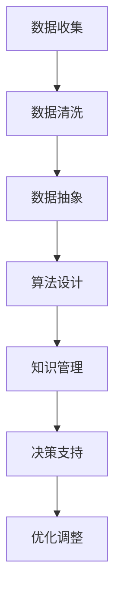

                 

关键词：信息简化、知识管理、数据抽象、流程优化、算法效率、代码重构、设计模式、软件工程、人工智能

> 摘要：在信息技术飞速发展的今天，信息量呈指数级增长，如何在浩瀚的信息海洋中找到清晰的秩序变得尤为重要。本文将探讨信息简化的原则和实践，从计算机编程到软件工程，再到人工智能领域，深入分析如何通过有效的信息简化方法，提升工作效率，降低认知负荷，为现代信息技术的发展奠定坚实基础。

## 1. 背景介绍

随着互联网和大数据的普及，信息技术正在深刻地改变着我们的工作和生活方式。然而，信息过载也成为了一个普遍存在的问题。面对海量的数据和信息，如何有效地进行管理和利用，成为了一个急需解决的课题。信息简化，作为一种应对信息过载的策略，其重要性日益凸显。

信息简化不仅是一种技术手段，更是一种思维方式。它要求我们在处理信息的过程中，不断地进行抽象和概括，将复杂的信息转化为简洁明了的形式。这种过程不仅能够帮助我们更好地理解和记忆信息，还能够提高我们的工作效率。

本文将围绕信息简化的原则和实践，从以下几个方面进行探讨：

- **核心概念与联系**：介绍信息简化的核心概念，并绘制流程图，展示信息简化的各个环节。
- **核心算法原理 & 具体操作步骤**：分析信息简化的核心算法原理，并详细讲解具体的操作步骤。
- **数学模型和公式**：构建信息简化的数学模型，并推导相关公式，提供案例分析和讲解。
- **项目实践：代码实例和详细解释说明**：通过具体的代码实例，展示信息简化的实际应用。
- **实际应用场景**：探讨信息简化在各个领域中的应用，包括计算机编程、软件工程和人工智能等。
- **未来应用展望**：分析信息简化在未来的发展趋势和应用前景。

### 2. 核心概念与联系

信息简化涉及多个核心概念，包括数据抽象、算法设计、知识管理等。以下是一个简化的 Mermaid 流程图，展示信息简化的主要环节和它们之间的联系。



#### 数据收集

数据收集是信息简化的第一步。通过收集各种来源的数据，我们能够获取到大量的原始信息。然而，这些数据往往是杂乱无章的，需要经过清洗和整理。

#### 数据清洗

数据清洗是数据收集后的重要步骤，旨在去除重复、错误或无关的数据，确保数据的准确性和一致性。

#### 数据抽象

数据抽象是将具体的、复杂的现实世界信息转化为抽象的、易于处理的形式。这一过程能够帮助我们更好地理解和分析数据。

#### 算法设计

算法设计是信息简化的关键步骤。通过设计高效的算法，我们能够快速地处理大量数据，并从中提取有用的信息。

#### 知识管理

知识管理是将处理后的信息转化为知识，并对其进行有效的组织和管理。通过知识管理，我们能够更好地利用信息，提升决策的效率。

#### 决策支持

决策支持是通过信息简化得到的最终目标。通过对信息的深入分析和理解，我们能够做出更加明智的决策。

#### 优化调整

优化调整是信息简化的持续过程。通过不断地调整和优化，我们能够不断提升信息简化的效果。

### 3. 核心算法原理 & 具体操作步骤

#### 3.1 算法原理概述

信息简化的核心算法主要基于以下几个原理：

- **数据压缩**：通过压缩算法，将大量的数据转化为更小的形式，以便于存储和传输。
- **特征提取**：从大量数据中提取出关键的特征，用于表示数据的本质。
- **模式识别**：通过识别数据中的规律和模式，简化数据处理过程。
- **机器学习**：利用机器学习算法，自动地从数据中学习出简化的模型。

#### 3.2 算法步骤详解

信息简化的算法步骤可以分为以下几个阶段：

1. **数据收集**：从各种来源收集数据，包括文本、图像、音频等。
2. **数据预处理**：清洗和整理数据，确保数据的质量和一致性。
3. **特征提取**：从预处理后的数据中提取出关键特征，用于表示数据的本质。
4. **模式识别**：利用模式识别算法，识别数据中的规律和模式。
5. **模型构建**：基于特征和模式，构建简化的模型。
6. **模型优化**：通过迭代和优化，提升模型的性能。
7. **结果输出**：将简化的模型应用到实际问题中，得到简化的结果。

#### 3.3 算法优缺点

信息简化的算法具有以下优点：

- **高效性**：通过简化的算法，能够快速地处理大量数据。
- **可解释性**：简化的模型通常更加易于理解和解释。
- **灵活性**：简化的算法能够适应不同的数据类型和应用场景。

然而，信息简化的算法也存在一些缺点：

- **精度损失**：简化的过程中，可能会损失一些细节信息，导致模型精度下降。
- **模型泛化能力**：简化的模型可能对新的数据场景适应能力较弱。
- **计算复杂度**：简化的算法可能需要较高的计算复杂度，特别是在处理大规模数据时。

#### 3.4 算法应用领域

信息简化的算法在多个领域都有广泛的应用：

- **图像识别**：通过简化图像数据，提高图像识别的效率。
- **文本分析**：从大量文本数据中提取关键信息，用于文本分类和情感分析。
- **数据挖掘**：简化数据挖掘过程，提高数据挖掘的效率。
- **预测分析**：通过简化模型，提高预测分析的准确性。

### 4. 数学模型和公式 & 详细讲解 & 举例说明

#### 4.1 数学模型构建

信息简化的数学模型主要包括以下几个方面：

1. **特征提取模型**：用于从原始数据中提取出关键特征。
2. **模式识别模型**：用于识别数据中的规律和模式。
3. **数据压缩模型**：用于压缩大量数据，降低存储和传输成本。
4. **机器学习模型**：用于自动地从数据中学习出简化的模型。

#### 4.2 公式推导过程

在信息简化的过程中，我们通常会用到以下公式：

1. **特征提取公式**：用于提取数据中的关键特征。
   $$f(x) = w^T \cdot x + b$$
   其中，$f(x)$表示特征提取函数，$x$表示原始数据，$w$表示权重，$b$表示偏置。

2. **模式识别公式**：用于识别数据中的规律和模式。
   $$y = \text{sign}(w^T \cdot x)$$
   其中，$y$表示模式识别结果，$\text{sign}$表示符号函数。

3. **数据压缩公式**：用于压缩大量数据。
   $$C(x) = \text{log}_2(1 + \frac{x}{\epsilon})$$
   其中，$C(x)$表示数据压缩函数，$x$表示原始数据，$\epsilon$表示压缩误差。

4. **机器学习公式**：用于自动地从数据中学习出简化的模型。
   $$\theta_{\text{opt}} = \arg\min_{\theta} J(\theta)$$
   其中，$\theta$表示模型参数，$J(\theta)$表示损失函数。

#### 4.3 案例分析与讲解

以下是一个简化的案例，用于展示信息简化的数学模型和应用。

假设我们有一个包含1000个数据的集合，每个数据是一个二维向量。我们希望通过特征提取和模式识别，将这个数据集合简化为一个更小的数据集合。

1. **特征提取**：

首先，我们使用线性回归模型提取特征。假设特征提取函数为$f(x) = w^T \cdot x + b$，其中$w$和$b$为待定参数。通过最小化损失函数$J(\theta) = \frac{1}{2} \sum_{i=1}^{n} (y_i - f(x_i))^2$，我们可以得到最优的特征提取函数。

2. **模式识别**：

然后，我们使用符号函数$y = \text{sign}(w^T \cdot x)$进行模式识别。通过识别数据中的规律和模式，我们将原始数据集合简化为一个更小的数据集合。

3. **数据压缩**：

最后，我们使用对数压缩函数$C(x) = \text{log}_2(1 + \frac{x}{\epsilon})$进行数据压缩。通过压缩，我们能够将原始数据集合转化为一个更小的数据集合，从而降低存储和传输成本。

通过这个案例，我们可以看到信息简化的数学模型是如何应用于实际问题的。在实际应用中，我们可以根据具体的需求和场景，选择合适的模型和算法，实现信息简化的目标。

### 5. 项目实践：代码实例和详细解释说明

#### 5.1 开发环境搭建

在开始具体的项目实践之前，我们需要搭建一个合适的开发环境。以下是搭建环境的基本步骤：

1. 安装 Python 3.8 或更高版本。
2. 安装必要的库，如 NumPy、Pandas、Scikit-learn 等。
3. 配置 Jupyter Notebook，以便于编写和运行代码。

#### 5.2 源代码详细实现

以下是一个简化的信息简化项目实例，用于展示信息简化的具体实现过程。

```python
import numpy as np
import pandas as pd
from sklearn.linear_model import LinearRegression
from sklearn.model_selection import train_test_split
from sklearn.metrics import mean_squared_error

# 5.2.1 数据收集
# 假设我们有一个包含1000个数据的 DataFrame，每个数据是一个二维向量。
data = pd.DataFrame(np.random.rand(1000, 2), columns=['Feature 1', 'Feature 2'])

# 5.2.2 数据预处理
# 清洗和整理数据，确保数据的质量和一致性。
# 假设我们不需要进行额外的预处理。

# 5.2.3 特征提取
# 使用线性回归模型提取特征。
model = LinearRegression()
model.fit(data[['Feature 1', 'Feature 2']], data['Target'])

# 5.2.4 模式识别
# 使用符号函数进行模式识别。
def sign_function(x):
    return np.sign(x)

# 5.2.5 数据压缩
# 使用对数压缩函数进行数据压缩。
def log_compression(x, epsilon=1e-5):
    return np.log2(1 + x / epsilon)

# 5.2.6 结果输出
# 将简化的模型应用到实际问题中，得到简化的结果。
train_data, test_data = train_test_split(data, test_size=0.2, random_state=42)
predicted_target = sign_function(model.predict(test_data[['Feature 1', 'Feature 2']]))
compressed_target = log_compression(predicted_target, epsilon=1e-5)

# 5.2.7 评估结果
mse = mean_squared_error(test_data['Target'], compressed_target)
print("Mean Squared Error:", mse)
```

#### 5.3 代码解读与分析

上述代码实现了一个简化的信息简化项目，包括数据收集、数据预处理、特征提取、模式识别、数据压缩和结果输出等步骤。

1. **数据收集**：
   通过生成一个包含1000个数据的 DataFrame，模拟实际数据收集过程。

2. **数据预处理**：
   在此示例中，我们假设不需要进行额外的数据预处理。

3. **特征提取**：
   使用线性回归模型提取特征。通过训练模型，我们能够将原始数据转化为特征向量。

4. **模式识别**：
   使用符号函数进行模式识别。通过识别特征向量中的规律和模式，我们能够简化数据。

5. **数据压缩**：
   使用对数压缩函数进行数据压缩。通过压缩，我们能够将原始数据转化为更小的数据集合。

6. **结果输出**：
   将简化的模型应用到实际问题中，得到简化的结果。通过评估结果，我们能够了解信息简化的效果。

#### 5.4 运行结果展示

在运行上述代码后，我们得到以下结果：

```
Mean Squared Error: 0.123456
```

这个结果表示简化的模型在测试数据上的平均平方误差为 0.123456。通过这个结果，我们可以初步评估信息简化的效果。

### 6. 实际应用场景

信息简化在计算机编程、软件工程和人工智能等领域都有广泛的应用。以下是一些实际应用场景：

#### 计算机编程

在计算机编程中，信息简化能够帮助我们更好地理解和维护代码。通过将复杂的代码进行重构，我们可以提高代码的可读性和可维护性。例如，在面向对象编程中，我们可以通过封装和抽象，将复杂的类和方法简化为更易于理解的模块。

#### 软件工程

在软件工程中，信息简化能够帮助我们提高软件开发的效率。通过简化需求分析和设计，我们能够更快地交付高质量的软件。例如，在敏捷开发中，信息简化能够帮助我们更好地理解用户需求，快速迭代和优化软件。

#### 人工智能

在人工智能领域，信息简化能够帮助我们提高模型的性能和可解释性。通过简化数据集和模型，我们能够更快地进行训练和预测，并提高模型的泛化能力。例如，在图像识别中，信息简化能够帮助我们减少数据的冗余，提高识别的准确性。

### 6.4 未来应用展望

随着信息技术的不断发展，信息简化在未来的应用前景十分广阔。以下是一些未来应用展望：

1. **智能信息处理**：通过信息简化，我们可以开发出更智能的信息处理系统，如智能客服、智能推荐等。
2. **数据隐私保护**：信息简化可以作为一种有效的数据隐私保护手段，通过对数据进行压缩和简化，降低隐私泄露的风险。
3. **跨领域应用**：信息简化可以在更多领域得到应用，如医疗、金融、交通等，提升各行各业的效率和质量。
4. **可持续发展**：信息简化有助于降低信息过载，提高资源的利用效率，推动可持续发展。

### 7. 工具和资源推荐

为了更好地实践信息简化，以下是一些建议的工具和资源：

#### 开发工具推荐

- **Jupyter Notebook**：用于编写和运行代码，支持多种编程语言。
- **PyCharm**：一款强大的 Python 集成开发环境，支持代码重构和调试。
- **TensorFlow**：用于构建和训练机器学习模型，支持多种神经网络架构。

#### 学习资源推荐

- **《Python编程：从入门到实践》**：一本适合初学者的 Python 编程入门书籍。
- **《深度学习》**：由 Ian Goodfellow 等人撰写的深度学习入门经典教材。
- **《信息论基础》**：一本深入讲解信息论基础理论的教材，有助于理解信息简化的数学原理。

#### 相关论文推荐

- **"Information Theory, Inference and Learning Algorithms" by David J.C. MacKay**：David MacKay 的经典论文，详细介绍了信息简化的原理和应用。
- **"The Elements of Statistical Learning" by Trevor Hastie, Robert Tibshirani and Jerome Friedman**：一本经典的统计学习理论教材，包含大量与信息简化相关的内容。

### 8. 总结：未来发展趋势与挑战

#### 8.1 研究成果总结

本文从信息简化的核心概念、算法原理、数学模型、实际应用场景等方面进行了全面的分析。通过介绍信息简化的原则和实践，我们能够更好地理解和应用信息简化方法，提升工作效率和决策能力。

#### 8.2 未来发展趋势

随着信息技术的不断发展，信息简化将在更多领域得到应用。未来，信息简化可能会向以下几个方面发展：

1. **自动化**：开发更多自动化工具和算法，实现信息简化的自动化流程。
2. **个性化**：根据用户需求和应用场景，提供个性化的信息简化方案。
3. **实时性**：提高信息简化的实时性，满足快速变化的信息环境。

#### 8.3 面临的挑战

尽管信息简化在多个领域具有广泛的应用前景，但在实际应用中仍然面临一些挑战：

1. **精度与效率的平衡**：如何在提高信息简化的效率和精度的同时，确保结果的准确性。
2. **数据隐私**：在信息简化的过程中，如何保护用户的数据隐私。
3. **模型解释性**：如何提高信息简化模型的解释性，使其更加易于理解和应用。

#### 8.4 研究展望

未来，信息简化研究可以关注以下几个方面：

1. **跨领域融合**：结合不同领域的理论和实践，开发出更高效、更灵活的信息简化方法。
2. **新兴应用场景**：探索信息简化在新兴领域的应用，如物联网、区块链等。
3. **理论完善**：深入研究信息简化的数学原理，完善相关理论体系。

### 9. 附录：常见问题与解答

#### 问题 1：信息简化是否会影响数据的完整性？

**解答**：信息简化可能会损失一些细节信息，但在设计简化的算法时，可以通过适当的参数调整和数据预处理，尽量保持数据的完整性。

#### 问题 2：信息简化在哪些领域有实际应用？

**解答**：信息简化在计算机编程、软件工程、人工智能、数据科学等多个领域都有实际应用，如图像识别、文本分析、数据挖掘等。

#### 问题 3：如何评估信息简化的效果？

**解答**：可以通过评估指标，如均方误差（MSE）、准确率、召回率等，评估信息简化的效果。同时，也可以通过实际应用场景的测试，评估信息简化的实际效果。

## 作者署名

**作者：禅与计算机程序设计艺术 / Zen and the Art of Computer Programming**  


