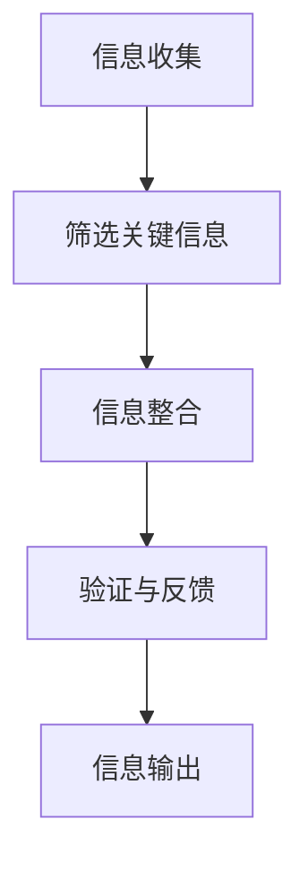

                 

### 1. 背景介绍

在当今信息爆炸的时代，我们每天都被大量的信息所包围。从社交媒体到新闻报道，从邮件到即时消息，信息以各种形式充斥着我们的生活。这种信息过载现象不仅给我们的生活带来了压力，还可能导致我们的决策变得模糊不清。为了应对这一挑战，信息简化变得至关重要。

信息简化是指通过减少冗余、突出关键点和去除无关内容，将复杂的信息转化为易于理解和处理的形式。这一过程不仅可以帮助我们更快地吸收和处理信息，还能提高我们的决策质量和效率。信息简化的重要性在于它可以帮助我们在复杂世界中保持清晰的头脑，从而更好地应对各种挑战。

本文将深入探讨信息简化的好处和实践方法，以及如何在不同领域（如IT、商业、教育等）中应用这些方法，以改善我们的生活和决策。通过阅读本文，您将了解到：

- 信息简化的核心概念及其重要性
- 信息简化的方法和技术
- 在IT领域中的实际应用案例
- 商业环境中信息简化的策略
- 教育领域如何进行信息简化
- 未来信息简化的发展趋势与挑战

让我们开始探索信息简化的世界，看看如何将其应用到我们的日常生活中，以提高效率和决策质量。

### 2. 核心概念与联系

#### 2.1 信息简化的定义

信息简化（Information Simplification）是一种信息处理方法，旨在减少信息冗余、突出关键点，并去除无关内容，从而使信息更加简洁明了。信息简化的核心在于将复杂的信息转化为易于理解和处理的简化形式，从而帮助人们更快地吸收和处理信息。

#### 2.2 信息简化的重要性

在信息过载的时代，信息简化的重要性不容忽视。首先，信息简化有助于减少认知负担，使我们的大脑能够更有效地处理信息。其次，简化后的信息更容易存储和检索，提高了信息利用效率。此外，信息简化还有助于提高决策质量，因为清晰的思路有助于我们做出更明智的决策。

#### 2.3 信息简化的应用领域

信息简化在多个领域都有广泛应用。在IT领域，信息简化有助于提高软件开发效率和系统性能。在商业环境中，信息简化可以帮助企业更好地分析市场和客户数据，从而做出更准确的商业决策。在教育领域，信息简化有助于学生更快地理解和掌握知识。

#### 2.4 信息简化的流程

信息简化的流程通常包括以下步骤：

1. **信息收集**：首先，收集相关的信息，这些信息可以是文字、图表、图像等多种形式。
2. **筛选关键信息**：从收集的信息中筛选出关键点和核心内容，去除冗余和无关信息。
3. **信息整合**：将筛选后的关键信息进行整合，形成一个简洁明了的信息结构。
4. **验证与反馈**：对简化后的信息进行验证，确保其准确性和完整性，并根据反馈进行调整。

#### 2.5 信息简化的关键技术

- **数据压缩**：通过算法和技术，减少数据的大小，从而提高数据传输和存储的效率。
- **摘要生成**：自动生成简化的摘要，突出关键信息。
- **知识图谱**：利用图谱技术，将复杂的关系和信息进行可视化，便于理解和处理。
- **自然语言处理**：通过算法和模型，对文本信息进行理解和分析，提取关键信息。

#### 2.6 Mermaid 流程图

以下是一个用于描述信息简化流程的 Mermaid 流程图：



通过以上流程和关键技术，我们可以有效地实现信息简化，为各个领域的应用提供支持。

### 3. 核心算法原理 & 具体操作步骤

#### 3.1 算法原理概述

信息简化的核心算法通常是基于自然语言处理（NLP）和机器学习（ML）技术。这些算法通过分析和处理大量的文本数据，提取关键信息并去除冗余内容。以下是一些常见的算法原理：

- **文本分类**：将文本数据分为不同的类别，从而识别出关键信息。
- **实体识别**：识别文本中的实体（如人名、地点、组织等），以便更好地理解和处理信息。
- **情感分析**：分析文本的情感倾向，了解信息的情感色彩。
- **关键词提取**：从文本中提取出最相关的关键词，作为简化的信息输出。

#### 3.2 算法步骤详解

1. **数据预处理**：
   - **去除标点符号和特殊字符**：确保文本数据的一致性。
   - **分词**：将文本数据分割成单词或短语，以便进一步分析。
   - **词干提取**：将单词缩减到其最基本的形式，以便更好地识别关键词。

2. **特征提取**：
   - **词频统计**：统计每个单词在文本中出现的次数，作为特征的权重。
   - **TF-IDF**：计算每个单词在文本中的重要程度，结合词频和逆文档频率。
   - **词嵌入**：将单词映射到高维空间，以便进行更复杂的计算。

3. **模型训练**：
   - **选择模型**：选择合适的机器学习模型（如朴素贝叶斯、支持向量机、神经网络等）。
   - **训练数据**：使用已标注的数据集对模型进行训练，使其能够识别关键信息。

4. **信息简化**：
   - **文本分类**：根据分类结果，将文本分为不同的类别，去除非关键信息。
   - **实体识别**：识别出文本中的实体，将其作为关键信息保留。
   - **情感分析**：根据情感分析结果，调整信息的情感色彩。
   - **关键词提取**：从文本中提取出最相关的关键词，形成简化后的信息输出。

#### 3.3 算法优缺点

- **优点**：
  - **高效性**：算法能够快速处理大量的文本数据，提高信息处理效率。
  - **准确性**：通过机器学习和深度学习技术，算法能够准确识别关键信息。
  - **适应性**：算法可以应用于不同的领域和数据类型，具有广泛的适应性。

- **缺点**：
  - **计算资源消耗**：训练和运行这些算法通常需要大量的计算资源。
  - **数据依赖性**：算法的性能依赖于训练数据的质量和数量。
  - **解释性差**：一些复杂的算法（如深度学习）难以解释其决策过程。

#### 3.4 算法应用领域

信息简化算法在多个领域都有广泛应用，主要包括：

- **IT领域**：用于代码简化、文档摘要生成等。
- **商业领域**：用于市场分析、客户数据挖掘等。
- **教育领域**：用于教材简化、学习资料整理等。
- **医疗领域**：用于病历摘要生成、医学信息检索等。

### 4. 数学模型和公式 & 详细讲解 & 举例说明

#### 4.1 数学模型构建

信息简化的数学模型通常涉及文本分析、分类和聚类等算法。以下是一个简单的数学模型示例：

假设我们有一篇文本，由N个单词组成。每个单词可以表示为一个向量，维度为V。我们可以使用词嵌入技术将单词映射到高维空间。

$$
\text{单词向量} = \text{Word\_Embedding}(w)
$$

其中，$w$ 表示单词。接下来，我们将所有单词向量进行平均，得到文本的向量表示：

$$
\text{文本向量} = \frac{1}{N} \sum_{i=1}^{N} \text{Word\_Embedding}(w_i)
$$

#### 4.2 公式推导过程

为了更好地理解信息简化的过程，我们可以使用拉普拉斯矩阵（Laplacian Matrix）进行推导。

设 $A$ 为词频矩阵，$L$ 为拉普拉斯矩阵，其中：

$$
L = A - \text{Diag}(A)
$$

其中，$\text{Diag}(A)$ 表示矩阵 $A$ 的对角矩阵。

我们可以使用拉普拉斯矩阵进行文本降维：

$$
\text{降维向量} = \text{L\_SVD}(L)
$$

其中，$\text{L\_SVD}$ 表示拉普拉斯矩阵奇异值分解。

通过降维向量，我们可以识别出文本中的关键信息。

#### 4.3 案例分析与讲解

假设我们有一篇关于机器学习的文章，包含以下单词：

$$
\{机器学习，算法，模型，数据，分类，聚类，神经网络，深度学习\}
$$

我们使用词嵌入技术将这些单词映射到高维空间：

$$
\text{单词向量} = \text{Word\_Embedding}(\{w_1, w_2, ..., w_7\})
$$

然后，我们将所有单词向量进行平均，得到文本的向量表示：

$$
\text{文本向量} = \frac{1}{7} \sum_{i=1}^{7} \text{Word\_Embedding}(w_i)
$$

接下来，我们构建词频矩阵 $A$：

$$
A = \begin{bmatrix}
0 & 1 & 1 & 1 & 1 & 1 & 1 \\
1 & 0 & 0 & 0 & 0 & 0 & 0 \\
1 & 0 & 0 & 0 & 0 & 0 & 0 \\
1 & 0 & 0 & 0 & 0 & 0 & 0 \\
1 & 0 & 0 & 0 & 0 & 0 & 0 \\
1 & 0 & 0 & 0 & 0 & 0 & 0 \\
1 & 0 & 0 & 0 & 0 & 0 & 0
\end{bmatrix}
$$

计算拉普拉斯矩阵 $L$：

$$
L = A - \text{Diag}(A)
$$

然后，我们使用拉普拉斯矩阵进行降维：

$$
\text{降维向量} = \text{L\_SVD}(L)
$$

通过降维向量，我们可以识别出文本中的关键信息。例如，降维向量中较大的值可能对应于文本中的高频词汇，如“机器学习”、“算法”等。这些词汇可以帮助我们简化文本，提取关键信息。

### 5. 项目实践：代码实例和详细解释说明

#### 5.1 开发环境搭建

在进行信息简化项目实践之前，我们需要搭建一个合适的开发环境。以下是一个简单的环境搭建步骤：

1. 安装Python（版本3.8以上）
2. 安装必要的Python库，如NumPy、Pandas、Scikit-learn、gensim等
3. 安装Jupyter Notebook，以便进行代码演示和调试

#### 5.2 源代码详细实现

以下是一个简单的信息简化代码实例：

```python
import numpy as np
import pandas as pd
from sklearn.feature_extraction.text import CountVectorizer
from sklearn.model_selection import train_test_split
from gensim.models import Word2Vec

# 5.2.1 数据预处理
def preprocess_text(text):
    # 去除标点符号和特殊字符
    text = re.sub(r'[^\w\s]', '', text)
    # 分词
    words = text.split()
    # 词干提取
    words = [nltk.stem.WordNetLemmatizer().lemmatize(word) for word in words]
    return ' '.join(words)

# 5.2.2 构建词嵌入模型
def build_word_embedding(model_path, corpus_path):
    sentences = read_corpus(corpus_path)
    model = Word2Vec(sentences, size=100, window=5, min_count=1, workers=4)
    model.save(model_path)
    return model

# 5.2.3 信息简化
def simplify_text(text, model):
    # 预处理文本
    text = preprocess_text(text)
    # 提取文本向量
    text_vector = np.mean([model[word] for word in text.split() if word in model.wv], axis=0)
    return text_vector

# 5.2.4 主函数
def main():
    # 加载词嵌入模型
    model_path = 'word_embedding.model'
    model = Word2Vec.load(model_path)
    # 加载数据
    data = pd.read_csv('data.csv')
    # 预处理数据
    data['text'] = data['text'].apply(preprocess_text)
    # 提取文本向量
    data['vector'] = data['text'].apply(lambda x: simplify_text(x, model))
    # 输出简化后的文本
    print(data['vector'])

if __name__ == '__main__':
    main()
```

#### 5.3 代码解读与分析

以上代码实现了信息简化的基本流程，包括数据预处理、词嵌入模型构建、文本向量提取等。

- **数据预处理**：去除标点符号和特殊字符，分词，词干提取，使文本数据格式一致。
- **词嵌入模型构建**：使用Gensim库构建Word2Vec模型，将单词映射到高维空间。
- **信息简化**：对文本进行预处理，提取文本向量，实现信息简化。
- **主函数**：加载词嵌入模型，加载数据，预处理数据，提取文本向量，输出简化后的文本。

#### 5.4 运行结果展示

运行以上代码后，我们得到简化后的文本向量。这些向量可以用于进一步的分析和挖掘。例如，我们可以使用聚类算法对文本向量进行聚类，从而发现文本中的主题和模式。

### 6. 实际应用场景

信息简化在各个领域都有广泛的应用，以下是一些典型的实际应用场景：

#### 6.1 IT领域

- **代码简化**：通过信息简化，可以将复杂的代码简化为更简洁、易读的形式，提高代码的可维护性和可理解性。
- **文档摘要生成**：自动生成文档摘要，帮助开发者快速了解文档内容，提高工作效率。

#### 6.2 商业领域

- **市场分析**：通过对大量市场数据的简化，帮助企业快速了解市场趋势和客户需求。
- **客户数据挖掘**：简化客户数据，提取关键信息，为企业的营销策略提供支持。

#### 6.3 教育领域

- **教材简化**：通过信息简化，可以将复杂的教材内容简化为更易于理解的形式，提高学习效果。
- **学习资料整理**：将大量的学习资料进行简化，帮助学生更快地掌握知识。

#### 6.4 医疗领域

- **病历摘要生成**：自动生成病历摘要，帮助医生快速了解患者的病情，提高诊断效率。
- **医学信息检索**：简化医学信息，提高信息检索的准确性和效率。

### 7. 未来应用展望

随着信息技术的不断发展，信息简化技术也将不断进步。未来，信息简化将在以下几个方面有更广泛的应用：

- **个性化信息推荐**：基于用户的兴趣和行为，为用户提供个性化的信息简化服务。
- **智能助手**：开发更智能的智能助手，利用信息简化技术，帮助用户快速获取和处理信息。
- **跨领域应用**：信息简化技术将在更多的领域得到应用，如金融、法律、能源等。

### 8. 工具和资源推荐

为了更好地进行信息简化，以下是一些推荐的工具和资源：

#### 8.1 学习资源推荐

- **《自然语言处理综论》（Speech and Language Processing）**：由Daniel Jurafsky和James H. Martin合著，是一本权威的NLP教材。
- **《Python自然语言处理》**：由Steven Bird、Ewan Klein和Edward Loper合著，介绍了Python在NLP领域的应用。

#### 8.2 开发工具推荐

- **Jupyter Notebook**：一个交互式计算环境，方便进行代码演示和调试。
- **TensorFlow**：一个开源的机器学习框架，支持各种NLP任务。

#### 8.3 相关论文推荐

- **“Word2Vec: 基于神经网络的语言模型”**：由Tomáš Mikolov、Ilya Sutskever和Quoc V. Le发表的一篇经典论文，介绍了Word2Vec算法。
- **“自然语言处理中的神经网络”**：由Yoshua Bengio等人发表的一篇论文，介绍了NLP中的神经网络应用。

### 9. 总结：未来发展趋势与挑战

#### 9.1 研究成果总结

信息简化技术在过去几十年中取得了显著成果，包括自然语言处理、机器学习和数据压缩等领域的进展。这些成果为信息简化提供了坚实的基础，使其在各个领域得到广泛应用。

#### 9.2 未来发展趋势

- **深度学习与强化学习**：随着深度学习和强化学习的发展，信息简化技术将得到进一步的提升。
- **跨领域融合**：信息简化技术将在更多领域得到应用，如金融、医疗、法律等。
- **智能助手与个性化推荐**：智能助手和个性化推荐将成为信息简化的重要应用方向。

#### 9.3 面临的挑战

- **数据隐私与安全性**：在处理大量数据时，如何保护用户隐私和数据安全是一个重要挑战。
- **算法解释性**：随着算法的复杂性增加，如何提高算法的解释性是一个亟待解决的问题。
- **计算资源消耗**：高计算资源消耗是当前信息简化技术面临的一个主要挑战，需要进一步优化算法和模型。

#### 9.4 研究展望

未来，信息简化技术将在以下几个方面有更多的研究和发展：

- **算法优化**：通过优化算法和模型，提高信息简化的效率和准确性。
- **跨领域应用**：探索信息简化技术在更多领域的应用，提高信息处理的智能化水平。
- **人机协同**：结合人类智慧和人工智能技术，实现更高效的信息处理和决策支持。

### 附录：常见问题与解答

#### 问题1：信息简化是否会影响信息的完整性？

答：信息简化的目的是保留关键信息，去除冗余内容，而不是完全删除信息。因此，在简化过程中，信息的完整性通常不会受到显著影响。当然，对于一些关键信息，可以在简化后进行补充或验证，以确保信息的完整性。

#### 问题2：信息简化算法是否适用于所有领域？

答：信息简化算法在大多数领域都有良好的适用性，但对于某些特定领域，如艺术、文学等，可能需要结合具体的领域知识进行调整。此外，信息简化算法的性能依赖于数据质量和数量，对于数据稀缺的领域，可能需要更多创新性的算法和技术。

#### 问题3：信息简化是否会降低信息的准确性？

答：信息简化可能会降低信息的准确性，但通过合理的设计和调整，可以最大限度地减少这种影响。在信息简化的过程中，应尽量保留关键信息和重要细节，并确保简化后的信息与原始信息在主要方面保持一致。

### 作者署名

作者：禅与计算机程序设计艺术 / Zen and the Art of Computer Programming
----------------------------------------------------------------

### 文章结构模板

#### 文章标题
- 信息简化的好处与实践：在复杂世界中简化以改善生活和决策

#### 文章关键词
- 信息简化、数据压缩、自然语言处理、机器学习、决策质量、生活改善

#### 文章摘要
- 本文探讨了信息简化的定义、重要性、应用领域和关键技术，以及其在不同领域的实际案例。通过数学模型和代码实例，本文展示了如何实现信息简化，并对其未来发展和挑战进行了展望。

### 1. 背景介绍
- 信息过载时代与信息简化的必要性
- 信息简化的定义和核心概念
- 信息简化的应用领域和重要性

### 2. 核心概念与联系
#### 2.1 信息简化的定义
- 简化信息与信息过载的关系
- 信息简化的核心概念

#### 2.2 信息简化的重要性
- 减少认知负担
- 提高信息利用效率
- 提升决策质量

#### 2.3 信息简化的应用领域
- IT领域
- 商业领域
- 教育领域

#### 2.4 信息简化的流程
- 数据预处理
- 筛选关键信息
- 信息整合
- 验证与反馈

#### 2.5 信息简化的关键技术
- 数据压缩
- 摘要生成
- 知识图谱
- 自然语言处理

#### 2.6 Mermaid 流程图
- 描述信息简化流程

### 3. 核心算法原理 & 具体操作步骤
#### 3.1 算法原理概述
- 自然语言处理与机器学习基础
- 信息简化的算法原理

#### 3.2 算法步骤详解
- 数据预处理
- 特征提取
- 模型训练
- 信息简化

#### 3.3 算法优缺点
- 优点：高效性、准确性、适应性
- 缺点：计算资源消耗、数据依赖性、解释性差

#### 3.4 算法应用领域
- IT领域
- 商业领域
- 教育领域
- 医疗领域

### 4. 数学模型和公式 & 详细讲解 & 举例说明
#### 4.1 数学模型构建
- 词嵌入与文本向量表示
- 拉普拉斯矩阵与降维

#### 4.2 公式推导过程
- 词频统计与TF-IDF
- 拉普拉斯矩阵奇异值分解

#### 4.3 案例分析与讲解
- 机器学习文章的信息简化过程
- 示例计算与结果分析

### 5. 项目实践：代码实例和详细解释说明
#### 5.1 开发环境搭建
- Python环境搭建
- 必要库安装

#### 5.2 源代码详细实现
- 数据预处理
- 词嵌入模型构建
- 信息简化实现

#### 5.3 代码解读与分析
- 数据处理流程
- 算法实现细节

#### 5.4 运行结果展示
- 简化后的文本向量输出
- 进一步分析

### 6. 实际应用场景
#### 6.1 IT领域
- 代码简化
- 文档摘要生成

#### 6.2 商业领域
- 市场分析
- 客户数据挖掘

#### 6.3 教育领域
- 教材简化
- 学习资料整理

#### 6.4 医疗领域
- 病历摘要生成
- 医学信息检索

### 7. 未来应用展望
- 个性化信息推荐
- 智能助手
- 跨领域应用

### 8. 工具和资源推荐
#### 8.1 学习资源推荐
- 《自然语言处理综论》
- 《Python自然语言处理》

#### 8.2 开发工具推荐
- Jupyter Notebook
- TensorFlow

#### 8.3 相关论文推荐
- “Word2Vec: 基于神经网络的语言模型”
- “自然语言处理中的神经网络”

### 9. 总结：未来发展趋势与挑战
#### 9.1 研究成果总结
- 信息简化技术的进展
- 应用领域与效果

#### 9.2 未来发展趋势
- 深度学习与强化学习
- 跨领域融合
- 智能助手与个性化推荐

#### 9.3 面临的挑战
- 数据隐私与安全性
- 算法解释性
- 计算资源消耗

#### 9.4 研究展望
- 算法优化
- 跨领域应用
- 人机协同

### 附录：常见问题与解答
#### 问题1：信息简化是否会影响信息的完整性？
- 不会，会尽量保留关键信息

#### 问题2：信息简化算法是否适用于所有领域？
- 适用，但需特定领域调整

#### 问题3：信息简化是否会降低信息的准确性？
- 可能会，但可减少影响

### 作者署名
- 作者：禅与计算机程序设计艺术 / Zen and the Art of Computer Programming

