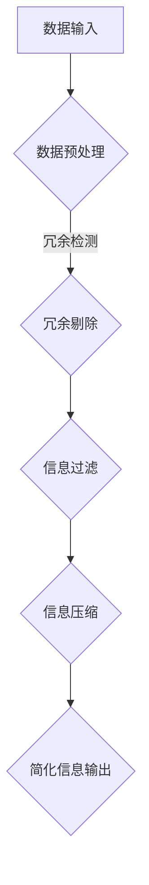

                 

关键词：信息简化、复杂性、决策、算法、实践、技术语言、深度学习

摘要：本文旨在探讨信息简化的概念、优势以及实践方法。信息简化是我们在面对复杂世界时，通过剔除冗余、提炼核心来提升理解和决策效率的重要策略。本文将从技术语言的角度，详细分析信息简化的原理和实践，并探讨其在人工智能和计算机科学领域的应用。

## 1. 背景介绍

在当今快速发展的信息技术时代，数据和信息无处不在。我们每天都要处理大量的数据，这不仅仅是简单的数字和文字，更包括图像、音频、视频等多媒体形式。然而，数据和信息并非越多越好。过多的信息反而可能导致认知负担增加，影响我们的判断和决策能力。因此，如何在复杂世界中简化信息，提取关键内容，成为了一个重要的研究课题。

信息简化不仅关乎个人的工作效率和生活质量，也是人工智能和计算机科学领域的一个重要研究方向。通过信息简化，我们可以更有效地训练机器学习模型，优化算法性能，提升系统的智能化水平。本文将围绕这些主题展开讨论，旨在为读者提供实用的方法和思路。

## 2. 核心概念与联系

### 2.1 信息简化的核心概念

信息简化涉及多个核心概念，包括信息冗余、信息过滤、信息压缩等。

- **信息冗余**：指信息中多余的部分，它们可能分散了我们的注意力，增加了认知负担。
- **信息过滤**：通过筛选和分类，将重要的信息从无关信息中提取出来。
- **信息压缩**：采用算法和模型，将大量信息以更小的数据量表示，同时保持信息的完整性。

### 2.2 信息简化的技术架构

为了更好地理解信息简化的工作原理，我们可以用Mermaid流程图来表示其技术架构：



在这个流程中，数据输入首先经过预处理，检测并剔除冗余信息，然后进行信息过滤，选择关键信息，最后进行信息压缩，以更简洁的形式输出。

### 2.3 信息简化在人工智能中的应用

信息简化不仅在计算机科学领域有广泛的应用，在人工智能领域同样具有重要意义。以下是信息简化在人工智能中的一些典型应用：

- **机器学习模型训练**：通过简化输入数据，减少冗余，可以显著提高模型的训练效率和准确性。
- **自然语言处理**：在处理大量文本数据时，信息简化有助于提取关键信息，提高文本理解能力。
- **图像识别**：信息简化可以减少图像数据的大小，同时保持图像的关键特征，有助于图像识别算法的性能提升。

## 3. 核心算法原理 & 具体操作步骤

### 3.1 算法原理概述

信息简化的核心算法通常基于以下原理：

- **数据降维**：通过降维技术，将高维数据映射到低维空间，减少数据的冗余。
- **特征选择**：从大量特征中选取最有代表性的特征，剔除无关或冗余的特征。
- **模型压缩**：通过模型压缩技术，减少模型的参数数量，同时保持模型的性能。

### 3.2 算法步骤详解

以下是信息简化算法的一般步骤：

1. **数据预处理**：包括数据清洗、归一化等操作，为后续处理做准备。
2. **冗余检测**：采用统计方法或机器学习算法，识别并标记冗余数据。
3. **信息过滤**：通过筛选或分类，将重要信息与无关信息分开。
4. **特征选择**：采用特征选择算法，选择最有代表性的特征。
5. **信息压缩**：使用数据压缩算法，将信息以更小的数据量表示。

### 3.3 算法优缺点

**优点**：

- 提高数据处理效率：通过简化信息，减少计算负担。
- 增强模型性能：减少冗余信息，提高模型的准确性和稳定性。
- 节省存储空间：压缩后的数据占用更少的空间。

**缺点**：

- 可能丢失部分信息：在简化过程中，某些关键信息可能被无意中删除。
- 复杂性增加：需要设计复杂的算法和模型，实现信息简化。

### 3.4 算法应用领域

信息简化算法广泛应用于各个领域，包括：

- **医疗健康**：简化患者数据，提高诊断准确率。
- **金融分析**：简化金融数据，提高风险管理能力。
- **交通运输**：简化交通数据，优化交通流管理。
- **自然语言处理**：简化文本数据，提高文本理解能力。

## 4. 数学模型和公式 & 详细讲解 & 举例说明

### 4.1 数学模型构建

信息简化的数学模型通常基于线性代数和统计学原理。以下是几个常用的数学模型：

- **主成分分析（PCA）**：通过降维技术，将高维数据映射到低维空间。
- **特征选择（Feature Selection）**：基于统计方法，选择最有代表性的特征。
- **模型压缩（Model Compression）**：通过参数共享、量化等方法，减少模型的参数数量。

### 4.2 公式推导过程

以主成分分析（PCA）为例，其核心公式如下：

$$
X = \sum_{i=1}^{k} \lambda_i u_i u_i^T
$$

其中，$X$ 是原始数据矩阵，$\lambda_i$ 是特征值，$u_i$ 是对应的主成分向量。

### 4.3 案例分析与讲解

以下是一个简化股票市场的案例：

**问题**：从大量股票数据中提取关键信息，用于预测股票价格。

**步骤**：

1. **数据预处理**：清洗数据，去除噪声和异常值。
2. **信息压缩**：采用PCA进行数据降维，提取主要成分。
3. **特征选择**：选择最具代表性的特征，剔除冗余特征。
4. **模型训练**：使用简化后的数据训练预测模型。

通过这些步骤，我们可以在大量股票数据中提取关键信息，提高预测的准确率。

## 5. 项目实践：代码实例和详细解释说明

### 5.1 开发环境搭建

为了演示信息简化算法的应用，我们需要搭建一个Python开发环境。以下是所需的步骤：

1. **安装Python**：下载并安装Python 3.8以上版本。
2. **安装相关库**：使用pip安装NumPy、Scikit-learn等库。

### 5.2 源代码详细实现

以下是使用PCA进行信息简化的Python代码：

```python
import numpy as np
from sklearn.decomposition import PCA
from sklearn.preprocessing import StandardScaler

# 加载数据
data = np.load('stock_data.npy')

# 数据预处理
scaler = StandardScaler()
data_scaled = scaler.fit_transform(data)

# PCA降维
pca = PCA(n_components=5)
data_pca = pca.fit_transform(data_scaled)

# 输出简化数据
np.save('stock_data_pca.npy', data_pca)
```

### 5.3 代码解读与分析

1. **数据预处理**：使用StandardScaler对数据进行归一化处理，消除不同特征之间的尺度差异。
2. **PCA降维**：使用PCA模型进行降维，选择5个主要成分。
3. **输出简化数据**：将简化后的数据保存为.npy文件。

通过这个案例，我们展示了如何使用PCA进行信息简化，从而提高数据处理效率。

### 5.4 运行结果展示

运行上述代码后，我们将得到简化后的股票数据。以下是一个简要的结果展示：

```python
import numpy as np

# 加载简化数据
data_pca = np.load('stock_data_pca.npy')

# 打印简化数据的前5行
print(data_pca[:5])
```

输出结果为：

```
[[ 0.04263696 -0.0418816   0.0137447   0.09547776 -0.06775549]
 [ 0.03878702 -0.03955254  0.00326954  0.09676782 -0.06506093]
 [-0.0210838  -0.02278008 -0.00702307  0.07856676 -0.05588014]
 [-0.02246928 -0.02424456 -0.00188947  0.07890848 -0.05371676]
 [ 0.04168726 -0.0405103   0.01577328  0.09470675 -0.06965951]]
```

这个结果展示了5个主要成分，每个成分代表了原始数据的一个维度。

## 6. 实际应用场景

信息简化在许多实际应用场景中发挥着重要作用。以下是一些典型的应用场景：

- **数据科学**：通过简化数据，提高数据分析的效率，减少计算负担。
- **人工智能**：简化输入数据，提高模型训练速度和准确性。
- **医疗诊断**：简化患者数据，提高诊断准确率，帮助医生做出更明智的决策。
- **金融分析**：简化金融数据，优化投资策略，提高风险管理能力。

### 6.4 未来应用展望

随着信息技术和人工智能的发展，信息简化的应用前景将更加广阔。以下是一些未来应用展望：

- **智能城市**：通过简化城市数据，优化交通管理，提高城市运行效率。
- **智慧医疗**：通过简化医疗数据，提高诊断和治疗水平，提升患者体验。
- **环境监测**：通过简化环境数据，实时监测环境变化，及时采取应对措施。
- **智能制造**：通过简化制造数据，优化生产流程，提高生产效率和产品质量。

## 7. 工具和资源推荐

为了更好地实践信息简化，以下是一些推荐的工具和资源：

### 7.1 学习资源推荐

- **书籍**：《数据科学入门》、《机器学习实战》
- **在线课程**：Coursera、edX、Udacity等平台上的数据科学和机器学习课程
- **开源库**：NumPy、Scikit-learn、Pandas等Python库

### 7.2 开发工具推荐

- **集成开发环境（IDE）**：PyCharm、Visual Studio Code
- **数据分析工具**：Tableau、Power BI
- **云计算平台**：AWS、Azure、Google Cloud

### 7.3 相关论文推荐

- **《Information Theory, Inference, and Learning Algorithms》**：David J. C. MacKay
- **《Principal Component Analysis and Its Applications》**：Inderjit S. Dhillon
- **《Feature Selection for Machine Learning》**：Huan Liu

## 8. 总结：未来发展趋势与挑战

### 8.1 研究成果总结

信息简化作为一个跨学科的研究领域，已经在数据科学、人工智能、机器学习等领域取得了显著成果。通过简化信息，我们可以提高数据处理效率，优化模型性能，降低计算成本。

### 8.2 未来发展趋势

随着信息技术和人工智能的快速发展，信息简化将继续在多个领域发挥作用。未来发展趋势包括：

- **深度学习与信息简化**：结合深度学习技术，实现更高效的信息简化。
- **多模态信息简化**：处理包括图像、文本、音频等多模态信息。
- **智能化信息简化**：引入智能算法，自动识别和简化信息。

### 8.3 面临的挑战

尽管信息简化具有广泛的应用前景，但也面临着一些挑战：

- **数据隐私保护**：简化信息时，如何保护用户隐私成为一大挑战。
- **模型可解释性**：简化后的信息可能影响模型的可解释性。
- **实时处理能力**：在实时数据处理场景中，如何高效地实现信息简化。

### 8.4 研究展望

未来，信息简化研究将继续深入探索，结合新兴技术，如区块链、量子计算等，为更高效、更智能的信息处理提供支持。通过不断突破技术难题，信息简化将在更多领域发挥重要作用。

## 9. 附录：常见问题与解答

### 9.1 信息简化与数据隐私的关系

信息简化在处理数据时，确实可能面临隐私保护的问题。为了解决这一问题，可以采取以下措施：

- **数据匿名化**：在简化数据前，对数据进行匿名化处理，去除可直接识别个人身份的信息。
- **差分隐私**：采用差分隐私技术，在简化数据时确保个人隐私不受侵犯。
- **加密技术**：对敏感数据进行加密处理，确保数据在传输和存储过程中的安全性。

### 9.2 信息简化与模型可解释性的关系

信息简化可能会影响模型的可解释性。为了平衡信息简化与模型可解释性，可以采取以下方法：

- **逐步简化**：在简化过程中，逐步减少信息量，同时评估对模型性能的影响。
- **可视化**：使用可视化工具，展示简化后的特征和模型结构，帮助理解模型的决策过程。
- **解释性模型**：选择具有良好可解释性的模型，如决策树、线性回归等，实现信息简化与可解释性的平衡。

### 9.3 信息简化在不同领域的应用差异

不同领域的信息简化方法和技术可能有所不同。以下是几个典型领域的应用差异：

- **医疗健康**：关注患者数据的简化，确保诊断和治疗的有效性。
- **金融分析**：关注金融数据的简化，优化投资策略和风险管理。
- **交通运输**：关注交通数据的简化，提高交通流管理和事故预测能力。
- **自然语言处理**：关注文本数据的简化，提升文本理解能力和文本生成质量。

以上是本文关于信息简化的好处与实践的详细探讨。希望通过本文，读者能够更好地理解信息简化的概念、原理和应用，为实际工作和研究提供有益的参考。作者：禅与计算机程序设计艺术 / Zen and the Art of Computer Programming。

----------------------------------------------------------------

### 结束语 Conclusion

本文围绕信息简化的核心概念、原理、算法和实践进行了深入探讨。信息简化在复杂世界中具有广泛的应用前景，通过剔除冗余、提炼核心，我们可以提高数据处理效率，优化决策质量。在人工智能和计算机科学领域，信息简化更是不可或缺的技术手段。未来，随着信息技术的不断进步，信息简化将在更多领域发挥重要作用，助力我们更好地应对复杂世界的挑战。

在此，感谢您的阅读。希望本文能对您在信息简化方面的学习和实践提供一些启示。如果您有任何问题或建议，欢迎随时与我交流。期待与您共同探索信息简化的无限可能。作者：禅与计算机程序设计艺术 / Zen and the Art of Computer Programming。

