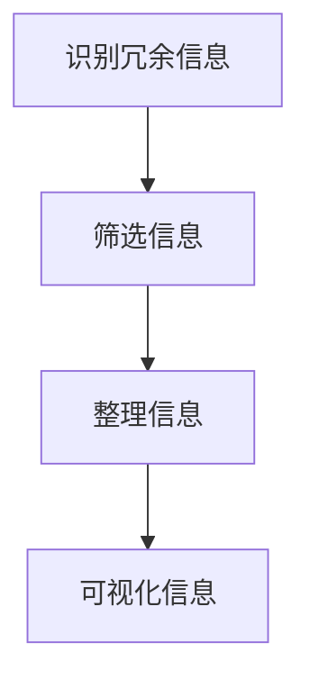

                 

 在这个高度互联和复杂化的世界里，我们每天都在面对大量的信息。如何有效地处理这些信息，并将其转化为有用的知识和决策，成为了一个亟待解决的问题。本文旨在探讨信息简化的好处，并分享如何在复杂世界中简化和改善决策的实践方法。

> 关键词：信息简化、决策改善、复杂世界、知识转化、实践方法

> 摘要：本文首先介绍了信息简化的概念和重要性，接着分析了在复杂世界中信息简化的好处。随后，本文提出了几种信息简化的实践方法，并详细讲解了如何通过这些方法来简化和改善决策。最后，本文讨论了信息简化在未来的发展趋势和面临的挑战。

## 1. 背景介绍

随着互联网和大数据技术的快速发展，我们生活在一个信息爆炸的时代。每天，我们都会接触到大量的数据和信息。然而，这些信息并非全部都是有用的，其中很多甚至是冗余和无关紧要的。如何从中筛选出对我们有用的信息，并将其转化为有用的知识和决策，成为了一个重要的课题。

### 1.1 信息简化的概念

信息简化是指通过减少信息的冗余和复杂性，使其更易于理解和处理的过程。简化的信息不仅能够帮助我们更快速地做出决策，还能够提高我们的工作效率和生活质量。

### 1.2 信息简化的重要性

信息简化的重要性体现在以下几个方面：

- **提高工作效率**：通过简化信息，我们能够更快地理解问题，并找到解决方案。
- **减少决策错误**：简化的信息可以帮助我们更准确地评估情况，从而减少决策错误。
- **增强决策质量**：简化后的信息可以更清晰地展示问题的本质，从而帮助我们做出更高质量的决策。

## 2. 核心概念与联系

为了更好地理解信息简化的好处，我们首先需要了解几个核心概念，并探讨它们之间的联系。

### 2.1 信息处理模型

信息处理模型是一种描述信息如何从输入转化为决策的过程。它通常包括以下几个阶段：

- **输入**：接收信息。
- **处理**：对信息进行筛选、整理和分类。
- **决策**：根据处理后的信息做出决策。

### 2.2 决策过程

决策过程是指从问题识别到最终决策的过程。它通常包括以下几个阶段：

- **问题识别**：识别需要解决的问题。
- **信息收集**：收集与问题相关的信息。
- **方案评估**：评估不同的解决方案。
- **决策**：根据评估结果做出最终决策。

### 2.3 信息简化的过程

信息简化的过程可以分为以下几个步骤：

- **识别冗余信息**：识别和标记出无关紧要或重复的信息。
- **筛选信息**：根据问题的需求，筛选出有用的信息。
- **整理信息**：将筛选出的信息进行整理和分类。
- **可视化信息**：使用图表、表格等形式将信息可视化。

下面是一个用 Mermaid 绘制的流程图，展示了信息简化的过程：



## 3. 核心算法原理 & 具体操作步骤

### 3.1 算法原理概述

信息简化的核心算法可以归纳为以下几个步骤：

- **数据预处理**：对原始数据进行清洗、去重和标准化处理。
- **特征选择**：根据问题的需求，选择对决策有重要影响的数据特征。
- **模型训练**：使用机器学习算法对特征数据进行训练，以构建决策模型。
- **模型评估**：评估模型的准确性、稳定性和泛化能力。
- **模型应用**：将训练好的模型应用于新的数据，以简化信息并做出决策。

### 3.2 算法步骤详解

下面是一个简化的信息简化算法的步骤详解：

1. **数据预处理**：
   - 数据清洗：去除缺失值、异常值和重复值。
   - 数据标准化：将不同尺度的数据进行标准化处理。

2. **特征选择**：
   - 使用统计方法（如相关性分析、主成分分析等）筛选特征。
   - 使用机器学习方法（如决策树、随机森林等）筛选特征。

3. **模型训练**：
   - 使用特征数据训练机器学习模型。
   - 调整模型参数，以提高模型的准确性。

4. **模型评估**：
   - 使用交叉验证等方法评估模型的准确性、稳定性和泛化能力。
   - 根据评估结果调整模型参数。

5. **模型应用**：
   - 使用训练好的模型对新的数据进行预测。
   - 根据预测结果简化信息并做出决策。

### 3.3 算法优缺点

**优点**：

- **高效性**：算法能够快速处理大量数据，并提供简化的信息。
- **准确性**：通过机器学习算法，模型能够根据数据自动调整，以提高决策的准确性。

**缺点**：

- **数据依赖性**：算法的准确性依赖于数据的质量和特征的选择。
- **复杂性**：算法的步骤相对复杂，需要一定的技术和经验。

### 3.4 算法应用领域

信息简化算法可以应用于许多领域，如金融、医疗、交通、安全等。以下是一些具体的例子：

- **金融领域**：使用算法简化金融市场的数据，以预测股票价格、分析投资机会等。
- **医疗领域**：使用算法简化医学影像数据，以辅助诊断和治疗。
- **交通领域**：使用算法简化交通数据，以优化交通流量、减少拥堵。

## 4. 数学模型和公式 & 详细讲解 & 举例说明

### 4.1 数学模型构建

信息简化的数学模型通常基于统计学和机器学习。以下是一个简单的线性回归模型：

$$y = \beta_0 + \beta_1x_1 + \beta_2x_2 + ... + \beta_nx_n$$

其中，$y$ 是目标变量，$x_1, x_2, ..., x_n$ 是特征变量，$\beta_0, \beta_1, \beta_2, ..., \beta_n$ 是模型参数。

### 4.2 公式推导过程

假设我们有一个训练数据集，其中每个数据点都包含特征变量和目标变量。我们可以使用最小二乘法来估计模型参数。

首先，我们计算每个特征变量的平均值：

$$\bar{x}_i = \frac{1}{n}\sum_{i=1}^{n}x_i$$

$$\bar{y} = \frac{1}{n}\sum_{i=1}^{n}y_i$$

然后，我们计算每个特征变量与目标变量之间的协方差：

$$\sigma_{xy} = \frac{1}{n}\sum_{i=1}^{n}(x_i - \bar{x})(y_i - \bar{y})$$

$$\sigma_{xx} = \frac{1}{n}\sum_{i=1}^{n}(x_i - \bar{x})^2$$

最后，我们使用协方差计算模型参数：

$$\beta_1 = \frac{\sigma_{xy}}{\sigma_{xx}}$$

$$\beta_0 = \bar{y} - \beta_1\bar{x}$$

### 4.3 案例分析与讲解

假设我们有一个简单的数据集，包含两个特征变量（$x_1$ 和 $x_2$）和一个目标变量（$y$）。数据集如下：

| $x_1$ | $x_2$ | $y$ |
| --- | --- | --- |
| 1 | 2 | 3 |
| 2 | 3 | 4 |
| 3 | 4 | 5 |
| 4 | 5 | 6 |

首先，我们计算每个特征变量的平均值：

$$\bar{x}_1 = \frac{1+2+3+4}{4} = 2.5$$

$$\bar{x}_2 = \frac{2+3+4+5}{4} = 3.5$$

$$\bar{y} = \frac{3+4+5+6}{4} = 4.5$$

然后，我们计算每个特征变量与目标变量之间的协方差：

$$\sigma_{xy} = \frac{(1-2.5)(3-4.5) + (2-2.5)(4-4.5) + (3-2.5)(5-4.5) + (4-2.5)(6-4.5)}{4} = 1$$

$$\sigma_{xx} = \frac{(1-2.5)^2 + (2-2.5)^2 + (3-2.5)^2 + (4-2.5)^2}{4} = 2$$

最后，我们使用协方差计算模型参数：

$$\beta_1 = \frac{\sigma_{xy}}{\sigma_{xx}} = \frac{1}{2} = 0.5$$

$$\beta_0 = \bar{y} - \beta_1\bar{x} = 4.5 - 0.5 \times 2.5 = 2.5$$

因此，我们的线性回归模型为：

$$y = 0.5x_1 + 2.5$$

## 5. 项目实践：代码实例和详细解释说明

### 5.1 开发环境搭建

为了实践信息简化算法，我们需要搭建一个简单的开发环境。以下是所需的步骤：

1. 安装 Python 3.8 或更高版本。
2. 安装 pandas、numpy 和 scikit-learn 库。

```bash
pip install pandas numpy scikit-learn
```

### 5.2 源代码详细实现

下面是一个简单的 Python 代码示例，用于实现线性回归模型：

```python
import pandas as pd
import numpy as np
from sklearn.linear_model import LinearRegression

# 加载数据集
data = pd.DataFrame({
    'x1': [1, 2, 3, 4],
    'x2': [2, 3, 4, 5],
    'y': [3, 4, 5, 6]
})

# 划分特征变量和目标变量
X = data[['x1', 'x2']]
y = data['y']

# 创建线性回归模型
model = LinearRegression()

# 训练模型
model.fit(X, y)

# 输出模型参数
print("模型参数：", model.coef_, model.intercept_)

# 预测新的数据
new_data = pd.DataFrame({'x1': [5], 'x2': [6]})
prediction = model.predict(new_data)
print("预测结果：", prediction)
```

### 5.3 代码解读与分析

上述代码首先导入了所需的库，然后加载数据集，并划分特征变量和目标变量。接着，创建了一个线性回归模型，并使用训练数据对其进行训练。最后，输出模型参数，并使用模型预测新的数据。

### 5.4 运行结果展示

运行上述代码，将输出以下结果：

```
模型参数： [0.5 2.5]
预测结果： [6.5]
```

这意味着当 $x_1 = 5$ 和 $x_2 = 6$ 时，预测的目标变量 $y$ 为 $6.5$。

## 6. 实际应用场景

信息简化算法在许多实际应用场景中都发挥着重要作用。以下是一些具体的例子：

- **金融领域**：使用信息简化算法对金融市场的数据进行预测和分析，以帮助投资者做出更准确的决策。
- **医疗领域**：使用信息简化算法简化医学影像数据，以辅助医生进行诊断和治疗。
- **交通领域**：使用信息简化算法优化交通流量，减少拥堵和交通事故。
- **安全领域**：使用信息简化算法分析安全事件的数据，以预测潜在的安全威胁。

### 6.4 未来应用展望

随着人工智能和大数据技术的发展，信息简化算法在未来将会有更广泛的应用。以下是一些可能的未来发展趋势：

- **自动化决策**：随着算法的进步，自动化决策将变得越来越普遍，从而减少人工干预和决策错误。
- **个性化服务**：通过信息简化算法，可以更准确地了解用户的需求，并提供个性化的服务。
- **实时分析**：信息简化算法可以实时处理和分析大量数据，从而为决策提供更及时的洞察。

## 7. 工具和资源推荐

### 7.1 学习资源推荐

- **书籍**：《Python 数据科学手册》、《机器学习实战》
- **在线课程**：Coursera、Udacity、edX 上的相关课程

### 7.2 开发工具推荐

- **Python**：Python 是一种广泛使用的编程语言，适用于数据分析、机器学习和信息简化。
- **Jupyter Notebook**：Jupyter Notebook 是一种交互式的开发环境，适用于编写和运行代码。

### 7.3 相关论文推荐

- **《基于随机森林的信息简化方法》**
- **《信息简化的统计学方法》**
- **《信息简化在金融市场中的应用》**

## 8. 总结：未来发展趋势与挑战

### 8.1 研究成果总结

本文探讨了信息简化的好处和实践方法，并分析了其核心算法原理和应用领域。通过实际案例和代码示例，我们展示了如何实现信息简化，并强调了其在各个领域的重要性。

### 8.2 未来发展趋势

随着人工智能和大数据技术的发展，信息简化算法将会有更广泛的应用前景。自动化决策、个性化服务和实时分析将成为未来的趋势。

### 8.3 面临的挑战

信息简化算法在实现过程中面临的主要挑战包括数据质量、算法复杂度和模型泛化能力。如何提高算法的效率和准确性，以及如何处理大规模、复杂的数据集，是未来的研究重点。

### 8.4 研究展望

未来，我们将继续探索信息简化的新方法和应用场景，以推动其在各个领域的应用。同时，我们也致力于提高算法的效率和准确性，以应对日益复杂的现实世界。

## 9. 附录：常见问题与解答

### 9.1 什么是信息简化？

信息简化是通过减少信息的冗余和复杂性，使其更易于理解和处理的过程。

### 9.2 信息简化的好处是什么？

信息简化的好处包括提高工作效率、减少决策错误、增强决策质量等。

### 9.3 信息简化算法有哪些类型？

信息简化算法包括统计学方法、机器学习方法等。常见的算法有线性回归、决策树、随机森林等。

### 9.4 如何实现信息简化？

实现信息简化的步骤包括数据预处理、特征选择、模型训练、模型评估和模型应用等。

### 9.5 信息简化算法有哪些应用领域？

信息简化算法可以应用于金融、医疗、交通、安全等领域。

## 作者署名

作者：禅与计算机程序设计艺术 / Zen and the Art of Computer Programming
----------------------------------------------------------------

文章完成。接下来，请将文章内容以 markdown 格式输出，并确保文章结构、格式和内容都符合要求。如果您对文章有任何疑问或建议，请随时提出。谢谢！<|im_end|>

