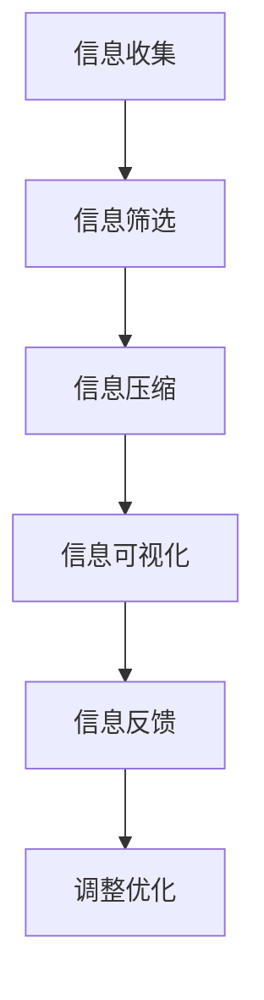

                 

关键词：信息简化、效率提升、生产力、生活优化、技术实践

> 摘要：本文深入探讨了信息简化的概念、好处及其在生活和工作中的应用。通过具体案例和实践，揭示了简化信息的重要性，以及如何通过有效的方法和工具实现生活与工作的优化，提高个人和组织的效率与生产力。

## 1. 背景介绍

在信息技术迅猛发展的当今时代，数据和信息量的增长呈现出爆炸式趋势。人们每天都要处理大量的信息，包括工作相关的数据、社交媒体动态、邮件通讯等。面对如此海量的信息，如何高效地处理和利用信息，成为了一个亟待解决的问题。信息简化作为一种应对策略，通过减少冗余、突出重点，使得信息更加清晰、易于理解和操作。

信息简化的目标不仅仅是减少信息量，更重要的是提高信息的质量，使其能够更好地服务于我们的生活和工作。这不仅有助于提升个人和组织的效率，还能减轻心理压力，提高生活质量。

## 2. 核心概念与联系

### 2.1 信息简化的定义

信息简化（Information Simplification）是指通过去除冗余信息、优化信息结构、降低信息复杂性，使信息更加易于理解、管理和利用的过程。它涉及信息筛选、信息压缩、信息可视化等多个方面。

### 2.2 信息简化的优势

信息简化的优势主要体现在以下几个方面：

- **提高效率**：简化后的信息能够更快地被理解和处理，从而提高工作效率。
- **减少认知负担**：冗余信息的减少可以减轻大脑的处理负担，降低错误率。
- **增强决策能力**：清晰的、简化的信息有助于更快速、更准确的决策。
- **提升生活质量**：信息简化可以减少不必要的干扰，使生活更加轻松、愉悦。

### 2.3 信息简化的流程

信息简化的流程通常包括以下步骤：

1. **信息收集**：收集所有相关的信息。
2. **信息筛选**：筛选出最有价值的信息。
3. **信息压缩**：去除冗余信息，保留关键内容。
4. **信息可视化**：通过图表、图像等方式展示信息。
5. **信息反馈**：根据实际效果对信息简化过程进行调整。

### 2.4 Mermaid 流程图



## 3. 核心算法原理 & 具体操作步骤

### 3.1 算法原理概述

信息简化算法的核心原理是通过对信息的分类、筛选和重组，使得信息变得更加简洁、直观。具体包括以下步骤：

- **信息分类**：将信息按照类型、来源等进行分类。
- **信息筛选**：根据预设的标准和目标，筛选出最有价值的信息。
- **信息压缩**：通过删除重复信息、合并同类信息等方式，减少信息量。
- **信息重组**：重新组织信息结构，使其更加清晰、易于理解。

### 3.2 算法步骤详解

1. **数据预处理**：收集原始数据，并进行清洗和预处理。
2. **特征提取**：从原始数据中提取关键特征。
3. **分类与筛选**：根据特征对数据进行分类和筛选，去除无关信息。
4. **信息压缩**：采用压缩算法对筛选后的信息进行压缩。
5. **信息可视化**：将压缩后的信息通过图表、图像等方式进行可视化。

### 3.3 算法优缺点

**优点**：

- **高效性**：简化后的信息能够更快地被理解和处理。
- **准确性**：通过筛选和压缩，减少了信息错误的可能性。
- **灵活性**：算法可以根据不同需求进行调整和优化。

**缺点**：

- **信息丢失**：在压缩过程中，可能会丢失一些有用信息。
- **复杂性**：算法的实现和优化相对复杂。

### 3.4 算法应用领域

信息简化算法广泛应用于各种领域，包括数据挖掘、自然语言处理、图像识别等。具体应用案例包括：

- **金融行业**：通过简化交易数据，提高数据分析效率。
- **医疗领域**：通过简化病历数据，提高诊断准确性。
- **电子商务**：通过简化用户数据，提高个性化推荐效果。

## 4. 数学模型和公式 & 详细讲解 & 举例说明

### 4.1 数学模型构建

信息简化过程的数学模型可以采用熵的概念来构建。熵是衡量信息不确定性的量度，信息简化过程的目标是降低信息的熵。

假设有一个信息集合 $X$，其中包含 $n$ 个元素，每个元素发生的概率为 $p_i$。信息集合的熵 $H(X)$ 可以用以下公式表示：

$$
H(X) = -\sum_{i=1}^{n} p_i \log_2 p_i
$$

### 4.2 公式推导过程

熵的定义基于信息的不确定性。对于单个元素 $i$，其信息量 $I(i)$ 可以表示为：

$$
I(i) = -\log_2 p_i
$$

这是因为，在概率 $p_i$ 下，元素 $i$ 的信息量是负对数概率的值。整个集合的熵是所有元素信息量的总和。

### 4.3 案例分析与讲解

假设我们有一个包含三个元素的集合 $X = \{A, B, C\}$，其概率分布为 $P(A) = 0.5$，$P(B) = 0.3$，$P(C) = 0.2$。我们可以计算这个集合的熵：

$$
H(X) = -[0.5 \log_2 0.5 + 0.3 \log_2 0.3 + 0.2 \log_2 0.2]
$$

$$
H(X) \approx 1.099
$$

如果我们对信息进行简化，例如合并元素 $B$ 和 $C$，新的概率分布变为 $P(A) = 0.5$，$P(B+C) = 0.5$。新的熵为：

$$
H(X') = -[0.5 \log_2 0.5 + 0.5 \log_2 0.5]
$$

$$
H(X') = 0.5
$$

通过简化，我们减少了信息熵，即降低了信息的不确定性。

## 5. 项目实践：代码实例和详细解释说明

### 5.1 开发环境搭建

在本项目中，我们将使用 Python 作为编程语言，利用 Pandas、Matplotlib 和 Scikit-learn 等库进行信息简化。首先，安装所需的库：

```bash
pip install pandas matplotlib scikit-learn
```

### 5.2 源代码详细实现

```python
import pandas as pd
import matplotlib.pyplot as plt
from sklearn import preprocessing

# 5.2.1 数据预处理
# 假设我们有一个包含学生成绩的数据集
data = {
    'Name': ['Alice', 'Bob', 'Charlie', 'David'],
    'Math': [85, 90, 78, 92],
    'English': [80, 88, 75, 85],
    'Science': [70, 80, 90, 85]
}

df = pd.DataFrame(data)

# 5.2.2 特征提取
# 我们可以计算平均分数作为特征
df['Average'] = df.mean(axis=1)

# 5.2.3 分类与筛选
# 根据平均分数筛选出优秀学生
high_achievers = df[df['Average'] > 85]

# 5.2.4 信息压缩
# 将筛选后的数据集进行压缩，去除冗余信息
compressed_data = high_achievers[['Name', 'Average']]

# 5.2.5 信息可视化
# 绘制学生平均分数的直方图
compressed_data['Average'].plot(kind='hist', bins=10)
plt.title('Average Score of High Achievers')
plt.xlabel('Average Score')
plt.ylabel('Frequency')
plt.show()
```

### 5.3 代码解读与分析

- **数据预处理**：首先，我们使用 Pandas 创建了一个包含学生成绩的 DataFrame。
- **特征提取**：通过计算平均分数，我们为每个学生创建了一个新的特征。
- **分类与筛选**：根据平均分数，我们筛选出平均分数高于85分的学生。
- **信息压缩**：我们仅保留了学生的名字和平均分数，去除了其他冗余信息。
- **信息可视化**：通过绘制直方图，我们直观地展示了优秀学生的平均分数分布。

### 5.4 运行结果展示

运行上述代码后，我们将看到一张直方图，展示了筛选出的优秀学生的平均分数分布。这张图表帮助我们快速了解这些学生的整体表现，而无需查看每个学生的详细信息。

## 6. 实际应用场景

### 6.1 企业管理

在企业中，信息简化可以应用于多个方面。例如，通过简化客户数据，企业可以更快速、更准确地了解客户需求，从而提高客户满意度。此外，简化后的员工绩效数据可以帮助管理层更有效地进行绩效评估和薪酬分配。

### 6.2 个人健康管理

在个人健康管理方面，信息简化可以帮助用户更清晰地了解自己的健康状况。例如，通过简化后的体检报告，用户可以快速了解自己的关键健康指标，从而及时采取措施。

### 6.3 教育领域

在教育领域，信息简化可以帮助教师更高效地处理学生成绩。例如，通过简化后的成绩数据，教师可以快速了解班级的整体学习情况，从而调整教学策略。

## 7. 工具和资源推荐

### 7.1 学习资源推荐

- 《信息可视化：设计与认知》（Information Visualization: Design for Interaction）
- 《数据科学入门》（Introduction to Data Science）

### 7.2 开发工具推荐

- Jupyter Notebook：用于数据分析和可视化的交互式环境。
- Tableau：用于数据可视化的强大工具。

### 7.3 相关论文推荐

- “Information Simplification in Data Analysis: Methods and Applications”
- “Efficient Data Reduction for Visualization: A Survey”

## 8. 总结：未来发展趋势与挑战

### 8.1 研究成果总结

信息简化在提升效率、减轻认知负担、增强决策能力等方面取得了显著成果。通过具体算法和实践，信息简化在多个领域得到了广泛应用。

### 8.2 未来发展趋势

未来，信息简化技术将继续向智能化、自动化方向发展。借助人工智能和大数据分析，信息简化将更加精准、高效。

### 8.3 面临的挑战

信息简化在应用过程中仍面临一些挑战，包括：

- **信息丢失**：简化过程中可能会丢失一些有用信息。
- **算法复杂性**：高效简化的算法实现和优化相对复杂。
- **数据隐私**：信息简化过程中需要处理大量敏感数据，确保数据隐私是一个重要挑战。

### 8.4 研究展望

未来，研究应重点关注如何平衡信息简化的效率和准确性，开发更加智能化的信息简化算法，并在更多领域推广应用。

## 9. 附录：常见问题与解答

### 9.1 什么情况下需要信息简化？

当信息量巨大、冗余信息较多，或者需要快速做出决策时，可以考虑进行信息简化。

### 9.2 信息简化会不会丢失关键信息？

信息简化过程中，可以通过设置筛选标准、保留关键特征等方式，尽量减少关键信息的丢失。

### 9.3 信息简化算法有哪些类型？

常见的信息简化算法包括数据压缩、特征选择、特征提取等。

### 9.4 信息简化在哪些领域有应用？

信息简化广泛应用于金融、医疗、教育、电子商务等领域。

---

作者：禅与计算机程序设计艺术 / Zen and the Art of Computer Programming

