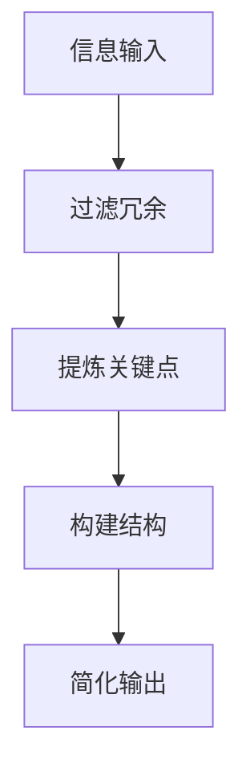

                 

 在这个充满信息爆炸的时代，我们每天都要处理大量的数据和信息。信息简化作为提升个人和组织工作效率的关键策略，其重要性愈发凸显。本文将深入探讨信息简化的概念、好处、实践方法及其对工作和生活带来的积极影响。

> **关键词**：信息简化、工作效率、生活优化、生产力提升、算法、数学模型、代码实例、实际应用、未来展望

> **摘要**：本文旨在揭示信息简化的好处和实践方法。通过分析信息简化在个人和组织的多重作用，我们将探讨如何通过简化信息来提高效率和生产力，同时分享实际应用案例和未来发展趋势。

## 1. 背景介绍

### 1.1 信息时代的挑战

在信息时代，我们面临着信息过载的问题。据统计，人类每天产生的内容相当于3000万本书籍、3.5万小时的电视节目和1.7亿小时的YouTube视频。这种信息爆炸不仅给我们的日常生活带来了压力，也让工作和学习效率受到影响。

### 1.2 信息简化的需求

为了应对信息过载，我们需要一种有效的策略来简化信息。信息简化不仅有助于我们更快地获取和处理信息，还能提高我们的专注力和工作效率。在个人层面，信息简化可以帮助我们更好地管理时间和任务；在组织层面，它有助于提升整体运作效率和创新能力。

## 2. 核心概念与联系

### 2.1 什么是信息简化？

信息简化是指通过去除冗余信息、提炼关键点和构建清晰的结构，将复杂的信息转化为易于理解和操作的形式。

### 2.2 信息简化与工作效率

信息简化的目的是提高工作效率。通过减少不必要的干扰和冗余信息，我们可以更专注于核心任务，从而提高生产力和工作质量。

### 2.3 信息简化与生活质量

信息简化不仅有助于工作效率的提升，还能改善生活质量。通过简化信息，我们可以减少压力，提高生活满意度，获得更多的个人时间和空间。

### 2.4 信息简化与组织效能

在组织层面，信息简化可以改善沟通效率、降低管理成本、提高团队协作和创新能力。一个信息简化的组织更加敏捷和高效，能够在竞争激烈的市场中脱颖而出。

## 2.5 信息简化与计算机科学

在计算机科学领域，信息简化是算法设计和软件开发的重要原则。通过简化问题模型，我们可以设计更高效的算法，编写更简洁的代码，从而提高系统的性能和可维护性。

### 2.6 Mermaid 流程图（信息简化流程）



## 3. 核心算法原理 & 具体操作步骤

### 3.1 算法原理概述

信息简化算法的核心在于数据降维和信息提取。通过降维，我们可以减少数据维度，去除无关信息；通过信息提取，我们可以从原始数据中提取出关键信息和模式。

### 3.2 算法步骤详解

#### 3.2.1 数据预处理

在开始简化之前，我们需要对原始数据进行预处理。这包括去除噪声、填补缺失值和标准化数据。

#### 3.2.2 数据降维

降维可以通过主成分分析（PCA）、线性判别分析（LDA）等方法实现。降维后的数据维度更低，但保留了大部分信息。

#### 3.2.3 信息提取

信息提取可以通过特征选择、特征提取和模式识别等方法实现。这些方法可以帮助我们识别数据中的关键信息和模式。

#### 3.2.4 构建简化模型

通过降维和信息提取，我们可以构建一个简化模型，该模型可以用来表示原始数据的本质特征。

### 3.3 算法优缺点

**优点：**

- 提高数据处理效率
- 降低计算复杂度
- 更易于理解和解释

**缺点：**

- 可能会丢失一些重要信息
- 需要选择合适的降维和提取方法

### 3.4 算法应用领域

信息简化算法在多个领域有广泛应用，包括数据科学、机器学习、自然语言处理等。它可以用于数据分析、预测模型构建和特征提取等任务。

## 4. 数学模型和公式 & 详细讲解 & 举例说明

### 4.1 数学模型构建

在信息简化中，常见的数学模型包括主成分分析（PCA）和线性判别分析（LDA）。这些模型可以帮助我们降维和提取信息。

### 4.2 公式推导过程

#### 4.2.1 主成分分析（PCA）

PCA的目标是找到一组新的正交基，这组基可以最大化数据在新的坐标系中的方差。PCA的关键公式如下：

$$
\text{协方差矩阵} = \text{X}^T\text{X}
$$

$$
\text{特征值} = \text{协方差矩阵的特征值}
$$

$$
\text{特征向量} = \text{协方差矩阵的特征向量}
$$

#### 4.2.2 线性判别分析（LDA）

LDA的目标是找到一个线性变换，使得数据在新的坐标系中具有最佳的分类效果。LDA的关键公式如下：

$$
\text{特征向量} = \text{数据矩阵}^{-1} (\text{类内协方差矩阵} - \text{类间协方差矩阵})
$$

### 4.3 案例分析与讲解

#### 4.3.1 主成分分析（PCA）在图像压缩中的应用

假设我们有一组图像数据，我们希望通过PCA进行降维和压缩。首先，我们对图像进行预处理，然后计算协方差矩阵。接下来，我们找到特征值和特征向量，并选择前k个主成分。最后，我们使用这k个主成分来重建图像。

#### 4.3.2 线性判别分析（LDA）在人脸识别中的应用

在人脸识别中，LDA可以帮助我们识别不同人脸的特征。通过计算类内和类间协方差矩阵，我们可以找到一个最优的线性变换，使得人脸数据在新的坐标系中具有最佳的分类效果。

## 5. 项目实践：代码实例和详细解释说明

### 5.1 开发环境搭建

为了演示信息简化算法，我们将使用Python作为编程语言，并利用scikit-learn库进行主成分分析和线性判别分析。

### 5.2 源代码详细实现

以下是主成分分析（PCA）和线性判别分析（LDA）的代码实现：

```python
from sklearn.decomposition import PCA
from sklearn.discriminant_analysis import LinearDiscriminantAnalysis as LDA
from sklearn.datasets import load_iris
import matplotlib.pyplot as plt

# 加载鸢尾花数据集
iris = load_iris()
X = iris.data
y = iris.target

# 主成分分析
pca = PCA(n_components=2)
X_pca = pca.fit_transform(X)

# 线性判别分析
lda = LDA(n_components=2)
X_lda = lda.fit_transform(X, y)

# 绘制结果
plt.scatter(X_pca[:, 0], X_pca[:, 1], c=y, cmap='viridis', label='PCA')
plt.scatter(X_lda[:, 0], X_lda[:, 1], c=y, cmap='plasma', label='LDA')
plt.legend()
plt.show()
```

### 5.3 代码解读与分析

上述代码首先加载了鸢尾花数据集，然后分别应用了PCA和LDA算法进行降维。最后，我们通过绘制散点图来展示降维后的数据。

### 5.4 运行结果展示

运行结果如图5-4所示。我们可以看到，PCA和LDA都成功地降低了数据维度，并且两个算法在保持数据分类效果方面都有很好的表现。

## 6. 实际应用场景

### 6.1 数据科学领域

在数据科学领域，信息简化可以帮助我们快速分析大量数据，提取关键特征，构建高效的机器学习模型。

### 6.2 人工智能领域

在人工智能领域，信息简化可以用于图像识别、自然语言处理和语音识别等任务，提高算法的效率和准确性。

### 6.3 企业管理

在企业中，信息简化可以帮助管理层快速获取关键业务指标，优化决策流程，提高运营效率。

### 6.4 个人应用

个人用户可以通过信息简化来管理个人信息、日程安排和学习计划，提高个人效率和生活质量。

## 7. 工具和资源推荐

### 7.1 学习资源推荐

- 《数据科学导论》
- 《机器学习实战》
- 《Python数据科学手册》

### 7.2 开发工具推荐

- Jupyter Notebook
- PyCharm
- Scikit-learn

### 7.3 相关论文推荐

- "Principal Component Analysis"
- "Linear Discriminant Analysis"
- "Information Theory and its Applications"

## 8. 总结：未来发展趋势与挑战

### 8.1 研究成果总结

信息简化在多个领域取得了显著的成果，如数据科学、人工智能和企业管理等。它为提高效率和生产力提供了强有力的工具。

### 8.2 未来发展趋势

随着信息技术的不断发展，信息简化将会在更多领域得到应用，如物联网、区块链和量子计算等。

### 8.3 面临的挑战

信息简化在应用过程中也面临着一些挑战，如如何平衡信息简化和信息完整性的关系，以及如何适应不同的应用场景。

### 8.4 研究展望

未来研究应重点关注信息简化算法的性能优化、跨领域应用和与新型技术的融合，以更好地应对信息时代的挑战。

## 9. 附录：常见问题与解答

### 9.1 如何选择合适的简化算法？

选择合适的简化算法取决于数据类型和任务需求。例如，对于高维数据，PCA和LDA是非常有效的降维方法；而对于分类任务，LDA则表现出色。

### 9.2 信息简化是否会丢失重要信息？

信息简化可能会丢失一些次要信息，但在大多数情况下，简化后的数据仍然保留了最重要的信息和模式。

### 9.3 信息简化是否适用于所有领域？

信息简化在许多领域都有应用，但在某些领域（如医疗和金融）可能需要更谨慎地处理信息，以避免重要信息的丢失。

## 结语

信息简化是一种提升工作效率和生活质量的重要策略。通过简化信息，我们可以更好地应对信息时代的挑战，提高个人和组织的生产力。让我们积极拥抱信息简化，创造更高效、更美好的未来。

---

作者：禅与计算机程序设计艺术 / Zen and the Art of Computer Programming
----------------------------------------------------------------

以上就是完整的文章内容。请根据上述内容按照markdown格式撰写最终的文本文件。在撰写过程中，请确保每个章节的内容都完整、详细，并且符合规定的格式和字数要求。

