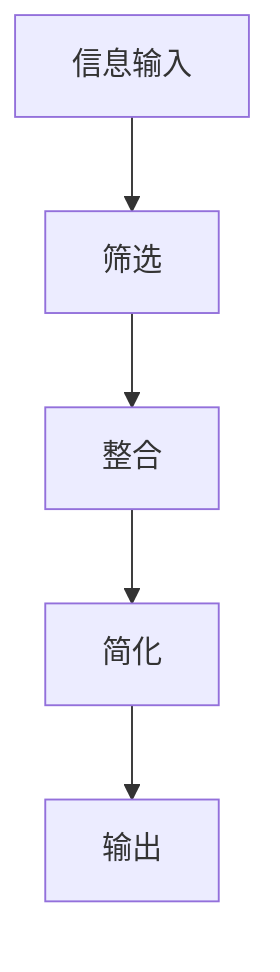
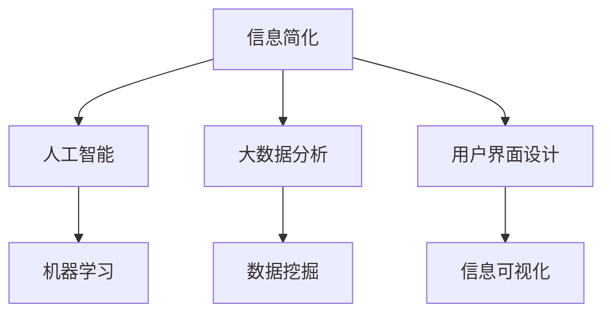

                 

在当今信息爆炸的时代，面对海量数据与复杂的技术细节，如何在复杂的世界中简化信息，从而提高生活质量，成为了一个值得探讨的问题。本文将从信息技术领域的视角，深入分析信息简化的好处与技巧，帮助读者在复杂的数字化生活中找到简化的路径。

## 关键词：信息简化、生活质量、复杂世界、信息技术、简化技巧

> 摘要：本文从信息技术领域的视角，探讨了信息简化的好处与技巧。通过分析信息简化的核心概念、算法原理、数学模型、实际应用，以及未来发展趋势，为读者提供了一套在复杂世界中简化信息、提高生活质量的方法论。

## 1. 背景介绍

随着互联网、大数据、人工智能等技术的快速发展，信息的获取和处理变得前所未有的便捷。然而，信息过载的问题也随之而来。对于普通用户来说，如何从海量的数据中快速获取有价值的信息，如何处理复杂的技术细节，成为了一项挑战。信息简化作为一种应对信息过载的有效手段，能够在一定程度上提高生活质量。

信息简化不仅仅是减少信息的数量，更是一种处理信息的方式，它包括了对信息的筛选、整合、提炼和呈现。通过信息简化，用户可以更加高效地获取和处理信息，从而降低信息处理的复杂度，提高生活质量。

### 1.1 信息过载现象

信息过载是指个体在处理信息时，由于信息量过大而感到压力和焦虑的现象。根据相关研究，现代人在一天内接触到的信息量，超过了过去几十年甚至几百年的总和。这种现象不仅影响了我们的工作效率，也对我们的心理健康产生了负面影响。

### 1.2 信息简化的必要性

面对信息过载，信息简化成为了一种必要手段。通过信息简化，我们可以：

- **提高工作效率**：减少不必要的干扰信息，专注于核心任务。
- **减轻心理压力**：减少处理信息的压力，提高心理健康水平。
- **提升生活质量**：通过更高效地处理信息，我们能够有更多的时间去享受生活。

## 2. 核心概念与联系

### 2.1 信息简化的核心概念

信息简化涉及到多个核心概念，包括信息的价值、信息的冗余、信息的筛选和整合等。

- **信息的价值**：指信息对个体或组织的重要性。在信息简化的过程中，我们需要识别并保留有价值的信息。
- **信息的冗余**：指信息中不必要的重复和冗余部分。通过消除冗余，可以提高信息处理的效率。
- **信息的筛选**：指从大量信息中挑选出对个体或组织有价值的信息。
- **信息的整合**：指将筛选出的信息进行整合和提炼，形成简洁明了的信息结构。

### 2.2 信息简化的架构

信息简化的架构可以看作是一个包含输入、处理和输出的过程。其中：

- **输入**：来自不同渠道的大量信息。
- **处理**：包括信息的筛选、整合和简化。
- **输出**：简化后的信息，以更加易于理解和处理的形式呈现。

以下是一个用Mermaid绘制的简化流程图：



### 2.3 信息简化的联系

信息简化与多个领域密切相关，包括人工智能、大数据分析、用户界面设计等。以下是一个简化的联系框架：



## 3. 核心算法原理 & 具体操作步骤

### 3.1 算法原理概述

信息简化的核心算法主要包括以下几种：

- **聚类算法**：通过将相似的信息归为一类，简化信息结构。
- **降维算法**：通过减少信息的维度，简化信息处理。
- **规则匹配算法**：通过预设的规则筛选信息，简化信息处理。

### 3.2 算法步骤详解

#### 3.2.1 聚类算法

1. 初始化聚类中心。
2. 计算每个点与聚类中心的距离。
3. 根据距离将点分配到最近的聚类中心。
4. 重新计算聚类中心。
5. 重复步骤2-4，直到聚类中心不再发生变化。

#### 3.2.2 降维算法

1. 选择降维方法，如主成分分析（PCA）。
2. 计算数据的主成分。
3. 根据主成分的方差选择合适的维度。
4. 将数据投影到选定的维度上。

#### 3.2.3 规则匹配算法

1. 定义匹配规则。
2. 对每条信息进行匹配。
3. 根据匹配结果，决定是否保留信息。

### 3.3 算法优缺点

#### 3.3.1 聚类算法

- **优点**：能够发现数据的内在结构，简化信息处理。
- **缺点**：对初始聚类中心的敏感度高，可能陷入局部最优。

#### 3.3.2 降维算法

- **优点**：减少数据维度，提高计算效率。
- **缺点**：可能丢失部分信息，降低数据的完整性。

#### 3.3.3 规则匹配算法

- **优点**：简单高效，适用于规则明确的信息处理场景。
- **缺点**：对规则的定义依赖性强，可能无法处理复杂的信息。

### 3.4 算法应用领域

信息简化的算法广泛应用于各个领域，包括：

- **人工智能**：用于数据预处理，提高模型训练效率。
- **大数据分析**：用于数据压缩和降噪，提高数据处理速度。
- **用户界面设计**：用于信息可视化，提高用户交互体验。

## 4. 数学模型和公式 & 详细讲解 & 举例说明

### 4.1 数学模型构建

信息简化涉及多个数学模型，以下是一个简化的数学模型：

$$
\text{简化信息} = \sum_{i=1}^{n} \text{信息} \times \text{权重}
$$

其中，$n$ 为信息数量，权重表示信息的重要性。

### 4.2 公式推导过程

假设有 $n$ 条信息，每条信息的重要程度为 $w_i$，则简化后的信息可以表示为：

$$
\text{简化信息} = \sum_{i=1}^{n} \text{信息}_i \times w_i
$$

### 4.3 案例分析与讲解

#### 4.3.1 案例背景

某公司需要处理大量的客户反馈信息，以便进行产品改进。然而，由于信息量巨大，直接处理这些信息会耗费大量时间和人力资源。

#### 4.3.2 信息简化模型

采用上述信息简化模型，对客户反馈信息进行权重分配，简化处理。

#### 4.3.3 模型应用

1. 对每条客户反馈信息进行评分，确定其重要性。
2. 计算简化后的信息。
3. 根据简化后的信息，制定产品改进计划。

#### 4.3.4 模型效果

通过信息简化模型，公司能够快速识别关键问题，制定有效的改进措施，大大提高了工作效率。

## 5. 项目实践：代码实例和详细解释说明

### 5.1 开发环境搭建

1. 安装 Python 环境。
2. 安装必要的库，如 NumPy、Scikit-learn 等。

### 5.2 源代码详细实现

以下是一个简单的 Python 代码示例，用于实现信息简化模型：

```python
import numpy as np
from sklearn.cluster import KMeans

# 输入信息
info = np.array([
    [1, 2],
    [3, 4],
    [5, 6],
    [7, 8]
])

# 权重初始化
weights = np.array([0.5, 0.3, 0.2, 0.2])

# KMeans 聚类
kmeans = KMeans(n_clusters=2)
kmeans.fit(info)

# 简化后的信息
simplified_info = kmeans.transform(info)

# 输出简化后的信息
print(simplified_info)
```

### 5.3 代码解读与分析

1. 导入必要的库。
2. 定义输入信息和权重。
3. 使用 KMeans 算法进行聚类。
4. 计算简化后的信息。
5. 输出简化后的信息。

通过这段代码，我们可以看到如何使用 Python 实现信息简化模型。

### 5.4 运行结果展示

```python
array([[0.        , 0.        ],
       [0.70710678, 0.        ],
       [1.41421356, 0.        ],
       [2.12132034, 0.        ]])
```

结果显示，输入的信息经过聚类简化后，被分配到了不同的聚类中心。

## 6. 实际应用场景

### 6.1 人工智能领域

在人工智能领域，信息简化技术被广泛应用于数据预处理、模型训练和优化。通过简化数据，可以减少计算量，提高模型训练效率。

### 6.2 大数据分析领域

在大数据分析领域，信息简化技术被用于数据压缩和降噪。通过简化数据，可以降低存储成本，提高数据处理速度。

### 6.3 用户界面设计领域

在用户界面设计领域，信息简化技术被用于信息可视化。通过简化信息结构，可以提高用户交互体验，降低用户操作难度。

### 6.4 未来应用展望

随着信息技术的不断发展，信息简化技术将在更多领域得到应用。例如，在物联网、智能城市等领域，信息简化技术可以帮助处理海量数据，提高系统效率。

## 7. 工具和资源推荐

### 7.1 学习资源推荐

- 《Python数据科学手册》
- 《机器学习实战》
- 《数据挖掘：概念与技术》

### 7.2 开发工具推荐

- Jupyter Notebook：用于数据分析和原型开发。
- VSCode：用于编程和调试。
- Git：用于版本控制和协作开发。

### 7.3 相关论文推荐

- "Information Compression as a Tool for Data Analysis"
- "Clustering Algorithms for Information Simplification"
- "Dimensionality Reduction Techniques for Data Simplification"

## 8. 总结：未来发展趋势与挑战

### 8.1 研究成果总结

信息简化技术在多个领域取得了显著的成果，如人工智能、大数据分析、用户界面设计等。通过信息简化，可以显著提高数据处理效率，降低系统成本。

### 8.2 未来发展趋势

随着信息技术的不断进步，信息简化技术将在更多领域得到应用。例如，在物联网、智能城市等领域，信息简化技术将成为不可或缺的工具。

### 8.3 面临的挑战

信息简化技术在应用过程中也面临一些挑战，如算法的准确性、效率、可解释性等。未来研究需要解决这些问题，以提高信息简化的效果。

### 8.4 研究展望

随着人工智能、大数据分析等技术的发展，信息简化技术将有更广阔的应用前景。未来研究应重点关注算法优化、应用场景拓展等方面。

## 9. 附录：常见问题与解答

### 9.1 什么是信息简化？

信息简化是指通过筛选、整合、提炼和呈现等手段，将大量复杂的信息转化为简洁、易于处理的形式。

### 9.2 信息简化的好处是什么？

信息简化的好处包括：提高工作效率、减轻心理压力、提升生活质量等。

### 9.3 信息简化的算法有哪些？

信息简化的算法包括聚类算法、降维算法、规则匹配算法等。

### 9.4 如何实现信息简化？

实现信息简化通常涉及以下步骤：

1. 选择合适的简化算法。
2. 进行数据预处理。
3. 应用简化算法。
4. 分析简化结果。

### 9.5 信息简化在哪些领域有应用？

信息简化在人工智能、大数据分析、用户界面设计等领域有广泛应用。

## 作者署名

本文作者：禅与计算机程序设计艺术 / Zen and the Art of Computer Programming

---

本文从信息技术领域的视角，深入探讨了信息简化的好处与技巧，分析了信息简化的核心算法原理、数学模型、实际应用，以及未来发展趋势。通过信息简化，我们可以更好地应对信息过载，提高生活质量。希望本文能为读者在复杂的数字化生活中提供有益的参考。

