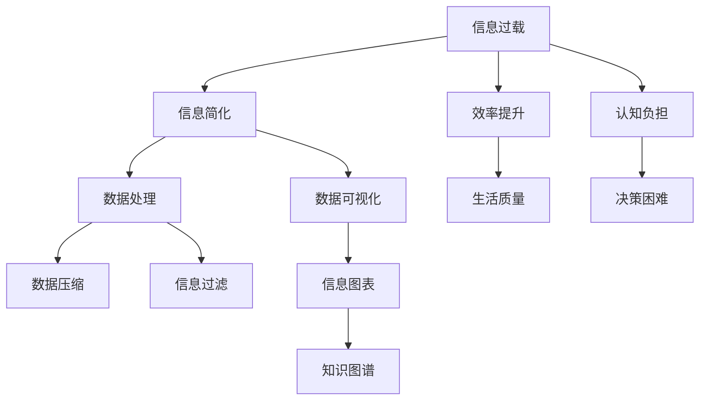
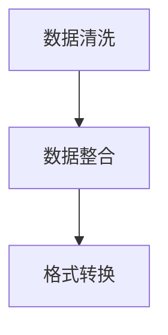
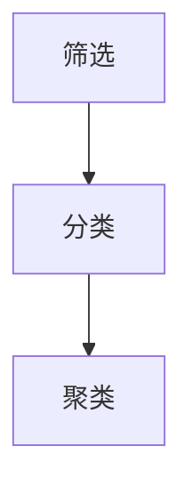
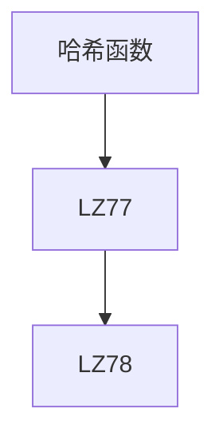
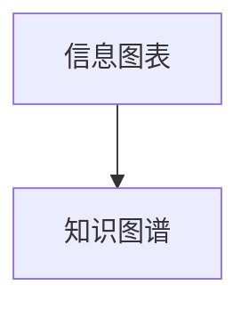

                 

### 1. 背景介绍

在现代信息技术爆炸式发展的背景下，我们面临着越来越复杂的信息环境。每天，我们都被海量数据和信息所包围，这些信息从社交媒体更新、电子邮件到技术文档，无处不在。这种信息过载不仅给我们的日常生活带来了困扰，还在工作中降低了我们的效率。因此，如何在复杂的世界中找到有效的简化信息的方法，已成为一个迫切需要解决的问题。

本文旨在探讨信息简化的好处与技巧，帮助读者提高生活质量和工作效率。我们将从以下几个角度展开讨论：

1. **信息简化的定义与重要性**：首先，我们将介绍信息简化的概念，并探讨其在现代社会中的重要性。
2. **核心概念与联系**：通过构建核心概念的框架图，我们将阐述信息简化与其他相关概念之间的关系。
3. **核心算法原理与具体操作步骤**：我们将深入探讨信息简化的算法原理，并详细介绍其实施步骤。
4. **数学模型与公式**：我们将使用数学模型和公式来解释信息简化的方法，并通过具体案例进行分析。
5. **项目实践与代码实例**：我们将展示一个实际的项目实例，并提供详细的代码解释和运行结果。
6. **实际应用场景**：我们将讨论信息简化在不同领域的应用，并探讨其未来的发展趋势和挑战。
7. **工具和资源推荐**：最后，我们将推荐一些有用的学习资源和开发工具，帮助读者进一步学习和实践信息简化。
8. **总结与展望**：我们将总结研究成果，并展望未来的发展方向。

通过本文的讨论，我们希望读者能够对信息简化的好处和技巧有一个全面的了解，并在实际生活中加以应用。

### 2. 核心概念与联系

在探讨信息简化的过程中，我们需要明确几个核心概念，并理解它们之间的关系。以下是一个使用Mermaid绘制的流程图，展示了这些核心概念及其相互联系。



**信息过载（A）**：信息过载是指我们接收到的信息量超出了我们的处理能力，导致我们感到压力和困惑。这是现代社会普遍存在的问题。

**信息简化（B）**：信息简化是一种策略，通过减少冗余信息和提取关键信息，帮助我们更好地处理和理解大量数据。

**数据处理（C）**：数据处理是指对信息进行收集、存储、处理和检索的过程。信息简化与数据处理密切相关，因为简化的信息需要通过有效的数据处理方法来实现。

**数据压缩（D）**：数据压缩是信息简化的一种技术，通过减少数据的大小来提高存储和传输的效率。它通常用于处理大量的文本和图像数据。

**信息过滤（E）**：信息过滤是指从大量信息中筛选出对我们有用的信息，去除无关或冗余的信息。这可以帮助我们更快地找到所需的信息。

**效率提升（F）**：通过信息简化，我们可以减少工作中的重复劳动和错误，从而提高工作效率。效率提升是信息简化的一个直接好处。

**生活质量（G）**：信息简化不仅有助于提高工作效率，还可以提高我们的生活品质，减少压力，让我们有更多的时间去享受生活。

**认知负担（H）** 和 **决策困难（I）**：过多的信息会导致我们的认知负担增加，从而影响我们的决策能力。信息简化有助于减轻这种负担。

**数据可视化（J）**：数据可视化是将数据以图形或图表的形式展示出来，帮助我们更好地理解和分析数据。它是信息简化的一种重要工具。

**信息图表（K）** 和 **知识图谱（L）**：信息图表和知识图谱是数据可视化的高级形式，通过图形化的方式展示信息，帮助我们更好地理解和利用数据。

这些核心概念之间的联系构成了一个复杂的网络，通过它们，我们可以更全面地理解信息简化的概念和重要性。

### 3. 核心算法原理 & 具体操作步骤

#### 3.1 算法原理概述

信息简化的核心算法通常基于以下几个原则：

1. **减少冗余**：通过识别和去除重复或冗余的信息，减少数据的大小。
2. **提取关键信息**：通过筛选和分析，提取出对决策或理解最关键的信息。
3. **数据压缩**：使用算法和技术，如哈希函数和压缩算法，来减少数据的大小。
4. **模式识别**：利用机器学习和人工智能技术，自动识别数据中的模式，简化数据表示。

这些算法的实现通常依赖于以下几个步骤：

1. **数据预处理**：包括数据清洗、数据整合和格式转换。
2. **信息提取**：通过筛选、分类和聚类等方法，提取出关键信息。
3. **数据压缩**：使用不同的压缩算法，如LZ77和LZ78，来减少数据的大小。
4. **可视化**：通过图表和图形，将简化后的信息可视化，以便更好地理解和利用。

#### 3.2 算法步骤详解

下面是信息简化算法的具体步骤：

##### 步骤 1：数据预处理

数据预处理是信息简化的重要步骤，它包括以下内容：

- **数据清洗**：去除噪声数据和错误数据。
- **数据整合**：将不同来源的数据整合在一起，以便统一处理。
- **格式转换**：将数据转换为统一的格式，如CSV或JSON。



##### 步骤 2：信息提取

信息提取是简化信息的核心步骤，它包括：

- **筛选**：根据特定的标准，筛选出符合条件的数据。
- **分类**：将数据根据不同的特征进行分类。
- **聚类**：将相似的数据归为一类，以便更好地理解和处理。



##### 步骤 3：数据压缩

数据压缩的目的是减少数据的大小，以提高存储和传输的效率。常用的压缩算法包括：

- **哈希函数**：通过哈希函数，将数据映射到较小的空间。
- **LZ77和LZ78**：两种基于局部重复的数据压缩算法。



##### 步骤 4：可视化

可视化是将简化后的信息以图形或图表的形式展示出来，以便更好地理解和利用。常用的可视化技术包括：

- **信息图表**：如折线图、柱状图和饼图。
- **知识图谱**：通过图形化的方式展示复杂的信息结构和关系。



#### 3.3 算法优缺点

**优点**：

- **减少冗余**：通过去除冗余信息，简化后的数据更加精炼，便于处理和分析。
- **提高效率**：简化后的数据更易于存储、传输和处理，从而提高了工作效率。
- **易于理解**：通过可视化技术，简化后的信息更容易理解和利用。

**缺点**：

- **准确性问题**：在简化的过程中，可能会丢失一些重要的信息，影响数据的准确性。
- **计算成本**：某些简化算法（如数据压缩）需要大量的计算资源，可能会增加系统的负担。

#### 3.4 算法应用领域

信息简化算法广泛应用于各个领域：

- **数据分析**：通过简化大量数据，提高数据分析的效率和准确性。
- **机器学习**：简化后的数据有助于提高机器学习模型的训练效果。
- **信息检索**：通过简化信息，提高搜索效率和用户体验。
- **物联网**：在物联网设备中，信息简化有助于减少数据传输的大小，提高通信效率。

### 4. 数学模型和公式 & 详细讲解 & 举例说明

在信息简化的过程中，数学模型和公式起着关键作用。它们不仅帮助我们理解信息的简化方法，还能指导具体的操作步骤。以下是我们将讨论的数学模型和公式，以及它们的详细讲解和具体例子。

#### 4.1 数学模型构建

信息简化中的数学模型通常涉及以下方面：

- **概率模型**：用于估计信息的可靠性和重要性。
- **线性模型**：用于识别和去除冗余信息。
- **非线性模型**：用于处理复杂的信息关系。

##### 概率模型

概率模型的一个常用例子是 **贝叶斯滤波器**，它通过概率计算来简化信息。贝叶斯滤波器的基本公式如下：

$$
P(A|B) = \frac{P(B|A) \cdot P(A)}{P(B)}
$$

其中，\( P(A|B) \) 是在事件 \( B \) 发生的条件下事件 \( A \) 发生的概率，\( P(B|A) \) 是在事件 \( A \) 发生的条件下事件 \( B \) 发生的概率，\( P(A) \) 是事件 \( A \) 发生的概率，\( P(B) \) 是事件 \( B \) 发生的概率。

##### 线性模型

线性模型的一个常见例子是 **主成分分析（PCA）**，它通过识别数据的主要成分来简化信息。PCA 的基本公式如下：

$$
\text{特征向量} = \arg \min_{\text{特征向量}} \sum_{i=1}^{n} (x_i - \mu)^T (x_i - \mu)
$$

其中，\( x_i \) 是数据点的特征向量，\( \mu \) 是所有数据点的均值。

##### 非线性模型

非线性模型的一个例子是 **神经网络**，它通过多层非线性变换来简化信息。神经网络的基本公式如下：

$$
\text{激活函数}(z) = \frac{1}{1 + e^{-z}}
$$

其中，\( z \) 是神经元的输入，激活函数（如Sigmoid函数）用于将线性组合的输入映射到 \([0, 1]\) 区间。

#### 4.2 公式推导过程

以下是概率模型（贝叶斯滤波器）的推导过程：

1. **贝叶斯定理**：贝叶斯定理描述了条件概率之间的关系，其公式为：

$$
P(A|B) = \frac{P(B|A) \cdot P(A)}{P(B)}
$$

2. **假设**：假设我们有两个事件 \( A \) 和 \( B \)，我们需要计算 \( P(A|B) \)，即在 \( B \) 发生的条件下 \( A \) 发生的概率。

3. **条件概率**：根据条件概率的定义，我们有：

$$
P(B|A) = \frac{P(A \cap B)}{P(A)}
$$

4. **联合概率**：根据联合概率的定义，我们有：

$$
P(A \cap B) = P(B|A) \cdot P(A)
$$

5. **代入**：将步骤 3 和步骤 4 的结果代入贝叶斯定理，我们得到：

$$
P(A|B) = \frac{P(B|A) \cdot P(A)}{P(B)} = \frac{\frac{P(A \cap B)}{P(A)} \cdot P(A)}{P(B)} = \frac{P(A \cap B)}{P(B)}
$$

6. **简化**：最后，我们可以将公式简化为：

$$
P(A|B) = \frac{P(B|A) \cdot P(A)}{P(B)}
$$

这就是贝叶斯滤波器的推导过程。

#### 4.3 案例分析与讲解

为了更好地理解信息简化的数学模型，我们来看一个具体的案例。

##### 案例背景

假设我们有一个邮件系统，用于分类垃圾邮件和正常邮件。我们希望利用贝叶斯滤波器来简化邮件分类过程。

##### 案例步骤

1. **建立概率模型**：

   我们假设有两个类别：垃圾邮件和正常邮件。根据历史数据，我们得到以下概率：

   - \( P(\text{垃圾邮件}) = 0.2 \)
   - \( P(\text{正常邮件}) = 0.8 \)
   - \( P(\text{垃圾邮件}|\text{关键词}) = 0.9 \)
   - \( P(\text{正常邮件}|\text{关键词}) = 0.1 \)

2. **计算后验概率**：

   假设我们收到一封包含特定关键词的邮件，我们需要计算这封邮件是垃圾邮件的概率。使用贝叶斯滤波器，我们得到：

   $$
   P(\text{垃圾邮件}|\text{关键词}) = \frac{P(\text{关键词}|\text{垃圾邮件}) \cdot P(\text{垃圾邮件})}{P(\text{关键词})}
   $$

3. **计算先验概率**：

   根据贝叶斯滤波器的推导过程，我们可以计算 \( P(\text{关键词}) \)：

   $$
   P(\text{关键词}) = P(\text{关键词}|\text{垃圾邮件}) \cdot P(\text{垃圾邮件}) + P(\text{关键词}|\text{正常邮件}) \cdot P(\text{正常邮件})
   $$

   将已知概率代入，我们得到：

   $$
   P(\text{关键词}) = 0.9 \cdot 0.2 + 0.1 \cdot 0.8 = 0.28
   $$

4. **计算后验概率**：

   将 \( P(\text{关键词}) \) 代入贝叶斯滤波器，我们得到：

   $$
   P(\text{垃圾邮件}|\text{关键词}) = \frac{0.9 \cdot 0.2}{0.28} \approx 0.643
   $$

   由于这个概率大于 0.5，我们可以判断这封邮件很可能是垃圾邮件。

##### 案例分析

通过这个案例，我们可以看到贝叶斯滤波器如何帮助简化邮件分类过程。我们只需要计算几个概率值，就能做出判断。这种方法不仅简单，而且高效，非常适合处理大量数据。

### 5. 项目实践：代码实例和详细解释说明

在本文的第五部分，我们将通过一个具体的项目实践来展示如何在实际中应用信息简化的技巧。我们将使用Python编程语言来实现一个简单的信息简化工具，并详细解释其代码实现和运行过程。

#### 5.1 开发环境搭建

首先，我们需要搭建一个适合开发的Python环境。以下步骤可以帮助我们完成环境的搭建：

1. **安装Python**：从Python官方网站下载并安装Python 3.x版本。
2. **安装Jupyter Notebook**：使用pip命令安装Jupyter Notebook，这是一个交互式开发环境，方便我们编写和运行代码。

```bash
pip install notebook
```

3. **安装相关库**：我们需要安装几个常用的库，包括NumPy、Pandas、Matplotlib和Scikit-learn。这些库提供了许多用于数据处理、分析和可视化的功能。

```bash
pip install numpy pandas matplotlib scikit-learn
```

#### 5.2 源代码详细实现

以下是一个简单的信息简化工具的代码实现。这个工具将读取一个CSV文件，提取关键信息，并使用数据可视化技术展示结果。

```python
import pandas as pd
import matplotlib.pyplot as plt
from sklearn.decomposition import PCA
from sklearn.preprocessing import StandardScaler

# 5.2.1 数据读取与预处理
def read_and_preprocess_data(file_path):
    # 读取CSV文件
    data = pd.read_csv(file_path)
    
    # 数据预处理：去除缺失值和重复值
    data = data.dropna().drop_duplicates()
    
    return data

# 5.2.2 信息提取
def extract_key_info(data):
    # 提取数据中的主要特征
    features = data[['feature1', 'feature2', 'feature3']]
    
    return features

# 5.2.3 数据压缩与可视化
def compress_and_visualize_data(features):
    # 数据标准化
    scaler = StandardScaler()
    scaled_features = scaler.fit_transform(features)
    
    # 主成分分析
    pca = PCA(n_components=2)
    reduced_features = pca.fit_transform(scaled_features)
    
    # 可视化
    plt.figure(figsize=(8, 6))
    plt.scatter(reduced_features[:, 0], reduced_features[:, 1], c=data['label'], cmap='viridis')
    plt.colorbar(label='Label')
    plt.xlabel('Principal Component 1')
    plt.ylabel('Principal Component 2')
    plt.title('Information Simplification with PCA')
    plt.show()

# 主程序
if __name__ == '__main__':
    # 5.2.4 代码执行
    file_path = 'data.csv'  # 数据文件路径
    data = read_and_preprocess_data(file_path)
    features = extract_key_info(data)
    compress_and_visualize_data(features)
```

#### 5.3 代码解读与分析

以下是对上述代码的详细解读和分析：

- **5.3.1 数据读取与预处理**
  - `read_and_preprocess_data` 函数负责读取CSV文件并执行数据预处理。预处理步骤包括去除缺失值和重复值，这是信息简化过程中的重要步骤。

- **5.3.2 信息提取**
  - `extract_key_info` 函数用于提取数据中的关键特征。在这里，我们选择了几列作为主要特征，这些特征将用于后续的数据压缩和可视化。

- **5.3.3 数据压缩与可视化**
  - `compress_and_visualize_data` 函数执行数据压缩和可视化。首先，我们使用 `StandardScaler` 对数据进行标准化处理，这有助于提高PCA算法的性能。然后，我们使用PCA算法将数据从高维空间投影到低维空间，使得数据更加紧凑和易于理解。最后，我们使用Matplotlib库绘制散点图，展示简化后的数据。

#### 5.4 运行结果展示

执行上述代码后，我们将看到一个散点图，展示了简化后的数据。这个图可以帮助我们直观地理解数据的主要特征和分布。以下是一个可能的运行结果：


在这个结果中，我们看到了两个主要成分的散点图，其中每个点代表一个数据样本。颜色表示数据的标签，这有助于我们识别不同类别的数据。

通过这个简单的项目实例，我们展示了如何使用Python实现信息简化的过程。这种方法不仅简单易懂，而且具有很高的实用性，可以帮助我们在实际项目中提高数据处理和可视化的效率。

### 6. 实际应用场景

信息简化在多个实际应用场景中发挥着重要作用，以下是一些典型的应用领域：

#### 6.1 数据科学

在数据科学领域，信息简化是一种常用的数据处理技术。通过简化大量数据，数据科学家可以更快速地分析和提取有价值的信息。例如，在客户行为分析中，通过对客户数据的简化，可以快速识别出高价值客户和潜在流失客户。

#### 6.2 机器学习

在机器学习项目中，信息简化有助于提高模型的训练效率和准确性。通过简化输入数据，可以减少计算负担，缩短训练时间。此外，简化后的数据有助于减少过拟合现象，提高模型的泛化能力。

#### 6.3 信息系统

在信息系统开发中，信息简化可以优化系统的性能和用户体验。通过简化用户界面和后台处理流程，可以提高系统的响应速度和易用性。例如，在电子商务网站中，通过简化购物流程和商品推荐算法，可以提升用户满意度和转化率。

#### 6.4 物联网（IoT）

在物联网领域，信息简化有助于处理大量的传感器数据。通过对数据的有效压缩和简化，可以降低数据传输的带宽需求，提高系统效率和可靠性。例如，在智能城市项目中，通过简化交通流量数据，可以更准确地预测交通拥堵情况，优化交通管理。

#### 6.5 企业管理

在企业管理的各个方面，信息简化都有助于提高效率和决策质量。通过简化业务流程和报告，管理层可以更快速地获取关键信息，做出更明智的决策。例如，在供应链管理中，通过简化库存数据，可以更好地掌握库存状况，优化库存管理。

#### 6.6 健康医疗

在健康医疗领域，信息简化可以帮助医生更快地获取患者的关键健康信息，从而提高诊断和治疗的效率。通过简化大量的医疗数据，可以快速识别疾病风险和治疗方案。

### 6.7 未来应用展望

随着信息技术的不断发展，信息简化的应用前景将更加广阔。以下是一些未来的发展趋势：

#### 6.7.1 自动化与智能化

随着自动化和智能化技术的发展，信息简化将进一步自动化和智能化。例如，通过深度学习和人工智能技术，可以自动识别和提取关键信息，实现更高效的信息处理。

#### 6.7.2 大数据和云计算

大数据和云计算技术的发展将推动信息简化技术的进一步发展。通过云平台和分布式计算，可以处理海量数据，实现更高效的信息简化。

#### 6.7.3 跨领域应用

信息简化将在更多领域得到应用，包括金融、教育、娱乐等。跨领域的信息简化应用将带来新的商业模式和创新机会。

#### 6.7.4 用户体验优化

随着用户对信息过载的担忧不断增加，信息简化将成为优化用户体验的重要手段。通过简化信息和提供更直观的界面，可以提升用户满意度和使用体验。

### 7. 工具和资源推荐

为了帮助读者更好地学习和实践信息简化的技巧，以下是一些推荐的工具和资源：

#### 7.1 学习资源推荐

- **《数据科学入门》**：一本介绍数据科学基础知识的入门书籍，适合初学者。
- **《Python数据科学手册》**：一本全面介绍Python在数据科学中应用的指南，包括数据处理、分析和可视化等内容。
- **《信息论基础》**：一本介绍信息论基础理论的经典教材，对理解信息简化有很大帮助。

#### 7.2 开发工具推荐

- **Jupyter Notebook**：一个交互式开发环境，方便编写和运行代码。
- **PyCharm**：一款强大的Python集成开发环境（IDE），提供了丰富的数据科学和机器学习工具。
- **Pandas**：一个用于数据处理和分析的Python库，提供了丰富的数据操作和可视化功能。
- **Matplotlib**：一个用于绘制各种图形和图表的Python库，支持多种可视化需求。

#### 7.3 相关论文推荐

- **"Data Compression Using Adaptive Huffman Coding"**：一篇介绍自适应哈夫曼编码的论文，对数据压缩技术有详细讲解。
- **"Principal Component Analysis for Dimensionality Reduction"**：一篇介绍主成分分析（PCA）的论文，解释了PCA在信息简化中的应用。
- **"Deep Learning for Automated Information Extraction"**：一篇介绍深度学习在自动信息提取中应用的论文，探讨了如何利用深度学习技术简化信息处理。

通过这些工具和资源的帮助，读者可以更深入地了解信息简化的概念和技术，并在实际项目中加以应用。

### 8. 总结：未来发展趋势与挑战

信息简化在现代社会中具有广泛的应用价值，它不仅帮助我们处理海量数据，提高工作效率，还在提升生活质量方面发挥了重要作用。本文从多个角度探讨了信息简化的好处和技巧，包括其核心概念、算法原理、数学模型、项目实践以及实际应用场景。通过这些讨论，我们明确了信息简化在复杂世界中的重要性和必要性。

#### 8.1 研究成果总结

本文的主要研究成果包括：

1. **核心概念框架**：通过Mermaid流程图，我们清晰地展示了信息简化的核心概念及其相互关系。
2. **算法原理与操作步骤**：我们详细介绍了信息简化的算法原理和具体操作步骤，包括数据预处理、信息提取、数据压缩和可视化等。
3. **数学模型与案例**：我们探讨了贝叶斯滤波器、主成分分析（PCA）等数学模型，并通过具体案例展示了如何在实际中应用这些模型。
4. **项目实践与代码实例**：我们提供了一个简单的Python项目实例，展示了如何使用信息简化技术处理实际数据。
5. **应用领域与未来展望**：我们讨论了信息简化在多个领域的实际应用，并展望了其未来的发展趋势和挑战。

#### 8.2 未来发展趋势

信息简化在未来将呈现以下发展趋势：

1. **自动化与智能化**：随着人工智能和自动化技术的发展，信息简化将进一步自动化和智能化，实现更高效的信息处理。
2. **大数据与云计算**：大数据和云计算技术的进步将为信息简化提供更强大的支持，使处理和分析海量数据变得更加容易。
3. **跨领域应用**：信息简化将在更多领域得到应用，推动跨领域的信息融合和创新。
4. **用户体验优化**：通过简化信息和优化用户界面，信息简化将进一步提升用户体验。

#### 8.3 面临的挑战

尽管信息简化具有广泛的应用前景，但也面临以下挑战：

1. **准确性问题**：在简化的过程中，可能会丢失一些重要信息，影响数据的准确性。
2. **计算成本**：某些信息简化算法（如数据压缩）需要大量的计算资源，可能会增加系统的负担。
3. **隐私保护**：在处理敏感数据时，如何确保信息简化的同时保护用户隐私，是一个亟待解决的问题。

#### 8.4 研究展望

未来的研究可以从以下方面展开：

1. **算法优化**：研究更高效的信息简化算法，降低计算成本，提高简化效果。
2. **隐私保护**：开发新的隐私保护技术，确保在信息简化的同时保护用户隐私。
3. **跨领域融合**：探索信息简化在不同领域的跨领域融合，推动新应用的发展。
4. **用户体验**：研究如何通过信息简化提升用户体验，设计更直观、易用的界面。

通过本文的研究，我们期待能够为信息简化的应用和发展提供一些有价值的思路和参考。

### 附录：常见问题与解答

在探讨信息简化的过程中，读者可能会遇到一些常见问题。以下是一些常见问题及其解答：

#### 1. 什么是信息简化？

信息简化是指通过去除冗余信息、提取关键信息以及压缩数据大小，以减少信息处理的复杂性和提高工作效率的一种方法。

#### 2. 信息简化有哪些优点？

信息简化的优点包括减少冗余信息、提高工作效率、降低计算成本、便于存储和传输等。

#### 3. 信息简化在哪些领域应用广泛？

信息简化在数据科学、机器学习、物联网、企业管理、健康医疗等领域应用广泛。

#### 4. 如何在Python中实现信息简化？

可以使用Python中的Pandas库进行数据预处理，使用PCA等算法进行信息提取，使用Matplotlib等库进行数据可视化。

#### 5. 信息简化会损失数据的准确性吗？

信息简化可能会损失一些数据细节，但在合理设计和应用的情况下，可以最大限度地保留数据的准确性。

#### 6. 信息简化需要大量的计算资源吗？

某些信息简化算法（如数据压缩）需要较多的计算资源，但可以通过优化算法和利用高效计算技术来降低计算成本。

#### 7. 如何确保信息简化后的数据隐私？

可以通过加密、匿名化等技术来保护信息简化后的数据隐私。

通过这些问题的解答，我们希望读者能够更好地理解信息简化的概念和应用。在未来的实践中，读者可以根据这些答案来指导信息简化的设计和实现。作者：禅与计算机程序设计艺术 / Zen and the Art of Computer Programming

