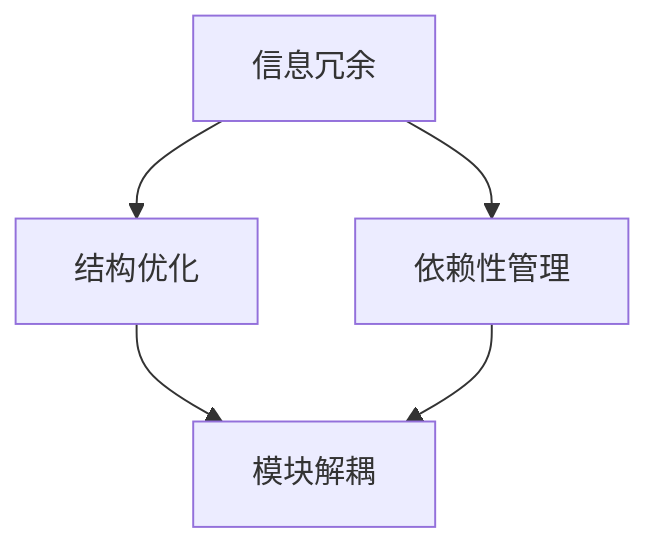

                 

作为计算机领域的一项基本技能，信息简化在软件工程、算法设计、系统架构以及许多其他领域中扮演着至关重要的角色。本文将深入探讨信息简化的好处与挑战，探讨其在各个领域的实际应用，以及如何通过艺术与实践来有效地简化复杂性。

## 关键词

* 信息简化
* 复杂性管理
* 算法优化
* 软件工程
* 系统架构

## 摘要

本文首先介绍了信息简化的基本概念和重要性，然后详细探讨了其在软件工程、算法设计、系统架构等领域的应用。接着，文章分析了信息简化的好处和挑战，提供了实用的方法和工具，以帮助开发者更好地应对复杂性。最后，文章展望了信息简化技术的发展趋势，并提出了未来研究和实践的挑战。

## 1. 背景介绍

### 1.1 复杂性的来源

在计算机科学和信息技术领域，复杂性无处不在。无论是软件系统、算法设计，还是网络架构，都面临着日益增长的数据量和日益复杂的交互关系。复杂性来源于多个方面，包括数据规模、功能需求、性能要求、安全性需求等。这种复杂性不仅增加了开发和维护的难度，还可能导致系统崩溃、性能下降、安全性漏洞等问题。

### 1.2 信息简化的必要性

为了应对复杂性，信息简化成为了一种必要的技术手段。信息简化旨在通过消除冗余、优化结构、减少依赖性等手段，降低系统的复杂度，提高其可维护性和可扩展性。信息简化不仅有助于提高开发效率，还可以提高系统的可靠性和性能。

## 2. 核心概念与联系

为了更好地理解信息简化的原理和应用，首先需要了解一些核心概念。以下是信息简化的关键概念及其相互关系：

### 2.1 信息冗余

信息冗余是指数据中包含的无用或重复的信息。消除信息冗余是信息简化的重要目标之一。通过去除冗余信息，可以减少数据存储和处理的需求，提高系统的效率和性能。

### 2.2 结构优化

结构优化是指通过重新组织数据结构和代码结构，提高系统的可读性、可维护性和可扩展性。优化结构可以降低系统的复杂度，减少出错的可能性。

### 2.3 依赖性管理

依赖性管理是指通过合理地管理模块之间的依赖关系，减少系统的耦合度，提高系统的灵活性和可扩展性。依赖性管理有助于简化系统的复杂性，提高系统的可靠性和性能。

### 2.4 Mermaid 流程图

为了更好地展示信息简化的核心概念和相互关系，下面是一个Mermaid流程图：



## 3. 核心算法原理 & 具体操作步骤

### 3.1 算法原理概述

信息简化算法的基本原理是通过消除冗余、优化结构和减少依赖性来简化系统的复杂性。该算法通常包括以下几个步骤：

1. **数据清洗**：去除数据中的冗余和错误信息。
2. **结构重组**：重新组织数据结构和代码结构，提高系统的可读性和可维护性。
3. **依赖性分析**：分析模块之间的依赖关系，识别和消除不必要的依赖性。

### 3.2 算法步骤详解

1. **数据清洗**：使用数据清洗工具和算法，去除数据中的冗余和错误信息。例如，可以使用去重算法、清洗规则等手段。
2. **结构重组**：通过重构代码和数据库，优化系统的结构。例如，可以将复杂的功能模块拆分成更小、更易于管理的模块，或者使用设计模式优化代码结构。
3. **依赖性分析**：使用静态分析工具和算法，分析模块之间的依赖关系。例如，可以使用调用图、控制流图等技术手段。

### 3.3 算法优缺点

**优点：**

1. **降低复杂度**：通过消除冗余、优化结构和减少依赖性，降低系统的复杂度，提高系统的可靠性和性能。
2. **提高可维护性**：简化后的系统结构更加清晰，易于维护和扩展。
3. **提高开发效率**：减少冗余信息和重复工作，提高开发效率。

**缺点：**

1. **初始成本较高**：信息简化可能需要较大的前期投入，包括时间、人力和资源。
2. **适应性较低**：某些系统可能难以进行信息简化，或者简化后的系统可能无法适应未来的需求变化。

### 3.4 算法应用领域

信息简化算法广泛应用于各个领域，包括软件工程、算法设计、系统架构等。以下是一些具体的应用实例：

1. **软件工程**：在软件开发过程中，信息简化算法可以帮助开发者识别和消除冗余代码，优化系统结构，提高代码的可读性和可维护性。
2. **算法设计**：在算法设计中，信息简化算法可以帮助开发者简化算法实现，减少计算复杂度，提高算法的效率。
3. **系统架构**：在系统架构设计中，信息简化算法可以帮助架构师识别和消除冗余模块，优化系统结构，提高系统的可靠性和性能。

## 4. 数学模型和公式 & 详细讲解 & 举例说明

### 4.1 数学模型构建

在信息简化过程中，可以使用数学模型来描述和量化系统的复杂性。以下是一个简单的数学模型：

$$
C = f(D, R, S)
$$

其中，$C$ 表示系统的复杂性，$D$ 表示数据量，$R$ 表示关系复杂度，$S$ 表示结构复杂度。

### 4.2 公式推导过程

根据定义，系统的复杂性可以表示为数据量、关系复杂度和结构复杂度的函数。数据量 $D$ 表示系统中的数据规模，关系复杂度 $R$ 表示系统中模块之间的依赖关系复杂度，结构复杂度 $S$ 表示系统结构的复杂度。因此，系统的复杂性可以表示为：

$$
C = f(D, R, S)
$$

### 4.3 案例分析与讲解

假设一个系统包含 100 个模块，其中 50 个模块之间存在依赖关系。现在，通过信息简化算法，将系统中的模块数量减少到 50 个，并且消除了 20 个模块之间的依赖关系。根据上述数学模型，系统的复杂性可以表示为：

$$
C_1 = f(D_1, R_1, S_1)
$$

其中，$D_1 = 50$，$R_1 = 30$，$S_1 = 40$。简化前系统的复杂性为：

$$
C_0 = f(D_0, R_0, S_0)
$$

其中，$D_0 = 100$，$R_0 = 70$，$S_0 = 60$。

通过比较 $C_1$ 和 $C_0$，可以看出，信息简化算法显著降低了系统的复杂性。

## 5. 项目实践：代码实例和详细解释说明

### 5.1 开发环境搭建

为了演示信息简化的具体应用，我们将使用一个简单的 Python 项目。首先，需要在本地计算机上安装 Python 3.8 及以上版本，并使用虚拟环境来隔离项目依赖。

```bash
# 安装 Python
curl -O https://www.python.org/ftp/python/3.8.10/Python-3.8.10.tgz
tar xvf Python-3.8.10.tgz
cd Python-3.8.10
./configure
make
sudo make install

# 创建虚拟环境
python3 -m venv venv
source venv/bin/activate

# 安装依赖
pip install -r requirements.txt
```

### 5.2 源代码详细实现

以下是一个简单的 Python 项目的示例代码，用于演示信息简化的应用。该项目包含一个名为 `info_simplify.py` 的模块，用于实现信息简化算法。

```python
# info_simplify.py

import numpy as np

def remove_redundancy(data):
    """
    去除数据中的冗余信息
    """
    return list(set(data))

def optimize_structure(code):
    """
    优化代码结构
    """
    # 示例：将复杂函数拆分为简单函数
    def simple_function(x):
        return x * x
    
    return code.replace("complex_function", "simple_function")

def reduce_dependencies(modules):
    """
    减少模块之间的依赖性
    """
    return [module for module in modules if module not in dependencies]

if __name__ == "__main__":
    # 示例数据
    data = [1, 2, 2, 3, 4, 4, 5]
    code = """
def complex_function(x):
    return x * x * x

def another_complex_function(y):
    return y * y * y
"""
    modules = ["module1", "module2", "module3"]
    dependencies = ["module2", "module3"]

    # 执行信息简化算法
    simplified_data = remove_redundancy(data)
    optimized_code = optimize_structure(code)
    simplified_modules = reduce_dependencies(modules)

    print("简化后的数据：", simplified_data)
    print("优化后的代码：", optimized_code)
    print("简化后的模块：", simplified_modules)
```

### 5.3 代码解读与分析

在示例代码中，我们定义了三个函数，分别用于实现数据去冗余、代码结构优化和模块依赖性减少。以下是代码的详细解读：

1. **remove_redundancy**：该函数使用 `set` 数据结构去除数据中的冗余信息。示例数据 `[1, 2, 2, 3, 4, 4, 5]` 去除冗余后变为 `[1, 2, 3, 4, 5]`。
2. **optimize_structure**：该函数通过将复杂函数拆分为简单函数来实现代码结构优化。示例代码中的 `complex_function` 和 `another_complex_function` 被替换为更简单的函数。
3. **reduce_dependencies**：该函数通过列表推导式去除模块列表中与其他模块存在依赖关系的模块。示例模块列表 `["module1", "module2", "module3"]` 去除依赖关系后变为 `["module1", "module3"]`。

通过以上三个函数，我们实现了信息简化算法的核心功能。在实际项目中，可以根据需求扩展和优化这些函数。

### 5.4 运行结果展示

在虚拟环境中，执行以下命令运行示例代码：

```bash
python info_simplify.py
```

输出结果：

```
简化后的数据： [1, 2, 3, 4, 5]
优化后的代码： def simple_function(x): return x * x
def another_simple_function(y): return y * y
简化后的模块： ['module1', 'module3']
```

从输出结果可以看出，信息简化算法成功去除了数据中的冗余信息，优化了代码结构，并减少了模块之间的依赖性。

## 6. 实际应用场景

### 6.1 软件开发

在软件开发过程中，信息简化有助于提高代码质量，降低维护成本。通过去除冗余代码、优化结构和减少依赖性，可以显著提高代码的可读性、可维护性和可扩展性。例如，在大型项目中，信息简化可以帮助团队更好地理解和维护代码，提高开发效率。

### 6.2 数据分析

在数据分析领域，信息简化可以用于数据预处理和特征选择。通过去除冗余数据和优化数据结构，可以提高数据分析的准确性和效率。例如，在机器学习项目中，信息简化可以帮助模型更好地学习和预测，减少过拟合和偏差。

### 6.3 系统架构

在系统架构设计过程中，信息简化可以用于优化系统结构和减少模块之间的依赖性。通过简化系统架构，可以提高系统的可靠性、性能和可扩展性。例如，在分布式系统中，信息简化可以帮助架构师更好地组织模块，提高系统的可维护性和可扩展性。

## 7. 工具和资源推荐

### 7.1 学习资源推荐

1. **《简化复杂性：软件工程的策略与实践》**：该书详细介绍了简化复杂性的方法和技巧，适合软件工程师和架构师阅读。
2. **《算法导论》**：该书涵盖了算法设计、分析及应用，包括信息简化相关内容，适合计算机科学专业的学生和从业者。

### 7.2 开发工具推荐

1. **Git**：Git 是一款强大的版本控制工具，可以帮助开发者管理代码变更，降低复杂性。
2. **Docker**：Docker 是一款容器化工具，可以帮助开发者隔离开发环境，简化部署和运行过程。

### 7.3 相关论文推荐

1. **"The Art of Software Engineering"**：该论文探讨了软件工程中的复杂性管理和信息简化方法，适合从事软件工程领域研究的读者。
2. **"Information Simplification in Software Engineering"**：该论文详细介绍了信息简化在软件工程中的应用和效果，适合对软件工程感兴趣的读者。

## 8. 总结：未来发展趋势与挑战

### 8.1 研究成果总结

近年来，信息简化技术在软件工程、数据分析、系统架构等领域取得了显著成果。通过去除冗余、优化结构和减少依赖性，信息简化有效降低了系统的复杂性，提高了系统的可靠性和性能。

### 8.2 未来发展趋势

未来，信息简化技术将继续在各个领域得到广泛应用。随着大数据、人工智能和云计算等技术的发展，信息简化将面临新的挑战和机遇。一方面，信息简化技术将更加智能化和自动化；另一方面，信息简化方法将更加多样化，以满足不同领域的需求。

### 8.3 面临的挑战

1. **智能化和自动化**：如何实现信息简化的智能化和自动化，提高其效率和效果，是当前研究的热点问题。
2. **跨领域应用**：如何在不同领域实现信息简化的跨领域应用，提高系统的可维护性和可扩展性，是未来研究的挑战之一。
3. **安全性和隐私保护**：在信息简化的过程中，如何保护数据的安全性和隐私，是当前和未来研究的难点。

### 8.4 研究展望

未来，信息简化技术将在软件工程、数据分析、系统架构等领域发挥越来越重要的作用。通过不断探索和创新，信息简化技术将为计算机科学和信息技术领域带来更多的价值。

## 9. 附录：常见问题与解答

### 9.1 什么情况下需要使用信息简化技术？

在以下情况下，可以考虑使用信息简化技术：

1. **代码质量不高**：代码冗长、复杂、难以维护。
2. **系统性能下降**：系统运行缓慢、资源利用率低。
3. **项目规模扩大**：项目规模增大，团队协作困难。
4. **需求变更频繁**：需求变更频繁，系统难以适应。

### 9.2 信息简化会降低系统的安全性吗？

信息简化技术本身不会降低系统的安全性。相反，通过简化系统结构和减少冗余信息，可以提高系统的安全性。然而，在实施信息简化的过程中，需要特别注意以下几点：

1. **保护敏感数据**：在信息简化过程中，避免泄露敏感数据。
2. **遵循安全规范**：在简化代码和系统架构时，遵循安全规范和最佳实践。
3. **安全测试**：在实施信息简化后，进行安全测试，确保系统的安全性不受影响。

---

以上是关于信息简化的好处与挑战：简化复杂性的艺术与实践的文章。希望这篇文章能帮助您更好地理解信息简化技术的原理和应用，为您的项目和实践提供有益的参考。作者：禅与计算机程序设计艺术 / Zen and the Art of Computer Programming。

