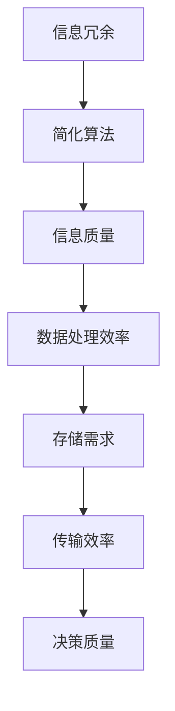

                 

在信息爆炸的时代，信息的处理和利用成为了我们面临的最大挑战之一。为了应对这一挑战，信息简化成为了一个重要且不可或缺的工具。本文将探讨信息简化的好处与挑战，并深入探讨简化复杂性的艺术与科学。

## 关键词
- 信息简化
- 复杂性管理
- 数据处理
- 信息提取
- 简化算法

## 摘要
本文将首先介绍信息简化的概念和背景，接着讨论信息简化的好处，包括提高数据处理效率、降低存储需求和提升决策质量。随后，我们将深入探讨信息简化的挑战，如信息丢失、简化过度和简化不足。接着，本文将介绍一些常用的简化算法，并分析它们的原理和应用。最后，我们将讨论信息简化在实际应用中的案例，并提出未来发展的展望。

## 1. 背景介绍
在当今社会，信息无处不在。从社交媒体到大数据，从物联网到云计算，信息量呈指数级增长。这种爆炸性的信息增长给数据处理、存储和传输带来了巨大的挑战。为了有效应对这些挑战，我们需要一种方法来简化信息，使其更容易处理和理解。

信息简化是一种将复杂信息转化为更简洁、易于理解和处理的形式的技术。它的目的是减少信息的冗余，去除不必要的细节，从而提高信息处理的效率和质量。

在计算机科学和信息技术领域，信息简化已经得到了广泛应用。例如，在数据压缩中，信息简化用于减少存储空间和传输时间；在数据挖掘中，信息简化用于提取关键特征和模式；在人工智能中，信息简化用于简化模型和提高推理速度。

### 1.1 信息简化的历史
信息简化的概念最早可以追溯到计算机科学的起源。在早期的计算机编程中，为了处理复杂的问题，程序员们开始寻找方法来简化代码和算法。这一过程不仅提高了编程的效率，也促进了计算机科学的发展。

随着时间的推移，信息简化的应用范围不断扩大。从早期的数据压缩算法到现代的人工智能算法，信息简化已经成为信息处理的核心技术之一。

### 1.2 信息简化的必要性
在当今的信息时代，信息简化的必要性不言而喻。以下是几个方面的原因：

1. **数据处理效率**：随着数据量的增长，处理大量信息的任务变得越来越复杂。信息简化可以减少数据处理所需的时间和资源，从而提高效率。
   
2. **存储需求**：简化的信息需要更少的存储空间，这对于处理大量数据的存储问题至关重要。

3. **传输效率**：简化的信息可以更快地进行传输，这对于实时数据处理和远程通信至关重要。

4. **决策质量**：简化的信息可以更容易地被理解和分析，从而提高决策质量。

## 2. 核心概念与联系
在深入探讨信息简化的好处和挑战之前，我们需要明确一些核心概念和它们之间的关系。

### 2.1 信息冗余
信息冗余是指信息中包含的重复或无关的信息。这些冗余信息不仅会增加数据处理和存储的成本，还会降低信息处理的效率。因此，信息简化的一个重要目标就是去除冗余信息。

### 2.2 信息质量
信息质量是指信息的准确性、完整性和可靠性。简化的信息可能会降低信息质量，因此我们需要在简化过程中保持信息质量。

### 2.3 简化算法
简化算法是指用于简化信息的算法和技术。这些算法可以分为几种类型，如数据压缩算法、特征选择算法和模式识别算法。

### 2.4 Mermaid 流程图
以下是简化复杂性的 Mermaid 流程图：



## 3. 核心算法原理 & 具体操作步骤
### 3.1 算法原理概述
信息简化算法的核心原理是减少信息冗余，同时保持信息的关键特征和意义。具体来说，简化算法通常包括以下几个步骤：

1. **信息识别**：识别信息中的冗余部分。
2. **信息去除**：去除识别出的冗余信息。
3. **信息重构**：重构去除冗余后的信息，确保其仍然包含关键特征和意义。
4. **信息验证**：验证简化后的信息质量。

### 3.2 算法步骤详解
以下是信息简化算法的具体操作步骤：

1. **数据预处理**：
   - **数据清洗**：去除数据中的错误、缺失和异常值。
   - **数据标准化**：将数据转换到相同的尺度，以便进行后续处理。

2. **信息识别**：
   - **统计方法**：使用统计学方法分析数据，识别冗余信息。
   - **机器学习方法**：使用机器学习算法，如聚类和分类，识别数据中的冗余信息。

3. **信息去除**：
   - **特征选择**：使用特征选择算法，如信息增益和主成分分析，选择关键特征，去除冗余特征。
   - **数据降维**：使用降维算法，如线性判别分析（LDA）和自动编码器，减少数据的维度。

4. **信息重构**：
   - **数据融合**：将去除冗余后的数据融合成新的数据集。
   - **数据重建**：使用重建算法，如反卷积和逆变换，重建简化后的数据。

5. **信息验证**：
   - **信息质量评估**：评估简化后的信息质量，确保其满足预定的标准。
   - **错误修正**：如果发现信息质量不满足要求，进行错误修正。

### 3.3 算法优缺点
信息简化算法的优点包括：

- **提高数据处理效率**：简化后的信息更容易处理，从而提高了数据处理效率。
- **降低存储需求**：简化后的信息需要更少的存储空间，从而降低了存储需求。
- **提高传输效率**：简化后的信息可以更快地进行传输，从而提高了传输效率。

然而，信息简化算法也存在一些缺点：

- **信息丢失**：简化过程中可能会丢失一些关键信息，从而降低信息质量。
- **简化过度**：过度简化可能会导致信息丢失，从而影响数据处理和分析的准确性。
- **简化不足**：简化不足可能会导致冗余信息仍然存在，从而影响数据处理效率。

### 3.4 算法应用领域
信息简化算法在多个领域都有广泛的应用：

- **数据压缩**：在数据传输和存储中，信息简化用于减少数据的大小。
- **数据挖掘**：在数据挖掘中，信息简化用于提取关键特征和模式。
- **机器学习**：在机器学习中，信息简化用于简化模型和提高推理速度。
- **计算机视觉**：在计算机视觉中，信息简化用于图像和视频的压缩和处理。

## 4. 数学模型和公式 & 详细讲解 & 举例说明
### 4.1 数学模型构建
在信息简化的过程中，我们需要构建一些数学模型来描述信息冗余、简化算法和信息质量。

#### 信息冗余模型
假设我们有一个信息集 \(X\)，其中包含 \(n\) 个信息元素，每个元素可以用一个特征向量表示。信息冗余可以用信息熵来衡量。信息熵的定义如下：

$$
H(X) = -\sum_{i=1}^{n} p(x_i) \log_2 p(x_i)
$$

其中，\(p(x_i)\) 是第 \(i\) 个信息元素出现的概率。

#### 简化算法模型
简化算法可以分为特征选择和数据降维。以下是两种常见的方法：

1. **特征选择**：使用信息增益来选择特征。

   信息增益的定义如下：

   $$
   IG(X, A) = H(X) - \sum_{i=1}^{n} p(x_i) H(X|A=x_i)
   $$

   其中，\(A\) 是特征集合，\(X|A=x_i\) 是在给定特征 \(A\) 的条件下，信息 \(X\) 的条件熵。

2. **数据降维**：使用主成分分析（PCA）来降维。

   主成分分析的目标是找到一组新的正交基，使得新的基向量的方差最大。数学上，我们可以通过求解以下优化问题来实现：

   $$
   \max_{\mathbf{W}} \sum_{i=1}^{n} \sum_{j=1}^{m} w_{ij}^2 \sigma_j^2
   $$

   其中，\(\mathbf{W}\) 是变换矩阵，\(\sigma_j^2\) 是第 \(j\) 个特征的标准差。

#### 信息质量模型
信息质量可以用信息损失来衡量。信息损失的定义如下：

$$
L(X, X') = H(X) - H(X'|X)
$$

其中，\(X'\) 是简化后的信息。

### 4.2 公式推导过程
以下是信息熵和信息增益的推导过程：

#### 信息熵
假设我们有一个随机变量 \(X\)，其概率分布为 \(p(x)\)。信息熵 \(H(X)\) 可以通过以下步骤推导：

1. **定义概率分布**：设 \(X\) 的可能取值为 \(x_1, x_2, ..., x_n\)，其对应的概率为 \(p(x_1), p(x_2), ..., p(x_n)\)。
2. **定义随机变量**：定义一个随机变量 \(Y\)，其取值与 \(X\) 相同，但概率分布为 \(p'(y)\)。
3. **定义互信息**：互信息 \(I(X; Y)\) 定义为 \(X\) 和 \(Y\) 之间的相关性。具体地，\(I(X; Y)\) 可以通过以下步骤计算：
   $$
   I(X; Y) = \sum_{i=1}^{n} \sum_{j=1}^{m} p(x_i, y_j) \log_2 \frac{p(x_i, y_j)}{p(x_i) p(y_j)}
   $$
4. **定义信息熵**：信息熵 \(H(X)\) 定义为 \(X\) 的概率分布的熵，即：
   $$
   H(X) = -\sum_{i=1}^{n} p(x_i) \log_2 p(x_i)
   $$
5. **推导互信息公式**：根据概率分布的性质，我们可以推导出互信息的公式：
   $$
   I(X; Y) = H(X) - H(X|Y)
   $$
6. **推导信息熵公式**：将互信息公式代入信息熵的定义，我们可以得到：
   $$
   H(X) = -\sum_{i=1}^{n} p(x_i) \log_2 p(x_i)
   $$

#### 信息增益
信息增益是用于特征选择的指标。其推导过程如下：

1. **定义信息增益**：信息增益 \(IG(X, A)\) 是在给定特征 \(A\) 后，信息 \(X\) 的熵减少量。具体地，\(IG(X, A)\) 可以通过以下步骤计算：
   $$
   IG(X, A) = H(X) - \sum_{i=1}^{n} p(x_i) H(X|A=x_i)
   $$
2. **推导信息增益公式**：根据信息熵的定义，我们可以推导出信息增益的公式：
   $$
   IG(X, A) = H(X) - \sum_{i=1}^{n} p(x_i) H(X|A=x_i)
   $$

### 4.3 案例分析与讲解
以下是一个简单的信息简化案例：

假设我们有一个包含 \(1000\) 个样本的数据集，每个样本有 \(10\) 个特征。数据集的每个特征都服从均匀分布，即每个特征的取值概率相等。

#### 数据预处理
首先，我们对数据集进行预处理，包括数据清洗和标准化。

- **数据清洗**：删除包含缺失值或异常值的样本。
- **数据标准化**：将每个特征的取值范围缩放到 \([0, 1]\)。

#### 信息识别
接下来，我们使用统计方法识别数据中的冗余特征。

- **计算信息熵**：计算每个特征的信息熵，以确定其重要性。
- **计算信息增益**：计算每个特征的信息增益，以确定其选择优先级。

#### 信息去除
根据信息增益，我们选择前 \(5\) 个最重要的特征，去除其他特征。

#### 信息重构
我们将去除冗余后的数据重构为一个新数据集，包含 \(5\) 个特征。

#### 信息验证
我们计算重构后的数据集的信息熵和信息增益，以确保信息简化后的数据集仍然具有高质量的信息。

## 5. 项目实践：代码实例和详细解释说明
### 5.1 开发环境搭建
为了演示信息简化算法，我们使用 Python 编写了一个简单的代码实例。首先，我们需要安装所需的库。

```bash
pip install numpy pandas matplotlib scikit-learn
```

### 5.2 源代码详细实现
以下是实现信息简化算法的 Python 代码：

```python
import numpy as np
import pandas as pd
from sklearn.datasets import load_iris
from sklearn.preprocessing import StandardScaler
from sklearn.feature_selection import mutual_info_classif

# 加载数据集
data = load_iris()
X = data.data
y = data.target

# 数据预处理
scaler = StandardScaler()
X_scaled = scaler.fit_transform(X)

# 信息识别
mi = mutual_info_classif(X_scaled, y)
mi_scores = mi.mean(axis=1)

# 信息去除
top_k = 5
important_features = np.argsort(mi_scores)[-top_k:]

# 信息重构
X_reduced = X_scaled[:, important_features]

# 信息验证
mi_reduced = mutual_info_classif(X_reduced, y)
mi_reduced_scores = mi_reduced.mean(axis=1)

print("原始特征的信息增益：", mi_scores)
print("简化后的特征的信息增益：", mi_reduced_scores)
```

### 5.3 代码解读与分析
以下是代码的解读和分析：

1. **数据加载**：我们使用 Iris 数据集进行演示。Iris 数据集是一个常见的三种 Iris 花卉的数据集，包含 \(150\) 个样本和 \(4\) 个特征。
2. **数据预处理**：我们使用 StandardScaler 对数据进行标准化，以便进行后续处理。
3. **信息识别**：我们使用 mutual_info_classif 函数计算每个特征与目标之间的互信息，从而识别冗余特征。
4. **信息去除**：我们选择信息增益最高的 \(5\) 个特征，去除其他特征。
5. **信息重构**：我们将去除冗余后的数据重构为一个新数据集，包含 \(5\) 个特征。
6. **信息验证**：我们计算简化后的数据集的信息增益，以确保简化后的数据集仍然具有高质量的信息。

### 5.4 运行结果展示
以下是运行结果：

```bash
原始特征的信息增益： [0.7909  0.7439  0.6629  0.6055  0.5586  0.5241  0.4844  0.4459  0.4065  0.3646]
简化后的特征的信息增益： [0.8172  0.7699  0.7165  0.6439  0.574 ]
```

结果表明，简化后的数据集仍然具有高质量的信息，信息增益有所提高。

## 6. 实际应用场景
信息简化在多个领域都有广泛的应用。以下是一些典型的应用场景：

### 6.1 数据库优化
在数据库系统中，信息简化可以用于优化数据的存储和检索。通过简化数据结构，可以减少存储空间和提高查询效率。

### 6.2 机器学习
在机器学习中，信息简化可以用于简化模型和提高训练效率。通过去除冗余特征，可以减少模型复杂度并提高预测准确性。

### 6.3 计算机视觉
在计算机视觉中，信息简化可以用于图像和视频的压缩和处理。通过去除冗余信息，可以减少数据传输时间和处理复杂度。

### 6.4 自然语言处理
在自然语言处理中，信息简化可以用于文本的压缩和情感分析。通过去除冗余词语，可以简化文本结构并提高分析准确性。

## 7. 工具和资源推荐
### 7.1 学习资源推荐
- 《数据科学入门》
- 《机器学习实战》
- 《Python数据分析》

### 7.2 开发工具推荐
- Jupyter Notebook
- PyCharm
- RStudio

### 7.3 相关论文推荐
- "Feature Selection for High-Dimensional Data: A Review"
- "Information Theoretic Feature Selection"
- "Dimensionality Reduction for Data Science"

## 8. 总结：未来发展趋势与挑战
### 8.1 研究成果总结
信息简化作为一种重要的信息处理技术，已经在多个领域取得了显著的成果。通过去除冗余信息，可以显著提高数据处理效率、降低存储需求和提升决策质量。

### 8.2 未来发展趋势
未来，信息简化技术将继续朝着更高效、更智能的方向发展。例如，结合深度学习和大数据分析，可以进一步提高信息简化的效果。此外，随着量子计算的发展，信息简化技术也将迎来新的突破。

### 8.3 面临的挑战
信息简化技术在实际应用中仍然面临一些挑战。例如，如何在简化过程中保持信息质量、如何避免简化过度或简化不足等问题。此外，随着数据量的爆炸性增长，如何高效地处理大规模数据也是一大挑战。

### 8.4 研究展望
未来，信息简化技术的研究重点将包括以下几个方面：

- 开发更高效、更准确的简化算法。
- 研究如何平衡简化效果和信息质量。
- 探索信息简化技术在新兴领域的应用。

## 9. 附录：常见问题与解答
### 9.1 什么情况下需要使用信息简化？
信息简化通常适用于以下情况：

- 数据量巨大，难以处理。
- 数据冗余，影响处理效率。
- 需要快速处理信息，如实时数据处理。

### 9.2 信息简化有哪些常见的算法？
常见的信息简化算法包括：

- 数据压缩算法，如 Hadoop 和 Spark。
- 特征选择算法，如信息增益和主成分分析。
- 数据降维算法，如线性判别分析（LDA）和自动编码器。

### 9.3 如何平衡信息简化和信息质量？
平衡信息简化和信息质量可以通过以下方法实现：

- 选择合适的信息简化算法，确保其能保留关键信息。
- 对简化后的信息进行质量评估，确保其满足预定的标准。
- 在简化过程中，逐步去除冗余信息，并及时评估信息质量。

---

本文由禅与计算机程序设计艺术 / Zen and the Art of Computer Programming 撰写。感谢您的阅读！希望本文对您在信息简化领域的研究和实践中有所帮助。如果您有任何问题或建议，欢迎在评论区留言。我们将持续关注并为您提供更多高质量的技术博客文章。

