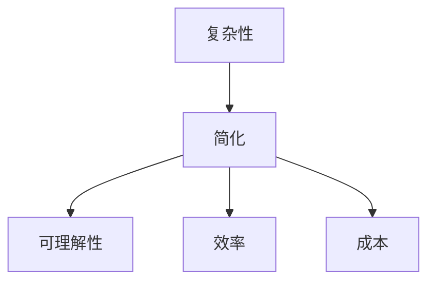

                 

### 1. 背景介绍

在当今信息化和数字化的时代，信息的处理、存储和传输变得日益重要。然而，随着数据量的爆炸性增长，如何有效地管理和利用这些信息成为一个严峻的挑战。信息简化作为解决这一问题的有效方法，已经在各个领域得到了广泛的应用。本文将深入探讨信息简化的好处与挑战，以期揭示简化复杂性的艺术与科学。

### 2. 核心概念与联系

在讨论信息简化的好处与挑战之前，有必要先理解几个核心概念。首先是“复杂性”，它指的是系统或问题中难以理解和处理的特性。其次是“简化”，即通过去除不必要的细节和部分，使系统或问题变得更为简单、直观和易于处理。信息简化不仅涉及到技术的层面，还涉及到人类的认知和心理层面。

#### 2.1 信息简化的意义

信息简化的意义在于：

- **提高效率**：通过去除冗余信息，使数据处理和分析更加高效。
- **降低成本**：减少存储和传输的需求，降低相关的经济成本。
- **增强可理解性**：简化后的信息更易于人类理解和处理。

#### 2.2 复杂性与简化的关系

复杂性是简化存在的前提，而简化则是降低复杂性的手段。两者之间的关系可以用以下Mermaid流程图表示：



### 3. 核心算法原理 & 具体操作步骤

#### 3.1 算法原理概述

信息简化的核心算法通常基于以下几个原则：

- **去除冗余**：识别并删除重复或不必要的信息。
- **抽象化**：通过抽象化将复杂的系统或问题转化为更简单的模型。
- **降维**：通过降维技术将高维数据转换为低维数据，以简化处理。

#### 3.2 算法步骤详解

信息简化的具体步骤通常包括：

1. **数据预处理**：清洗数据，去除噪声和异常值。
2. **特征选择**：根据问题的需求选择最重要的特征。
3. **降维**：使用PCA、t-SNE等算法进行降维。
4. **模型训练**：根据简化后的数据训练模型。
5. **模型评估**：评估简化后模型的效果。

#### 3.3 算法优缺点

信息简化的优点包括：

- **提高效率**：简化后的信息处理速度更快。
- **降低成本**：减少存储和传输的需求。

缺点包括：

- **可能丢失信息**：过度简化可能导致重要信息的丢失。
- **适用性有限**：某些复杂问题可能不适合简化。

#### 3.4 算法应用领域

信息简化在多个领域都有广泛应用，包括：

- **数据科学**：通过简化数据提高模型的性能。
- **机器学习**：简化输入数据以加速训练过程。
- **软件工程**：通过简化代码提高软件的可维护性。

### 4. 数学模型和公式 & 详细讲解 & 举例说明

#### 4.1 数学模型构建

信息简化的数学模型通常基于以下几个概念：

- **信息熵**：衡量信息的不确定性。
- **熵减少**：通过简化减少信息熵。

#### 4.2 公式推导过程

假设我们有 $X$ 和 $Y$ 两个随机变量，其概率分布分别为 $P(X)$ 和 $P(Y)$。则 $X$ 和 $Y$ 的联合熵 $H(X,Y)$ 可以表示为：

$$
H(X,Y) = -\sum_{x\in X}\sum_{y\in Y} P(x,y) \log P(x,y)
$$

简化后的熵 $H'(X,Y)$ 可以通过以下公式计算：

$$
H'(X,Y) = H(X) + H(Y|X)
$$

其中 $H(X)$ 是 $X$ 的熵，$H(Y|X)$ 是在已知 $X$ 的情况下 $Y$ 的熵。

#### 4.3 案例分析与讲解

假设我们有一个包含1000个数据点的数据集，其中有10个特征。通过特征选择和降维，我们将这些特征减少到5个。使用上面的公式，我们可以计算简化前后的熵。

简化前：

$$
H(X,Y) = -\sum_{i=1}^{1000} \sum_{j=1}^{10} P(x_i,y_j) \log P(x_i,y_j)
$$

简化后：

$$
H'(X,Y) = H(X) + H(Y|X)
$$

通过比较简化前后的熵，我们可以评估简化的效果。

### 5. 项目实践：代码实例和详细解释说明

#### 5.1 开发环境搭建

为了演示信息简化的应用，我们将使用Python编程语言和Scikit-learn库。以下是开发环境的搭建步骤：

1. 安装Python（建议使用3.8及以上版本）。
2. 安装Scikit-learn库：`pip install scikit-learn`。

#### 5.2 源代码详细实现

以下是一个简单的示例，演示如何使用Scikit-learn进行特征选择和降维。

```python
from sklearn.datasets import load_iris
from sklearn.feature_selection import SelectKBest
from sklearn.decomposition import PCA
from sklearn.model_selection import train_test_split
from sklearn.metrics import accuracy_score

# 加载Iris数据集
iris = load_iris()
X, y = iris.data, iris.target

# 划分训练集和测试集
X_train, X_test, y_train, y_test = train_test_split(X, y, test_size=0.3, random_state=42)

# 特征选择（选择最重要的5个特征）
selector = SelectKBest(k=5)
X_train_selected = selector.fit_transform(X_train, y_train)
X_test_selected = selector.transform(X_test)

# 降维（将数据从4维降到2维）
pca = PCA(n_components=2)
X_train_reduced = pca.fit_transform(X_train_selected)
X_test_reduced = pca.transform(X_test_selected)

# 模型训练和评估
# 这里使用简单的K-近邻分类器作为示例
from sklearn.neighbors import KNeighborsClassifier
knn = KNeighborsClassifier(n_neighbors=3)
knn.fit(X_train_reduced, y_train)
y_pred = knn.predict(X_test_reduced)
accuracy = accuracy_score(y_test, y_pred)
print(f"Accuracy: {accuracy:.2f}")
```

#### 5.3 代码解读与分析

上述代码展示了如何使用Scikit-learn进行特征选择和降维。首先，我们加载了Iris数据集，并将其划分为训练集和测试集。然后，我们使用`SelectKBest`进行特征选择，选择最重要的5个特征。接下来，使用`PCA`进行降维，将数据从4维降到2维。最后，使用K-近邻分类器进行模型训练和评估。

#### 5.4 运行结果展示

运行上述代码后，我们得到了K-近邻分类器的准确率。在实际应用中，可以根据具体问题的需求调整特征选择和降维的参数，以获得最佳的效果。

### 6. 实际应用场景

信息简化在多个实际应用场景中具有广泛的应用，例如：

- **数据科学**：通过简化数据集提高模型的训练效率。
- **机器学习**：简化输入数据以加速训练过程。
- **软件工程**：通过简化代码提高软件的可维护性。
- **信息检索**：简化查询结果以提高检索效率。

### 7. 未来应用展望

随着数据量的持续增长，信息简化在未来将面临更大的挑战和机遇。未来的研究方向可能包括：

- **自动化的信息简化**：开发自动化的方法，根据问题的需求自动简化数据。
- **多模态信息简化**：处理不同类型的数据（如图像、文本、音频）的综合简化。
- **大数据处理**：开发高效的信息简化算法，以适应大数据处理的需求。

### 8. 工具和资源推荐

以下是几个推荐的工具和资源：

- **学习资源**：机器学习实战、数据科学入门书籍等。
- **开发工具**：Jupyter Notebook、PyCharm等。
- **相关论文**：查看顶级会议和期刊上的相关论文，例如NeurIPS、ICML等。

### 9. 总结：未来发展趋势与挑战

信息简化作为解决信息复杂性问题的有效方法，具有广泛的应用前景。然而，未来仍面临诸多挑战，如自动化的信息简化、多模态信息简化和大数据处理等。随着技术的不断发展，我们有理由相信，信息简化的艺术与科学将会取得更大的突破。

---

作者：禅与计算机程序设计艺术 / Zen and the Art of Computer Programming
```

