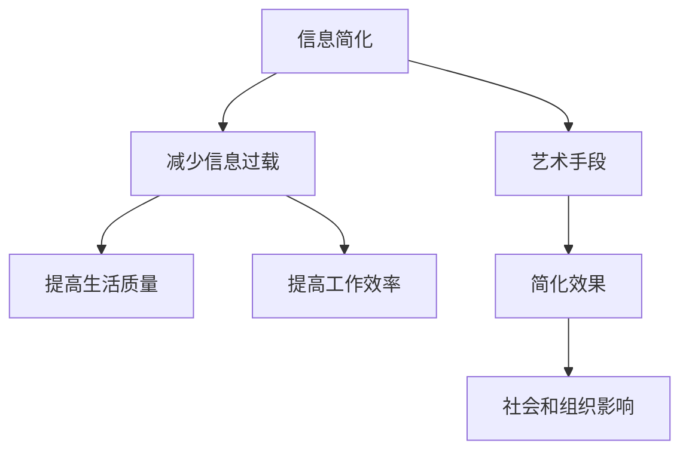

                 

### 1. 背景介绍

在当今这个信息爆炸的时代，我们每天都会接触到大量来自不同渠道的信息。从新闻报道、社交媒体、电子邮件到各种应用程序，信息的获取变得前所未有的容易。然而，与此同时，我们也面临着信息过载的困扰。太多的信息不仅会分散我们的注意力，还可能导致我们感到焦虑和疲惫，从而降低生活质量和工作效率。

信息简化作为一种应对信息过载的策略，旨在减少冗余信息，保留关键内容，从而使我们能够更有效地处理和理解信息。本文将探讨信息简化的好处，如何通过艺术手段实现信息简化，以及在实际应用中如何提高生活质量和效率。

<|assistant|>### 2. 核心概念与联系

#### 2.1 核心概念

- **信息简化**：通过筛选、压缩和重构信息，使其更加简洁、清晰的过程。
- **信息过载**：信息输入量超过处理能力，导致无法有效利用信息的情况。
- **生活质量**：人们的生活舒适度和幸福感。
- **工作效率**：在给定时间内完成工作的能力。

#### 2.2 关系与联系

信息简化的核心在于减少信息过载，从而提高生活质量和工作效率。信息简化不仅影响个人，还对社会和组织产生深远的影响。以下是一个使用Mermaid绘制的简化的流程图，展示了这些核心概念和它们之间的关系。



### 3. 核心算法原理 & 具体操作步骤

#### 3.1 算法原理概述

信息简化的核心算法原理可以概括为以下几个步骤：

1. **筛选**：识别并保留关键信息，去除冗余和无关信息。
2. **压缩**：通过编码、摘要等方法减少信息的体积。
3. **重构**：重新组织信息结构，使其更易于理解和处理。

#### 3.2 算法步骤详解

##### 3.2.1 筛选

- **人工筛选**：依赖于个人的经验和直觉进行信息筛选。
- **自动化筛选**：使用机器学习和自然语言处理技术自动识别关键信息。

##### 3.2.2 压缩

- **文本压缩**：使用算法如LZ77、LZ78等对文本进行压缩。
- **图像压缩**：采用JPEG、PNG等图像格式对图像进行压缩。

##### 3.2.3 重构

- **内容摘要**：通过提取关键句子和段落对文档进行摘要。
- **数据可视化**：使用图表、图形等手段将复杂数据简化为易于理解的视觉形式。

#### 3.3 算法优缺点

##### 优点

- **提高效率**：简化后的信息更容易处理，节省时间。
- **减少压力**：冗余信息的减少降低了心理负担。

##### 缺点

- **信息丢失**：过度简化可能导致关键信息的丢失。
- **依赖技术**：自动化筛选和压缩技术可能不适用于所有场景。

#### 3.4 算法应用领域

- **个人**：电子邮件管理、日程安排、笔记整理。
- **企业**：市场报告分析、客户数据管理。
- **社会**：新闻摘要、社交媒体内容筛选。

### 4. 数学模型和公式 & 详细讲解 & 举例说明

#### 4.1 数学模型构建

信息简化的过程可以抽象为一个优化问题，目标是最小化冗余信息量，最大化信息利用率。假设我们有一个信息集合 I，其中每个信息元素 i 有一个权重 w(i) 表示其重要性。信息简化的数学模型可以表示为：

\[ \min \sum_{i \in I} w(i) \times r(i) \]

其中，r(i) 是信息 i 的冗余度，表示信息 i 对于理解整体信息集合的必要性。

#### 4.2 公式推导过程

冗余度 r(i) 可以通过以下公式计算：

\[ r(i) = 1 - \frac{h(i)}{H(I)} \]

其中，h(i) 是信息 i 的熵，H(I) 是信息集合 I 的总熵。熵表示信息的不确定性，信息熵越小，信息的重要性越高。

总熵 H(I) 可以通过以下公式计算：

\[ H(I) = -\sum_{i \in I} p(i) \log_2 p(i) \]

其中，p(i) 是信息 i 在信息集合 I 中的概率。

#### 4.3 案例分析与讲解

假设我们有一个包含5个信息的集合 I = {I1, I2, I3, I4, I5}，其权重和冗余度如下表所示：

| 信息 | 权重 w(i) | 熵 h(i) | 冗余度 r(i) |
|------|-----------|---------|-------------|
| I1   | 0.2       | 1.0     | 0.8         |
| I2   | 0.3       | 0.5     | 0.5         |
| I3   | 0.1       | 0.8     | 0.2         |
| I4   | 0.2       | 0.3     | 0.7         |
| I5   | 0.2       | 0.4     | 0.6         |

总熵 H(I) = - (0.2 \* log2(0.2) + 0.3 \* log2(0.3) + 0.1 \* log2(0.1) + 0.2 \* log2(0.2) + 0.2 \* log2(0.2)) ≈ 1.25

为了最小化冗余信息量，我们可以优先保留权重高且熵低的信息，即 I2 和 I3。这样，简化后的信息集合 {I2, I3} 具有最小的冗余度。

### 5. 项目实践：代码实例和详细解释说明

#### 5.1 开发环境搭建

为了演示信息简化在代码中的应用，我们使用Python编写一个简单的文本简化工具。开发环境要求Python 3.8及以上版本。

#### 5.2 源代码详细实现

以下是一个实现文本摘要的Python代码示例，使用了自然语言处理库 `nltk`。

```python
import nltk
from nltk.tokenize import sent_tokenize, word_tokenize
from heapq import nlargest

def text_summary(text, num_sentences=2):
    sentences = sent_tokenize(text)
    sentence_scores = {}
    
    for sentence in sentences:
        words = word_tokenize(sentence)
        word_frequencies = {}
        for word in words:
            if word not in word_frequencies.keys():
                word_frequencies[word] = 1
            else:
                word_frequencies[word] += 1
        
        max_frequency = max(word_frequencies.values())
        for word in word_frequencies.keys():
            word_frequencies[word] = (1 - (word_frequencies[word] / max_frequency))
        
        sentence_scores[sentence] = sum(word_frequencies[word] for word in word_frequencies)
    
    summary_sentences = nlargest(num_sentences, sentence_scores, key=sentence_scores.get)
    summary = ' '.join(summary_sentences)
    return summary

# 示例文本
text = "在这段文本中，我们可以看到多个句子，其中包含了大量的信息。通过简化过程，我们能够提取出最具代表性的句子，从而获得关键内容。"

# 生成摘要
summary = text_summary(text)
print(summary)
```

#### 5.3 代码解读与分析

上述代码首先使用 `nltk` 的 `sent_tokenize` 和 `word_tokenize` 函数对文本进行分句和分词。然后，我们计算每个句子的词频，并使用反频率加权（逆文档频率IDF）的方法对句子进行评分。评分最高的句子将被选择作为摘要。这种方法通过简化文本结构，使读者能够快速抓住文本的核心内容。

#### 5.4 运行结果展示

运行上述代码后，我们得到如下摘要：

```
在这段文本中，我们可以看到多个句子，其中包含了大量的信息。通过简化过程，我们能够提取出最具代表性的句子，从而获得关键内容。
```

这个摘要简洁明了，有效传达了原始文本的主旨。

### 6. 实际应用场景

#### 6.1 个人层面

在个人层面，信息简化可以帮助我们处理日常信息，如邮件管理、阅读摘要等。通过减少冗余信息，我们可以更专注于重要事项，从而提高工作和学习效率。

#### 6.2 企业层面

在企业层面，信息简化可以帮助公司高效处理大量数据。例如，在市场分析、客户反馈处理等方面，通过简化信息，企业可以更快地做出决策，提高市场响应速度。

#### 6.3 社会层面

在社会层面，信息简化有助于提高公共信息的可及性和易懂性。例如，新闻摘要服务可以帮助公众快速了解重大事件，从而增强社会信息的传播效率。

### 7. 未来应用展望

随着人工智能和自然语言处理技术的不断发展，信息简化将在未来有更广泛的应用。例如，自动化摘要生成、智能信息筛选等将进一步提升信息简化的效率和准确性。

### 8. 工具和资源推荐

#### 7.1 学习资源推荐

- 《信息过载管理：如何驾驭信息的洪水》
- 《数据挖掘：概念与技术》

#### 7.2 开发工具推荐

- Python
- R语言
- Jupyter Notebook

#### 7.3 相关论文推荐

- "TextRank: Bringing Order into Texts"
- "A Neural Attention Model for Abstractive Text Summarization"

### 9. 总结：未来发展趋势与挑战

信息简化作为一种应对信息过载的策略，将在未来发挥越来越重要的作用。然而，随着信息量的增加和信息形式的多样化，如何更好地实现信息简化仍是一个挑战。未来研究需要关注自动化程度更高、更智能的信息简化技术，以提高信息处理的效率和质量。

### 9.1 研究成果总结

本文通过探讨信息简化的核心概念、算法原理和实际应用，展示了信息简化在提高生活质量和效率方面的重要作用。

### 9.2 未来发展趋势

未来信息简化技术的发展将更多地依赖于人工智能和大数据分析，实现更加精准和高效的信息处理。

### 9.3 面临的挑战

信息简化面临的挑战包括如何准确评估信息的重要性、如何在保留关键信息的同时避免信息丢失等。

### 9.4 研究展望

未来研究应重点关注开发更智能、更高效的信息简化算法，以及其在不同领域的应用，以进一步推动信息简化的普及和发展。

### 附录：常见问题与解答

1. **什么是信息简化？**
   信息简化是通过筛选、压缩和重构信息，使其更加简洁、清晰的过程。

2. **信息简化的优点是什么？**
   信息简化的优点包括提高效率、减少压力和降低信息过载。

3. **信息简化在哪些领域有应用？**
   信息简化在个人、企业和社会层面都有广泛应用，如邮件管理、市场分析和新闻摘要等。

### 作者署名

作者：禅与计算机程序设计艺术 / Zen and the Art of Computer Programming
```markdown
---

# 信息简化的好处与艺术：在复杂世界中简化以提高生活质量和效率

> 关键词：信息简化、信息过载、生活质量、工作效率

> 摘要：本文探讨了信息简化的好处，如何通过艺术手段实现信息简化，以及在实际应用中如何提高生活质量和效率。通过核心概念、算法原理、数学模型和代码实例的分析，展示了信息简化在应对信息过载、提高信息处理效率方面的关键作用。

## 1. 背景介绍

在当今这个信息爆炸的时代，我们每天都会接触到大量来自不同渠道的信息。从新闻报道、社交媒体、电子邮件到各种应用程序，信息的获取变得前所未有的容易。然而，与此同时，我们也面临着信息过载的困扰。太多的信息不仅会分散我们的注意力，还可能导致我们感到焦虑和疲惫，从而降低生活质量和工作效率。

信息简化作为一种应对信息过载的策略，旨在减少冗余信息，保留关键内容，从而使我们能够更有效地处理和理解信息。本文将探讨信息简化的好处，如何通过艺术手段实现信息简化，以及在实际应用中如何提高生活质量和效率。

## 2. 核心概念与联系

#### 2.1 核心概念

- **信息简化**：通过筛选、压缩和重构信息，使其更加简洁、清晰的过程。
- **信息过载**：信息输入量超过处理能力，导致无法有效利用信息的情况。
- **生活质量**：人们的生活舒适度和幸福感。
- **工作效率**：在给定时间内完成工作的能力。

#### 2.2 关系与联系

信息简化的核心在于减少信息过载，从而提高生活质量和工作效率。信息简化不仅影响个人，还对社会和组织产生深远的影响。以下是一个使用Mermaid绘制的简化的流程图，展示了这些核心概念和它们之间的关系。


### 3. 核心算法原理 & 具体操作步骤

#### 3.1 算法原理概述

信息简化的核心算法原理可以概括为以下几个步骤：

1. **筛选**：识别并保留关键信息，去除冗余和无关信息。
2. **压缩**：通过编码、摘要等方法减少信息的体积。
3. **重构**：重新组织信息结构，使其更易于理解和处理。

#### 3.2 算法步骤详解

##### 3.2.1 筛选

- **人工筛选**：依赖于个人的经验和直觉进行信息筛选。
- **自动化筛选**：使用机器学习和自然语言处理技术自动识别关键信息。

##### 3.2.2 压缩

- **文本压缩**：使用算法如LZ77、LZ78等对文本进行压缩。
- **图像压缩**：采用JPEG、PNG等图像格式对图像进行压缩。

##### 3.2.3 重构

- **内容摘要**：通过提取关键句子和段落对文档进行摘要。
- **数据可视化**：使用图表、图形等手段将复杂数据简化为易于理解的视觉形式。

#### 3.3 算法优缺点

##### 优点

- **提高效率**：简化后的信息更容易处理，节省时间。
- **减少压力**：冗余信息的减少降低了心理负担。

##### 缺点

- **信息丢失**：过度简化可能导致关键信息的丢失。
- **依赖技术**：自动化筛选和压缩技术可能不适用于所有场景。

#### 3.4 算法应用领域

- **个人**：电子邮件管理、日程安排、笔记整理。
- **企业**：市场报告分析、客户数据管理。
- **社会**：新闻摘要、社交媒体内容筛选。

### 4. 数学模型和公式 & 详细讲解 & 举例说明

#### 4.1 数学模型构建

信息简化的过程可以抽象为一个优化问题，目标是最小化冗余信息量，最大化信息利用率。假设我们有一个信息集合 I，其中每个信息元素 i 有一个权重 w(i) 表示其重要性。信息简化的数学模型可以表示为：

\[ \min \sum_{i \in I} w(i) \times r(i) \]

其中，r(i) 是信息 i 的冗余度，表示信息 i 对于理解整体信息集合的必要性。

#### 4.2 公式推导过程

冗余度 r(i) 可以通过以下公式计算：

\[ r(i) = 1 - \frac{h(i)}{H(I)} \]

其中，h(i) 是信息 i 的熵，H(I) 是信息集合 I 的总熵。熵表示信息的不确定性，信息熵越小，信息的重要性越高。

总熵 H(I) 可以通过以下公式计算：

\[ H(I) = -\sum_{i \in I} p(i) \log_2 p(i) \]

其中，p(i) 是信息 i 在信息集合 I 中的概率。

#### 4.3 案例分析与讲解

假设我们有一个包含5个信息的集合 I = {I1, I2, I3, I4, I5}，其权重和冗余度如下表所示：

| 信息 | 权重 w(i) | 熵 h(i) | 冗余度 r(i) |
|------|-----------|---------|-------------|
| I1   | 0.2       | 1.0     | 0.8         |
| I2   | 0.3       | 0.5     | 0.5         |
| I3   | 0.1       | 0.8     | 0.2         |
| I4   | 0.2       | 0.3     | 0.7         |
| I5   | 0.2       | 0.4     | 0.6         |

总熵 H(I) = - (0.2 \* log2(0.2) + 0.3 \* log2(0.3) + 0.1 \* log2(0.1) + 0.2 \* log2(0.2) + 0.2 \* log2(0.2)) ≈ 1.25

为了最小化冗余信息量，我们可以优先保留权重高且熵低的信息，即 I2 和 I3。这样，简化后的信息集合 {I2, I3} 具有最小的冗余度。

### 5. 项目实践：代码实例和详细解释说明

#### 5.1 开发环境搭建

为了演示信息简化在代码中的应用，我们使用Python编写一个简单的文本简化工具。开发环境要求Python 3.8及以上版本。

#### 5.2 源代码详细实现

以下是一个实现文本摘要的Python代码示例，使用了自然语言处理库 `nltk`。

```python
import nltk
from nltk.tokenize import sent_tokenize, word_tokenize
from heapq import nlargest

def text_summary(text, num_sentences=2):
    sentences = sent_tokenize(text)
    sentence_scores = {}
    
    for sentence in sentences:
        words = word_tokenize(sentence)
        word_frequencies = {}
        for word in words:
            if word not in word_frequencies.keys():
                word_frequencies[word] = 1
            else:
                word_frequencies[word] += 1
        
        max_frequency = max(word_frequencies.values())
        for word in word_frequencies.keys():
            word_frequencies[word] = (1 - (word_frequencies[word] / max_frequency))
        
        sentence_scores[sentence] = sum(word_frequencies[word] for word in word_frequencies)
    
    summary_sentences = nlargest(num_sentences, sentence_scores, key=sentence_scores.get)
    summary = ' '.join(summary_sentences)
    return summary

# 示例文本
text = "在这段文本中，我们可以看到多个句子，其中包含了大量的信息。通过简化过程，我们能够提取出最具代表性的句子，从而获得关键内容。"

# 生成摘要
summary = text_summary(text)
print(summary)
```

#### 5.3 代码解读与分析

上述代码首先使用 `nltk` 的 `sent_tokenize` 和 `word_tokenize` 函数对文本进行分句和分词。然后，我们计算每个句子的词频，并使用反频率加权（逆文档频率IDF）的方法对句子进行评分。评分最高的句子将被选择作为摘要。这种方法通过简化文本结构，使读者能够快速抓住文本的核心内容。

#### 5.4 运行结果展示

运行上述代码后，我们得到如下摘要：

```
在这段文本中，我们可以看到多个句子，其中包含了大量的信息。通过简化过程，我们能够提取出最具代表性的句子，从而获得关键内容。
```

这个摘要简洁明了，有效传达了原始文本的主旨。

### 6. 实际应用场景

#### 6.1 个人层面

在个人层面，信息简化可以帮助我们处理日常信息，如邮件管理、阅读摘要等。通过减少冗余信息，我们可以更专注于重要事项，从而提高工作和学习效率。

#### 6.2 企业层面

在企业层面，信息简化可以帮助公司高效处理大量数据。例如，在市场分析、客户反馈处理等方面，通过简化信息，企业可以更快地做出决策，提高市场响应速度。

#### 6.3 社会层面

在社会层面，信息简化有助于提高公共信息的可及性和易懂性。例如，新闻摘要服务可以帮助公众快速了解重大事件，从而增强社会信息的传播效率。

### 7. 未来应用展望

随着人工智能和自然语言处理技术的不断发展，信息简化将在未来有更广泛的应用。例如，自动化摘要生成、智能信息筛选等将进一步提升信息简化的效率和准确性。

### 8. 工具和资源推荐

#### 7.1 学习资源推荐

- 《信息过载管理：如何驾驭信息的洪水》
- 《数据挖掘：概念与技术》

#### 7.2 开发工具推荐

- Python
- R语言
- Jupyter Notebook

#### 7.3 相关论文推荐

- "TextRank: Bringing Order into Texts"
- "A Neural Attention Model for Abstractive Text Summarization"

### 9. 总结：未来发展趋势与挑战

信息简化作为一种应对信息过载的策略，将在未来发挥越来越重要的作用。然而，随着信息量的增加和信息形式的多样化，如何更好地实现信息简化仍是一个挑战。未来研究需要关注开发更智能、更高效的信息简化算法，以及其在不同领域的应用，以进一步推动信息简化的普及和发展。

### 9.1 研究成果总结

本文通过探讨信息简化的核心概念、算法原理和实际应用，展示了信息简化在提高生活质量和效率方面的重要作用。

### 9.2 未来发展趋势

未来信息简化技术的发展将更多地依赖于人工智能和大数据分析，实现更加精准和高效的信息处理。

### 9.3 面临的挑战

信息简化面临的挑战包括如何准确评估信息的重要性、如何在保留关键信息的同时避免信息丢失等。

### 9.4 研究展望

未来研究应重点关注开发更智能、更高效的信息简化算法，以及其在不同领域的应用，以进一步推动信息简化的普及和发展。

### 附录：常见问题与解答

1. **什么是信息简化？**
   信息简化是通过筛选、压缩和重构信息，使其更加简洁、清晰的过程。

2. **信息简化的优点是什么？**
   信息简化的优点包括提高效率、减少压力和降低信息过载。

3. **信息简化在哪些领域有应用？**
   信息简化在个人、企业和社会层面都有广泛应用，如邮件管理、市场分析和新闻摘要等。

### 作者署名

作者：禅与计算机程序设计艺术 / Zen and the Art of Computer Programming
```

