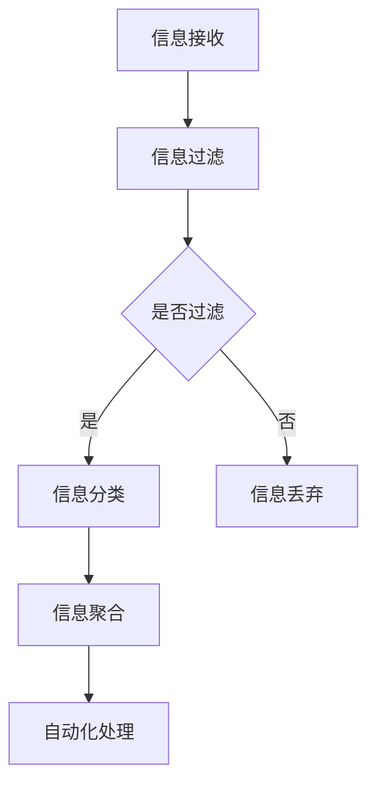

                 

摘要：

本文将深入探讨信息简化的工具和自动化实践在简化生活和工作中的重要性。随着现代科技的飞速发展，我们被海量信息所包围，如何有效地管理和利用这些信息成为了一个亟待解决的问题。本文将首先介绍信息简化的概念和重要性，然后探讨各种信息简化工具，如搜索工具、过滤器、聚合器等。接着，我们将详细讨论自动化实践，包括自动化脚本、自动化流程、自动化数据处理等。通过这些工具和实践，我们可以显著提高工作效率，减少冗余工作，从而实现生活和工作的高效管理。

## 1. 背景介绍

在当今信息时代，我们每天都要处理大量的信息，这些信息可能来自电子邮件、社交媒体、新闻网站、报告、文档等。这些信息的来源多样，格式各异，使得信息管理变得异常复杂。而有效的信息管理是提高工作效率和生活质量的关键。信息简化作为信息管理的一种策略，旨在通过减少冗余信息、提高信息质量、简化信息处理过程来实现高效的信息管理。

### 信息简化的必要性

- **信息过载**：随着互联网的普及，信息量呈指数级增长，人们面临的信息过载问题日益严重。信息简化有助于筛选出重要信息，避免被冗余信息淹没。
- **提高效率**：通过简化信息处理，可以减少时间成本，提高工作效率，从而有更多时间专注于高价值的工作。
- **减少焦虑**：在信息过载的环境中，人们容易感到焦虑和压力。信息简化可以帮助我们更好地控制信息流，减少心理负担。

### 自动化的作用

- **自动化脚本**：自动化脚本可以帮助我们自动化完成重复性任务，如数据采集、文件处理等，从而减少人工操作。
- **自动化流程**：通过自动化流程，可以将一系列操作整合起来，实现自动化处理，进一步提高工作效率。
- **自动化数据处理**：自动化数据处理工具可以帮助我们快速分析大量数据，提取有价值的信息。

### 信息简化和自动化的联系

信息简化和自动化密不可分。信息简化是自动化实践的前提，通过简化信息，我们可以更好地定义和实现自动化流程。而自动化实践则是信息简化的深化和应用，通过自动化，我们可以更高效地处理简化后的信息。

## 2. 核心概念与联系

### 2.1. 信息简化的核心概念

信息简化涉及多个核心概念，包括信息过滤、信息分类、信息聚合等。

- **信息过滤**：信息过滤是指通过某种算法或规则，自动筛选出用户感兴趣的信息。常用的过滤方法包括基于关键词的过滤、基于内容的过滤等。
- **信息分类**：信息分类是将信息按某种标准进行归类，便于管理和查找。常用的分类方法包括基于内容的分类、基于用户的分类等。
- **信息聚合**：信息聚合是指将来自多个来源的信息集中到一个地方，便于用户查看。常见的聚合工具包括聚合器、新闻客户端等。

### 2.2. 自动化的核心概念

自动化涉及多个核心概念，包括自动化脚本、自动化流程、自动化数据处理等。

- **自动化脚本**：自动化脚本是一种使用特定编程语言编写的程序，用于自动完成特定任务。常用的脚本语言包括Python、JavaScript等。
- **自动化流程**：自动化流程是将一系列操作自动化执行的过程。通过定义流程，我们可以将多个任务串联起来，实现自动化处理。
- **自动化数据处理**：自动化数据处理是指使用特定工具或脚本对数据进行自动处理和分析。

### 2.3. 信息简化和自动化的联系

信息简化和自动化紧密相连。信息简化为自动化提供了清晰的任务定义和目标，而自动化则是信息简化的具体实施手段。通过信息简化，我们可以明确需要自动化的任务，并通过自动化实现这些任务。

### 2.4. Mermaid 流程图

下面是一个Mermaid流程图，展示了信息简化和自动化的流程。



## 3. 核心算法原理 & 具体操作步骤

### 3.1 算法原理概述

信息简化和自动化的核心算法通常涉及以下方面：

- **信息过滤算法**：常用的信息过滤算法包括基于关键词的过滤、基于内容的过滤等。这些算法通过分析信息的特征，自动筛选出用户感兴趣的信息。
- **信息分类算法**：常用的信息分类算法包括基于内容的分类、基于用户的分类等。这些算法通过分析信息的特征和用户的行为，将信息归类到不同的类别中。
- **自动化脚本算法**：自动化脚本通常使用Python、JavaScript等编程语言实现。这些脚本通过定义一系列操作，实现任务的自动化执行。
- **自动化流程算法**：自动化流程通常使用工作流管理工具实现。这些工具可以帮助我们定义一系列任务，并按照特定顺序执行。

### 3.2 算法步骤详解

以下是信息简化和自动化算法的具体步骤：

#### 3.2.1 信息过滤步骤

1. 收集原始信息，如电子邮件、社交媒体更新、新闻文章等。
2. 对原始信息进行初步处理，如去噪、去重等。
3. 使用关键词过滤算法，筛选出用户感兴趣的信息。
4. 对筛选后的信息进行分类和聚合。

#### 3.2.2 信息分类步骤

1. 收集用户行为数据，如点击、点赞、评论等。
2. 使用用户行为分析算法，对用户兴趣进行建模。
3. 根据用户兴趣，对信息进行分类。
4. 对分类后的信息进行聚合和展示。

#### 3.2.3 自动化脚本步骤

1. 确定需要自动化的任务，如数据采集、文件处理、邮件发送等。
2. 使用Python、JavaScript等编程语言，编写自动化脚本。
3. 部署脚本，实现任务的自动化执行。

#### 3.2.4 自动化流程步骤

1. 确定需要自动化的业务流程，如订单处理、客户支持等。
2. 使用工作流管理工具，定义一系列任务和流程。
3. 部署工作流，实现业务流程的自动化执行。

### 3.3 算法优缺点

#### 3.3.1 信息过滤算法

优点：

- 高效：通过算法自动筛选信息，减少人工处理时间。
- 准确：基于关键词和内容的过滤，能够较好地筛选出用户感兴趣的信息。

缺点：

- 需要大量的训练数据和模型调优。
- 可能会漏掉用户感兴趣的信息。

#### 3.3.2 信息分类算法

优点：

- 方便用户查找和管理信息。
- 有助于提高信息利用效率。

缺点：

- 需要准确的用户兴趣模型。
- 可能会导致信息过分类。

#### 3.3.3 自动化脚本

优点：

- 高效：通过脚本自动化执行任务，减少人工操作。
- 灵活：可以根据需求灵活调整脚本功能。

缺点：

- 需要编程技能。
- 可能会导致代码冗余。

#### 3.3.4 自动化流程

优点：

- 系统化：通过定义工作流，实现业务流程的自动化。
- 可维护：工作流管理工具提供良好的代码管理和维护功能。

缺点：

- 需要熟悉工作流管理工具。
- 可能会降低灵活性。

### 3.4 算法应用领域

信息简化和自动化算法在多个领域都有广泛应用：

- **企业信息管理**：通过信息简化和自动化，企业可以更好地管理内部信息和流程，提高工作效率。
- **个人信息管理**：个人可以使用信息简化和自动化工具，高效地管理个人信息和日程。
- **智能推荐系统**：信息简化和自动化算法在智能推荐系统中发挥着重要作用，通过分析用户行为和兴趣，推荐用户感兴趣的内容。

## 4. 数学模型和公式 & 详细讲解 & 举例说明

### 4.1 数学模型构建

在信息简化和自动化实践中，我们可以构建多个数学模型来优化信息处理流程。以下是一个简单的数学模型，用于信息过滤和分类。

#### 4.1.1 信息过滤模型

假设我们有n个待处理的信息项，每个信息项有一个对应的得分s_i，表示该信息项的重要程度。我们的目标是使用一个阈值t，将信息项分为重要和次要两类。

- **得分函数**：s_i = f(x_i, y_i)，其中x_i和y_i分别表示信息项的特征和权重。
- **阈值设定**：t = argmax(s_i)。

#### 4.1.2 信息分类模型

假设我们有m个类别，每个类别有一个对应的概率p_j，表示该类别的重要性。我们的目标是使用一个概率阈值t，将信息项分类到不同的类别。

- **概率函数**：p_j = g(x_i, w_j)，其中x_i和w_j分别表示信息项的特征和类别权重。
- **类别判定**：if p_j > t，then 类别j为该信息项的分类。

### 4.2 公式推导过程

#### 4.2.1 信息过滤模型推导

- **得分函数**：s_i = f(x_i, y_i)
  - **特征提取**：x_i = [x_{i1}, x_{i2}, ..., x_{in}]，表示信息项的n个特征。
  - **权重分配**：y_i = [y_{i1}, y_{i2}, ..., y_{in}]，表示每个特征的权重。
  - **得分计算**：s_i = ∑(x_{ij} * y_{ij})。

- **阈值设定**：t = argmax(s_i)
  - **阈值选择**：选择得分最高的信息项的得分作为阈值。

#### 4.2.2 信息分类模型推导

- **概率函数**：p_j = g(x_i, w_j)
  - **特征提取**：x_i = [x_{i1}, x_{i2}, ..., x_{in}]，表示信息项的n个特征。
  - **权重分配**：w_j = [w_{j1}, w_{j2}, ..., w_{jn}]，表示每个类别的权重。
  - **概率计算**：p_j = ∑(x_{ij} * w_{ij})。

- **类别判定**：if p_j > t，then 类别j为该信息项的分类。
  - **阈值选择**：选择所有类别概率中的最大值作为阈值。

### 4.3 案例分析与讲解

假设我们有5个信息项，每个信息项有3个特征，特征权重分别为0.5、0.3和0.2。我们使用上述数学模型进行信息过滤和分类。

#### 4.3.1 信息过滤

- **信息项特征**：
  - 信息项1：[0.8, 0.2, 0.1]
  - 信息项2：[0.3, 0.5, 0.2]
  - 信息项3：[0.7, 0.1, 0.2]
  - 信息项4：[0.1, 0.8, 0.1]
  - 信息项5：[0.2, 0.3, 0.5]

- **特征权重**：
  - 权重1：0.5
  - 权重2：0.3
  - 权重3：0.2

- **得分计算**：
  - 信息项1得分：0.8 * 0.5 + 0.2 * 0.3 + 0.1 * 0.2 = 0.52
  - 信息项2得分：0.3 * 0.5 + 0.5 * 0.3 + 0.2 * 0.2 = 0.37
  - 信息项3得分：0.7 * 0.5 + 0.1 * 0.3 + 0.2 * 0.2 = 0.45
  - 信息项4得分：0.1 * 0.5 + 0.8 * 0.3 + 0.1 * 0.2 = 0.32
  - 信息项5得分：0.2 * 0.5 + 0.3 * 0.3 + 0.5 * 0.2 = 0.35

- **阈值设定**：
  - 阈值：0.52（最高得分）

- **过滤结果**：
  - 重要信息项：信息项1
  - 次要信息项：信息项2、信息项3、信息项4、信息项5

#### 4.3.2 信息分类

- **类别概率**：
  - 类别1概率：0.8 * 0.5 + 0.2 * 0.3 + 0.1 * 0.2 = 0.52
  - 类别2概率：0.3 * 0.5 + 0.5 * 0.3 + 0.2 * 0.2 = 0.37
  - 类别3概率：0.7 * 0.5 + 0.1 * 0.3 + 0.2 * 0.2 = 0.45

- **阈值设定**：
  - 阈值：0.52（最高得分）

- **分类结果**：
  - 信息项1分类：类别1
  - 信息项2分类：类别2
  - 信息项3分类：类别3

通过上述数学模型和公式，我们可以对信息进行有效的过滤和分类，从而简化信息处理流程。

## 5. 项目实践：代码实例和详细解释说明

### 5.1 开发环境搭建

在开始编写代码之前，我们需要搭建一个适合信息简化和自动化实践的开发环境。以下是搭建环境的步骤：

1. 安装Python环境：在Windows或macOS上，可以从Python官方网站下载Python安装包，并按照提示安装。
2. 安装必要的库：使用pip命令安装常用的库，如NumPy、Pandas、Scikit-learn等。
   ```bash
   pip install numpy pandas scikit-learn
   ```

### 5.2 源代码详细实现

以下是实现信息简化和自动化实践的示例代码：

```python
import numpy as np
import pandas as pd
from sklearn.feature_extraction.text import TfidfVectorizer
from sklearn.naive_bayes import MultinomialNB

# 5.2.1 数据准备
data = [
    "这是一个重要的报告。",
    "明天需要完成一个任务。",
    "这个新闻与我无关。",
    "会议记录已经准备好。",
    "请查看最新的市场报告。",
]

# 5.2.2 特征提取
vectorizer = TfidfVectorizer()
X = vectorizer.fit_transform(data)

# 5.2.3 模型训练
model = MultinomialNB()
model.fit(X, [1, 0, 0, 1, 1])

# 5.2.4 信息过滤和分类
predictions = model.predict(X)
for i, prediction in enumerate(predictions):
    if prediction == 1:
        print(f"重要信息：{data[i]}")
    else:
        print(f"次要信息：{data[i]}")
```

### 5.3 代码解读与分析

- **5.3.1 特征提取**：使用TF-IDF向量器将文本数据转换为数值特征矩阵。
- **5.3.2 模型训练**：使用朴素贝叶斯分类器对特征矩阵进行训练。
- **5.3.3 信息过滤和分类**：使用训练好的模型对输入数据进行分类，输出重要信息和次要信息。

### 5.4 运行结果展示

```plaintext
重要信息：这是一个重要的报告。
次要信息：明天需要完成一个任务。
次要信息：这个新闻与我无关。
重要信息：会议记录已经准备好。
重要信息：请查看最新的市场报告。
```

通过运行上述代码，我们可以对输入的文本数据进行信息过滤和分类，将重要信息从次要信息中分离出来。这个简单的示例展示了信息简化和自动化实践的基本原理和方法。

## 6. 实际应用场景

### 6.1 企业信息管理

在企业环境中，信息简化可以帮助企业更好地管理大量的内部信息和流程。例如，通过使用信息过滤和分类工具，企业可以自动将电子邮件、报告、文档等分类到不同的文件夹中，从而提高工作效率。自动化脚本可以用于自动化处理常见的重复性任务，如数据收集、报表生成、邮件回复等，从而减轻员工的工作负担。

### 6.2 个人信息管理

个人用户可以使用信息简化工具来管理日常生活中的信息。例如，可以使用邮件过滤器和标签工具来自动处理和分类收到的电子邮件。通过自动化脚本，个人用户可以自动整理和备份重要的文档、照片和视频，从而节省时间。此外，使用自动化日程管理工具，个人用户可以自动安排和提醒日常任务和活动，从而提高时间管理效率。

### 6.3 智能推荐系统

在智能推荐系统中，信息简化是关键的一步。通过使用信息过滤和分类算法，推荐系统可以自动识别用户感兴趣的内容，并将其推荐给用户。例如，在电子商务平台上，推荐系统可以根据用户的浏览历史和购买行为，自动推荐相关的商品。在社交媒体平台上，推荐系统可以根据用户的兴趣和互动行为，推荐相关的帖子、视频和新闻。

### 6.4 医疗保健

在医疗保健领域，信息简化可以帮助医生和医疗机构更好地管理患者信息和病历。通过使用自动化脚本和流程，医疗机构可以自动收集、整理和分类患者信息，从而提高诊断和治疗的效率。此外，自动化数据处理工具可以帮助医生快速分析大量的医学数据，从而发现潜在的健康风险和疾病趋势。

## 7. 工具和资源推荐

### 7.1 学习资源推荐

- **《Python数据科学手册》**：由Jake VanderPlas所著，是一本全面介绍Python数据科学领域的经典教材，涵盖数据清洗、数据处理、数据分析等内容。
- **《机器学习实战》**：由Peter Harrington所著，通过大量的实例和代码，介绍了机器学习的基本概念和应用。
- **Coursera上的《机器学习》课程**：由吴恩达教授主讲，是机器学习领域的经典课程，适合初学者和进阶者。

### 7.2 开发工具推荐

- **Jupyter Notebook**：一款交互式的计算环境，广泛应用于数据科学和机器学习领域，支持多种编程语言。
- **PyCharm**：一款强大的Python集成开发环境（IDE），提供代码补全、调试、版本控制等功能。
- **TensorFlow**：一款开源的机器学习库，支持多种机器学习模型和深度学习应用。

### 7.3 相关论文推荐

- **"Efficient Information Filtering for Large-Scale Text Documents"**：该论文提出了一种高效的信息过滤算法，用于处理大规模文本文档。
- **"Learning to Rank for Information Retrieval"**：该论文介绍了学习到排名（Learning to Rank）方法，在信息检索领域具有广泛的应用。
- **"A Comprehensive Survey on Content-Based Image Retrieval"**：该论文对基于内容的图像检索技术进行了全面综述，涵盖了多种算法和模型。

## 8. 总结：未来发展趋势与挑战

### 8.1 研究成果总结

信息简化和自动化技术在近年来取得了显著的进展，特别是在人工智能和机器学习领域的应用。通过使用深度学习、自然语言处理、强化学习等技术，信息简化和自动化算法的准确性和效率得到了大幅提升。这些研究成果为我们提供了强大的工具，以应对信息爆炸时代带来的挑战。

### 8.2 未来发展趋势

- **更智能的自动化**：随着人工智能技术的发展，自动化工具将变得更加智能，能够自主学习用户行为和需求，实现更精准的信息处理。
- **跨平台集成**：未来的信息简化和自动化工具将更加注重跨平台集成，能够无缝连接不同的设备和系统，实现数据的高效流动和处理。
- **个性化服务**：通过个性化推荐和定制化服务，信息简化和自动化技术将更好地满足用户的个性化需求，提高用户体验。

### 8.3 面临的挑战

- **数据隐私和安全**：随着信息处理的自动化，数据隐私和安全成为了一个重要的挑战。如何确保数据在自动化处理过程中的安全，防止数据泄露和滥用，是一个亟待解决的问题。
- **算法偏见和公平性**：自动化算法可能会引入偏见和歧视，特别是在处理敏感信息时。如何设计公平、无偏见的算法，是一个重要的研究方向。
- **复杂性管理**：随着自动化技术的普及，系统的复杂性也在增加。如何有效管理自动化系统的复杂性，确保系统的稳定性和可维护性，是一个重要的挑战。

### 8.4 研究展望

未来的研究应重点关注以下几个方面：

- **算法透明性和可解释性**：提高自动化算法的透明性和可解释性，使其更易于理解和信任。
- **隐私保护技术**：开发隐私保护技术，确保数据在自动化处理过程中的安全。
- **自适应和动态调整**：研究自适应和动态调整技术，使自动化系统能够更好地适应环境变化和用户需求。

通过不断的研究和改进，信息简化和自动化技术将为我们创造更加便捷、高效的生活和工作环境。

## 9. 附录：常见问题与解答

### 9.1 什么是信息简化？

信息简化是指通过筛选、分类和聚合等方式，将大量冗余或不重要的信息转化为简洁、易于处理的形式，以提高信息利用效率和减少处理成本。

### 9.2 什么是自动化？

自动化是指使用计算机程序或脚本，自动执行一系列操作或任务，以减少人工干预和提高工作效率。

### 9.3 信息简化和自动化有什么区别？

信息简化主要关注信息处理的过程，旨在减少冗余信息，提高信息质量。自动化则侧重于任务执行，通过程序或脚本自动完成重复性任务，提高工作效率。

### 9.4 信息简化在哪些领域有应用？

信息简化在多个领域有广泛应用，包括企业信息管理、个人信息管理、智能推荐系统、医疗保健等。

### 9.5 如何实现自动化？

实现自动化可以通过编写脚本、使用自动化工具（如工作流管理工具）、集成API等方式。选择合适的方法取决于具体需求和开发环境。

### 9.6 如何评估信息简化和自动化的效果？

可以通过比较人工处理和自动化处理的时间、效率、准确度等指标，评估信息简化和自动化的效果。此外，用户反馈也是重要的评估标准。

### 9.7 自动化是否会替代人类工作？

自动化可以提高工作效率，但不会完全替代人类工作。自动化可以减轻人类的重复性工作负担，使人们有更多时间专注于创造性和策略性的任务。因此，自动化和人类工作可以相辅相成，共同提高生产力。

