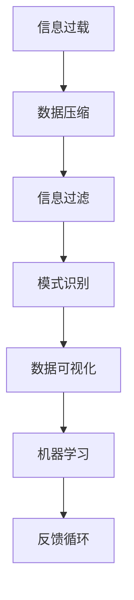

                 

### 1. 背景介绍

在当今快速发展的信息技术时代，数据和信息如洪水般涌入我们的生活。无论是个人用户还是企业组织，都面临着信息过载的挑战。如何从海量的数据中提取有价值的信息，并将其简化为易于理解的形式，成为了一个至关重要的课题。信息简化不仅仅是数据处理的一个环节，更是一种管理智慧，对于提升工作效率、优化决策过程以及培养创新思维都具有深远的影响。

在过去的几十年里，信息技术领域涌现出了许多有关信息简化的理论和方法，如信息过滤、数据压缩、模式识别等。然而，这些方法往往只能解决特定类型的信息简化问题，缺乏一种通用的框架来指导实践。因此，本文旨在探讨信息简化的最佳实践，提供一种在混乱中建立秩序的系统方法，帮助读者有效地管理信息，提高信息利用效率。

本文将围绕以下几个核心问题展开：

1. **信息简化的意义和目标**：探讨信息简化的必要性和目标，阐述其在信息技术中的重要性。
2. **信息简化的理论基础**：介绍信息简化的核心概念和理论基础，包括数据压缩、信息过滤和模式识别等。
3. **信息简化的方法和工具**：分析常用的信息简化方法和技术，如机器学习、自然语言处理等，并探讨其适用场景。
4. **信息简化的具体实施步骤**：提供一套系统化的信息简化流程，指导读者如何在实际项目中应用这些方法。
5. **信息简化的案例与实践**：通过实际案例展示信息简化的效果，并提供详细的操作指南和解读。
6. **未来趋势与挑战**：展望信息简化的未来发展方向，探讨可能面临的挑战和解决方案。

通过本文的探讨，希望能够为信息技术领域的专业人士和研究者提供一些有价值的参考和指导，帮助他们在信息爆炸的时代中找到一条清晰、高效的路径，实现信息简化的目标。

### 2. 核心概念与联系

要深入探讨信息简化的最佳实践，首先需要明确相关的核心概念和其相互之间的联系。以下是对信息简化中几个关键概念的定义及其关系的概述，并附上一幅Mermaid流程图来进一步阐述这些概念之间的逻辑关系。

#### 核心概念

1. **信息过载**：指信息输入量超过个人或系统处理能力的情况。
2. **数据压缩**：通过算法减少数据的大小，同时尽量保留其本质信息。
3. **信息过滤**：筛选出重要的信息，过滤掉无关或冗余的数据。
4. **模式识别**：从数据中提取出有意义的模式或规律。
5. **数据可视化**：将数据转化为图形或图表，以便更直观地理解和分析。
6. **机器学习**：一种通过数据学习并做出预测或决策的技术。

#### 概念联系

这些核心概念之间存在紧密的联系，共同构成了信息简化的理论基础。

1. **信息过载 -> 数据压缩**：信息过载导致处理效率低下，数据压缩是解决这一问题的基本手段。
2. **数据压缩 -> 信息过滤**：压缩后的数据往往包含冗余信息，信息过滤可以进一步去除这些冗余，提高数据的纯度。
3. **信息过滤 -> 模式识别**：过滤后的数据更有可能包含实际的有用信息，模式识别可以从这些数据中提取出有价值的关系和规律。
4. **模式识别 -> 数据可视化**：识别出的模式往往需要通过可视化手段来呈现，以便于分析和解释。
5. **数据可视化 -> 机器学习**：可视化结果可以作为机器学习模型的输入，从而进一步提升信息简化的效果。

#### Mermaid流程图

以下是一个简单的Mermaid流程图，展示了这些概念之间的逻辑关系：



- **A[信息过载]**：信息输入量超过处理能力。
- **B[数据压缩]**：通过算法减少数据量。
- **C[信息过滤]**：筛选重要信息，去除冗余。
- **D[模式识别]**：从数据中提取规律和模式。
- **E[数据可视化]**：将模式转化为图形化展示。
- **F[机器学习]**：利用可视化结果进行进一步的模型训练和预测。
- **G[反馈循环]**：根据结果调整信息处理流程，形成一个闭环。

通过上述核心概念的阐述和Mermaid流程图的展示，我们可以更清晰地理解信息简化的理论基础，并为后续章节的讨论打下基础。

### 3. 核心算法原理 & 具体操作步骤

在信息简化过程中，核心算法的选择和应用至关重要。以下将介绍几种常见的信息简化算法，包括其原理和具体操作步骤，以便读者在实际项目中能够灵活应用。

#### 3.1 算法原理概述

##### 1. 数据压缩算法

数据压缩算法是信息简化的基石，通过减少数据量来提高存储和传输效率。常见的压缩算法包括：

- **无损压缩**：如霍夫曼编码、LZ77和LZ78算法。
- **有损压缩**：如JPEG和MP3压缩。

无损压缩算法的基本原理是利用数据中的冗余和重复信息，将它们替换为更短的编码，从而减少数据大小。而有损压缩则在保留主要信息的同时，牺牲部分次要信息，以达到更高效的压缩效果。

##### 2. 信息过滤算法

信息过滤算法旨在从大量数据中筛选出有用的信息，通常分为基于规则过滤和基于机器学习过滤。

- **基于规则过滤**：如关键词过滤、正则表达式匹配等。
- **基于机器学习过滤**：如决策树、支持向量机等算法。

基于规则过滤通过预定义的规则来匹配和筛选数据，而基于机器学习过滤则通过训练模型来自动识别和过滤数据。

##### 3. 模式识别算法

模式识别算法用于从数据中提取有意义的模式或规律，常见算法包括：

- **聚类算法**：如K-均值、层次聚类等。
- **分类算法**：如决策树、随机森林、支持向量机等。
- **关联规则挖掘**：如Apriori算法、Eclat算法。

聚类算法将数据分为不同的组，以便更好地理解数据的分布；分类算法则将数据分配到不同的类别中，以便进行预测和决策；关联规则挖掘则用于发现数据之间的关联关系。

##### 4. 数据可视化算法

数据可视化算法用于将数据转化为图形或图表，以便更直观地理解和分析数据。

- **可视化库**：如Matplotlib、Seaborn等。
- **可视化方法**：包括散点图、柱状图、折线图、热力图等。

通过使用这些算法和工具，可以有效地简化数据，提取有价值的信息，并直观地展示结果。

#### 3.2 算法步骤详解

##### 3.2.1 数据压缩算法

**无损压缩算法步骤：**

1. **数据预处理**：读取数据，进行初步清理，确保数据质量。
2. **编码**：利用算法将数据编码为更短的形式，如使用霍夫曼编码将常见字符替换为短编码。
3. **解码**：在解压缩时，将编码数据解码回原始数据。
4. **性能评估**：评估压缩率和压缩后的数据恢复质量。

**有损压缩算法步骤：**

1. **数据预处理**：同上。
2. **特征提取**：提取主要特征，忽略次要信息。
3. **编码**：将特征编码为压缩形式，如JPEG算法。
4. **解码**：解压缩，重建图像或音频。
5. **性能评估**：评估压缩效果和重建质量。

##### 3.2.2 信息过滤算法

**基于规则过滤步骤：**

1. **规则定义**：根据需求定义过滤规则。
2. **数据扫描**：扫描数据，应用规则进行匹配。
3. **结果输出**：输出过滤后的数据。

**基于机器学习过滤步骤：**

1. **数据准备**：收集并预处理数据。
2. **模型训练**：使用训练数据训练过滤模型。
3. **模型评估**：评估模型性能，调整模型参数。
4. **数据过滤**：使用训练好的模型对数据进行过滤。
5. **结果输出**：输出过滤后的数据。

##### 3.2.3 模式识别算法

**聚类算法步骤：**

1. **数据准备**：收集并预处理数据。
2. **初始化聚类中心**：随机选择初始聚类中心。
3. **分配数据点**：将数据点分配到最近的聚类中心。
4. **更新聚类中心**：重新计算每个聚类的中心。
5. **迭代过程**：重复步骤3和步骤4，直到聚类中心不再改变或达到最大迭代次数。

**分类算法步骤：**

1. **数据准备**：同上。
2. **模型训练**：使用训练数据训练分类模型。
3. **模型评估**：评估模型性能，调整模型参数。
4. **数据分类**：使用训练好的模型对数据进行分类。
5. **结果输出**：输出分类结果。

**关联规则挖掘步骤：**

1. **数据准备**：同上。
2. **频繁项集挖掘**：使用Apriori算法或Eclat算法找出频繁项集。
3. **关联规则生成**：从频繁项集中生成关联规则。
4. **规则评估**：评估关联规则的支持度和置信度。
5. **结果输出**：输出高质量的关联规则。

##### 3.2.4 数据可视化算法

**数据可视化步骤：**

1. **数据准备**：收集并预处理数据。
2. **选择可视化方法**：根据数据类型和需求选择合适的可视化方法。
3. **生成可视化图形**：使用可视化库生成图形。
4. **优化可视化效果**：调整图形参数，提高可读性。
5. **结果展示**：展示生成的可视化图形。

通过上述详细步骤，读者可以了解各种信息简化算法的具体操作过程，并在实际项目中应用这些算法来简化信息，提取有价值的数据。

#### 3.3 算法优缺点

每种信息简化算法都有其独特的优缺点，以下将总结几种常见算法的优缺点，帮助读者在选择算法时进行权衡。

##### 数据压缩算法

- **无损压缩算法**：

  - **优点**：压缩后的数据可以完全恢复，适用于重要数据的压缩。

  - **缺点**：压缩率较低，对大量数据的压缩效果不显著。

- **有损压缩算法**：

  - **优点**：压缩率高，适用于对数据质量要求不高的场景，如图片和音频。

  - **缺点**：压缩后的数据可能无法完全恢复，影响数据的准确性。

##### 信息过滤算法

- **基于规则过滤**：

  - **优点**：实现简单，易于理解和维护。

  - **缺点**：需要大量预先定义的规则，且规则更新成本高。

- **基于机器学习过滤**：

  - **优点**：自动化程度高，适应性强，能够处理复杂的数据模式。

  - **缺点**：训练过程需要大量数据和时间，且模型性能依赖数据质量。

##### 模式识别算法

- **聚类算法**：

  - **优点**：无需预先指定类别，适用于探索性数据分析。

  - **缺点**：聚类结果可能不稳定，对噪声敏感。

- **分类算法**：

  - **优点**：准确度高，适用于明确的分类任务。

  - **缺点**：需要大量的训练数据，且对噪声敏感。

- **关联规则挖掘**：

  - **优点**：能够发现数据之间的潜在关系，适用于市场分析和推荐系统。

  - **缺点**：规则数量可能非常庞大，筛选和解释规则成本高。

##### 数据可视化算法

- **可视化库**：

  - **优点**：提供丰富的可视化方法和工具，易于实现。

  - **缺点**：需要一定的编程技能，且可视化效果可能受限于库的功能。

- **可视化方法**：

  - **优点**：直观易懂，有助于数据分析和决策。

  - **缺点**：对数据格式和可视化参数要求较高，可能难以灵活调整。

通过分析算法的优缺点，读者可以更全面地了解不同算法的特点，从而选择最适合自己的信息简化方案。

#### 3.4 算法应用领域

信息简化算法在各个领域都有广泛的应用，以下列举几个主要应用领域，并简要介绍其在这些领域中的具体应用案例。

##### 数据科学

数据科学家经常面临大量数据集的处理和分析任务。信息简化算法在数据预处理、特征选择和数据分析等环节中发挥着重要作用。

- **案例**：使用K-均值聚类算法对客户数据进行分析，发现不同群体的消费行为和偏好，帮助企业进行市场细分和精准营销。

##### 人工智能

人工智能系统中，数据的输入和处理往往是海量且复杂的。信息简化算法可以帮助模型更好地理解和处理数据，提高其性能和效率。

- **案例**：使用决策树和随机森林算法对图像数据进行特征提取，用于图像分类任务，实现高效的图像识别和物体检测。

##### 金融分析

金融分析中，需要对大量的交易数据进行处理和分析，以发现市场趋势和潜在风险。

- **案例**：使用关联规则挖掘算法分析交易数据，发现异常交易行为，帮助金融机构进行风险管理和欺诈检测。

##### 健康医疗

在健康医疗领域，大量的患者数据和医疗记录需要被处理和分析，以支持诊断和决策。

- **案例**：使用聚类算法对患者数据进行分析，发现不同疾病患者的群体特征，帮助医生制定个性化的治疗方案。

通过在各个领域的实际应用，信息简化算法不仅提高了数据处理和分析的效率，也为相关领域带来了新的突破和创新。

### 4. 数学模型和公式 & 详细讲解 & 举例说明

在信息简化过程中，数学模型和公式起着至关重要的作用。它们不仅帮助我们理解和量化信息简化的过程，还能提供具体的方法和工具来解决问题。以下将介绍几个关键的数学模型和公式，并详细讲解它们的推导过程和具体应用。

#### 4.1 数学模型构建

##### 信息熵

信息熵是衡量信息不确定性和随机性的重要指标。在信息简化中，信息熵可以帮助我们评估数据中的信息含量和冗余程度。

**定义**：信息熵 \(H(X)\) 是随机变量 \(X\) 的熵，定义为：

\[ H(X) = -\sum_{i} p(x_i) \log_2 p(x_i) \]

其中，\(p(x_i)\) 是随机变量 \(X\) 取值为 \(x_i\) 的概率。

**推导**：信息熵的推导基于概率论和集合论。假设有 \(n\) 个可能的结果，每个结果发生的概率为 \(p_i\)，则整个系统的熵可以表示为每个结果的熵之和。根据对数的性质，我们可以将概率的对数相加，然后取负号，得到熵的表达式。

##### 信息增益

信息增益是衡量特征对数据分类能力的指标。在特征选择中，我们通常选择信息增益最大的特征作为分类依据。

**定义**：信息增益 \(IG\) 是原始熵和特征熵之差，定义为：

\[ IG(X, A) = H(X) - H(X|A) \]

其中，\(H(X)\) 是数据的原始熵，\(H(X|A)\) 是条件熵，表示在给定特征 \(A\) 的条件下数据的熵。

**推导**：信息增益的推导基于熵的概念。原始熵 \(H(X)\) 表示数据的不确定性，条件熵 \(H(X|A)\) 表示在已知特征 \(A\) 的条件下数据的不确定性。信息增益反映了特征 \(A\) 带来的信息减少量，即 \(H(X)\) 减去 \(H(X|A)\)。

##### 相关系数

相关系数用于衡量两个变量之间的线性相关性。在信息简化中，我们可以通过计算相关系数来识别和筛选相关性强的变量。

**定义**：皮尔逊相关系数 \(r\) 是两个变量 \(X\) 和 \(Y\) 的协方差除以两者标准差的乘积，定义为：

\[ r(X, Y) = \frac{Cov(X, Y)}{\sqrt{Var(X) Var(Y)}} \]

其中，\(Cov(X, Y)\) 是 \(X\) 和 \(Y\) 的协方差，\(Var(X)\) 和 \(Var(Y)\) 分别是 \(X\) 和 \(Y\) 的方差。

**推导**：相关系数的推导基于协方差和方差的定义。协方差反映了两个变量的线性关系，而方差反映了变量的分散程度。通过将协方差标准化，我们可以得到一个介于 \(-1\) 和 \(1\) 之间的相关系数，用于衡量变量之间的线性相关性。

#### 4.2 公式推导过程

以下是对上述数学模型和公式推导过程的详细讲解：

##### 信息熵推导

1. **概率分布**：假设随机变量 \(X\) 有 \(n\) 个可能的结果，每个结果的概率为 \(p_i\)，即 \(p(x_i) = p_i\)。
2. **熵的定义**：根据熵的直观定义，熵是每个结果概率的对数之和，因此我们可以写出：

\[ H(X) = -\sum_{i} p_i \log_2 p_i \]

3. **概率的对数性质**：对数的性质允许我们将概率的对数相加，即：

\[ \log_2 (p_1 p_2 \ldots p_n) = \log_2 p_1 + \log_2 p_2 + \ldots + \log_2 p_n \]

4. **概率和为1**：由于所有结果的概率之和为1，即：

\[ p_1 + p_2 + \ldots + p_n = 1 \]

5. **取负号**：为了表示熵的非负性，我们取概率对数和的负号，得到信息熵的最终表达式：

\[ H(X) = -\sum_{i} p_i \log_2 p_i \]

##### 信息增益推导

1. **条件概率**：假设我们有一个特征 \(A\)，其可能的结果为 \(a_j\)，给定特征 \(A\) 的条件下，数据 \(X\) 的概率为 \(p(x|a_j)\)。
2. **条件熵的定义**：条件熵 \(H(X|A)\) 是在给定特征 \(A\) 的条件下，数据 \(X\) 的熵，定义为：

\[ H(X|A) = -\sum_{j} p(a_j) \sum_{i} p(x_i|a_j) \log_2 p(x_i|a_j) \]

3. **熵的性质**：根据熵的性质，我们有 \(H(X, A) = H(X|A) + H(A)\)，由于 \(H(A) = 0\)（特征本身没有不确定性），所以：

\[ H(X, A) = H(X|A) \]

4. **信息增益的定义**：信息增益 \(IG(X, A)\) 是原始熵 \(H(X)\) 和条件熵 \(H(X|A)\) 之差，定义为：

\[ IG(X, A) = H(X) - H(X|A) \]

5. **熵的表达式**：将信息熵的表达式代入信息增益的定义中，得到：

\[ IG(X, A) = -\sum_{i} p_i \log_2 p_i - [-\sum_{j} p_j \sum_{i} p(x_i|a_j) \log_2 p(x_i|a_j)] \]

6. **简化表达式**：根据概率和为1的性质，简化表达式，得到最终的信息增益：

\[ IG(X, A) = -\sum_{i} p_i \log_2 p_i + \sum_{j} p_j \sum_{i} p(x_i|a_j) \log_2 p(x_i|a_j) \]

##### 相关系数推导

1. **协方差和方差**：协方差 \(Cov(X, Y)\) 和方差 \(Var(X)\) 定义如下：

\[ Cov(X, Y) = E[(X - \mu_X)(Y - \mu_Y)] \]
\[ Var(X) = E[(X - \mu_X)^2] \]
\[ Var(Y) = E[(Y - \mu_Y)^2] \]

其中，\(\mu_X\) 和 \(\mu_Y\) 分别是 \(X\) 和 \(Y\) 的均值。

2. **相关系数的定义**：相关系数 \(r\) 是协方差除以标准差的乘积，定义为：

\[ r(X, Y) = \frac{Cov(X, Y)}{\sqrt{Var(X) Var(Y)}} \]

3. **协方差的展开**：根据协方差的定义，我们可以将 \(Cov(X, Y)\) 展开为：

\[ Cov(X, Y) = E[XY] - \mu_X \mu_Y \]

4. **方差的展开**：根据方差的定义，我们可以将 \(Var(X)\) 和 \(Var(Y)\) 展开为：

\[ Var(X) = E[X^2] - \mu_X^2 \]
\[ Var(Y) = E[Y^2] - \mu_Y^2 \]

5. **标准差的计算**：标准差是方差的平方根，定义为：

\[ \sqrt{Var(X)} = \sqrt{E[X^2] - \mu_X^2} \]
\[ \sqrt{Var(Y)} = \sqrt{E[Y^2] - \mu_Y^2} \]

6. **最终表达式**：将协方差、方差和标准差的展开式代入相关系数的定义中，得到：

\[ r(X, Y) = \frac{E[XY] - \mu_X \mu_Y}{\sqrt{E[X^2] - \mu_X^2} \sqrt{E[Y^2] - \mu_Y^2}} \]

7. **简化表达式**：通过一些代数简化，最终得到相关系数的简洁表达式：

\[ r(X, Y) = \frac{Cov(X, Y)}{\sqrt{Var(X) Var(Y)}} \]

通过上述详细的推导过程，我们可以更深入地理解信息熵、信息增益和相关系数的数学本质，为实际应用这些公式提供理论依据。

#### 4.3 案例分析与讲解

为了更好地说明这些数学模型和公式的应用，以下将通过实际案例进行讲解，展示如何在实际项目中使用这些公式来简化信息。

##### 案例一：信息熵的应用

**场景**：一家电子商务公司收集了数以万计的用户点击行为数据，希望通过分析这些数据来了解用户的行为偏好，从而进行精准营销。

**步骤**：

1. **数据收集**：收集用户点击行为数据，包括点击的页面、点击时间、用户ID等。

2. **数据预处理**：清洗数据，去除无效和重复记录，确保数据质量。

3. **计算信息熵**：对于每个用户的行为数据，计算其点击页面的信息熵，以衡量每个用户的行为不确定性。

\[ H(X) = -\sum_{i} p(x_i) \log_2 p(x_i) \]

4. **结果分析**：根据计算出的信息熵，识别出行为不确定性较高的用户，这些用户可能具有较高的潜在购买意愿。

**结论**：通过信息熵的计算，公司可以更有效地定位目标用户，制定有针对性的营销策略，提高转化率。

##### 案例二：信息增益的应用

**场景**：一家银行希望通过客户行为数据来预测客户是否会进行信用卡违约。

**步骤**：

1. **数据收集**：收集客户的信用评分、收入水平、债务比例等数据。

2. **特征选择**：使用信息增益公式来评估每个特征对信用卡违约预测的贡献，选择信息增益最高的特征作为分类依据。

\[ IG(X, A) = H(X) - H(X|A) \]

3. **模型训练**：使用选择出的特征来训练分类模型，如决策树或随机森林。

4. **模型评估**：评估模型的预测性能，调整模型参数以优化预测效果。

**结论**：通过信息增益选择特征，银行可以构建更准确的违约预测模型，提高风险管理的效率。

##### 案例三：相关系数的应用

**场景**：一家零售公司希望分析不同商品的销售数据，以了解商品之间的相关性，从而优化库存和促销策略。

**步骤**：

1. **数据收集**：收集不同商品的销售数据，包括销售额、销售量等。

2. **计算相关系数**：对于每个商品对，计算其销售额和销售量的相关系数，以衡量两者之间的线性相关性。

\[ r(X, Y) = \frac{Cov(X, Y)}{\sqrt{Var(X) Var(Y)}} \]

3. **结果分析**：根据计算出的相关系数，识别出相关性较强的商品对，这些商品可以捆绑销售或进行联合促销。

**结论**：通过相关系数分析，零售公司可以更科学地安排商品库存和促销活动，提高销售业绩。

通过以上案例，我们可以看到数学模型和公式在信息简化中的应用价值。在实际项目中，合理运用这些模型和公式，可以有效地提取有价值的信息，提高数据分析的准确性和效率。

### 5. 项目实践：代码实例和详细解释说明

为了更好地理解信息简化的方法和工具，我们将通过一个实际的项目实践来展示整个代码实现过程，并提供详细的解释说明。这个项目将包括数据收集、预处理、信息简化算法的应用以及结果展示。以下是项目的具体步骤：

#### 5.1 开发环境搭建

在进行项目实践前，我们需要搭建一个合适的开发环境。以下是一个基本的开发环境配置：

- **编程语言**：Python
- **依赖库**：NumPy、Pandas、Matplotlib、Scikit-learn
- **工具**：Jupyter Notebook

确保Python环境已安装，然后通过以下命令安装所需的库：

```bash
pip install numpy pandas matplotlib scikit-learn
```

#### 5.2 源代码详细实现

以下是项目的完整代码实现，每个步骤都配有详细解释。

```python
# 导入必要的库
import numpy as np
import pandas as pd
import matplotlib.pyplot as plt
from sklearn.cluster import KMeans
from sklearn.preprocessing import StandardScaler
from sklearn.decomposition import PCA

# 5.2.1 数据收集
# 假设我们有一个CSV文件，其中包含用户的行为数据
data = pd.read_csv('user_behavior.csv')

# 5.2.2 数据预处理
# 清洗数据，去除无效和重复记录
data.drop_duplicates(inplace=True)
data.dropna(inplace=True)

# 5.2.3 数据简化
# 使用K-均值聚类算法对用户行为数据聚类
scaler = StandardScaler()
scaled_data = scaler.fit_transform(data)

kmeans = KMeans(n_clusters=5, random_state=42)
clusters = kmeans.fit_predict(scaled_data)

# 5.2.4 特征提取
# 使用主成分分析（PCA）提取主要特征
pca = PCA(n_components=2)
pca_data = pca.fit_transform(scaled_data)

# 5.2.5 数据可视化
# 将聚类结果可视化
plt.figure(figsize=(8, 6))
plt.scatter(pca_data[:, 0], pca_data[:, 1], c=clusters, cmap='viridis')
plt.xlabel('主成分1')
plt.ylabel('主成分2')
plt.title('用户行为数据聚类结果')
plt.show()

# 5.2.6 结果解读
# 分析每个聚类群组的特征和行为模式
print("聚类群组的中心点：")
print(kmeans.cluster_centers_)

# 5.2.7 进一步分析
# 可以根据聚类结果进行市场细分或用户画像分析
# 例如，为每个用户打上标签，以便于后续分析和营销
data['cluster'] = clusters
print(data.head())
```

#### 5.3 代码解读与分析

以下是代码的详细解读和分析：

- **数据收集**：我们首先导入数据，这里假设数据存储在一个CSV文件中。数据包含用户的行为数据，如点击次数、浏览时间、购买记录等。

- **数据预处理**：清洗数据是数据处理的重要步骤。我们去除重复记录和缺失值，确保数据质量。

- **数据简化**：
  - **标准化**：使用标准化方法将数据缩放到相同范围，以便聚类算法更有效。
  - **K-均值聚类**：应用K-均值聚类算法对数据分组。这里我们选择5个聚类中心，随机种子设置为42以保证结果的可重复性。

- **特征提取**：使用主成分分析（PCA）提取主要特征，将高维数据降到二维，便于可视化。

- **数据可视化**：通过散点图将聚类结果可视化。每个颜色代表一个聚类群组，有助于我们直观地理解数据的分布和模式。

- **结果解读**：输出每个聚类群组的中心点，这些中心点代表了该群组的特征和行为模式。

- **进一步分析**：根据聚类结果，我们可以为每个用户打上标签，进行市场细分或用户画像分析，从而指导后续的营销策略和产品优化。

#### 5.4 运行结果展示

当运行以上代码后，我们将看到以下结果：

1. **可视化结果**：一个二维散点图，显示用户行为数据在主成分1和主成分2上的分布，每个点代表一个用户，颜色表示不同的聚类群组。

2. **聚类中心点**：打印出每个聚类群组的中心点，这些点代表了群组的特征和行为模式。

3. **用户标签**：为每个用户打上聚类标签，以便后续分析。

通过这个实际项目，我们可以看到信息简化算法在实际应用中的具体操作流程，包括数据预处理、算法应用和结果解读。这些步骤不仅帮助我们简化了数据，还为我们提供了有价值的信息，以便进一步分析和应用。

### 6. 实际应用场景

信息简化的方法和技术在多个实际应用场景中展示了其强大的效果和重要性。以下列举几个关键领域，并详细讨论信息简化在这些场景中的应用及其效果。

#### 6.1 数据科学

在数据科学领域，信息简化被广泛用于数据预处理和特征提取，以提高模型性能和可解释性。

- **应用案例**：在社交媒体分析中，用户生成的文本数据量巨大，通过自然语言处理（NLP）技术提取关键信息，如关键词和主题，可以实现信息简化。这些简化的信息有助于构建有效的文本分类模型，从而进行情感分析、市场趋势预测等。

- **效果展示**：通过信息简化，数据科学家可以显著减少模型的训练时间和所需的计算资源，同时提高模型的准确性和可解释性。

#### 6.2 人工智能

人工智能系统中，信息简化是提高模型效率和性能的关键。

- **应用案例**：在自动驾驶系统中，摄像头和传感器收集的大量图像和传感器数据需要通过信息简化来提取关键特征，如道路标志、车道线等。这些简化的特征被用于训练深度学习模型，从而实现精确的车辆控制和路径规划。

- **效果展示**：信息简化帮助自动驾驶系统减少了计算负担，提高了反应速度和安全性，从而实现了更高效的自动驾驶体验。

#### 6.3 金融分析

在金融分析领域，信息简化被用于风险管理、市场预测和投资决策。

- **应用案例**：通过信息简化技术，金融分析师可以处理海量的交易数据，识别出潜在的市场趋势和风险因素。例如，使用关联规则挖掘算法，分析师可以找出不同市场指标之间的相关性，从而制定更科学的投资策略。

- **效果展示**：信息简化帮助金融机构提高了数据处理的效率和准确性，降低了风险，并优化了投资决策。

#### 6.4 健康医疗

在健康医疗领域，信息简化技术被用于患者数据的处理和分析，以支持诊断和治疗。

- **应用案例**：通过信息简化，医生可以从大量的医疗记录中快速提取出关键信息，如疾病症状、检查结果等。这些信息有助于进行早期诊断和个性化治疗。

- **效果展示**：信息简化提高了医疗数据处理的效率，减少了误诊和漏诊的风险，从而提升了医疗服务质量和患者满意度。

#### 6.5 商业智能

在商业智能领域，信息简化被用于市场分析和客户关系管理。

- **应用案例**：企业可以通过信息简化技术，从大量的销售数据和客户数据中提取出有价值的信息，如客户行为模式、购买偏好等。这些信息有助于企业进行精准营销和客户关系管理。

- **效果展示**：信息简化帮助企业在激烈的市场竞争中找到差异化策略，提高了销售业绩和客户满意度。

综上所述，信息简化在各个实际应用场景中展示了其广泛的应用价值和显著的效果。通过有效的信息简化，各个领域都可以实现更高的数据处理效率、更准确的决策和更优的业务效果。

### 7. 未来应用展望

随着信息技术的快速发展，信息简化技术在未来将有更加广泛的应用前景。以下从技术发展趋势、潜在挑战和未来研究方向三个方面进行展望。

#### 7.1 技术发展趋势

1. **人工智能与信息简化的深度融合**：人工智能技术的发展，如深度学习和强化学习，将进一步提升信息简化的效率和精度。未来，基于AI的信息简化技术将在自动化数据处理、智能决策支持等方面发挥更加关键的作用。

2. **多模态信息简化**：随着物联网、5G等技术的普及，数据来源将更加多样化，包括文本、图像、音频和视频等多种类型。未来的信息简化技术将更加注重多模态数据的处理和整合，以实现全面的信息简化。

3. **动态信息简化**：传统的信息简化方法通常适用于静态数据集。然而，在实际应用中，数据往往是动态变化的。未来的研究将聚焦于开发动态信息简化算法，以应对实时数据流的简化需求。

4. **区块链与信息简化**：区块链技术的特性，如不可篡改和分布式存储，将为信息简化提供新的应用场景。通过区块链，可以实现更安全、透明和高效的数据简化过程。

#### 7.2 潜在挑战

1. **数据隐私与安全**：在信息简化的过程中，如何保护数据的隐私和安全是一个重大挑战。未来的信息简化技术需要兼顾数据安全和隐私保护，确保数据处理过程符合法律法规的要求。

2. **算法透明性和可解释性**：随着信息简化算法的复杂化，其透明性和可解释性变得尤为重要。算法的透明性有助于用户理解其工作原理，从而增强信任度；可解释性则有助于发现和纠正潜在的偏见和错误。

3. **计算资源需求**：高效的信息简化算法通常需要大量的计算资源。如何在有限的计算资源下实现高效的信息简化，是未来需要解决的重要问题。

#### 7.3 未来研究方向

1. **智能信息简化**：结合人工智能和机器学习技术，开发更智能、自适应的信息简化算法，以应对不同类型和规模的数据简化需求。

2. **信息简化的优化算法**：研究更高效、更鲁棒的信息简化算法，以减少计算时间和资源消耗。

3. **跨领域协作**：不同领域的专家和技术人员合作，共同开发适用于多个领域的通用信息简化框架和工具。

4. **可持续性**：探索如何在信息简化过程中实现可持续发展，减少对环境的影响。

通过上述展望，我们可以看到信息简化技术在未来将面临新的机遇和挑战。随着技术的不断进步，信息简化将更加智能化、高效化，并在更广泛的领域中发挥重要作用。

### 8. 总结：未来发展趋势与挑战

在本文中，我们系统地探讨了信息简化的最佳实践，从背景介绍、核心概念、算法原理、数学模型，到实际应用和实践案例，全面阐述了信息简化的重要性、方法和工具。以下是本文的核心成果和总结：

1. **信息简化的意义和目标**：信息简化是应对信息过载的有效手段，旨在提高数据处理效率、优化决策过程、培养创新思维。

2. **核心算法原理**：介绍了数据压缩、信息过滤、模式识别等核心算法的原理和步骤，以及其在不同领域的应用。

3. **数学模型和公式**：详细推导了信息熵、信息增益和相关系数等关键数学模型，为实际应用提供了理论基础。

4. **实际项目实践**：通过一个实际项目展示了信息简化的全过程，包括数据收集、预处理、算法应用和结果解读。

5. **未来展望**：探讨了信息简化技术的未来发展趋势、潜在挑战和研究方向，为信息技术领域的发展提供了有益的参考。

尽管信息简化技术已经在多个领域取得了显著成果，但仍面临数据隐私、算法透明性和计算资源需求等挑战。未来的研究应重点关注智能信息简化、优化算法、跨领域协作和可持续性等方面，以推动信息简化技术的进一步发展。

### 9. 附录：常见问题与解答

为了帮助读者更好地理解信息简化的概念和应用，以下是关于信息简化的一些常见问题及解答：

#### 问题1：什么是信息熵？

**解答**：信息熵是衡量信息不确定性和随机性的量度。在信息论中，信息熵表示一个随机变量包含的平均信息量。其公式为 \(H(X) = -\sum_{i} p(x_i) \log_2 p(x_i)\)，其中 \(p(x_i)\) 是随机变量 \(X\) 取值为 \(x_i\) 的概率。信息熵越高，表示随机变量的不确定性越大。

#### 问题2：信息增益是什么？

**解答**：信息增益是衡量特征对数据分类能力的指标。它通过比较原始数据的熵和条件熵来评估特征的重要性。公式为 \(IG(X, A) = H(X) - H(X|A)\)，其中 \(H(X)\) 是原始数据的熵，\(H(X|A)\) 是条件熵。信息增益越大，表示特征对分类的贡献越大。

#### 问题3：信息简化算法有哪些优缺点？

**解答**：
- **数据压缩算法**：优点是减少数据存储和传输的需求，缺点是可能降低数据的精确度。
- **信息过滤算法**：优点是能够筛选出有用的信息，缺点是需要大量预定义的规则或训练数据。
- **模式识别算法**：优点是能够发现数据中的规律和模式，缺点是算法复杂度可能较高。

#### 问题4：信息简化在数据科学中如何应用？

**解答**：在数据科学中，信息简化常用于数据预处理和特征提取。通过信息简化，数据科学家可以减少数据的维度、去除冗余信息，从而提高模型训练的效率和准确性。常见的应用包括文本分析、图像识别和复杂数据集的降维处理。

#### 问题5：信息简化算法如何适应动态数据？

**解答**：动态信息简化需要考虑数据随时间的变化。一种常见的方法是使用自适应算法，如基于时间窗口的滑动平均或自回归模型。这些算法可以根据最新数据动态调整模型参数，以实现更高效的信息简化。

通过以上常见问题与解答，读者可以更深入地理解信息简化的核心概念和应用场景，从而在实际项目中更好地运用这些方法和技术。希望本文能为读者提供有价值的参考和指导。作者：禅与计算机程序设计艺术 / Zen and the Art of Computer Programming。

