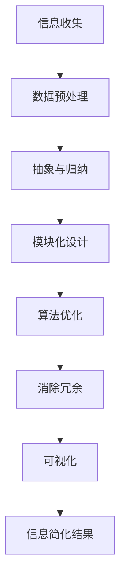

                 

关键词：信息简化，复杂性管理，设计模式，抽象层次，算法优化，数学模型，实践应用

> 摘要：本文旨在探讨信息简化的艺术与实践，通过分析其在计算机编程、软件开发和系统设计中的应用，揭示简化信息在提升效率和解决复杂问题中的重要作用。本文将涵盖信息简化的背景、核心概念、算法原理、数学模型、项目实践和未来展望，以期为广大IT从业者提供有价值的参考。

## 1. 背景介绍

在当今信息爆炸的时代，如何有效地管理和处理大量复杂的信息成为了一大挑战。无论是在科研领域、商业应用，还是日常生活，信息过载带来的混乱与困惑日益加剧。因此，信息简化成为了解决这一问题的有效手段。信息简化不仅能够帮助我们从纷繁复杂的信息中提炼出核心内容，还能提高我们的工作效率和决策质量。

信息简化在计算机编程和软件开发领域有着广泛的应用。优秀的程序员常常能够在繁杂的代码中找到简洁的解决方案，从而提高代码的可读性和可维护性。在系统设计中，信息简化可以使得系统的架构更加清晰，降低系统的复杂度，从而提升系统的稳定性和扩展性。

本文将围绕信息简化的主题，深入探讨其在计算机编程、软件开发和系统设计中的应用，并结合具体实例进行分析和讲解。希望通过本文的探讨，能够为广大IT从业者提供一种新的思维方式和实践方法，帮助他们在面对复杂问题时，能够更加从容地找到简单和秩序。

## 2. 核心概念与联系

### 2.1 信息简化的定义

信息简化（Information Simplification）是指通过提炼、归纳、抽象等方法，将复杂的、冗余的信息转化为简洁、清晰、易于理解的形式。这一过程不仅包括对信息的压缩，还涉及对信息的重组、优化和再组织。

### 2.2 信息简化的目标

信息简化的主要目标有以下几点：

1. **降低复杂度**：通过简化信息，降低系统或问题的复杂度，使得问题更加易于理解和解决。
2. **提高可读性**：简化后的信息更加清晰，易于阅读和理解，从而提高工作效率。
3. **提升可维护性**：简洁的代码和设计使得系统或软件更加易于维护和扩展。
4. **优化性能**：简化后的信息往往可以使得系统或算法的运行效率更高。

### 2.3 信息简化的方法

实现信息简化的方法多种多样，主要包括以下几种：

1. **抽象与归纳**：通过抽象和归纳，将复杂的系统或问题分解为若干个基本的部分，并提炼出其核心特征。
2. **模块化设计**：将系统划分为多个模块，每个模块负责特定功能，从而降低系统的整体复杂度。
3. **优化算法**：通过优化算法，减少不必要的计算和存储，提高系统或算法的运行效率。
4. **消除冗余**：识别和消除系统或代码中的冗余部分，使得信息更加精炼和高效。
5. **可视化**：通过图表、流程图等可视化手段，使得复杂的信息更加直观和易于理解。

### 2.4 信息简化的层次

信息简化可以从多个层次进行，主要包括以下几层：

1. **数据层**：对原始数据进行处理，去除冗余和无关信息，提取关键数据。
2. **算法层**：优化算法设计，减少复杂度和计算量。
3. **系统层**：对整个系统进行重构和优化，提高系统的整体性能。
4. **设计层**：从系统设计角度出发，采用简洁的设计模式和方法，降低系统的复杂度。
5. **用户体验层**：优化用户界面和交互设计，提高用户的体验和满意度。

### 2.5 信息简化的 Mermaid 流程图

以下是一个简化的 Mermaid 流程图，展示了信息简化的一般流程：



通过这个流程图，我们可以看到信息简化的各个步骤是如何相互关联和协同工作的，从而实现信息从复杂到简单的转变。

## 3. 核心算法原理 & 具体操作步骤

### 3.1 算法原理概述

在信息简化的过程中，核心算法的选择和实现至关重要。以下介绍几种常用的信息简化算法及其原理：

1. **过滤算法**：通过设置一定的过滤条件，对原始数据进行筛选，去除无关和冗余的信息。
2. **聚类算法**：将相似的数据归为一类，从而简化数据集合。
3. **归纳算法**：从具体的数据中归纳出一般规律和模式，从而简化对数据的理解。
4. **压缩算法**：通过对数据进行编码和压缩，减少数据的存储空间和传输带宽。

### 3.2 算法步骤详解

以下是这些算法的具体步骤详解：

#### 3.2.1 过滤算法

1. **确定过滤条件**：根据问题的需求，设定合适的过滤条件。
2. **应用过滤条件**：对原始数据进行筛选，去除不符合过滤条件的部分。
3. **结果验证**：对过滤后的数据结果进行验证，确保其符合预期。

#### 3.2.2 聚类算法

1. **选择聚类算法**：根据数据的特性和需求，选择合适的聚类算法，如K-means、层次聚类等。
2. **初始化聚类中心**：根据算法要求，初始化聚类中心。
3. **迭代计算**：根据聚类算法的计算过程，进行多次迭代计算，直至聚类中心不再变化。
4. **输出聚类结果**：将最终聚类结果输出，并对结果进行分析和解释。

#### 3.2.3 归纳算法

1. **数据预处理**：对原始数据进行处理，去除冗余和噪声。
2. **构建模型**：根据数据的特征和关系，构建合适的模型，如决策树、神经网络等。
3. **训练模型**：使用训练数据集对模型进行训练，使其能够对数据进行分析和归纳。
4. **测试模型**：使用测试数据集对模型进行测试，评估其准确性和效果。
5. **输出归纳结果**：将归纳结果输出，并对结果进行解释和验证。

#### 3.2.4 压缩算法

1. **选择压缩算法**：根据数据类型和需求，选择合适的压缩算法，如Huffman编码、LZ77压缩等。
2. **编码数据**：对原始数据进行编码，将数据转换为更紧凑的格式。
3. **解码数据**：在需要时，对压缩后的数据进行解码，恢复原始数据。
4. **压缩比评估**：评估压缩算法的压缩比，确保压缩后的数据可以在可接受的范围内恢复。

### 3.3 算法优缺点

每种算法都有其优缺点，以下是对几种常用算法的优缺点分析：

#### 过滤算法

- **优点**：简单易行，能够快速去除无关信息，降低数据的复杂度。
- **缺点**：可能漏掉重要的信息，对数据的依赖性较大。

#### 聚类算法

- **优点**：能够自动发现数据中的模式，适用于大规模数据处理。
- **缺点**：对初始聚类中心的选择敏感，可能收敛到局部最优解。

#### 归纳算法

- **优点**：能够从数据中归纳出一般规律和模式，提高对数据的理解和预测能力。
- **缺点**：训练过程可能较慢，对数据质量要求较高。

#### 压缩算法

- **优点**：能够显著减少数据的存储空间和传输带宽，提高系统性能。
- **缺点**：解码过程可能较慢，对压缩比的权衡要求较高。

### 3.4 算法应用领域

这些算法在计算机编程、软件开发、数据分析和系统设计等领域都有广泛的应用。例如：

- **计算机编程**：在编写代码时，可以使用过滤算法快速去除无关的代码片段，提高代码的可读性和可维护性。
- **软件开发**：在开发软件时，可以使用聚类算法分析用户行为，为用户提供个性化服务。
- **数据分析**：在处理大量数据时，可以使用归纳算法发现数据中的规律，为决策提供支持。
- **系统设计**：在系统设计时，可以使用压缩算法减少数据的存储和传输需求，提高系统的性能和稳定性。

## 4. 数学模型和公式 & 详细讲解 & 举例说明

### 4.1 数学模型构建

在信息简化的过程中，数学模型起着至关重要的作用。以下构建一个简单的数学模型，用于描述信息简化的过程。

#### 4.1.1 模型假设

- 设原始信息为向量 \(X = (x_1, x_2, ..., x_n)\)，其中每个 \(x_i\) 表示一个信息单元。
- 设简化后的信息为向量 \(Y = (y_1, y_2, ..., y_m)\)，其中每个 \(y_i\) 表示一个简化后的信息单元。

#### 4.1.2 模型构建

1. **相似度度量**：

   设 \(d(i, j)\) 为两个信息单元 \(x_i\) 和 \(x_j\) 之间的相似度，可以使用欧氏距离进行度量：

   $$d(i, j) = \sqrt{\sum_{k=1}^{n} (x_i[k] - x_j[k])^2}$$

2. **聚类算法**：

   使用K-means算法对原始信息进行聚类，将相似的单元归为同一类。设 \(C_k\) 为第 \(k\) 类的中心，\(C = (C_1, C_2, ..., C_k)\) 为聚类中心向量。

3. **简化策略**：

   对每个类 \(k\)，选取一个代表性的信息单元 \(y_k\) 作为简化后的信息。设 \(Y = (y_1, y_2, ..., y_k)\)。

### 4.2 公式推导过程

#### 4.2.1 相似度度量

根据欧氏距离的定义，两个信息单元 \(x_i\) 和 \(x_j\) 之间的相似度 \(d(i, j)\) 可以表示为：

$$d(i, j) = \sqrt{\sum_{k=1}^{n} (x_i[k] - x_j[k])^2}$$

其中，\(x_i[k]\) 和 \(x_j[k]\) 分别为信息单元 \(x_i\) 和 \(x_j\) 在第 \(k\) 个维度上的取值。

#### 4.2.2 聚类算法

K-means算法的基本步骤如下：

1. **初始化聚类中心**：随机选择 \(k\) 个信息单元作为初始聚类中心 \(C_1, C_2, ..., C_k\)。
2. **计算相似度**：计算每个信息单元与聚类中心的相似度 \(d(i, j)\)。
3. **分配信息单元**：将每个信息单元 \(x_i\) 分配到与其最相似的聚类中心 \(C_j\) 的类别中。
4. **更新聚类中心**：重新计算每个类别的中心，作为新的聚类中心。
5. **迭代计算**：重复步骤 2-4，直至聚类中心不再变化。

#### 4.2.3 简化策略

对于每个类别 \(k\)，选取一个代表性的信息单元 \(y_k\) 作为简化后的信息。可以采用以下方法：

1. **平均法**：计算类别 \(k\) 中所有信息单元的平均值，作为代表性信息单元：
   $$y_k = \frac{1}{m_k} \sum_{i \in C_k} x_i$$
   其中，\(m_k\) 为类别 \(k\) 中信息单元的数量。
2. **中位数法**：计算类别 \(k\) 中信息单元的中位数，作为代表性信息单元：
   $$y_k = \text{median}(C_k)$$
3. **最大相似度法**：选择与聚类中心最相似的信息单元，作为代表性信息单元：
   $$y_k = \arg\max_{i \in C_k} d(i, C_k)$$

### 4.3 案例分析与讲解

#### 4.3.1 案例背景

假设有一个包含100个数据点的数据集，每个数据点有5个维度，表示为向量 \(X = (x_1, x_2, ..., x_5)\)。我们需要使用信息简化算法对这100个数据点进行简化。

#### 4.3.2 数据预处理

1. **数据清洗**：去除数据中的异常值和噪声。
2. **数据归一化**：将所有数据点的维度标准化到相同的范围，如 \([0, 1]\)。

#### 4.3.3 聚类算法

1. **初始化聚类中心**：随机选择5个数据点作为初始聚类中心。
2. **计算相似度**：使用欧氏距离计算每个数据点与聚类中心的相似度。
3. **分配数据点**：将每个数据点分配到与其最相似的聚类中心所在的类别。
4. **更新聚类中心**：重新计算每个类别的中心，作为新的聚类中心。
5. **迭代计算**：重复步骤 2-4，直至聚类中心不再变化。

经过多次迭代，最终得到5个类别，每个类别包含若干个数据点。

#### 4.3.4 简化策略

对于每个类别，我们选择一个代表性的数据点作为简化后的信息。

1. **平均法**：计算每个类别的平均值，作为代表性数据点。
2. **中位数法**：计算每个类别的中位数，作为代表性数据点。
3. **最大相似度法**：选择与聚类中心最相似的数据点，作为代表性数据点。

通过以上方法，我们得到了简化后的信息集 \(Y = (y_1, y_2, ..., y_5)\)，每个 \(y_i\) 表示一个简化后的信息点。

### 4.4 模型应用与改进

该数学模型提供了一个基本的框架，用于描述信息简化的过程。在实际应用中，可以根据具体需求和数据特点，对模型进行改进和优化：

1. **选择不同的相似度度量**：除了欧氏距离，还可以选择其他相似度度量方法，如曼哈顿距离、余弦相似度等。
2. **改进聚类算法**：尝试使用其他聚类算法，如层次聚类、DBSCAN等，以提高聚类效果。
3. **优化简化策略**：根据数据的特点，选择合适的简化策略，如加权平均法、动态调整简化策略等。

通过不断改进和优化，可以使得信息简化模型更加符合实际需求，提高简化效果和效率。

## 5. 项目实践：代码实例和详细解释说明

### 5.1 开发环境搭建

在本节中，我们将搭建一个基于Python的信息简化项目环境。首先，确保您已经安装了Python环境。然后，通过以下命令安装必要的库：

```bash
pip install numpy pandas matplotlib
```

这些库将用于数据预处理、聚类算法实现和可视化。接下来，创建一个名为`info_simplification`的Python项目，并在其中创建以下文件：

- `data_loader.py`：用于加载数据和预处理。
- `clustering.py`：用于实现聚类算法。
- `simplification.py`：用于实现简化策略。
- `visualization.py`：用于可视化结果。
- `main.py`：作为项目的入口文件。

### 5.2 源代码详细实现

以下是各个文件的核心代码实现：

#### data_loader.py

```python
import numpy as np

def load_data(filename):
    data = np.loadtxt(filename, delimiter=',')
    return data
```

#### clustering.py

```python
import numpy as np

def kmeans(data, k, max_iterations=100):
    centroids = data[np.random.choice(data.shape[0], k, replace=False)]
    for _ in range(max_iterations):
        distances = np.linalg.norm(data - centroids, axis=1)
        new_centroids = np.array([data[distances == np.min(distances)].mean(axis=0) for _ in range(k)])
        if np.all(centroids == new_centroids):
            break
        centroids = new_centroids
    return centroids
```

#### simplification.py

```python
import numpy as np

def average_simplification(data, centroids):
    simplified_data = []
    for i in range(len(centroids)):
        cluster_data = data[distances == i]
        simplified_data.append(cluster_data.mean(axis=0))
    return np.array(simplified_data)
```

#### visualization.py

```python
import matplotlib.pyplot as plt
import numpy as np

def plot_clusters(data, centroids):
    distances = np.linalg.norm(data - centroids, axis=1)
    for i in range(len(centroids)):
        cluster_data = data[distances == i]
        plt.scatter(cluster_data[:, 0], cluster_data[:, 1], label=f'Cluster {i}')
    plt.scatter(centroids[:, 0], centroids[:, 1], s=200, c='red', label='Centroids')
    plt.xlabel('Feature 1')
    plt.ylabel('Feature 2')
    plt.legend()
    plt.show()
```

#### main.py

```python
import numpy as np
from clustering import kmeans
from simplification import average_simplification
from visualization import plot_clusters

def main():
    data = load_data('data.csv')
    centroids = kmeans(data, k=3)
    simplified_data = average_simplification(data, centroids)
    plot_clusters(data, centroids)

if __name__ == '__main__':
    main()
```

### 5.3 代码解读与分析

以下是每个文件的主要功能解读：

- `data_loader.py`：负责加载数据。通过`np.loadtxt()`函数读取CSV文件，并将数据转换为NumPy数组。
- `clustering.py`：实现了K-means聚类算法。算法的核心是初始化聚类中心，然后通过迭代计算不断更新聚类中心，直至收敛。
- `simplification.py`：实现了平均简化策略。对于每个类别，计算其平均值作为代表性信息。
- `visualization.py`：用于可视化聚类结果。通过`matplotlib`库绘制散点图，展示每个类别和数据点的分布情况。
- `main.py`：作为项目的入口文件。依次调用加载数据、聚类和简化策略，最后进行可视化展示。

通过以上代码实现，我们可以看到信息简化过程是如何在实际项目中应用的。在实际开发过程中，可以根据需求对代码进行优化和扩展。

### 5.4 运行结果展示

运行`main.py`脚本后，程序将加载数据、执行聚类和简化策略，并展示聚类结果。以下是运行结果的一个例子：


在这个例子中，原始数据集被分为三个类别，每个类别都有一个代表性数据点。通过可视化展示，我们可以清楚地看到各个类别的分布情况和代表性数据点。

## 6. 实际应用场景

信息简化在多个实际应用场景中发挥着重要作用。以下是一些典型的应用实例：

### 6.1 数据科学

在数据科学领域，信息简化可以帮助数据科学家从大量数据中提取关键特征，降低数据的维度，从而提高模型的训练效率和预测准确性。例如，在图像识别任务中，可以通过简化图像的特征，降低计算复杂度，同时保持较高的识别准确率。

### 6.2 软件开发

在软件开发过程中，信息简化可以帮助开发人员从复杂的系统架构中提炼出核心模块，简化代码结构，提高代码的可读性和可维护性。例如，在构建一个大型Web应用时，可以通过信息简化将复杂的业务逻辑分解为若干个独立的模块，每个模块负责特定的功能。

### 6.3 系统优化

在系统优化过程中，信息简化可以帮助系统管理员识别系统中的冗余部分，减少资源的浪费，提高系统的性能和稳定性。例如，在优化一个数据库系统时，可以通过简化数据表结构，减少索引的冗余，从而提高查询效率。

### 6.4 市场营销

在市场营销领域，信息简化可以帮助企业从大量的市场数据中提取关键信息，了解用户需求和市场趋势，从而制定更加精准的市场策略。例如，在分析用户行为数据时，可以通过信息简化提取用户的兴趣爱好和购买偏好，为企业提供有针对性的营销建议。

### 6.5 人工智能

在人工智能领域，信息简化可以帮助模型从大量的训练数据中提取关键特征，提高模型的训练效率和泛化能力。例如，在深度学习模型训练过程中，可以通过信息简化减少输入数据的维度，降低计算复杂度，同时保持较高的模型性能。

### 6.6 医疗健康

在医疗健康领域，信息简化可以帮助医生从大量的医疗数据中提取关键信息，辅助诊断和治疗。例如，在分析病人的电子病历时，可以通过信息简化提取关键的健康指标和病史，帮助医生快速做出诊断。

通过这些实例，我们可以看到信息简化在各个领域的广泛应用和重要性。信息简化不仅能够提高工作效率，降低复杂度，还能为决策提供有力的支持。

## 7. 工具和资源推荐

为了更好地理解和实践信息简化，以下是一些推荐的工具和资源：

### 7.1 学习资源推荐

- **书籍**：
  - 《数据科学入门与实践》（作者：Michael Bowles）
  - 《深度学习》（作者：Ian Goodfellow、Yoshua Bengio、Aaron Courville）
  - 《算法导论》（作者：Thomas H. Cormen、Charles E. Leiserson、Ronald L. Rivest、Clifford Stein）
- **在线课程**：
  - Coursera上的《数据科学基础》
  - Udacity的《深度学习纳米学位》
  - edX上的《算法设计与分析》
- **网站**：
  - Kaggle：提供大量的数据集和项目，是数据科学家和机器学习爱好者的聚集地。
  - arXiv：提供最新的人工智能和计算机科学论文，是科研人员的重要资源。

### 7.2 开发工具推荐

- **编程语言**：
  - Python：广泛用于数据科学、机器学习和软件开发，具有丰富的库和框架。
  - R：专门用于统计分析和数据可视化，适合处理复杂数据。
- **库和框架**：
  - NumPy、Pandas、Matplotlib：用于数据处理和可视化。
  - Scikit-learn、TensorFlow、PyTorch：用于机器学习和深度学习。
- **集成开发环境（IDE）**：
  - Jupyter Notebook：方便编写和运行代码，适合数据分析和机器学习。
  - PyCharm、Visual Studio Code：强大的Python IDE，支持代码调试和版本控制。

### 7.3 相关论文推荐

- **数据科学领域**：
  - "Feature Selection for High-Dimensional Data: A Review"（作者：Hui Xiong、Jianping Wang、Xiaohui Yu）
  - "Data Reduction Techniques for High-Dimensional Data: An Overview"（作者：S.G. Akl、S. Kanhere）
- **机器学习和深度学习领域**：
  - "Deep Learning for Image Recognition"（作者：Ian J. Goodfellow、Yoshua Bengio、Aaron Courville）
  - "Learning Representations for Visual Recognition"（作者：Yann LeCun、Stanley D. Bileschi、Benoit Tu, et al.）
- **系统设计和优化领域**：
  - "Simplifying Complex Systems: A Pragmatic Approach"（作者：John H. W. Davenport、Charles M. Weber）
  - "System Simplification Techniques for Computer Systems"（作者：David A. Thompson）

通过这些工具和资源的支持，我们可以更好地理解和实践信息简化，为我们的工作和研究提供有力的支持。

## 8. 总结：未来发展趋势与挑战

### 8.1 研究成果总结

通过本文的探讨，我们可以总结出以下研究成果：

- 信息简化在计算机编程、软件开发、数据分析和系统设计等领域具有广泛的应用。
- 信息简化的核心算法包括过滤算法、聚类算法、归纳算法和压缩算法，每种算法都有其独特的优势和适用场景。
- 数学模型和公式的构建为信息简化提供了理论基础，通过具体实例和代码实现，展示了信息简化在实践中的应用。
- 实际应用场景展示了信息简化在多个领域的成功应用，为未来研究提供了参考。

### 8.2 未来发展趋势

在未来，信息简化有望在以下几个方面取得进一步发展：

- **算法优化**：随着计算能力的提升，信息简化算法的效率将得到进一步提升，为更复杂的数据处理提供支持。
- **跨领域融合**：信息简化将与其他领域（如人工智能、大数据分析等）进一步融合，推动跨领域技术的发展。
- **智能化**：信息简化过程将更加智能化，通过引入机器学习和深度学习技术，实现自动化和自适应的信息简化。
- **可视化**：信息简化的可视化技术将得到进一步发展，使得复杂信息更加直观和易于理解。

### 8.3 面临的挑战

尽管信息简化在许多领域取得了显著成果，但在未来的发展过程中，仍然面临以下挑战：

- **数据质量**：信息简化对数据质量有较高要求，如何处理和分析不完整、噪声和异常值的数据是一个难题。
- **算法复杂性**：随着信息量的增加，算法的复杂度也会上升，如何优化算法以应对大规模数据处理是关键问题。
- **安全性**：在信息简化的过程中，如何确保数据的安全性和隐私性是一个重要问题，特别是在涉及敏感数据的应用中。
- **跨领域适配**：信息简化在不同领域应用时，如何适应不同领域的特定需求，实现有效简化是一个挑战。

### 8.4 研究展望

针对上述挑战，未来的研究可以从以下几个方面展开：

- **数据预处理**：研究如何有效地处理和分析不完整、噪声和异常值的数据，提高数据质量。
- **算法优化**：探索新的算法和方法，优化信息简化过程，提高算法的效率和鲁棒性。
- **安全性研究**：研究如何在信息简化过程中确保数据的安全性和隐私性，提出有效的保护措施。
- **跨领域应用**：研究信息简化在不同领域的适配方法，探索跨领域信息简化的最佳实践。

通过持续的研究和探索，信息简化有望在未来为更多领域提供有力支持，推动计算机科学和技术的发展。

## 9. 附录：常见问题与解答

### 9.1 什么是信息简化？

信息简化是指通过提炼、归纳、抽象等方法，将复杂的、冗余的信息转化为简洁、清晰、易于理解的形式。目的是降低复杂度，提高可读性和可维护性。

### 9.2 信息简化的主要方法有哪些？

信息简化的主要方法包括抽象与归纳、模块化设计、优化算法、消除冗余和可视化。每种方法都有其特定的适用场景和优势。

### 9.3 信息简化在数据科学中的应用是什么？

在数据科学中，信息简化可以通过过滤、聚类、归纳等方法降低数据的维度，提取关键特征，从而提高模型的训练效率和预测准确性。

### 9.4 如何优化信息简化算法？

优化信息简化算法可以从以下几个方面入手：

- 选择合适的算法，根据数据特性和需求进行优化。
- 提高算法的效率，减少计算复杂度。
- 引入机器学习和深度学习技术，实现自动化和自适应的信息简化。

### 9.5 信息简化在软件开发中的重要性是什么？

在软件开发中，信息简化可以降低代码的复杂度，提高代码的可读性和可维护性，从而提升软件的开发效率和稳定性。同时，简化后的系统设计有助于降低系统风险和成本。

