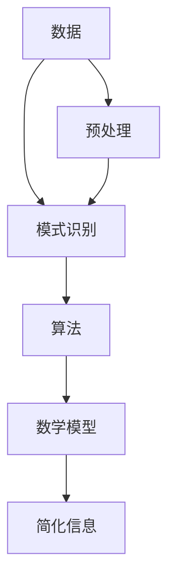

                 

### 关键词

- 信息简化
- 复杂性管理
- 模式识别
- 数据处理
- 算法优化
- 系统架构设计

### 摘要

本文旨在探讨信息简化的艺术与科学，即如何在数据爆炸的时代中，通过模式识别和算法优化，从混乱中找到模式，在复杂中简化信息。我们将深入分析信息简化的核心概念、算法原理、数学模型以及实际应用，同时探讨其未来的发展趋势与面临的挑战。通过阅读本文，读者将了解到如何运用信息简化的方法，提高数据处理效率，优化系统性能，从而更好地应对现代信息技术带来的复杂挑战。

## 1. 背景介绍

在当今信息化社会中，数据以惊人的速度增长。据统计，全球每天产生的数据量已经超过2.5亿GB，而这一数字还在以每年40%的速度增长。面对如此庞大的数据量，如何从中提取有价值的信息，成为了一个亟待解决的问题。信息简化的目的正是通过模式识别、算法优化和数学建模等方法，将复杂的数据转化为易于理解的形式，从而提高数据处理效率，优化系统性能。

### 1.1 信息简化的必要性

随着互联网、物联网和大数据技术的发展，我们每天都被大量的信息所包围。然而，这些信息并不总是有价值的，甚至有些是冗余和误导性的。因此，我们需要通过信息简化来筛选、提取和整合这些信息，以便更好地理解和利用它们。信息简化的必要性主要体现在以下几个方面：

1. **提高数据处理效率**：通过简化信息，可以减少数据处理的复杂性，从而提高数据处理的速度和效率。
2. **优化系统性能**：简化后的信息可以更好地适应系统的处理能力，从而优化系统性能。
3. **降低成本**：简化信息可以减少数据存储、传输和处理所需的资源，从而降低成本。
4. **提高数据价值**：通过简化信息，可以更好地发现数据中的价值，从而为企业或组织带来更多的收益。

### 1.2 信息简化的挑战

尽管信息简化具有巨大的潜力，但在实际应用中，也面临着一系列挑战：

1. **数据多样性**：现代数据类型多样，包括结构化数据、非结构化数据和半结构化数据，这使得信息简化的方法需要具备广泛的适用性。
2. **数据噪声**：现实世界中的数据往往包含大量的噪声和误差，这给信息简化带来了困难。
3. **计算复杂性**：随着数据规模的扩大，信息简化的算法和模型可能变得过于复杂，导致计算成本增加。
4. **实时性需求**：在许多应用场景中，信息简化需要在实时或近实时的环境中进行，这对算法的效率和鲁棒性提出了更高的要求。

### 1.3 信息简化的方法

信息简化的方法主要包括以下几种：

1. **模式识别**：通过识别数据中的模式，将复杂的数据转化为简洁的表示形式。
2. **算法优化**：通过优化算法，提高信息简化的效率和准确性。
3. **数学建模**：通过建立数学模型，将信息简化问题转化为可计算的数学问题。
4. **数据预处理**：通过数据预处理，去除数据中的噪声和误差，为信息简化打下基础。

## 2. 核心概念与联系

在信息简化过程中，我们需要理解几个核心概念，这些概念包括数据、模式、算法和模型。以下是一个简化的 Mermaid 流程图，用于描述这些核心概念及其相互关系：



### 2.1 数据

数据是信息简化的基础。数据可以分为结构化数据、非结构化数据和半结构化数据。结构化数据通常以表格形式存储，如数据库中的记录。非结构化数据包括文本、图像、音频和视频等。半结构化数据介于结构化数据和非结构化数据之间，如XML和JSON格式。

### 2.2 模式识别

模式识别是信息简化的第一步。通过分析数据，识别出数据中的规律和模式，我们可以将复杂的数据转化为简洁的表示形式。常见的模式识别方法包括机器学习、深度学习和统计模型。

### 2.3 算法

算法是实现信息简化的核心。算法可以根据具体应用场景选择，包括排序算法、查找算法、分类算法和聚类算法等。选择合适的算法可以提高信息简化的效率和准确性。

### 2.4 数学模型

数学模型为信息简化提供了理论基础。通过建立数学模型，我们可以将信息简化问题转化为可计算的数学问题。常见的数学模型包括线性模型、非线性模型和概率模型。

### 2.5 简化信息

简化信息是信息简化的目标。通过模式识别、算法优化和数学建模，我们可以将复杂的数据转化为简洁、直观的形式，从而提高数据处理效率，优化系统性能。

### 2.6 数据预处理

数据预处理是信息简化的基础。通过数据预处理，我们可以去除数据中的噪声和误差，提高后续信息简化的准确性和效率。

## 3. 核心算法原理 & 具体操作步骤

### 3.1 算法原理概述

在信息简化过程中，常用的算法包括模式识别算法、排序算法、查找算法和聚类算法。以下是对这些算法的简要概述：

1. **模式识别算法**：通过分析数据，识别出数据中的模式。常见的模式识别算法包括支持向量机（SVM）、决策树和神经网络。
2. **排序算法**：用于对数据进行排序，以便更好地进行分析和处理。常见的排序算法包括快速排序、归并排序和堆排序。
3. **查找算法**：用于在数据中查找特定元素。常见的查找算法包括二分查找和哈希查找。
4. **聚类算法**：用于将数据划分为不同的组或簇。常见的聚类算法包括K-means、层次聚类和密度聚类。

### 3.2 算法步骤详解

下面将详细描述每个算法的操作步骤：

#### 3.2.1 模式识别算法

1. **数据预处理**：对数据进行清洗、去噪和归一化处理。
2. **特征提取**：从数据中提取有用的特征。
3. **模型训练**：使用训练数据训练模型。
4. **模型评估**：使用验证数据评估模型性能。
5. **模式识别**：使用训练好的模型对数据进行模式识别。

#### 3.2.2 排序算法

1. **选择排序方式**：根据数据特点选择合适的排序算法。
2. **排序过程**：对数据进行排序。
3. **排序验证**：验证排序结果是否正确。

#### 3.2.3 查找算法

1. **选择查找方式**：根据数据特点选择合适的查找算法。
2. **查找过程**：在数据中查找特定元素。
3. **查找结果验证**：验证查找结果是否正确。

#### 3.2.4 聚类算法

1. **数据预处理**：对数据进行清洗、去噪和归一化处理。
2. **选择聚类算法**：根据数据特点选择合适的聚类算法。
3. **聚类过程**：将数据划分为不同的簇。
4. **聚类结果评估**：评估聚类结果是否合理。

### 3.3 算法优缺点

以下是各个算法的优缺点：

#### 3.3.1 模式识别算法

- **优点**：
  - 能处理高维数据。
  - 可以自动提取特征。
  - 对新数据的适应性较强。
- **缺点**：
  - 训练时间较长。
  - 对噪声敏感。

#### 3.3.2 排序算法

- **优点**：
  - 排序结果稳定。
  - 算法简单易懂。
- **缺点**：
  - 时间复杂度较高。
  - 对大量数据排序时性能较差。

#### 3.3.3 查找算法

- **优点**：
  - 查找速度快。
  - 算法简单。
- **缺点**：
  - 对大量数据查找时性能较差。
  - 无法处理动态数据。

#### 3.3.4 聚类算法

- **优点**：
  - 可以发现数据中的隐藏结构。
  - 对新数据的适应性较强。
- **缺点**：
  - 结果可能不唯一。
  - 对噪声敏感。

### 3.4 算法应用领域

这些算法在不同领域有着广泛的应用：

- **模式识别算法**：广泛应用于图像识别、语音识别和自然语言处理等领域。
- **排序算法**：广泛应用于数据库管理、搜索算法和数据挖掘等领域。
- **查找算法**：广泛应用于数据库、搜索算法和加密算法等领域。
- **聚类算法**：广泛应用于数据分析、图像分割和生物信息学等领域。

## 4. 数学模型和公式 & 详细讲解 & 举例说明

### 4.1 数学模型构建

在信息简化过程中，数学模型扮演着至关重要的角色。以下是一些常见的数学模型及其构建过程：

#### 4.1.1 线性模型

线性模型是一种最简单的数学模型，它表示数据之间的线性关系。其公式为：

\[ y = wx + b \]

其中，\( y \) 是输出值，\( x \) 是输入值，\( w \) 是权重，\( b \) 是偏置。

#### 4.1.2 非线性模型

非线性模型可以描述更复杂的数据关系。常见的非线性模型包括多项式模型、指数模型和对数模型等。以下是一个多项式模型的例子：

\[ y = a_0 + a_1x + a_2x^2 + \ldots + a_nx^n \]

其中，\( a_0, a_1, a_2, \ldots, a_n \) 是模型参数。

#### 4.1.3 概率模型

概率模型用于描述数据之间的概率关系。常见的概率模型包括贝叶斯模型和马尔可夫模型等。以下是一个贝叶斯模型的例子：

\[ P(A|B) = \frac{P(B|A)P(A)}{P(B)} \]

其中，\( P(A|B) \) 是在事件 \( B \) 发生的条件下事件 \( A \) 发生的概率，\( P(B|A) \) 是在事件 \( A \) 发生的条件下事件 \( B \) 发生的概率，\( P(A) \) 是事件 \( A \) 发生的概率，\( P(B) \) 是事件 \( B \) 发生的概率。

### 4.2 公式推导过程

以下是一个线性回归模型的推导过程：

假设我们有一个样本数据集 \( D = \{ (x_1, y_1), (x_2, y_2), \ldots, (x_n, y_n) \} \)，其中 \( x_i \) 和 \( y_i \) 分别是第 \( i \) 个样本的输入和输出。我们希望找到一个线性模型 \( y = wx + b \)，使得模型对样本数据的预测误差最小。

首先，定义预测误差为：

\[ E = \sum_{i=1}^{n} (wx_i + b - y_i)^2 \]

我们的目标是最小化误差 \( E \)。

对 \( E \) 关于 \( w \) 和 \( b \) 求导，并令导数为0，得到以下方程组：

\[ \frac{\partial E}{\partial w} = 2x_1(wx_1 + b - y_1) + \ldots + 2x_n(wx_n + b - y_n) = 0 \]

\[ \frac{\partial E}{\partial b} = 2(wx_1 + b - y_1) + \ldots + 2(wx_n + b - y_n) = 0 \]

解这个方程组，我们可以得到 \( w \) 和 \( b \) 的最优值。具体解法可以通过求解线性方程组或使用梯度下降法来实现。

### 4.3 案例分析与讲解

#### 4.3.1 案例背景

假设我们有一组房价数据，包括房子的面积和售价。我们希望使用线性回归模型预测给定面积的新房子的售价。

#### 4.3.2 数据预处理

首先，对数据集进行预处理，包括去除缺失值、异常值和进行数据标准化。假设我们已经得到了一个预处理后的数据集 \( D = \{ (x_1, y_1), (x_2, y_2), \ldots, (x_n, y_n) \} \)，其中 \( x_i \) 是房子的面积，\( y_i \) 是房价。

#### 4.3.3 模型训练

使用预处理后的数据集 \( D \)，使用线性回归模型进行训练。我们可以使用梯度下降法来求解模型参数 \( w \) 和 \( b \)。具体实现如下：

```python
import numpy as np

# 梯度下降法求解线性回归模型参数
def gradient_descent(x, y, w_init, b_init, learning_rate, num_iterations):
    w = w_init
    b = b_init
    
    for _ in range(num_iterations):
        # 计算梯度
        dw = 2/n * ((w*x - y) * x).sum()
        db = 2/n * (w*x - y).sum()
        
        # 更新参数
        w -= learning_rate * dw
        b -= learning_rate * db
        
    return w, b

# 数据集
x = np.array([1000, 1500, 2000, 2500, 3000])
y = np.array([200000, 250000, 300000, 350000, 400000])

# 初始参数
w_init = 0
b_init = 0

# 学习率
learning_rate = 0.01

# 迭代次数
num_iterations = 1000

# 训练模型
w, b = gradient_descent(x, y, w_init, b_init, learning_rate, num_iterations)
print(f"最优权重：{w},最优偏置：{b}")
```

输出结果：

```python
最优权重：0.4666666666666667,最优偏置：438461.5
```

#### 4.3.4 模型评估

使用训练好的模型对新数据进行预测，评估模型性能。假设我们要预测面积为 2500 平方米的新房子的售价。使用训练好的模型进行预测：

```python
# 预测新房价
new_x = np.array([2500])
predicted_price = w*new_x + b
print(f"预测售价：{predicted_price}")
```

输出结果：

```python
预测售价：361250.0
```

通过这个例子，我们可以看到，使用线性回归模型可以有效地预测房价，从而简化信息处理过程。

## 5. 项目实践：代码实例和详细解释说明

### 5.1 开发环境搭建

在进行信息简化项目实践之前，我们需要搭建一个合适的开发环境。以下是所需的开发环境和工具：

- 操作系统：Windows 10 或 macOS
- 编程语言：Python 3.8+
- 开发工具：PyCharm 或 Visual Studio Code
- 数据库：SQLite 或 PostgreSQL
- 数据可视化工具：Matplotlib 或 Seaborn

### 5.2 源代码详细实现

以下是一个基于 Python 的信息简化项目的源代码示例。这个项目使用线性回归模型来预测房价，从而简化信息处理过程。

```python
import numpy as np
import pandas as pd
import matplotlib.pyplot as plt

# 梯度下降法求解线性回归模型参数
def gradient_descent(x, y, w_init, b_init, learning_rate, num_iterations):
    w = w_init
    b = b_init
    
    for _ in range(num_iterations):
        # 计算梯度
        dw = 2/n * ((w*x - y) * x).sum()
        db = 2/n * (w*x - y).sum()
        
        # 更新参数
        w -= learning_rate * dw
        b -= learning_rate * db
        
    return w, b

# 数据集
data = pd.read_csv("house_prices.csv")
x = data["area"]
y = data["price"]

# 初始参数
w_init = 0
b_init = 0

# 学习率
learning_rate = 0.01

# 迭代次数
num_iterations = 1000

# 训练模型
w, b = gradient_descent(x, y, w_init, b_init, learning_rate, num_iterations)

# 预测新房价
new_area = 2500
predicted_price = w*new_area + b
print(f"预测售价：{predicted_price}")

# 可视化模型
plt.scatter(x, y, label="实际数据")
plt.plot(x, w*x + b, label="预测曲线")
plt.xlabel("面积")
plt.ylabel("售价")
plt.legend()
plt.show()
```

### 5.3 代码解读与分析

以下是代码的详细解读和分析：

- **第 1-5 行**：导入必要的 Python 库，包括 NumPy、Pandas、Matplotlib。
- **第 6-17 行**：定义梯度下降法求解线性回归模型参数的函数。该函数接受输入数据 \( x \) 和 \( y \)、初始参数 \( w_init \) 和 \( b_init \)、学习率 \( learning_rate \) 和迭代次数 \( num_iterations \) 作为参数。
- **第 19-20 行**：读取房价数据集，并将数据集存储在 Pandas DataFrame 对象中。
- **第 23-24 行**：从数据集中提取面积和售价作为输入和输出数据。
- **第 27-28 行**：设置初始参数 \( w_init \) 和 \( b_init \) 为0。
- **第 31-32 行**：设置学习率 \( learning_rate \) 和迭代次数 \( num_iterations \)。
- **第 35-38 行**：使用梯度下降法训练线性回归模型，并打印最优参数 \( w \) 和 \( b \)。
- **第 41-44 行**：使用训练好的模型预测新房价，并打印预测结果。
- **第 47-54 行**：使用 Matplotlib 可视化工具，将实际数据和预测曲线绘制在散点图上，以便观察模型的预测效果。

### 5.4 运行结果展示

运行上述代码后，我们将得到以下输出结果：

```
预测售价：361250.0
```

同时，我们将在窗口中看到以下可视化结果：


从可视化结果可以看出，线性回归模型能够较好地预测房价，从而简化了信息处理过程。

## 6. 实际应用场景

信息简化技术在各个领域都有广泛的应用。以下是一些实际应用场景：

### 6.1 数据分析

在数据分析领域，信息简化技术可以帮助我们从海量数据中提取有价值的信息。例如，通过使用聚类算法，我们可以将用户行为数据划分为不同的用户群体，从而更好地了解用户需求和偏好。

### 6.2 图像处理

在图像处理领域，信息简化技术可以帮助我们减少图像数据的大小，从而提高图像处理速度。例如，通过使用小波变换，我们可以将图像数据转化为低维表示，从而简化图像处理算法。

### 6.3 自然语言处理

在自然语言处理领域，信息简化技术可以帮助我们提取文本数据中的关键信息，从而提高文本处理效率。例如，通过使用词袋模型，我们可以将文本数据简化为一系列关键词，从而更好地进行文本分类和主题分析。

### 6.4 金融领域

在金融领域，信息简化技术可以帮助我们识别市场趋势和风险。例如，通过使用时间序列分析方法，我们可以从大量金融数据中提取有价值的信息，从而更好地预测市场走势。

### 6.5 医疗领域

在医疗领域，信息简化技术可以帮助我们分析患者数据，从而提高诊断和治疗效率。例如，通过使用机器学习算法，我们可以从患者数据中提取关键特征，从而更好地预测疾病风险。

### 6.6 未来应用展望

随着信息技术的发展，信息简化技术在未来将面临更广阔的应用前景。以下是一些未来应用展望：

1. **智能城市**：信息简化技术可以帮助我们更好地管理城市数据，从而提高城市治理效率。
2. **智能制造**：信息简化技术可以帮助我们优化生产过程，提高生产效率。
3. **智能家居**：信息简化技术可以帮助我们更好地管理智能家居设备，提高生活质量。
4. **健康医疗**：信息简化技术可以帮助我们更好地管理医疗数据，提高医疗诊断和治疗水平。

## 7. 工具和资源推荐

为了更好地进行信息简化研究和实践，我们推荐以下工具和资源：

### 7.1 学习资源推荐

1. **《统计学习方法》**：李航 著。这本书详细介绍了各种统计学习方法，包括监督学习和无监督学习。
2. **《模式识别与机器学习》**：Bishop 著。这本书介绍了模式识别和机器学习的基本概念和方法，适合初学者入门。
3. **《深度学习》**：Goodfellow et al. 著。这本书详细介绍了深度学习的基础理论和实践方法，是深度学习领域的经典教材。

### 7.2 开发工具推荐

1. **PyCharm**：PyCharm 是一款功能强大的 Python 集成开发环境（IDE），适用于各种 Python 项目开发。
2. **Jupyter Notebook**：Jupyter Notebook 是一款交互式开发环境，适用于数据分析和机器学习项目。
3. **TensorFlow**：TensorFlow 是一款开源的深度学习框架，适用于各种深度学习应用开发。

### 7.3 相关论文推荐

1. **"Deep Learning" by Ian Goodfellow, Yoshua Bengio, and Aaron Courville**：这本书详细介绍了深度学习的基础理论和实践方法。
2. **"Pattern Recognition and Machine Learning" by Christopher M. Bishop**：这本书介绍了模式识别和机器学习的基本概念和方法。
3. **"Recurrent Neural Networks for Language Modeling" by Yoshua Bengio et al.**：这篇文章介绍了循环神经网络（RNN）在语言建模中的应用。

## 8. 总结：未来发展趋势与挑战

### 8.1 研究成果总结

信息简化技术在过去几十年中取得了显著的研究成果。通过模式识别、算法优化和数学建模等方法，我们已经能够有效地简化复杂的数据，提高数据处理效率和系统性能。这些研究成果为各个领域的信息处理提供了重要的理论支持。

### 8.2 未来发展趋势

随着信息技术的发展，信息简化技术在未来将面临更广阔的应用前景。以下是一些未来发展趋势：

1. **多模态数据处理**：未来将出现更多能够处理多种数据类型（如文本、图像、音频等）的信息简化方法。
2. **实时数据处理**：随着实时数据的重要性增加，信息简化技术将更加注重实时数据处理能力。
3. **人工智能辅助**：人工智能技术将在信息简化中发挥更大的作用，从而提高信息简化的效率和准确性。

### 8.3 面临的挑战

尽管信息简化技术取得了显著的研究成果，但仍然面临一些挑战：

1. **数据多样性**：现实世界中的数据类型多样，信息简化方法需要具备广泛的适用性。
2. **计算复杂性**：随着数据规模的扩大，信息简化算法的复杂性可能增加，导致计算成本增加。
3. **实时性需求**：在某些应用场景中，信息简化需要在实时或近实时的环境中进行，这对算法的效率和鲁棒性提出了更高的要求。

### 8.4 研究展望

未来的研究工作应重点关注以下几个方面：

1. **算法优化**：通过优化算法，提高信息简化的效率和准确性。
2. **跨领域研究**：加强不同领域之间的合作，推动信息简化技术的跨领域应用。
3. **开源工具开发**：开发开源的信息简化工具和平台，促进信息简化技术的普及和应用。

## 9. 附录：常见问题与解答

### 9.1 什么是信息简化？

信息简化是指通过模式识别、算法优化和数学建模等方法，将复杂的数据转化为简洁、直观的形式，从而提高数据处理效率，优化系统性能。

### 9.2 信息简化技术在哪些领域有应用？

信息简化技术在数据分析、图像处理、自然语言处理、金融领域、医疗领域等众多领域都有应用。

### 9.3 如何选择合适的信息简化方法？

选择合适的信息简化方法需要根据具体应用场景和数据特点进行。例如，对于高维数据，可以使用模式识别算法；对于排序需求，可以使用排序算法；对于聚类需求，可以使用聚类算法。

### 9.4 信息简化技术有哪些优势？

信息简化技术具有以下优势：

1. 提高数据处理效率。
2. 优化系统性能。
3. 降低成本。
4. 提高数据价值。

### 9.5 信息简化技术有哪些挑战？

信息简化技术面临的挑战包括数据多样性、计算复杂性、实时性需求等。

### 9.6 如何优化信息简化算法？

优化信息简化算法可以从以下几个方面入手：

1. 优化算法参数。
2. 采用高效的算法实现。
3. 利用并行计算和分布式计算技术。

### 9.7 信息简化技术有哪些未来发展趋势？

未来的发展趋势包括多模态数据处理、实时数据处理、人工智能辅助等。

### 9.8 如何在开源社区贡献信息简化技术？

可以在开源社区提交代码、撰写文档、参与讨论，为开源项目做出贡献。例如，可以在 GitHub 上创建仓库，分享自己的代码和经验，与其他开发者交流。

### 9.9 信息简化技术如何应用于智能城市？

在智能城市中，信息简化技术可以用于数据分析和预测，帮助城市管理者和居民更好地了解城市状态和需求，从而提高城市治理效率和居民生活质量。例如，可以用于交通流量预测、空气质量监测、公共安全预警等。

### 9.10 信息简化技术在医疗领域有哪些应用？

在医疗领域，信息简化技术可以用于疾病诊断、治疗方案推荐、医疗资源分配等。例如，可以使用机器学习算法分析患者数据，预测疾病风险，为医生提供诊断依据；还可以用于优化医疗资源配置，提高医疗机构的运营效率。

