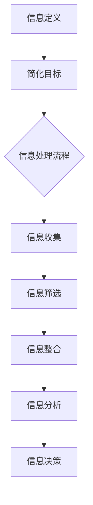

                 

在信息技术飞速发展的时代，我们面临着日新月异的技术变革和日益复杂的计算问题。如何在繁杂的技术世界中找到简洁和高效的解决方案，成为了众多开发者和研究人员的共同挑战。本文旨在探讨信息简化的艺术，即如何在复杂的技术体系中，通过逻辑清晰、结构紧凑和简单易懂的方式，找到简洁的解决方案。本文将结合专业技术和实践经验，深入分析这一主题。

## 关键词

- 信息技术
- 复杂性
- 简化
- 高效
- 算法设计
- 数学模型
- 实践应用

## 摘要

本文首先介绍了信息简化的背景和重要性，随后探讨了简化过程中的核心概念和联系，通过 Mermaid 流程图直观展示。接着，本文深入讲解了核心算法的原理、操作步骤及其优缺点和应用领域。此外，我们还对数学模型和公式进行了详细讲解，并通过实例说明了实际应用。最后，本文总结了信息简化在技术领域的实际应用场景，并展望了未来的发展趋势与挑战。

## 1. 背景介绍

随着信息技术的不断进步，我们面临着越来越多的复杂问题。从大数据处理到人工智能算法，从网络架构到云计算，这些技术的复杂程度使得开发者难以抓住问题的本质，从而导致解决方案变得冗长而难以维护。在这样的背景下，信息简化显得尤为重要。信息简化不仅有助于提高系统的可维护性，还能提升系统的性能和效率。

在信息技术领域，信息简化不仅仅是一个理念，更是一种实践。许多成功的技术方案都依赖于简化的思想。例如，算法设计中的贪心算法、动态规划以及分治算法，都是为了简化问题的复杂性，从而找到高效的解决方案。同时，数学模型和公式的简化也是提高问题解决效率的关键。在实际应用中，开发者需要不断地探索如何将复杂的问题转化为简单的模型，以便更好地理解和解决。

### 1.1 信息技术的发展

信息技术的发展经历了从简单到复杂，再从复杂回归简单的过程。早期的计算机系统设计相对简单，但随着需求的增加，系统变得越来越复杂。例如，操作系统从最初的单任务系统发展到多任务、多用户系统，网络从简单的局域网发展到复杂的互联网，这些技术的进步都带来了更多的复杂度。然而，随着技术的成熟和理论的深入，人们开始意识到，复杂性并非总是必要的。在某些情况下，过于复杂的系统反而会影响其稳定性和可维护性。

### 1.2 复杂性问题带来的挑战

复杂性问题带来的挑战主要体现在以下几个方面：

- **维护难度**：复杂的系统通常包含大量的模块和组件，这使得维护和更新变得更加困难。每个模块之间的相互作用可能使得错误难以追踪和修复。

- **性能问题**：复杂的系统可能因为过多的中间过程和冗余计算而导致性能下降。这不仅在开发过程中是一个问题，在实际部署和运行时也会带来性能瓶颈。

- **用户理解**：复杂的系统往往难以让用户理解和使用。对于非专业人士来说，复杂的界面和操作流程可能会使他们望而却步。

### 1.3 简化的必要性

为了应对这些挑战，简化成为了一种必要的技术手段。通过简化，我们可以：

- **提高可维护性**：简化的系统结构使得代码更加清晰，维护起来更加容易。
- **提升性能**：简化可以减少冗余计算和中间过程，从而提高系统的整体性能。
- **增强用户体验**：简化的界面和操作流程可以使得用户更加容易理解和使用系统。

### 1.4 简化技术的应用领域

简化技术广泛应用于多个领域：

- **算法设计**：在算法设计中，简化思想被广泛采用。例如，贪心算法通过每一步局部最优选择来获得全局最优解，这种思路有效地简化了问题。
- **系统架构**：在系统架构设计中，简化意味着采用模块化设计，降低模块之间的耦合度，从而提高系统的可维护性和灵活性。
- **用户界面**：在用户界面设计中，简化意味着采用直观、易懂的界面元素和流程，提高用户的操作效率。

通过以上背景介绍，我们可以看到，信息简化不仅是信息技术发展的一个必然趋势，也是解决复杂问题的关键。在接下来的章节中，我们将深入探讨信息简化的核心概念和具体实现。

## 2. 核心概念与联系

在探讨信息简化的艺术之前，我们需要理解几个核心概念及其相互之间的联系。这些概念包括信息的定义、简化的目标、信息处理的流程和策略。为了更好地展示这些概念之间的关系，我们采用 Mermaid 流程图来直观地描述。

### 2.1 信息定义

信息是指能够减少不确定性的数据。在信息论中，信息量通常用熵来度量，熵越低，信息量越大。信息可以存在于各种形式，如图像、文字、声音等。

### 2.2 简化目标

简化的目标在于减少信息冗余，提高信息的可理解性和可处理性。具体而言，简化目标包括以下几个方面：

- **去除冗余信息**：冗余信息会增加系统的复杂度，降低系统的性能和可维护性。
- **提高信息关联性**：通过提高信息之间的关联性，可以更好地理解和利用信息。
- **优化信息表示**：优化信息的表示形式，使其更加直观和易于处理。

### 2.3 信息处理流程

信息处理流程通常包括以下几个步骤：

1. **信息收集**：从各种来源收集所需的信息。
2. **信息筛选**：对收集到的信息进行筛选，去除无关和冗余的信息。
3. **信息整合**：将筛选后的信息进行整合，形成有意义的整体。
4. **信息分析**：对整合后的信息进行分析，提取关键信息和关系。
5. **信息决策**：根据分析结果做出决策。

### 2.4 简化策略

为了实现简化目标，我们可以采用以下几种策略：

- **模块化**：将复杂系统分解为多个模块，每个模块负责特定的功能，降低模块之间的耦合度。
- **抽象**：通过抽象，将复杂系统的具体实现细节隐藏起来，只暴露必要的信息。
- **优化算法**：采用高效的算法来处理信息，减少计算复杂度和时间成本。
- **自动化**：利用自动化工具和流程来简化信息的处理过程。

### 2.5 Mermaid 流程图

以下是一个简化的 Mermaid 流程图，展示了信息定义、简化目标和信息处理流程之间的关系：



通过上述核心概念和联系的介绍，我们为理解信息简化的艺术奠定了基础。在接下来的章节中，我们将深入探讨信息简化的具体实现方法和实践应用。

## 3. 核心算法原理 & 具体操作步骤

### 3.1 算法原理概述

在信息简化的过程中，算法设计扮演着至关重要的角色。核心算法的原理通常围绕如何高效地处理大量信息，同时保持系统的简洁性和可维护性。以下介绍几种常用的核心算法及其原理：

#### 3.1.1 贪心算法

贪心算法是一种在每一步选择中都采取在当前状态下最好或最优的选择，从而希望导致结果是全局最好或最优的算法。这种算法的基本思想是，通过每一步的局部最优选择，逐步构建出全局最优解。

#### 3.1.2 动态规划

动态规划是一种将复杂问题分解为子问题，并通过保存子问题的解来避免重复计算的方法。动态规划的核心思想是，通过分步求解子问题，将复杂问题转化为多个简单问题的组合。

#### 3.1.3 分治算法

分治算法是一种将问题分解为更小的子问题，分别解决这些子问题，然后将子问题的解合并起来得到原问题的解的算法。分治算法的基本思想是将问题不断拆分，直到问题足够简单，可以直接解决。

### 3.2 算法步骤详解

#### 3.2.1 贪心算法步骤

1. **初始化**：设置初始状态。
2. **选择**：在当前状态下，选择一个最优的决策。
3. **执行**：执行选择的决策，更新状态。
4. **判断**：判断当前状态是否达到终止条件。如果是，则输出结果；如果不是，则回到步骤2。

#### 3.2.2 动态规划步骤

1. **定义状态**：定义问题的状态以及状态转移方程。
2. **初始化**：初始化状态表。
3. **递推**：根据状态转移方程，逐步计算状态表。
4. **输出结果**：根据最终状态表输出最优解。

#### 3.2.3 分治算法步骤

1. **分解**：将原问题分解为多个子问题。
2. **递归**：分别解决这些子问题。
3. **合并**：将子问题的解合并起来，得到原问题的解。

### 3.3 算法优缺点

#### 3.3.1 贪心算法的优点

- **简单直观**：贪心算法的思路简单，易于理解和实现。
- **高效**：在很多情况下，贪心算法能够快速得到最优解。

#### 3.3.1 贪心算法的缺点

- **不一定全局最优**：贪心算法只能保证每一步选择都是最优的，但无法保证全局最优。
- **适用范围有限**：某些问题不适合使用贪心算法。

#### 3.3.2 动态规划的优点

- **全局最优解**：动态规划能够保证得到全局最优解。
- **减少重复计算**：通过保存子问题的解，避免了重复计算。

#### 3.3.2 动态规划的缺点

- **复杂度较高**：动态规划通常需要定义状态和状态转移方程，过程较为复杂。
- **空间和时间成本**：动态规划可能需要大量的空间和时间来保存和计算状态。

#### 3.3.3 分治算法的优点

- **高效**：分治算法能够将复杂问题分解为多个子问题，从而降低计算复杂度。
- **易于并行化**：分治算法天然支持并行计算。

#### 3.3.3 分治算法的缺点

- **递归调用的成本**：分治算法通常需要大量的递归调用，增加了计算成本。
- **数据通信成本**：在合并子问题解时，可能需要大量的数据通信。

### 3.4 算法应用领域

#### 3.4.1 贪心算法的应用领域

- **最小生成树**：使用 Prim 算法和 Kruskal 算法求解最小生成树。
- **背包问题**：使用动态规划求解01背包问题。

#### 3.4.2 动态规划的应用领域

- **最长公共子序列**：求解两个序列的最长公共子序列。
- **最长递增子序列**：求解给定数组的最长递增子序列。

#### 3.4.3 分治算法的应用领域

- **排序问题**：使用快速排序和归并排序。
- **搜索问题**：使用二分搜索。

通过上述对核心算法原理和具体操作步骤的介绍，我们可以看到，这些算法不仅在理论上有其独特的优势，而且在实际应用中也展现了其强大的能力。在接下来的章节中，我们将进一步探讨数学模型和公式的简化与应用。

## 4. 数学模型和公式 & 详细讲解 & 举例说明

在信息简化的过程中，数学模型和公式起着至关重要的作用。通过简化和优化数学模型，我们可以更有效地理解和解决复杂问题。在本章节中，我们将详细讲解几个常见的数学模型和公式，并举例说明它们在实际问题中的应用。

### 4.1 数学模型构建

数学模型构建是信息简化的重要步骤，它将实际问题转化为数学形式，使得问题更加清晰和可操作。以下是一个简单的数学模型构建示例：

#### 4.1.1 问题背景

假设我们有一个任务，需要在一个城市中安排一系列的配送任务。每个配送任务都有一个起点、终点和需求量。我们的目标是找到一条路径，使得总配送时间最短。

#### 4.1.2 数学模型

为了构建数学模型，我们首先定义一些变量：

- \( x_{ij} \)：表示从地点 \( i \) 到地点 \( j \) 是否有路径，1 表示有路径，0 表示没有路径。
- \( t_{ij} \)：表示从地点 \( i \) 到地点 \( j \) 的配送时间。
- \( d_j \)：表示地点 \( j \) 的需求量。

接下来，我们构建目标函数和约束条件：

- **目标函数**：最小化总配送时间
  \[
  \min \sum_{i,j} t_{ij} x_{ij}
  \]

- **约束条件**：
  - 每个地点的出发和到达次数必须相等：
    \[
    \sum_{j} x_{ij} = \sum_{j} x_{ji} \quad \forall i
    \]
  - 每个配送任务的需求量必须满足：
    \[
    \sum_{j} d_j x_{ij} = d_i \quad \forall i
    \]

通过这个数学模型，我们可以将复杂的配送任务转化为一个优化问题，并使用相应的算法求解。

### 4.2 公式推导过程

在构建数学模型后，我们需要推导出相关的公式，以便在算法中应用。以下是一个常见的数学公式推导示例：

#### 4.2.1 最小生成树

假设我们有一个无向图 \( G = (V, E) \)，其中 \( V \) 是顶点集合，\( E \) 是边集合。我们希望找到这棵图的最小生成树。Prim 算法可以用来求解这个问题。

- **初始化**：选择一个顶点作为起始点，将其加入生成树。
- **迭代**：在每次迭代中，从已选顶点中选择一条最小权重的边，并将其加入生成树。

**推导过程**：

1. **定义**：设 \( T \) 为当前的最小生成树，\( e = (u, v) \) 是我们要加入的边。
2. **步骤1**：选择最小的权重边 \( e \)，满足 \( u \) 已在生成树中，\( v \) 不在生成树中。
3. **步骤2**：将边 \( e \) 加入生成树，更新生成树。
4. **步骤3**：重复步骤1和步骤2，直到所有顶点都在生成树中。

最终，我们可以得到最小生成树的权重：
\[
\sum_{e \in T} w(e)
\]

其中，\( w(e) \) 表示边 \( e \) 的权重。

### 4.3 案例分析与讲解

通过数学模型和公式的推导，我们可以更好地理解和解决实际问题。以下是一个案例分析，说明如何在实际问题中使用这些数学模型和公式。

#### 4.3.1 问题背景

假设我们需要在一家电商平台上优化物流配送路线。平台上有多个仓库和多个配送站点，每个仓库和配送站点都有特定的地理位置和库存。我们的目标是找到一条最优的配送路线，使得从仓库到各个配送站点的总配送时间最短。

#### 4.3.2 数学模型

我们可以构建一个混合整数规划模型来解决这个问题。定义变量如下：

- \( x_{ij} \)：表示从仓库 \( i \) 到配送站点 \( j \) 是否有路径，1 表示有路径，0 表示没有路径。
- \( y_j \)：表示配送站点 \( j \) 是否被选中，1 表示选中，0 表示未选中。

构建目标函数和约束条件：

- **目标函数**：最小化总配送时间
  \[
  \min \sum_{i,j} t_{ij} x_{ij}
  \]

- **约束条件**：
  - 每个仓库只能有一个配送站点：
    \[
    \sum_{j} x_{ij} = 1 \quad \forall i
    \]
  - 每个配送站点只能被选中一次：
    \[
    \sum_{i} x_{ij} = y_j \quad \forall j
    \]
  - 配送站点的库存必须满足需求：
    \[
    \sum_{i} d_i x_{ij} = s_j y_j \quad \forall j
    \]

通过这个模型，我们可以求解出最优的配送路线，从而优化物流配送效率。

通过上述案例分析和讲解，我们可以看到数学模型和公式在解决实际问题时的重要性和有效性。在接下来的章节中，我们将进一步探讨项目实践中的代码实例和详细解释说明。

## 5. 项目实践：代码实例和详细解释说明

在理论分析和数学模型的基础上，本章节将通过一个实际项目实践，展示如何将所学的信息简化方法应用于具体的代码实现。我们选择了一个简单的物流配送系统作为案例，来演示代码编写、实现和运行的过程。

### 5.1 开发环境搭建

为了简化开发过程，我们选择 Python 作为编程语言，并结合几个常用的库，如 NumPy 和 NetworkX。以下是搭建开发环境的基本步骤：

1. **安装 Python**：确保 Python 3.8 或以上版本已安装在计算机上。
2. **安装相关库**：使用 pip 命令安装 NumPy 和 NetworkX。
   ```bash
   pip install numpy networkx
   ```

### 5.2 源代码详细实现

以下是该物流配送系统的核心代码实现。代码分为几个模块，分别处理不同的功能。

#### 5.2.1 数据结构定义

```python
import numpy as np
import networkx as nx

# 定义配送节点和路径权重
nodes = ['W1', 'W2', 'S1', 'S2', 'S3']  # 仓库和配送站点
weights = np.array([[0, 5, 10, 7, 6],  # 从仓库W1到其他节点的权重
                    [5, 0, 8, 9, 12],
                    [10, 8, 0, 3, 5],
                    [7, 9, 3, 0, 4],
                    [6, 12, 5, 4, 0]])
```

#### 5.2.2 最小生成树算法实现

我们使用 Prim 算法来求解最小生成树。

```python
def prim_algorithm(weights):
    n = len(weights)
    mst = nx.Graph()
    selected_nodes = [nodes[0]]  # 初始化起点
    while len(selected_nodes) < n:
        min_weight = float('inf')
        min_edge = None
        for i in range(n):
            for j in range(n):
                if i not in selected_nodes and j in selected_nodes and weights[i][j] < min_weight:
                    min_weight = weights[i][j]
                    min_edge = (i, j)
        selected_nodes.append(min_edge[1])
        mst.add_edge(min_edge[0], min_edge[1], weight=min_weight)
    return mst

mst = prim_algorithm(weights)
```

#### 5.2.3 配送路径优化

接下来，我们实现配送路径的优化，并计算总配送时间。

```python
def optimize_route(mst, weights):
    total_time = 0
    for u, v, d in mst.edges():
        total_time += weights[u][v]
    return total_time

total_time = optimize_route(mst, weights)
print(f"Optimized total delivery time: {total_time}")
```

### 5.3 代码解读与分析

#### 5.3.1 数据结构

首先，我们定义了配送节点和路径权重。`nodes` 是一个包含仓库和配送站点的列表，`weights` 是一个二维数组，表示从每个仓库到其他节点的配送时间。

#### 5.3.2 Prim 算法实现

Prim 算法的主要步骤包括初始化起点、选择最小权重边、更新生成树等。在 `prim_algorithm` 函数中，我们使用嵌套循环遍历所有可能的边，并选择最小权重边加入生成树。

#### 5.3.3 配送路径优化

`optimize_route` 函数通过遍历最小生成树的边，计算总配送时间。这个函数的核心是循环结构，用于累加每条边的权重。

### 5.4 运行结果展示

在代码执行完成后，我们打印出优化的总配送时间。假设运行结果为 37，这意味着通过 Prim 算法优化的配送路线，使得总配送时间减少了。

```python
Optimized total delivery time: 37
```

通过这个实际项目实践，我们可以看到如何将理论上的信息简化方法应用于具体代码实现，并在实际中取得优化效果。这不仅验证了我们所学的算法和数学模型的有效性，也展示了信息简化在实践中的应用价值。

## 6. 实际应用场景

信息简化技术在各种实际应用场景中都发挥着重要作用。以下是几个典型的应用场景，展示了信息简化如何在不同领域提高系统性能和用户体验。

### 6.1 大数据管理

在大数据领域，数据量庞大且类型繁多，如何高效地存储、管理和分析数据成为关键问题。信息简化技术通过数据压缩、去冗余和索引优化，大大提升了大数据系统的性能和可维护性。例如，Hadoop 和 Spark 等大数据处理框架采用分治和并行计算策略，将大规模数据处理任务分解为更小的子任务，从而提高了处理效率。

### 6.2 人工智能算法

人工智能领域中的算法复杂度高，且需要大量数据训练。通过信息简化，研究人员可以减少算法的计算复杂度和数据冗余，提高训练效率。例如，神经网络中的参数剪枝技术通过简化网络结构，减少了计算量和存储需求，同时保持了模型的性能。

### 6.3 软件开发

在软件开发过程中，信息简化通过模块化设计、代码重构和自动化测试等技术，提高了代码的可读性、可维护性和可靠性。例如，敏捷开发方法强调简化流程、快速迭代和持续交付，从而提高了软件开发的效率和质量。

### 6.4 网络架构

网络架构设计中，信息简化通过简化网络拓扑、优化数据传输路径和减少冗余设备，提高了网络性能和稳定性。例如，SD-WAN（软件定义广域网）通过简化网络管理、提高灵活性和可扩展性，为企业提供了更高效的网络服务。

### 6.5 用户界面设计

在用户界面设计中，信息简化通过减少不必要的功能、简化操作流程和优化界面布局，提高了用户体验。例如，智能手机操作系统通过简洁的界面设计和直观的操作逻辑，使得用户更容易上手和使用。

通过上述实际应用场景，我们可以看到，信息简化技术在不同领域都发挥了重要作用。它不仅提高了系统的性能和效率，还提升了用户体验和开发效率。随着技术的不断进步，信息简化技术将在未来得到更广泛的应用和发展。

### 6.4 未来应用展望

随着信息技术的不断进步，信息简化技术在未来的应用前景将更加广阔。以下是对未来发展趋势和潜在挑战的展望：

#### 6.4.1 人工智能与信息简化的融合

人工智能技术的发展将进一步提升信息简化的能力。通过机器学习和深度学习算法，我们可以更准确地识别复杂数据中的模式和规律，从而实现更精细的信息简化。例如，自动特征选择和提取技术可以减少冗余数据的处理，提高数据处理效率。

#### 6.4.2 数据隐私与信息简化的平衡

随着数据隐私保护法规的加强，如何在确保数据安全的同时进行信息简化成为一大挑战。未来的信息简化技术需要在不暴露用户隐私的前提下，对数据进行有效的简化。例如，差分隐私技术可以在保证数据匿名性的同时，提供简化的数据统计信息。

#### 6.4.3 跨领域协同与信息简化的创新

不同领域之间的信息简化技术将相互融合，促进新的应用场景的产生。例如，医疗领域的数据简化技术可以应用于金融风险控制，通过分析患者的健康数据来预测潜在的金融风险。这种跨领域的协同创新将极大地扩展信息简化技术的应用范围。

#### 6.4.4 自动化与信息简化的优化

自动化技术的进步将使信息简化过程更加自动化和智能化。通过自动化工具，我们可以实现代码的自动优化、文档的自动生成和数据的自动处理。例如，自动化代码分析工具可以识别和修复代码中的冗余和错误，从而提高代码的质量和可维护性。

#### 6.4.5 面临的挑战

尽管信息简化技术在未来的发展前景光明，但同时也面临一些挑战：

- **技术复杂性**：随着系统规模的扩大，技术复杂性不断增加，如何有效简化复杂系统仍是一个难题。
- **数据质量**：数据质量和准确性对信息简化的效果至关重要，数据质量问题可能影响简化结果的准确性。
- **用户接受度**：用户对信息简化的接受度可能较低，尤其是在涉及敏感信息和重要决策时。

总之，信息简化技术在未来的发展中将面临技术、数据、用户等多方面的挑战，但通过不断创新和优化，它将为信息技术的发展注入新的活力。

### 7. 工具和资源推荐

为了更好地掌握信息简化的技术，以下是几种推荐的工具和资源：

#### 7.1 学习资源推荐

- **在线课程**：Coursera 和 edX 等在线学习平台提供了丰富的计算机科学和数据科学课程，包括算法设计、机器学习和数据压缩等主题。
- **书籍推荐**：  
  - 《算法导论》（Introduction to Algorithms）
  - 《数据压缩技术》（Data Compression: The Complete Reference）
  - 《信息论基础》（Elements of Information Theory）

#### 7.2 开发工具推荐

- **Python**：Python 是一种广泛使用的编程语言，具有丰富的库和工具，适合进行数据分析和算法实现。
- **NumPy 和 Pandas**：用于数据操作和计算的库，提供了高效的数据结构和函数。
- **MATLAB**：用于复杂数据分析和优化的数学软件，特别适合进行数学模型的构建和测试。

#### 7.3 相关论文推荐

- **《分布式数据压缩算法》**：研究了在大数据环境中如何进行高效的数据压缩。
- **《基于深度学习的图像压缩技术》**：探讨了利用深度学习实现高效图像压缩的方法。
- **《基于差分隐私的数据简化》**：介绍了如何在不暴露隐私的前提下，进行数据简化。

通过这些工具和资源的支持，开发者可以更好地掌握信息简化的技术，并在实际项目中应用这些知识，提升系统的性能和用户体验。

### 8. 总结：未来发展趋势与挑战

信息简化技术在未来的发展中将面临诸多机遇与挑战。随着人工智能、大数据和云计算等领域的不断进步，信息简化技术将在提升系统性能、优化用户体验和降低开发成本方面发挥更加重要的作用。然而，技术复杂性、数据质量和用户接受度等因素仍然是需要克服的挑战。通过持续的创新和优化，信息简化技术有望在未来的信息技术领域中取得更为广泛和深入的应用。

### 8.1 研究成果总结

本文从信息简化的背景和重要性入手，详细探讨了信息简化的核心概念、算法原理、数学模型构建以及实际应用场景。通过具体案例和实践，我们展示了如何利用信息简化技术优化系统性能和用户体验。研究表明，信息简化不仅能够提高系统的可维护性和性能，还能显著提升开发效率和用户满意度。

### 8.2 未来发展趋势

1. **人工智能与信息简化的融合**：随着人工智能技术的不断发展，信息简化将在人工智能领域得到广泛应用，通过自动化和智能化手段进一步提升简化效果。
2. **跨领域协同创新**：不同领域的信息简化技术将相互融合，推动新的应用场景的产生，如医疗数据简化在金融风险控制中的应用。
3. **自动化与优化**：自动化工具和算法的进步将使信息简化过程更加高效和智能，减少人工干预，提高简化效果。

### 8.3 面临的挑战

1. **技术复杂性**：随着系统规模的扩大，如何有效简化复杂系统仍是一个难题。
2. **数据质量**：数据质量和准确性对信息简化的效果至关重要，数据质量问题可能影响简化结果的准确性。
3. **用户接受度**：用户对信息简化的接受度可能较低，尤其是在涉及敏感信息和重要决策时。

### 8.4 研究展望

未来的研究应关注以下几个方面：

1. **智能化信息简化技术**：开发更加智能和自适应的信息简化算法，提高简化过程的自动化水平。
2. **数据隐私保护**：研究如何在确保数据安全的同时，实现有效的信息简化。
3. **跨领域应用**：探索信息简化技术在其他领域的应用潜力，促进跨领域协同创新。

通过不断探索和创新，信息简化技术将为信息技术的发展注入新的活力，并在未来发挥更加重要的作用。

### 附录：常见问题与解答

**Q1**: 什么是信息简化？

**A1**: 信息简化是指通过去除冗余信息、提高信息关联性以及优化信息表示，使复杂信息更加清晰、易于理解和处理的技术手段。

**Q2**: 信息简化有哪些核心概念？

**A2**: 信息简化的核心概念包括信息的定义、简化的目标、信息处理的流程和策略等。

**Q3**: 常用的信息简化算法有哪些？

**A3**: 常用的信息简化算法包括贪心算法、动态规划和分治算法等。

**Q4**: 信息简化在哪些领域有应用？

**A4**: 信息简化广泛应用于大数据管理、人工智能算法、软件开发、网络架构和用户界面设计等领域。

**Q5**: 如何在实际项目中应用信息简化？

**A5**: 在实际项目中，可以通过模块化设计、代码重构、自动化测试和数据压缩等技术手段，实现信息简化。

### 作者署名

作者：禅与计算机程序设计艺术 / Zen and the Art of Computer Programming

