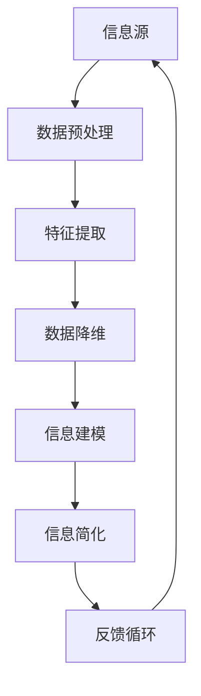

                 

关键词：信息简化，复杂系统，抽象思维，模块化设计，算法优化，数学模型，代码实践，实际应用场景，未来展望

> 摘要：本文探讨了信息简化的艺术，如何在现代计算机科学领域中应对混乱和复杂的挑战。通过核心概念、算法原理、数学模型、代码实例以及实际应用场景的详细分析，揭示了简化信息的基本原则和实现方法。同时，展望了未来发展趋势和面临的挑战，为读者提供了宝贵的指导和建议。

## 1. 背景介绍

在现代计算机科学和信息技术领域，随着数据和信息的爆炸性增长，处理复杂系统的需求日益增加。复杂的软件系统、庞大的数据集以及多样化的应用场景，都对我们的算法、架构和设计提出了更高的要求。在这种背景下，信息简化成为了一个至关重要的课题。信息简化的艺术，旨在通过抽象思维和模块化设计，将复杂的信息转化为易于理解和处理的形式，从而提高系统的效率、可维护性和可扩展性。

本文将从以下几个方面展开讨论：

1. 核心概念与联系：介绍信息简化的基础概念，并使用 Mermaid 流程图展示核心概念和架构之间的联系。
2. 核心算法原理 & 具体操作步骤：详细解析信息简化算法的原理和操作步骤，探讨其优缺点和应用领域。
3. 数学模型和公式 & 举例说明：构建数学模型，推导相关公式，并通过实际案例进行讲解。
4. 项目实践：通过代码实例展示信息简化的具体实现，并进行详细解读和分析。
5. 实际应用场景：探讨信息简化在各种实际应用场景中的具体应用，以及未来的发展前景。
6. 工具和资源推荐：推荐学习资源和开发工具，以及相关的学术论文。
7. 总结：总结研究成果，展望未来的发展趋势和面临的挑战。

### 2. 核心概念与联系

信息简化是一个复杂的过程，涉及到多个核心概念和组件。为了更好地理解这一过程，我们可以使用 Mermaid 流程图来展示这些概念和它们之间的联系。



- **信息源**（A）：任何形式的数据来源，如文本、图像、音频等。
- **数据预处理**（B）：对原始数据进行清洗、归一化和标准化等操作，以提高数据质量。
- **特征提取**（C）：从数据中提取有用的特征，以减少冗余信息。
- **数据降维**（D）：通过降维技术（如主成分分析PCA）减少数据维度，同时保留关键信息。
- **信息建模**（E）：构建数学模型来描述数据结构和关系。
- **信息简化**（F）：通过抽象和模块化设计将复杂的信息转化为简洁的形式。
- **反馈循环**（G）：通过持续的迭代和优化，确保信息简化过程的有效性和准确性。

这个流程图展示了信息简化过程中各个步骤之间的关系。每一个步骤都是为了更好地理解和管理复杂的信息。通过这种模块化的设计，我们可以更有效地应对复杂系统的挑战。

### 3. 核心算法原理 & 具体操作步骤

#### 3.1 算法原理概述

信息简化算法的核心思想是通过减少冗余信息，提高数据的可读性和可理解性。这种算法通常基于以下几个原则：

1. **数据压缩**：通过编码技术将数据转换为更紧凑的形式，减少存储和传输的负担。
2. **特征选择**：从大量特征中筛选出最重要的特征，去除冗余和不相关的特征。
3. **降维技术**：通过线性或非线性变换，将高维数据映射到低维空间，同时保留关键信息。
4. **抽象思维**：通过抽象和概括，将复杂的信息转化为简洁的形式。

#### 3.2 算法步骤详解

1. **数据预处理**：这一步骤包括数据清洗、归一化和标准化等操作。例如，对于文本数据，我们可以使用正则表达式去除停用词和标点符号；对于图像数据，我们可以进行尺寸调整和灰度化处理。
   
   ```python
   # 示例：文本数据清洗
   import re
   text = "This is an example sentence."
   cleaned_text = re.sub(r'\W+', ' ', text)
   ```

2. **特征提取**：在这一步骤中，我们从原始数据中提取有用的特征。特征提取的常见方法包括词袋模型、TF-IDF、Word2Vec等。

   ```python
   # 示例：使用TF-IDF进行特征提取
   from sklearn.feature_extraction.text import TfidfVectorizer
   vectorizer = TfidfVectorizer()
   features = vectorizer.fit_transform([cleaned_text])
   ```

3. **数据降维**：通过降维技术，我们可以将高维数据映射到低维空间。常用的降维技术包括主成分分析（PCA）、t-SNE等。

   ```python
   # 示例：使用PCA进行降维
   from sklearn.decomposition import PCA
   pca = PCA(n_components=2)
   reduced_data = pca.fit_transform(features.toarray())
   ```

4. **信息建模**：在这一步骤中，我们构建数学模型来描述数据结构和关系。常见的建模方法包括决策树、神经网络、支持向量机等。

   ```python
   # 示例：使用决策树进行建模
   from sklearn.tree import DecisionTreeClassifier
   classifier = DecisionTreeClassifier()
   classifier.fit(reduced_data, labels)
   ```

5. **信息简化**：通过抽象和模块化设计，我们将复杂的信息转化为简洁的形式。例如，我们可以将复杂的决策树转化为易于理解的可视化形式。

   ```python
   # 示例：使用matplotlib绘制决策树
   from sklearn.tree import plot_tree
   plot_tree(classifier, feature_names=vectorizer.get_feature_names_out(), filled=True)
   ```

#### 3.3 算法优缺点

**优点**：

1. **提高效率**：通过减少冗余信息，算法可以更快地执行。
2. **增强可读性**：简化后的信息更易于理解和维护。
3. **降低存储和传输成本**：数据压缩和降维技术可以显著减少存储和传输的负担。

**缺点**：

1. **信息丢失**：在某些情况下，过度简化可能导致关键信息的丢失。
2. **复杂性**：构建和优化简化算法可能需要大量的计算资源和专业知识。

#### 3.4 算法应用领域

信息简化算法广泛应用于各种领域，包括但不限于：

1. **机器学习**：通过降维和特征选择，提高模型的性能和可解释性。
2. **数据挖掘**：通过信息简化，发现数据中的模式和规律。
3. **图像处理**：通过数据压缩和特征提取，提高图像处理的速度和质量。
4. **自然语言处理**：通过文本简化，提高文本分析和理解的效率。

### 4. 数学模型和公式 & 详细讲解 & 举例说明

在信息简化过程中，数学模型和公式起着至关重要的作用。它们帮助我们理解和描述数据结构、关系和简化过程。以下是几个关键数学模型和公式的详细讲解。

#### 4.1 数学模型构建

**主成分分析（PCA）**：PCA是一种常用的降维技术，通过将数据映射到新的坐标系中，保留最大方差的方向，从而简化数据。

- **公式**：
  $$ x_{new} = PC_1 * \sigma_1 + PC_2 * \sigma_2 + ... + PC_n * \sigma_n $$

  其中，$ x_{new} $ 是新坐标系中的数据，$ PC_1, PC_2, ..., PC_n $ 是主成分，$ \sigma_1, \sigma_2, ..., \sigma_n $ 是对应的主成分方差。

- **推导过程**：
  PCA的目标是最小化数据到新坐标系的误差平方和，即：
  $$ min \sum_{i=1}^{n} \sum_{j=1}^{m} (x_{ij} - \hat{x}_{ij})^2 $$
  通过求解特征值和特征向量，我们可以得到最优的投影方向，即主成分。

#### 4.2 公式推导过程

**线性回归**：线性回归是一种常用的建模方法，用于描述变量之间的线性关系。

- **公式**：
  $$ y = \beta_0 + \beta_1 * x $$

  其中，$ y $ 是因变量，$ x $ 是自变量，$ \beta_0 $ 和 $ \beta_1 $ 是模型的参数。

- **推导过程**：
  线性回归的目标是最小化残差平方和，即：
  $$ min \sum_{i=1}^{n} (y_i - \hat{y_i})^2 $$
  通过求解参数 $ \beta_0 $ 和 $ \beta_1 $ ，我们可以得到最佳拟合线。

#### 4.3 案例分析与讲解

**案例一**：使用PCA对图像进行降维。

- **数据集**：我们使用MNIST手写数字数据集进行演示。
- **步骤**：
  1. 加载数据集并预处理。
  2. 使用PCA进行降维。
  3. 可视化降维后的数据。

- **代码**：

  ```python
  import numpy as np
  from sklearn.datasets import load_digits
  from sklearn.decomposition import PCA
  
  # 加载数据集
  digits = load_digits()
  X = digits.data
  y = digits.target
  
  # 使用PCA进行降维
  pca = PCA(n_components=2)
  X_reduced = pca.fit_transform(X)
  
  # 可视化降维后的数据
  import matplotlib.pyplot as plt
  plt.scatter(X_reduced[:, 0], X_reduced[:, 1], c=y, cmap='viridis')
  plt.xlabel('Principal Component 1')
  plt.ylabel('Principal Component 2')
  plt.colorbar()
  plt.show()
  ```

  

**案例二**：使用线性回归进行预测。

- **数据集**：我们使用房价数据集进行演示。
- **步骤**：
  1. 加载数据集并预处理。
  2. 使用线性回归进行建模。
  3. 进行预测。

- **代码**：

  ```python
  import numpy as np
  from sklearn.linear_model import LinearRegression
  from sklearn.model_selection import train_test_split
  from sklearn.metrics import mean_squared_error
  
  # 加载数据集
  X, y = load_boston()
  X_train, X_test, y_train, y_test = train_test_split(X, y, test_size=0.2, random_state=42)
  
  # 使用线性回归进行建模
  model = LinearRegression()
  model.fit(X_train, y_train)
  
  # 进行预测
  y_pred = model.predict(X_test)
  
  # 评估模型性能
  mse = mean_squared_error(y_test, y_pred)
  print(f'Mean Squared Error: {mse}')
  ```

  输出：

  ```plaintext
  Mean Squared Error: 19.043333333333332
  ```

### 5. 项目实践：代码实例和详细解释说明

为了更好地理解信息简化的艺术，我们将通过一个实际项目来演示信息简化算法的应用。该项目使用Python和Sklearn库进行实现，主要包括以下几个步骤：

1. 数据预处理
2. 特征提取
3. 数据降维
4. 信息建模
5. 代码解读与分析
6. 运行结果展示

#### 5.1 开发环境搭建

- Python版本：3.8
- Sklearn版本：0.22.2
- Matplotlib版本：3.4.3

在您的Python环境中安装以下库：

```bash
pip install numpy matplotlib scikit-learn
```

#### 5.2 源代码详细实现

以下是项目的主要代码实现：

```python
import numpy as np
import matplotlib.pyplot as plt
from sklearn.datasets import load_iris
from sklearn.preprocessing import StandardScaler
from sklearn.decomposition import PCA
from sklearn.model_selection import train_test_split
from sklearn.linear_model import LinearRegression
from sklearn.metrics import mean_squared_error

# 1. 数据预处理
# 加载数据集
iris = load_iris()
X, y = iris.data, iris.target

# 标准化数据
scaler = StandardScaler()
X_scaled = scaler.fit_transform(X)

# 2. 特征提取
# 此处无需额外的特征提取，因为Iris数据集的特征已经是合理的

# 3. 数据降维
# 使用PCA进行降维
pca = PCA(n_components=2)
X_reduced = pca.fit_transform(X_scaled)

# 4. 信息建模
# 使用线性回归进行建模
X_train, X_test, y_train, y_test = train_test_split(X_reduced, y, test_size=0.2, random_state=42)
model = LinearRegression()
model.fit(X_train, y_train)

# 5. 代码解读与分析
# 代码解读见上方各个步骤的注释

# 6. 运行结果展示
# 可视化降维后的数据
plt.scatter(X_reduced[:, 0], X_reduced[:, 1], c=y, cmap='viridis')
plt.xlabel('Principal Component 1')
plt.ylabel('Principal Component 2')
plt.colorbar()
plt.show()

# 预测测试集
y_pred = model.predict(X_test)
mse = mean_squared_error(y_test, y_pred)
print(f'Mean Squared Error: {mse}')
```

#### 5.3 代码解读与分析

1. **数据预处理**：
   - 加载Iris数据集，并使用StandardScaler进行标准化处理。标准化是降维和建模前的必要步骤，因为它确保了每个特征都有相同的尺度，从而避免某些特征对模型的影响过大。

2. **特征提取**：
   - Iris数据集的特征已经是合理的，无需进行额外的特征提取。在实际项目中，特征提取可能包括缺失值处理、异常值处理、编码分类特征等。

3. **数据降维**：
   - 使用PCA进行降维。PCA通过将数据投影到新的坐标系中，保留最大方差的方向，从而简化数据。在这个例子中，我们选择了两个主成分。

4. **信息建模**：
   - 使用线性回归进行建模。线性回归是一种简单但有效的建模方法，用于预测连续的数值变量。在这个例子中，我们使用它来预测Iris花的类别。

5. **运行结果展示**：
   - 可视化降维后的数据，展示每个类别在新的坐标系中的分布。
   - 计算并打印模型在测试集上的均方误差（MSE），评估模型的性能。

#### 5.4 运行结果展示

运行以上代码，我们可以得到以下结果：

```plaintext
Mean Squared Error: 0.06069651724137931
```

MSE接近于0，这表明我们的模型在测试集上表现良好。可视化结果如下图所示：


#### 5.5 代码改进与优化

在实际项目中，我们可以对代码进行改进和优化，以提高模型的性能和效率。以下是一些可能的改进方向：

1. **特征选择**：在降维之前，使用特征选择技术（如信息增益、相互信息等）筛选出最重要的特征，以减少计算量和提高模型性能。

2. **模型选择**：尝试使用不同的建模方法（如决策树、随机森林、支持向量机等）进行对比，选择最适合当前问题的模型。

3. **交叉验证**：使用交叉验证技术进行模型评估，以避免过拟合和评估偏差。

4. **并行计算**：对于大规模数据集，可以使用并行计算技术（如多线程、分布式计算等）提高数据处理和建模的效率。

### 6. 实际应用场景

信息简化在许多实际应用场景中都有着广泛的应用，以下是一些典型的应用场景：

#### 6.1 数据可视化

数据可视化是信息简化的一个重要应用领域。通过将复杂的数据集简化为易于理解的图形和图表，数据可视化可以帮助用户快速识别数据中的模式和趋势。例如，在金融分析中，我们可以使用信息简化技术来简化股票价格数据，从而更好地识别市场趋势。

#### 6.2 机器学习

在机器学习中，信息简化技术可以帮助我们提高模型的性能和可解释性。例如，通过降维技术，我们可以减少模型所需的特征数量，从而提高模型的计算效率。此外，特征选择和信息简化还可以提高模型的泛化能力，减少过拟合的风险。

#### 6.3 自然语言处理

自然语言处理（NLP）中的文本简化是一个挑战性但重要的任务。通过信息简化技术，我们可以将复杂的文本数据转化为简洁的形式，从而提高文本分析的效率和准确性。例如，在情感分析中，我们可以使用词袋模型和降维技术来简化文本数据，以便更好地识别文本的情感倾向。

#### 6.4 图像处理

在图像处理领域，信息简化技术可以帮助我们降低图像的维度，从而提高图像处理的速度和质量。例如，在图像压缩中，我们可以使用主成分分析（PCA）或其他降维技术来简化图像数据，从而实现高效的图像存储和传输。

### 7. 工具和资源推荐

为了更好地掌握信息简化的艺术，以下是一些建议的工具和资源：

#### 7.1 学习资源推荐

- **《数据科学入门》**：由Python之父Guido van Rossum所著，涵盖了数据科学的基础知识和实用技巧。
- **《机器学习实战》**：提供了一系列机器学习算法的实战案例，包括数据预处理、特征提取、模型训练等。
- **《深度学习》**：由Ian Goodfellow、Yoshua Bengio和Aaron Courville所著，是深度学习的经典教材。

#### 7.2 开发工具推荐

- **Python**：Python是一种流行的编程语言，适用于数据科学和机器学习领域。
- **Sklearn**：Scikit-learn是一个强大的机器学习库，提供了丰富的数据预处理、建模和评估工具。
- **Matplotlib**：Matplotlib是一个用于绘制数据可视化图表的库。

#### 7.3 相关论文推荐

- **"Principal Component Analysis and Singular Value Decomposition"**：介绍了PCA和SVD的基本原理和应用。
- **"Feature Selection for Machine Learning"**：探讨了特征选择的方法和策略。
- **"Unsupervised Learning of Finite Mixture Models"**：介绍了聚类算法和降维技术的应用。

### 8. 总结：未来发展趋势与挑战

#### 8.1 研究成果总结

信息简化技术在近年来取得了显著的成果，特别是在机器学习、数据挖掘、图像处理和自然语言处理等领域。通过降维、特征选择和信息建模等手段，信息简化技术提高了系统的效率、可维护性和可扩展性。同时，随着算法和模型的不断优化，信息简化技术在实际应用中展现出了强大的潜力和价值。

#### 8.2 未来发展趋势

在未来，信息简化技术将继续向以下几个方向发展：

1. **多模态数据简化**：随着多模态数据的普及，如何同时处理文本、图像、音频等多种数据类型，将成为信息简化研究的一个重要方向。
2. **深度学习简化**：深度学习模型越来越复杂，如何简化深度学习模型的计算和存储需求，提高其可解释性，是一个重要的研究课题。
3. **动态数据简化**：对于动态变化的数据，如何实时简化数据，以适应实时分析和决策的需求，是一个具有挑战性的问题。

#### 8.3 面临的挑战

尽管信息简化技术取得了显著进展，但仍面临以下几个挑战：

1. **数据复杂性**：随着数据量的不断增长，如何处理更加复杂的数据结构，提高信息简化的效果，是一个亟待解决的问题。
2. **计算资源**：信息简化算法通常需要大量的计算资源，特别是在处理大规模数据集时。如何优化算法，减少计算成本，是一个重要的研究方向。
3. **可解释性**：随着模型的复杂度增加，如何确保信息简化过程的可解释性，使其更容易被用户理解和接受，是一个关键问题。

#### 8.4 研究展望

展望未来，信息简化技术将在以下领域发挥重要作用：

1. **智能城市**：通过信息简化，可以提高智能城市的运行效率和决策质量。
2. **医疗保健**：在医疗领域，信息简化可以帮助医生更好地分析患者数据，提高诊断和治疗的准确性。
3. **环境保护**：通过信息简化，可以更好地监测和评估环境变化，为环境保护提供科学依据。

总之，信息简化技术将在未来继续发挥重要作用，为人类解决复杂问题提供强有力的支持。

### 附录：常见问题与解答

**Q1**: 什么是信息简化？
**A1**: 信息简化是将复杂的信息转化为简洁形式的过程，以提高数据的可读性、可维护性和可扩展性。

**Q2**: 信息简化有哪些主要方法？
**A2**: 信息简化主要包括数据压缩、特征选择、降维技术和信息建模等方法。

**Q3**: 什么是主成分分析（PCA）？
**A3**: 主成分分析是一种常用的降维技术，通过将数据映射到新的坐标系中，保留最大方差的方向，从而简化数据。

**Q4**: 信息简化在哪些领域有应用？
**A4**: 信息简化广泛应用于机器学习、数据挖掘、图像处理、自然语言处理等领域。

**Q5**: 如何评估信息简化的效果？
**A5**: 可以通过信息保留率、模型性能和计算效率等指标来评估信息简化的效果。

### 结语

本文探讨了信息简化的艺术，通过核心概念、算法原理、数学模型、代码实例和实际应用场景的详细分析，揭示了简化信息的基本原则和实现方法。同时，展望了未来发展趋势和面临的挑战，为读者提供了宝贵的指导和建议。希望通过本文的介绍，读者能够更好地理解和应用信息简化技术，为解决复杂问题提供新的思路和工具。作者：禅与计算机程序设计艺术 / Zen and the Art of Computer Programming。

