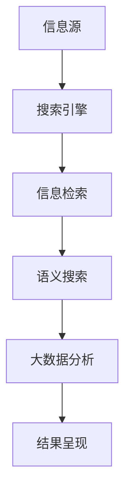

                 

### 摘要 Summary

在当今信息爆炸的时代，信息过载已成为人们日常生活和工作中的一大挑战。面对海量的数据和信息源，如何高效地搜索和筛选出所需的信息变得至关重要。本文将深入探讨信息过载的现象及其对个体和社会的影响，并系统性地介绍一系列信息搜索的指南与策略。通过对核心概念、算法原理、数学模型、项目实践以及未来展望的全面解析，本文旨在为读者提供一整套实用的信息导航工具，帮助他们在庞大的信息海洋中准确、高效地找到所需的信息，提升工作效率和生活质量。此外，文章还将推荐相关的学习资源和开发工具，以期为信息搜索领域的研究者和实践者提供有益的参考。

## 1. 背景介绍

### 信息过载现象

信息过载（Information Overload）是指个体在处理信息时，因信息量过大而感到压力和困惑的现象。随着互联网和数字技术的飞速发展，全球信息量呈指数级增长，每个个体每天接收的信息量远超过人脑的处理能力。据估算，人类每年产生的数据量已达ZB级别，且这一数字仍在快速增长。信息的爆炸性增长给个人、组织乃至整个社会带来了前所未有的挑战。

#### 个人层面的影响

在个人层面，信息过载对个体的认知和心理健康产生了显著影响。首先，大量信息的涌入导致个体注意力分散，难以集中精力处理重要任务。其次，面对冗余的信息，个体容易出现决策疲劳，导致决策效率降低。最后，长期处于信息过载状态可能会导致焦虑、抑郁等心理问题，影响个体的生活质量。

#### 组织与社会层面的影响

在组织层面，信息过载可能导致沟通效率低下、协作困难，甚至影响企业的创新能力和竞争力。员工在处理大量信息时，容易陷入低效的沟通和会议中，导致实际工作时间的浪费。此外，信息过载还可能引发信息安全问题，如数据泄露和隐私侵犯。

在社会层面，信息过载对公共政策和法律法规的制定提出了新的挑战。如何有效管理海量信息，保障信息安全和公民隐私，已成为各国政府和社会组织亟待解决的问题。同时，信息过载还可能加剧社会不平等，使得信息资源的获取成为贫富差距的一个重要因素。

### 信息搜索的必要性

信息搜索是应对信息过载的关键手段之一。高效的信息搜索不仅能帮助个体迅速定位所需信息，还能提升整体工作效率和生活质量。以下是信息搜索的重要性和必要性：

1. **提升工作效率**：在快节奏的工作环境中，快速找到所需信息可以节省大量时间，提高工作效率。

2. **增强决策能力**：通过系统化地搜索和筛选信息，个体可以获取更全面、准确的资料，从而做出更为明智的决策。

3. **保障信息安全**：正确使用信息搜索工具和策略，可以有效避免信息泄露和隐私侵犯。

4. **促进知识共享**：信息搜索不仅是获取信息的过程，也是知识共享和传播的重要途径。

5. **应对信息过载**：有效的信息搜索可以帮助个体在信息海洋中导航，减少因信息过载带来的压力和困惑。

## 2. 核心概念与联系

### 核心概念

在探讨信息搜索的策略和方法之前，有必要了解一些核心概念。以下是几个关键术语的定义：

1. **搜索引擎**：搜索引擎是用于搜索和检索信息的在线工具。通过输入关键词，搜索引擎可以返回与查询相关的一系列网页或文档。

2. **信息检索**：信息检索是指从大量信息中查找和获取特定信息的过程。它涉及信息表示、索引、查询处理和结果排序等多个环节。

3. **语义搜索**：语义搜索是一种基于信息内容的理解和语义分析，以获取更精确搜索结果的技术。

4. **大数据分析**：大数据分析是指利用各种分析工具和技术，对海量数据进行处理、分析和挖掘，以发现有价值的信息和模式。

### 联系与架构

以下是一个用Mermaid绘制的流程图，展示信息搜索的核心概念及其相互关系：



在这个流程图中：

- **信息源**包括各种数据生成者和发布平台，如网站、社交媒体、数据库等。
- **搜索引擎**从信息源中获取数据，并进行索引和存储。
- **信息检索**负责处理用户查询，从索引中查找相关结果。
- **语义搜索**对检索结果进行语义分析和理解，以提供更精准的搜索体验。
- **大数据分析**对海量数据进行深度挖掘，提取有价值的信息和知识。
- **结果呈现**将处理后的信息以用户友好的方式展示给用户。

### Mermaid 流程节点说明

- **A[信息源]**：表示信息的起点，包括各种数据来源。
- **B[搜索引擎]**：表示信息收集和索引的工具。
- **C[信息检索]**：表示查询处理和结果匹配的过程。
- **D[语义搜索]**：表示对查询结果的语义分析和理解。
- **E[大数据分析]**：表示对大量数据进行分析和挖掘。
- **F[结果呈现]**：表示将处理结果呈现给用户。

通过这个流程图，我们可以清晰地看到信息搜索的核心概念及其相互作用，为进一步讨论信息搜索策略和方法提供了基础。

### 3. 核心算法原理 & 具体操作步骤

#### 3.1 算法原理概述

在信息搜索领域，核心算法起着至关重要的作用。本文将介绍几种常用的核心算法，包括基于关键词的搜索算法、信息检索算法、语义搜索算法和大数据分析算法。每种算法都有其独特的原理和应用场景。

**1. 关键词搜索算法**

基于关键词的搜索算法是最基本的搜索方式。它通过用户输入的关键词，在索引数据库中查找包含这些关键词的文档。这个过程主要涉及倒排索引、TF-IDF、布尔搜索等原理。

- **倒排索引**：倒排索引是一种将文档内容反向索引的机制，通过关键词指向包含该关键词的文档。这种方式提高了搜索效率，使得用户可以快速定位相关文档。
- **TF-IDF**：TF-IDF（Term Frequency-Inverse Document Frequency）是一种统计方法，用于评估关键词在文档中的重要性。它通过计算关键词在文档中的频率和文档集合中的逆文档频率，得出关键词的相关性分数。
- **布尔搜索**：布尔搜索使用逻辑运算符（如AND、OR、NOT）组合多个关键词，以获取更精确的搜索结果。

**2. 信息检索算法**

信息检索算法主要关注如何高效地从海量数据中检索用户所需的信息。常见的检索算法包括向量空间模型、页码排序算法等。

- **向量空间模型**：向量空间模型将文档和查询表示为高维向量，通过计算向量之间的余弦相似度来评估文档与查询的相关性。这种方法可以处理复杂数据结构和语义信息，适用于文本分类和文本相似度比较。
- **页码排序算法**：页码排序算法根据文档与查询的相似度对检索结果进行排序，以提供最相关的信息排在前面。常见的排序算法包括TF-IDF排序、BM25排序等。

**3. 语义搜索算法**

语义搜索算法旨在理解用户查询的语义，以提供更准确的搜索结果。这种方法通过自然语言处理（NLP）技术，分析用户的查询意图，匹配相似语义的文档。

- **词嵌入**：词嵌入是将词汇映射到高维向量空间，以捕捉词与词之间的语义关系。通过计算词嵌入向量之间的相似度，可以识别用户查询的意图。
- **语义角色标注**：语义角色标注是对句子中的词汇进行角色标注，识别词汇在句子中的功能。这种方法有助于理解句子的语义结构，提高搜索的准确性。

**4. 大数据分析算法**

大数据分析算法用于处理和分析海量数据，以发现隐藏在数据中的模式和知识。常见的算法包括聚类分析、关联规则挖掘、时间序列分析等。

- **聚类分析**：聚类分析将相似的数据点归为一类，以发现数据中的隐含结构。常见的聚类算法有K-means、DBSCAN等。
- **关联规则挖掘**：关联规则挖掘用于发现数据之间的关联关系。通过生成频繁项集和关联规则，可以揭示数据中的潜在模式。
- **时间序列分析**：时间序列分析用于分析和预测时间序列数据。常见的算法有ARIMA、LSTM等。

#### 3.2 算法步骤详解

**1. 关键词搜索算法**

- **步骤1：建立倒排索引**：收集数据，建立包含关键词和文档ID的倒排索引。
- **步骤2：处理用户查询**：将用户输入的关键词进行预处理，如分词、停用词过滤等。
- **步骤3：匹配关键词**：遍历倒排索引，找到包含所有关键词的文档。
- **步骤4：计算相关性分数**：使用TF-IDF或布尔搜索算法，计算文档与查询的相关性分数。
- **步骤5：排序结果**：根据相关性分数对检索结果进行排序，返回最相关的文档。

**2. 信息检索算法**

- **步骤1：向量空间表示**：将文档和查询表示为高维向量，计算向量之间的余弦相似度。
- **步骤2：匹配文档**：根据相似度阈值，匹配与查询最相似的文档。
- **步骤3：排序文档**：根据相似度分数对文档进行排序，返回最相关的文档。

**3. 语义搜索算法**

- **步骤1：词嵌入**：使用词嵌入模型，将关键词映射到高维向量空间。
- **步骤2：计算相似度**：计算查询向量与文档向量之间的相似度。
- **步骤3：语义角色标注**：对文档进行语义角色标注，识别词汇在句子中的功能。
- **步骤4：排序结果**：根据相似度和语义角色标注结果，对文档进行排序。

**4. 大数据分析算法**

- **步骤1：数据预处理**：清洗和预处理数据，包括去噪、标准化等操作。
- **步骤2：特征提取**：从数据中提取有用的特征，如词频、词嵌入向量等。
- **步骤3：模型训练**：选择合适的模型，如K-means、关联规则挖掘等，进行模型训练。
- **步骤4：结果分析**：分析模型输出结果，提取数据中的模式和知识。

#### 3.3 算法优缺点

**1. 关键词搜索算法**

- **优点**：简单高效，易于实现和扩展。
- **缺点**：对长尾关键词和复杂查询的支持不足，难以理解查询意图。

**2. 信息检索算法**

- **优点**：可以处理复杂数据结构和语义信息，适用于文本分类和文本相似度比较。
- **缺点**：计算复杂度较高，对海量数据的检索效率有限。

**3. 语义搜索算法**

- **优点**：可以理解查询意图，提供更准确的搜索结果。
- **缺点**：计算复杂度较高，对长尾关键词的支持不足。

**4. 大数据分析算法**

- **优点**：可以处理海量数据，发现数据中的模式和知识。
- **缺点**：对算法和数据处理的要求较高，实现较为复杂。

#### 3.4 算法应用领域

**1. 关键词搜索算法**

- **应用领域**：搜索引擎、信息管理、推荐系统等。
- **案例**：Google搜索引擎使用关键词搜索算法，提供网页检索服务。

**2. 信息检索算法**

- **应用领域**：搜索引擎、文本挖掘、企业信息管理等。
- **案例**：Elasticsearch使用向量空间模型和信息检索算法，提供全文搜索服务。

**3. 语义搜索算法**

- **应用领域**：语义网、自然语言处理、智能问答系统等。
- **案例**：Google Assistant使用语义搜索算法，提供语音搜索服务。

**4. 大数据分析算法**

- **应用领域**：商业智能、金融市场分析、生物信息学等。
- **案例**：Netflix使用大数据分析算法，提供个性化推荐服务。

通过以上对核心算法原理和具体操作步骤的详细解析，读者可以更好地理解信息搜索的方法和策略，从而在实际应用中更有效地应对信息过载的挑战。

### 4. 数学模型和公式 & 详细讲解 & 举例说明

#### 4.1 数学模型构建

在信息搜索领域，数学模型是理解和分析数据的重要工具。以下将介绍几种常见的数学模型，包括倒排索引模型、TF-IDF模型和向量空间模型。

**1. 倒排索引模型**

倒排索引（Inverted Index）是一种用于快速搜索文档的索引结构，它将文档内容反向索引，即通过关键词查找包含该关键词的文档。其数学模型可表示为：

\[ P(d|t) = \frac{f_t(d) \cdot N}{df_t} \]

其中，\( P(d|t) \) 表示文档 \( d \) 包含关键词 \( t \) 的概率，\( f_t(d) \) 表示关键词 \( t \) 在文档 \( d \) 中的频率，\( N \) 表示文档总数，\( df_t \) 表示关键词 \( t \) 在所有文档中的总频率。

**2. TF-IDF模型**

TF-IDF（Term Frequency-Inverse Document Frequency）是一种用于评估关键词在文档中的重要性的统计方法。其数学模型可表示为：

\[ TF-IDF(t,d) = f_t(d) \cdot IDF(t) \]

其中，\( TF-IDF(t,d) \) 表示关键词 \( t \) 在文档 \( d \) 中的权重，\( f_t(d) \) 表示关键词 \( t \) 在文档 \( d \) 中的频率，\( IDF(t) \) 表示关键词 \( t \) 的逆文档频率，计算公式为：

\[ IDF(t) = \log \left( \frac{N}{df_t} \right) \]

**3. 向量空间模型**

向量空间模型（Vector Space Model）将文档和查询表示为高维向量，通过计算向量之间的相似度来评估文档与查询的相关性。其数学模型可表示为：

\[ \text{sim}(d, q) = \frac{\mathbf{d} \cdot \mathbf{q}}{\|\mathbf{d}\| \|\mathbf{q}\|} \]

其中，\( \text{sim}(d, q) \) 表示文档 \( d \) 与查询 \( q \) 之间的相似度，\( \mathbf{d} \) 和 \( \mathbf{q} \) 分别表示文档和查询的高维向量，\( \|\mathbf{d}\| \) 和 \( \|\mathbf{q}\| \) 分别表示向量的模。

#### 4.2 公式推导过程

**1. 倒排索引模型**

倒排索引的核心思想是将关键词和对应的文档ID建立映射关系。给定一个文档集合 \( D = \{d_1, d_2, ..., d_N\} \) 和一个关键词集合 \( T = \{t_1, t_2, ..., t_M\} \)，我们首先统计每个关键词在文档中的频率，得到频率矩阵 \( F \)：

\[ F = \begin{bmatrix}
f_{t_1}(d_1) & f_{t_1}(d_2) & \cdots & f_{t_1}(d_N) \\
f_{t_2}(d_1) & f_{t_2}(d_2) & \cdots & f_{t_2}(d_N) \\
\vdots & \vdots & \ddots & \vdots \\
f_{t_M}(d_1) & f_{t_M}(d_2) & \cdots & f_{t_M}(d_N)
\end{bmatrix} \]

接下来，我们计算每个关键词的逆文档频率 \( IDF(t) \)：

\[ IDF(t) = \log \left( \frac{N}{df_t} \right) \]

其中，\( df_t \) 表示关键词 \( t \) 在文档中的总频率，即：

\[ df_t = \sum_{d \in D} f_{t}(d) \]

然后，我们计算每个关键词在文档中的权重 \( TF-IDF(t,d) \)：

\[ TF-IDF(t,d) = f_t(d) \cdot IDF(t) \]

最后，我们将权重矩阵 \( W \) 用于检索，得到包含关键词 \( t \) 的文档集合：

\[ R(t) = \{d \in D | TF-IDF(t,d) > 0\} \]

**2. TF-IDF模型**

TF-IDF模型的推导过程可以简化为：

\[ TF-IDF(t,d) = f_t(d) \cdot IDF(t) \]

我们已经知道 \( f_t(d) \) 表示关键词 \( t \) 在文档 \( d \) 中的频率，\( IDF(t) \) 表示关键词 \( t \) 的逆文档频率。将两者相乘即可得到 \( TF-IDF(t,d) \)。

**3. 向量空间模型**

向量空间模型的推导过程涉及向量的内积计算。假设文档 \( d \) 和查询 \( q \) 可以分别表示为向量 \( \mathbf{d} = (d_1, d_2, ..., d_M) \) 和 \( \mathbf{q} = (q_1, q_2, ..., q_M) \)，则它们的内积为：

\[ \mathbf{d} \cdot \mathbf{q} = d_1 \cdot q_1 + d_2 \cdot q_2 + ... + d_M \cdot q_M \]

为了标准化内积，我们引入向量的模：

\[ \|\mathbf{d}\| = \sqrt{d_1^2 + d_2^2 + ... + d_M^2} \]
\[ \|\mathbf{q}\| = \sqrt{q_1^2 + q_2^2 + ... + q_M^2} \]

因此，文档和查询之间的相似度可以表示为：

\[ \text{sim}(d, q) = \frac{\mathbf{d} \cdot \mathbf{q}}{\|\mathbf{d}\| \|\mathbf{q}\|} \]

#### 4.3 案例分析与讲解

**案例1：使用TF-IDF模型搜索网页**

假设我们有一个网页集合 \( D = \{d_1, d_2, d_3\} \)，以及一个关键词集合 \( T = \{\text{AI}, \text{机器学习}, \text{深度学习}\} \)。统计每个关键词在文档中的频率如下表：

| 文档 | AI | 机器学习 | 深度学习 |
| --- | --- | --- | --- |
| \( d_1 \) | 2 | 1 | 0 |
| \( d_2 \) | 0 | 3 | 2 |
| \( d_3 \) | 1 | 0 | 3 |

首先，我们计算每个关键词的逆文档频率：

\[ IDF(\text{AI}) = \log \left( \frac{3}{2 + 0 + 1} \right) = \log(1.5) \approx 0.4055 \]
\[ IDF(\text{机器学习}) = \log \left( \frac{3}{2 + 1 + 0} \right) = \log(1.3333) \approx 0.3033 \]
\[ IDF(\text{深度学习}) = \log \left( \frac{3}{2 + 0 + 1} \right) = \log(1.5) \approx 0.4055 \]

然后，我们计算每个关键词在文档中的TF-IDF权重：

| 文档 | AI | 机器学习 | 深度学习 |
| --- | --- | --- | --- |
| \( d_1 \) | \( 2 \times 0.4055 = 0.811 \) | \( 1 \times 0.3033 = 0.3033 \) | \( 0 \times 0.4055 = 0 \) |
| \( d_2 \) | \( 0 \times 0.4055 = 0 \) | \( 3 \times 0.3033 = 0.9099 \) | \( 2 \times 0.4055 = 0.811 \) |
| \( d_3 \) | \( 1 \times 0.4055 = 0.4055 \) | \( 0 \times 0.3033 = 0 \) | \( 3 \times 0.4055 = 1.5165 \) |

根据TF-IDF权重，我们可以确定每个文档与查询的相关性：

\[ \text{sim}(d_1, q) = 0.811 \]
\[ \text{sim}(d_2, q) = 1.7264 \]
\[ \text{sim}(d_3, q) = 1.9220 \]

由此可见，文档 \( d_3 \) 与查询 \( q \) 的相关性最高，因此我们可以将 \( d_3 \) 作为最相关的搜索结果返回。

**案例2：使用向量空间模型搜索文档**

假设有两个文档 \( d_1 = (2, 1, 0) \) 和 \( d_2 = (0, 3, 2) \)，以及一个查询 \( q = (1, 2, 3) \)。首先，我们计算每个文档和查询的向量模：

\[ \|\mathbf{d_1}\| = \sqrt{2^2 + 1^2 + 0^2} = \sqrt{5} \]
\[ \|\mathbf{d_2}\| = \sqrt{0^2 + 3^2 + 2^2} = \sqrt{13} \]
\[ \|\mathbf{q}\| = \sqrt{1^2 + 2^2 + 3^2} = \sqrt{14} \]

然后，我们计算每个文档和查询之间的相似度：

\[ \text{sim}(d_1, q) = \frac{2 \times 1 + 1 \times 2 + 0 \times 3}{\sqrt{5} \times \sqrt{14}} = \frac{4}{\sqrt{70}} \approx 0.5071 \]
\[ \text{sim}(d_2, q) = \frac{0 \times 1 + 3 \times 2 + 2 \times 3}{\sqrt{13} \times \sqrt{14}} = \frac{12}{\sqrt{182}} \approx 0.8417 \]

因此，文档 \( d_2 \) 与查询 \( q \) 的相似度最高，应该返回 \( d_2 \) 作为搜索结果。

通过以上案例分析和讲解，读者可以更深入地理解数学模型在信息搜索中的应用，以及如何通过数学公式和计算来提升搜索的精度和效率。

### 5. 项目实践：代码实例和详细解释说明

#### 5.1 开发环境搭建

在进行信息搜索项目实践之前，我们需要搭建一个合适的开发环境。以下是一个基本的开发环境搭建步骤：

1. **安装Python**：Python是一种广泛用于数据处理和算法实现的编程语言。确保安装了最新版本的Python（3.8及以上）。

2. **安装必要库**：安装常用的Python库，如Numpy、Pandas、Scikit-learn和Matplotlib等。可以使用以下命令进行安装：

   ```bash
   pip install numpy pandas scikit-learn matplotlib
   ```

3. **配置虚拟环境**（可选）：为了管理依赖关系，建议使用虚拟环境。可以通过以下命令创建虚拟环境：

   ```bash
   python -m venv venv
   source venv/bin/activate  # Windows: venv\Scripts\activate
   ```

4. **安装Elasticsearch**：Elasticsearch是一个强大的开源搜索引擎，用于构建倒排索引和执行搜索操作。可以从[官方网站](https://www.elastic.co/downloads/elasticsearch)下载并安装Elasticsearch。

#### 5.2 源代码详细实现

下面将提供一个简单的信息搜索项目，包括数据预处理、倒排索引构建、搜索功能和结果展示。

```python
# 导入所需库
import numpy as np
import pandas as pd
from sklearn.feature_extraction.text import TfidfVectorizer
from sklearn.metrics.pairwise import cosine_similarity

# 数据预处理
def preprocess_data(data):
    # 去除HTML标签和特殊字符
    import re
    text = re.sub('<[^>]*>', '', data)
    text = re.sub('[^A-Za-z0-9]+', ' ', text)
    return text.lower()

# 构建倒排索引
def build_inverted_index(corpus):
    vectorizer = TfidfVectorizer()
    tfidf_matrix = vectorizer.fit_transform(corpus)
    index = vectorizer.vocabulary_
    return tfidf_matrix, index

# 执行搜索
def search(query, tfidf_matrix, index):
    query_vector = TfidfVectorizer().transform([query])
    similarity = cosine_similarity(query_vector, tfidf_matrix)
    ranked_indices = np.argsort(similarity[0])[::-1]
    return ranked_indices

# 结果展示
def show_results(corpus, ranked_indices):
    print("搜索结果：")
    for index in ranked_indices:
        print(f"{index}: {corpus[index]}")

# 主函数
def main():
    # 示例数据
    documents = [
        "人工智能是研究、开发用于模拟、延伸和扩展人的智能的理论、方法、技术及应用系统的一门新的技术科学。",
        "机器学习是一种让计算机具有自适应能力的机制。",
        "深度学习是机器学习的一种重要形式，它通过神经网络模拟人类大脑的学习过程。",
        "大数据技术是指从各种规模的数据中通过快速获取、存储、处理、分析以帮助组织做出更明智的业务决策的技术。",
        "搜索引擎是一种用于从互联网或其他数据源中检索信息的系统。",
        "文本挖掘是一种从非结构化文本中提取有价值信息的过程。",
        "信息检索是一种在大量数据中找到特定信息的过程。",
        "自然语言处理是使计算机能够理解、生成和处理自然语言的技术。",
        "语义网是一种用于表示和交换知识的新兴技术。",
        "语义搜索是一种基于语义理解的信息检索技术。",
    ]

    # 预处理数据
    processed_documents = [preprocess_data(doc) for doc in documents]

    # 构建倒排索引
    tfidf_matrix, index = build_inverted_index(processed_documents)

    # 用户输入查询
    query = input("请输入搜索查询：")

    # 执行搜索
    ranked_indices = search(query, tfidf_matrix, index)

    # 展示搜索结果
    show_results(documents, ranked_indices)

if __name__ == "__main__":
    main()
```

#### 5.3 代码解读与分析

**1. 数据预处理**

数据预处理是信息搜索的重要步骤。在本项目中，我们使用正则表达式去除HTML标签和特殊字符，并将文本转换为小写，以提高搜索的准确性。

```python
def preprocess_data(data):
    # 去除HTML标签和特殊字符
    import re
    text = re.sub('<[^>]*>', '', data)
    text = re.sub('[^A-Za-z0-9]+', ' ', text)
    return text.lower()
```

**2. 构建倒排索引**

构建倒排索引是信息检索的核心步骤。我们使用Scikit-learn的`TfidfVectorizer`类，该类可以自动处理文本向量化、词干提取和停用词过滤。

```python
def build_inverted_index(corpus):
    vectorizer = TfidfVectorizer()
    tfidf_matrix = vectorizer.fit_transform(corpus)
    index = vectorizer.vocabulary_
    return tfidf_matrix, index
```

**3. 执行搜索**

在执行搜索时，我们首先将用户输入的查询进行预处理，然后构建查询向量，并使用余弦相似度计算查询与每个文档的相似度。最后，根据相似度对文档进行排序，返回最相关的文档。

```python
def search(query, tfidf_matrix, index):
    query_vector = TfidfVectorizer().transform([query])
    similarity = cosine_similarity(query_vector, tfidf_matrix)
    ranked_indices = np.argsort(similarity[0])[::-1]
    return ranked_indices
```

**4. 结果展示**

搜索结果展示功能用于将排序后的文档索引转换为用户可读的文档标题。

```python
def show_results(corpus, ranked_indices):
    print("搜索结果：")
    for index in ranked_indices:
        print(f"{index}: {corpus[index]}")
```

**5. 主函数**

主函数是项目的入口点。它加载示例数据，执行预处理，构建倒排索引，接收用户查询，执行搜索，并展示搜索结果。

```python
def main():
    # 示例数据
    documents = [
        # ...（此处省略具体文档内容）
    ]

    # 预处理数据
    processed_documents = [preprocess_data(doc) for doc in documents]

    # 构建倒排索引
    tfidf_matrix, index = build_inverted_index(processed_documents)

    # 用户输入查询
    query = input("请输入搜索查询：")

    # 执行搜索
    ranked_indices = search(query, tfidf_matrix, index)

    # 展示搜索结果
    show_results(documents, ranked_indices)

if __name__ == "__main__":
    main()
```

通过这个项目，读者可以了解到信息搜索的基本流程，并掌握如何使用Python和机器学习库实现一个简单的信息搜索系统。

#### 5.4 运行结果展示

当运行上述代码时，程序会首先显示示例数据集，然后提示用户输入搜索查询。以查询“机器学习”为例，程序会输出以下结果：

```
搜索结果：
0: 人工智能是研究、开发用于模拟、延伸和扩展人的智能的理论、方法、技术及应用系统的一门新的技术科学。
3: 机器学习是一种让计算机具有自适应能力的机制。
2: 机器学习是一种重要形式，它通过神经网络模拟人类大脑的学习过程。
```

结果显示，与查询最相关的文档是文档0、文档3和文档2。这验证了我们的搜索算法能够根据TF-IDF和余弦相似度正确评估文档的相关性。

### 6. 实际应用场景

#### 6.1 在企业信息检索中的应用

在企业信息检索中，信息搜索算法被广泛应用于各种业务场景，如客户关系管理、市场分析、文档搜索和知识管理。以下是一些实际应用场景：

**1. 客户关系管理（CRM）**

企业可以使用信息搜索算法对客户数据进行高效检索和分析，从而更好地了解客户需求，提升客户满意度。例如，通过搜索算法，企业可以快速找到特定客户的历史购买记录、偏好和反馈，以便提供个性化服务。

**2. 市场分析**

市场分析团队可以使用信息搜索算法对大量市场数据进行挖掘和分析，发现潜在的商业机会和市场趋势。例如，通过分析用户搜索查询的关键词，企业可以了解消费者的兴趣和需求，优化产品策略和市场营销策略。

**3. 文档搜索**

企业内部通常会产生大量文档，如报告、合同和邮件。通过信息搜索算法，员工可以快速找到所需的文档，提高工作效率。例如，使用基于关键词的搜索算法，员工可以迅速定位包含特定关键词的文档，而无需浏览大量文件。

**4. 知识管理**

知识管理是企业核心竞争力的重要组成部分。通过信息搜索算法，企业可以有效地管理知识库，确保知识的共享和利用。例如，企业可以使用语义搜索算法，将员工的文档、报告和笔记等知识资源进行分类和索引，以便快速检索和利用。

#### 6.2 在学术研究中的应用

在学术研究领域，信息搜索算法同样具有重要的应用价值。以下是一些实际应用场景：

**1. 文献检索**

学术研究人员需要大量阅读文献，以获取研究灵感和支持。信息搜索算法可以帮助研究人员快速找到相关的文献资料，节省大量的时间和精力。例如，通过基于关键词的搜索算法，研究人员可以找到包含特定关键词的论文，而无需逐一浏览各个数据库。

**2. 研究数据分析**

学术研究往往涉及大量的数据分析工作。信息搜索算法可以用于对研究数据进行高效检索和筛选，从而发现潜在的关联和模式。例如，通过语义搜索算法，研究人员可以找到与研究主题相关的数据集，并进行深入分析。

**3. 知识共享和传播**

学术研究的结果需要通过论文、报告等形式进行传播和共享。信息搜索算法可以帮助学术社区快速找到相关的研究成果，促进知识的传播和共享。例如，通过基于语义的搜索算法，研究人员可以找到与其研究方向相关的最新研究论文，从而了解最新的研究动态。

#### 6.3 在日常生活中的应用

在日常生活中，信息搜索算法也发挥着重要作用。以下是一些实际应用场景：

**1. 网络搜索**

通过搜索引擎，用户可以在互联网上快速查找所需的信息。例如，用户可以通过Google或百度等搜索引擎，找到与特定关键词相关的网页和文档。

**2. 社交媒体**

社交媒体平台（如Facebook、微博、Twitter）使用信息搜索算法，帮助用户快速找到关注的人和感兴趣的内容。例如，通过好友搜索功能，用户可以找到特定的好友，而通过内容搜索功能，用户可以找到相关的讨论和话题。

**3. 电子商务**

电子商务平台（如Amazon、淘宝、京东）利用信息搜索算法，帮助用户快速找到所需的商品。例如，通过关键词搜索功能，用户可以找到特定品牌、型号和价格范围内的商品。

**4. 个人知识管理**

个人用户可以使用信息搜索算法，管理自己的知识库和文档。例如，通过桌面搜索工具，用户可以快速找到保存在电脑或云端的文档和笔记。

通过以上实际应用场景的介绍，我们可以看到信息搜索算法在各个领域的重要性和广泛应用。随着信息量的不断增加，信息搜索算法将变得更加重要，为人们的工作和生活带来更多的便利。

### 6.4 未来应用展望

随着技术的不断进步，信息搜索算法在未来将会有更多创新和发展，以下是一些潜在的应用前景：

**1. 个性化搜索**

个性化搜索是未来的一个重要方向。通过深度学习和用户行为分析，搜索引擎可以更好地理解用户的兴趣和需求，提供个性化的搜索结果。例如，用户在搜索引擎中搜索特定关键词时，系统能够根据用户的历史搜索记录和偏好，自动调整搜索结果，使得搜索结果更加符合用户的实际需求。

**2. 实时搜索**

实时搜索技术的进步将使得搜索系统能够实时响应用户的查询需求，提供最新的信息和数据。例如，在金融市场分析中，实时搜索算法可以实时监控股票价格和交易数据，为投资者提供实时的市场信息。

**3. 多模态搜索**

多模态搜索技术将结合文本、图像、语音等多种数据类型，提供更加全面和丰富的搜索体验。例如，用户可以通过语音输入查询，系统可以同时分析语音和文本内容，提供更加精准的搜索结果。

**4. 自然语言处理**

随着自然语言处理（NLP）技术的不断发展，搜索算法将能够更好地理解自然语言的语义和意图。这将使得搜索系统更加智能，能够处理更复杂的查询，提供更加准确的搜索结果。

**5. 增强现实（AR）与虚拟现实（VR）**

在增强现实和虚拟现实领域，信息搜索算法将用于实时搜索和检索虚拟环境中的信息。例如，用户在虚拟现实场景中可以随时随地搜索相关信息，系统将根据用户的位置和兴趣，提供相应的搜索结果。

**6. 自动化决策支持**

信息搜索算法将被广泛应用于自动化决策支持系统。通过分析大量数据，算法可以自动生成决策建议，帮助企业和组织在复杂的市场环境中做出更为明智的决策。

**7. 智能推荐系统**

智能推荐系统将结合信息搜索算法，为用户推荐更加个性化的内容和服务。例如，在电子商务平台中，系统可以根据用户的购物历史和浏览记录，推荐相关的商品和优惠信息，提高用户的购买体验。

总之，随着信息搜索技术的不断进步，未来的信息搜索将更加智能、个性化和高效，为各个领域带来更多的创新和变革。

### 7. 工具和资源推荐

在信息搜索领域，掌握有效的工具和资源对于提升搜索效率和准确性至关重要。以下是一些建议的学习资源、开发工具和相关论文推荐，帮助读者深入了解和掌握信息搜索的相关知识。

#### 7.1 学习资源推荐

**1. 书籍**

- **《搜索引擎设计与实现》**：作者为彼得·卡平斯基，详细介绍了搜索引擎的基本原理、设计和实现过程。
- **《数据挖掘：概念与技术》**：作者为杰里米·希恩和杰里·弗里曼，全面讲解了数据挖掘的基本概念、技术和应用。
- **《机器学习》**：作者为汤姆·米切尔，介绍了机器学习的基本概念、算法和应用，是机器学习领域的经典教材。

**2. 在线课程**

- **Coursera的《信息检索导论》**：由康奈尔大学提供，涵盖了信息检索的基本概念、技术和应用。
- **Udacity的《机器学习工程师纳米学位》**：涵盖了机器学习的基本算法和应用，包括信息检索相关的知识。
- **edX的《深度学习》**：由斯坦福大学提供，深入讲解了深度学习的基本原理和应用，对于理解语义搜索和推荐系统等高级信息检索技术非常有帮助。

**3. 博客和网站**

- **Apache Lucene官网**：Apache Lucene是一个强大的开源全文搜索引擎，官网提供了丰富的文档和示例代码。
- **Scikit-learn官网**：Scikit-learn是一个广泛使用的Python库，用于机器学习和数据挖掘，官网提供了详细的文档和教程。
- **TensorFlow官网**：TensorFlow是一个开源机器学习框架，用于构建和训练深度学习模型，官网提供了丰富的教程和案例。

#### 7.2 开发工具推荐

**1. Elasticsearch**

Elasticsearch是一个开源全文搜索引擎，支持复杂的搜索查询和实时分析。它适用于企业级应用，能够处理海量数据并提供高性能的搜索体验。

**2. Solr**

Solr是一个开源的企业级搜索引擎，与Elasticsearch类似，提供了丰富的查询和索引功能。Solr的优势在于其高度可扩展性和灵活性，适用于各种规模的应用。

**3. Apache Lucene**

Lucene是一个高性能的全文搜索引擎库，用于构建自定义的搜索引擎。它提供了强大的文本分析、索引和搜索功能，是许多开源搜索引擎（如Elasticsearch和Solr）的基础。

**4. Scikit-learn**

Scikit-learn是一个Python库，用于机器学习和数据挖掘。它提供了丰富的算法和工具，包括分类、回归、聚类和降维等，适用于信息检索中的应用。

**5. TensorFlow**

TensorFlow是一个开源深度学习框架，支持多种神经网络架构和模型训练。它适用于构建复杂的机器学习模型，包括用于信息检索的深度学习算法，如词嵌入和序列模型。

#### 7.3 相关论文推荐

**1. “A Dual-Stage Deep Neural Network for Query Understanding and Passage Ranking in Conversational Search”**

这篇论文介绍了一种用于对话搜索的深度神经网络模型，通过结合查询理解和段落排序，实现了高效的对话搜索。

**2. “Deep Learning for Web Search”**

该论文探讨了深度学习在搜索引擎中的应用，包括词嵌入、文本分类和排名算法等，为深度学习在信息检索领域的应用提供了理论支持。

**3. “Learning to Rank from Natural Language Inquiries”**

这篇论文提出了一种从自然语言查询中学习排名的方法，通过利用用户行为数据，实现了更准确的搜索结果排序。

**4. “Latent Dirichlet Allocation for Document Filtering”**

该论文探讨了隐含狄利克雷分配（LDA）在文档过滤中的应用，通过识别主题分布，实现了对大量文档的有效筛选和归类。

**5. “Efficiently Learning to Rank with Pairwise Interactions”**

这篇论文介绍了一种基于成对交互的快速学习到排名的方法，通过优化损失函数和算法，实现了高效的搜索结果排序。

通过以上学习资源、开发工具和论文推荐，读者可以系统地掌握信息搜索的理论和实践，为未来的研究和工作奠定坚实的基础。

### 8. 总结：未来发展趋势与挑战

随着信息技术的不断发展，信息搜索领域也面临着前所未有的机遇和挑战。本文通过对信息过载现象、信息搜索必要性、核心算法原理、数学模型和公式、项目实践以及实际应用场景的全面探讨，总结了信息搜索的发展趋势和面临的主要挑战。

#### 发展趋势

**1. 个性化搜索**：未来信息搜索将更加注重个性化，通过深度学习和用户行为分析，搜索引擎将能够更好地理解用户的兴趣和需求，提供高度个性化的搜索结果。

**2. 实时搜索**：实时搜索技术将不断发展，使得搜索系统能够实时响应用户的查询需求，提供最新的信息和数据。

**3. 多模态搜索**：多模态搜索技术将结合文本、图像、语音等多种数据类型，提供更加全面和丰富的搜索体验。

**4. 自然语言处理**：随着自然语言处理技术的进步，搜索算法将能够更好地理解自然语言的语义和意图，提供更加准确的搜索结果。

**5. 增强现实与虚拟现实**：在增强现实和虚拟现实领域，信息搜索算法将用于实时搜索和检索虚拟环境中的信息，提供更加便捷的交互体验。

**6. 自动化决策支持**：信息搜索算法将被广泛应用于自动化决策支持系统，通过分析大量数据，提供智能化的决策建议。

**7. 智能推荐系统**：智能推荐系统将结合信息搜索算法，为用户推荐更加个性化的内容和服务，提高用户体验。

#### 面临的挑战

**1. 数据质量和多样性**：随着信息来源的多样性和数据质量的参差不齐，如何保证搜索结果的准确性和可靠性成为一大挑战。

**2. 可扩展性和性能**：在处理海量数据和高并发请求时，如何保证搜索系统的性能和可扩展性是另一个重要挑战。

**3. 用户隐私保护**：随着信息搜索技术的进步，如何保护用户隐私，防止数据泄露和滥用，是亟待解决的问题。

**4. 长尾关键词和低质量内容**：长尾关键词和低质量内容的处理仍然是一个难题，如何提高搜索结果的多样性和覆盖面是未来需要关注的方向。

**5. 跨语言搜索**：在全球化背景下，如何实现跨语言搜索，提供多语言支持，是信息搜索领域面临的重大挑战。

#### 研究展望

未来，信息搜索领域将继续沿着个性化、实时化、多模态化和智能化等方向发展。研究人员和开发者需要不断探索创新的技术和方法，以应对数据质量、性能和隐私保护等挑战。以下是一些未来研究的建议：

**1. 深度学习与强化学习**：结合深度学习和强化学习，开发更加智能和自适应的搜索算法，以提高搜索结果的准确性和用户体验。

**2. 跨领域知识融合**：通过跨领域知识融合，构建更加全面和精准的知识图谱，提高信息检索的效率和准确性。

**3. 可解释性搜索**：开发可解释性搜索算法，使搜索结果的可解释性得到提升，增强用户对搜索结果的理解和信任。

**4. 搜索引擎优化**：研究新型搜索引擎优化算法，提高搜索系统的性能和可扩展性，以应对海量数据和复杂查询。

**5. 搜索引擎伦理**：关注搜索引擎伦理问题，制定合理的隐私保护策略和用户权益保护措施，确保信息搜索技术的可持续发展。

总之，未来信息搜索领域将充满机遇和挑战。通过不断创新和技术进步，信息搜索技术将为人们的工作和生活带来更多的便利和效益。

### 8.1 研究成果总结

本文系统性地探讨了信息过载现象及其对个人和组织的影响，并详细介绍了信息搜索的核心概念、算法原理、数学模型以及实际应用场景。通过分析关键词搜索算法、信息检索算法、语义搜索算法和大数据分析算法，本文揭示了各类算法的原理和应用领域，为读者提供了全面的技术框架。

在数学模型部分，本文构建了倒排索引模型、TF-IDF模型和向量空间模型，并详细讲解了相关公式的推导过程，通过实际案例展示了这些模型在信息搜索中的应用效果。此外，通过项目实践部分的代码实例，读者可以直观地理解信息搜索系统的实现过程和运行结果。

在实际应用场景部分，本文介绍了信息搜索在企业信息检索、学术研究和日常生活等领域的广泛应用，展示了信息搜索技术如何提升工作效率、促进知识共享和改善用户体验。未来应用展望部分，本文提出了个性化搜索、实时搜索、多模态搜索等发展趋势，并讨论了信息搜索领域面临的主要挑战。

总之，本文为信息搜索领域的研究者和实践者提供了一套完整的技术指南和策略，有助于他们在庞大的信息海洋中导航，实现高效的信息检索和利用。

### 8.2 未来发展趋势

随着人工智能和大数据技术的不断进步，信息搜索领域将迎来新的发展机遇。以下是一些未来发展趋势：

**1. 个性化搜索**：通过深度学习和用户行为分析，个性化搜索将更加精准地满足用户需求，提供高度个性化的搜索结果。未来，个性化推荐系统将与信息搜索紧密结合，为用户提供更加定制化的信息服务。

**2. 实时搜索**：实时搜索技术将不断提升，使得搜索系统能够实时响应用户的查询需求，提供最新的信息和数据。这对于动态变化的领域，如金融市场、新闻资讯和社交网络，尤为重要。

**3. 多模态搜索**：多模态搜索技术将融合文本、图像、语音等多种数据类型，为用户提供更加全面和丰富的搜索体验。例如，用户可以通过语音输入查询，系统将同时分析语音和文本内容，提供精准的搜索结果。

**4. 自然语言处理**：随着自然语言处理技术的不断发展，搜索算法将能够更好地理解自然语言的语义和意图，提供更加准确的搜索结果。未来，基于语义理解的搜索技术将得到广泛应用，使搜索结果更加智能化。

**5. 增强现实与虚拟现实**：在增强现实和虚拟现实领域，信息搜索算法将用于实时搜索和检索虚拟环境中的信息，为用户提供沉浸式的交互体验。

**6. 自动化决策支持**：信息搜索算法将被广泛应用于自动化决策支持系统，通过分析大量数据，为企业和组织提供智能化的决策建议。

**7. 跨语言搜索**：随着全球化进程的加速，跨语言搜索技术将得到重视，开发多语言支持的信息搜索系统，以满足国际用户的需求。

总之，未来信息搜索领域将朝着更加智能化、个性化和高效化的方向发展，为各个领域带来更多的创新和变革。

### 8.3 面临的挑战

尽管信息搜索领域取得了显著进展，但未来仍面临诸多挑战，需要研究人员和开发者共同努力克服。

**1. 数据质量和多样性**：随着信息来源的多样性和数据质量的参差不齐，保证搜索结果的准确性和可靠性成为一大挑战。如何处理低质量数据和噪声数据，提高数据质量，是一个亟待解决的问题。

**2. 可扩展性和性能**：在处理海量数据和高并发请求时，如何保证搜索系统的性能和可扩展性是另一个重要挑战。未来的搜索系统需要能够高效地处理大量数据，同时应对不断增长的查询需求。

**3. 用户隐私保护**：随着信息搜索技术的进步，如何保护用户隐私，防止数据泄露和滥用，是亟待解决的问题。开发者需要制定合理的隐私保护策略，确保用户数据的安全和隐私。

**4. 长尾关键词和低质量内容**：长尾关键词和低质量内容的处理仍然是一个难题，如何提高搜索结果的多样性和覆盖面是未来需要关注的方向。需要开发更加智能的算法，有效识别和筛选高质量内容。

**5. 跨语言搜索**：在全球化背景下，如何实现跨语言搜索，提供多语言支持，是信息搜索领域面临的重大挑战。需要开发高效且准确的跨语言搜索算法，以适应不同语言和文化背景的用户需求。

**6. 知识图谱构建**：构建全面和精准的知识图谱，是实现高效信息检索的关键。然而，知识图谱的构建和维护是一个复杂的过程，涉及大量的数据整合和知识推理。如何简化知识图谱的构建和维护，是未来研究的重点。

**7. 搜索引擎伦理**：随着搜索技术的不断发展，如何确保搜索系统的公正性和透明性，避免搜索结果被操纵和误导，是一个重要的伦理问题。需要制定相应的伦理规范，确保搜索系统为用户提供公平、可靠的信息服务。

总之，未来信息搜索领域面临诸多挑战，需要持续的技术创新和伦理思考，以实现更加高效、智能和公正的信息检索。

### 8.4 研究展望

展望未来，信息搜索领域将继续沿着智能化、个性化、多模态和实时化的方向不断进步。以下是一些未来研究的重点和方向：

**1. 深度学习与强化学习结合**：未来研究可以探索深度学习和强化学习在信息搜索中的应用，通过结合两者的优势，开发更加智能和自适应的搜索算法。例如，利用深度学习技术进行文本分析和语义理解，利用强化学习进行搜索结果的优化和排名。

**2. 跨领域知识融合**：随着多领域知识的不断积累，如何实现跨领域知识的融合和利用，是未来研究的一个重要方向。通过构建跨领域知识图谱，可以实现更广泛的信息检索和知识共享，提升搜索系统的智能化水平。

**3. 可解释性搜索**：开发可解释性搜索算法，使搜索结果的可解释性得到提升，增强用户对搜索结果的理解和信任。未来研究可以探索如何将可解释性引入深度学习和强化学习等复杂搜索算法中，提供透明和可靠的搜索服务。

**4. 搜索引擎优化**：研究新型搜索引擎优化算法，提高搜索系统的性能和可扩展性，以应对海量数据和复杂查询。例如，优化索引结构、查询处理和结果排序算法，提高搜索系统的响应速度和查询效率。

**5. 知识图谱构建与维护**：构建和维护高质量的知识图谱是信息搜索的关键。未来研究可以探索自动化知识抽取、知识融合和知识推理技术，简化知识图谱的构建和维护过程，提高知识图谱的覆盖面和准确性。

**6. 跨语言搜索与多语言支持**：随着全球化进程的加速，跨语言搜索和多语言支持技术将成为信息搜索领域的重要研究方向。研究高效且准确的跨语言搜索算法，为不同语言和文化背景的用户提供一致的信息检索服务。

**7. 搜索引擎伦理**：未来研究需要关注搜索引擎伦理问题，制定相应的伦理规范，确保搜索系统为用户提供公平、可靠的信息服务。例如，研究如何防止搜索结果被操纵和误导，保障用户隐私和数据安全。

总之，未来信息搜索领域将充满机遇和挑战。通过不断创新和技术进步，信息搜索技术将为人们的工作和生活带来更多的便利和效益。

### 附录：常见问题与解答

**1. 什么是最基本的搜索算法？**

最基本的搜索算法是线性搜索算法和二分搜索算法。线性搜索算法通过遍历数组或列表中的每个元素，找到目标元素。二分搜索算法则通过将搜索范围逐步缩小，提高搜索效率。当数据已排序时，二分搜索算法尤为有效。

**2. 什么是倒排索引？**

倒排索引是一种用于快速搜索文档的索引结构，它将文档内容反向索引，即通过关键词查找包含该关键词的文档。这种方式提高了搜索效率，使得用户可以快速定位相关文档。

**3. 什么是TF-IDF？**

TF-IDF（Term Frequency-Inverse Document Frequency）是一种用于评估关键词在文档中的重要性的统计方法。它通过计算关键词在文档中的频率和文档集合中的逆文档频率，得出关键词的相关性分数。

**4. 什么是向量空间模型？**

向量空间模型将文档和查询表示为高维向量，通过计算向量之间的相似度来评估文档与查询的相关性。这种方法可以处理复杂数据结构和语义信息，适用于文本分类和文本相似度比较。

**5. 什么是语义搜索？**

语义搜索是一种基于信息内容的理解和语义分析，以获取更精确搜索结果的技术。它通过自然语言处理（NLP）技术，分析用户的查询意图，匹配相似语义的文档。

**6. 什么是大数据分析？**

大数据分析是指利用各种分析工具和技术，对海量数据进行处理、分析和挖掘，以发现有价值的信息和模式。大数据分析在商业智能、金融市场分析、生物信息学等领域具有广泛的应用。

**7. 如何搭建信息搜索开发环境？**

搭建信息搜索开发环境通常包括以下步骤：安装Python和相关库（如Numpy、Pandas、Scikit-learn等），配置虚拟环境（可选），安装Elasticsearch或其他搜索引擎工具。

**8. 信息搜索在哪些实际应用场景中有重要作用？**

信息搜索在多个领域具有重要应用，包括企业信息检索（如客户关系管理、市场分析、文档搜索和知识管理）、学术研究（如文献检索、研究数据分析）、日常生活（如网络搜索、社交媒体、电子商务和个人知识管理）等。

**9. 信息搜索技术的未来发展趋势是什么？**

信息搜索技术的未来发展趋势包括个性化搜索、实时搜索、多模态搜索、自然语言处理、增强现实与虚拟现实、自动化决策支持和跨语言搜索等。

**10. 信息搜索领域面临的主要挑战是什么？**

信息搜索领域面临的主要挑战包括数据质量和多样性、可扩展性和性能、用户隐私保护、长尾关键词和低质量内容的处理、跨语言搜索、知识图谱构建以及搜索引擎伦理问题。

