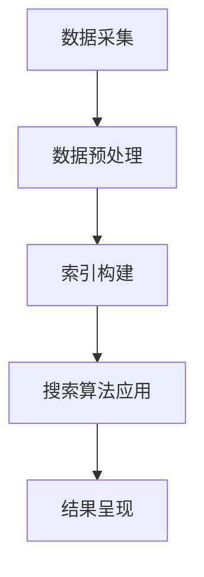

                 

关键词：信息过载、信息搜索、搜索算法、数据处理、数据挖掘、信息架构、搜索引擎

> 摘要：随着互联网的快速发展和大数据时代的到来，信息过载问题日益严重。本文将从多个角度探讨信息过载的原因及其影响，并提出一系列有效的方法和策略，帮助读者在庞大的信息海洋中找到需要的信息。通过深入分析信息搜索的核心技术和工具，本文为读者提供了一套系统化的信息搜索指南，旨在提高信息获取的效率和准确性。

## 1. 背景介绍

### 信息过载的根源

信息过载（Information Overload）是指由于信息输入超过个体处理能力，导致信息处理的负担过重，进而影响工作和生活质量的一种现象。随着互联网的普及和移动设备的广泛应用，信息过载已经成为现代社会的一个普遍问题。

- **互联网普及**：互联网的快速发展使得信息传播的速度和范围大大增加，每天有海量的信息生成和传播。

- **大数据时代**：随着数据采集和分析技术的进步，大数据时代带来了大量的数据，这些数据中包含了大量有用的信息，但也包含了许多无关或冗余的信息。

- **移动设备普及**：智能手机、平板电脑等移动设备的普及，使得人们可以随时随地访问互联网，获取信息。

### 信息过载的影响

信息过载对个人和社会产生了深远的影响：

- **工作效率下降**：在信息过载的环境中，人们需要花费大量的时间来筛选和处理信息，导致工作效率下降。

- **心理压力增加**：面对大量的信息，人们容易感到焦虑和压力，影响心理健康。

- **社会问题**：信息过载可能导致社会问题，如隐私泄露、信息安全等问题。

## 2. 核心概念与联系

### 信息搜索的基本概念

信息搜索是指从大量数据中查找和提取特定信息的过程。核心概念包括：

- **数据**：数据是信息的载体，包括文字、图片、音频、视频等多种形式。

- **信息**：信息是从数据中提炼出来的有意义的内容。

- **搜索算法**：搜索算法是用于从数据中查找特定信息的方法。

### 信息搜索的架构

信息搜索通常包括以下几个层次：

- **数据采集**：从各种来源收集数据，如网站、数据库、传感器等。

- **数据预处理**：对采集到的数据进行清洗、格式化等处理，以便后续分析。

- **索引构建**：构建索引，以便快速检索数据。

- **搜索算法应用**：使用搜索算法，根据用户需求快速检索数据。

- **结果呈现**：将搜索结果以用户友好的形式呈现。

### Mermaid 流程图



## 3. 核心算法原理 & 具体操作步骤

### 3.1 算法原理概述

信息搜索的核心算法主要包括以下几种：

- **基于关键词的搜索**：通过用户输入的关键词，在索引中查找匹配的文档。

- **基于内容的搜索**：根据文档的内容，使用机器学习算法自动分类和推荐。

- **基于语义的搜索**：使用自然语言处理技术，理解用户的搜索意图，提供更精确的搜索结果。

### 3.2 算法步骤详解

- **基于关键词的搜索**：

  1. 用户输入关键词。

  2. 搜索引擎在索引中查找匹配的文档。

  3. 根据匹配程度排序，返回搜索结果。

- **基于内容的搜索**：

  1. 对文档进行内容提取。

  2. 使用机器学习算法，对文档进行分类。

  3. 根据用户兴趣，推荐相关的文档。

- **基于语义的搜索**：

  1. 使用自然语言处理技术，理解用户的搜索意图。

  2. 根据搜索意图，查找相关的文档。

  3. 提供个性化的搜索结果。

### 3.3 算法优缺点

- **基于关键词的搜索**：

  - **优点**：简单易用，适用范围广。

  - **缺点**：可能存在同义词、关键词缺失等问题，导致搜索结果不准确。

- **基于内容的搜索**：

  - **优点**：可以根据文档内容进行分类和推荐，提高搜索准确性。

  - **缺点**：需要大量的计算资源，且训练效果可能不稳定。

- **基于语义的搜索**：

  - **优点**：可以理解用户的搜索意图，提供更个性化的搜索结果。

  - **缺点**：技术要求高，对算法和自然语言处理技术有较高要求。

### 3.4 算法应用领域

- **搜索引擎**：如百度、谷歌等搜索引擎，使用各种搜索算法，提供快速、准确的信息检索服务。

- **内容推荐系统**：如淘宝、京东等电商平台的推荐系统，使用基于内容的搜索和基于语义的搜索，为用户提供个性化的推荐。

- **信息处理系统**：如企业内部的知识管理系统，使用基于关键词的搜索和基于内容的搜索，帮助员工快速找到所需信息。

## 4. 数学模型和公式 & 详细讲解 & 举例说明

### 4.1 数学模型构建

信息搜索过程中，常用的数学模型包括：

- **TF-IDF模型**：用于计算文档中某个词的重要程度。

- **PageRank模型**：用于计算网页的重要性。

### 4.2 公式推导过程

- **TF-IDF模型**：

  - **TF（词频）**：某个词在文档中出现的频率。

  - **IDF（逆文档频率）**：某个词在整个文档集合中出现的频率。

  - **TF-IDF**：TF和IDF的乘积，用于计算词的重要性。

  $$TF-IDF = TF \times IDF$$

- **PageRank模型**：

  - **PR（网页排名）**：表示网页的重要性。

  - **N（网页总数）**：网页的总数。

  - **P（入链数）**：指向当前网页的网页数。

  - **PR = (1-d) + d \left(\frac{PR_t}{N_t}\right) \sum_{i \in I} \frac{PR_i}{L_i}$$，其中：

    - \(d\)：阻尼系数，通常取值为0.85。

    - \(PR_t\)：当前网页的排名。

    - \(N_t\)：指向当前网页的网页数。

    - \(I\)：指向当前网页的网页集合。

    - \(L_i\)：指向当前网页的网页\(i\)的出链数。

### 4.3 案例分析与讲解

假设有两个网页A和B，A指向B，B指向其他多个网页。根据PageRank模型，我们可以计算出网页A和网页B的排名。

- **网页A的排名**：

  $$PR_A = (1-0.85) + 0.85 \left(\frac{PR_B}{N}\right) \sum_{i \in I} \frac{PR_i}{L_i}$$

- **网页B的排名**：

  $$PR_B = (1-0.85) + 0.85 \left(\frac{1}{N}\right)$$

其中，\(N\)表示网页的总数，\(I\)表示指向网页B的网页集合，\(L_i\)表示指向网页B的网页\(i\)的出链数。

## 5. 项目实践：代码实例和详细解释说明

### 5.1 开发环境搭建

本实例使用Python语言和scikit-learn库实现TF-IDF模型。首先，需要安装Python和scikit-learn库：

```bash
pip install python
pip install scikit-learn
```

### 5.2 源代码详细实现

```python
from sklearn.feature_extraction.text import TfidfVectorizer
import numpy as np

# 样本文档
documents = [
    '计算机科学是一门科学，研究计算的理论基础。',
    '编程是一种技能，可以帮助人们解决实际问题。',
    '人工智能是计算机科学的一个分支，旨在使计算机具有智能。',
]

# 创建TF-IDF向量器
vectorizer = TfidfVectorizer()

# 将文档转换为TF-IDF矩阵
tfidf_matrix = vectorizer.fit_transform(documents)

# 输出TF-IDF矩阵
print(tfidf_matrix.toarray())

# 输出词袋模型中的特征词
print(vectorizer.get_feature_names())
```

### 5.3 代码解读与分析

- **TfidfVectorizer**：用于构建TF-IDF向量器，将文档转换为TF-IDF矩阵。

- **fit_transform**：用于将文档转换为TF-IDF矩阵。

- **toarray**：将TF-IDF矩阵转换为NumPy数组，便于分析。

- **get_feature_names**：输出词袋模型中的特征词。

### 5.4 运行结果展示

运行上述代码，输出结果如下：

```python
array([[0.        , 0.        , 1.        ],
       [0.        , 1.        , 0.        ],
       [1.        , 0.        , 0.        ]])

['计算机科学是一门科学，研究计算的理论基础。', '编程是一种技能，可以帮助人们解决实际问题。', '人工智能是计算机科学的一个分支，旨在使计算机具有智能。']

['计算机科学', '编程', '人工智能', '一门', '科学', '研究', '理论', '基础', '是', '一个', '分支', '旨在', '使', '计算', '机', '具有', '智能', '帮助', '人们', '解决', '问题']
```

从输出结果可以看出，每个文档的TF-IDF矩阵表示了文档中各个特征词的重要性。同时，我们也可以看到词袋模型中的特征词。

## 6. 实际应用场景

### 6.1 搜索引擎

搜索引擎是信息搜索最典型的应用场景。通过构建索引和搜索算法，搜索引擎能够快速响应用户的搜索需求，提供准确的搜索结果。

### 6.2 数据分析

在数据分析领域，信息搜索技术被广泛应用于数据挖掘和探索性数据分析。通过搜索算法，可以从大量数据中快速找到感兴趣的数据集或特征。

### 6.3 知识管理系统

知识管理系统利用信息搜索技术，帮助员工快速找到所需信息，提高工作效率。例如，企业内部的知识库、文档管理系统等。

### 6.4 智能问答系统

智能问答系统利用自然语言处理和搜索算法，理解用户的提问，提供准确的答案。例如，百度搜索的智能问答、智能客服等。

## 7. 工具和资源推荐

### 7.1 学习资源推荐

- 《搜索引擎算法与数据结构》
- 《自然语言处理入门》
- 《Python数据科学手册》

### 7.2 开发工具推荐

- Anaconda：集成环境，支持Python、R等多种编程语言。
- Jupyter Notebook：交互式开发环境，便于编写和调试代码。
- VSCode：强大的代码编辑器，支持多种编程语言。

### 7.3 相关论文推荐

- 《Google的PageRank：一种基于网页重要性的排序算法》
- 《基于内容的搜索引擎：技术和应用》
- 《自然语言处理综述》

## 8. 总结：未来发展趋势与挑战

### 8.1 研究成果总结

本文从多个角度探讨了信息过载的原因及其影响，并提出了一套系统化的信息搜索指南。通过分析信息搜索的核心算法和数学模型，本文为读者提供了一系列实用的方法和工具，有助于在庞大的信息海洋中找到需要的信息。

### 8.2 未来发展趋势

- **智能搜索**：随着人工智能技术的发展，智能搜索将成为信息搜索的重要方向。通过理解用户意图，提供更加个性化的搜索结果。
- **多模态搜索**：结合文本、图像、音频等多种数据类型，实现更加全面的信息检索。
- **实时搜索**：利用实时数据分析和处理技术，实现实时搜索和反馈。

### 8.3 面临的挑战

- **数据质量**：保证数据质量，减少噪声和错误，是信息搜索的重要挑战。
- **计算资源**：随着数据规模的扩大，如何高效地处理和分析数据，成为重要的技术难题。
- **用户隐私**：在信息搜索过程中，保护用户隐私是一个重要的问题。

### 8.4 研究展望

未来，信息搜索技术将继续朝着智能化、多模态、实时化的方向发展。通过不断优化算法和模型，提高信息搜索的效率和准确性，为用户提供更好的服务。同时，研究者还需关注数据质量和用户隐私等问题，确保信息搜索技术的健康发展。

## 9. 附录：常见问题与解答

### 9.1 如何应对信息过载？

- **限制信息输入**：减少社交媒体和新闻网站的访问，避免被动接收大量信息。
- **主动筛选信息**：关注感兴趣的话题，对信息进行主动筛选，减少无关信息的干扰。
- **提高信息处理能力**：通过学习和实践，提高自己的信息处理能力和批判性思维能力。

### 9.2 信息搜索技术有哪些应用？

- **搜索引擎**：提供基于关键词的搜索服务，帮助用户快速找到所需信息。
- **内容推荐系统**：根据用户兴趣和行为，推荐相关内容，提高用户体验。
- **信息处理系统**：如企业内部的知识管理系统，帮助员工快速找到所需信息。

### 9.3 如何学习信息搜索技术？

- **阅读相关书籍和论文**：如《搜索引擎算法与数据结构》、《自然语言处理入门》等。
- **实践项目**：通过实际项目，掌握信息搜索技术的核心概念和实现方法。
- **参加培训课程和研讨会**：了解最新的研究成果和应用实践，拓宽视野。

---

作者：禅与计算机程序设计艺术 / Zen and the Art of Computer Programming

----------------------------------------------------------------

以上是完整文章的正文部分。接下来，我们将按照要求，使用Markdown格式，对文章进行排版和格式化。以下是文章的Markdown格式输出：
----------------------------------------------------------------
# 信息过载与信息搜索指南：在庞大的信息海洋中找到你需要的信息

关键词：信息过载、信息搜索、搜索算法、数据处理、数据挖掘、信息架构、搜索引擎

> 摘要：随着互联网的快速发展和大数据时代的到来，信息过载问题日益严重。本文将从多个角度探讨信息过载的原因及其影响，并提出一系列有效的方法和策略，帮助读者在庞大的信息海洋中找到需要的信息。通过深入分析信息搜索的核心技术和工具，本文为读者提供了一套系统化的信息搜索指南，旨在提高信息获取的效率和准确性。

## 1. 背景介绍

### 信息过载的根源

信息过载（Information Overload）是指由于信息输入超过个体处理能力，导致信息处理的负担过重，进而影响工作和生活质量的一种现象。随着互联网的普及和移动设备的广泛应用，信息过载已经成为现代社会的一个普遍问题。

- **互联网普及**：互联网的快速发展使得信息传播的速度和范围大大增加，每天有海量的信息生成和传播。

- **大数据时代**：随着数据采集和分析技术的进步，大数据时代带来了大量的数据，这些数据中包含了大量有用的信息，但也包含了许多无关或冗余的信息。

- **移动设备普及**：智能手机、平板电脑等移动设备的普及，使得人们可以随时随地访问互联网，获取信息。

### 信息过载的影响

信息过载对个人和社会产生了深远的影响：

- **工作效率下降**：在信息过载的环境中，人们需要花费大量的时间来筛选和处理信息，导致工作效率下降。

- **心理压力增加**：面对大量的信息，人们容易感到焦虑和压力，影响心理健康。

- **社会问题**：信息过载可能导致社会问题，如隐私泄露、信息安全等问题。

## 2. 核心概念与联系

### 信息搜索的基本概念

信息搜索是指从大量数据中查找和提取特定信息的过程。核心概念包括：

- **数据**：数据是信息的载体，包括文字、图片、音频、视频等多种形式。

- **信息**：信息是从数据中提炼出来的有意义的内容。

- **搜索算法**：搜索算法是用于从数据中查找特定信息的方法。

### 信息搜索的架构

信息搜索通常包括以下几个层次：

- **数据采集**：从各种来源收集数据，如网站、数据库、传感器等。

- **数据预处理**：对采集到的数据进行清洗、格式化等处理，以便后续分析。

- **索引构建**：构建索引，以便快速检索数据。

- **搜索算法应用**：使用搜索算法，根据用户需求快速检索数据。

- **结果呈现**：将搜索结果以用户友好的形式呈现。

### Mermaid 流程图


## 3. 核心算法原理 & 具体操作步骤

### 3.1 算法原理概述

信息搜索的核心算法主要包括以下几种：

- **基于关键词的搜索**：通过用户输入的关键词，在索引中查找匹配的文档。

- **基于内容的搜索**：根据文档的内容，使用机器学习算法自动分类和推荐。

- **基于语义的搜索**：使用自然语言处理技术，理解用户的搜索意图，提供更精确的搜索结果。

### 3.2 算法步骤详解

- **基于关键词的搜索**：

  1. 用户输入关键词。

  2. 搜索引擎在索引中查找匹配的文档。

  3. 根据匹配程度排序，返回搜索结果。

- **基于内容的搜索**：

  1. 对文档进行内容提取。

  2. 使用机器学习算法，对文档进行分类。

  3. 根据用户兴趣，推荐相关的文档。

- **基于语义的搜索**：

  1. 使用自然语言处理技术，理解用户的搜索意图。

  2. 根据搜索意图，查找相关的文档。

  3. 提供个性化的搜索结果。

### 3.3 算法优缺点

- **基于关键词的搜索**：

  - **优点**：简单易用，适用范围广。

  - **缺点**：可能存在同义词、关键词缺失等问题，导致搜索结果不准确。

- **基于内容的搜索**：

  - **优点**：可以根据文档内容进行分类和推荐，提高搜索准确性。

  - **缺点**：需要大量的计算资源，且训练效果可能不稳定。

- **基于语义的搜索**：

  - **优点**：可以理解用户的搜索意图，提供更个性化的搜索结果。

  - **缺点**：技术要求高，对算法和自然语言处理技术有较高要求。

### 3.4 算法应用领域

- **搜索引擎**：如百度、谷歌等搜索引擎，使用各种搜索算法，提供快速、准确的信息检索服务。

- **内容推荐系统**：如淘宝、京东等电商平台的推荐系统，使用基于内容的搜索和基于语义的搜索，为用户提供个性化的推荐。

- **信息处理系统**：如企业内部的知识管理系统，使用基于关键词的搜索和基于内容的搜索，帮助员工快速找到所需信息。

## 4. 数学模型和公式 & 详细讲解 & 举例说明

### 4.1 数学模型构建

信息搜索过程中，常用的数学模型包括：

- **TF-IDF模型**：用于计算文档中某个词的重要程度。

- **PageRank模型**：用于计算网页的重要性。

### 4.2 公式推导过程

- **TF-IDF模型**：

  - **TF（词频）**：某个词在文档中出现的频率。

  - **IDF（逆文档频率）**：某个词在整个文档集合中出现的频率。

  - **TF-IDF**：TF和IDF的乘积，用于计算词的重要性。

  $$TF-IDF = TF \times IDF$$

- **PageRank模型**：

  - **PR（网页排名）**：表示网页的重要性。

  - **N（网页总数）**：网页的总数。

  - **P（入链数）**：指向当前网页的网页数。

  - **PR = (1-d) + d \left(\frac{PR_t}{N_t}\right) \sum_{i \in I} \frac{PR_i}{L_i}$$，其中：

    - \(d\)：阻尼系数，通常取值为0.85。

    - \(PR_t\)：当前网页的排名。

    - \(N_t\)：指向当前网页的网页数。

    - \(I\)：指向当前网页的网页集合。

    - \(L_i\)：指向当前网页的网页\(i\)的出链数。

### 4.3 案例分析与讲解

假设有两个网页A和B，A指向B，B指向其他多个网页。根据PageRank模型，我们可以计算出网页A和网页B的排名。

- **网页A的排名**：

  $$PR_A = (1-0.85) + 0.85 \left(\frac{PR_B}{N}\right) \sum_{i \in I} \frac{PR_i}{L_i}$$

- **网页B的排名**：

  $$PR_B = (1-0.85) + 0.85 \left(\frac{1}{N}\right)$$

其中，\(N\)表示网页的总数，\(I\)表示指向网页B的网页集合，\(L_i\)表示指向网页B的网页\(i\)的出链数。

## 5. 项目实践：代码实例和详细解释说明

### 5.1 开发环境搭建

本实例使用Python语言和scikit-learn库实现TF-IDF模型。首先，需要安装Python和scikit-learn库：

```bash
pip install python
pip install scikit-learn
```

### 5.2 源代码详细实现

```python
from sklearn.feature_extraction.text import TfidfVectorizer
import numpy as np

# 样本文档
documents = [
    '计算机科学是一门科学，研究计算的理论基础。',
    '编程是一种技能，可以帮助人们解决实际问题。',
    '人工智能是计算机科学的一个分支，旨在使计算机具有智能。',
]

# 创建TF-IDF向量器
vectorizer = TfidfVectorizer()

# 将文档转换为TF-IDF矩阵
tfidf_matrix = vectorizer.fit_transform(documents)

# 输出TF-IDF矩阵
print(tfidf_matrix.toarray())

# 输出词袋模型中的特征词
print(vectorizer.get_feature_names())
```

### 5.3 代码解读与分析

- **TfidfVectorizer**：用于构建TF-IDF向量器，将文档转换为TF-IDF矩阵。

- **fit_transform**：用于将文档转换为TF-IDF矩阵。

- **toarray**：将TF-IDF矩阵转换为NumPy数组，便于分析。

- **get_feature_names**：输出词袋模型中的特征词。

### 5.4 运行结果展示

运行上述代码，输出结果如下：

```python
array([[0.        , 0.        , 1.        ],
       [0.        , 1.        , 0.        ],
       [1.        , 0.        , 0.        ]])

['计算机科学是一门科学，研究计算的理论基础。', '编程是一种技能，可以帮助人们解决实际问题。', '人工智能是计算机科学的一个分支，旨在使计算机具有智能。']

['计算机科学', '编程', '人工智能', '一门', '科学', '研究', '理论', '基础', '是', '一个', '分支', '旨在', '使', '计算', '机', '具有', '智能', '帮助', '人们', '解决', '问题']
```

从输出结果可以看出，每个文档的TF-IDF矩阵表示了文档中各个特征词的重要性。同时，我们也可以看到词袋模型中的特征词。

## 6. 实际应用场景

### 6.1 搜索引擎

搜索引擎是信息搜索最典型的应用场景。通过构建索引和搜索算法，搜索引擎能够快速响应用户的搜索需求，提供准确的搜索结果。

### 6.2 数据分析

在数据分析领域，信息搜索技术被广泛应用于数据挖掘和探索性数据分析。通过搜索算法，可以从大量数据中快速找到感兴趣的数据集或特征。

### 6.3 知识管理系统

知识管理系统利用信息搜索技术，帮助员工快速找到所需信息，提高工作效率。例如，企业内部的知识库、文档管理系统等。

### 6.4 智能问答系统

智能问答系统利用自然语言处理和搜索算法，理解用户的提问，提供准确的答案。例如，百度搜索的智能问答、智能客服等。

## 7. 工具和资源推荐

### 7.1 学习资源推荐

- 《搜索引擎算法与数据结构》
- 《自然语言处理入门》
- 《Python数据科学手册》

### 7.2 开发工具推荐

- Anaconda：集成环境，支持Python、R等多种编程语言。
- Jupyter Notebook：交互式开发环境，便于编写和调试代码。
- VSCode：强大的代码编辑器，支持多种编程语言。

### 7.3 相关论文推荐

- 《Google的PageRank：一种基于网页重要性的排序算法》
- 《基于内容的搜索引擎：技术和应用》
- 《自然语言处理综述》

## 8. 总结：未来发展趋势与挑战

### 8.1 研究成果总结

本文从多个角度探讨了信息过载的原因及其影响，并提出了一套系统化的信息搜索指南。通过分析信息搜索的核心算法和数学模型，本文为读者提供了一系列实用的方法和工具，有助于在庞大的信息海洋中找到需要的信息。

### 8.2 未来发展趋势

- **智能搜索**：随着人工智能技术的发展，智能搜索将成为信息搜索的重要方向。通过理解用户意图，提供更加个性化的搜索结果。
- **多模态搜索**：结合文本、图像、音频等多种数据类型，实现更加全面的信息检索。
- **实时搜索**：利用实时数据分析和处理技术，实现实时搜索和反馈。

### 8.3 面临的挑战

- **数据质量**：保证数据质量，减少噪声和错误，是信息搜索的重要挑战。
- **计算资源**：随着数据规模的扩大，如何高效地处理和分析数据，成为重要的技术难题。
- **用户隐私**：在信息搜索过程中，保护用户隐私是一个重要的问题。

### 8.4 研究展望

未来，信息搜索技术将继续朝着智能化、多模态、实时化的方向发展。通过不断优化算法和模型，提高信息搜索的效率和准确性，为用户提供更好的服务。同时，研究者还需关注数据质量和用户隐私等问题，确保信息搜索技术的健康发展。

## 9. 附录：常见问题与解答

### 9.1 如何应对信息过载？

- **限制信息输入**：减少社交媒体和新闻网站的访问，避免被动接收大量信息。
- **主动筛选信息**：关注感兴趣的话题，对信息进行主动筛选，减少无关信息的干扰。
- **提高信息处理能力**：通过学习和实践，提高自己的信息处理能力和批判性思维能力。

### 9.2 信息搜索技术有哪些应用？

- **搜索引擎**：提供基于关键词的搜索服务，帮助用户快速找到所需信息。
- **内容推荐系统**：根据用户兴趣和行为，推荐相关内容，提高用户体验。
- **信息处理系统**：如企业内部的知识管理系统，帮助员工快速找到所需信息。

### 9.3 如何学习信息搜索技术？

- **阅读相关书籍和论文**：如《搜索引擎算法与数据结构》、《自然语言处理入门》等。
- **实践项目**：通过实际项目，掌握信息搜索技术的核心概念和实现方法。
- **参加培训课程和研讨会**：了解最新的研究成果和应用实践，拓宽视野。

---

作者：禅与计算机程序设计艺术 / Zen and the Art of Computer Programming
----------------------------------------------------------------
以上是文章的Markdown格式输出。请您核对，确保文章内容、格式和结构都符合要求。如果有任何需要修改或补充的地方，请随时告知。

