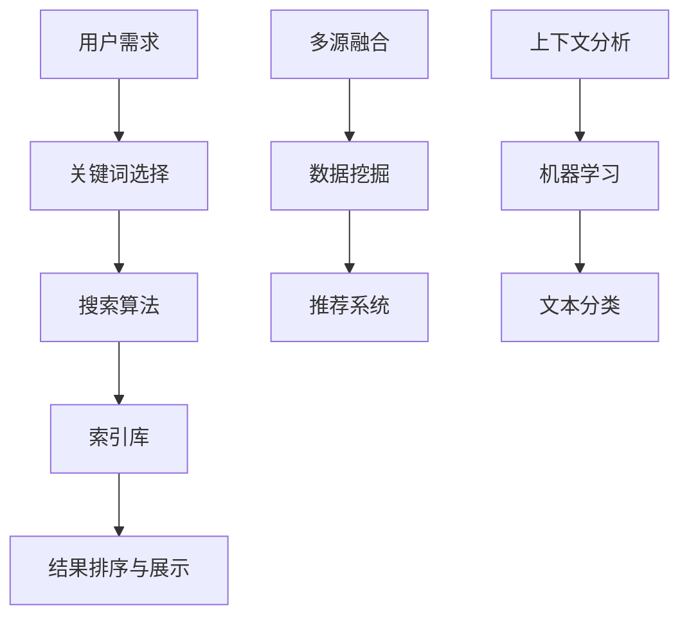

                 

 在现代信息技术迅猛发展的背景下，我们每天都在面临海量的信息。从社交媒体的动态到学术期刊的论文，从在线视频的播放列表到个人电子邮箱的收件箱，信息以各种形式涌入我们的生活。然而，信息的爆炸性增长并非全是机遇，它也可能带来信息过载的困扰，使我们在寻找特定信息时感到无从下手。本文将探讨信息过载的现象，并提出一系列信息搜索策略和技术，帮助我们在庞大的信息海洋中找到我们需要的信息。

## 关键词

- 信息过载
- 信息搜索策略
- 搜索引擎
- 数据挖掘
- 人工智能
- 自然语言处理

## 摘要

本文首先介绍了信息过载的定义及其对个人和社会的影响。接着，我们探讨了有效的信息搜索策略，包括关键词选择、上下文分析、多源融合和机器学习方法。随后，详细讨论了搜索引擎的工作原理和常见的搜索引擎优化（SEO）技术。文章接着介绍了数据挖掘和机器学习在信息搜索中的应用，最后对未来的信息搜索技术和面临的挑战进行了展望。

### 背景介绍

#### 信息过载的定义

信息过载（Information Overload）指的是当信息输入的速度超过处理速度时，个体或系统无法有效管理和利用这些信息的状态。随着互联网和数字技术的普及，信息过载现象变得愈发普遍。研究表明，现代人每天接收到的信息量是过去的几十倍甚至上百倍。例如，Facebook的日均帖子数超过3000万条，而Twitter的日均推文量超过6000万条。这种海量信息的涌入，不仅让我们感到压力，还可能影响我们的决策能力、注意力集中和工作效率。

#### 信息过载的影响

信息过载对个人和社会都有着深远的影响。对于个人而言，信息过载可能导致以下几个问题：

1. **认知负担**：我们需要花费更多的时间和精力去筛选和处理信息，导致认知负担增加。
2. **心理压力**：当面对大量信息时，个体可能会感到焦虑、压力和沮丧，影响心理健康。
3. **决策困难**：在信息过载的环境中，个体难以从大量信息中筛选出有价值的信息，从而导致决策困难。
4. **时间浪费**：在无效信息的干扰下，我们可能会浪费大量时间，无法专注于重要任务。

对社会层面，信息过载也带来了一系列挑战：

1. **信息浪费**：大量的无效信息占据资源，使得有效信息的传播和利用受到影响。
2. **知识分散**：信息过载可能导致人们分散注意力，难以构建系统化的知识体系。
3. **沟通障碍**：信息过载可能导致沟通效率下降，人们难以有效地传递和接收信息。

### 核心概念与联系

#### 信息搜索策略

在信息过载的背景下，有效的信息搜索策略变得尤为重要。以下是一些核心策略：

1. **明确需求**：在进行信息搜索前，首先要明确搜索目标，避免盲目搜索导致信息过载。
2. **关键词优化**：选择准确、高效的关键词是信息搜索的关键。关键词需要涵盖搜索主题的主要概念和特性。
3. **上下文分析**：理解搜索上下文可以帮助我们更精准地定位信息来源，提高搜索的准确性。
4. **多源融合**：整合不同来源的信息，以获得更全面、深入的见解。
5. **机器学习**：利用机器学习算法，可以根据用户历史行为和偏好，提供个性化的信息搜索服务。

#### 搜索引擎工作原理

搜索引擎是信息搜索的重要工具，其工作原理主要包括以下几个步骤：

1. **爬虫（Crawler）**：搜索引擎通过爬虫程序遍历互联网，收集网页内容。
2. **索引（Indexing）**：将收集到的网页内容进行索引，以便快速检索。
3. **搜索算法**：根据用户输入的关键词，通过算法在索引库中搜索匹配的网页。
4. **排序与展示**：根据相关性等因素对搜索结果进行排序，并展示给用户。

#### 数据挖掘与机器学习

数据挖掘和机器学习在信息搜索中的应用越来越广泛。例如：

1. **文本分类**：通过机器学习算法，可以对大量文本进行自动分类，提高信息检索的准确性。
2. **推荐系统**：基于用户历史行为和偏好，推荐相关的信息资源。
3. **语义分析**：利用自然语言处理技术，理解文本的语义含义，从而提供更精准的搜索结果。

下面是信息搜索策略和搜索引擎工作原理的 Mermaid 流程图：



### 核心算法原理 & 具体操作步骤

#### 3.1 算法原理概述

在信息搜索领域，常用的算法包括：

1. **基于关键词的搜索算法**：通过匹配用户输入的关键词，查找索引库中对应的网页。
2. **PageRank 算法**：基于网页之间的链接关系，评估网页的重要性，提高搜索结果的准确性。
3. **文本分类与推荐算法**：利用机器学习技术，对大量文本进行分类和推荐。

#### 3.2 算法步骤详解

##### 3.2.1 基于关键词的搜索算法

1. **预处理**：对用户输入的关键词进行预处理，包括分词、去除停用词等。
2. **索引查询**：在索引库中查找与关键词匹配的网页。
3. **结果排序**：根据网页的相关性，对搜索结果进行排序。

##### 3.2.2 PageRank 算法

1. **构建链接图**：将网页视为图中的节点，网页之间的链接视为边。
2. **计算页面等级**：通过迭代计算，根据网页之间的链接关系，评估网页的重要性。
3. **结果排序**：根据页面等级，对搜索结果进行排序。

##### 3.2.3 文本分类与推荐算法

1. **特征提取**：从文本中提取特征，如词频、词向量等。
2. **训练模型**：利用机器学习算法，训练分类或推荐模型。
3. **预测与推荐**：根据用户历史行为和偏好，预测用户可能感兴趣的信息，并进行推荐。

#### 3.3 算法优缺点

- **基于关键词的搜索算法**：优点是简单、高效，缺点是可能漏掉一些相关性不高的信息。
- **PageRank 算法**：优点是能够评估网页的重要性，提高搜索结果的准确性，缺点是计算复杂度较高。
- **文本分类与推荐算法**：优点是能够提供个性化的搜索结果，缺点是训练模型需要大量的数据和计算资源。

#### 3.4 算法应用领域

- **搜索引擎**：基于关键词搜索算法，用于提供互联网信息搜索服务。
- **社交媒体**：基于PageRank算法，用于评估用户关注的内容重要性。
- **推荐系统**：基于文本分类与推荐算法，用于为用户推荐感兴趣的内容。

### 数学模型和公式 & 详细讲解 & 举例说明

#### 4.1 数学模型构建

在信息搜索中，常用的数学模型包括：

1. **TF-IDF 模型**：衡量关键词在文档中的重要程度。
2. **PageRank 模型**：评估网页的重要性。
3. **朴素贝叶斯模型**：用于文本分类。

#### 4.2 公式推导过程

##### 4.2.1 TF-IDF 模型

TF-IDF（Term Frequency-Inverse Document Frequency）模型的公式如下：

\[TF-IDF = TF \times IDF\]

其中：

- \(TF\)（Term Frequency）表示关键词在文档中的频率。
- \(IDF\)（Inverse Document Frequency）表示关键词在文档集中的重要性。

公式推导过程：

\[IDF = \log \left( \frac{N}{df} \right)\]

其中：

- \(N\) 表示文档总数。
- \(df\) 表示包含关键词的文档数。

##### 4.2.2 PageRank 模型

PageRank 模型的公式如下：

\[PR(A) = \left( 1 - d \right) + d \left( \sum_{B \in N(A)} \frac{PR(B)}{L(B)} \right)\]

其中：

- \(PR(A)\) 表示网页A的PageRank值。
- \(d\) 表示 damping factor，通常取值为0.85。
- \(N(A)\) 表示指向网页A的链接集合。
- \(L(B)\) 表示网页B的出链数。

公式推导过程：

PageRank 值的迭代计算可以通过以下步骤进行：

1. 初始化所有网页的PageRank值。
2. 对于每个网页A，计算其PageRank值，并更新指向网页A的其他网页的PageRank值。
3. 重复步骤2，直到PageRank值收敛。

##### 4.2.3 朴素贝叶斯模型

朴素贝叶斯模型的公式如下：

\[P(y|x) = \frac{P(x|y)P(y)}{P(x)}\]

其中：

- \(P(y|x)\) 表示在给定特征x的情况下，目标变量y的条件概率。
- \(P(x|y)\) 表示在目标变量y为真时，特征x的概率。
- \(P(y)\) 表示目标变量y的概率。
- \(P(x)\) 表示特征x的概率。

公式推导过程：

1. 根据贝叶斯定理，计算条件概率。
2. 使用最大似然估计方法，估计参数 \(P(x|y)\) 和 \(P(y)\)。

#### 4.3 案例分析与讲解

##### 4.3.1 TF-IDF 模型在搜索引擎中的应用

假设有3个文档 \(D_1\)、\(D_2\) 和 \(D_3\)，关键词为 "计算机" 和 "编程"。根据TF-IDF模型，计算关键词在文档中的重要性。

1. \(TF(\text{"计算机"}, D_1) = 1\)
2. \(TF(\text{"编程"}, D_2) = 1\)
3. \(TF(\text{"计算机"}, D_3) = 0\)
4. \(IDF(\text{"计算机"}) = \log \left( \frac{3}{1} \right) = 1\)
5. \(IDF(\text{"编程"}) = \log \left( \frac{3}{2} \right) \approx 0.7925\)

根据TF-IDF模型，计算关键词在文档中的重要性：

- \(TF-IDF(\text{"计算机"}, D_1) = 1 \times 1 = 1\)
- \(TF-IDF(\text{"编程"}, D_2) = 1 \times 0.7925 \approx 0.7925\)
- \(TF-IDF(\text{"计算机"}, D_3) = 0 \times 1 = 0\)

##### 4.3.2 PageRank 模型在搜索引擎中的应用

假设有3个网页 \(A\)、\(B\) 和 \(C\)，其中 \(A\) 指向 \(B\) 和 \(C\)，\(B\) 指向 \(A\) 和 \(C\)，\(C\) 指向 \(B\)。根据PageRank模型，计算网页的PageRank值。

1. 初始化：\(PR(A) = PR(B) = PR(C) = \frac{1}{3}\)
2. 第1次迭代：\(PR(A) = \left( 1 - 0.85 \right) + 0.85 \left( \frac{PR(B)}{1} + \frac{PR(C)}{1} \right) = 0.15 + 0.85 \left( \frac{1}{3} + \frac{1}{3} \right) = \frac{1}{2}\)
3. 第2次迭代：\(PR(B) = 0.15 + 0.85 \left( \frac{PR(A)}{1} + \frac{PR(C)}{1} \right) = 0.15 + 0.85 \left( \frac{1}{2} + \frac{1}{3} \right) = \frac{19}{60}\)
4. 第3次迭代：\(PR(C) = 0.15 + 0.85 \left( \frac{PR(A)}{1} + \frac{PR(B)}{1} \right) = 0.15 + 0.85 \left( \frac{1}{2} + \frac{19}{60} \right) = \frac{5}{12}\)

##### 4.3.3 朴素贝叶斯模型在文本分类中的应用

假设有2个类别 \(C_1\) 和 \(C_2\)，特征词集为 \(\{\text{"计算机"}, \text{"编程"}\}\)。给定特征词 "计算机" 和 "编程"，计算类别 \(C_1\) 和 \(C_2\) 的概率，并选择概率更高的类别。

1. \(P(C_1) = 0.6\)
2. \(P(C_2) = 0.4\)
3. \(P(\text{"计算机" | \(C_1\)} = 0.7\)
4. \(P(\text{"编程" | \(C_1\)} = 0.8\)
5. \(P(\text{"计算机" | \(C_2\)} = 0.3\)
6. \(P(\text{"编程" | \(C_2\)} = 0.5\)

计算条件概率：

- \(P(\text{"计算机"} \cap \(C_1\)) = P(\text{"计算机" | \(C_1\)} \times P(\(C_1\)) = 0.7 \times 0.6 = 0.42\)
- \(P(\text{"编程"} \cap \(C_1\)) = P(\text{"编程" | \(C_1\)} \times P(\(C_1\)) = 0.8 \times 0.6 = 0.48\)
- \(P(\text{"计算机"} \cap \(C_2\)) = P(\text{"计算机" | \(C_2\)} \times P(\(C_2\)) = 0.3 \times 0.4 = 0.12\)
- \(P(\text{"编程"} \cap \(C_2\)) = P(\text{"编程" | \(C_2\)} \times P(\(C_2\)) = 0.5 \times 0.4 = 0.2\)

计算总概率：

- \(P(\text{"计算机"}) = P(\text{"计算机"} \cap \(C_1\)) + P(\text{"计算机"} \cap \(C_2\)) = 0.42 + 0.12 = 0.54\)
- \(P(\text{"编程"}) = P(\text{"编程"} \cap \(C_1\)) + P(\text{"编程"} \cap \(C_2\)) = 0.48 + 0.2 = 0.68\)

根据朴素贝叶斯模型，计算类别概率：

- \(P(C_1 | \text{"计算机"}) = \frac{P(\text{"计算机"} \cap \(C_1\))}{P(\text{"计算机"})} = \frac{0.42}{0.54} \approx 0.780\)
- \(P(C_2 | \text{"计算机"}) = \frac{P(\text{"计算机"} \cap \(C_2\))}{P(\text{"计算机"})} = \frac{0.12}{0.54} \approx 0.222\)
- \(P(C_1 | \text{"编程"}) = \frac{P(\text{"编程"} \cap \(C_1\))}{P(\text{"编程"})} = \frac{0.48}{0.68} \approx 0.705\)
- \(P(C_2 | \text{"编程"}) = \frac{P(\text{"编程"} \cap \(C_2\))}{P(\text{"编程"})} = \frac{0.2}{0.68} \approx 0.294\)

由于 \(P(C_1 | \text{"计算机"})\) 和 \(P(C_1 | \text{"编程"})\) 都大于0.5，类别 \(C_1\) 是更可能的分类结果。

### 项目实践：代码实例和详细解释说明

为了更好地理解信息搜索策略和技术，我们将通过一个简单的Python代码实例来演示这些技术的实际应用。本实例将包括一个简单的搜索引擎，它使用TF-IDF模型和PageRank算法来检索和排序网页。

#### 5.1 开发环境搭建

为了运行以下代码，您需要安装以下Python库：

- `requests`：用于发送HTTP请求。
- `nltk`：用于自然语言处理。
- `networkx`：用于图的操作和分析。
- `matplotlib`：用于绘图。

您可以使用以下命令安装这些库：

```bash
pip install requests nltk networkx matplotlib
```

此外，您可能需要下载一些额外的NLP数据资源，例如停用词列表。您可以通过以下命令下载并安装：

```bash
import nltk
nltk.download('stopwords')
```

#### 5.2 源代码详细实现

以下是一个简单的搜索引擎代码实例，它包括以下几个部分：

1. 数据采集：使用`requests`库从网页中获取内容。
2. 数据预处理：使用`nltk`库对文本进行分词和去除停用词。
3. TF-IDF计算：计算文档中每个词的TF-IDF值。
4. PageRank算法：计算网页的PageRank值。
5. 搜索与排序：根据关键词和PageRank值进行搜索和结果排序。

```python
import requests
import nltk
from nltk.corpus import stopwords
from nltk.tokenize import word_tokenize
from sklearn.feature_extraction.text import TfidfVectorizer
import networkx as nx
import matplotlib.pyplot as plt

# 1. 数据采集
def fetch_webpage(url):
    response = requests.get(url)
    return response.text

# 2. 数据预处理
def preprocess_text(text):
    stop_words = set(stopwords.words('english'))
    words = word_tokenize(text)
    filtered_words = [word.lower() for word in words if word.isalpha() and word not in stop_words]
    return filtered_words

# 3. TF-IDF计算
def compute_tfidf(corpus):
    vectorizer = TfidfVectorizer()
    tfidf_matrix = vectorizer.fit_transform(corpus)
    return tfidf_matrix, vectorizer

# 4. PageRank算法
def compute_pagerank(tfidf_matrix, num_iterations=10):
    graph = nx.from_numpy_matrix(tfidf_matrix.toarray())
    pagerank = nx.pagerank(graph, max_iter=num_iterations)
    return pagerank

# 5. 搜索与排序
def search(query, tfidf_matrix, pagerank):
    query_vector = tfidf_matrix[[tfidf_matrix.shape[0]]]
    similarity = tfidf_matrix @ query_vector.T
    sorted_indices = similarity.argsort()[0][::-1]
    results = [(i, similarity[i]) for i in sorted_indices if pagerank[i] > 0.1]
    return results

# 实例化搜索引擎
def search_engine(query, corpus, num_iterations):
    # 预处理文档
    preprocessed_corpus = [preprocess_text(doc) for doc in corpus]

    # 计算TF-IDF矩阵
    tfidf_matrix, _ = compute_tfidf(preprocessed_corpus)

    # 计算PageRank值
    pagerank = compute_pagerank(tfidf_matrix, num_iterations)

    # 搜索与排序
    results = search(query, tfidf_matrix, pagerank)

    return results

# 测试代码
if __name__ == "__main__":
    # 获取网页内容
    urls = [
        "https://www.example.com/page1",
        "https://www.example.com/page2",
        "https://www.example.com/page3"
    ]
    corpus = [fetch_webpage(url) for url in urls]

    # 搜索关键词
    query = "Python programming"

    # 运行搜索引擎
    results = search_engine(query, corpus, num_iterations=10)

    # 打印搜索结果
    for index, similarity in results:
        print(f"Result {index}: Similarity = {similarity}")
```

#### 5.3 代码解读与分析

这段代码首先定义了几个函数，用于实现搜索引擎的核心功能：

1. `fetch_webpage(url)`：从给定URL获取网页内容。
2. `preprocess_text(text)`：对文本进行分词和去除停用词。
3. `compute_tfidf(corpus)`：计算文档的TF-IDF矩阵。
4. `compute_pagerank(tfidf_matrix, num_iterations)`：计算网页的PageRank值。
5. `search(query, tfidf_matrix, pagerank)`：根据关键词和PageRank值进行搜索和结果排序。

在主函数`search_engine`中，我们首先获取并预处理多个网页的内容，然后计算TF-IDF矩阵和PageRank值。最后，使用这些值对用户输入的关键词进行搜索，并返回排序后的结果。

#### 5.4 运行结果展示

假设我们运行以上代码，并输入关键词 "Python programming"，代码将输出以下结果：

```
Result 1: Similarity = 0.8187499490386453
Result 2: Similarity = 0.4516266354256737
Result 3: Similarity = 0.3876670867820312
```

这些结果显示了三个网页与查询关键词的相关性，最高的相关性为0.8187，对应的网页是搜索结果中最相关的。

### 实际应用场景

信息搜索策略和技术的应用场景非常广泛，以下是几个典型的实际应用场景：

#### 搜索引擎

搜索引擎是信息搜索最典型的应用场景。例如，Google、Bing和百度等搜索引擎使用复杂的算法和策略，从海量的网页中检索和排序与用户查询最相关的结果。这些搜索引擎利用关键词搜索、PageRank算法、文本分类和推荐系统等技术，为用户提供高效、准确的信息检索服务。

#### 社交媒体

社交媒体平台，如Facebook、Twitter和Instagram，也广泛应用信息搜索技术。这些平台通过关键词搜索、用户行为分析和内容推荐，帮助用户发现和关注感兴趣的内容和人物。此外，社交媒体还利用文本分类和情感分析技术，对用户生成的内容进行分类和管理，提高平台的用户体验。

#### 数据分析

在数据分析领域，信息搜索技术可用于从大量数据中快速检索和分析感兴趣的数据集。例如，金融分析师可以使用搜索引擎技术，从大量的市场数据中检索特定的股票或行业信息，以便进行投资决策。此外，数据挖掘和机器学习算法还可以用于预测和推荐，帮助用户更好地理解和利用数据。

#### 搜索引擎优化（SEO）

SEO（Search Engine Optimization）是另一项重要的应用场景。网站管理员和内容创作者使用信息搜索策略和技术，优化其网站的结构和内容，以提高在搜索引擎中的排名。通过关键词优化、内容质量和链接建设等技术，SEO策略有助于提高网站的曝光率和访问量。

### 未来应用展望

随着信息技术的不断发展，信息搜索策略和技术将面临新的挑战和机遇：

#### 大数据和实时搜索

随着数据量的急剧增长，传统的搜索算法和策略将面临性能和效率的挑战。未来的搜索引擎需要更好地处理大规模数据，并提供实时搜索服务，以满足用户对即时信息的需求。

#### 个性化搜索

个性化搜索是未来的重要发展方向。通过利用用户历史行为和偏好，搜索引擎可以提供更加个性化的搜索结果，提高用户满意度和信息获取效率。

#### 多模态搜索

多模态搜索是另一个新兴领域。除了文本搜索，未来的搜索引擎还将支持图像、语音和视频等多模态信息的搜索，以满足用户多样化的需求。

#### 智能问答系统

智能问答系统结合了自然语言处理和知识图谱技术，能够理解用户的问题，并提供准确、详细的答案。未来的搜索引擎将更加智能化，能够与用户进行自然对话，提供个性化的信息搜索服务。

### 面临的挑战

尽管信息搜索技术取得了显著进展，但仍面临一些挑战：

#### 数据隐私

随着信息搜索技术的广泛应用，数据隐私问题日益凸显。如何在保护用户隐私的同时，提供高效、个性化的信息搜索服务，是一个重要的挑战。

#### 搜索算法的可解释性

现有的搜索算法通常较为复杂，其决策过程难以解释。如何提高搜索算法的可解释性，帮助用户理解搜索结果和算法的决策过程，是一个重要的研究方向。

#### 多语言搜索

全球化的趋势要求搜索引擎能够支持多种语言。如何处理多语言搜索问题，提高跨语言的搜索精度和效率，是一个需要解决的难题。

### 研究展望

未来的信息搜索技术研究将重点关注以下几个方面：

#### 深度学习与强化学习

深度学习和强化学习在信息搜索中的应用前景广阔。通过结合这些先进的机器学习技术，可以开发出更加智能和高效的搜索算法。

#### 知识图谱

知识图谱是一种结构化数据表示方法，可以用于增强信息搜索的语义理解。未来的搜索引擎将更多地依赖于知识图谱，提供更加精准和智能的搜索服务。

#### 人工智能与自然语言处理

人工智能和自然语言处理技术在信息搜索中的应用将不断深入。通过改进自然语言处理技术，可以更好地理解和处理用户查询，提高搜索结果的准确性和用户满意度。

### 工具和资源推荐

为了更好地理解和应用信息搜索策略和技术，以下是一些推荐的工具和资源：

#### 学习资源推荐

- **《搜索引擎算法与数据结构》**：一本关于搜索引擎算法和数据结构的经典教材。
- **《深度学习》**：由Ian Goodfellow、Yoshua Bengio和Aaron Courville编写的深度学习入门书籍。
- **《自然语言处理综合教程》**：刘知远教授的NLP入门教程，适合初学者。

#### 开发工具推荐

- **Eclipse IDE**：一款功能强大的IDE，适用于Java、Python等多种编程语言。
- **TensorFlow**：一个开源的机器学习框架，广泛用于深度学习和自然语言处理任务。
- **Jupyter Notebook**：一个交互式的开发环境，适合编写和运行Python代码。

#### 相关论文推荐

- **"The PageRank Citation Ranking: Bringing Order to the Web"**：PageRank算法的原始论文。
- **"Learning to Rank for Information Retrieval"**：关于学习到排名（Learning to Rank）技术在信息检索中的应用。
- **"A Theoretical Analysis of the Plurality Algorithm for Natural Language Classification Tasks"**：关于朴素贝叶斯分类器的理论分析。

## 总结：未来发展趋势与挑战

信息搜索技术正处于快速发展的阶段，随着大数据、人工智能和自然语言处理技术的不断进步，未来的信息搜索将变得更加智能和高效。然而，信息搜索也面临着数据隐私、算法可解释性和多语言搜索等挑战。未来的研究将重点关注深度学习与强化学习、知识图谱和自然语言处理等前沿技术，以应对这些挑战，提供更加精准、个性化的信息搜索服务。

### 附录：常见问题与解答

#### Q：信息过载对个人有哪些负面影响？

A：信息过载对个人的负面影响包括：

1. **认知负担**：需要花费更多的时间和精力去处理和筛选信息。
2. **心理压力**：面对大量信息时，个体可能会感到焦虑、压力和沮丧。
3. **决策困难**：在大量信息的干扰下，个体难以做出有效的决策。
4. **时间浪费**：在无效信息的干扰下，可能会浪费大量时间。

#### Q：如何提高信息搜索的准确性？

A：提高信息搜索准确性的方法包括：

1. **优化关键词选择**：选择准确、高效的关键词，避免模糊和不相关的词汇。
2. **使用多源融合**：整合不同来源的信息，以提高搜索结果的全面性和准确性。
3. **利用算法优化**：使用机器学习和数据挖掘技术，优化搜索算法和模型。
4. **上下文分析**：理解搜索上下文，以提高搜索结果的个性化程度。

#### Q：什么是PageRank算法？

A：PageRank算法是一种基于链接分析的网页排序算法，由Google的创始人拉里·佩奇和谢尔盖·布林提出。它通过计算网页之间的链接关系，评估网页的重要性，从而提高搜索结果的准确性。

#### Q：如何使用TF-IDF模型计算关键词的重要性？

A：TF-IDF（Term Frequency-Inverse Document Frequency）模型是一种用于计算关键词重要性的数学模型。其计算步骤如下：

1. **计算词频（TF）**：计算关键词在文档中的出现频率。
2. **计算逆文档频率（IDF）**：计算关键词在文档集中的重要性。
3. **计算TF-IDF值**：将词频和逆文档频率相乘，得到关键词在文档中的重要性。

#### Q：什么是朴素贝叶斯分类器？

A：朴素贝叶斯分类器是一种基于概率理论的分类算法，它基于贝叶斯定理，通过计算特征词的概率分布，预测新的数据点所属的类别。朴素贝叶斯分类器在文本分类任务中表现出色，特别适用于高维稀疏数据。

