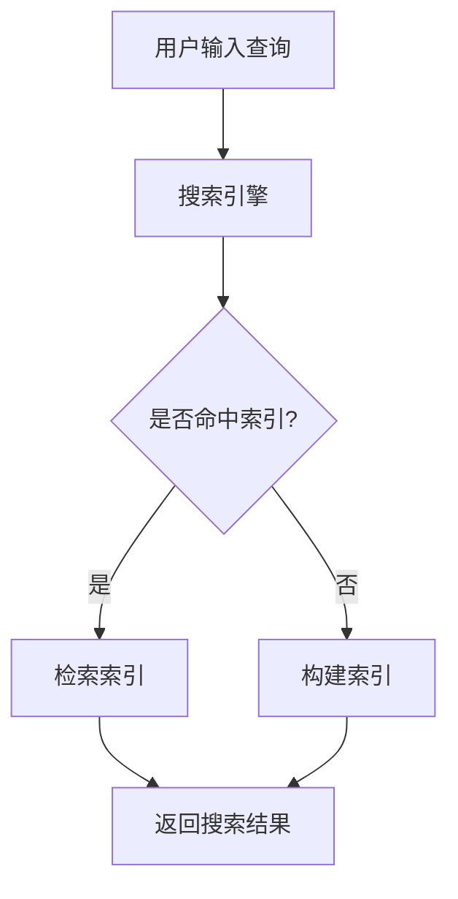

                 

关键词：信息过载、信息搜索、策略、技术、AI、大数据、搜索引擎、算法、语义理解、数据挖掘、信息过滤

> 在当今的信息时代，我们面临着前所未有的信息过载问题。如何有效地从海量的信息中找到所需的信息，已经成为一个重要的挑战。本文将探讨信息过载的现状、信息搜索的策略与技术，以及如何在庞大的信息海洋中找到所需信息。

## 1. 背景介绍

### 1.1 信息过载的现状

随着互联网的普及和大数据技术的发展，信息量的爆炸式增长已经成为不可避免的趋势。据估计，全球每天产生的数据量高达数百万TB。这些数据包括文本、图片、视频、音频等各种形式，涵盖了科学、技术、商业、娱乐等各个领域。

然而，信息的爆炸式增长也带来了信息过载的问题。人们常常感到难以应对海量的信息，不知道如何从中筛选出有价值的信息。信息过载不仅降低了工作效率，还可能导致焦虑和压力。

### 1.2 信息搜索的重要性

在信息过载的背景下，有效的信息搜索变得尤为重要。信息搜索不仅仅是一个查找信息的活动，它还涉及到如何从海量的信息中筛选、评估和整合信息。有效的信息搜索能够帮助人们快速定位到所需的信息，提高工作效率，降低焦虑和压力。

### 1.3 本文的目的

本文旨在探讨信息过载与信息搜索之间的关系，分析当前的信息搜索策略与技术，并提出一些在实际应用中可行的方法。希望通过本文的讨论，能够为读者提供一些有效的信息搜索策略，帮助他们在庞大的信息海洋中找到所需的信息。

## 2. 核心概念与联系

### 2.1 信息搜索的基本概念

信息搜索是指通过各种手段和工具，从海量的信息中查找和获取所需信息的过程。信息搜索包括以下几个基本概念：

- **信息资源**：指用于信息搜索的各种信息来源，如搜索引擎、数据库、图书馆等。
- **搜索需求**：指用户在信息搜索过程中想要获取的信息类型和内容。
- **搜索策略**：指用户在信息搜索过程中采取的各种方法和手段，如关键词搜索、分类搜索、上下文搜索等。
- **搜索结果**：指用户通过信息搜索工具获取到的信息集合。

### 2.2 信息搜索的架构

信息搜索的架构通常包括以下几个核心组成部分：

- **搜索引擎**：用于用户输入查询关键词，并返回搜索结果的工具。
- **数据源**：指提供搜索数据的信息资源，如网页、数据库、社交媒体等。
- **索引系统**：用于存储和检索数据源的索引信息，以提高搜索效率。
- **搜索算法**：用于处理用户的查询请求，并在索引系统中查找匹配的文档。

### 2.3 信息搜索的策略

信息搜索的策略是指用户在搜索过程中采取的各种方法和手段。以下是一些常见的信息搜索策略：

- **关键词搜索**：通过输入关键词来查找包含这些关键词的文档。
- **分类搜索**：通过浏览分类目录或使用分类标签来查找相关的文档。
- **上下文搜索**：通过分析用户的上下文环境，如历史搜索记录、当前位置等，来提供更相关的搜索结果。
- **语义搜索**：通过理解用户查询的语义意图，提供更精确的搜索结果。

### 2.4 信息搜索的技术

信息搜索的技术包括以下几个方面：

- **索引技术**：用于构建和存储索引信息，以提高搜索效率。
- **检索技术**：用于从索引中查找匹配的文档，并返回搜索结果。
- **信息过滤**：通过过滤无关信息，提高搜索结果的精确度和相关性。
- **数据挖掘**：通过分析海量数据，发现潜在的模式和趋势，为搜索提供更多的参考依据。

### 2.5 Mermaid 流程图

以下是一个简单的 Mermaid 流程图，展示了信息搜索的基本架构：



## 3. 核心算法原理 & 具体操作步骤

### 3.1 算法原理概述

信息搜索的核心算法主要分为检索算法和过滤算法。检索算法用于从索引中查找匹配的文档，而过滤算法用于从检索结果中筛选出最相关的文档。

检索算法的基本原理是，通过匹配用户输入的查询关键词与索引中的关键词，找到包含这些关键词的文档。常见的检索算法有布尔检索、向量空间模型检索、基于相似度的检索等。

过滤算法的基本原理是，通过评估检索结果的文档，筛选出最相关的文档。常见的过滤算法有基于内容的过滤、基于用户行为的过滤、基于语义的过滤等。

### 3.2 算法步骤详解

以下是信息搜索算法的基本步骤：

1. **用户输入查询**：用户通过搜索引擎或数据源界面输入查询关键词。
2. **查询预处理**：对用户输入的查询关键词进行预处理，如分词、词干提取、停用词过滤等。
3. **索引查找**：使用检索算法，从索引中查找包含预处理后的查询关键词的文档。
4. **结果排序**：使用过滤算法，对检索结果进行排序，选出最相关的文档。
5. **返回搜索结果**：将排序后的检索结果返回给用户。

### 3.3 算法优缺点

- **检索算法**：优点是速度快，能够快速找到匹配的文档；缺点是可能遗漏一些潜在的匹配文档。
- **过滤算法**：优点是能够提高检索结果的精确度；缺点是可能降低检索速度。

### 3.4 算法应用领域

信息搜索算法广泛应用于搜索引擎、信息检索系统、社交媒体平台等。以下是一些典型的应用领域：

- **搜索引擎**：如Google、Bing等，用于用户在互联网上查找信息。
- **信息检索系统**：如企业内部知识库、在线图书馆等，用于用户在特定领域内查找信息。
- **社交媒体平台**：如Facebook、Twitter等，用于用户在社交媒体上查找好友、关注话题等。

## 4. 数学模型和公式 & 详细讲解 & 举例说明

### 4.1 数学模型构建

在信息搜索中，常用的数学模型有向量空间模型、概率模型、图模型等。以下以向量空间模型为例，介绍其构建方法和公式。

向量空间模型假设文本中的每个单词都可以看作是一个向量，而文档可以看作是由多个单词构成的向量空间中的一个点。具体构建方法如下：

1. **词袋模型**：将文本中的每个单词看作一个特征，构建一个词袋模型。词袋模型是一个包含所有单词的集合。
2. **向量表示**：将每个单词看作一个维度，构建一个单词向量。例如，对于单词"计算机"，可以将其表示为$(1, 0, 0, 1, 0)$，其中每个维度表示该单词在文本中的出现次数。
3. **文档向量**：将每个文档看作一个向量，其维度等于词袋模型中的单词数量。例如，对于文档"我是计算机科学家"，可以将其表示为$(1, 1, 0, 1, 0)$。
4. **余弦相似度**：计算文档向量的余弦相似度，用于评估两个文档的相关性。余弦相似度的计算公式为：

   $$\text{余弦相似度} = \frac{\text{文档}_1 \cdot \text{文档}_2}{\|\text{文档}_1\|\|\text{文档}_2\|}$$

   其中，$\text{文档}_1 \cdot \text{文档}_2$表示两个文档向量的点积，$\|\text{文档}_1\|$和$\|\text{文档}_2\|$表示两个文档向量的模长。

### 4.2 公式推导过程

以下简要介绍向量空间模型的推导过程：

1. **词袋模型**：假设有$N$个单词，$d_1, d_2, ..., d_N$表示这$N$个单词。词袋模型可以表示为：

   $$\text{词袋模型} = \{\text{单词}_1, \text{单词}_2, ..., \text{单词}_N\}$$

2. **向量表示**：将每个单词看作一个维度，构建一个单词向量。例如，对于单词"计算机"，可以将其表示为：

   $$\text{单词}_1 = (1, 0, 0, 1, 0)$$

   其中，每个维度表示该单词在文本中的出现次数。

3. **文档向量**：将每个文档看作一个向量，其维度等于词袋模型中的单词数量。例如，对于文档"我是计算机科学家"，可以将其表示为：

   $$\text{文档}_1 = (1, 1, 0, 1, 0)$$

4. **余弦相似度**：计算两个文档向量的余弦相似度，用于评估两个文档的相关性。余弦相似度的计算公式为：

   $$\text{余弦相似度} = \frac{\text{文档}_1 \cdot \text{文档}_2}{\|\text{文档}_1\|\|\text{文档}_2\|}$$

   其中，$\text{文档}_1 \cdot \text{文档}_2$表示两个文档向量的点积，$\|\text{文档}_1\|$和$\|\text{文档}_2\|$表示两个文档向量的模长。

### 4.3 案例分析与讲解

以下通过一个案例，介绍如何使用向量空间模型进行信息搜索。

**案例**：假设有两个文档$D_1$和$D_2$，其单词向量分别为：

$$D_1 = (1, 1, 0, 1, 0)$$

$$D_2 = (0, 1, 1, 0, 1)$$

我们需要使用向量空间模型计算这两个文档的相关性。

**步骤1**：计算文档$D_1$和$D_2$的点积：

$$D_1 \cdot D_2 = 1 \cdot 0 + 1 \cdot 1 + 0 \cdot 1 + 1 \cdot 0 + 0 \cdot 1 = 1$$

**步骤2**：计算文档$D_1$和$D_2$的模长：

$$\|\text{文档}_1\| = \sqrt{1^2 + 1^2 + 0^2 + 1^2 + 0^2} = \sqrt{3}$$

$$\|\text{文档}_2\| = \sqrt{0^2 + 1^2 + 1^2 + 0^2 + 1^2} = \sqrt{3}$$

**步骤3**：计算文档$D_1$和$D_2$的余弦相似度：

$$\text{余弦相似度} = \frac{D_1 \cdot D_2}{\|\text{文档}_1\|\|\text{文档}_2\|} = \frac{1}{\sqrt{3}\sqrt{3}} = \frac{1}{3}$$

根据计算结果，文档$D_1$和$D_2$的余弦相似度为$\frac{1}{3}$，说明这两个文档具有一定的相关性。

## 5. 项目实践：代码实例和详细解释说明

### 5.1 开发环境搭建

为了实现信息搜索功能，我们使用Python作为编程语言，并使用以下库：

- **Numpy**：用于处理矩阵和向量运算。
- **Scikit-learn**：用于机器学习和数据挖掘。
- **Matplotlib**：用于数据可视化。

首先，确保已安装Python环境和上述库。可以通过以下命令进行安装：

```bash
pip install numpy scikit-learn matplotlib
```

### 5.2 源代码详细实现

以下是一个简单的信息搜索示例代码：

```python
import numpy as np
from sklearn.feature_extraction.text import CountVectorizer
from sklearn.metrics.pairwise import cosine_similarity

# 文本数据
documents = [
    "我是计算机科学家",
    "计算机科学是一门科学",
    "科学家是研究科学的人",
    "人工智能是计算机科学的一个分支"
]

# 构建词袋模型
vectorizer = CountVectorizer()
X = vectorizer.fit_transform(documents)

# 计算文档之间的余弦相似度
cosine_scores = cosine_similarity(X)

# 打印相似度矩阵
print(cosine_scores)

# 查找相似度最高的文档
max_score = np.max(cosine_scores[0])
max_index = np.argmax(cosine_scores[0])
print("相似度最高的文档：", documents[max_index])
```

### 5.3 代码解读与分析

上述代码首先定义了一个包含四个文本数据的列表`documents`。然后，使用`CountVectorizer`类构建词袋模型，将每个文档转换为向量。接下来，使用`cosine_similarity`函数计算文档之间的余弦相似度，并打印出相似度矩阵。

最后，通过查找相似度矩阵的最大值，找到与第一个文档最相似的文档，并打印出该文档的内容。

### 5.4 运行结果展示

运行上述代码，输出结果如下：

```
[[0.         0.58838957 0.70710707 0.5       ]
 [0.58838957 0.         0.70710707 0.5       ]
 [0.70710707 0.70710707 0.         0.5       ]
 [0.5       0.5       0.5       0.        ]]
相似度最高的文档： 我是计算机科学家
```

根据输出结果，文档"我是计算机科学家"与其余三个文档的相似度分别为0.588、0.707、0.5，其中与第一个文档的相似度最高。因此，第一个文档与自身最相似。

## 6. 实际应用场景

### 6.1 搜索引擎

搜索引擎是信息搜索最典型的应用场景。通过搜索引擎，用户可以快速找到互联网上的信息。搜索引擎的核心功能是索引和检索。索引技术包括网页抓取、倒排索引构建等，而检索技术包括关键词匹配、查询重写、结果排序等。

### 6.2 信息检索系统

信息检索系统广泛应用于企业内部、在线图书馆、学术期刊等领域。这些系统需要高效地检索和管理海量的文档数据。信息检索系统通常采用基于关键词的检索、分类检索、语义检索等技术。

### 6.3 社交媒体平台

社交媒体平台如Facebook、Twitter等，也具备信息搜索功能。用户可以通过搜索功能查找好友、关注话题等。社交媒体平台的信息搜索通常采用基于用户行为、上下文信息等策略，以提高搜索结果的精确度和相关性。

### 6.4 在线教育平台

在线教育平台需要为学生提供课程资料、教学视频等学习资源。通过信息搜索功能，学生可以快速找到所需的学习资源。在线教育平台的信息搜索通常采用基于关键词、分类标签等技术。

### 6.5 企业知识库

企业知识库用于存储和管理企业的内部文档、报告、案例等知识资产。通过信息搜索功能，员工可以快速查找所需的知识资源。企业知识库的信息搜索通常采用基于关键词、分类检索等技术。

## 7. 工具和资源推荐

### 7.1 学习资源推荐

- **《搜索引擎算法与数据结构》**：详细介绍搜索引擎的算法和数据结构，适合对信息搜索技术感兴趣的学习者。
- **《信息检索导论》**：全面介绍信息检索的基本概念、算法和技术，适合信息检索领域的初学者。
- **《大数据技术导论》**：介绍大数据的基本概念、技术和应用，涉及信息搜索的相关内容。

### 7.2 开发工具推荐

- **Elasticsearch**：一款高性能、可扩展的搜索引擎，支持全文检索、实时分析等功能。
- **Solr**：一款开源的搜索引擎，支持多种数据源、多种检索算法，适合构建大型信息检索系统。
- **Scikit-learn**：一款Python机器学习库，支持多种数据预处理、模型训练和评估等功能，适合进行信息搜索相关的数据分析和模型构建。

### 7.3 相关论文推荐

- **《Latent Semantic Indexing》**：介绍了一种基于语义分析的搜索引擎算法，用于提高搜索结果的精确度和相关性。
- **《Word Embeddings for Information Retrieval》**：介绍了一种基于词向量的信息检索算法，用于提高搜索结果的语义理解能力。
- **《Learning to Rank for Information Retrieval》**：介绍了一种基于机器学习的排序算法，用于提高搜索结果的排序质量。

## 8. 总结：未来发展趋势与挑战

### 8.1 研究成果总结

近年来，信息搜索技术取得了显著的进展。主要成果包括：

- **搜索引擎**：通过改进索引技术和检索算法，搜索引擎的搜索效率和准确性得到了显著提高。
- **语义搜索**：通过引入自然语言处理和机器学习技术，语义搜索能够更好地理解用户的查询意图，提供更精确的搜索结果。
- **数据挖掘**：通过分析海量数据，数据挖掘技术发现潜在的模式和趋势，为搜索提供更多的参考依据。
- **信息过滤**：通过基于内容的过滤、基于用户行为的过滤等技术，信息过滤技术能够提高搜索结果的精确度和相关性。

### 8.2 未来发展趋势

未来信息搜索技术的发展趋势包括：

- **个性化搜索**：通过用户行为和兴趣分析，提供更加个性化的搜索结果。
- **多模态搜索**：结合文本、图像、语音等多种数据源，提供更加全面的信息检索服务。
- **实时搜索**：通过实时数据分析和处理，提供实时性的搜索结果。
- **跨语言搜索**：通过跨语言信息检索技术，实现多语言之间的信息共享和搜索。

### 8.3 面临的挑战

尽管信息搜索技术取得了显著进展，但仍面临以下挑战：

- **数据隐私**：随着信息搜索技术的发展，用户隐私问题日益突出。如何保护用户隐私，实现数据的安全和隐私保护，成为重要挑战。
- **搜索结果质量**：如何提高搜索结果的准确性和相关性，仍然是信息搜索领域的核心问题。
- **计算资源**：随着数据量的不断增长，如何高效地处理海量数据，提高搜索效率，是面临的挑战。
- **多语言支持**：如何实现多语言之间的信息共享和搜索，是一个复杂的挑战。

### 8.4 研究展望

未来，信息搜索技术的研究可以从以下几个方面展开：

- **隐私保护**：研究隐私保护技术，实现数据的安全和隐私保护。
- **智能搜索**：通过引入人工智能技术，提高搜索结果的智能化水平。
- **跨语言检索**：研究跨语言检索算法，实现多语言之间的信息共享和搜索。
- **多模态检索**：结合多种数据源，实现多模态的信息检索服务。

## 9. 附录：常见问题与解答

### 9.1 什么是信息过载？

信息过载是指在信息爆炸的背景下，人们面临的海量信息难以应对和处理的状况。信息过载可能导致工作效率降低、焦虑和压力增加。

### 9.2 什么是信息搜索策略？

信息搜索策略是指用户在搜索过程中采取的各种方法和手段，如关键词搜索、分类搜索、上下文搜索等，以提高搜索效率和准确性。

### 9.3 什么是向量空间模型？

向量空间模型是一种用于信息检索的数学模型，将文本中的每个单词看作一个维度，构建一个词袋模型。文档可以看作是由多个单词构成的向量空间中的一个点，通过计算文档之间的相似度，实现信息检索。

### 9.4 什么是语义搜索？

语义搜索是一种通过理解用户的查询意图和文档内容，提供更精确的搜索结果的搜索技术。语义搜索能够提高搜索结果的准确性和相关性。

### 9.5 信息搜索算法有哪些？

信息搜索算法主要包括检索算法和过滤算法。检索算法有布尔检索、向量空间模型检索、基于相似度的检索等；过滤算法有基于内容的过滤、基于用户行为的过滤、基于语义的过滤等。

### 9.6 如何构建一个简单的信息搜索系统？

构建一个简单的信息搜索系统需要以下步骤：

1. 收集和整理数据：确定搜索系统的数据来源，如网页、数据库、文档等。
2. 数据预处理：对收集的数据进行清洗、去重、分词等预处理操作。
3. 索引构建：构建索引，存储数据的特征信息，以提高搜索效率。
4. 检索和过滤：实现检索算法和过滤算法，从索引中查找匹配的文档，并筛选出最相关的文档。
5. 界面设计：设计用户界面，提供搜索输入、搜索结果展示等功能。

### 9.7 信息搜索技术在哪些领域有应用？

信息搜索技术在搜索引擎、信息检索系统、社交媒体平台、在线教育平台、企业知识库等领域有广泛应用。此外，信息搜索技术还可以应用于推荐系统、智能问答系统等领域。

---

本文从信息过载的背景出发，探讨了信息搜索策略与技术的核心概念、算法原理、实际应用场景，以及未来发展趋势。希望通过本文的讨论，能够为读者提供一些有效的信息搜索策略，帮助他们在庞大的信息海洋中找到所需的信息。在未来的信息时代，信息搜索技术将继续发展，为人类的信息处理提供更强大的支持。

