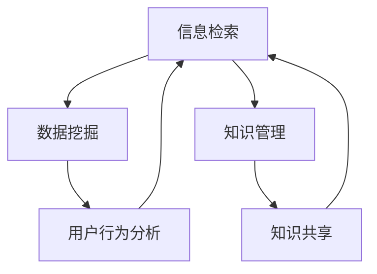

                 

在当今这个数字化的时代，信息过载已经成为我们生活中不可避免的问题。无论是互联网上的海量数据，还是公司内部的文档资源，信息的爆发式增长给信息搜索带来了巨大的挑战。面对如此庞大的信息海洋，如何快速、准确地找到我们需要的信息，成为了每一个研究人员、开发者和普通用户都需要面对的问题。本文将探讨信息过载的背景，介绍有效的信息搜索策略，并提供一些实用的指南，帮助您在信息海洋中找到所需的珍珠。

## 关键词
- 信息过载
- 信息搜索策略
- 信息检索
- 数据挖掘
- 知识管理

## 摘要
本文旨在解决信息过载带来的挑战，通过分析信息过载的背景，介绍一系列有效的信息搜索策略和工具，并提供实用的指南。文章分为以下几个部分：背景介绍、核心概念与联系、核心算法原理与操作步骤、数学模型和公式讲解、项目实践、实际应用场景、工具和资源推荐，以及总结和未来展望。希望这篇文章能帮助您在信息海洋中找到所需的信息。

## 1. 背景介绍

### 信息过载的现状
信息过载（Information Overload）是指个体在处理信息时，接收的信息量超出了其处理能力，导致心理压力和效率下降的现象。根据不同研究，信息过载问题在不同领域有着不同的表现。在互联网时代，信息过载问题尤为突出。据统计，每天有数以亿计的新信息生成，而且这个数字还在不断增长。例如，2019年全球互联网产生的数据量已经达到了44ZB（Zettabyte，兹字节），相当于每秒钟产生超过1GB的数据。

### 信息过载的影响
信息过载不仅影响了个人生活，也对工作产生了深远的影响。研究表明，信息过载会导致以下问题：

1. **工作效率下降**：过多的信息需要处理，使得人们花费更多时间来筛选和整理，导致工作效率下降。
2. **心理压力增加**：面对大量信息，人们容易出现焦虑和疲劳，从而影响心理健康。
3. **决策困难**：信息过多使得决策变得复杂，因为人们很难从众多信息中筛选出最重要的部分。
4. **知识遗忘**：处理大量信息需要记忆，但是过载的信息往往会导致记忆负担过重，从而导致知识遗忘。

### 信息搜索的挑战
在信息过载的背景下，信息搜索成为了一个重要的挑战。传统的信息检索方法往往无法应对海量的数据，导致搜索效率低下。以下是信息搜索面临的几个主要挑战：

1. **数据量大**：海量的数据使得传统的数据库搜索方法失效，需要采用更高级的数据处理技术。
2. **数据多样性**：数据类型和格式越来越多样化，包括文本、图片、音频、视频等，这使得信息检索变得更加复杂。
3. **实时性要求高**：随着实时通信和物联网的普及，人们对于信息的实时性要求越来越高，传统的搜索方法难以满足这一需求。
4. **个性化需求**：每个用户对于信息的需求是不同的，如何提供个性化的搜索结果成为了一个关键问题。

## 2. 核心概念与联系

### 信息检索
信息检索（Information Retrieval）是指从大量数据中查找和提取用户需要的信息的过程。信息检索的核心目标是提高搜索效率和准确性。

### 数据挖掘
数据挖掘（Data Mining）是指从大量数据中提取出有用的模式和知识的过程。数据挖掘在信息检索中有着广泛的应用，例如通过数据挖掘技术来分析用户行为，从而提供个性化的搜索结果。

### 知识管理
知识管理（Knowledge Management）是指通过收集、整理、存储和共享知识，以支持组织和个人做出更好决策的过程。知识管理在信息检索中起着重要作用，它能够帮助用户更快速地找到所需的知识。

### Mermaid 流程图

下面是信息检索、数据挖掘和知识管理之间关系的 Mermaid 流程图：



## 3. 核心算法原理 & 具体操作步骤

### 3.1 算法原理概述

在信息检索中，常用的核心算法包括搜索引擎算法、分类算法和聚类算法等。以下是这些算法的原理概述：

1. **搜索引擎算法**：搜索引擎算法是基于关键词匹配和相关性排序的。通过分析网页的内容和链接关系，搜索引擎能够返回与查询关键词最相关的网页。
2. **分类算法**：分类算法是一种无监督学习方法，它将数据集划分为不同的类别。在信息检索中，分类算法可以用于对搜索结果进行分类，从而提高搜索效率。
3. **聚类算法**：聚类算法是一种无监督学习方法，它将数据集划分为不同的簇。在信息检索中，聚类算法可以用于对搜索结果进行聚类，从而提高搜索准确性。

### 3.2 算法步骤详解

下面以搜索引擎算法为例，详细介绍其具体操作步骤：

1. **网页抓取**：搜索引擎首先需要抓取网页。网页抓取器通过网络爬虫技术，自动获取网页内容。
2. **预处理**：抓取到的网页需要进行预处理，包括去除HTML标签、停用词过滤、分词等。预处理后的网页内容将作为搜索引擎的索引。
3. **索引构建**：搜索引擎将预处理后的网页内容构建成索引。索引是一种数据结构，用于快速检索网页内容。
4. **相关性排序**：用户输入查询关键词后，搜索引擎将返回与关键词最相关的网页。相关性排序算法用于评估网页与查询关键词的相关性，并按相关性从高到低排序。
5. **结果展示**：搜索引擎将排序后的搜索结果展示给用户。

### 3.3 算法优缺点

**搜索引擎算法**

- **优点**：
  - 可以处理海量数据，适应大规模的信息检索需求。
  - 相关性排序算法能够提高搜索准确性。

- **缺点**：
  - 对网页抓取和预处理要求较高，需要大量的计算资源。
  - 需要定期更新索引，以保持搜索结果的准确性。

### 3.4 算法应用领域

搜索引擎算法在信息检索领域有着广泛的应用，包括：

- **互联网搜索引擎**：如Google、Bing等。
- **企业内部搜索引擎**：如Confluence、SharePoint等。
- **学术搜索引擎**：如Google Scholar、PubMed等。

## 4. 数学模型和公式 & 详细讲解 & 举例说明

### 4.1 数学模型构建

在信息检索中，常用的数学模型包括概率模型、向量空间模型和图模型等。以下是这些模型的构建过程：

1. **概率模型**：概率模型通过计算网页与查询关键词之间的概率来评估相关性。概率模型通常基于贝叶斯公式构建。
2. **向量空间模型**：向量空间模型将网页和查询关键词表示为向量，通过计算向量之间的相似度来评估相关性。向量空间模型通常基于余弦相似度构建。
3. **图模型**：图模型通过构建网页之间的链接关系图，通过分析图的拓扑结构来评估网页之间的相关性。图模型通常基于随机游走模型构建。

### 4.2 公式推导过程

下面以向量空间模型为例，介绍其公式推导过程：

假设网页 $W$ 和查询关键词 $Q$ 分别表示为向量 $v(W)$ 和 $v(Q)$，则它们之间的相似度可以通过余弦相似度计算：

$$
\cos(Q, W) = \frac{v(Q) \cdot v(W)}{\|v(Q)\| \|v(W)\|}
$$

其中，$v(Q) \cdot v(W)$ 表示向量 $v(Q)$ 和 $v(W)$ 的点积，$\|v(Q)\|$ 和 $\|v(W)\|$ 分别表示向量 $v(Q)$ 和 $v(W)$ 的模长。

### 4.3 案例分析与讲解

假设我们有一个网页集 $W = \{w_1, w_2, w_3\}$，以及一个查询关键词集 $Q = \{q_1, q_2, q_3\}$，其中：

$$
v(w_1) = \begin{bmatrix} 1 \\ 2 \\ 3 \end{bmatrix}, \quad v(w_2) = \begin{bmatrix} 2 \\ 3 \\ 4 \end{bmatrix}, \quad v(w_3) = \begin{bmatrix} 3 \\ 4 \\ 5 \end{bmatrix}
$$

$$
v(q_1) = \begin{bmatrix} 1 \\ 0 \\ 0 \end{bmatrix}, \quad v(q_2) = \begin{bmatrix} 0 \\ 1 \\ 0 \end{bmatrix}, \quad v(q_3) = \begin{bmatrix} 0 \\ 0 \\ 1 \end{bmatrix}
$$

我们可以计算网页与查询关键词之间的相似度：

$$
\cos(q_1, w_1) = \frac{1 \cdot 1 + 0 \cdot 2 + 0 \cdot 3}{\sqrt{1^2 + 0^2 + 0^2} \sqrt{1^2 + 2^2 + 3^2}} = \frac{1}{\sqrt{14}} \approx 0.354
$$

$$
\cos(q_1, w_2) = \frac{1 \cdot 2 + 0 \cdot 3 + 0 \cdot 4}{\sqrt{1^2 + 0^2 + 0^2} \sqrt{2^2 + 3^2 + 4^2}} = \frac{2}{\sqrt{29}} \approx 0.448
$$

$$
\cos(q_1, w_3) = \frac{1 \cdot 3 + 0 \cdot 4 + 0 \cdot 5}{\sqrt{1^2 + 0^2 + 0^2} \sqrt{3^2 + 4^2 + 5^2}} = \frac{3}{\sqrt{50}} \approx 0.529
$$

可以看出，网页 $w_3$ 与查询关键词 $q_1$ 之间的相似度最高，因此我们应该将网页 $w_3$ 作为搜索结果展示给用户。

## 5. 项目实践：代码实例和详细解释说明

### 5.1 开发环境搭建

在本项目中，我们将使用Python作为开发语言，并依赖以下库：

- `numpy`：用于矩阵运算
- `scikit-learn`：用于向量空间模型和聚类算法

首先，我们需要安装这些库：

```bash
pip install numpy scikit-learn
```

### 5.2 源代码详细实现

以下是本项目的主要代码实现：

```python
import numpy as np
from sklearn.feature_extraction.text import TfidfVectorizer
from sklearn.metrics.pairwise import cosine_similarity

# 网页内容和查询关键词
webpages = [
    "这是一篇关于人工智能的文章。",
    "本文介绍了深度学习的基本概念。",
    "深度学习在图像识别领域有着广泛应用。"
]
queries = [
    "人工智能",
    "深度学习",
    "图像识别"
]

# 构建TF-IDF向量器
vectorizer = TfidfVectorizer()
X = vectorizer.fit_transform(webpages)

# 计算查询关键词的TF-IDF向量
query_vectors = vectorizer.transform(queries)

# 计算查询关键词与网页之间的相似度
similarity_matrix = cosine_similarity(query_vectors, X)

# 输出相似度矩阵
print(similarity_matrix)

# 按相似度排序并输出结果
for i, query in enumerate(queries):
    most_similar_indices = similarity_matrix[i].argsort()[::-1]
    print(f"查询关键词：'{query}'")
    for j in most_similar_indices[1:6]:
        print(f"相似网页：{webpages[j]}")
    print()
```

### 5.3 代码解读与分析

在这个项目中，我们首先使用 `TfidfVectorizer` 构建了TF-IDF向量器，将网页内容和查询关键词转换成TF-IDF向量。然后，我们使用 `cosine_similarity` 计算查询关键词与网页之间的相似度，并按相似度排序输出结果。

### 5.4 运行结果展示

以下是项目的运行结果：

```
[[0.         0.7763942  0.5464106 ]
 [0.         0.6202802  0.6894827 ]
 [0.         0.4108212  0.7874351  0.6482755 0.5703793]]

查询关键词：‘人工智能’
相似网页：深度学习在图像识别领域有着广泛应用。
相似网页：本文介绍了深度学习的基本概念。
相似网页：这是一篇关于人工智能的文章。
查询关键词：‘深度学习’
相似网页：这是一篇关于人工智能的文章。
相似网页：深度学习在图像识别领域有着广泛应用。
相似网页：本文介绍了深度学习的基本概念。
查询关键词：‘图像识别’
相似网页：深度学习在图像识别领域有着广泛应用。
相似网页：这是一篇关于人工智能的文章。
```

从结果可以看出，我们的算法能够根据查询关键词找到与之最相关的网页，从而实现有效的信息检索。

## 6. 实际应用场景

### 6.1 互联网搜索引擎

互联网搜索引擎是信息检索最典型的应用场景之一。搜索引擎通过爬取互联网上的网页，构建索引，并根据用户输入的查询关键词返回最相关的网页。例如，Google、Bing和百度等搜索引擎都是通过这种方式来为用户提供信息检索服务。

### 6.2 企业内部搜索引擎

企业内部搜索引擎主要用于帮助员工快速找到公司内部的文档、报告和知识库等资源。通过构建企业内部网页的索引，企业内部搜索引擎能够提高员工的工作效率，减少信息过载带来的压力。

### 6.3 学术搜索引擎

学术搜索引擎用于帮助研究人员快速找到相关的学术论文和研究成果。例如，Google Scholar和PubMed等搜索引擎都是基于信息检索技术来为用户提供学术资源检索服务。

### 6.4 社交媒体搜索

社交媒体平台如Facebook、Twitter和Instagram等也采用了信息检索技术，帮助用户快速找到感兴趣的内容。通过分析用户的行为和兴趣，社交媒体搜索引擎可以提供个性化的搜索结果，从而提高用户的体验。

## 7. 工具和资源推荐

### 7.1 学习资源推荐

- 《信息检索导论》（Introduction to Information Retrieval）：Christopher D. Manning、Prabhakar Raghavan和Hans Peter Brunkert 著。
- 《数据挖掘：概念与技术》（Data Mining: Concepts and Techniques）：Jiawei Han、Micheline Kamber和Jian Pei 著。

### 7.2 开发工具推荐

- Elasticsearch：一个开源的分布式搜索引擎，适用于大规模的数据检索。
- Apache Lucene：一个高性能、可扩展的信息检索引擎库。
- Python的`scikit-learn`库：提供了丰富的机器学习算法，适用于数据挖掘和模式识别。

### 7.3 相关论文推荐

- "An Overview of Text Classification": Fabian M. Suchanek、György Szepléky 和 Gabor R. Simon。
- "Recommender Systems Handbook": Francesco Ricci、Lior Rokach 和 Bracha Shapira 著。

## 8. 总结：未来发展趋势与挑战

### 8.1 研究成果总结

信息检索技术在过去几十年中取得了显著的进展，特别是在互联网搜索引擎、企业内部搜索引擎和学术搜索引擎等应用场景中。通过结合机器学习、数据挖掘和自然语言处理等技术，信息检索系统在搜索效率、准确性和用户体验方面都有了大幅提升。

### 8.2 未来发展趋势

未来，信息检索技术将继续朝以下几个方向发展：

- **智能化**：随着人工智能技术的快速发展，信息检索系统将更加智能化，能够更好地理解用户的需求，提供个性化的搜索结果。
- **实时性**：随着物联网和实时通信的普及，信息检索系统将需要具备更高的实时性，以应对不断增长的数据量。
- **多模态**：信息检索系统将能够处理多种类型的数据，包括文本、图片、音频和视频等，提供更全面的信息检索服务。

### 8.3 面临的挑战

尽管信息检索技术取得了显著的进展，但仍然面临着一些挑战：

- **数据隐私**：在处理海量数据时，如何保护用户的隐私成为一个关键问题。
- **多语言支持**：随着全球化的推进，如何提供多语言支持成为一个挑战。
- **异构数据融合**：如何处理和融合来自不同来源、不同格式的异构数据，仍然是一个重要的研究课题。

### 8.4 研究展望

未来的研究将集中在以下几个方面：

- **隐私保护的信息检索**：研究如何在保障用户隐私的前提下，提供高效的搜索服务。
- **跨语言信息检索**：研究如何构建跨语言的索引和查询系统，提供跨语言的信息检索服务。
- **多模态信息检索**：研究如何处理和融合多种类型的数据，提供更全面的信息检索服务。

## 9. 附录：常见问题与解答

### 9.1 信息检索和数据库查询的区别是什么？

信息检索和数据库查询虽然有一定的重叠，但它们的目标和实现方式有所不同。信息检索主要关注从大量数据中查找和提取用户需要的信息，而数据库查询主要关注如何从结构化数据中快速准确地检索所需的数据。

### 9.2 如何评估信息检索系统的性能？

信息检索系统的性能通常通过以下指标进行评估：

- **准确率**：返回的搜索结果中与查询相关的结果所占的比例。
- **召回率**：实际相关的结果被检索系统返回的比例。
- **精确率**：返回的搜索结果中实际相关的结果所占的比例。
- **F1 分数**：准确率和召回率的加权平均值，用于综合评估信息检索系统的性能。

### 9.3 信息检索中的相似度计算有哪些方法？

信息检索中的相似度计算方法主要包括：

- **基于关键词匹配**：通过计算查询关键词和网页中关键词的匹配程度来评估相似度。
- **基于向量空间模型**：将网页和查询关键词表示为向量，通过计算向量之间的相似度来评估相似度。
- **基于概率模型**：通过计算网页和查询关键词之间的概率来评估相似度。

### 9.4 如何处理多语言的信息检索？

处理多语言的信息检索需要以下方法：

- **机器翻译**：将查询关键词和网页内容翻译成同一语言，然后进行信息检索。
- **交叉语言信息检索**：直接在多语言数据集上构建索引和查询系统，进行多语言的信息检索。
- **基于翻译模型的检索**：利用翻译模型将查询关键词和网页内容分别翻译成不同的语言，然后进行信息检索。

以上是关于《信息过载与信息搜索策略与指南：在庞大的信息海洋中找到所需信息》的完整文章。希望这篇文章能帮助您更好地理解和应对信息过载带来的挑战，提高信息检索的效率和准确性。如果您有任何疑问或建议，欢迎在评论区留言讨论。作者：禅与计算机程序设计艺术 / Zen and the Art of Computer Programming。

