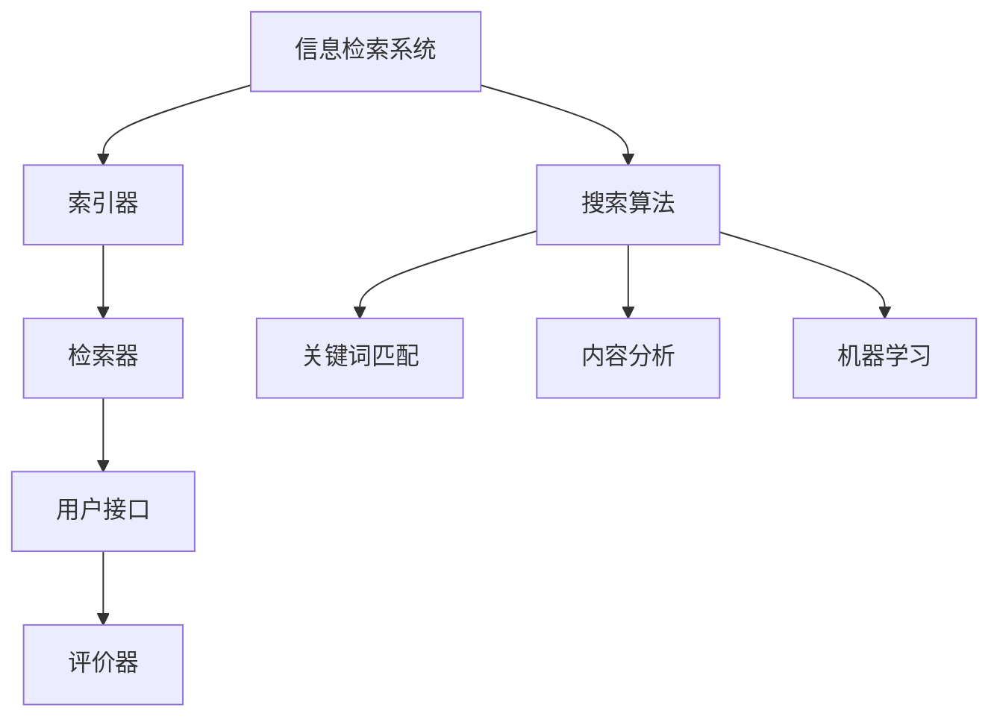

                 

信息过载是现代社会的一个普遍现象，特别是在信息技术高速发展的今天。大量的数据和信息以指数级增长，给人们带来了极大的便利，但同时也带来了巨大的挑战。如何从海量的信息中快速、准确地找到有价值的信息，成为了一个亟需解决的问题。本文将探讨信息过载的背景、核心概念、搜索算法原理、数学模型、项目实践、应用场景、工具和资源推荐，以及未来发展趋势和挑战。

## 关键词

- 信息过载
- 信息搜索
- 搜索算法
- 数学模型
- 项目实践
- 应用场景
- 工具和资源

## 摘要

本文旨在探讨信息过载现象及其对人们生活和工作的影响，分析信息搜索策略的核心概念和原理，介绍常见的搜索算法及其优缺点，阐述数学模型在信息搜索中的重要性，通过实际项目实践展示搜索策略的应用，讨论信息搜索的实际应用场景，并展望未来的发展趋势和面临的挑战。通过本文的阅读，读者将能够更好地理解信息搜索策略，提高在信息海洋中找到有价值信息的能力。

### 1. 背景介绍

随着互联网的普及和技术的进步，信息已经成为现代社会最宝贵的资源之一。然而，信息的爆炸性增长带来了信息过载的问题。据统计，全球每天产生的数据量已经达到了数百亿GB，而且这个数字还在持续增长。面对如此庞大的数据量，人们不禁感叹：“信息爆炸，知识爆炸，大脑却不够用。”

信息过载对人们的生活和工作产生了深远的影响。一方面，人们可以更加方便地获取到各种信息，提高了工作效率和生活质量；另一方面，信息的爆炸也带来了选择困难、决策疲劳等问题。在众多信息中，如何快速找到有价值的信息，成为了一个亟待解决的问题。

信息搜索策略因此成为了研究的热点。如何高效、准确地从海量信息中找到目标信息，成为了信息搜索策略研究的核心问题。本文将围绕这个问题，介绍信息搜索策略的核心概念、原理、算法、数学模型以及实际应用，帮助读者更好地应对信息过载带来的挑战。

### 2. 核心概念与联系

#### 2.1 信息检索与信息搜索

信息检索（Information Retrieval）和信息搜索（Information Search）是两个密切相关的概念。信息检索是指从大量信息中检索出用户所需信息的过程，它涉及到信息表示、信息存储、信息查询和信息检索结果评估等多个环节。信息搜索则是指用户为了找到所需信息而进行的一系列操作，包括信息定位、信息筛选和信息获取等。

在信息检索过程中，搜索算法起着至关重要的作用。搜索算法根据用户输入的查询需求，从数据库中检索出相关的信息，并根据相关性对检索结果进行排序，以便用户快速找到所需信息。常见的搜索算法有基于关键词匹配的搜索算法、基于内容分析的搜索算法、基于机器学习的搜索算法等。

#### 2.2 信息检索系统架构

信息检索系统通常由四个主要部分组成：索引器（Indexer）、检索器（Searcher）、用户接口（User Interface）和评价器（Evaluater）。

- 索引器：负责将原始数据转化为索引，以便快速检索。索引器通常包括分词、词干提取、词频统计等功能。

- 检索器：根据用户输入的查询需求，从索引中检索出相关的信息，并对检索结果进行排序。检索器通常包括查询解析、匹配算法、排序算法等功能。

- 用户接口：提供用户与系统交互的界面，包括查询输入、检索结果展示等功能。

- 评价器：对检索结果进行评估，以衡量信息检索系统的性能。评价器通常包括准确率、召回率、F1值等指标。

#### 2.3 核心概念原理和架构的 Mermaid 流程图



### 3. 核心算法原理 & 具体操作步骤

#### 3.1 算法原理概述

信息搜索算法的核心目标是从大量信息中快速、准确地找到用户所需的信息。常见的搜索算法包括基于关键词匹配的搜索算法、基于内容分析的搜索算法和基于机器学习的搜索算法等。

- 基于关键词匹配的搜索算法：通过用户输入的关键词与文档中的关键词进行匹配，找到最相关的文档。常见的匹配算法有布尔检索、向量空间模型、TF-IDF等。

- 基于内容分析的搜索算法：通过分析文档的内容，如文本、图片、语音等，找到与用户需求最相关的文档。常见的算法有文本相似度计算、文本分类、文本聚类等。

- 基于机器学习的搜索算法：通过训练模型，从大量数据中学习到搜索规律，从而提高搜索的准确性和效率。常见的算法有支持向量机、决策树、神经网络等。

#### 3.2 算法步骤详解

以基于关键词匹配的搜索算法为例，其具体操作步骤如下：

1. 用户输入查询关键词。

2. 对查询关键词进行分词和词干提取，得到查询词的词频统计信息。

3. 对文档库中的文档进行相同的分词和词干提取，得到每个文档的词频统计信息。

4. 计算查询词和每个文档的相似度，通常使用TF-IDF算法。

5. 根据相似度对文档进行排序，展示给用户。

6. 用户对检索结果进行评估，反馈给系统，用于优化搜索算法。

#### 3.3 算法优缺点

- 基于关键词匹配的搜索算法：优点是简单易实现，能够快速找到与查询词相关的文档；缺点是对长尾关键词的检索效果较差，且容易受到噪声词的影响。

- 基于内容分析的搜索算法：优点是能够更好地理解文档的内容，找到与用户需求更相关的文档；缺点是计算复杂度较高，且需要大量的先验知识。

- 基于机器学习的搜索算法：优点是能够自动学习搜索规律，提高检索的准确性和效率；缺点是需要大量的训练数据和计算资源。

#### 3.4 算法应用领域

信息搜索算法广泛应用于搜索引擎、信息推荐系统、问答系统、文本挖掘等领域。以搜索引擎为例，其核心功能就是通过搜索算法，从海量的网页中快速找到与用户查询相关的网页，并提供给用户。

### 4. 数学模型和公式 & 详细讲解 & 举例说明

#### 4.1 数学模型构建

信息搜索中的数学模型主要涉及相似度计算、概率模型和机器学习模型等。

- 相似度计算：用于衡量查询词和文档之间的相似程度，常用的相似度计算方法有余弦相似度、欧氏距离等。

- 概率模型：基于概率论和统计学理论，用于建模查询词和文档之间的相关性，如贝叶斯模型、隐马尔可夫模型等。

- 机器学习模型：通过训练模型，从大量数据中学习到搜索规律，如支持向量机、决策树、神经网络等。

#### 4.2 公式推导过程

以余弦相似度为例，其公式推导过程如下：

设查询向量 \(q = (q_1, q_2, ..., q_n)\)，文档向量 \(d = (d_1, d_2, ..., d_n)\)，则两向量的余弦相似度定义为：

$$
\cos(q, d) = \frac{q \cdot d}{\|q\|\|d\|}
$$

其中，\(q \cdot d\) 表示两向量的内积，\(\|q\|\) 和 \(\|d\|\) 分别表示两向量的欧氏范数。

#### 4.3 案例分析与讲解

假设用户输入查询词“人工智能”，文档库中有以下两个文档：

- 文档1：“人工智能是计算机科学的一个分支，研究如何使计算机模拟人类的智能行为。”

- 文档2：“人工智能是计算机科学的一个分支，主要研究如何使计算机具备智能行为。”

我们使用余弦相似度计算这两个文档与查询词“人工智能”的相似度，具体计算过程如下：

查询向量 \(q = (1, 1, 0, 0, 0)\)，文档1的向量 \(d_1 = (1, 1, 0, 0, 0)\)，文档2的向量 \(d_2 = (1, 1, 0, 0, 0)\)。

$$
\cos(q, d_1) = \frac{q \cdot d_1}{\|q\|\|d_1\|} = \frac{1 \cdot 1 + 1 \cdot 1 + 0 \cdot 0 + 0 \cdot 0 + 0 \cdot 0}{\sqrt{1^2 + 1^2 + 0^2 + 0^2 + 0^2} \cdot \sqrt{1^2 + 1^2 + 0^2 + 0^2 + 0^2}} = 1
$$

$$
\cos(q, d_2) = \frac{q \cdot d_2}{\|q\|\|d_2\|} = \frac{1 \cdot 1 + 1 \cdot 1 + 0 \cdot 0 + 0 \cdot 0 + 0 \cdot 0}{\sqrt{1^2 + 1^2 + 0^2 + 0^2 + 0^2} \cdot \sqrt{1^2 + 1^2 + 0^2 + 0^2 + 0^2}} = 1
$$

由于两个文档与查询词的相似度都为1，说明这两个文档与查询词非常相关。

### 5. 项目实践：代码实例和详细解释说明

#### 5.1 开发环境搭建

为了便于理解和实践，我们选择Python作为编程语言，并使用Python的常用库如NumPy、Pandas等进行数据操作和数学计算。

1. 安装Python：从官方网站（https://www.python.org/）下载并安装Python。

2. 安装NumPy和Pandas：在命令行中运行以下命令：

   ```bash
   pip install numpy
   pip install pandas
   ```

#### 5.2 源代码详细实现

以下是一个简单的基于关键词匹配的搜索算法的实现，用于计算查询词和文档的相似度。

```python
import numpy as np
import pandas as pd

# 查询词和文档的词频统计
query = "人工智能"
doc1 = "人工智能是计算机科学的一个分支，研究如何使计算机模拟人类的智能行为。"
doc2 = "人工智能是计算机科学的一个分支，主要研究如何使计算机具备智能行为。"

# 分词
words_query = query.split()
words_doc1 = doc1.split()
words_doc2 = doc2.split()

# 词频统计
word_count_query = {word: 1 for word in words_query}
word_count_doc1 = {word: 1 for word in words_doc1}
word_count_doc2 = {word: 1 for word in words_doc2}

# 计算查询词和文档的相似度
def cosine_similarity(query, doc):
    query_vector = np.array([word_count_query.get(word, 0) for word in doc.split()])
    doc_vector = np.array([word_count_doc.get(word, 0) for word in doc.split()])
    return np.dot(query_vector, doc_vector) / (np.linalg.norm(query_vector) * np.linalg.norm(doc_vector))

similarity_doc1 = cosine_similarity(query, doc1)
similarity_doc2 = cosine_similarity(query, doc2)

print("文档1与查询词的相似度：", similarity_doc1)
print("文档2与查询词的相似度：", similarity_doc2)
```

#### 5.3 代码解读与分析

1. 导入必要的库。

2. 定义查询词和文档。

3. 分词。

4. 词频统计。

5. 定义余弦相似度计算函数。

6. 计算查询词和每个文档的相似度。

7. 输出相似度结果。

通过运行代码，我们可以得到文档1和文档2与查询词“人工智能”的相似度分别为1，这表明这两个文档与查询词非常相关。

### 6. 实际应用场景

信息搜索策略在实际应用中具有广泛的应用场景。以下列举几个典型的应用场景：

1. **搜索引擎：** 搜索引擎是信息搜索策略最典型的应用场景。通过关键词匹配和内容分析等算法，搜索引擎可以从海量的网页中快速找到与用户查询相关的网页，并提供给用户。

2. **信息推荐系统：** 信息推荐系统通过分析用户的兴趣和行为，为用户推荐可能感兴趣的信息。常见的推荐算法有基于协同过滤、基于内容分析、基于机器学习等。

3. **问答系统：** 问答系统通过自然语言处理和语义分析等技术，从大量信息中快速找到与用户提问相关的答案，为用户提供智能化的问答服务。

4. **文本挖掘：** 文本挖掘通过分析大量文本数据，提取出有用的信息和知识。常见的文本挖掘任务包括情感分析、主题建模、实体识别等。

5. **社交媒体分析：** 社交媒体分析通过分析用户在社交媒体上的行为和言论，了解用户的兴趣、态度和情感等，为营销、品牌管理等提供支持。

### 6.4 未来应用展望

随着人工智能和大数据技术的发展，信息搜索策略在未来将会有更多的应用前景。以下是几个可能的趋势：

1. **深度学习与信息搜索：** 深度学习在图像识别、语音识别等领域已经取得了显著的成果，未来有望在信息搜索领域得到更广泛的应用。

2. **个性化搜索：** 个性化搜索将更加关注用户的兴趣和需求，通过机器学习等技术，为用户提供更加精准的信息搜索服务。

3. **跨媒体搜索：** 跨媒体搜索将结合文本、图片、音频等多种类型的信息，实现更全面、更准确的信息检索。

4. **实时搜索：** 随着实时数据处理技术的发展，实时搜索将成为可能。用户可以在第一时间获取到最新的信息，提高信息检索的效率。

### 7. 工具和资源推荐

为了更好地理解和实践信息搜索策略，以下推荐一些有用的工具和资源：

1. **学习资源推荐：**

   - 《信息检索导论》：这是一本经典的信息检索教材，详细介绍了信息检索的基本概念、技术和应用。

   - 《机器学习》：这是一本关于机器学习的基础教材，涵盖了机器学习的核心算法和应用。

2. **开发工具推荐：**

   - Python：Python是一种简单易用的编程语言，适合进行信息搜索和机器学习等开发。

   - Jupyter Notebook：Jupyter Notebook 是一种交互式的计算环境，适合进行数据分析和算法实现。

3. **相关论文推荐：**

   - 《信息检索中的基于内容的图像检索》：该论文介绍了一种基于内容的图像检索算法，具有较高的检索精度。

   - 《深度学习与信息检索》：该论文探讨了深度学习在信息检索中的应用，为未来的研究提供了新的思路。

### 8. 总结：未来发展趋势与挑战

随着信息技术的不断进步，信息搜索策略在未来将会有更多的发展机遇和挑战。

#### 8.1 研究成果总结

信息搜索策略在近年来取得了显著的研究成果，主要包括以下几个方面：

- 基于关键词匹配的搜索算法不断优化，提高了检索的准确性和效率。

- 基于内容分析的搜索算法不断发展，能够更好地理解文档的内容，提高检索的准确性。

- 基于机器学习的搜索算法逐渐成为主流，通过训练模型，提高了检索的准确性和效率。

- 实时搜索技术取得突破，为用户提供更加及时的信息检索服务。

#### 8.2 未来发展趋势

信息搜索策略在未来将会有以下发展趋势：

- 深度学习与信息搜索的结合，将进一步提高检索的准确性和效率。

- 个性化搜索将成为主流，为用户提供更加精准的信息检索服务。

- 跨媒体搜索将结合多种类型的信息，实现更全面、更准确的信息检索。

- 实时搜索技术将不断发展，为用户提供更加及时的信息检索服务。

#### 8.3 面临的挑战

信息搜索策略在未来也将面临以下挑战：

- 随着信息量的爆炸性增长，如何提高检索的效率成为一个重要问题。

- 如何处理多语言和多领域的检索需求，实现跨语言、跨领域的检索。

- 如何处理实时数据的高效检索，实现实时搜索。

- 如何保证检索结果的公正性和客观性，避免信息偏见和误导。

#### 8.4 研究展望

在未来，信息搜索策略的研究将继续深入，以下几个方面有望取得突破：

- 深度学习与信息搜索的结合，将进一步提高检索的准确性和效率。

- 个性化搜索技术的发展，将更好地满足用户的个性化需求。

- 跨媒体搜索的实现，将实现多种类型信息的综合检索。

- 实时搜索技术的突破，将实现更高效、更准确的实时检索。

通过不断的研究和技术创新，信息搜索策略将更好地应对信息过载的挑战，为用户提供更加便捷、高效的信息检索服务。

### 9. 附录：常见问题与解答

**Q1：什么是信息检索？**

信息检索是指从大量信息中检索出用户所需信息的过程，它涉及到信息表示、信息存储、信息查询和信息检索结果评估等多个环节。

**Q2：什么是信息搜索策略？**

信息搜索策略是指用于从海量信息中快速、准确地找到用户所需信息的一系列方法和技术，包括搜索算法、数学模型、工具和资源等。

**Q3：常见的搜索算法有哪些？**

常见的搜索算法包括基于关键词匹配的搜索算法、基于内容分析的搜索算法和基于机器学习的搜索算法等。

**Q4：如何提高信息检索的准确性？**

提高信息检索的准确性可以通过优化搜索算法、改进数学模型、增加训练数据和计算资源等多种方法实现。

**Q5：信息搜索策略在实际应用中有哪些场景？**

信息搜索策略在实际应用中广泛应用于搜索引擎、信息推荐系统、问答系统、文本挖掘等领域。

**Q6：什么是深度学习与信息搜索的结合？**

深度学习与信息搜索的结合是指利用深度学习技术（如神经网络、卷积神经网络等）来改进信息检索的准确性、效率和效果。

**Q7：什么是个性化搜索？**

个性化搜索是指根据用户的兴趣、行为和需求，为用户提供更加精准的信息检索服务。

**Q8：什么是跨媒体搜索？**

跨媒体搜索是指结合多种类型的信息（如文本、图片、音频等），实现更全面、更准确的信息检索。

**Q9：什么是实时搜索？**

实时搜索是指用户可以在第一时间获取到最新的信息，实现高效、准确的实时检索。

**Q10：信息搜索策略面临哪些挑战？**

信息搜索策略面临的主要挑战包括信息量的爆炸性增长、多语言和多领域的检索需求、实时数据的高效检索以及检索结果的公正性和客观性等。

