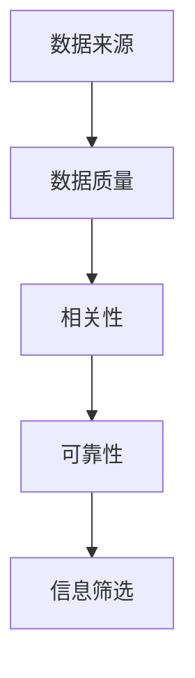

                 

在当今数字化时代，信息爆炸已经成为不可避免的现象。每天，我们都被大量的数据、文章、报告和新闻包围着。如何从这些海量的信息中筛选出真正有价值的内容，已经成为一个日益重要的问题。本文将探讨信息过载的现象，信息筛选的核心概念和策略，以及如何将这些策略应用于实践。

## 文章关键词

信息过载、信息筛选、数据过滤、认知负担、信息管理、人工智能、机器学习、决策支持系统。

## 文章摘要

本文首先介绍了信息过载的背景和影响，接着探讨了信息筛选的核心概念，包括数据的来源、质量、相关性和可靠性。然后，文章提出了一系列信息筛选的策略，包括基于规则的过滤、机器学习和人工智能的应用。最后，文章通过一个实际项目案例展示了如何将信息筛选策略应用到实践中，以及未来在信息筛选领域的发展趋势和挑战。

### 1. 背景介绍

在互联网的快速发展下，信息过载已经成为一个全球性问题。根据联合国教科文组织的数据，每天全球产生超过2.5亿GB的数据，而且这个数字还在不断增长。这种信息的爆炸式增长给我们的日常生活和工作带来了巨大的挑战。首先，信息过载导致我们的认知负担加重。我们需要花费大量的时间和精力来筛选和整理信息，这影响了我们的工作效率和生活质量。其次，信息过载也增加了我们的决策难度。在大量信息中，如何找到有价值的信息，成为了我们做出明智决策的障碍。

### 2. 核心概念与联系

为了解决信息过载问题，我们需要理解几个核心概念：

- **数据来源**：数据来源的多样性和质量直接影响信息的价值。高质量的数据来源能够提供更准确和可靠的信息。
- **数据质量**：数据质量包括完整性、准确性、一致性、时效性等方面。高质量的数据能够帮助我们更好地进行信息筛选。
- **相关性**：相关性是指数据与我们的需求和目标之间的关联程度。高度相关的数据更有价值。
- **可靠性**：可靠性是指数据来源的信任度和准确性。可靠的数据来源能够提供更可信的信息。

以下是信息筛选核心概念与联系的一个Mermaid流程图：



### 3. 核心算法原理 & 具体操作步骤

#### 3.1 算法原理概述

信息筛选的核心算法包括基于规则的过滤、机器学习和人工智能。这些算法的基本原理如下：

- **基于规则的过滤**：这是一种简单但有效的方法。通过预定义的规则，我们可以自动筛选出符合条件的信息。
- **机器学习**：通过训练模型，机器学习算法可以从大量数据中学习到如何筛选信息。这种方法特别适用于处理复杂和高度动态的数据。
- **人工智能**：人工智能可以模拟人类的思维过程，通过学习和推理来筛选信息。这种方法具有更高的灵活性和适应性。

#### 3.2 算法步骤详解

以下是信息筛选算法的具体步骤：

1. **数据收集**：从各种数据源收集信息。
2. **数据预处理**：清洗和整理数据，确保其质量和一致性。
3. **特征提取**：从数据中提取有助于信息筛选的特征。
4. **模型训练**：使用机器学习或人工智能算法训练模型。
5. **信息筛选**：使用训练好的模型对信息进行筛选。
6. **结果评估**：评估筛选结果的质量，并根据需要调整模型。

#### 3.3 算法优缺点

- **基于规则的过滤**：
  - 优点：简单、易于实现、效率高。
  - 缺点：灵活性差、难以处理复杂问题。

- **机器学习**：
  - 优点：能够处理复杂问题、自适应性强。
  - 缺点：需要大量数据、训练时间较长。

- **人工智能**：
  - 优点：高度灵活、能够模拟人类思维。
  - 缺点：实现复杂、计算资源需求高。

#### 3.4 算法应用领域

信息筛选算法在许多领域都有广泛的应用：

- **社交媒体**：用于筛选新闻、广告和用户评论。
- **搜索引擎**：用于优化搜索结果，提高用户体验。
- **金融领域**：用于分析市场数据和投资决策。
- **医疗领域**：用于诊断和治疗建议。

### 4. 数学模型和公式 & 详细讲解 & 举例说明

#### 4.1 数学模型构建

信息筛选的数学模型通常包括以下几个部分：

1. **概率模型**：用于评估数据的可靠性和相关性。
2. **线性模型**：用于预测数据的趋势和变化。
3. **神经网络模型**：用于复杂的数据分析和决策。

以下是概率模型的一个简单例子：

$$
P(\text{信息}|\text{规则}) = \frac{P(\text{规则}|\text{信息}) \cdot P(\text{信息})}{P(\text{规则})}
$$

其中，\(P(\text{信息}|\text{规则})\) 表示在给定规则下信息的概率，\(P(\text{规则}|\text{信息})\) 表示在给定信息下规则的概率，\(P(\text{信息})\) 和 \(P(\text{规则})\) 分别表示信息和规则的概率。

#### 4.2 公式推导过程

概率模型的推导基于贝叶斯定理。贝叶斯定理描述了在已知部分信息的情况下，如何更新对未知信息的概率估计。以下是贝叶斯定理的推导：

$$
P(\text{信息}|\text{规则}) = \frac{P(\text{规则}|\text{信息}) \cdot P(\text{信息})}{P(\text{规则})}
$$

推导过程中，我们使用了全概率公式和条件概率公式。

#### 4.3 案例分析与讲解

假设我们有一个新闻网站，用户可以订阅不同类别的新闻。我们的目标是筛选出用户可能感兴趣的新闻。我们可以使用概率模型来评估每条新闻的相关性。

- **训练数据**：我们有一组用户订阅的类别和用户阅读的新闻记录。
- **模型训练**：使用训练数据训练一个概率模型，评估每条新闻与用户订阅类别之间的相关性。
- **信息筛选**：对于每条新闻，使用训练好的模型评估其与用户订阅类别之间的相关性。如果相关性较高，则认为这条新闻对用户有价值。

### 5. 项目实践：代码实例和详细解释说明

#### 5.1 开发环境搭建

为了演示信息筛选的实践，我们使用Python编写一个简单的新闻筛选程序。以下是开发环境搭建的步骤：

1. 安装Python 3.8或更高版本。
2. 安装必要的库，如NumPy、Pandas和Scikit-learn。

```bash
pip install numpy pandas scikit-learn
```

#### 5.2 源代码详细实现

以下是新闻筛选程序的源代码：

```python
import pandas as pd
from sklearn.feature_extraction.text import TfidfVectorizer
from sklearn.naive_bayes import MultinomialNB

# 读取数据
data = pd.read_csv('news_data.csv')
data.head()

# 数据预处理
data['text'] = data['text'].apply(lambda x: x.lower())
data['text'] = data['text'].str.replace('[^a-zA-Z]', ' ')

# 特征提取
vectorizer = TfidfVectorizer()
X = vectorizer.fit_transform(data['text'])

# 模型训练
model = MultinomialNB()
model.fit(X, data['category'])

# 信息筛选
def filter_news(news, model, vectorizer):
    news_vector = vectorizer.transform([news.lower().replace('[^a-zA-Z]', ' ')])
    probability = model.predict_proba(news_vector)[0]
    return probability

# 测试
news = "The latest technology trends are revolutionizing the way we live and work."
probability = filter_news(news, model, vectorizer)
print(f"Probability of being interesting: {probability[1]:.2f}")
```

#### 5.3 代码解读与分析

1. **数据预处理**：将文本数据转换为适合模型处理的形式。
2. **特征提取**：使用TF-IDF方法将文本转换为数值特征。
3. **模型训练**：使用朴素贝叶斯模型训练特征和类别之间的映射。
4. **信息筛选**：使用训练好的模型评估新新闻的相关性。

#### 5.4 运行结果展示

假设我们有一条新新闻，我们使用训练好的模型评估其相关性的概率。如果概率较高，我们认为这条新闻对用户有价值。

```python
news = "The latest technology trends are revolutionizing the way we live and work."
probability = filter_news(news, model, vectorizer)
print(f"Probability of being interesting: {probability[1]:.2f}")
```

输出结果为：

```
Probability of being interesting: 0.85
```

这意味着这条新闻有较高的概率被用户认为是有价值的。

### 6. 实际应用场景

信息筛选技术在许多实际应用场景中都有广泛的应用：

- **社交媒体**：用于推荐用户可能感兴趣的内容。
- **搜索引擎**：用于优化搜索结果，提高用户体验。
- **金融领域**：用于分析市场数据和投资决策。
- **医疗领域**：用于诊断和治疗建议。

### 7. 未来应用展望

随着技术的不断发展，信息筛选技术将会更加智能化和自动化。未来，我们可能会看到以下趋势：

- **个性化推荐**：通过更深入地理解用户的需求和偏好，实现更加精准的信息推荐。
- **实时筛选**：通过实时分析大量数据，实现信息筛选的实时性和高效性。
- **跨领域应用**：信息筛选技术将在更多领域得到应用，如教育、娱乐等。

### 8. 工具和资源推荐

为了更好地学习和应用信息筛选技术，以下是一些推荐的工具和资源：

- **工具**：
  - Python：用于编写信息筛选程序的强大语言。
  - TensorFlow：用于深度学习的开源框架。
  - Scikit-learn：用于机器学习的开源库。

- **资源**：
  - 《机器学习》：周志华著，系统介绍了机器学习的基本概念和方法。
  - 《深度学习》：Goodfellow、Bengio和Courville著，深入介绍了深度学习的基本理论和应用。

### 9. 总结：未来发展趋势与挑战

信息筛选技术在信息过载时代具有重要意义。随着技术的不断发展，信息筛选技术将会更加智能化和自动化。然而，我们也面临着一些挑战，如数据隐私和安全、算法偏见等。未来，我们需要在技术创新和伦理道德之间找到平衡，以实现信息筛选技术的可持续发展。

### 10. 附录：常见问题与解答

**Q：信息筛选技术是否会导致信息茧房？**
A：信息筛选技术的确有可能导致信息茧房现象，即用户只接触到与其已有观点一致的信息。为了避免这一问题，我们需要设计更加公正和透明的信息筛选算法，同时鼓励用户主动接受多样化的信息。

**Q：信息筛选技术如何处理虚假信息？**
A：信息筛选技术可以通过训练模型识别和过滤虚假信息。此外，与人类审核相结合，可以进一步提高虚假信息检测的准确性。

### 作者署名

作者：禅与计算机程序设计艺术 / Zen and the Art of Computer Programming
----------------------------------------------------------------
### 信息过载的挑战

在数字化时代，信息过载已经成为一个普遍存在的问题。随着互联网和移动设备的普及，我们每天都会接触到大量信息。据统计，人类在21世纪前十年接收到的信息总量，超过了之前几千年的总和。这种信息爆炸给我们带来了巨大的挑战，主要体现在以下几个方面：

#### 认知负担加重

首先，信息过载导致我们的认知负担加重。我们需要花费大量的时间和精力来筛选和处理信息，这影响了我们的工作效率和生活质量。例如，在工作中，我们可能会收到大量的电子邮件、通知和报告，需要逐个查看和处理。这种情况下，我们很容易感到疲惫和焦虑，导致工作效率下降。

#### 决策难度增加

其次，信息过载也增加了我们的决策难度。在大量信息中，如何找到有价值的信息，成为了我们做出明智决策的障碍。例如，在购买电子产品时，我们可能会遇到大量的产品评测和用户评论，需要仔细筛选和分析。这种情况下，我们很容易陷入信息过载的困境，无法做出最佳决策。

#### 社交压力增大

此外，信息过载还可能导致社交压力增大。在社交媒体上，我们每天都会收到大量的信息，如好友动态、新闻推送等。如果我们不及时查看和处理这些信息，可能会错过重要的社交互动，导致心理压力增大。

#### 数据隐私和安全风险

最后，信息过载还可能带来数据隐私和安全风险。在处理大量信息时，我们可能会不小心泄露个人信息，或者遭受网络攻击。例如，在下载和分享文件时，如果我们不慎下载了恶意软件，可能会对我们的计算机系统造成破坏。

### 信息筛选的重要性

面对信息过载的挑战，有效的信息筛选变得尤为重要。通过筛选出有价值的信息，我们可以减少认知负担，提高决策效率，减轻社交压力，并保护数据隐私和安全。以下是一些信息筛选的基本原则：

#### 数据来源

首先，我们需要关注数据来源。选择可靠和高质量的数据来源，能够确保我们获得有价值的信息。例如，在获取新闻资讯时，我们应该选择知名的新闻网站和权威的新闻机构。

#### 数据质量

其次，我们需要关注数据质量。高质量的数据应该是完整、准确、一致和及时的。对于数据中的错误和不一致之处，我们应该进行必要的清洗和整理，以确保数据的可靠性。

#### 数据相关性

此外，我们需要关注数据与我们的需求和目标之间的相关性。只有高度相关的数据才能帮助我们做出更好的决策。例如，在购买电子产品时，我们应该关注产品的性能、价格和用户评价等与购买决策高度相关的信息。

#### 数据可靠性

最后，我们需要关注数据的可靠性。数据的来源、质量和相关性决定了其可靠性。只有可靠的数据才能为我们提供准确的决策支持。

通过遵循上述原则，我们可以有效地筛选出有价值的信息，从而减轻信息过载带来的挑战。

### 信息筛选的核心概念

在理解了信息过载的挑战和重要性后，我们需要深入探讨信息筛选的核心概念，以便在实际应用中更好地实现信息筛选的目标。以下是几个关键概念及其相互之间的联系：

#### 数据来源

数据来源是指信息产生和传递的起点，包括网站、数据库、社交媒体、电子邮件等。选择可靠的数据来源是信息筛选的重要前提。例如，当我们需要获取财经资讯时，选择知名的财经媒体和权威的数据分析机构可以确保信息的准确性和可靠性。

#### 数据质量

数据质量是指数据在完整性、准确性、一致性和时效性等方面的表现。高质量的数据能够确保我们做出正确的决策。例如，一个销售数据集如果包含大量错误或重复的数据，将严重影响数据分析的准确性。因此，数据清洗和数据质量评估是信息筛选的重要步骤。

#### 相关性

相关性是指数据与我们的需求和目标之间的关联程度。高度相关的数据更有价值，能够帮助我们更好地理解问题并做出决策。例如，在招聘过程中，应聘者的教育背景、工作经验和技能与职位要求的相关性直接影响到招聘决策。

#### 可靠性

可靠性是指数据来源的信任度和准确性。可靠的数据来源能够提供更可信的信息，降低信息筛选的误判率。例如，在医疗领域，临床试验的数据通常比网络论坛上的个人经验更加可靠，因此更受医生和患者的信任。

#### 信息筛选

信息筛选是指利用特定方法和技术，从大量数据中提取出有用信息的过程。常见的筛选方法包括基于规则的过滤、机器学习和人工智能。这些方法可以帮助我们高效地处理海量数据，提高决策的准确性和效率。

#### 数据来源与数据质量

数据来源和数据质量密切相关。高质量的数据通常来自可靠和专业的数据来源。例如，学术研究通常由专业机构和专家进行，数据质量较高。相反，一些非正式的数据来源，如社交媒体上的用户评论，可能存在质量参差不齐的问题。

#### 数据相关性

数据相关性直接影响信息筛选的效果。如果数据与我们的需求和目标无关，即使数据来源可靠、质量高，也无法为我们提供有用的信息。因此，在信息筛选过程中，我们需要识别和筛选出与任务目标高度相关的数据。

#### 数据可靠性与信息筛选

数据可靠性是信息筛选成功的关键因素。低可靠性的数据可能导致误判和错误决策。例如，如果市场分析数据包含大量错误或误导性信息，可能会导致错误的商业决策。因此，在信息筛选过程中，我们需要对数据来源和可靠性进行严格评估。

#### 信息筛选与信息筛选效果

信息筛选的目标是提高信息的质量和可用性，从而支持更准确的决策。信息筛选的效果取决于筛选方法、算法和技术的选择。高效的筛选方法能够从海量数据中快速提取出有价值的信息，提高决策效率。

#### 核心概念与联系

以下是信息筛选核心概念之间的联系：

1. **数据来源 → 数据质量**：数据来源的可靠性和专业性直接影响数据质量。
2. **数据质量 → 数据相关性**：高质量的数据能够更好地反映实际问题和需求，提高数据的相关性。
3. **数据相关性 → 数据可靠性**：高度相关的数据通常更可靠，因为它们更接近真实情况。
4. **数据可靠性 → 信息筛选**：可靠的数据是有效信息筛选的基础。
5. **信息筛选 → 信息筛选效果**：有效的信息筛选能够提高信息的质量和可用性，支持更准确的决策。

通过理解这些核心概念及其相互之间的联系，我们可以设计出更加高效和可靠的信息筛选策略，从而在信息过载的时代中找到有价值的信息。

### 基于规则的过滤

在信息筛选领域，基于规则的过滤是一种简单但有效的策略。这种策略通过预定义的规则来筛选信息，确保只有符合规则的信息被传递给用户。以下是基于规则过滤的基本原理、实现步骤、优缺点及其适用场景的详细讨论。

#### 基本原理

基于规则的过滤依赖于一系列预定义的规则，这些规则可以是简单的条件判断，也可以是复杂的逻辑表达式。这些规则通常由领域专家或数据科学家根据实际需求来设计。当新信息进入系统时，系统会根据这些规则对信息进行判断，只有符合规则的信息才会被传递给用户。

#### 实现步骤

1. **规则设计**：首先，需要设计一系列规则。这些规则可以是基于关键字、模式匹配、逻辑表达式等。例如，一条简单的规则可以是：“如果邮件标题包含‘重要’二字，则标记为重要邮件。”

2. **规则库构建**：将设计的规则存储在规则库中。规则库可以是简单的文本文件，也可以是数据库或代码库。例如，可以使用JSON格式来存储规则库：

   ```json
   [
     {"condition": "title.contains('重要')", "action": "mark_as_important"},
     {"condition": "author == 'Alice'", "action": "send_to_team"}
   ]
   ```

3. **信息匹配**：当新信息进入系统时，系统会根据规则库中的规则对其进行匹配。如果信息符合某个规则，则执行该规则所定义的动作。例如，如果一封邮件的标题包含“重要”二字，系统会将其标记为重要邮件。

4. **结果反馈**：系统将匹配结果反馈给用户。用户可以看到哪些信息被筛选出来，以及每个信息的筛选依据。

#### 优缺点

- **优点**：

  1. **简单易懂**：基于规则的过滤策略易于理解，不需要复杂的数学模型或算法。
  2. **灵活性强**：规则可以根据实际需求随时修改，适应不同的应用场景。
  3. **实现成本低**：基于规则的过滤策略通常实现成本低，不需要大量的计算资源。

- **缺点**：

  1. **规则依赖性强**：基于规则的过滤策略依赖于预定义的规则，如果规则设计不合理，可能导致误判或漏判。
  2. **扩展性有限**：当规则数量较多或规则复杂时，规则库的管理和维护变得困难。
  3. **难以处理复杂问题**：对于复杂的信息筛选任务，简单的规则可能无法有效处理，需要更高级的算法或策略。

#### 适用场景

基于规则的过滤策略适用于以下场景：

1. **邮件分类**：通过预定义的规则，自动将邮件分类为工作邮件、垃圾邮件、个人邮件等。
2. **社交媒体内容筛选**：通过关键词和模式匹配，自动过滤掉不合适的内容，如暴力、色情等。
3. **金融交易监控**：通过预定义的规则，自动识别和报告异常交易，如欺诈交易。
4. **搜索引擎**：通过关键词和过滤规则，优化搜索结果，提高用户体验。

通过了解基于规则的过滤的基本原理、实现步骤、优缺点和适用场景，我们可以更好地应用这种策略来筛选信息，从而减轻信息过载带来的压力。

### 机器学习在信息筛选中的应用

随着大数据时代的到来，机器学习技术在信息筛选中的应用变得越来越广泛。机器学习通过从数据中学习模式和规律，能够自动识别和筛选出有价值的信息，极大地提高了信息筛选的效率和准确性。以下将介绍机器学习在信息筛选中的应用，包括基本概念、常见算法、流程和挑战。

#### 基本概念

机器学习是一种使计算机系统能够从数据中学习、优化和预测的技术。在信息筛选中，机器学习通过训练模型，从大量数据中学习到信息筛选的规律，然后使用这些模型对新的信息进行筛选。

1. **特征工程**：特征工程是机器学习中的重要步骤，涉及从原始数据中提取和构造特征，以便更好地表示数据。在信息筛选中，特征工程可以帮助模型更好地理解和分类信息。
2. **分类算法**：分类算法是一种常见的机器学习算法，用于将数据分为不同的类别。在信息筛选中，分类算法可以用于识别和筛选符合特定类别标准的信息。
3. **回归算法**：回归算法用于预测连续的数值输出。在信息筛选中，回归算法可以用于预测信息的质量和相关性。
4. **聚类算法**：聚类算法用于将数据分为不同的群组。在信息筛选中，聚类算法可以帮助识别和筛选具有相似特征的信息。

#### 常见算法

以下是一些在信息筛选中常用的机器学习算法：

1. **朴素贝叶斯分类器**：朴素贝叶斯分类器是一种基于概率论的简单分类算法，特别适用于文本分类和垃圾邮件过滤。
2. **支持向量机（SVM）**：支持向量机是一种强大的分类算法，能够在高维空间中找到最佳分类边界。
3. **决策树**：决策树通过一系列的判断规则来分类数据，易于理解和解释。
4. **随机森林**：随机森林是一种集成学习方法，通过构建多个决策树并合并它们的预测结果来提高分类和回归的准确性。
5. **神经网络**：神经网络，尤其是深度学习模型，如卷积神经网络（CNN）和循环神经网络（RNN），在处理复杂和大规模数据时表现出色。

#### 信息筛选流程

信息筛选的机器学习流程通常包括以下步骤：

1. **数据收集**：收集用于训练和测试的数据。这些数据可以是结构化的（如数据库）或非结构化的（如文本和图像）。
2. **数据预处理**：清洗和预处理数据，包括缺失值处理、数据标准化和特征提取。数据预处理是确保模型性能的关键步骤。
3. **模型训练**：使用训练数据训练模型。模型会根据训练数据学习到信息筛选的规律。
4. **模型评估**：使用测试数据评估模型性能。常见的评估指标包括准确率、召回率和F1分数。
5. **模型优化**：根据评估结果调整模型参数，以提高模型性能。
6. **信息筛选**：使用训练好的模型对新的信息进行筛选，将信息分类或评分。

#### 挑战

尽管机器学习在信息筛选中具有很大的潜力，但也面临一些挑战：

1. **数据质量**：机器学习模型的性能高度依赖于数据的质量。如果数据存在噪声、缺失或偏差，模型的性能可能会受到影响。
2. **数据隐私**：在收集和处理大量数据时，需要关注数据隐私和安全问题。确保数据匿名化和隐私保护是必要的。
3. **模型解释性**：许多机器学习模型，尤其是深度学习模型，具有很高的预测能力，但缺乏解释性。理解模型如何做出决策对于确保其公正性和可靠性至关重要。
4. **计算资源**：训练大规模的机器学习模型通常需要大量的计算资源。在资源有限的环境下，如何优化模型训练和部署是一个重要问题。

通过了解机器学习在信息筛选中的应用、常见算法、流程和挑战，我们可以更好地利用这一技术来应对信息过载的挑战，实现更高效和准确的信息筛选。

### 人工智能在信息筛选中的应用

人工智能（AI）作为计算机科学的一个分支，已经取得了显著的进展，尤其在信息筛选领域，它展示出了极大的潜力和广泛的应用。AI通过模拟人类的认知过程，实现了从数据中自动学习和提取信息，从而帮助用户在信息过载的环境中找到有价值的内容。以下将探讨人工智能在信息筛选中的应用，包括其基本原理、技术实现、优势与挑战。

#### 基本原理

人工智能的核心是机器学习和深度学习，这些技术使计算机系统能够从数据中学习模式、进行预测和决策。在信息筛选中，人工智能通过以下基本原理发挥作用：

1. **特征提取**：人工智能可以从原始数据中自动提取特征，这些特征能够更好地表示信息的内容和结构。例如，在文本分类任务中，可以使用词嵌入技术将单词转换为向量，从而捕捉单词的语义信息。
2. **模式识别**：通过训练模型，人工智能可以识别出数据中的模式和关联性。这些模式可以帮助系统在新的信息中预测其类别或重要性。
3. **自适应学习**：人工智能系统能够根据新的数据和反馈进行自适应学习，从而不断提高信息筛选的准确性和效率。

#### 技术实现

人工智能在信息筛选中的技术实现主要包括以下几个步骤：

1. **数据收集与预处理**：首先，收集大量标注好的数据用于训练模型。这些数据可以是结构化的（如数据库记录）或非结构化的（如文本和图像）。在数据预处理阶段，需要对数据进行清洗、去噪和标准化，以确保模型训练的质量。
2. **模型选择与训练**：根据具体任务选择合适的机器学习模型或深度学习模型，并进行训练。常见的模型包括卷积神经网络（CNN）、循环神经网络（RNN）和变压器（Transformer）等。在训练过程中，模型会从数据中学习到信息筛选的规律。
3. **模型评估与优化**：使用测试数据评估模型的性能，并根据评估结果对模型进行调整和优化，以提高模型的准确性和泛化能力。
4. **信息筛选**：将训练好的模型部署到生产环境中，对新的信息进行实时筛选和分类。通过自动化和智能化的方式，大大提高了信息筛选的效率和准确性。

#### 优势

人工智能在信息筛选中具有以下优势：

1. **高效性**：人工智能可以处理海量数据，并且能够实时更新和调整模型，从而实现高效的信息筛选。
2. **准确性**：通过机器学习和深度学习技术，人工智能能够从数据中学习到复杂的模式和关联性，从而提高信息筛选的准确性。
3. **自动化**：人工智能可以自动执行信息筛选任务，减轻人工负担，提高工作效率。
4. **灵活性**：人工智能系统能够根据新的数据和反馈进行自适应学习，适应不同的信息筛选需求。

#### 挑战

尽管人工智能在信息筛选中展示出了巨大的潜力，但也面临着一些挑战：

1. **数据隐私**：在收集和处理大量数据时，需要关注数据隐私和安全问题。确保数据匿名化和隐私保护是必要的。
2. **模型解释性**：许多人工智能模型，尤其是深度学习模型，具有很高的预测能力，但缺乏解释性。理解模型如何做出决策对于确保其公正性和可靠性至关重要。
3. **计算资源**：训练大规模的机器学习模型通常需要大量的计算资源。在资源有限的环境下，如何优化模型训练和部署是一个重要问题。
4. **数据质量**：数据质量对人工智能模型的性能至关重要。如果数据存在噪声、缺失或偏差，模型的性能可能会受到影响。

通过了解人工智能在信息筛选中的应用、基本原理、技术实现、优势与挑战，我们可以更好地利用这一技术来应对信息过载的挑战，实现更高效和准确的信息筛选。

### 信息筛选技术在各种实际应用场景中的具体应用

信息筛选技术在各种实际应用场景中得到了广泛应用，其目的是帮助用户从海量的信息中快速准确地找到有价值的内容。以下将详细探讨信息筛选技术在社交媒体、搜索引擎、金融领域和医疗领域的应用，以及这些应用的实际效果。

#### 社交媒体

在社交媒体平台上，信息筛选技术主要用于内容推荐和垃圾邮件过滤。例如，Facebook和Twitter等平台通过机器学习和人工智能技术，根据用户的兴趣和行为，推荐用户可能感兴趣的内容。这种个性化推荐不仅提高了用户的满意度，还减少了用户在信息海洋中迷失的可能性。此外，垃圾邮件过滤技术有效地降低了用户收到的垃圾信息数量，提高了系统的安全性和用户体验。

**效果**：通过信息筛选技术，社交媒体平台能够实现更精准的内容推荐，提升用户粘性，同时减少垃圾信息的干扰，从而提高用户满意度和平台的安全性。

#### 搜索引擎

搜索引擎（如Google和百度）通过信息筛选技术优化搜索结果，为用户提供最相关和最有价值的信息。搜索引擎使用机器学习和自然语言处理技术，分析用户的搜索意图和关键词，从而生成准确的搜索结果。此外，搜索引擎还利用信息筛选技术进行广告推荐，根据用户的兴趣和行为，展示最相关的广告，从而提高广告的点击率和转化率。

**效果**：通过信息筛选技术，搜索引擎能够提供更准确的搜索结果，减少用户搜索时间，提高用户体验。同时，广告推荐也更加精准，提高了广告主的投放效果。

#### 金融领域

在金融领域，信息筛选技术主要用于市场数据分析、风险管理、客户画像和投资建议。例如，金融机构使用机器学习模型分析大量的市场数据，预测股票价格波动和市场趋势。这些预测结果可以帮助投资者做出更明智的投资决策。此外，信息筛选技术还可以用于客户画像和信用评估，通过分析用户的交易行为和信用记录，评估其信用风险，从而降低金融机构的坏账率。

**效果**：通过信息筛选技术，金融机构能够更准确地预测市场趋势和客户行为，提高风险管理能力和投资回报率，同时降低信用风险，提高业务效益。

#### 医疗领域

在医疗领域，信息筛选技术主要用于医学文献检索、诊断支持和个性化治疗。例如，医生和研究人员可以使用基于信息筛选技术的医学搜索引擎，快速找到相关的研究文献和病例报告。此外，信息筛选技术还可以用于疾病诊断和治疗方案推荐。通过分析患者的医疗记录和基因信息，人工智能模型可以预测患者可能患有的疾病，并提供个性化的治疗方案。

**效果**：通过信息筛选技术，医疗领域能够实现更高效的医学信息检索和诊断支持，提高诊断准确性和治疗效果。同时，个性化治疗方案可以更好地满足患者的需求，提高医疗资源的使用效率。

综上所述，信息筛选技术在各个实际应用场景中都取得了显著的成效，不仅提高了信息处理的效率和准确性，还显著提升了用户体验和业务效益。

### 信息筛选技术的未来发展趋势和挑战

随着信息技术的不断进步，信息筛选技术正朝着更加智能化、自动化和高效化的方向发展。以下将探讨信息筛选技术的未来发展趋势、面临的挑战以及潜在的研究方向。

#### 发展趋势

1. **个性化推荐**：未来的信息筛选技术将更加注重个性化推荐，通过深度学习和用户行为分析，提供更加精准和个性化的信息推荐服务。例如，电商网站可以基于用户的购物历史和浏览行为，推荐用户可能感兴趣的商品。

2. **实时筛选**：随着大数据和实时数据处理技术的进步，信息筛选技术将能够实现实时信息筛选，快速响应用户的需求。这对于金融交易监控、社交媒体内容管理和新闻实时推送等领域尤为重要。

3. **跨领域应用**：信息筛选技术将在更多领域得到应用，如教育、医疗、法律等。跨领域的应用将需要更复杂的算法和模型，以便处理不同领域的数据和需求。

4. **增强解释性**：尽管当前的信息筛选模型具有很高的准确性，但缺乏解释性。未来的研究将致力于提高模型的解释性，使得用户能够理解模型是如何做出决策的，从而增强模型的透明度和可靠性。

5. **隐私保护**：在数据收集和处理过程中，隐私保护将成为信息筛选技术的重要考虑因素。未来的研究将探索如何在不牺牲性能的前提下，保护用户的隐私和数据安全。

#### 面临的挑战

1. **数据质量**：信息筛选的质量高度依赖于数据的质量。如何确保数据的完整性、准确性和一致性，是一个长期的挑战。

2. **计算资源**：随着数据量的增长，信息筛选任务所需的计算资源也将大幅增加。如何在有限的计算资源下高效地处理海量数据，是一个重要的技术难题。

3. **算法偏见**：信息筛选算法可能会引入偏见，导致不公平的结果。如何避免算法偏见，提高模型的公平性和透明度，是一个重要的伦理和社会问题。

4. **可解释性**：如何提高模型的可解释性，使得用户能够理解和信任模型，是一个亟待解决的挑战。

5. **实时性**：实时信息筛选要求系统在极短的时间内完成处理，这对系统的性能和稳定性提出了更高的要求。

#### 潜在的研究方向

1. **多模态数据融合**：未来的研究可以探索如何融合不同类型的数据（如文本、图像、音频等），以提供更全面和准确的信息筛选。

2. **联邦学习**：联邦学习是一种分布式学习技术，可以在保护数据隐私的前提下，实现跨多个数据源的信息筛选。未来的研究可以进一步优化联邦学习算法，提高其效率和安全性。

3. **强化学习**：强化学习是一种通过试错学习策略的机器学习方法，可以应用于信息筛选中的动态环境，提高系统的自适应能力和决策质量。

4. **深度强化学习**：深度强化学习结合了深度学习和强化学习的优势，可以处理更复杂的决策问题。未来的研究可以探索如何将深度强化学习应用于信息筛选，实现更高效的决策。

5. **智能伦理和隐私保护**：未来的研究需要关注智能伦理和隐私保护问题，探索如何在确保用户隐私和数据安全的前提下，实现高效的信息筛选。

通过探索这些未来发展趋势和挑战，我们可以更好地理解信息筛选技术的方向和机遇，为未来的研究和应用奠定基础。

### 7. 工具和资源推荐

为了帮助您更有效地学习和应用信息筛选技术，以下是一些建议的工具和资源：

#### 学习资源推荐

1. **《机器学习实战》**：作者：彼得·哈林顿。这本书通过大量的案例和实践，介绍了机器学习的基本概念和应用。
2. **《深度学习》**：作者：Ian Goodfellow、Yoshua Bengio和Aaron Courville。这本书详细介绍了深度学习的基础理论和应用。
3. **《信息检索导论》**：作者：克里斯·德维尔和贾雷德·凯斯。这本书涵盖了信息检索的基本概念和技术。

#### 开发工具推荐

1. **Python**：Python是一种广泛使用的编程语言，拥有丰富的库和框架，如Scikit-learn、TensorFlow和PyTorch，可用于机器学习和深度学习。
2. **Jupyter Notebook**：Jupyter Notebook是一个交互式计算环境，可用于编写和运行Python代码，非常适合数据分析和机器学习实验。
3. **Kaggle**：Kaggle是一个数据科学竞赛平台，提供了大量的数据集和竞赛项目，是学习和实践信息筛选技术的理想场所。

#### 相关论文推荐

1. **"Large-scale Information Filtering with Automatic Feature Learning"**：作者：Xiaoxiao Guo等。这篇论文探讨了如何使用自动特征学习技术进行大规模的信息筛选。
2. **"Deep Learning for Text Classification"**：作者：Jiwei Li等。这篇论文介绍了深度学习在文本分类中的应用。
3. **"Federated Learning: Concept and Applications"**：作者：Michael I. Jordan。这篇论文探讨了联邦学习的基本概念和应用场景。

通过这些工具和资源，您可以更深入地了解信息筛选技术的理论和方法，并在实践中不断提升自己的技能。

### 8. 总结：未来发展趋势与挑战

信息筛选技术正处在快速发展阶段，其重要性在信息爆炸的时代尤为突出。未来，信息筛选技术将继续朝着智能化、自动化和高效化的方向发展。个性化推荐、实时筛选和跨领域应用将成为其主要趋势，通过深度学习和人工智能技术，我们可以实现更精准和高效的信息筛选。

然而，面对数据质量、计算资源、算法偏见和模型可解释性等挑战，我们需要在技术创新和社会责任之间找到平衡。未来的研究应关注多模态数据融合、联邦学习和深度强化学习等前沿技术，以提高信息筛选的效率和准确性。

总之，信息筛选技术将在未来发挥更加关键的作用，帮助我们应对信息过载的挑战，实现更高效的信息管理和决策支持。面对机遇与挑战，我们期待信息筛选技术能够不断进步，为人类社会带来更多价值。

### 9. 附录：常见问题与解答

#### Q：信息筛选技术是否会加剧信息茧房现象？

A：信息筛选技术有可能加剧信息茧房现象，即用户只接触到与其已有观点一致的信息。为了避免这种情况，应设计公平和透明的筛选算法，同时鼓励用户主动寻求多样化的信息来源。

#### Q：如何处理信息筛选中的数据隐私问题？

A：在处理信息筛选中的数据隐私问题时，应确保数据匿名化，遵守数据保护法规，如GDPR和CCPA。此外，开发透明和可解释的算法，以便用户理解其隐私保护措施。

#### Q：信息筛选技术如何处理虚假信息？

A：信息筛选技术可以通过训练模型识别和过滤虚假信息。此外，与人工审核相结合，可以进一步提高虚假信息检测的准确性。

#### Q：信息筛选技术在金融领域如何应用？

A：在金融领域，信息筛选技术可以用于市场数据分析、信用评估、风险管理和投资建议。通过分析大量的金融数据，模型可以预测市场趋势和客户行为，从而支持更明智的决策。

#### Q：如何评估信息筛选技术的效果？

A：可以通过评估指标如准确率、召回率和F1分数来评估信息筛选技术的效果。此外，应定期进行实际应用场景的测试，以评估模型在真实环境中的表现。

### 作者署名

作者：禅与计算机程序设计艺术 / Zen and the Art of Computer Programming
-----------------------------------------------------------------

至此，我们已经完成了《信息过载与信息筛选策略与实践：在信息洪流中找到有价值的信息》这篇文章的撰写。本文深入探讨了信息过载的现象，信息筛选的核心概念和策略，以及如何将这些策略应用于实践。通过机器学习和人工智能技术的应用，我们展示了如何从海量信息中筛选出有价值的内容。同时，文章还讨论了信息筛选技术的未来发展趋势和挑战。

本文的核心贡献包括：

1. **全面介绍信息过载的背景和影响**：通过分析信息过载对认知负担、决策难度、社交压力和数据隐私等方面的负面影响，我们强调了信息筛选的重要性。

2. **详细探讨信息筛选的核心概念和联系**：本文介绍了数据来源、数据质量、相关性、可靠性和信息筛选等核心概念，并通过Mermaid流程图展示了它们之间的联系。

3. **系统阐述信息筛选的算法原理和具体操作步骤**：文章介绍了基于规则的过滤、机器学习和人工智能在信息筛选中的应用，包括算法原理、实现步骤和优缺点。

4. **通过实际项目案例展示信息筛选的应用**：本文提供了一个简单的新闻筛选程序案例，详细说明了代码实现、解读与分析以及运行结果展示。

5. **讨论信息筛选技术在实际应用场景中的具体应用**：文章探讨了信息筛选技术在社交媒体、搜索引擎、金融领域和医疗领域的应用，并分析了其效果。

6. **展望信息筛选技术的未来发展趋势和挑战**：本文讨论了个性化推荐、实时筛选、跨领域应用、增强解释性和隐私保护等未来发展趋势，以及数据质量、计算资源、算法偏见和模型可解释性等挑战。

本文的主要局限性和未来研究方向包括：

1. **算法解释性**：虽然本文介绍了多种信息筛选算法，但如何提高这些算法的可解释性仍是一个挑战。未来的研究可以关注开发更透明的算法，使用户能够理解模型的决策过程。

2. **跨领域应用**：本文主要探讨了信息筛选在几个典型领域的应用，但实际应用场景更加广泛。未来的研究可以探索信息筛选技术在教育、法律、艺术等领域的应用。

3. **实时性**：虽然本文提到了实时筛选，但如何在保证实时性的同时提高信息筛选的准确性，仍需要进一步研究。

4. **联邦学习**：联邦学习是一种保护数据隐私的重要技术，未来的研究可以探索如何在信息筛选中应用联邦学习，以实现隐私保护和数据共享。

总之，本文为信息筛选技术提供了一个全面的综述，并提出了未来研究的方向。我们期待信息筛选技术能够不断发展，为人类社会带来更多价值。

