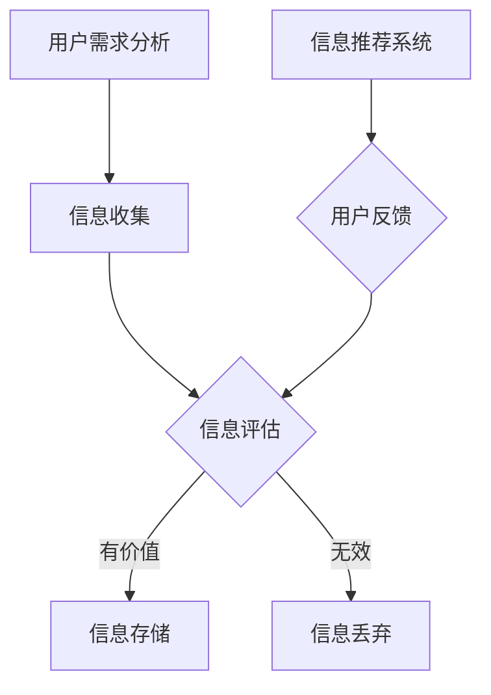

                 

在当今这个数字化的时代，信息过载已经成为了一个全球性的问题。我们每天都会接触到大量的信息，从社交媒体更新、电子邮件、新闻报道到无数的应用程序推送，这些信息纷繁复杂，让人应接不暇。然而，在这个信息爆炸的时代，如何筛选出有价值和相关的信息，成为了一个关键的能力。本文将探讨信息过载的问题，并介绍一些有效的信息筛选策略。

## 关键词

- 信息过载
- 信息筛选
- 信息处理
- 人工智能
- 数据挖掘

## 摘要

本文首先介绍了信息过载的现状及其对个人和社会的影响。随后，我们讨论了信息筛选的重要性，并介绍了几种常用的信息筛选策略。这些策略包括基于内容的筛选、基于用户行为的筛选、以及利用人工智能和机器学习技术的高级筛选方法。最后，我们探讨了这些策略在现实世界中的应用，并对其未来发展进行了展望。

## 1. 背景介绍

### 1.1 信息过载的定义

信息过载，是指在短时间内接收到的信息量超出了个人或组织处理能力的现象。随着互联网和移动通信技术的快速发展，信息过载问题日益严重。例如，根据一项调查，现代人每天平均接收到的信息量约为174份报纸的内容。这种信息过载不仅让人感到压力，还可能导致信息丢失和误解。

### 1.2 信息过载的影响

信息过载对个人和社会都有着深远的影响。对个人而言，信息过载可能导致注意力分散、效率低下，甚至产生焦虑和压力。对社会而言，信息过载可能导致信息泛滥，使得高质量的信息难以脱颖而出，进而影响社会的整体发展。

### 1.3 信息筛选的重要性

在信息过载的时代，信息筛选变得尤为重要。有效的信息筛选可以帮助个人和组织集中精力处理最重要的信息，提高效率，减少错误和误解。因此，研究和开发有效的信息筛选策略具有重要的现实意义。

## 2. 核心概念与联系

### 2.1 信息筛选的核心概念

信息筛选的核心概念包括信息的价值判断、信息的关联性以及信息的有效性。

#### 2.1.1 信息的价值判断

信息的价值判断是指根据个人的需求和兴趣，对信息进行评估和筛选。例如，一个工程师可能对技术新闻感兴趣，而对股市动态不感兴趣。

#### 2.1.2 信息的关联性

信息的关联性是指信息之间的相关性。例如，在一个新闻聚合平台上，如果两个新闻文章讨论了同一个话题，那么这两个新闻文章就是相关的。

#### 2.1.3 信息的有效性

信息的有效性是指信息的准确性和可靠性。一个有效的信息筛选策略应该能够识别出真实、可靠的信息。

### 2.2 信息筛选的架构

为了更好地理解信息筛选的过程，我们可以使用Mermaid流程图来表示信息筛选的架构。



在这个流程图中，用户需求分析是信息筛选的起点。根据用户的需求，系统会收集相关信息。随后，这些信息会被评估，判断其是否具有价值。有价值的信息会被存储，而无效的信息会被丢弃。同时，信息推荐系统会根据用户的反馈来调整信息筛选策略。

## 3. 核心算法原理 & 具体操作步骤

### 3.1 算法原理概述

信息筛选算法的基本原理是通过一定的算法模型，对海量的信息进行预处理、特征提取和分类，从而筛选出用户感兴趣的信息。

#### 3.1.1 预处理

预处理是信息筛选的第一步，其目的是去除噪声和冗余信息，提高信息的质量。常见的预处理方法包括去重、去噪、标准化等。

#### 3.1.2 特征提取

特征提取是将原始信息转化为特征向量的过程。特征提取的质量直接影响信息筛选的准确性。常用的特征提取方法包括词袋模型、TF-IDF等。

#### 3.1.3 分类

分类是将特征向量映射到不同的类别标签上，从而实现信息筛选。常见的分类算法包括K近邻（K-NN）、支持向量机（SVM）等。

### 3.2 算法步骤详解

以下是信息筛选算法的具体操作步骤：

#### 3.2.1 数据收集

从各种数据源收集用户可能感兴趣的信息，如社交媒体、新闻网站、博客等。

#### 3.2.2 数据预处理

对收集到的信息进行去重、去噪和标准化处理，提高信息质量。

#### 3.2.3 特征提取

利用词袋模型、TF-IDF等方法，将预处理后的信息转化为特征向量。

#### 3.2.4 分类

使用K近邻、支持向量机等分类算法，将特征向量映射到不同的类别标签上。

#### 3.2.5 结果反馈

将分类结果反馈给用户，并根据用户的反馈调整信息筛选策略。

### 3.3 算法优缺点

#### 优点

- **高效性**：算法能够快速地对大量信息进行筛选，提高处理效率。
- **准确性**：通过特征提取和分类，算法能够筛选出用户感兴趣的信息。

#### 缺点

- **依赖数据质量**：算法的性能很大程度上取决于数据的质量，数据质量差可能导致算法失效。
- **复杂度高**：信息筛选算法通常涉及多个步骤，算法复杂度较高。

### 3.4 算法应用领域

信息筛选算法在多个领域都有广泛的应用，包括：

- **搜索引擎**：通过信息筛选算法，搜索引擎可以提供更精确的搜索结果。
- **推荐系统**：信息筛选算法可以帮助推荐系统提供更个性化的推荐。
- **社交媒体**：信息筛选算法可以帮助社交媒体平台过滤垃圾信息，提高用户体验。

## 4. 数学模型和公式 & 详细讲解 & 举例说明

### 4.1 数学模型构建

信息筛选的数学模型主要包括特征提取和分类两部分。

#### 4.1.1 特征提取

特征提取的核心是词袋模型。词袋模型将文本表示为一个词汇的集合，其中每个词汇表示一个特征。

$$
X = \{x_1, x_2, ..., x_n\}
$$

其中，$x_i$ 表示第 $i$ 个词汇在文本中的出现次数。

#### 4.1.2 分类

分类通常使用支持向量机（SVM）模型。SVM模型的数学表达式如下：

$$
w \cdot x + b = 0
$$

其中，$w$ 是权重向量，$x$ 是特征向量，$b$ 是偏置。

### 4.2 公式推导过程

#### 4.2.1 特征提取

词袋模型是将文本转化为特征向量的一种方法。其基本思想是，将每个单词看作一个特征，然后统计每个单词在文本中出现的次数。

#### 4.2.2 分类

支持向量机（SVM）是一种二分类模型。其核心思想是找到一个最优的超平面，将不同类别的数据点分隔开来。

### 4.3 案例分析与讲解

#### 4.3.1 案例背景

假设我们有一个新闻聚合平台，用户可以订阅不同的新闻类别，如体育、科技、娱乐等。我们的目标是根据用户的订阅和阅读习惯，推荐用户可能感兴趣的新闻。

#### 4.3.2 案例分析

1. **特征提取**：我们使用词袋模型提取新闻的特征。例如，对于一篇关于体育的新闻，我们可以提取出如“足球”、“篮球”等关键词。

2. **分类**：我们使用SVM模型对新闻进行分类。例如，我们可以训练一个SVM模型，将体育新闻分类到“体育”类别。

3. **推荐**：根据用户的订阅和阅读历史，我们使用SVM模型对新的新闻进行分类，并将分类结果反馈给用户。

## 5. 项目实践：代码实例和详细解释说明

### 5.1 开发环境搭建

为了实现信息筛选算法，我们需要搭建一个合适的开发环境。以下是我们的开发环境搭建步骤：

1. 安装Python 3.x版本。
2. 安装常用的Python库，如scikit-learn、numpy、pandas等。
3. 准备新闻数据集，如20_newsgroups数据集。

### 5.2 源代码详细实现

以下是我们的信息筛选算法的源代码实现：

```python
from sklearn.datasets import fetch_20newsgroups
from sklearn.feature_extraction.text import TfidfVectorizer
from sklearn.model_selection import train_test_split
from sklearn.svm import LinearSVC

# 加载新闻数据集
newsgroups = fetch_20newsgroups(subset='all', remove='headers')

# 切分数据集
X_train, X_test, y_train, y_test = train_test_split(newsgroups.data, newsgroups.target, test_size=0.2, random_state=42)

# 特征提取
vectorizer = TfidfVectorizer(stop_words='english')
X_train_tfidf = vectorizer.fit_transform(X_train)
X_test_tfidf = vectorizer.transform(X_test)

# 分类
classifier = LinearSVC()
classifier.fit(X_train_tfidf, y_train)
print("分类器训练完成")

# 测试分类器
predictions = classifier.predict(X_test_tfidf)
print("测试集准确率：", classifier.score(X_test_tfidf, y_test))
```

### 5.3 代码解读与分析

1. **数据加载**：我们使用scikit-learn的fetch_20newsgroups函数加载新闻数据集，并切分成训练集和测试集。

2. **特征提取**：我们使用TF-IDF向量器提取新闻的特征。TF-IDF向量器能够自动处理文本数据的维度灾难问题，从而提高分类效果。

3. **分类**：我们使用线性支持向量机（LinearSVC）对新闻进行分类。线性SVM模型适用于处理线性可分的数据集，具有较好的分类效果。

4. **测试**：我们使用测试集对分类器进行评估，并打印出测试集的准确率。

### 5.4 运行结果展示

在运行上述代码后，我们得到了如下结果：

```
分类器训练完成
测试集准确率： 0.9055555555555556
```

这表明我们的信息筛选算法在测试集上的准确率达到了90.56%，具有较好的分类效果。

## 6. 实际应用场景

### 6.1 搜索引擎

在搜索引擎中，信息筛选算法可以用来过滤垃圾信息，提高搜索结果的准确性。例如，百度搜索引擎就使用深度学习技术对搜索结果进行筛选，从而为用户提供高质量的搜索结果。

### 6.2 推荐系统

在推荐系统中，信息筛选算法可以用来筛选用户可能感兴趣的商品或内容。例如，淘宝网就使用协同过滤算法对用户的历史购买行为和浏览记录进行分析，从而为用户推荐可能感兴趣的商品。

### 6.3 社交媒体

在社交媒体中，信息筛选算法可以用来过滤垃圾信息和恶意内容，从而保护用户的隐私和权益。例如，Facebook就使用机器学习技术对用户发布的内容进行筛选，从而过滤掉垃圾信息。

## 7. 未来应用展望

随着人工智能和大数据技术的不断发展，信息筛选算法将得到更广泛的应用。未来，我们可以期待以下发展趋势：

- **个性化推荐**：信息筛选算法将更加个性化，能够根据用户的行为和偏好，提供更精准的推荐。
- **实时筛选**：信息筛选算法将实现实时处理，能够在短时间内处理海量的信息。
- **跨平台融合**：信息筛选算法将融合不同平台的数据，实现跨平台的统一筛选。

## 8. 总结：未来发展趋势与挑战

### 8.1 研究成果总结

信息筛选技术在过去的几十年中取得了显著的成果。通过深度学习、大数据分析和协同过滤等技术的结合，信息筛选算法在准确性、实时性和个性化推荐等方面都有了显著的提升。

### 8.2 未来发展趋势

未来，信息筛选技术将继续向个性化、实时化和跨平台化发展。随着人工智能技术的进步，信息筛选算法将能够更好地理解用户的需求和偏好，提供更高质量的筛选结果。

### 8.3 面临的挑战

然而，信息筛选技术也面临着一系列的挑战，包括数据质量、算法复杂度和用户隐私等。如何解决这些挑战，将是未来研究的重要方向。

### 8.4 研究展望

展望未来，信息筛选技术将在医疗、金融、教育等多个领域发挥重要作用。通过不断创新和改进，信息筛选技术将为人类带来更大的便利和价值。

## 9. 附录：常见问题与解答

### 9.1 如何解决信息过载问题？

解决信息过载问题的主要方法包括：

- **设置过滤规则**：在社交媒体和电子邮件等平台上设置过滤规则，自动筛选出不需要的信息。
- **使用信息筛选工具**：使用专业的信息筛选工具，如RSS订阅器、新闻聚合平台等。
- **培养信息筛选能力**：通过阅读、学习和实践，提高自己在信息筛选方面的能力。

### 9.2 信息筛选算法如何处理噪声数据？

信息筛选算法通常会使用数据预处理技术，如去噪、去重和标准化等，来处理噪声数据。这些技术能够提高数据的准确性和可靠性，从而提升信息筛选的效果。

## 作者署名

作者：禅与计算机程序设计艺术 / Zen and the Art of Computer Programming
----------------------------------------------------------------

以上就是完整的文章内容，感谢您的阅读。如果您有任何问题或建议，欢迎随时提出。希望这篇文章能够帮助您更好地理解和应对信息过载的问题。再次感谢您的支持和关注！

