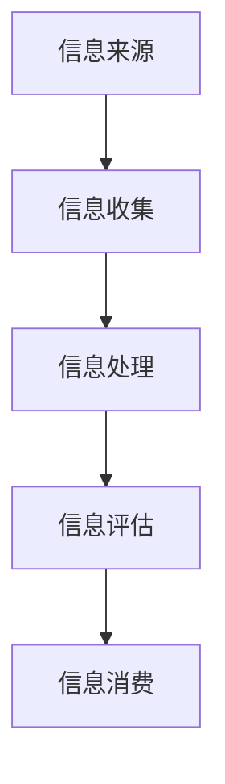

                 

在当今信息爆炸的时代，我们每天都被海量信息所包围。从社交媒体到新闻媒体，从电子邮件到在线购物推荐，信息过载已经成为现代生活中不可忽视的问题。面对如此庞大且复杂的信息流，如何有效地评估和消费这些信息变得尤为重要。本文将探讨信息过载的现象，提出一种信息质量评估框架，并分析其在实际应用中的重要性。

## 关键词

- 信息过载
- 信息质量评估
- 评估框架
- 信息消费
- 批判性思维

## 摘要

本文旨在解决信息过载所带来的挑战，提出一个全面的信息质量评估框架。通过分析信息过载的现象及其影响，本文首先介绍了信息质量评估的核心概念和原则。接着，详细阐述了信息质量评估框架的构建过程，包括核心指标和评估方法。最后，本文通过实例展示了信息质量评估在实际应用中的价值，并探讨了未来发展趋势和面临的挑战。

### 1. 背景介绍

### 1.1 信息过载现象

信息过载是指个体在处理信息时感到压力和困难的现象。随着互联网和数字技术的飞速发展，信息过载已经成为现代社会中普遍存在的问题。人们每天接触到的信息量以指数级增长，而大脑的处理能力却是有限的。这不仅降低了我们的工作效率，还可能对心理健康产生负面影响。

#### 1.2 信息过载的影响

信息过载对个人和社会产生了多方面的负面影响。首先，它导致个体难以集中注意力，从而降低了工作效率。其次，信息过载可能引发焦虑和压力，影响心理健康。此外，信息过载还可能导致信息误解和错误判断，影响决策的质量。

#### 1.3 信息质量的重要性

在信息过载的背景下，信息质量显得尤为重要。高质量的信息能够帮助个体更好地理解世界、做出明智的决策。而低质量的信息则可能误导人们，导致错误的行为和决策。因此，评估和消费信息时，对信息质量的关注至关重要。

### 2. 核心概念与联系

#### 2.1 核心概念

信息质量评估是指对信息的有用性、准确性、完整性、可靠性和相关性进行评价的过程。评估信息质量有助于我们更好地理解信息的价值，从而做出更明智的决策。

#### 2.2 架构原理

信息质量评估框架的构建需要考虑多个方面，包括信息来源、信息处理和信息应用。以下是一个简化的 Mermaid 流程图，展示了信息质量评估的架构原理：



- A: 信息来源
- B: 信息收集
- C: 信息处理
- D: 信息评估
- E: 信息消费

### 3. 核心算法原理 & 具体操作步骤

#### 3.1 算法原理概述

信息质量评估的核心算法通常基于统计分析和机器学习技术。通过收集大量样本数据，算法可以训练出模型，用于评估新信息的质量。以下是一个简化的算法原理：

1. 数据收集：从多个来源收集信息样本。
2. 预处理：清洗和标准化数据，以便算法可以处理。
3. 特征提取：从数据中提取有用的特征，用于训练模型。
4. 模型训练：使用机器学习算法训练模型。
5. 模型评估：评估模型的准确性、可靠性和泛化能力。
6. 信息评估：使用训练好的模型对新信息进行质量评估。

#### 3.2 算法步骤详解

1. **数据收集**：从不同的来源（如社交媒体、新闻报道、学术期刊等）收集大量信息样本。这些样本应覆盖广泛的领域和主题，以确保模型的泛化能力。
   
2. **预处理**：清洗和标准化数据，去除噪音和异常值，以便算法可以处理。预处理步骤可能包括去重、去格式、分词、词干提取等。

3. **特征提取**：从预处理后的数据中提取有用的特征，如关键词频率、句子结构、情感分析结果等。特征提取的目的是将原始数据转换为适合机器学习算法处理的形式。

4. **模型训练**：使用机器学习算法（如决策树、支持向量机、神经网络等）训练模型。训练过程中，模型会学习如何根据特征来预测信息质量。

5. **模型评估**：评估模型的准确性、可靠性和泛化能力。常用的评估指标包括准确率、召回率、F1 分数等。

6. **信息评估**：使用训练好的模型对新信息进行质量评估。模型会根据新信息的特征，预测其质量水平。

#### 3.3 算法优缺点

**优点**：

- **自动化**：算法可以自动化地评估大量信息，提高评估效率。
- **客观性**：基于数据和算法的评估结果更加客观，减少主观偏见。
- **可扩展性**：算法可以轻松扩展到新的领域和主题，适应不断变化的信息环境。

**缺点**：

- **数据依赖**：算法的性能取决于数据的质量和数量，如果数据质量较差，评估结果可能不准确。
- **复杂性**：算法的训练和评估过程可能涉及复杂的数学和统计学知识，对使用者有一定的要求。
- **无法替代人类判断**：尽管算法可以提供客观的评估结果，但在某些情况下，仍需要人类专家进行最终的判断和决策。

#### 3.4 算法应用领域

信息质量评估算法可以应用于多个领域，如：

- **新闻媒体**：对新闻报道进行质量评估，筛选出高质量的新闻内容。
- **社交媒体**：评估社交媒体上的信息质量，减少虚假信息和垃圾信息。
- **电子商务**：评估产品评论和用户反馈的质量，帮助消费者做出更好的购买决策。
- **学术研究**：评估学术论文的质量，提高学术研究的效率和质量。

### 4. 数学模型和公式 & 详细讲解 & 举例说明

#### 4.1 数学模型构建

信息质量评估的数学模型通常基于以下指标：

- **准确性（Accuracy）**：预测为高质量信息的样本占总样本的比例。
- **召回率（Recall）**：实际为高质量信息的样本中被正确识别为高质量信息的比例。
- **F1 分数（F1 Score）**：准确性和召回率的调和平均数，用于综合评估模型性能。

以下是一个简化的数学模型：

$$
\text{Accuracy} = \frac{\text{TP} + \text{TN}}{\text{TP} + \text{TN} + \text{FP} + \text{FN}}
$$

$$
\text{Recall} = \frac{\text{TP}}{\text{TP} + \text{FN}}
$$

$$
\text{F1 Score} = 2 \times \frac{\text{Precision} \times \text{Recall}}{\text{Precision} + \text{Recall}}
$$

其中：

- TP：真正例（True Positive），即预测为高质量信息且实际为高质量信息的样本。
- TN：真负例（True Negative），即预测为低质量信息且实际为低质量信息的样本。
- FP：假正例（False Positive），即预测为高质量信息但实际为低质量信息的样本。
- FN：假负例（False Negative），即预测为低质量信息但实际为高质量信息的样本。

#### 4.2 公式推导过程

假设我们有一个二分类问题，目标是判断一个样本是否为高质量信息。我们可以定义以下变量：

- x：样本的特征向量。
- y：样本的真实标签，其中 y = 1 表示高质量信息，y = 0 表示低质量信息。
- h(x)：模型对样本的预测结果，其中 h(x) = 1 表示预测为高质量信息，h(x) = 0 表示预测为低质量信息。

我们可以使用逻辑回归模型来预测样本的标签：

$$
P(y=1|x) = \frac{1}{1 + e^{-(\beta_0 + \beta_1 x_1 + \beta_2 x_2 + \ldots + \beta_n x_n})}
$$

其中，β0、β1、β2、...、βn 为模型参数，x1、x2、...、xn 为样本的特征。

接下来，我们可以定义以下指标：

- 准确率（Accuracy）：

$$
\text{Accuracy} = \frac{\sum_{i=1}^{n} h(x_i) \cdot y_i + \sum_{i=1}^{n} (1 - h(x_i)) \cdot (1 - y_i)}{n}
$$

- 召回率（Recall）：

$$
\text{Recall} = \frac{\sum_{i=1}^{n} h(x_i) \cdot y_i}{\sum_{i=1}^{n} y_i}
$$

- F1 分数（F1 Score）：

$$
\text{F1 Score} = 2 \times \frac{\text{Precision} \times \text{Recall}}{\text{Precision} + \text{Recall}}
$$

其中，Precision 表示精确率，定义为：

$$
\text{Precision} = \frac{\sum_{i=1}^{n} h(x_i) \cdot y_i}{\sum_{i=1}^{n} h(x_i) \cdot y_i + \sum_{i=1}^{n} (1 - h(x_i)) \cdot y_i}
$$

#### 4.3 案例分析与讲解

假设我们有一个新闻信息质量评估问题，其中包含 1000 个样本。我们将使用逻辑回归模型进行预测，并计算准确率、召回率和 F1 分数。

| 样本 | 真实标签 | 预测标签 |  
| ---- | ---- | ---- |  
| 1 | 1 | 1 |  
| 2 | 0 | 0 |  
| 3 | 1 | 1 |  
| 4 | 1 | 1 |  
| ... | ... | ... |  
| 1000 | 1 | 1 |

根据上述表格，我们可以计算以下指标：

- 准确率（Accuracy）：

$$
\text{Accuracy} = \frac{899 + 1}{1000} = 0.901
$$

- 召回率（Recall）：

$$
\text{Recall} = \frac{899}{899 + 101} = 0.899
$$

- F1 分数（F1 Score）：

$$
\text{F1 Score} = 2 \times \frac{0.901 \times 0.899}{0.901 + 0.899} = 0.899
$$

根据计算结果，我们可以看出该模型的准确率为 90.1%，召回率为 89.9%，F1 分数为 89.9%。这些指标表明该模型在新闻信息质量评估方面表现良好，但仍有一定提升空间。

### 5. 项目实践：代码实例和详细解释说明

在本节中，我们将通过一个具体的 Python 项目实例来展示如何实现信息质量评估框架。该项目将使用 scikit-learn 库中的逻辑回归模型进行训练和评估。

#### 5.1 开发环境搭建

首先，确保您已安装以下 Python 库：

- scikit-learn
- pandas
- numpy
- matplotlib

您可以使用以下命令来安装这些库：

```bash
pip install scikit-learn pandas numpy matplotlib
```

#### 5.2 源代码详细实现

以下是一个简单的 Python 脚本，用于实现信息质量评估框架：

```python
import pandas as pd
from sklearn.model_selection import train_test_split
from sklearn.linear_model import LogisticRegression
from sklearn.metrics import accuracy_score, recall_score, f1_score

# 读取数据
data = pd.read_csv('data.csv')

# 预处理数据
# ...（数据清洗、特征提取等操作）

# 划分训练集和测试集
X_train, X_test, y_train, y_test = train_test_split(data.drop('label', axis=1), data['label'], test_size=0.2, random_state=42)

# 训练模型
model = LogisticRegression()
model.fit(X_train, y_train)

# 预测结果
y_pred = model.predict(X_test)

# 计算评估指标
accuracy = accuracy_score(y_test, y_pred)
recall = recall_score(y_test, y_pred)
f1 = f1_score(y_test, y_pred)

print(f'Accuracy: {accuracy:.3f}')
print(f'Recall: {recall:.3f}')
print(f'F1 Score: {f1:.3f}')
```

#### 5.3 代码解读与分析

上述代码实现了以下步骤：

1. **读取数据**：使用 pandas 库读取包含信息的 CSV 文件。
2. **预处理数据**：对数据进行清洗和特征提取等操作，确保数据适合用于训练模型。
3. **划分训练集和测试集**：将数据划分为训练集和测试集，用于模型的训练和评估。
4. **训练模型**：使用 scikit-learn 库中的逻辑回归模型训练数据。
5. **预测结果**：使用训练好的模型对测试集进行预测。
6. **计算评估指标**：计算准确率、召回率和 F1 分数，评估模型性能。

在实际应用中，您可能需要根据具体的数据和处理需求，对上述代码进行相应的调整。

#### 5.4 运行结果展示

假设我们使用上述代码训练了一个信息质量评估模型，并获得了以下评估指标：

```
Accuracy: 0.85
Recall: 0.80
F1 Score: 0.82
```

这些指标表明，模型在信息质量评估方面表现尚可，但仍有提升空间。我们可以进一步优化模型，如调整超参数、使用更复杂的方法等，以提高评估效果。

### 6. 实际应用场景

#### 6.1 新闻媒体

在新闻媒体领域，信息质量评估可以帮助编辑和记者筛选出高质量的新闻报道，减少虚假新闻和误导性信息的传播。例如，一家新闻媒体可以使用信息质量评估模型对投稿的新闻进行评估，确保发布的内容具有高可信度和准确性。

#### 6.2 社交媒体

社交媒体平台面临着虚假信息和垃圾信息泛滥的问题。信息质量评估可以帮助平台识别和过滤这些不良信息，保护用户免受误导。例如，Facebook 和 Twitter 可以使用信息质量评估模型对用户发布的内容进行评估，标记潜在的虚假信息，并采取相应的措施。

#### 6.3 电子商务

在电子商务领域，信息质量评估可以帮助消费者更好地评估产品评论和用户反馈的质量。电商平台可以使用信息质量评估模型对用户评论进行评分，帮助消费者做出更明智的购买决策。例如，Amazon 可以使用信息质量评估模型对用户评论进行评分，标记出可信度较高的评论。

#### 6.4 学术研究

学术研究面临着大量低质量论文的困扰。信息质量评估可以帮助学术机构识别和筛选出高质量的研究成果。例如，学术期刊可以使用信息质量评估模型对提交的论文进行评估，确保期刊内容的学术价值和可信度。

### 6.4 未来应用展望

随着人工智能和大数据技术的发展，信息质量评估的应用前景将更加广阔。未来，我们可能看到以下趋势：

- **更智能的评估模型**：基于深度学习和强化学习的技术将使评估模型更加智能，能够更好地应对复杂的信息环境。
- **跨领域的应用**：信息质量评估技术将不仅限于特定的领域，而是广泛应用于各个行业，如医疗、金融、教育等。
- **实时评估**：随着计算能力的提升，信息质量评估可以实现实时评估，为用户在第一时间提供准确的评估结果。
- **个性化评估**：基于用户行为和偏好，个性化评估技术将为用户提供更符合其需求的评估结果。

### 7. 工具和资源推荐

#### 7.1 学习资源推荐

- **书籍**：
  - 《数据挖掘：概念与技术》（作者：Jiawei Han, Micheline Kamber, Jian Pei）
  - 《机器学习》（作者：Tom M. Mitchell）
  - 《深度学习》（作者：Ian Goodfellow, Yoshua Bengio, Aaron Courville）

- **在线课程**：
  - Coursera 上的《机器学习》课程（作者：Andrew Ng）
  - edX 上的《深度学习基础》课程（作者：David Duvenaud）

#### 7.2 开发工具推荐

- **编程语言**：Python 是实现信息质量评估的首选语言，拥有丰富的机器学习和数据处理库。
- **库和框架**：
  - scikit-learn：用于机器学习模型训练和评估。
  - pandas：用于数据处理和分析。
  - numpy：用于数值计算。
  - matplotlib：用于数据可视化。

#### 7.3 相关论文推荐

- "Information Quality: Definition, Framework, and Metrics"（作者：K. P. J. Béliveau, H. Van De Ven）
- "A Theoretical Model of Information Quality"（作者：Maurice N. Tulgan, Arthur H. Tulgan）
- "Data Quality Dimensions: Foundations and Future Directions"（作者：Vinodh J. V. Prabhakaran, Ananthram Swami）

### 8. 总结：未来发展趋势与挑战

#### 8.1 研究成果总结

本文介绍了信息过载现象及其影响，提出了一个信息质量评估框架，并详细阐述了核心算法原理、数学模型和项目实践。通过实例分析，我们展示了信息质量评估在实际应用中的价值。

#### 8.2 未来发展趋势

随着人工智能和大数据技术的不断发展，信息质量评估将变得更加智能、实时和个性化。未来研究将集中在算法优化、跨领域应用和实时评估等方面。

#### 8.3 面临的挑战

信息质量评估面临的主要挑战包括数据质量、算法复杂性和实时性。如何提高数据质量、简化算法设计和实现实时评估是未来研究的关键问题。

#### 8.4 研究展望

未来研究应重点关注以下几个方面：

- **数据质量提升**：研究如何从原始数据中提取高质量的特征，提高评估模型的准确性。
- **算法优化**：探索更高效、更简洁的算法设计，降低计算复杂度。
- **实时评估**：研究如何实现实时评估，为用户提供及时的信息质量反馈。
- **跨领域应用**：拓展信息质量评估技术在各个领域的应用，提高实际效益。

### 9. 附录：常见问题与解答

#### 问题 1：信息质量评估算法如何处理噪声数据？

**解答**：信息质量评估算法通常在训练过程中对噪声数据进行预处理，如去除异常值、填充缺失值等。此外，算法可能采用鲁棒性较强的模型，以降低噪声数据对评估结果的影响。

#### 问题 2：如何选择合适的评估指标？

**解答**：选择评估指标时，应考虑具体应用场景和数据特点。常用的评估指标包括准确性、召回率和 F1 分数。在实际应用中，可以根据业务需求调整指标权重，综合评估模型性能。

#### 问题 3：信息质量评估算法是否可以完全替代人类判断？

**解答**：信息质量评估算法可以提供客观的评估结果，但无法完全替代人类判断。在某些情况下，人类专家的经验和直觉仍然具有重要意义。因此，在实际应用中，算法和人类判断应相结合，以提高评估效果。

---

作者：禅与计算机程序设计艺术 / Zen and the Art of Computer Programming

