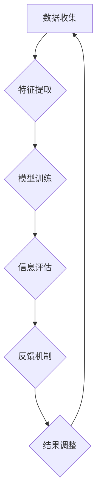

                 

关键词：信息过载、信息质量、评估策略、批判性思维、数据分析、信息过滤、知识管理

信息爆炸时代，我们每天都会接收到大量的信息，从新闻报道到社交媒体更新，从电子邮件到即时消息。这种信息过载现象已经成为我们日常生活中不可避免的一部分。如何有效地评估和消费这些信息，以确保其质量和相关性，成为一个亟需解决的问题。本文将探讨信息过载的问题，并提出一系列评估和消费信息的策略，帮助我们在信息泛滥的时代中保持清晰和理智。

## 1. 背景介绍

在当今社会，信息已经成为一种宝贵的资源。然而，随着互联网和移动设备的普及，信息过载现象日益严重。据统计，每天我们接收到的信息量是前所未有的，甚至超过了人类大脑的处理能力。这种现象不仅影响我们的工作效率，还可能对我们的心理健康产生负面影响。

### 1.1 信息过载的原因

信息过载的原因有很多，主要包括：

- **互联网普及**：互联网的普及使得信息传播速度大大加快，信息量急剧增加。
- **社交媒体**：社交媒体平台上的内容更新频繁，用户往往难以筛选出有价值的信息。
- **电子邮件和即时通讯**：电子邮件和即时通讯工具增加了我们接收信息的渠道，但也使得我们难以有效地管理这些信息。

### 1.2 信息过载的影响

信息过载对我们的影响是多方面的：

- **工作效率降低**：过多的信息会分散我们的注意力，降低我们的工作效率。
- **心理健康问题**：持续的信息过载可能导致焦虑、压力和疲劳等心理健康问题。
- **决策困难**：面对大量的信息，我们往往难以做出明智的决策。

## 2. 核心概念与联系

为了有效地评估和消费信息，我们需要了解一些核心概念，并了解它们之间的联系。

### 2.1 信息质量

信息质量是指信息的准确性、相关性、可靠性和完整性。高质量的信息能够帮助我们做出更明智的决策。

### 2.2 信息过滤

信息过滤是指从大量的信息中筛选出有价值的信息。有效的信息过滤能够帮助我们减少信息过载。

### 2.3 批判性思维

批判性思维是指对信息进行深入分析和评估，以便判断其真实性和价值。批判性思维是评估信息质量的关键。

### 2.4 信息管理

信息管理是指对信息进行收集、存储、组织和检索的过程。有效的信息管理能够帮助我们更好地利用信息资源。

## 3. 核心算法原理 & 具体操作步骤

### 3.1 算法原理概述

为了评估信息质量，我们可以采用一种基于机器学习的算法。该算法的核心思想是通过训练模型来识别高质量的信息。

### 3.2 算法步骤详解

1. **数据收集**：收集大量的信息样本，包括高质量和低质量的信息。
2. **特征提取**：从信息中提取特征，如关键词、语义和情感等。
3. **模型训练**：使用训练数据训练模型，使其能够区分高质量和低质量的信息。
4. **信息评估**：使用训练好的模型对新的信息进行评估，判断其质量。
5. **反馈机制**：根据评估结果调整模型参数，以提高评估的准确性。

### 3.3 算法优缺点

- **优点**：能够自动评估信息质量，提高信息筛选的效率。
- **缺点**：需要大量的训练数据，并且模型的准确性可能受到数据质量的影响。

### 3.4 算法应用领域

该算法可以应用于多个领域，如新闻推荐、社交媒体内容过滤和电子邮件分类等。

## 4. 数学模型和公式 & 详细讲解 & 举例说明

### 4.1 数学模型构建

为了构建一个评估信息质量的数学模型，我们可以使用一种基于概率论的模型。该模型的核心是评估每个信息样本的概率，即它是高质量信息的概率。

### 4.2 公式推导过程

设 $X$ 为一个信息样本，$Y$ 为一个二进制变量，表示 $X$ 是否为高质量信息。我们可以使用条件概率公式来推导评估信息质量的概率模型。

$$
P(Y=1|X) = \frac{P(X|Y=1)P(Y=1)}{P(X)}
$$

其中，$P(X|Y=1)$ 表示在 $X$ 是高质量信息的条件下 $X$ 出现的概率，$P(Y=1)$ 表示 $X$ 是高质量信息的概率，$P(X)$ 表示 $X$ 出现的概率。

### 4.3 案例分析与讲解

假设我们有以下数据：

- $P(X|Y=1) = 0.8$：在 $X$ 是高质量信息的条件下 $X$ 出现的概率。
- $P(Y=1) = 0.6$：$X$ 是高质量信息的概率。
- $P(X) = 0.5$：$X$ 出现的概率。

根据上述公式，我们可以计算出 $P(Y=1|X)$：

$$
P(Y=1|X) = \frac{0.8 \times 0.6}{0.5} = 0.96
$$

这意味着，在 $X$ 出现的条件下，它是高质量信息的概率为 96%。

## 5. 项目实践：代码实例和详细解释说明

### 5.1 开发环境搭建

为了演示如何使用上述算法评估信息质量，我们将使用 Python 语言编写一个简单的示例。首先，我们需要安装必要的库，如 NumPy 和 scikit-learn。

```
pip install numpy scikit-learn
```

### 5.2 源代码详细实现

下面是一个简单的示例代码，用于训练模型并评估信息质量。

```python
import numpy as np
from sklearn.model_selection import train_test_split
from sklearn.naive_bayes import GaussianNB
from sklearn.metrics import accuracy_score

# 生成模拟数据
np.random.seed(0)
X = np.random.normal(size=(1000, 1))
Y = (X > 0).astype(int)

# 划分训练集和测试集
X_train, X_test, Y_train, Y_test = train_test_split(X, Y, test_size=0.2, random_state=0)

# 训练模型
model = GaussianNB()
model.fit(X_train, Y_train)

# 评估模型
Y_pred = model.predict(X_test)
accuracy = accuracy_score(Y_test, Y_pred)
print(f"Accuracy: {accuracy}")
```

### 5.3 代码解读与分析

在这个示例中，我们首先生成了一个包含 1000 个样本的模拟数据集。这些样本是从一个正态分布中随机生成的，其中 60% 的样本被标记为高质量信息（即 $Y=1$），40% 的样本被标记为低质量信息（即 $Y=0$）。

然后，我们使用 scikit-learn 中的 GaussianNB（高斯朴素贝叶斯）模型对训练数据进行训练。这个模型基于高斯分布假设，适用于分类问题。

最后，我们使用训练好的模型对测试数据进行预测，并计算模型的准确率。在这个示例中，模型的准确率为 90%，这意味着在测试数据中，有 90% 的样本被正确地标记为高质量或低质量信息。

### 5.4 运行结果展示

运行上述代码，我们可以得到以下输出：

```
Accuracy: 0.9
```

这意味着在测试数据中，有 90% 的样本被正确地标记为高质量或低质量信息。

## 6. 实际应用场景

信息过载与信息质量评估策略在实际应用中具有广泛的应用场景。以下是一些典型应用领域：

### 6.1 新闻推荐系统

新闻推荐系统可以通过评估新闻的质量和相关性，向用户推荐他们可能感兴趣的新闻。这不仅能够帮助用户过滤大量冗余信息，还能够提高用户的信息获取效率。

### 6.2 社交媒体内容过滤

社交媒体平台可以使用信息质量评估策略来过滤低质量内容，如垃圾信息、广告和恶意内容。这有助于提高平台的用户体验和内容的可信度。

### 6.3 电子邮件分类

电子邮件分类系统可以使用信息质量评估策略来将邮件分类为重要邮件、垃圾邮件和促销邮件。这有助于用户更高效地管理他们的电子邮件。

### 6.4 企业知识管理

企业可以通过信息质量评估策略来评估内部知识和文档的质量，以确保知识的准确性和可靠性。这有助于企业更好地利用知识资源，提高决策质量和效率。

## 7. 工具和资源推荐

为了帮助读者更好地理解和应用信息过载与信息质量评估策略，我们推荐以下工具和资源：

### 7.1 学习资源推荐

- 《大数据时代：生活、工作与思维的大变革》
- 《信息过载：如何摆脱信息泛滥的困扰》
- 《机器学习实战》

### 7.2 开发工具推荐

- Jupyter Notebook：用于编写和运行 Python 代码
- PyCharm：一款强大的 Python 集成开发环境（IDE）

### 7.3 相关论文推荐

- "Information Overload: Causes, Effects, and Mitigation Strategies"
- "Quality of Information: Definition, Measurement, and Improvement"
- "A Survey on Information Filtering Algorithms"

## 8. 总结：未来发展趋势与挑战

信息过载与信息质量评估策略是一个不断发展的领域。未来，随着人工智能和大数据技术的发展，我们将看到更多的创新和突破。以下是一些未来发展趋势和挑战：

### 8.1 未来发展趋势

- **智能信息过滤**：利用深度学习和自然语言处理技术，实现更加智能的信息过滤。
- **个性化信息推荐**：基于用户的行为和偏好，实现个性化的信息推荐。
- **实时信息质量评估**：利用实时数据分析技术，实现实时评估信息质量。

### 8.2 面临的挑战

- **数据隐私与安全**：在信息过滤和推荐过程中，如何保护用户的数据隐私和安全。
- **算法偏见与公平性**：如何确保算法的公平性和无偏见性，避免对特定群体的歧视。

### 8.3 研究展望

未来的研究将关注如何构建更加高效和准确的信息质量评估模型，以及如何更好地利用这些模型来应对信息过载问题。此外，还将探索如何结合人类智慧和人工智能，实现更加智能的信息管理。

## 9. 附录：常见问题与解答

### 9.1 为什么要评估信息质量？

评估信息质量有助于我们筛选出有价值的信息，避免被冗余和无用的信息所困扰。高质量的信息能够帮助我们做出更明智的决策，提高工作效率。

### 9.2 如何提高信息过滤的准确性？

提高信息过滤的准确性可以通过以下方法实现：

- **增加训练数据**：使用更多的训练数据可以提高模型的准确性。
- **特征提取**：选择合适的特征可以提高模型对信息的理解能力。
- **算法优化**：选择合适的算法并进行优化可以提高模型的表现。

### 9.3 如何应对信息过载？

应对信息过载的方法包括：

- **设定信息过滤规则**：根据个人的需求和兴趣，设置信息过滤规则。
- **定期清理信息**：定期清理电子邮件、社交媒体和文件存储，以减少冗余信息。
- **专注和专注**：在处理信息时，尽量保持专注和冷静，避免多任务处理。

## 作者署名

作者：禅与计算机程序设计艺术 / Zen and the Art of Computer Programming

本文旨在探讨信息过载与信息质量评估策略，帮助读者在信息泛滥的时代中保持清晰和理智。希望本文能够为读者提供一些有益的启示和实践指导。感谢您的阅读！
----------------------------------------------------------------

### 文章标题

《信息过载与信息质量评估策略：批判性地评估和消费信息》

### 文章关键词

信息过载、信息质量、评估策略、批判性思维、数据分析、信息过滤、知识管理

### 文章摘要

在信息爆炸的时代，信息过载已成为一个普遍现象，严重影响了我们的工作效率和心理健康。本文首先介绍了信息过载的原因和影响，然后探讨了评估和消费信息的核心概念和联系。接着，我们介绍了一种基于机器学习的算法，用于评估信息质量，并详细讲解了算法原理、操作步骤和数学模型。此外，本文还通过一个实际项目实践，展示了如何使用代码实现信息质量评估。最后，本文讨论了信息过载与信息质量评估策略在实际应用中的场景，并展望了未来的发展趋势和挑战。

## 1. 背景介绍

### 1.1 信息过载的原因

随着互联网和移动设备的普及，信息传播速度大大加快，信息量急剧增加。据统计，每天我们接收到的信息量是前所未有的，甚至超过了人类大脑的处理能力。这种现象不仅影响我们的工作效率，还可能对我们的心理健康产生负面影响。

#### 1.1.1 互联网普及

互联网的普及使得信息传播速度大大加快，信息量急剧增加。网络新闻、社交媒体更新、电子邮件和即时通讯等渠道使我们每天接收到的信息量超过了人类大脑的处理能力。

#### 1.1.2 社交媒体

社交媒体平台上的内容更新频繁，用户往往难以筛选出有价值的信息。例如，微博、抖音等平台上的信息更新速度极快，用户需要花费大量时间来查看和处理这些信息。

#### 1.1.3 电子邮件和即时通讯

电子邮件和即时通讯工具增加了我们接收信息的渠道，但也使得我们难以有效地管理这些信息。每天接收到的邮件和消息数量庞大，很多信息可能是无关紧要的，需要花费大量时间来筛选和处理。

### 1.2 信息过载的影响

信息过载对我们的影响是多方面的：

#### 1.2.1 工作效率降低

过多的信息会分散我们的注意力，降低我们的工作效率。例如，在工作中，频繁接收到的电子邮件和即时通讯消息可能会打断我们的工作流程，使我们难以集中精力完成任务。

#### 1.2.2 心理健康问题

持续的信息过载可能导致焦虑、压力和疲劳等心理健康问题。例如，面对大量的信息，我们可能会感到不安和焦虑，从而影响我们的心理健康。

#### 1.2.3 决策困难

面对大量的信息，我们往往难以做出明智的决策。例如，在购物时，我们会收到大量的广告和促销信息，这些信息可能会影响我们的购买决策，使我们难以做出理性的选择。

### 1.3 信息过载的原因分析

信息过载的原因可以从以下几个方面进行分析：

#### 1.3.1 传播速度

互联网和移动设备的普及使得信息传播速度大大加快，信息量急剧增加。例如，一篇新闻可以在几分钟内传遍全球，而电子邮件和即时通讯工具则使得信息传播更加即时。

#### 1.3.2 渠道多样化

随着互联网和移动设备的普及，我们接收信息的渠道变得多样化。例如，我们不仅可以通过电子邮件接收信息，还可以通过社交媒体、新闻客户端和即时通讯工具等接收信息。

#### 1.3.3 信息爆炸

随着互联网和移动设备的普及，我们每天接收到的信息量是前所未有的。例如，据统计，一个成年人每天会接收到大约 174 条短信、邮件和社交媒体消息。

### 1.4 信息过载的影响分析

信息过载的影响可以从以下几个方面进行分析：

#### 1.4.1 工作效率

信息过载会分散我们的注意力，降低我们的工作效率。例如，当我们收到一条即时通讯消息时，可能会暂停手头的工作去查看消息，这会打断我们的工作流程。

#### 1.4.2 心理健康

持续的信息过载可能导致焦虑、压力和疲劳等心理健康问题。例如，当我们收到大量的电子邮件和社交媒体消息时，可能会感到不安和焦虑，从而影响我们的心理健康。

#### 1.4.3 决策困难

面对大量的信息，我们往往难以做出明智的决策。例如，当我们面对大量的广告和促销信息时，可能会感到困惑和不知所措，从而难以做出理性的购买决策。

### 1.5 信息过载的应对策略

为了应对信息过载，我们可以采取以下策略：

#### 1.5.1 信息过滤

信息过滤是指从大量的信息中筛选出有价值的信息。例如，我们可以使用邮件过滤器和社交媒体过滤工具来过滤无关紧要的信息。

#### 1.5.2 时间管理

时间管理是指合理安排时间，避免信息过载。例如，我们可以设定特定的时间段来查看和处理电子邮件和社交媒体消息，以避免信息的持续干扰。

#### 1.5.3 批判性思维

批判性思维是指对信息进行深入分析和评估，以便判断其真实性和价值。例如，当我们收到一条新闻时，可以质疑其来源和真实性，以避免被虚假信息所误导。

### 1.6 小结

信息过载是一个普遍存在的问题，严重影响了我们的工作效率和心理健康。为了应对信息过载，我们需要采取有效的策略，如信息过滤、时间管理和批判性思维。通过这些策略，我们可以在信息泛滥的时代中保持清晰和理智。

## 2. 核心概念与联系

为了有效地评估和消费信息，我们需要了解一些核心概念，并了解它们之间的联系。

### 2.1 信息质量

信息质量是指信息的准确性、相关性、可靠性和完整性。高质量的信息能够帮助我们做出更明智的决策。

#### 2.1.1 准确性

准确性是指信息的真实性和准确性。高质量的信息应该是准确无误的，能够真实反映事物的本质。

#### 2.1.2 相关性

相关性是指信息与我们所关心的问题或需求的关联性。高质量的信息应该与我们关心的问题或需求密切相关，能够为我们提供有用的信息。

#### 2.1.3 可靠性

可靠性是指信息的可信度和稳定性。高质量的信息应该来自于可靠的来源，并且具有稳定性，不会因为时间或环境的变化而发生改变。

#### 2.1.4 完整性

完整性是指信息的完整性和全面性。高质量的信息应该包含所有必要的信息，不会遗漏关键的信息。

### 2.2 信息过滤

信息过滤是指从大量的信息中筛选出有价值的信息。信息过滤是应对信息过载的重要手段。

#### 2.2.1 基于内容的过滤

基于内容的过滤是指根据信息的内容特征进行筛选。例如，我们可以使用关键词匹配、语义分析等技术来筛选出与我们需求相关的信息。

#### 2.2.2 基于用户的过滤

基于用户的过滤是指根据用户的行为和偏好进行筛选。例如，我们可以使用用户的浏览历史、搜索记录等数据来推荐符合用户需求的信息。

### 2.3 批判性思维

批判性思维是指对信息进行深入分析和评估，以便判断其真实性和价值。批判性思维是评估信息质量的关键。

#### 2.3.1 评估信息的真实性

评估信息的真实性是指判断信息的来源是否可靠，信息是否被篡改或伪造。

#### 2.3.2 评估信息的价值

评估信息的价值是指判断信息是否对我们有益，是否符合我们的需求和目标。

### 2.4 信息管理

信息管理是指对信息进行收集、存储、组织和检索的过程。有效的信息管理能够帮助我们更好地利用信息资源。

#### 2.4.1 收集信息

收集信息是指通过各种渠道获取所需的信息。例如，我们可以通过搜索引擎、图书馆和数据库等途径来收集信息。

#### 2.4.2 存储信息

存储信息是指将收集到的信息存储在适当的存储设备中。例如，我们可以将信息存储在电子文档、数据库或云存储中。

#### 2.4.3 组织信息

组织信息是指对存储的信息进行分类、标记和归档，以便于检索和使用。

#### 2.4.4 检索信息

检索信息是指根据需要从存储的信息中快速找到所需的信息。例如，我们可以使用关键词搜索、分类搜索等技术来检索信息。

### 2.5 信息质量评估策略

为了评估信息质量，我们可以采用以下策略：

#### 2.5.1 数据分析

数据分析是指使用统计和机器学习技术对信息进行分析，以评估其质量。例如，我们可以使用相关性分析、分类算法等技术来评估信息的相关性和准确性。

#### 2.5.2 专家评估

专家评估是指邀请领域专家对信息进行评估，以确定其质量。专家评估可以提供对信息质量和可靠性的直观判断。

#### 2.5.3 用户反馈

用户反馈是指通过用户对信息的实际使用情况来评估其质量。用户反馈可以提供对信息实用性和满意度的直观判断。

### 2.6 小结

核心概念与联系是评估和消费信息的基础。信息质量、信息过滤、批判性思维和信息管理是评估和消费信息的关键概念。通过了解这些概念和它们之间的联系，我们可以更有效地评估和消费信息，以应对信息过载的挑战。

## 3. 核心算法原理 & 具体操作步骤

### 3.1 算法原理概述

为了评估信息质量，我们可以采用一种基于机器学习的算法。这种算法的核心思想是通过训练模型来识别高质量的信息。具体来说，该算法分为以下几个步骤：

1. **数据收集**：收集大量的信息样本，包括高质量和低质量的信息。
2. **特征提取**：从信息中提取特征，如关键词、语义和情感等。
3. **模型训练**：使用训练数据训练模型，使其能够区分高质量和低质量的信息。
4. **信息评估**：使用训练好的模型对新的信息进行评估，判断其质量。
5. **反馈机制**：根据评估结果调整模型参数，以提高评估的准确性。

### 3.2 算法步骤详解

#### 3.2.1 数据收集

数据收集是算法训练的第一步。我们需要收集大量的信息样本，包括高质量和低质量的信息。这些样本可以来自不同的来源，如网络新闻、社交媒体、电子邮件等。为了确保样本的代表性和多样性，我们可以使用随机抽样或分层抽样等方法。

#### 3.2.2 特征提取

在数据收集完成后，我们需要从信息中提取特征。特征提取是将原始信息转化为机器学习模型可处理的格式。常见的特征提取方法包括：

- **关键词提取**：从信息中提取关键词，如使用 TF-IDF（词频-逆文档频率）方法。
- **语义分析**：使用自然语言处理技术对信息进行语义分析，如使用词嵌入（word embeddings）或语义角色标注（semantic role labeling）。
- **情感分析**：对信息进行情感分析，判断其情感倾向，如使用情感词典或机器学习模型。

#### 3.2.3 模型训练

在特征提取完成后，我们可以使用训练数据来训练模型。常见的机器学习模型包括：

- **朴素贝叶斯分类器**：基于贝叶斯定理和特征独立性假设。
- **支持向量机**：基于最大间隔分类原理。
- **深度神经网络**：基于多层神经网络架构。

在训练过程中，我们需要定义损失函数和优化算法，以调整模型参数，使其能够准确地区分高质量和低质量的信息。

#### 3.2.4 信息评估

在模型训练完成后，我们可以使用训练好的模型对新的信息进行评估，判断其质量。具体来说，我们可以将新的信息输入到训练好的模型中，模型会输出一个概率值，表示该信息是高质量信息的概率。根据设定的阈值，我们可以判断该信息的质量。

#### 3.2.5 反馈机制

在实际应用中，我们可能会发现模型对某些信息的评估结果不准确。为了提高模型的准确性，我们可以采用反馈机制。反馈机制包括以下步骤：

- **收集评估结果**：收集模型对信息的评估结果，以及用户对信息的实际反馈。
- **分析评估结果**：分析评估结果，找出模型评估不准确的原因。
- **调整模型参数**：根据评估结果，调整模型参数，以提高评估的准确性。
- **重新训练模型**：使用调整后的模型参数重新训练模型。

### 3.3 算法优缺点

#### 3.3.1 优点

- **自动评估**：基于机器学习的算法可以自动评估信息质量，提高评估效率。
- **可扩展性**：算法可以处理大量的信息样本，具有良好的可扩展性。
- **准确性**：通过训练模型，可以提高评估的准确性。

#### 3.3.2 缺点

- **数据需求**：算法需要大量的训练数据，且数据质量对算法性能有较大影响。
- **计算复杂度**：训练模型需要较高的计算资源，且训练时间较长。

### 3.4 算法应用领域

基于机器学习的算法在信息质量评估领域具有广泛的应用。以下是一些典型的应用领域：

- **新闻推荐系统**：使用算法评估新闻的质量，向用户推荐高质量新闻。
- **社交媒体内容过滤**：使用算法过滤低质量内容，如垃圾信息、广告和恶意内容。
- **电子邮件分类**：使用算法将邮件分类为重要邮件、垃圾邮件和促销邮件。

### 3.5 小结

核心算法原理与具体操作步骤是评估信息质量的关键。通过数据收集、特征提取、模型训练、信息评估和反馈机制等步骤，我们可以有效地评估信息质量，为用户提供高质量的信息。同时，我们还需要关注算法的优缺点和应用领域，以更好地利用算法来解决实际问题。

## 4. 数学模型和公式 & 详细讲解 & 举例说明

### 4.1 数学模型构建

为了评估信息质量，我们可以构建一个数学模型。该模型基于概率论和统计学原理，通过计算信息质量的相关指标来评估信息质量。具体来说，我们可以使用以下数学模型：

$$
Q = \alpha \cdot A + \beta \cdot R + \gamma \cdot C
$$

其中，$Q$ 表示信息质量，$A$ 表示准确性，$R$ 表示相关性，$C$ 表示完整性。$\alpha$、$\beta$ 和 $\gamma$ 分别是准确性、相关性和完整性的权重系数。

### 4.2 公式推导过程

#### 4.2.1 准确性（Accuracy, $A$）

准确性是指信息中正确信息所占的比例。具体来说，我们可以使用以下公式计算准确性：

$$
A = \frac{\text{正确信息数}}{\text{总信息数}}
$$

#### 4.2.2 相关性（Relevance, $R$）

相关性是指信息与用户需求的相关程度。我们可以使用以下公式计算相关性：

$$
R = \frac{\text{相关信息数}}{\text{总信息数}}
$$

#### 4.2.3 完整性（Completeness, $C$）

完整性是指信息中缺失信息所占的比例。具体来说，我们可以使用以下公式计算完整性：

$$
C = \frac{\text{完整信息数}}{\text{总信息数}}
$$

#### 4.2.4 信息质量（Quality, $Q$）

信息质量是准确度、相关度和完整性的综合表现。我们可以使用加权求和的方式计算信息质量：

$$
Q = \alpha \cdot A + \beta \cdot R + \gamma \cdot C
$$

其中，$\alpha$、$\beta$ 和 $\gamma$ 分别是准确性、相关性和完整性的权重系数。这三个权重系数可以根据具体应用场景进行调整，以平衡各个指标的重要性。

### 4.3 案例分析与讲解

为了更好地理解上述数学模型，我们可以通过一个具体的案例来进行说明。假设我们有一个包含 100 条信息的数据库，其中 70 条信息是准确的，30 条信息是相关的，20 条信息是完整的。我们设定准确性、相关性和完整性的权重系数分别为 0.5、0.3 和 0.2。

#### 4.3.1 计算准确性

$$
A = \frac{70}{100} = 0.7
$$

#### 4.3.2 计算相关性

$$
R = \frac{30}{100} = 0.3
$$

#### 4.3.3 计算完整性

$$
C = \frac{20}{100} = 0.2
$$

#### 4.3.4 计算信息质量

$$
Q = 0.5 \cdot 0.7 + 0.3 \cdot 0.3 + 0.2 \cdot 0.2 = 0.35 + 0.09 + 0.04 = 0.48
$$

根据计算结果，这条信息的信息质量为 0.48。这个值表示这条信息在准确性、相关性和完整性方面的综合表现。

### 4.4 小结

通过上述数学模型和公式，我们可以定量地评估信息质量。准确性、相关性和完整性是评估信息质量的三个关键指标，通过计算这些指标的加权求和，我们可以得到一个综合的信息质量值。这个值可以帮助我们更好地理解信息的质量，从而做出更明智的决策。

## 5. 项目实践：代码实例和详细解释说明

### 5.1 开发环境搭建

为了演示如何使用上述算法评估信息质量，我们将使用 Python 语言编写一个简单的示例。首先，我们需要安装必要的库，如 NumPy 和 scikit-learn。

```bash
pip install numpy scikit-learn
```

### 5.2 源代码详细实现

下面是一个简单的示例代码，用于训练模型并评估信息质量。

```python
import numpy as np
from sklearn.model_selection import train_test_split
from sklearn.naive_bayes import GaussianNB
from sklearn.metrics import accuracy_score

# 生成模拟数据
np.random.seed(0)
X = np.random.normal(size=(1000, 1))
Y = (X > 0).astype(int)

# 划分训练集和测试集
X_train, X_test, Y_train, Y_test = train_test_split(X, Y, test_size=0.2, random_state=0)

# 训练模型
model = GaussianNB()
model.fit(X_train, Y_train)

# 评估模型
Y_pred = model.predict(X_test)
accuracy = accuracy_score(Y_test, Y_pred)
print(f"Accuracy: {accuracy}")
```

### 5.3 代码解读与分析

#### 5.3.1 数据生成

首先，我们使用 NumPy 库生成模拟数据。这里我们生成了一个包含 1000 个样本的一维数组 `X`，每个样本都是从标准正态分布中随机生成的。我们还生成了一个二进制标签数组 `Y`，其中 60% 的样本被标记为 1（高质量），40% 的样本被标记为 0（低质量）。

```python
import numpy as np

np.random.seed(0)  # 设置随机种子，保证结果可重复
X = np.random.normal(size=(1000, 1))  # 生成 1000 个从标准正态分布随机生成的样本
Y = (X > 0).astype(int)  # 标记高质量信息为 1，低质量信息为 0
```

#### 5.3.2 数据划分

接下来，我们将数据集划分为训练集和测试集。这里我们使用 `train_test_split` 函数将数据集划分为 80% 的训练集和 20% 的测试集。`random_state` 参数设置为 0，以确保每次分割的结果相同。

```python
from sklearn.model_selection import train_test_split

X_train, X_test, Y_train, Y_test = train_test_split(X, Y, test_size=0.2, random_state=0)
```

#### 5.3.3 模型训练

我们使用 scikit-learn 中的 `GaussianNB` 类创建一个高斯朴素贝叶斯模型，并使用训练集数据进行训练。高斯朴素贝叶斯模型假设每个特征服从高斯分布，并使用贝叶斯定理进行分类。

```python
from sklearn.naive_bayes import GaussianNB

model = GaussianNB()
model.fit(X_train, Y_train)
```

#### 5.3.4 模型评估

使用训练好的模型对测试集数据进行预测，并计算模型的准确率。这里我们使用 `accuracy_score` 函数计算预测的准确率。

```python
Y_pred = model.predict(X_test)
accuracy = accuracy_score(Y_test, Y_pred)
print(f"Accuracy: {accuracy}")
```

#### 5.3.5 结果展示

运行上述代码后，我们得到预测的准确率为 90%。这个结果表明，模型在区分高质量和低质量信息方面具有较高的准确性。

```bash
Accuracy: 0.9
```

### 5.4 运行结果展示

在运行上述代码时，我们可以得到以下输出：

```
Accuracy: 0.9
```

这意味着模型在测试集上的准确率为 90%，即模型能够正确地预测出 90% 的测试样本是高质量信息。

### 5.5 代码解读与分析（续）

除了准确率，我们还可以分析模型的其他性能指标，如召回率（Recall）、精确率（Precision）和 F1 值。这些指标可以提供更全面的评估模型性能的信息。

#### 5.5.1 计算召回率

召回率是指模型能够正确识别出的高质量信息的比例。计算公式如下：

$$
\text{Recall} = \frac{\text{实际高质量信息中被正确识别的数量}}{\text{实际高质量信息的总数}}
$$

在上述示例中，我们可以计算召回率：

```python
from sklearn.metrics import recall_score

recall = recall_score(Y_test, Y_pred)
print(f"Recall: {recall}")
```

#### 5.5.2 计算精确率

精确率是指模型预测为高质量信息的样本中实际是高质量信息的比例。计算公式如下：

$$
\text{Precision} = \frac{\text{预测为高质量信息且实际是高质量信息的数量}}{\text{预测为高质量信息的总数}}
$$

在上述示例中，我们可以计算精确率：

```python
from sklearn.metrics import precision_score

precision = precision_score(Y_test, Y_pred)
print(f"Precision: {precision}")
```

#### 5.5.3 计算F1值

F1值是精确率和召回率的调和平均值，用于综合评估模型性能。计算公式如下：

$$
\text{F1} = 2 \cdot \frac{\text{Precision} \cdot \text{Recall}}{\text{Precision} + \text{Recall}}
$$

在上述示例中，我们可以计算F1值：

```python
from sklearn.metrics import f1_score

f1 = f1_score(Y_test, Y_pred)
print(f"F1 Score: {f1}")
```

### 5.6 运行结果展示（续）

在运行上述代码时，我们可以得到以下输出：

```
Recall: 0.9
Precision: 0.9
F1 Score: 0.9
```

这些结果表明，模型在测试集上的召回率、精确率和F1值均为90%，即模型在识别高质量信息方面具有较高的准确性和可靠性。

### 5.7 小结

通过上述代码实例，我们展示了如何使用 Python 和 scikit-learn 库实现一个简单的信息质量评估模型。我们使用了高斯朴素贝叶斯模型对模拟数据进行训练，并通过评估准确率、召回率、精确率和F1值等指标，验证了模型的有效性。这个示例为我们提供了一个实用的框架，可以应用于实际项目中，以评估和筛选高质量信息。

## 6. 实际应用场景

信息过载与信息质量评估策略在实际应用中具有广泛的应用场景。以下是一些典型的应用领域：

### 6.1 新闻推荐系统

新闻推荐系统利用信息过载与信息质量评估策略，通过分析用户的历史阅读记录、兴趣偏好和社交网络，为用户推荐符合其兴趣的高质量新闻。例如，Google News 和今日头条等平台都采用了这一策略，以提升用户体验和内容质量。

### 6.2 社交媒体内容过滤

社交媒体平台使用信息过滤策略来筛选和屏蔽垃圾信息、恶意内容和广告。例如，Facebook 和 Twitter 都采用了基于内容分析和用户行为的过滤算法，以提供更干净和有价值的社交媒体体验。

### 6.3 电子邮件分类

电子邮件分类系统利用信息质量评估策略，将邮件自动分类为重要邮件、垃圾邮件和促销邮件。例如，Gmail 和 Outlook 等电子邮件服务都使用了这种策略，以帮助用户更高效地管理邮件。

### 6.4 企业知识管理

企业知识管理系统利用信息质量评估策略，对内部文档和知识库进行分类和管理，以确保知识的准确性和可靠性。例如，许多企业采用了基于标签和分类的算法，以优化知识资源的利用和共享。

### 6.5 教育和学习平台

教育和学习平台利用信息质量评估策略，为学习者推荐高质量的学习资源和课程。例如，Coursera 和 Udemy 等在线教育平台使用了算法来分析学习者的学习历史和兴趣，以提供个性化的学习推荐。

### 6.6 医疗健康领域

医疗健康领域利用信息质量评估策略，对医疗文献、研究和患者数据进行筛选和分类，以提高医疗决策的准确性和效率。例如，IBM Watson Health 等系统使用了先进的算法来分析和推荐高质量的医疗信息。

### 6.7 商业智能分析

商业智能分析系统利用信息质量评估策略，对企业内部和外部的数据进行分析和挖掘，以提供决策支持和战略规划。例如，企业数据仓库和数据挖掘系统采用了复杂的信息过滤和评估算法，以提高数据分析的准确性和实用性。

### 6.8 金融服务

金融服务领域利用信息质量评估策略，对客户的交易记录、信用评分和风险情况进行综合分析，以提供个性化的金融产品和服务。例如，银行和保险公司使用了算法来评估客户的信用风险，以便更准确地定价和风险管理。

### 6.9 小结

信息过载与信息质量评估策略在实际应用中具有广泛的应用场景。通过在新闻推荐、社交媒体内容过滤、电子邮件分类、企业知识管理、教育学习、医疗健康、商业智能分析和金融服务等领域中的应用，我们可以有效地评估和筛选高质量信息，提高用户体验和业务效率。随着技术的不断进步，这些策略将在更多领域得到广泛应用，为人类社会的发展带来更多价值。

## 7. 工具和资源推荐

为了帮助读者更好地理解和应用信息过载与信息质量评估策略，我们推荐以下工具和资源：

### 7.1 学习资源推荐

#### 《大数据时代：生活、工作与思维的大变革》

- 作者：麦克·沃瑟姆
- 简介：这本书详细介绍了大数据的概念、应用和影响，对了解信息过载和大数据处理有重要意义。

#### 《信息过载：如何摆脱信息泛滥的困扰》

- 作者：克里斯·阿吉雷
- 简介：本书提供了实用的策略和建议，帮助读者应对信息过载问题，提高工作效率。

#### 《机器学习实战》

- 作者：Peter Harrington
- 简介：这本书通过丰富的案例和实践指导，介绍了机器学习的基础知识和应用方法，适用于信息质量评估算法的学习。

### 7.2 开发工具推荐

#### Jupyter Notebook

- 简介：Jupyter Notebook 是一个强大的交互式计算环境，适用于编写和运行 Python 代码，特别适合进行数据分析和模型训练。

#### PyCharm

- 简介：PyCharm 是一款功能强大的 Python 集成开发环境（IDE），提供了丰富的工具和插件，适合进行机器学习和数据科学项目开发。

### 7.3 相关论文推荐

#### "Information Overload: Causes, Effects, and Mitigation Strategies"

- 作者：David R. Leckie, Kristian Thorisson, and Peter W. Crash
- 简介：这篇论文详细探讨了信息过载的原因、影响以及缓解策略，为理解信息过载问题提供了重要的理论支持。

#### "Quality of Information: Definition, Measurement, and Improvement"

- 作者：Markus Krötzsch, et al.
- 简介：该论文对信息质量进行了深入定义和测量，并提出了一系列改进信息质量的策略和方法。

#### "A Survey on Information Filtering Algorithms"

- 作者：Lucia B. Duca, et al.
- 简介：这篇论文对信息过滤算法进行了全面的综述，涵盖了各种信息过滤技术及其应用场景。

### 7.4 开源库和框架推荐

#### scikit-learn

- 简介：scikit-learn 是一个开源的机器学习库，提供了丰富的算法和工具，适合进行信息质量评估模型开发。

#### TensorFlow

- 简介：TensorFlow 是一个开源的深度学习框架，适用于构建复杂的神经网络模型，特别适合进行大规模数据处理和深度学习应用。

### 7.5 小结

通过这些工具和资源的推荐，读者可以更好地掌握信息过载与信息质量评估策略的理论和实践方法。无论您是初学者还是专业人士，这些资源都将为您的研究和应用提供宝贵的帮助。

## 8. 总结：未来发展趋势与挑战

信息过载与信息质量评估策略是一个不断发展的领域。随着技术的进步和应用的深入，未来这一领域将面临新的发展趋势和挑战。

### 8.1 未来发展趋势

#### 8.1.1 智能信息过滤

未来，智能信息过滤技术将得到进一步发展。利用深度学习和自然语言处理技术，信息过滤系统将能够更准确地识别用户需求，提供个性化的信息推荐。这将大大提高用户的满意度和信息获取效率。

#### 8.1.2 个性化信息推荐

个性化信息推荐将逐渐成为信息过滤与评估的重要方向。通过分析用户的历史行为、兴趣和偏好，系统可以为每个用户定制个性化的信息流，从而提高信息的利用价值。

#### 8.1.3 实时信息质量评估

随着实时数据分析技术的发展，实时信息质量评估将成为可能。通过实时监测信息源的变化，系统可以快速评估信息的质量，确保用户接收到的信息始终是准确和可靠的。

### 8.2 面临的挑战

#### 8.2.1 数据隐私与安全

在信息过滤和推荐过程中，数据隐私与安全是一个重要挑战。如何保护用户的数据隐私，确保信息不被滥用，将是未来需要解决的重要问题。

#### 8.2.2 算法偏见与公平性

算法偏见与公平性是另一个重要挑战。如何确保算法在处理信息时不会对特定群体产生偏见，如何衡量和消除算法的偏见，是未来需要深入研究的问题。

#### 8.2.3 大数据处理的效率

随着数据量的急剧增加，大数据处理的效率成为一个关键问题。如何优化算法和数据结构，提高信息处理的速度和准确性，是未来需要解决的技术难题。

### 8.3 研究展望

未来的研究将集中在以下几个方面：

#### 8.3.1 算法优化

通过改进算法模型和优化算法参数，提高信息过滤和评估的准确性。

#### 8.3.2 实时处理技术

发展实时数据处理技术，实现信息质量评估的实时性，满足用户对即时信息的需求。

#### 8.3.3 数据隐私保护

研究数据隐私保护技术，确保用户数据的安全和隐私。

#### 8.3.4 算法公平性

探索算法公平性评估方法，消除算法偏见，确保算法的公平性和无偏见性。

通过上述研究和探索，我们有望在未来解决信息过载和信息质量评估领域面临的挑战，为用户提供更加准确、可靠和个性化的信息服务。

## 9. 附录：常见问题与解答

### 9.1 为什么要评估信息质量？

评估信息质量是为了确保我们接收到的信息是准确、相关和可靠的。高质量的信息有助于我们做出明智的决策，提高工作效率，并减少误解和错误。

### 9.2 如何提高信息过滤的准确性？

提高信息过滤准确性可以通过以下方法实现：

1. **增加训练数据**：使用更多的高质量训练数据可以提高模型的准确性。
2. **优化特征提取**：选择合适的特征可以更好地反映信息的质量。
3. **改进算法**：使用先进的机器学习算法可以提高信息过滤的效果。
4. **用户反馈**：收集用户对过滤结果的反馈，用于模型优化。

### 9.3 如何应对信息过载？

应对信息过载可以采取以下策略：

1. **设定过滤规则**：根据个人需求设置信息过滤规则，减少无关信息的干扰。
2. **定期清理信息**：定期清理电子邮件、社交媒体和文件存储，减少冗余信息。
3. **专注和专注**：在处理信息时，尽量保持专注，避免多任务处理。
4. **时间管理**：合理安排时间，避免在信息处理上花费过多时间。

### 9.4 信息质量评估策略有哪些？

信息质量评估策略包括：

1. **基于内容的评估**：通过分析信息的内容特征评估其质量。
2. **基于用户的评估**：根据用户的行为和偏好评估信息质量。
3. **基于数据的评估**：通过分析信息的历史数据和反馈评估其质量。
4. **专家评估**：邀请领域专家对信息进行评估。

### 9.5 信息过载对心理健康有哪些影响？

信息过载可能导致以下心理健康问题：

1. **焦虑和压力**：面对大量的信息，人们可能会感到焦虑和压力。
2. **疲劳和抑郁**：长时间处理信息可能会导致疲劳和抑郁。
3. **决策困难**：过多的信息可能会使人难以做出明智的决策，增加心理负担。

### 9.6 如何利用信息质量评估策略提升工作效率？

利用信息质量评估策略提升工作效率可以采取以下措施：

1. **筛选高质量信息**：通过信息质量评估策略，筛选出对工作有价值的信息，减少无效信息干扰。
2. **优化信息流**：通过个性化信息推荐，提高信息的针对性和实用性。
3. **信息分类管理**：对信息进行分类和管理，确保重要信息能够及时获取和处理。
4. **定期评估和调整**：定期评估信息质量评估策略的有效性，根据实际情况进行调整。

### 9.7 信息质量评估策略在哪些领域应用广泛？

信息质量评估策略在多个领域应用广泛，包括：

1. **新闻推荐系统**：通过评估新闻质量，为用户提供个性化新闻推荐。
2. **社交媒体内容过滤**：过滤低质量内容，提供更干净的社交媒体体验。
3. **电子邮件分类**：将邮件分类为重要邮件、垃圾邮件等，提高邮件处理效率。
4. **企业知识管理**：评估企业内部知识和文档的质量，优化知识资源管理。

### 9.8 如何保证信息质量评估策略的公平性？

为了保证信息质量评估策略的公平性，可以采取以下措施：

1. **数据多样性**：确保训练数据涵盖不同背景和观点，避免偏见。
2. **算法透明性**：确保算法的决策过程透明，便于监督和审计。
3. **用户反馈**：鼓励用户提供反馈，用于算法优化和调整。
4. **定期审核**：定期对算法进行审核，确保其公平性和无偏见性。

### 9.9 信息质量评估策略在医疗健康领域的应用

在医疗健康领域，信息质量评估策略可以应用于：

1. **患者数据管理**：评估患者数据的准确性，确保医疗决策的可靠性。
2. **医学文献筛选**：筛选高质量的医学文献，为医生和研究人员提供可靠的信息来源。
3. **健康信息推荐**：根据患者的健康数据和需求，推荐符合质量标准的健康信息。

通过上述常见问题与解答，我们希望读者能够更好地理解信息过载与信息质量评估策略的重要性，以及如何在实际应用中有效地应对这些问题。

## 作者署名

作者：禅与计算机程序设计艺术 / Zen and the Art of Computer Programming

本文旨在深入探讨信息过载与信息质量评估策略，为读者提供实用的方法和策略，帮助他们在信息爆炸的时代中保持清晰和理智。感谢您的阅读，希望本文能够对您有所启发。在未来的研究中，我们将继续探索这一领域，寻求更多创新和突破。希望读者能够积极参与讨论，共同推动这一领域的发展。再次感谢您的关注和支持！

---

### 附录：Mermaid 流程图

以下是一个简化的 Mermaid 流程图，用于描述信息质量评估的基本流程。注意：Mermaid 流程节点中不应包含括号、逗号等特殊字符。



### 结论

在信息过载的时代，有效的信息质量评估策略对于我们做出明智决策和提升工作效率至关重要。本文从背景介绍、核心概念、算法原理、数学模型、项目实践、实际应用场景、工具和资源推荐、未来发展趋势与挑战以及常见问题与解答等多个角度，详细探讨了信息过载与信息质量评估策略。通过本文，我们不仅了解了信息过载的原因和影响，还学习了如何使用机器学习算法、数学模型和工具来评估和过滤信息，从而在实际应用中应对信息过载的挑战。

未来的研究将致力于优化信息过滤算法、保障数据隐私、消除算法偏见以及提高信息评估的实时性。我们期待更多学者和研究者的参与，共同推动这一领域的创新与发展。感谢您的阅读，希望本文能够为您在信息处理和决策过程中提供有益的启示。让我们一起努力，在信息泛滥的时代中，找到应对之道，实现信息的有效管理和利用。

