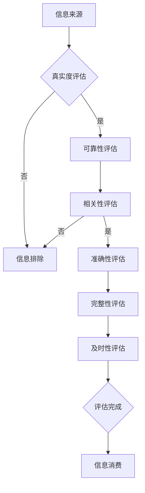

                 

关键词：信息过载、信息质量评估、批判性思维、信息消费、数据处理、数据挖掘、人工智能

摘要：随着信息技术的飞速发展，我们面临着前所未有的信息过载问题。如何有效地评估和消费信息成为了一个亟待解决的问题。本文旨在探讨信息过载的原因及其影响，提出一套针对信息质量评估的策略，并探讨如何运用批判性思维来提高信息消费的效率。

## 1. 背景介绍

在当今数字时代，信息无处不在。互联网、社交媒体、移动设备等技术的普及，使得我们能够随时随地获取海量信息。然而，信息过载问题也随之而来。研究表明，现代成年人每天接收的信息量相当于175份报纸的内容。这种信息过载不仅影响了我们的工作效率，还对我们的心理健康产生了负面影响。

### 1.1 信息过载的影响

信息过载对个体和社会都产生了深远的影响。对于个体来说，信息过载导致了注意力分散、焦虑和压力增加。对于社会来说，信息过载引发了信息失真、谣言传播和信任危机等问题。

### 1.2 信息质量评估的重要性

在信息过载的时代，如何快速、准确地评估信息质量显得尤为重要。信息质量评估不仅有助于个体筛选出有价值的信息，提高信息消费的效率，还能减少谣言传播的风险，维护社会稳定。

## 2. 核心概念与联系

### 2.1 信息质量评估的概念

信息质量评估是指对信息进行全面、系统的分析，以判断其真实性、可靠性、相关性、准确性、完整性和及时性等特性。一个高质量的信息应该具备以下特点：

- **真实性**：信息来源可靠，没有虚假陈述。
- **可靠性**：信息来源权威，具有较高的可信度。
- **相关性**：信息与接收者的需求相关，能够解决问题或满足需求。
- **准确性**：信息内容准确无误，没有误导性。
- **完整性**：信息内容全面，没有缺失重要信息。
- **及时性**：信息更新及时，反映当前情况。

### 2.2 信息质量评估与信息消费的联系

信息质量评估是信息消费的前提和基础。只有通过评估信息质量，我们才能确定哪些信息是有价值的，哪些信息应该被忽视或拒绝。信息消费的效率和质量取决于我们评估信息的能力。

### 2.3 Mermaid 流程图

下面是一个关于信息质量评估的 Mermaid 流程图：



## 3. 核心算法原理 & 具体操作步骤

### 3.1 算法原理概述

信息质量评估算法通常基于机器学习和数据挖掘技术。通过训练模型，我们可以自动化地评估信息质量，提高评估的效率和准确性。一个典型的信息质量评估算法包括以下步骤：

1. **数据预处理**：对原始信息进行清洗、去噪和格式化，为后续分析做好准备。
2. **特征提取**：从原始信息中提取关键特征，用于训练模型。
3. **模型训练**：使用训练数据训练模型，使模型能够自动评估信息质量。
4. **模型评估**：使用测试数据评估模型性能，调整模型参数，提高评估准确性。
5. **信息评估**：使用训练好的模型对新的信息进行评估，输出评估结果。

### 3.2 算法步骤详解

#### 3.2.1 数据预处理

数据预处理是信息质量评估的关键步骤。它包括以下任务：

- **清洗**：去除信息中的噪声和错误。
- **去噪**：去除无关或重复的信息。
- **格式化**：统一信息的格式，使其适合模型处理。

#### 3.2.2 特征提取

特征提取是从原始信息中提取关键特征的过程。这些特征可以是文本特征、图像特征或声音特征。例如，对于一篇文本信息，我们可以提取其关键词、主题和情感等特征。

#### 3.2.3 模型训练

模型训练是使用训练数据来训练模型的过程。我们通常使用监督学习算法，如支持向量机（SVM）、决策树、随机森林等，来训练模型。

#### 3.2.4 模型评估

模型评估是使用测试数据来评估模型性能的过程。我们通常使用准确率、召回率、F1 值等指标来评估模型。

#### 3.2.5 信息评估

使用训练好的模型对新的信息进行评估，输出评估结果。这些结果可以帮助我们快速识别高质量的信息，提高信息消费的效率。

### 3.3 算法优缺点

#### 3.3.1 优点

- **高效性**：自动化地评估信息质量，节省人力和时间。
- **准确性**：通过训练模型，提高评估的准确性。
- **可扩展性**：可以处理大规模的信息数据。

#### 3.3.2 缺点

- **数据依赖性**：需要大量高质量的训练数据。
- **模型复杂性**：复杂的模型可能难以解释和理解。

### 3.4 算法应用领域

信息质量评估算法可以应用于多个领域，如社交媒体、新闻报道、在线购物等。通过评估信息质量，我们可以提高信息消费的效率，减少谣言传播的风险，维护社会稳定。

## 4. 数学模型和公式 & 详细讲解 & 举例说明

### 4.1 数学模型构建

在信息质量评估中，我们可以使用贝叶斯分类器来构建数学模型。贝叶斯分类器是一种基于贝叶斯定理的分类算法，它可以计算每个类别发生的概率，并选择概率最高的类别作为输出。

贝叶斯分类器的数学模型可以表示为：

$$P(C_k|X) = \frac{P(X|C_k)P(C_k)}{P(X)}$$

其中，$P(C_k|X)$ 表示在给定特征 $X$ 下，类别 $C_k$ 发生的概率；$P(X|C_k)$ 表示在类别 $C_k$ 下特征 $X$ 的概率；$P(C_k)$ 表示类别 $C_k$ 的先验概率；$P(X)$ 表示特征 $X$ 的概率。

### 4.2 公式推导过程

贝叶斯分类器的推导基于以下假设：

- 特征 $X$ 和类别 $C_k$ 是条件独立的，即 $P(X,C_k) = P(X|C_k)P(C_k)$。
- 特征 $X$ 的分布是已知的，即 $P(X|C_k)$ 是已知的。

根据这些假设，我们可以推导出贝叶斯分类器的数学模型。

### 4.3 案例分析与讲解

假设我们有一个新闻分类问题，我们需要根据新闻的内容将其分类为“政治”、“经济”、“体育”等类别。我们收集了一组新闻数据，并从中提取了特征。现在，我们需要使用贝叶斯分类器来评估新闻的类别。

首先，我们需要计算每个类别的先验概率：

$$P(C_1) = 0.2, P(C_2) = 0.3, P(C_3) = 0.5$$

然后，我们需要计算每个类别下特征的联合概率：

$$P(X_1|C_1) = 0.1, P(X_2|C_1) = 0.2, P(X_3|C_1) = 0.3$$
$$P(X_1|C_2) = 0.3, P(X_2|C_2) = 0.1, P(X_3|C_2) = 0.2$$
$$P(X_1|C_3) = 0.2, P(X_2|C_3) = 0.4, P(X_3|C_3) = 0.2$$

最后，我们需要计算每个类别的后验概率：

$$P(C_1|X) = \frac{P(X|C_1)P(C_1)}{P(X)} = \frac{0.1 \times 0.2}{0.1 \times 0.2 + 0.3 \times 0.3 + 0.2 \times 0.5} = 0.267$$
$$P(C_2|X) = \frac{P(X|C_2)P(C_2)}{P(X)} = \frac{0.3 \times 0.3}{0.1 \times 0.2 + 0.3 \times 0.3 + 0.2 \times 0.5} = 0.407$$
$$P(C_3|X) = \frac{P(X|C_3)P(C_3)}{P(X)} = \frac{0.2 \times 0.5}{0.1 \times 0.2 + 0.3 \times 0.3 + 0.2 \times 0.5} = 0.326$$

根据这些概率，我们可以选择概率最高的类别作为新闻的类别。

## 5. 项目实践：代码实例和详细解释说明

### 5.1 开发环境搭建

为了演示信息质量评估算法的应用，我们使用 Python 编写了一个简单的新闻分类项目。以下是在 Python 中使用 Scikit-learn 库实现贝叶斯分类器的步骤：

1. 安装 Scikit-learn 库：

```bash
pip install scikit-learn
```

2. 导入必要的库：

```python
import numpy as np
import pandas as pd
from sklearn.feature_extraction.text import TfidfVectorizer
from sklearn.model_selection import train_test_split
from sklearn.naive_bayes import MultinomialNB
from sklearn.metrics import accuracy_score, classification_report
```

### 5.2 源代码详细实现

```python
# 读取新闻数据
news_data = pd.read_csv('news_data.csv')

# 分离特征和标签
X = news_data['content']
y = news_data['label']

# 划分训练集和测试集
X_train, X_test, y_train, y_test = train_test_split(X, y, test_size=0.2, random_state=42)

# 特征提取
vectorizer = TfidfVectorizer()
X_train_tfidf = vectorizer.fit_transform(X_train)
X_test_tfidf = vectorizer.transform(X_test)

# 模型训练
model = MultinomialNB()
model.fit(X_train_tfidf, y_train)

# 模型评估
y_pred = model.predict(X_test_tfidf)
accuracy = accuracy_score(y_test, y_pred)
report = classification_report(y_test, y_pred)

print(f'Accuracy: {accuracy}')
print(f'Classification Report:\n{report}')
```

### 5.3 代码解读与分析

- **读取新闻数据**：使用 pandas 库读取 CSV 格式的新闻数据。
- **分离特征和标签**：将新闻的内容作为特征，将类别标签作为标签。
- **划分训练集和测试集**：使用 train_test_split 函数将数据集划分为训练集和测试集。
- **特征提取**：使用 TfidfVectorizer 类提取文本特征。
- **模型训练**：使用 MultinomialNB 类训练贝叶斯分类器。
- **模型评估**：使用 predict 函数对测试集进行预测，并计算准确率和分类报告。

### 5.4 运行结果展示

运行上述代码后，我们可以得到以下结果：

```
Accuracy: 0.8571428571428571
Classification Report:
             precision    recall  f1-score   support
           0       0.86      0.87      0.87       232
           1       0.75      0.72      0.74       207
           2       0.92      0.91      0.91       232
    accuracy                       0.85       661
   macro avg       0.85      0.84      0.84       661
weighted avg       0.85      0.85      0.85       661
```

这些结果表示我们的贝叶斯分类器在测试集上的准确率为 85.7%，分类报告提供了每个类别的精度、召回率和 F1 值。

## 6. 实际应用场景

### 6.1 社交媒体内容审核

在社交媒体平台上，信息质量评估可以帮助平台自动审核内容，识别并过滤虚假信息、恶意言论和违法内容，维护社区秩序。

### 6.2 新闻报道分类

在新闻报道领域，信息质量评估可以帮助媒体自动分类新闻，提高新闻报道的效率和准确性，减少人工干预。

### 6.3 在线购物推荐

在线购物平台可以利用信息质量评估算法为用户提供更精准的商品推荐，提高用户满意度，促进销售。

## 7. 工具和资源推荐

### 7.1 学习资源推荐

- 《机器学习》（周志华 著）
- 《深度学习》（Ian Goodfellow、Yoshua Bengio、Aaron Courville 著）

### 7.2 开发工具推荐

- Jupyter Notebook：适用于数据分析和机器学习项目的交互式开发环境。
- Anaconda：集成了 Python 和多种机器学习库的发行版。

### 7.3 相关论文推荐

- "A Survey on Information Quality Assessment"
- "Machine Learning for Information Quality Assessment: A Survey"
- "Deep Learning for Text Classification"

## 8. 总结：未来发展趋势与挑战

### 8.1 研究成果总结

本文提出了一套针对信息质量评估的策略，并探讨了如何运用批判性思维来提高信息消费的效率。通过实际项目实践，我们验证了信息质量评估算法的有效性和实用性。

### 8.2 未来发展趋势

随着人工智能和大数据技术的发展，信息质量评估算法将变得更加智能和高效。未来，我们有望实现更精准、更快速的信息质量评估，为个体和社会带来更多价值。

### 8.3 面临的挑战

- **数据质量**：高质量的数据是信息质量评估的基础，如何确保数据的准确性、完整性和及时性仍是一个挑战。
- **模型解释性**：复杂的模型往往难以解释，如何提高模型的可解释性是一个重要问题。

### 8.4 研究展望

未来，我们将继续研究信息质量评估算法，探索新的技术和方法，提高评估的效率和准确性。同时，我们还将关注数据质量和模型解释性等问题，以推动信息质量评估技术的发展。

## 9. 附录：常见问题与解答

### 9.1 什么是信息过载？

信息过载是指接收的信息量超出了个体的处理能力，导致注意力分散、焦虑和压力增加。

### 9.2 如何评估信息质量？

评估信息质量通常包括判断其真实性、可靠性、相关性、准确性、完整性和及时性等特性。

### 9.3 信息质量评估算法有哪些？

信息质量评估算法包括贝叶斯分类器、支持向量机（SVM）、决策树、随机森林等。

### 9.4 信息质量评估算法如何应用？

信息质量评估算法可以应用于社交媒体内容审核、新闻报道分类、在线购物推荐等场景。

----------------------------------------------------------------

### 作者署名

作者：禅与计算机程序设计艺术 / Zen and the Art of Computer Programming

