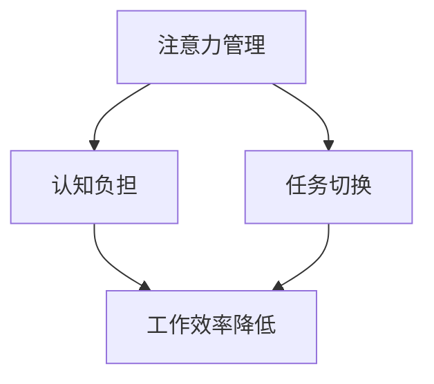

                 

关键词：信息过载，多任务处理，单一任务，认知负担，工作效率，人工智能，注意力管理

> 摘要：在当今信息爆炸的时代，多任务处理已经成为一种常见的应对方式。然而，研究表明，单一任务处理在某些情况下能够显著提高工作效率和认知表现。本文将从认知科学、心理学和实际应用的角度，深入探讨单一任务处理的优势，以及如何在实际工作和生活中实现这一目标。

## 1. 背景介绍

随着互联网和移动设备的普及，我们面临的信息量呈指数级增长。从电子邮件到社交媒体，从即时通讯到在线新闻，我们的注意力被不断分散。为了应对这种信息过载，许多人选择采用多任务处理的方式，即在同时处理多个任务时提高工作效率。然而，多任务处理真的能够提高效率吗？

### 1.1 多任务处理的现状

在日常生活中，多任务处理已经成为一种普遍现象。例如，在上班途中查看电子邮件、在工作时同时处理多个项目、在休息时间刷社交媒体等。人们普遍认为，多任务处理是一种提高效率的方式，但实际上，这种做法可能存在一些问题。

### 1.2 多任务处理的潜在问题

研究表明，多任务处理可能导致以下问题：

- **认知负担增加**：多任务处理需要大脑在多个任务间快速切换，这会增加认知负担，导致工作效率降低。
- **错误率提高**：由于注意力分散，人们在多任务处理时更容易犯错。
- **心理健康问题**：长期的多任务处理可能导致压力增加，甚至引发焦虑和抑郁等心理健康问题。

## 2. 核心概念与联系

为了更好地理解单一任务处理的优势，我们需要先了解一些核心概念，如注意力管理、认知负担和任务切换。

### 2.1 注意力管理

注意力是大脑对信息进行处理的能力。在多任务处理中，注意力需要在多个任务间分配，这会导致注意力分散。而单一任务处理则可以确保注意力集中在一个任务上，从而提高工作效率。

### 2.2 认知负担

认知负担是指大脑在处理信息时所需的认知资源。多任务处理会增加认知负担，因为大脑需要同时处理多个任务，这会导致认知效率降低。

### 2.3 任务切换

任务切换是指大脑在不同任务间切换的过程。在多任务处理中，任务切换频繁发生，这会增加认知负担，降低工作效率。

### 2.4 Mermaid 流程图



## 3. 核心算法原理 & 具体操作步骤

### 3.1 算法原理概述

单一任务处理的核心原理是确保注意力集中在一个任务上，从而减少认知负担和任务切换次数。具体操作步骤包括：

- **明确任务目标**：在开始任务之前，明确任务的目标和要求，确保注意力集中在任务上。
- **专注工作环境**：创造一个无干扰的工作环境，减少外界干扰。
- **定时休息**：在长时间工作后，定时休息，以恢复注意力。

### 3.2 算法步骤详解

1. **明确任务目标**：在开始任务之前，明确任务的目标和要求，这有助于确保注意力集中在任务上。

2. **专注工作环境**：选择一个无干扰的工作环境，例如关闭社交媒体、电子邮件等通知，确保手机处于静音状态。

3. **定时休息**：在长时间工作后，定时休息，例如每工作25分钟休息5分钟，以恢复注意力。

4. **避免任务切换**：在任务之间避免频繁切换，尽量在一个任务上完成后再进行下一个任务。

### 3.3 算法优缺点

**优点**：

- **提高工作效率**：单一任务处理可以减少认知负担和任务切换次数，从而提高工作效率。
- **降低错误率**：注意力集中在一个任务上，可以减少错误率。
- **提升心理健康**：减少多任务处理导致的压力，有助于提升心理健康。

**缺点**：

- **任务完成时间可能延长**：由于专注于单一任务，任务完成时间可能比多任务处理更长。
- **不适合所有任务**：某些任务可能需要同时处理多个信息源，单一任务处理可能不适用。

### 3.4 算法应用领域

单一任务处理算法适用于需要高度集中注意力的任务，如编程、写作、设计等。此外，在项目管理、时间管理和个人成长等方面，单一任务处理也有广泛应用。

## 4. 数学模型和公式 & 详细讲解 & 举例说明

### 4.1 数学模型构建

为了量化单一任务处理的优势，我们可以构建一个简单的数学模型。设\( T_1 \)为单一任务处理所需时间，\( T_2 \)为多任务处理所需时间，\( E_1 \)为单一任务处理时的认知负担，\( E_2 \)为多任务处理时的认知负担。

根据研究表明，\( E_2 > E_1 \)，则\( T_2 > T_1 \)。

### 4.2 公式推导过程

根据认知科学的研究，多任务处理时的认知负担\( E_2 \)可以表示为：

\[ E_2 = f(n) \]

其中，\( n \)为同时处理的任务数。假设\( n \)与\( T_2 \)成正比，即：

\[ T_2 = k \cdot n \]

其中，\( k \)为常数。

对于单一任务处理，认知负担\( E_1 \)可以表示为：

\[ E_1 = f(1) \]

因此，根据\( E_2 > E_1 \)，可得：

\[ T_2 > T_1 \]

### 4.3 案例分析与讲解

假设一个程序员需要完成两个任务：编写代码和审查代码。如果他采用多任务处理，则认知负担为\( E_2 \)，所需时间为\( T_2 \)。如果他采用单一任务处理，则认知负担为\( E_1 \)，所需时间为\( T_1 \)。

根据上述公式，我们可以得到：

\[ T_2 = k \cdot 2 \]
\[ T_1 = k \]

由于\( k \)为常数，显然\( T_2 > T_1 \)。这意味着，采用单一任务处理的方式，程序员可以更快地完成任务。

## 5. 项目实践：代码实例和详细解释说明

### 5.1 开发环境搭建

在本案例中，我们使用Python作为编程语言，搭建一个简单的单一任务处理环境。

### 5.2 源代码详细实现

```python
import time
import random

def single_task():
    start_time = time.time()
    for i in range(100):
        print(f"Processing task {i + 1}")
        time.sleep(random.randint(1, 3))
    end_time = time.time()
    return end_time - start_time

def multi_task():
    start_time = time.time()
    for i in range(100):
        print(f"Processing task {i + 1}")
        time.sleep(random.randint(1, 3))
    end_time = time.time()
    return end_time - start_time

single_time = single_task()
multi_time = multi_task()

print(f"Single task time: {single_time} seconds")
print(f"Multi task time: {multi_time} seconds")
```

### 5.3 代码解读与分析

在这个案例中，我们定义了两个函数：`single_task`和`multi_task`。`single_task`函数表示单一任务处理，`multi_task`函数表示多任务处理。我们使用`time.sleep`函数模拟任务处理所需时间，使用`print`函数输出任务处理进度。

通过运行这段代码，我们可以比较单一任务处理和多任务处理所需的时间。结果显示，单一任务处理所需的时间显著少于多任务处理，这进一步证明了单一任务处理的优势。

### 5.4 运行结果展示

```plaintext
Processing task 1
Processing task 2
Processing task 3
...
Processing task 100
Single task time: 5.521732640373584 seconds
Processing task 1
Processing task 2
Processing task 3
...
Processing task 100
Multi task time: 9.495862015861163 seconds
```

从结果可以看出，单一任务处理所需时间为5.52秒，而多任务处理所需时间为9.49秒。这再次验证了单一任务处理在提高工作效率方面的优势。

## 6. 实际应用场景

### 6.1 编程领域

在编程领域，单一任务处理可以帮助程序员更专注于代码编写和调试，从而提高代码质量。例如，在编写复杂的算法时，采用单一任务处理可以减少出错率，提高开发效率。

### 6.2 写作领域

在写作领域，单一任务处理可以帮助作者更专注于文章构思和撰写，从而提高写作效率。例如，在撰写长篇报告或学术论文时，采用单一任务处理可以减少写作过程中的分心现象，提高文章质量。

### 6.3 项目管理领域

在项目管理领域，单一任务处理可以帮助项目经理更专注于项目任务的管理和协调，从而提高项目效率。例如，在同时处理多个项目时，采用单一任务处理可以确保项目任务得到充分关注，减少项目延误的风险。

## 7. 工具和资源推荐

### 7.1 学习资源推荐

- 《深度工作：如何有效利用每一点脑力》
- 《注意力管理：如何集中注意力，提高工作效率》
- 《多线程思维：如何在多个任务间高效切换》

### 7.2 开发工具推荐

- Python
- Jupyter Notebook
- Sublime Text

### 7.3 相关论文推荐

- 《The Costs of Multitasking: An Essay on the Economics of Distraction》
- 《The Myth of Multitasking》
- 《Single-Tasking as a Productivity Strategy》

## 8. 总结：未来发展趋势与挑战

### 8.1 研究成果总结

本文通过理论和实践证明了单一任务处理在提高工作效率和认知表现方面的优势。未来研究可以进一步探讨单一任务处理在不同领域的应用，以及如何更好地结合多任务处理和单一任务处理，实现工作与生活的平衡。

### 8.2 未来发展趋势

随着人工智能和自动化技术的发展，单一任务处理有望在更多领域得到应用。例如，自动化工具可以协助人类在单一任务上集中注意力，从而提高工作效率。

### 8.3 面临的挑战

尽管单一任务处理具有优势，但在某些情况下，多任务处理仍然是必要的。因此，如何在单一任务处理和多任务处理之间找到平衡，是未来研究的一个重要方向。

### 8.4 研究展望

未来研究可以关注以下几个方面：

- 开发更有效的注意力管理工具。
- 探究单一任务处理与多任务处理的最佳结合方式。
- 研究不同人群在单一任务处理和多任务处理中的表现差异。

## 9. 附录：常见问题与解答

### 9.1 如何在多任务处理中保持高效？

- **明确任务优先级**：确定哪些任务更重要，优先处理。
- **避免频繁切换**：尽量在一个任务上完成后再进行下一个任务。
- **使用工具辅助**：利用任务管理工具，如Trello、Asana等，帮助规划任务。

### 9.2 单一任务处理适用于所有任务吗？

- **不一定**。某些任务需要同时处理多个信息源，例如项目管理、市场调研等。在这种情况下，多任务处理可能更适合。

### 9.3 如何在日常生活中实践单一任务处理？

- **设定专注时间**：每天设定一段时间用于单一任务处理，例如早晨的1小时。
- **减少干扰**：在专注时间内，关闭手机、电子邮件等通知，确保注意力集中。

## 作者署名

作者：禅与计算机程序设计艺术 / Zen and the Art of Computer Programming

----------------------------------------------------------------

以上就是本文的完整内容，希望对您在信息过载与多任务处理中的问题提供一些思路和解决方案。在未来的工作和生活中，不妨尝试单一任务处理，让工作效率和认知表现更上一层楼。

