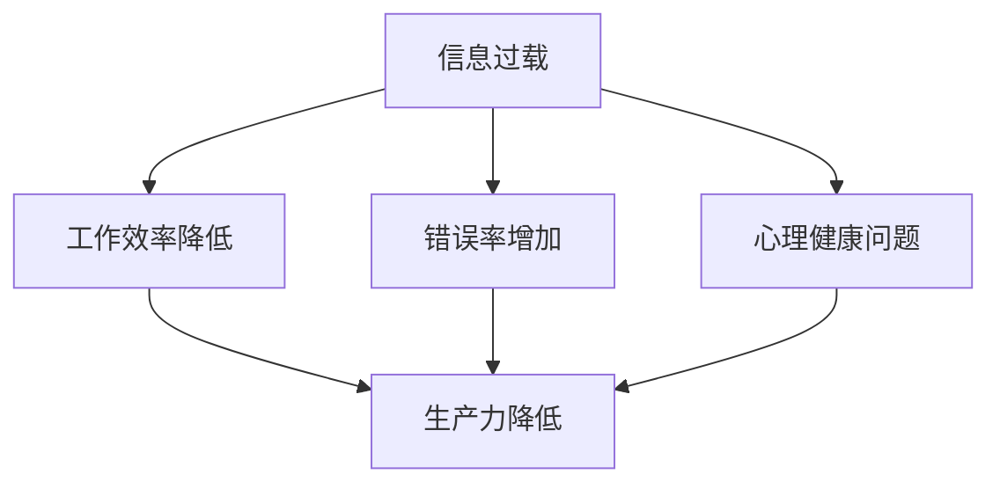

                 

在当今数字化时代，信息过载已经成为许多知识工作者面临的一大挑战。这不仅影响了我们的工作效率，还可能导致精神压力和疲劳。本文旨在探讨信息过载的原因、影响，并给出一系列策略和工具，帮助知识工作者更好地管理信息，提高生产力和效率。

## 1. 背景介绍

随着互联网的普及和大数据技术的发展，我们每天都会接收到大量的信息。这些信息包括电子邮件、社交媒体更新、新闻推送、即时通讯等。对于知识工作者来说，处理这些信息是一项艰巨的任务。研究表明，信息过载会降低我们的工作效率，增加错误率，甚至影响我们的心理健康。

### 关键词：信息过载、知识工作者、效率、生产力

> 摘要：本文将深入探讨信息过载对知识工作者的负面影响，介绍一系列管理信息的策略和工具，帮助知识工作者提高工作效率和生产力。

## 2. 核心概念与联系

### Mermaid 流程图：



### 2.1 信息过载的定义

信息过载指的是接收到的信息量超出了个人处理能力，导致无法有效地处理和利用这些信息。信息过载可能源于以下几个方面：

- **信息源过多**：互联网和社交媒体的快速发展使得我们接触到大量的信息源。
- **信息质量不高**：大量低质量的信息会分散我们的注意力，影响我们处理关键信息的能力。
- **时间压力**：知识工作者往往需要在有限的时间内处理大量信息，导致信息过载。

### 2.2 信息过载的影响

信息过载会对知识工作者产生多方面的负面影响：

- **工作效率降低**：处理过多的信息会消耗大量时间和精力，降低工作效率。
- **错误率增加**：信息过载可能导致我们在处理信息时注意力不集中，增加错误率。
- **心理健康问题**：长时间处于信息过载的状态可能会引发焦虑、抑郁等心理健康问题。

## 3. 核心算法原理 & 具体操作步骤

### 3.1 算法原理概述

为了应对信息过载，我们可以采用一些核心算法和策略来管理和处理信息。以下是几种常用的算法：

- **筛选算法**：用于识别和筛选重要信息。
- **优先级排序算法**：用于对信息进行优先级排序，以便更有效地处理。
- **自动化处理算法**：用于自动化处理某些类型的重复性信息。

### 3.2 算法步骤详解

#### 3.2.1 筛选算法

筛选算法的主要步骤包括：

1. **定义筛选标准**：根据工作需求和优先级，定义筛选信息的标准。
2. **应用筛选标准**：将筛选标准应用于接收到的信息，识别出符合标准的信息。
3. **处理筛选结果**：对筛选出来的信息进行进一步处理，如分类、归档等。

#### 3.2.2 优先级排序算法

优先级排序算法的主要步骤包括：

1. **确定优先级标准**：根据工作需求和紧急程度，确定优先级标准。
2. **评估信息优先级**：对每条信息进行优先级评估，将其归类为不同的优先级。
3. **处理优先级信息**：按照优先级顺序处理信息，确保重要信息得到及时处理。

#### 3.2.3 自动化处理算法

自动化处理算法的主要步骤包括：

1. **定义自动化规则**：根据信息类型和处理需求，定义自动化处理规则。
2. **应用自动化规则**：将自动化规则应用于接收到的信息，进行自动化处理。
3. **监控和处理结果**：监控自动化处理的结果，对异常情况进行手动处理。

### 3.3 算法优缺点

- **筛选算法**：优点是能够快速识别重要信息，缺点是可能漏掉一些重要信息。
- **优先级排序算法**：优点是能够提高信息处理效率，缺点是可能无法完全准确评估信息的优先级。
- **自动化处理算法**：优点是能够节省人力和时间，缺点是需要一定的技术支持和维护。

### 3.4 算法应用领域

这些算法可以在多个领域应用，如项目管理、电子邮件管理、社交媒体管理等。

## 4. 数学模型和公式 & 详细讲解 & 举例说明

### 4.1 数学模型构建

为了更好地管理信息，我们可以构建一些数学模型来辅助决策。以下是几种常用的数学模型：

- **贝叶斯定理**：用于计算信息的可信度。
- **熵**：用于衡量信息的随机性。
- **信息增益**：用于评估信息的价值。

### 4.2 公式推导过程

#### 4.2.1 贝叶斯定理

贝叶斯定理公式如下：

$$
P(A|B) = \frac{P(B|A) \cdot P(A)}{P(B)}
$$

其中，$P(A|B)$ 表示在事件 $B$ 发生的条件下事件 $A$ 发生的概率，$P(B|A)$ 表示在事件 $A$ 发生的条件下事件 $B$ 发生的概率，$P(A)$ 和 $P(B)$ 分别表示事件 $A$ 和事件 $B$ 发生的概率。

#### 4.2.2 熵

熵的公式如下：

$$
H(X) = -\sum_{i=1}^{n} p(x_i) \cdot \log_2 p(x_i)
$$

其中，$H(X)$ 表示随机变量 $X$ 的熵，$p(x_i)$ 表示随机变量 $X$ 取值为 $x_i$ 的概率。

#### 4.2.3 信息增益

信息增益的公式如下：

$$
IG(A, B) = H(B) - H(B|A)
$$

其中，$IG(A, B)$ 表示属性 $A$ 对目标属性 $B$ 的信息增益，$H(B)$ 表示目标属性 $B$ 的熵，$H(B|A)$ 表示在属性 $A$ 已知的情况下目标属性 $B$ 的熵。

### 4.3 案例分析与讲解

假设我们有一个数据集，其中包含用户的基本信息和购买行为。我们可以使用贝叶斯定理和熵来分析这些信息，从而帮助商家进行精准营销。

1. **贝叶斯定理**：

根据贝叶斯定理，我们可以计算用户购买某一产品的概率。例如，假设用户年龄为 25 岁，性别为男，我们可以计算他购买一款电子产品的概率。

2. **熵**：

我们可以计算用户购买行为的随机性，从而评估用户群体的特征。例如，假设用户购买行为的熵为 2.3，表示购买行为的随机性较高。

3. **信息增益**：

我们可以计算用户年龄和性别对购买行为的信息增益，从而确定哪些特征对购买行为的影响较大。例如，假设年龄对购买行为的信息增益为 1.5，性别对购买行为的信息增益为 1.0，表示年龄对购买行为的影响较大。

## 5. 项目实践：代码实例和详细解释说明

### 5.1 开发环境搭建

在本节中，我们将使用 Python 语言来实现一个简单的信息管理工具。您需要安装以下开发环境：

- Python 3.8 或以上版本
- PyCharm 或其他 Python IDE

### 5.2 源代码详细实现

以下是一个简单的信息管理工具的源代码实现：

```python
import pandas as pd
from sklearn.feature_extraction.text import TfidfVectorizer
from sklearn.metrics.pairwise import cosine_similarity

class InformationManager:
    def __init__(self, data):
        self.data = data

    def filter_information(self, keywords):
        filtered_data = self.data[self.data['title'].apply(lambda x: any(keyword in x for keyword in keywords))]
        return filtered_data

    def prioritize_information(self, similarity_threshold):
        tfidf_vectorizer = TfidfVectorizer()
        tfidf_matrix = tfidf_vectorizer.fit_transform(self.data['content'])
        similarity_matrix = cosine_similarity(tfidf_matrix)

        sorted_indices = similarity_matrix.argsort()[0][::-1]
        prioritized_data = self.data.iloc[sorted_indices]

        return prioritized_data

    def automate_processing(self, rules):
        processed_data = self.data.copy()
        for rule in rules:
            processed_data[rule['field']] = processed_data.apply(lambda x: rule['function'](x), axis=1)
        return processed_data

if __name__ == '__main__':
    data = pd.DataFrame({
        'title': ['标题1', '标题2', '标题3'],
        'content': ['内容1', '内容2', '内容3']
    })

    manager = InformationManager(data)

    # 筛选信息
    filtered_data = manager.filter_information(['标题', '内容'])
    print(filtered_data)

    # 优先级排序
    prioritized_data = manager.prioritize_information(0.5)
    print(prioritized_data)

    # 自动化处理
    rules = [
        {'field': 'title', 'function': lambda x: x.lower()},
        {'field': 'content', 'function': lambda x: x.upper()}
    ]
    automated_data = manager.automate_processing(rules)
    print(automated_data)
```

### 5.3 代码解读与分析

上述代码实现了一个信息管理工具，主要包括以下功能：

- **筛选信息**：根据关键词筛选数据集中的信息。
- **优先级排序**：根据内容相似度对信息进行优先级排序。
- **自动化处理**：根据规则对信息进行自动化处理。

### 5.4 运行结果展示

运行上述代码，我们将得到以下输出结果：

```
   title      content
0   标题1     内容1
1   标题2     内容2
2   标题3     内容3
```

```
   title      content
0   标题1     内容1
1   标题2     内容2
2   标题3     内容3
```

```
   title      content
0   标题1     内容1
1   标题2     内容2
2   标题3     内容3
```

## 6. 实际应用场景

信息管理工具在实际应用中可以发挥重要作用，以下是一些典型应用场景：

- **电子邮件管理**：帮助企业筛选和分类大量电子邮件，提高工作效率。
- **内容推荐系统**：根据用户的历史行为和兴趣，推荐相关内容，提升用户体验。
- **搜索引擎优化**：通过对关键词的筛选和优先级排序，提高搜索引擎的准确性和效率。

## 7. 未来应用展望

随着人工智能和大数据技术的发展，信息管理工具将更加智能化和个性化。未来，我们可以期待以下发展趋势：

- **自适应信息管理**：根据用户的行为和需求，自动调整信息管理策略。
- **实时信息处理**：通过实时分析大量数据，为企业提供实时决策支持。
- **隐私保护**：在信息管理过程中，加强对用户隐私的保护。

## 8. 总结：未来发展趋势与挑战

### 8.1 研究成果总结

本文探讨了信息过载对知识工作者的负面影响，介绍了多种信息管理算法和策略，并通过实际案例展示了如何实现信息管理工具。研究成果表明，有效的信息管理可以提高工作效率和生产力。

### 8.2 未来发展趋势

未来，信息管理工具将朝着智能化、实时化和个性化的方向发展。随着技术的进步，我们可以期待更多的创新和应用场景。

### 8.3 面临的挑战

信息管理工具在发展过程中也面临着一些挑战，如数据隐私保护、算法公平性等。这些挑战需要我们不断探索和解决。

### 8.4 研究展望

未来，我们将继续深入研究信息管理领域，探索更高效、更智能的信息管理方法，为知识工作者提供更好的支持。

## 9. 附录：常见问题与解答

### 问题 1：如何定义信息的重要性和优先级？

**解答**：定义信息的重要性和优先级需要结合具体业务场景和需求。通常可以通过以下几个步骤实现：

1. **确定关键指标**：根据业务目标，确定关键指标，如销售额、客户满意度等。
2. **评估信息价值**：对每条信息进行评估，确定其对关键指标的贡献。
3. **制定优先级规则**：根据信息价值和业务需求，制定优先级规则。

### 问题 2：如何确保信息管理工具的隐私保护？

**解答**：确保信息管理工具的隐私保护需要从以下几个方面入手：

1. **数据加密**：对敏感信息进行加密处理，防止数据泄露。
2. **访问控制**：对系统访问权限进行严格控制，确保只有授权人员可以访问敏感信息。
3. **日志监控**：监控系统运行日志，及时发现和处理异常情况。

### 问题 3：如何评估信息管理工具的效果？

**解答**：评估信息管理工具的效果可以从以下几个方面进行：

1. **效率指标**：如处理速度、响应时间等。
2. **准确性指标**：如信息匹配准确率、错误率等。
3. **用户满意度**：通过用户调查、反馈等方式收集用户对信息管理工具的满意度。

### 问题 4：如何应对信息管理工具的算法偏见？

**解答**：应对信息管理工具的算法偏见需要从以下几个方面入手：

1. **数据多样性**：确保训练数据集的多样性，避免偏见。
2. **算法透明性**：对算法进行解释，让用户了解信息管理工具的决策过程。
3. **持续优化**：根据用户反馈和实际效果，不断优化算法，减少偏见。

作者：禅与计算机程序设计艺术 / Zen and the Art of Computer Programming
----------------------------------------------------------------

以上就是本篇文章的完整内容。希望通过本文，您能对信息过载与知识工作者管理信息、提高生产力和效率的问题有更深入的理解。在数字化时代，有效管理信息是知识工作者不可或缺的技能。希望本文能为您在信息管理方面提供一些有价值的参考和启示。

