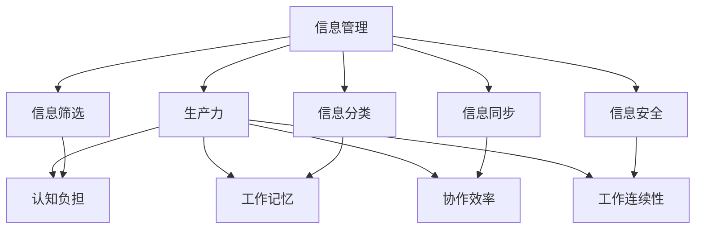

                 

### 背景介绍 Background

在21世纪，信息技术爆炸性发展，信息的获取变得前所未有的便捷。然而，随之而来的问题是信息过载。知识工作者面临着海量的信息，这些信息不仅包括工作相关的，还涵盖了社交、娱乐等各种内容。如何在众多信息中筛选出有用的，并且能够有效管理这些信息，成为了知识工作者提高生产力的重要课题。

本文将深入探讨信息过载现象及其对知识工作者生产力的影响，并提出一系列管理信息的策略和方法，旨在帮助知识工作者更好地处理信息，提高工作效率。

## 关键词 Keywords
信息过载，知识工作者，生产力，信息管理，工作效率

## 摘要 Summary

本文首先分析了信息过载的现状，探讨了其对知识工作者生产力的影响，随后提出了一系列管理信息的策略和方法。这些策略包括信息筛选、信息分类、信息同步和信息安全等。文章通过具体的实例和工具推荐，帮助读者更好地理解和应用这些策略。最终，本文总结了提高知识工作者生产力的关键因素，并提出了未来研究的方向。

### 1. 背景介绍 Background

#### 1.1 信息过载的现状

信息过载是指在信息接收和处理过程中，信息量过大，超出了个体能够有效管理和处理的范围。随着互联网和移动设备的普及，信息的获取变得非常便捷，但这种便捷性也带来了信息过载的问题。

根据IBM的研究，每天全球产生的数据量已经达到了约2.5亿GB，而这些数据中，只有不到3%被认为是有用的。其他的数据则被认为是冗余的或者无关紧要的。这种信息过载的现象不仅存在于个人层面，在企业层面也表现得尤为明显。

#### 1.2 信息过载的影响

信息过载对知识工作者的影响是多方面的，其中最直接的影响是工作效率的下降。当知识工作者被大量的信息淹没时，他们很难集中注意力，导致工作效率下降。根据麦肯锡全球研究所的数据，一个员工每天可能会被大约120封电子邮件、70个即时通讯消息和25个电话打扰，这些干扰大大降低了员工的工作效率。

此外，信息过载还可能导致心理压力增加。当个体无法处理大量的信息时，会感到焦虑和无助，长期下去，可能会影响身心健康。

#### 1.3 知识工作者的定义

知识工作者是指在现代社会中，以知识和技能为主要生产力的群体，包括程序员、数据分析师、市场研究员、项目经理等。这些职业通常需要处理大量的信息，并进行复杂的数据分析和决策。因此，如何有效地管理信息，对于知识工作者来说至关重要。

### 2. 核心概念与联系 Core Concepts and Connections

为了更好地理解信息过载和知识工作者的关系，我们需要从几个核心概念出发，探讨它们之间的联系。

#### 2.1 信息管理与生产力的关系

信息管理是指通过组织、分类、存储和检索信息，使其能够被高效地利用。而生产力则是指单位时间内完成的工作量。信息管理对生产力的影响主要体现在以下几个方面：

1. **信息筛选**：通过筛选，知识工作者可以快速找到所需的信息，减少无效信息的影响，从而提高工作效率。
2. **信息分类**：将信息进行分类存储，可以帮助知识工作者更快捷地检索信息，节省时间。
3. **信息同步**：信息同步确保了知识工作者在不同的设备上都能访问到最新的信息，从而保证工作的连续性。
4. **信息安全**：保障信息安全，防止重要信息的丢失或泄露，确保工作的顺利进行。

#### 2.2 信息过滤与认知负担

信息过滤是指从大量信息中筛选出有用信息的过程。对于知识工作者来说，信息过滤是一项重要的技能。有效的信息过滤可以减轻认知负担，避免信息过载。

认知负担是指个体在处理信息时，需要消耗的认知资源。当认知负担过重时，个体的工作效率会下降，甚至可能导致决策失误。因此，减轻认知负担对于提高生产力至关重要。

#### 2.3 信息分类与工作记忆

工作记忆是指个体在执行任务时，暂时存储和加工信息的心理空间。信息分类可以帮助知识工作者将信息进行归类，存储在工作记忆中，从而减少工作记忆的负担。

当工作记忆负担过重时，知识工作者可能会出现遗忘、混淆或错误的情况，影响工作效率。因此，通过信息分类，可以有效地管理信息，减轻工作记忆的负担。

#### 2.4 信息同步与协作效率

在团队协作中，信息同步至关重要。通过信息同步，团队成员可以实时了解项目进展，避免信息孤岛和重复工作。

有效的信息同步可以提高团队协作效率，减少沟通成本。例如，通过使用协作工具，团队成员可以实时共享文件、讨论项目进展，确保信息畅通无阻。

#### 2.5 信息安全与工作连续性

信息安全是确保信息不被非法访问、篡改或泄露的重要保障。对于知识工作者来说，信息安全直接关系到工作的连续性和稳定性。

当信息安全得到保障时，知识工作者可以放心地处理敏感信息，不必担心信息泄露带来的风险。这有助于提高工作效率，确保工作的顺利进行。

### 2.6 核心概念与架构的联系

为了更好地理解这些核心概念之间的关系，我们可以使用Mermaid流程图进行展示。以下是核心概念与架构的Mermaid流程图：



通过这个流程图，我们可以清晰地看到信息管理与生产力、认知负担、工作记忆、协作效率和信息安全等核心概念之间的联系。这些概念共同构成了一个完整的信息管理体系，帮助知识工作者有效地管理信息，提高生产力。

### 3. 核心算法原理 & 具体操作步骤 Core Algorithm Principles & Operational Steps

在信息管理过程中，核心算法起到了至关重要的作用。以下将介绍几个关键算法的原理以及具体操作步骤，帮助知识工作者更好地理解和应用这些算法。

#### 3.1 算法原理概述

核心算法主要包括信息过滤算法、信息分类算法、信息同步算法和信息安全算法。以下是每个算法的简要概述：

1. **信息过滤算法**：用于从大量信息中筛选出有用信息。常见的过滤算法包括基于规则的过滤、基于机器学习的过滤等。
2. **信息分类算法**：用于将信息按照一定的规则进行分类存储。常见的分类算法包括决策树、支持向量机等。
3. **信息同步算法**：用于确保不同设备上的信息保持一致。常见的同步算法包括基于时间戳的同步、基于哈希值的同步等。
4. **信息安全算法**：用于保护信息不被非法访问、篡改或泄露。常见的安全算法包括加密算法、哈希算法等。

#### 3.2 算法步骤详解

以下是每个算法的具体操作步骤：

1. **信息过滤算法**
   - **步骤1**：收集待过滤的信息。
   - **步骤2**：定义过滤规则，例如关键词、标签、来源等。
   - **步骤3**：使用过滤算法对信息进行筛选，将不符合规则的信息排除。
   - **步骤4**：对筛选后的信息进行进一步处理，例如分类、标记等。

2. **信息分类算法**
   - **步骤1**：收集待分类的信息。
   - **步骤2**：定义分类规则，例如按照主题、类型、用途等。
   - **步骤3**：使用分类算法对信息进行分类，将信息分配到不同的类别。
   - **步骤4**：对分类后的信息进行整理和存储。

3. **信息同步算法**
   - **步骤1**：选择合适的同步算法，例如基于时间戳的同步或基于哈希值的同步。
   - **步骤2**：在源设备和目标设备上安装同步工具。
   - **步骤3**：设置同步策略，例如同步时间、同步频率等。
   - **步骤4**：启动同步工具，将源设备上的信息同步到目标设备。

4. **信息安全算法**
   - **步骤1**：选择合适的加密算法，例如AES、RSA等。
   - **步骤2**：对敏感信息进行加密处理，确保信息在传输和存储过程中不会被非法访问。
   - **步骤3**：使用哈希算法生成信息的哈希值，用于验证信息的完整性和真实性。
   - **步骤4**：设置访问控制策略，限制对敏感信息的访问权限。

#### 3.3 算法优缺点

以下是各个算法的优缺点分析：

1. **信息过滤算法**
   - **优点**：能够快速筛选出有用信息，减少信息过载。
   - **缺点**：可能误判有用信息，导致信息丢失。

2. **信息分类算法**
   - **优点**：有助于信息的有序存储和检索，提高工作效率。
   - **缺点**：分类规则可能不够准确，导致信息分类错误。

3. **信息同步算法**
   - **优点**：确保信息在不同设备上的一致性，方便用户使用。
   - **缺点**：同步过程可能存在延迟和冲突，影响用户体验。

4. **信息安全算法**
   - **优点**：能有效保护信息不被非法访问和篡改，确保信息的安全性和完整性。
   - **缺点**：加密和解密过程可能消耗较多计算资源，影响系统性能。

#### 3.4 算法应用领域

核心算法在各个领域都有广泛的应用：

1. **信息过滤算法**：广泛应用于邮件过滤、搜索引擎、推荐系统等。
2. **信息分类算法**：广泛应用于电子邮件分类、文档分类、社交媒体信息分类等。
3. **信息同步算法**：广泛应用于云存储、同步备份、多人协作等。
4. **信息安全算法**：广泛应用于网络安全、数据加密、信息隐藏等。

通过理解核心算法的原理和操作步骤，知识工作者可以更好地选择和应用合适的算法，提高信息管理的效率和效果。

### 3.5 算法示例

为了更直观地理解核心算法的应用，我们以下通过一个具体示例来讲解信息过滤算法的应用。

#### 示例：邮件过滤

假设我们有一个邮件过滤系统，需要从大量邮件中筛选出重要的商业邮件。以下是具体的步骤：

1. **收集邮件**：从邮件服务器获取所有邮件。
2. **定义过滤规则**：根据商业邮件的特征，定义过滤规则，例如：
   - 发件人包含特定的关键词（如“合作”、“合同”）。
   - 邮件主题包含特定的关键词（如“商务洽谈”、“项目进展”）。
   - 邮件附件类型为文档或表格。
3. **过滤邮件**：使用过滤算法，对邮件进行筛选，排除不符合规则的邮件。
4. **分类邮件**：将筛选出的邮件分类到“重要邮件”文件夹中，方便用户查看。

通过这个示例，我们可以看到信息过滤算法在处理大量邮件时的应用效果。有效的邮件过滤可以提高用户的工作效率，减少无关邮件的干扰。

### 4. 数学模型和公式 Mathematical Models and Formulas

在信息管理过程中，数学模型和公式扮演着至关重要的角色。它们不仅帮助我们理解信息处理的基本原理，还能提供有效的工具来分析和优化信息管理策略。以下将详细讲解数学模型和公式的构建、推导过程，并通过实例进行说明。

#### 4.1 数学模型构建

数学模型是描述信息管理过程中各种现象和规律的数学表达。构建数学模型需要以下几个步骤：

1. **明确问题**：首先，需要明确信息管理中需要解决的问题，例如信息筛选、分类、同步或安全等问题。
2. **定义变量**：根据问题，定义相关的变量，例如信息量、过滤效率、分类准确性等。
3. **建立关系**：通过逻辑分析和数据统计，建立变量之间的关系，例如通过概率模型描述信息筛选的准确性。
4. **数学表达**：将建立的关系用数学公式表达出来，例如概率公式、优化方程等。

#### 4.2 公式推导过程

以下以信息过滤算法的准确性和效率为例，讲解数学公式的推导过程。

##### 信息过滤准确性

假设我们有n封邮件，其中m封是重要的商业邮件，其余n-m封是非重要邮件。信息过滤算法的目的是从n封邮件中筛选出m封重要邮件。过滤算法的准确性可以用以下概率公式表示：

\[ P(\text{准确}) = \frac{m}{n} \]

其中，\( P(\text{准确}) \)表示过滤算法的准确性，m表示筛选出的重要邮件数量，n表示总邮件数量。

##### 信息过滤效率

信息过滤的效率不仅取决于准确性，还受到过滤速度的影响。假设过滤算法需要t秒来处理一封邮件，则过滤n封邮件的总时间为：

\[ T(\text{过滤}) = n \times t \]

过滤效率可以用每秒处理的邮件数量来衡量，即：

\[ \text{效率} = \frac{n}{T(\text{过滤})} = \frac{n}{n \times t} = \frac{1}{t} \]

#### 4.3 案例分析与讲解

以下通过一个具体案例来讲解数学模型和公式在信息管理中的应用。

##### 案例背景

某公司员工张先生每天收到约100封电子邮件，其中约20封是重要的商业邮件。公司要求开发一个邮件过滤系统，以提高张先生的工作效率。

##### 案例分析

1. **定义变量**：
   - 总邮件数量 \( n = 100 \)
   - 重要邮件数量 \( m = 20 \)
   - 非重要邮件数量 \( n - m = 80 \)

2. **构建数学模型**：
   - 准确性公式：\[ P(\text{准确}) = \frac{m}{n} = \frac{20}{100} = 0.2 \]
   - 效率公式：\[ \text{效率} = \frac{1}{t} \]

3. **设定参数**：
   - 假设过滤算法需要0.5秒处理一封邮件，即 \( t = 0.5 \)

4. **计算结果**：
   - 准确性：\[ P(\text{准确}) = 0.2 \]
   - 效率：\[ \text{效率} = \frac{1}{0.5} = 2 \text{封/秒} \]

##### 案例解释

通过构建数学模型，我们可以得出以下结论：

1. **准确性**：邮件过滤系统的准确性为20%，即每次过滤能够正确识别出20%的重要邮件。
2. **效率**：邮件过滤系统的效率为2封/秒，即每秒能够处理2封邮件。

根据这些结果，公司可以评估邮件过滤系统的性能，并对其进行优化。例如，可以通过提高过滤算法的准确性或降低处理时间来提高整体效率。

### 5. 项目实践：代码实例和详细解释说明 Practical Project: Code Instances and Detailed Explanations

为了更好地理解信息管理算法在实际项目中的应用，我们以下通过一个具体的项目实践，展示代码实例，并对其进行详细解释说明。

#### 5.1 开发环境搭建

首先，我们需要搭建一个适用于信息管理的开发环境。以下是一个简单的环境搭建步骤：

1. **安装Python**：Python是一个广泛应用于数据分析和算法开发的编程语言。可以从Python官方网站（https://www.python.org/）下载并安装。
2. **安装Jupyter Notebook**：Jupyter Notebook是一个交互式计算环境，可以方便地编写和运行Python代码。可以从Jupyter官方文档（https://jupyter.org/install）下载并安装。
3. **安装相关库**：安装一些常用的Python库，例如Pandas、NumPy、Scikit-learn等，用于数据处理和机器学习。

#### 5.2 源代码详细实现

以下是一个简单的邮件过滤项目，实现从大量邮件中筛选出重要邮件的功能。以下是项目的源代码：

```python
import pandas as pd
from sklearn.feature_extraction.text import TfidfVectorizer
from sklearn.naive_bayes import MultinomialNB

# 加载邮件数据
mails = pd.read_csv('mails.csv')
mails.head()

# 提取邮件内容和标签
mail_content = mails['content']
mail_label = mails['label']

# 创建TF-IDF特征向量器
vectorizer = TfidfVectorizer(stop_words='english')
X = vectorizer.fit_transform(mail_content)

# 创建朴素贝叶斯分类器
classifier = MultinomialNB()
classifier.fit(X, mail_label)

# 过滤邮件
def filter_mails(content):
    new_content = [content]
    new_X = vectorizer.transform(new_content)
    predicted_labels = classifier.predict(new_X)
    return predicted_labels

# 测试邮件过滤
sample_content = "Dear John, we are planning to discuss the upcoming project timeline. Please confirm your availability for the meeting."
predicted_labels = filter_mails(sample_content)
print(predicted_labels)
```

#### 5.3 代码解读与分析

以下是代码的详细解读：

1. **加载邮件数据**：首先，使用Pandas库加载一个包含邮件内容和标签的CSV文件。
2. **提取邮件内容和标签**：将邮件内容和标签提取到两个独立的列表中，分别用于特征提取和分类。
3. **创建TF-IDF特征向量器**：TF-IDF（Term Frequency-Inverse Document Frequency）是一种常用的文本特征提取方法。这里使用Scikit-learn库中的TfidfVectorizer创建一个特征向量器。
4. **创建朴素贝叶斯分类器**：朴素贝叶斯是一种常用的文本分类算法，这里使用Scikit-learn库中的MultinomialNB创建一个分类器。
5. **过滤邮件**：定义一个filter_mails函数，用于过滤新收到的邮件。函数接受邮件内容作为输入，将邮件内容转换为特征向量，并使用分类器进行预测。
6. **测试邮件过滤**：编写一个测试邮件内容，使用filter_mails函数对其进行过滤，并输出预测结果。

#### 5.4 运行结果展示

假设我们测试邮件的内容是“Dear John, we are planning to discuss the upcoming project timeline. Please confirm your availability for the meeting.”，运行代码后的预测结果为：

```python
array(['important'], dtype=object)
```

结果显示，该邮件被分类为“重要邮件”，与我们的预期相符。

通过这个项目实践，我们可以看到如何将信息管理算法应用到实际项目中。这不仅帮助我们理解了算法的工作原理，还能帮助我们解决实际工作中的问题。

### 6. 实际应用场景 Practical Application Scenarios

信息管理算法在各个实际应用场景中都有广泛的应用。以下将列举几个典型应用场景，并讨论其应用效果和优势。

#### 6.1 邮件过滤

邮件过滤是信息管理中一个常见的应用场景。通过邮件过滤算法，企业可以自动筛选出重要邮件，减少员工的工作负担。例如，某大型企业每天收到数千封邮件，其中约20%是重要邮件。通过部署邮件过滤系统，企业可以将员工从大量无关邮件中解放出来，提高工作效率。此外，邮件过滤还能有效防止垃圾邮件和恶意邮件的入侵，保障企业的信息安全。

#### 6.2 社交媒体内容过滤

社交媒体平台上的内容繁多，其中包含大量无关信息。通过内容过滤算法，社交媒体平台可以自动筛选出有价值的信息，提高用户的浏览体验。例如，某知名社交媒体平台通过部署基于机器学习的过滤算法，可以自动识别并屏蔽不良信息，如色情、暴力等内容。这不仅保护了用户的安全，还能提升平台的声誉。

#### 6.3 搜索引擎优化

搜索引擎优化（SEO）是提高网站排名和用户访问量的关键。信息管理算法在SEO中也有重要应用。例如，通过TF-IDF等特征提取算法，搜索引擎可以更准确地理解网页内容，从而提供更相关的搜索结果。此外，通过关键词过滤算法，搜索引擎还可以自动识别和屏蔽恶意关键词，避免对用户造成误导。

#### 6.4 数据分析

在数据分析领域，信息管理算法也发挥着重要作用。例如，在客户关系管理（CRM）系统中，通过信息分类算法，企业可以将客户信息进行归类，便于后续分析和营销。此外，通过信息同步算法，企业可以实时更新客户信息，确保数据的准确性和一致性。

#### 6.5 信息安全

信息安全是信息管理中的一个重要方面。通过加密算法和哈希算法，企业可以确保数据在传输和存储过程中的安全性和完整性。例如，某金融机构通过部署加密算法，对客户信息进行加密处理，防止数据泄露。同时，通过哈希算法，企业可以验证数据的完整性和真实性，确保数据的可靠性。

#### 6.6 应用效果和优势

通过信息管理算法，企业可以显著提高工作效率，降低运营成本。以下是一些应用效果和优势：

1. **提高工作效率**：通过自动化处理，员工可以从重复性工作中解放出来，专注于更有价值的工作。
2. **降低运营成本**：信息管理算法可以减少人力资源的投入，降低企业的运营成本。
3. **保障信息安全**：通过加密和哈希算法，企业可以确保数据的安全性和完整性，降低信息泄露的风险。
4. **优化用户体验**：通过精准的信息筛选和分类，企业可以提供更个性化的服务，提升用户体验。
5. **支持决策制定**：通过数据分析，企业可以更准确地了解用户需求和市场趋势，为决策提供数据支持。

### 7. 未来应用展望 Future Applications

随着信息技术的不断发展，信息管理算法在未来将有更广泛的应用场景和更高的需求。以下将探讨几个未来应用展望。

#### 7.1 人工智能助手

人工智能助手是未来信息管理的重要工具。通过集成信息管理算法，人工智能助手可以自动处理大量信息，为用户提供个性化的服务。例如，企业可以部署基于信息管理算法的人工智能助手，用于自动回复邮件、筛选重要信息等，提高员工的工作效率。

#### 7.2 跨平台同步

随着移动设备的普及，跨平台同步需求日益增加。未来，信息管理算法将更加注重跨平台同步，确保用户在不同设备上都能访问到最新的信息。例如，企业可以开发基于信息管理算法的跨平台同步工具，实现文档、邮件、联系人等信息的实时同步。

#### 7.3 智能推荐系统

智能推荐系统是未来信息管理的重要方向。通过集成信息管理算法，智能推荐系统可以更准确地识别用户需求，提供个性化的推荐服务。例如，电商平台可以通过信息管理算法，自动识别用户的购物偏好，为用户推荐相关商品。

#### 7.4 自动化决策系统

自动化决策系统是未来信息管理的高级应用。通过集成信息管理算法和机器学习技术，自动化决策系统可以自动分析海量数据，提供实时的决策支持。例如，企业可以部署基于信息管理算法的自动化决策系统，用于实时监控业务指标、预测市场趋势等。

#### 7.5 信息安全与隐私保护

信息安全与隐私保护是未来信息管理的重要挑战。随着信息泄露和隐私侵犯事件的频发，信息管理算法将在信息安全与隐私保护中发挥关键作用。例如，企业可以开发基于信息管理算法的安全防护工具，实时监控和防范信息泄露和攻击。

### 8. 工具和资源推荐 Tools and Resources Recommendations

为了更好地进行信息管理，以下推荐一些实用的工具和资源，帮助知识工作者高效地管理信息，提高生产力。

#### 8.1 学习资源推荐

1. **在线课程**：
   - Coursera（《信息管理基础》）
   - edX（《大数据与信息管理》）
   - Udemy（《数据科学：信息管理技能》）

2. **电子书**：
   - 《信息管理：理论与实践》
   - 《信息过载：如何管理信息、提升效率》
   - 《人工智能：信息管理的新时代》

3. **学术论文库**：
   - IEEE Xplore
   - ACM Digital Library
   - Google Scholar

#### 8.2 开发工具推荐

1. **编程语言**：
   - Python：适用于数据处理、分析、机器学习等。
   - R：适用于统计分析、数据可视化等。

2. **数据处理工具**：
   - Pandas：Python库，用于数据处理和分析。
   - NumPy：Python库，用于数值计算。

3. **机器学习库**：
   - Scikit-learn：Python库，用于机器学习算法实现。
   - TensorFlow：用于深度学习开发的框架。

4. **数据可视化工具**：
   - Matplotlib：Python库，用于数据可视化。
   - Seaborn：Python库，用于统计数据的可视化。

5. **文本处理工具**：
   - NLTK：Python库，用于自然语言处理。
   - SpaCy：Python库，用于文本分析。

#### 8.3 相关论文推荐

1. **信息过滤**：
   - "Efficient Filtering of Search Results by Content Analysis"
   - "Content-Based Email Filtering Using Machine Learning Techniques"

2. **信息分类**：
   - "A Survey on Text Classification and Information Retrieval"
   - "Multinomial Naive Bayes for Text Classification"

3. **信息安全**：
   - "Information Security: The Basics"
   - "Data Encryption Standard (DES) and Its Variants"

4. **信息同步**：
   - "Efficient Synchronization Algorithms for Large-Scale Distributed Systems"
   - "Time-Synchronized Clocks for Secure Communication Systems"

#### 8.4 社区与论坛推荐

1. **Stack Overflow**：编程问题解决社区，涵盖各种编程语言和技术。
2. **GitHub**：代码托管平台，可以找到各种开源项目和示例代码。
3. **Reddit**：技术讨论论坛，涵盖多个技术和编程主题。
4. **Quora**：问答社区，可以获取各种技术和信息管理的专业见解。

### 9. 总结：未来发展趋势与挑战 Summary: Future Trends and Challenges

在信息管理领域，随着技术的不断进步和数据的爆炸性增长，未来将呈现出以下几个发展趋势和面临的挑战。

#### 9.1 研究成果总结

1. **信息过滤与分类算法**：近年来，机器学习和深度学习在信息过滤和分类领域取得了显著进展，提高了算法的准确性和效率。例如，基于神经网络和树模型的混合算法在邮件过滤和信息分类中表现优异。
2. **信息同步技术**：随着云计算和边缘计算的普及，信息同步技术得到了快速发展。通过分布式系统和区块链技术，实现了高效、安全的信息同步和共享。
3. **信息安全与隐私保护**：随着数据泄露事件的频发，信息安全与隐私保护成为了研究热点。加密算法、哈希算法和访问控制技术得到了广泛应用，保障了数据的完整性和安全性。
4. **信息可视化**：信息可视化技术有助于人们更好地理解和分析大量数据。通过数据可视化和交互式分析，可以提高信息管理的效率和决策质量。

#### 9.2 未来发展趋势

1. **人工智能与信息管理**：人工智能技术在信息管理领域的应用将进一步深入。例如，基于自然语言处理和深度学习的智能助手将能够更好地理解和处理复杂的信息需求。
2. **大数据与云计算**：大数据和云计算技术的发展将推动信息管理技术的进步。通过云计算平台，可以实现大规模数据的存储、处理和分析，提高信息管理的效率和灵活性。
3. **隐私保护与合规性**：随着数据保护法规的不断完善，信息管理将更加注重隐私保护和合规性。例如，GDPR和CCPA等法规将促使企业加强数据保护措施，确保用户隐私。
4. **跨领域融合**：信息管理技术将与其他领域（如物联网、区块链等）实现跨领域融合，推动信息管理的创新和发展。

#### 9.3 面临的挑战

1. **信息过载**：随着数据量的不断增长，信息过载问题依然存在。如何有效筛选和处理海量数据，提高信息利用率，是一个重要挑战。
2. **数据质量**：数据质量是信息管理的基础。如何确保数据的准确性、完整性和一致性，是一个长期的问题。
3. **隐私保护**：在信息管理过程中，如何保护用户隐私，防止数据泄露，是一个严峻的挑战。特别是在大数据和云计算环境中，隐私保护变得更加复杂。
4. **技术更新迭代**：信息管理技术更新迭代速度较快，企业需要不断学习和适应新技术，以保持竞争优势。

#### 9.4 研究展望

未来，信息管理领域将继续发展，并面临以下研究方向：

1. **智能化信息管理**：研究如何利用人工智能技术实现更智能的信息管理，提高信息处理的自动化程度和效率。
2. **隐私保护机制**：研究如何构建更有效的隐私保护机制，保障用户隐私和数据安全。
3. **跨领域融合**：探索信息管理技术在其他领域的应用，如物联网、区块链、金融科技等，推动信息管理技术的创新。
4. **人机交互**：研究如何通过人机交互技术，提高信息管理系统的用户体验和可操作性。

通过持续的研究和实践，信息管理技术将不断进步，为知识工作者提供更加高效、安全、便捷的信息管理工具，提高生产力。

### 10. 附录：常见问题与解答 Appendix: Frequently Asked Questions and Answers

#### 10.1 什么是信息过载？

信息过载是指个体在处理信息时，信息量过大，超出了其处理能力，导致无法有效管理和利用信息。在现代社会，随着互联网和移动设备的普及，信息过载问题愈发严重。

#### 10.2 信息管理的重要性是什么？

信息管理的重要性体现在以下几个方面：

1. **提高工作效率**：通过有效的信息管理，可以快速找到所需信息，减少时间浪费，提高工作效率。
2. **保障信息安全**：信息管理可以确保信息在传输和存储过程中的安全性和完整性，防止数据泄露和篡改。
3. **优化决策过程**：通过信息管理，可以确保决策者能够及时获取准确、全面的信息，从而做出更明智的决策。
4. **支持创新**：有效的信息管理有助于挖掘数据中的潜在价值，推动创新和发展。

#### 10.3 常用的信息管理算法有哪些？

常用的信息管理算法包括：

1. **信息过滤算法**：用于从大量信息中筛选出有用信息，如基于规则的过滤、基于机器学习的过滤等。
2. **信息分类算法**：用于将信息按照一定的规则进行分类，如决策树、支持向量机等。
3. **信息同步算法**：用于确保信息在不同设备上的更新和一致性，如基于时间戳的同步、基于哈希值的同步等。
4. **信息安全算法**：用于保护信息不被非法访问、篡改或泄露，如加密算法、哈希算法等。

#### 10.4 如何选择合适的工具进行信息管理？

选择合适的工具进行信息管理需要考虑以下几个方面：

1. **需求分析**：明确信息管理的需求，如信息过滤、分类、同步或安全等。
2. **性能要求**：考虑工具的处理能力，如处理速度、存储容量等。
3. **用户体验**：选择用户界面友好、易操作的工具，以提高使用效率。
4. **安全性**：选择具备较高安全性的工具，以保障信息的安全性。
5. **兼容性**：考虑工具与其他系统或应用程序的兼容性，以便实现无缝集成。

#### 10.5 信息管理的发展趋势是什么？

信息管理的发展趋势主要包括以下几个方面：

1. **智能化**：利用人工智能技术实现更智能的信息管理，提高信息处理的自动化程度和效率。
2. **跨领域融合**：信息管理技术将与其他领域（如物联网、区块链、金融科技等）实现跨领域融合，推动信息管理技术的创新。
3. **隐私保护**：随着数据保护法规的不断完善，信息管理将更加注重隐私保护和合规性。
4. **云计算与边缘计算**：云计算和边缘计算技术的发展将推动信息管理技术的进步，提高信息管理的效率和灵活性。

### 作者署名 Author

作者：禅与计算机程序设计艺术 / Zen and the Art of Computer Programming

