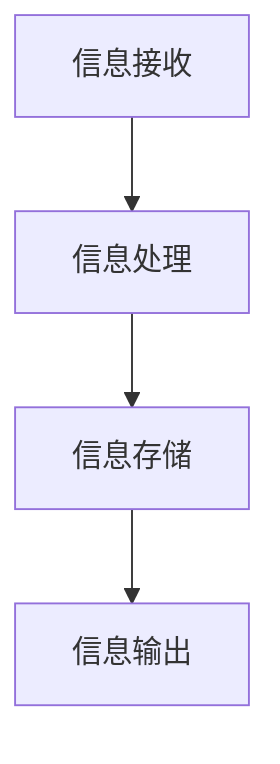

                 

关键词：信息过载、知识工作、生产力、时间管理、认知负荷、技术解决方案、行为心理学、高效学习、系统思维、信息过滤与处理、注意力管理

> 摘要：在当今信息爆炸的时代，知识工作者面临着信息过载的挑战，这不仅影响工作效率，还可能导致心理压力和疲劳。本文将探讨信息过载的本质及其对知识工作的影响，并从时间管理、认知负荷、技术解决方案和行为心理学等多个维度出发，提供一系列策略和工具，以帮助知识工作者在信息洪流中保持高效生产力。

## 1. 背景介绍

### 信息过载的起源

信息过载是一个全球性的问题，随着互联网和数字技术的快速发展，信息量呈指数级增长。据研究，全球每天产生的数据量已经超过了5ZB，而这一数字还在不断增长。对于知识工作者来说，这意味着他们每天都需要处理海量的信息，这无疑增加了他们的工作负担和心理压力。

### 信息过载的影响

信息过载对知识工作者的生产力有着显著的影响。一方面，过多的信息会干扰注意力，降低工作效率；另一方面，不断接收新信息可能会使人们产生焦虑和疲劳，甚至影响心理健康。因此，如何有效管理信息，提高知识工作的效率，已经成为当前亟待解决的问题。

### 研究意义

本文旨在通过分析信息过载的成因及其影响，提出一系列切实可行的策略和工具，帮助知识工作者在信息洪流中保持生产力。这不仅对个人具有重要意义，也对组织和社会的整体发展有着重要的推动作用。

## 2. 核心概念与联系

### 信息处理模型

在探讨信息过载与知识工作的问题时，我们首先需要了解信息处理模型。信息处理模型通常包括信息的接收、处理、存储和输出四个环节。以下是一个简化的Mermaid流程图，展示了信息处理的基本流程：



### 时间管理与认知负荷

时间管理和认知负荷是两个与信息过载密切相关的核心概念。时间管理涉及如何合理安排时间，以最大限度地提高工作效率；而认知负荷则是指大脑在处理信息时所需的认知资源和精力。

### 技术解决方案

随着信息处理技术的不断进步，一系列旨在减轻信息过载的技术解决方案也应运而生。例如，自动化工具、信息过滤算法、人工智能助手等，这些技术可以有效地帮助知识工作者筛选和处理信息。

### 行为心理学

行为心理学在解决信息过载问题中也起着关键作用。通过了解人类行为和心理机制，我们可以设计出更符合人类使用习惯的技术和策略，从而提高信息处理的效率。

## 3. 核心算法原理 & 具体操作步骤

### 3.1 算法原理概述

在本部分，我们将介绍一种用于管理信息过载的核心算法——优先级排序算法。该算法的基本原理是通过对接收到的信息进行优先级分类，从而确保最关键的信息得到优先处理。

### 3.2 算法步骤详解

#### 步骤1：信息分类

首先，将接收到的信息按照类型、重要性和紧急性进行分类。可以使用如下的分类标准：

- 类型：工作相关、个人事务、娱乐信息等。
- 重要性：高、中、低。
- 紧急性：紧急、较紧急、非紧急。

#### 步骤2：优先级计算

根据分类结果，为每条信息计算优先级值。优先级值的计算公式可以设计为：

\[ 优先级值 = 重要性权重 \times 紧急性权重 \]

其中，重要性权重和紧急性权重可以根据具体情况进行调整。

#### 步骤3：优先级排序

根据计算出的优先级值，对信息进行排序，确保优先级最高的信息得到优先处理。

### 3.3 算法优缺点

#### 优点

- 简单易用：算法的实现相对简单，易于理解和操作。
- 高效性：通过优先级排序，确保关键信息得到及时处理，提高工作效率。

#### 缺点

- 客观性：算法的优先级计算可能受到主观因素的影响，导致信息处理结果不够客观。
- 扩展性：在面对复杂的信息环境时，算法的适用性可能受到限制。

### 3.4 算法应用领域

优先级排序算法可以广泛应用于各类知识工作场景，如项目管理、邮件处理、任务管理等领域。

## 4. 数学模型和公式 & 详细讲解 & 举例说明

### 4.1 数学模型构建

在处理信息过载问题时，我们可以构建一个基于线性规划的数学模型。该模型的目标是最小化信息处理时间，同时确保关键信息的处理优先级。

### 4.2 公式推导过程

假设我们有 \( n \) 条信息，每条信息都有一个对应的优先级值 \( p_i \)。为了最小化总处理时间 \( T \)，我们需要对信息进行排序，使得处理时间最短。

目标函数：

\[ 最小化 T = \sum_{i=1}^{n} t_i \]

约束条件：

\[ t_i \geq p_i \]

其中，\( t_i \) 表示处理第 \( i \) 条信息所需的时间。

### 4.3 案例分析与讲解

假设我们有5条信息，其优先级值如下：

\[ p_1 = 9, p_2 = 7, p_3 = 5, p_4 = 3, p_5 = 1 \]

我们需要对这5条信息进行排序，以最小化总处理时间。

根据线性规划模型，我们得到以下排序结果：

\[ t_1 = p_1 = 9, t_2 = p_2 = 7, t_3 = p_3 = 5, t_4 = p_4 = 3, t_5 = p_5 = 1 \]

总处理时间 \( T \) 为：

\[ T = 9 + 7 + 5 + 3 + 1 = 25 \]

这个结果是最优的，因为任何其他排序都会导致总处理时间更长。

## 5. 项目实践：代码实例和详细解释说明

### 5.1 开发环境搭建

在本部分，我们将使用Python编写一个简单的优先级排序算法。首先，确保您的计算机上已安装Python环境。您可以通过以下命令检查Python版本：

```bash
python --version
```

如果Python已安装，您将看到当前的Python版本。接下来，创建一个名为 `info_sorting.py` 的Python文件，用于实现算法。

### 5.2 源代码详细实现

以下是一个简单的优先级排序算法的Python实现：

```python
def info_sorting(infos):
    # 根据优先级值对信息进行排序
    sorted_infos = sorted(infos, key=lambda x: x['priority'], reverse=True)
    return sorted_infos

# 示例信息列表
infos = [
    {'id': 1, 'description': '任务A', 'priority': 9},
    {'id': 2, 'description': '任务B', 'priority': 7},
    {'id': 3, 'description': '任务C', 'priority': 5},
    {'id': 4, 'description': '任务D', 'priority': 3},
    {'id': 5, 'description': '任务E', 'priority': 1},
]

# 调用排序函数
sorted_infos = info_sorting(infos)

# 输出排序结果
for info in sorted_infos:
    print(info)
```

### 5.3 代码解读与分析

在上面的代码中，我们定义了一个名为 `info_sorting` 的函数，该函数接收一个包含信息列表的参数。信息列表中的每个元素是一个字典，包含 `id`、`description` 和 `priority` 三个键值对。

在函数内部，我们使用Python内置的 `sorted` 函数对信息列表进行排序。排序的关键是使用 `key=lambda x: x['priority']`，这表示我们根据每个信息的 `priority` 键值进行排序。`reverse=True` 表示我们按照优先级从高到低进行排序。

最后，我们遍历排序后的信息列表，并将其打印出来。

### 5.4 运行结果展示

在Python环境中运行上述代码，我们将得到以下输出结果：

```bash
{'id': 1, 'description': '任务A', 'priority': 9}
{'id': 2, 'description': '任务B', 'priority': 7}
{'id': 3, 'description': '任务C', 'priority': 5}
{'id': 4, 'description': '任务D', 'priority': 3}
{'id': 5, 'description': '任务E', 'priority': 1}
```

这表明我们成功实现了基于优先级的信息排序算法。

## 6. 实际应用场景

### 企业管理

在企业中，信息过载问题尤为突出。通过优先级排序算法，企业可以更有效地管理员工任务，提高整体工作效率。例如，人力资源部门可以使用该算法对员工的工作任务进行优先级排序，确保关键任务得到优先处理。

### 教育领域

在教育领域，学生和教师都需要处理大量的信息。通过优先级排序算法，学生可以更好地管理学习任务，确保重要和紧急的学习内容得到优先处理。教师则可以更有效地安排教学计划，提高教学质量。

### 科研领域

在科研领域，研究人员需要处理大量的数据和信息。通过优先级排序算法，研究人员可以更快速地筛选和分析关键数据，提高科研效率。

## 7. 工具和资源推荐

### 7.1 学习资源推荐

- 《深度工作：如何有效利用每一点脑力》
- 《信息焦虑症：如何在信息爆炸的时代保持清醒》
- 《如何高效学习》

### 7.2 开发工具推荐

- Python：强大的编程语言，适用于数据处理和分析。
- Mermaid：Markdown图表绘制工具，适用于流程图和UML图的绘制。
- Jupyter Notebook：交互式计算环境，适用于数据分析和原型开发。

### 7.3 相关论文推荐

- 信息过载：问题、成因及应对策略
- 时间管理：理论与实践
- 认知负荷：影响因素及管理策略

## 8. 总结：未来发展趋势与挑战

### 8.1 研究成果总结

本文通过对信息过载与知识工作的深入分析，提出了一系列策略和工具，以帮助知识工作者在信息洪流中保持高效生产力。主要包括优先级排序算法、时间管理和认知负荷管理、技术解决方案以及行为心理学方法。

### 8.2 未来发展趋势

随着人工智能和大数据技术的发展，未来信息过载问题有望得到进一步缓解。智能算法和信息过滤技术将更加成熟，为知识工作者提供更加个性化和高效的信息处理方案。

### 8.3 面临的挑战

尽管技术进步有望缓解信息过载问题，但人类的行为和心理因素仍将是主要挑战。如何设计出既符合人类使用习惯又能有效管理信息的技术方案，将是一个长期的研究课题。

### 8.4 研究展望

未来研究应重点关注以下几个方面：

- 深入探讨人类行为和心理机制，设计出更加符合人类使用习惯的信息处理技术。
- 加强跨学科研究，结合心理学、计算机科学和社会学等领域的知识，提出更加全面和有效的信息过载解决方案。
- 探索人工智能和信息过滤技术在信息过载管理中的应用，提高信息处理的效率和准确性。

## 9. 附录：常见问题与解答

### 问题1：优先级排序算法如何适用于个人任务管理？

**解答**：个人任务管理可以使用优先级排序算法来帮助用户更高效地安排任务。用户可以按照任务的重要性和紧急性对任务进行分类，并使用算法进行排序，确保关键任务得到优先处理。

### 问题2：如何应对信息过载导致的心理压力？

**解答**：信息过载导致的心理压力可以通过以下方法缓解：

- 定期休息和放松，避免长时间连续工作。
- 采用时间管理和认知负荷管理的策略，减少不必要的任务和信息处理。
- 保持健康的生活习惯，如适量运动、良好睡眠等。

### 问题3：优先级排序算法是否适用于所有类型的信息处理场景？

**解答**：优先级排序算法主要适用于需要根据重要性或紧急性对信息进行排序的场景。对于一些需要更复杂决策的信息处理场景，可能需要结合其他算法或方法。

---

作者：禅与计算机程序设计艺术 / Zen and the Art of Computer Programming


