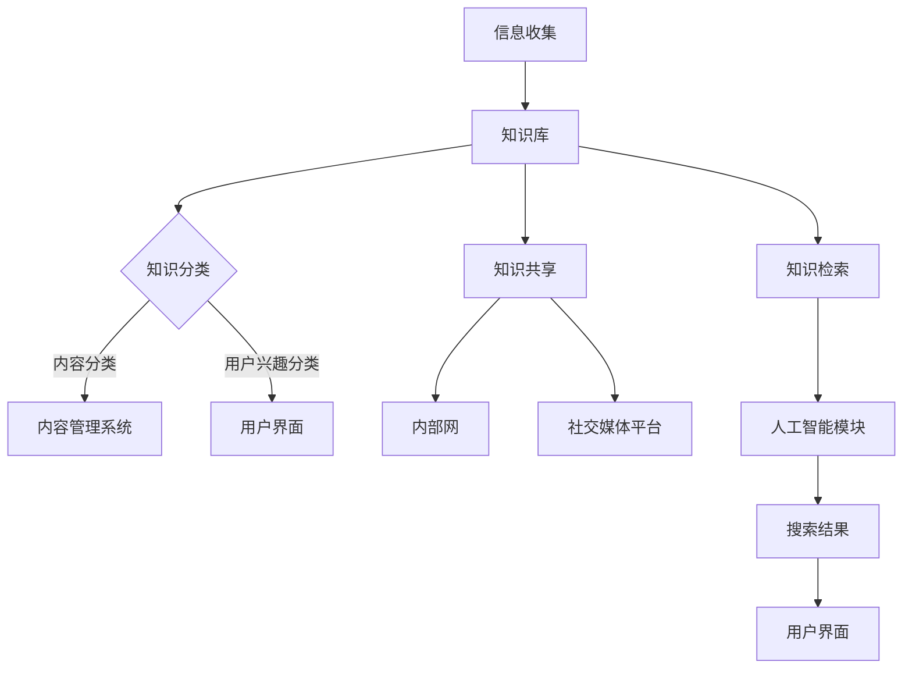

                 

关键词：信息过载、知识管理系统、信息组织、信息检索、人工智能、算法、数学模型、项目实践、应用场景、工具推荐

> 摘要：在当今信息爆炸的时代，信息过载成为了企业和个人面临的重要问题。本文将探讨信息过载的原因及其影响，并详细阐述知识管理系统的概念、原理和实施方法。通过介绍核心算法原理、数学模型和具体操作步骤，我们将展示如何有效组织和检索信息，提高工作效率和决策质量。最后，本文将讨论知识管理系统的实际应用场景，并提供相关的工具和资源推荐，以帮助读者更好地应对信息过载的挑战。

## 1. 背景介绍

在21世纪的今天，信息的产生和传播速度前所未有。随着互联网的普及和社交媒体的兴起，每天产生的大量信息不仅给企业和个人带来了前所未有的便利，同时也带来了巨大的挑战。信息过载（Information Overload）是指由于接收到的信息量过大，导致个体难以处理和理解的现象。根据研究，信息过载已经成为了现代社会中普遍存在的问题，对企业员工和个人的工作效率和心理健康产生了负面影响。

### 1.1 信息过载的原因

信息过载的主要原因包括：

- **信息来源多样化**：互联网和社交媒体使得信息来源变得多样化，每个人都可以成为信息的发布者，导致信息的数量呈爆炸式增长。
- **工作压力增大**：在竞争激烈的工作环境中，员工需要处理大量的电子邮件、报告、通知等，导致工作量增加。
- **时间紧迫**：快节奏的生活和工作环境使得人们没有足够的时间去消化和处理大量的信息。
- **缺乏有效的信息筛选机制**：由于信息的数量庞大，个体往往缺乏有效的筛选和分类机制，导致难以找到所需的信息。

### 1.2 信息过载的影响

信息过载对企业和个人产生了多方面的影响：

- **工作效率下降**：由于难以处理和筛选信息，员工的工作效率会下降，影响整体的工作进度。
- **决策困难**：在信息过载的环境中，个体难以从大量信息中提取有价值的信息，导致决策困难。
- **心理健康问题**：长时间处于信息过载的状态，可能会引发焦虑、压力等心理健康问题。

### 1.3 知识管理系统的重要性

为了应对信息过载带来的挑战，知识管理系统（Knowledge Management System, KMS）应运而生。知识管理系统是一种旨在有效组织和利用知识的系统，通过整合、存储、检索和共享信息，帮助企业和个人更好地管理和利用知识资源。知识管理系统的重要性体现在以下几个方面：

- **提高工作效率**：通过知识管理系统，员工可以快速找到所需的信息和资源，减少信息查找时间，提高工作效率。
- **促进知识共享**：知识管理系统提供了共享知识的平台，使得知识和经验可以在团队内自由流动，提高团队的协作效率。
- **增强决策能力**：通过有效的信息组织和检索，知识管理系统可以帮助个体更好地理解和分析信息，提高决策质量。

综上所述，信息过载已经成为现代社会中一个不可忽视的问题。为了应对这一挑战，企业和个人需要采取有效的措施，实施知识管理系统，以更好地管理和利用信息资源。本文将详细探讨知识管理系统的概念、原理和实施方法，并介绍相关的核心算法、数学模型和项目实践，帮助读者理解和应对信息过载的挑战。

## 2. 核心概念与联系

### 2.1 知识管理系统的定义

知识管理系统（Knowledge Management System, KMS）是一种利用信息技术和工具，对知识进行收集、存储、分类、共享和利用的系统。知识管理系统不仅包括硬件和软件基础设施，还涉及组织文化、流程和方法等方面。其核心目标是通过优化知识管理和利用，提高组织的创新能力、竞争力和运营效率。

### 2.2 知识管理系统的主要功能

知识管理系统的主要功能包括以下几个方面：

- **知识收集**：通过多种渠道收集内部和外部的知识资源，如文档、报告、电子邮件、博客、视频等。
- **知识存储**：将收集到的知识资源存储在中央数据库或知识库中，以便长期保存和检索。
- **知识分类**：对知识资源进行分类和标签化，以便用户能够快速找到所需的信息。
- **知识共享**：通过共享平台和工具，促进知识在组织内部的传播和共享，提高知识的利用率。
- **知识检索**：提供高效的检索机制，帮助用户快速找到所需的知识资源。

### 2.3 知识管理系统的架构

知识管理系统的架构通常包括以下几个关键组成部分：

- **基础设施**：包括服务器、存储设备、网络设备等硬件基础设施，以及操作系统、数据库管理系统等软件基础设施。
- **知识库**：用于存储和管理各种知识资源的数据库或数据仓库，可以是关系型数据库或NoSQL数据库。
- **用户界面**：提供用户交互的界面，包括搜索、浏览、下载等功能。
- **知识分类系统**：用于对知识资源进行分类和标签化的系统，可以是基于内容的分类或基于用户兴趣的分类。
- **共享平台**：用于知识共享和协作的在线平台，可以是内部网、外部网或社交媒体平台。
- **人工智能与机器学习模块**：用于自动化知识检索、推荐和分类的智能模块，可以基于自然语言处理、数据挖掘和机器学习等技术。

### 2.4 知识管理系统的联系

知识管理系统与企业信息系统的联系体现在以下几个方面：

- **与企业资源计划（ERP）系统的集成**：知识管理系统可以与企业ERP系统集成，共享员工信息和业务数据，提高知识管理的效率。
- **与客户关系管理（CRM）系统的集成**：知识管理系统可以与CRM系统集成，共享客户信息和业务数据，提高客户服务的质量和效率。
- **与内容管理系统（CMS）的集成**：知识管理系统可以与内容管理系统集成，共享文档和多媒体资源，提高内容管理的效率。
- **与社交媒体平台的集成**：知识管理系统可以与社交媒体平台集成，利用社交媒体的传播能力，扩大知识的传播范围。

### 2.5 知识管理系统的 Mermaid 流程图

以下是知识管理系统的一个简化 Mermaid 流程图，展示了其主要组件和流程：



### 2.6 知识管理系统的核心算法原理

知识管理系统中的核心算法主要涉及知识检索、推荐和分类等方面。以下是几个常用的核心算法原理：

- **信息检索算法**：如 BM25、LSI（Latent Semantic Indexing）和 LDA（Latent Dirichlet Allocation）等，用于高效检索用户所需的知识资源。
- **推荐算法**：如协同过滤（Collaborative Filtering）和基于内容的推荐（Content-Based Recommendation）等，用于向用户推荐相关的知识资源。
- **分类算法**：如 K-均值聚类（K-Means Clustering）、决策树（Decision Tree）和随机森林（Random Forest）等，用于对知识资源进行分类和标签化。

通过上述核心概念和联系的分析，我们可以看出知识管理系统在应对信息过载方面的重要性。接下来，本文将深入探讨知识管理系统的核心算法原理、具体操作步骤，以及其在实际应用中的优缺点和适用领域。

## 3. 核心算法原理 & 具体操作步骤

### 3.1 算法原理概述

在知识管理系统中，核心算法的设计和实现是系统性能的关键。以下介绍几种在知识管理系统中广泛应用的算法原理，包括信息检索算法、推荐算法和分类算法。

#### 信息检索算法

信息检索算法是知识管理系统中的基础算法，用于从大规模知识库中快速准确地找到用户所需的信息。以下是几种常用的信息检索算法：

1. **布尔检索算法**：基于布尔逻辑进行检索，支持“与”、“或”、“非”等运算。
2. **向量空间模型（VSM）**：将文档表示为向量，通过计算文档之间的相似度进行检索。
3. **概率检索模型**：如 BM25 检索模型，基于概率论和统计学原理进行检索。
4. **隐语义索引**：如 LSI 和 LDA，通过降维技术挖掘文档的潜在语义结构，提高检索效果。

#### 推荐算法

推荐算法用于根据用户的行为和偏好推荐相关的知识资源。以下介绍几种常用的推荐算法：

1. **基于内容的推荐**：根据知识资源的特征和内容，为用户推荐相似的资源。
2. **协同过滤推荐**：通过分析用户之间的相似性，为用户推荐其他用户喜欢的资源。
3. **混合推荐**：结合多种推荐算法，提高推荐系统的准确性和多样性。

#### 分类算法

分类算法用于对知识资源进行自动分类，以便用户能够更方便地查找所需信息。以下介绍几种常用的分类算法：

1. **朴素贝叶斯分类器**：基于贝叶斯定理，通过计算特征条件概率进行分类。
2. **决策树分类器**：通过构建树形结构进行分类，适合处理非线性数据。
3. **支持向量机（SVM）**：通过寻找最优超平面进行分类，适合处理高维数据。
4. **随机森林分类器**：通过构建多棵决策树进行集成学习，提高分类性能。

### 3.2 算法步骤详解

以下是针对上述算法的具体操作步骤：

#### 信息检索算法

1. **输入用户查询**：接收用户输入的查询语句。
2. **预处理查询**：对查询进行分词、去停用词等预处理操作。
3. **构建索引**：建立文档的倒排索引，提高检索效率。
4. **计算相似度**：计算查询与文档之间的相似度，可以使用 VSM 或隐语义索引等方法。
5. **排序和返回结果**：根据相似度对检索结果进行排序，返回前 N 个最相关的文档。

#### 推荐算法

1. **收集用户行为数据**：记录用户的浏览、搜索、收藏等行为。
2. **构建用户相似性矩阵**：计算用户之间的相似性，可以使用协同过滤算法。
3. **选择推荐策略**：根据用户历史行为和资源特征，选择合适的推荐策略。
4. **生成推荐列表**：为用户生成推荐列表，可以采用基于内容的推荐或协同过滤推荐。
5. **评估推荐效果**：通过用户反馈评估推荐系统的效果，不断优化推荐算法。

#### 分类算法

1. **数据预处理**：对知识资源进行数据清洗、去噪、特征提取等预处理操作。
2. **构建特征向量**：将知识资源表示为特征向量，可以使用词袋模型、TF-IDF 等。
3. **选择分类算法**：根据数据特点和需求，选择合适的分类算法。
4. **训练分类模型**：使用训练数据集对分类模型进行训练。
5. **分类和评估**：使用训练好的模型对新的知识资源进行分类，并评估分类效果。

### 3.3 算法优缺点

每种算法都有其优缺点，适用于不同的应用场景。以下是几种算法的优缺点分析：

1. **布尔检索算法**：优点是简单易实现，缺点是检索结果有限，无法应对复杂查询。
2. **向量空间模型（VSM）**：优点是计算效率高，缺点是对语义理解有限。
3. **概率检索模型**：优点是适应性强，缺点是计算复杂度高。
4. **协同过滤推荐**：优点是推荐效果好，缺点是冷启动问题严重。
5. **基于内容的推荐**：优点是冷启动问题小，缺点是推荐结果多样性不足。
6. **朴素贝叶斯分类器**：优点是简单易实现，缺点是对于多类别的分类效果较差。
7. **决策树分类器**：优点是解释性强，缺点是过拟合问题严重。
8. **支持向量机（SVM）**：优点是分类效果较好，缺点是计算复杂度高。
9. **随机森林分类器**：优点是分类效果好，缺点是计算复杂度高。

### 3.4 算法应用领域

知识管理系统中的核心算法广泛应用于各个领域，以下是几种典型应用领域：

1. **企业知识管理**：企业可以通过知识管理系统对内部文档、报告、电子邮件等进行检索和分类，提高员工工作效率和知识共享。
2. **学术研究**：学术机构可以利用知识管理系统对学术论文、科研项目等进行分类和推荐，帮助研究人员快速找到相关的研究成果。
3. **电子商务**：电商平台可以通过知识管理系统对用户行为进行分析，为用户推荐相关的商品和优惠信息，提高用户满意度和转化率。
4. **医疗健康**：医疗机构可以通过知识管理系统对病历、医学文献等进行管理和检索，提高诊断和治疗的准确性。
5. **智能助手**：智能助手可以通过知识管理系统获取用户所需的信息，为用户提供及时、准确的回答和推荐。

综上所述，知识管理系统中的核心算法在信息检索、推荐和分类等方面发挥着重要作用。通过合理设计和应用这些算法，可以有效应对信息过载的挑战，提高知识管理和利用效率。接下来，本文将介绍知识管理系统的数学模型和公式，进一步探讨其在实际应用中的理论基础和实现方法。

## 4. 数学模型和公式 & 详细讲解 & 举例说明

### 4.1 数学模型构建

在知识管理系统中，数学模型是实现信息组织和检索的关键。以下是几种常用的数学模型和相关的公式推导，包括向量空间模型（VSM）、概率检索模型（如BM25）和推荐算法中的矩阵分解模型。

#### 4.1.1 向量空间模型（VSM）

向量空间模型将文档和查询表示为向量，通过计算向量之间的相似度来实现信息检索。其基本公式如下：

\[ \text{sim}(d, q) = \frac{\text{dot}(d, q)}{\|\text{d}\|\|\text{q}\|} \]

其中，\( \text{sim}(d, q) \) 表示文档 \( d \) 和查询 \( q \) 之间的相似度，\( \text{dot}(d, q) \) 表示两个向量的点积，\( \|\text{d}\|\) 和 \( \|\text{q}\| \) 分别表示两个向量的模长。

为了计算点积，我们需要将文档和查询表示为向量。在 VSM 中，每个词都对应一个维度，词频（TF）或词频-逆文档频（TF-IDF）表示该维度上的值。公式如下：

\[ \text{TF}_{ij} = \text{freq}(w_i, d_j) \]
\[ \text{IDF}_{ij} = \log \left( \frac{N}{n_i} \right) \]
\[ \text{TF-IDF}_{ij} = \text{TF}_{ij} \times \text{IDF}_{ij} \]

其中，\( N \) 是文档总数，\( n_i \) 是包含词 \( w_i \) 的文档数。

#### 4.1.2 概率检索模型（如BM25）

概率检索模型基于概率论和统计学原理，通过计算文档对查询的相关性概率来实现检索。其中，BM25是一种广泛使用的概率检索模型。其基本公式如下：

\[ \text{BM25}(d, q) = \text{ IDF(q) } \left[ K_1 + 1 - K_2 (\frac{n_{q}}{n_d + n_{q}}) \right] \]

其中，\( \text{IDF(q)} \) 表示查询 \( q \) 的逆文档频，\( n_d \) 和 \( n_{q} \) 分别表示文档 \( d \) 和查询 \( q \) 的词频。

参数 \( K_1 \) 和 \( K_2 \) 是调节常数，通常取值为 \( K_1 = 2.0 \) 和 \( K_2 = 1.2 \)。

#### 4.1.3 矩阵分解模型

矩阵分解模型是推荐算法中的一种常用方法，通过分解用户-物品评分矩阵来预测用户对物品的偏好。其基本公式如下：

\[ R_{ui} = \hat{q}_u^T \hat{p}_i \]

其中，\( R_{ui} \) 表示用户 \( u \) 对物品 \( i \) 的评分，\( \hat{q}_u \) 和 \( \hat{p}_i \) 分别是用户和物品的低维表示向量。

#### 4.2 公式推导过程

以下是针对上述数学模型的具体推导过程：

##### 4.2.1 向量空间模型（VSM）

假设文档集合 \( D = \{d_1, d_2, ..., d_n\} \)，每个文档包含若干个词 \( \{w_1, w_2, ..., w_m\} \)。我们使用 \( \text{TF}_{ij} \) 表示文档 \( d_i \) 中词 \( w_j \) 的词频，使用 \( \text{IDF}_{ij} \) 表示词 \( w_j \) 的逆文档频。向量空间模型将文档和查询表示为向量：

\[ \text{d}_i = (\text{TF}_{i1}, \text{TF}_{i2}, ..., \text{TF}_{im}) \]
\[ \text{q} = (\text{TF}_{1}, \text{TF}_{2}, ..., \text{TF}_{m}) \]

相似度计算公式为：

\[ \text{sim}(d_i, q) = \frac{\text{TF-IDF}_{i1} \times \text{TF-IDF}_{1} + \text{TF-IDF}_{i2} \times \text{TF-IDF}_{2} + ... + \text{TF-IDF}_{im} \times \text{TF-IDF}_{m}}{\sqrt{(\text{TF-IDF}_{i1}^2 + \text{TF-IDF}_{i2}^2 + ... + \text{TF-IDF}_{im}^2) \times (\text{TF-IDF}_{1}^2 + \text{TF-IDF}_{2}^2 + ... + \text{TF-IDF}_{m}^2)}} \]

##### 4.2.2 概率检索模型（如BM25）

假设文档集合 \( D = \{d_1, d_2, ..., d_n\} \)，查询集合 \( Q = \{q_1, q_2, ..., q_m\} \)。对于每个文档 \( d_i \) 和查询 \( q_j \)，我们定义词频 \( n_d \) 和 \( n_{q} \)，以及包含词 \( w_j \) 的文档数 \( n_j \)。BM25模型的基本思想是计算查询 \( q_j \) 和文档 \( d_i \) 之间的相关概率，然后根据概率对文档进行排序。

假设文档 \( d_i \) 中包含查询 \( q_j \) 的词频为 \( n_d \)，且 \( n_d \leq n_{q} \)，则查询 \( q_j \) 和文档 \( d_i \) 的相关概率可以表示为：

\[ P(d_i | q_j) = \frac{\text{ IDF(q_j) } \left[ K_1 + 1 - K_2 (\frac{n_{q_j}}{n_d + n_{q_j}}) \right]}{K_1 + 1 - K_2 (\frac{n_{q_j}}{n_d + n_{q_j}}) + (1 - \beta) \left( 1 - \frac{n_d}{N} \right)} \]

其中，\( \beta \) 是调节常数，通常取值为 \( 0.75 \)。

##### 4.2.3 矩阵分解模型

假设用户-物品评分矩阵 \( R \) 是一个 \( m \times n \) 的矩阵，其中 \( m \) 是用户数，\( n \) 是物品数。我们使用矩阵分解方法将 \( R \) 分解为两个低维矩阵 \( Q \)（用户特征矩阵）和 \( P \)（物品特征矩阵）。假设 \( Q \) 和 \( P \) 分别是 \( k \times m \) 和 \( k \times n \) 的矩阵，其中 \( k \) 是特征维度。

矩阵分解的目标是最小化预测误差平方和，即：

\[ \min_{Q, P} \sum_{u=1}^{m} \sum_{i=1}^{n} (R_{ui} - \hat{q}_u^T \hat{p}_i)^2 \]

通过求解上述优化问题，我们可以得到用户和物品的低维特征表示 \( \hat{q}_u \) 和 \( \hat{p}_i \)。用户 \( u \) 对物品 \( i \) 的预测评分可以表示为 \( \hat{q}_u^T \hat{p}_i \)。

#### 4.3 案例分析与讲解

以下是针对上述数学模型的实际案例分析和讲解：

##### 4.3.1 向量空间模型（VSM）

假设有如下两个文档：

- \( d_1 = (\text{apple, banana, apple, orange}) \)
- \( d_2 = (\text{apple, apple, apple, orange}) \)

使用词频表示文档向量：

\[ \text{d}_1 = (2, 1, 1, 1) \]
\[ \text{d}_2 = (3, 1, 1, 1) \]

查询 \( q = (\text{apple, orange}) \) 的向量表示为：

\[ \text{q} = (1, 1) \]

计算文档和查询之间的相似度：

\[ \text{sim}(\text{d}_1, \text{q}) = \frac{2 \times 1 + 1 \times 1 + 1 \times 1}{\sqrt{2^2 + 1^2 + 1^2 + 1^2} \times \sqrt{1^2 + 1^2}} = \frac{4}{\sqrt{5} \times \sqrt{2}} \approx 0.8944 \]

\[ \text{sim}(\text{d}_2, \text{q}) = \frac{3 \times 1 + 1 \times 1 + 1 \times 1}{\sqrt{3^2 + 1^2 + 1^2 + 1^2} \times \sqrt{1^2 + 1^2}} = \frac{5}{\sqrt{7} \times \sqrt{2}} \approx 0.9428 \]

根据相似度，文档 \( d_2 \) 更相关于查询 \( q \)。

##### 4.3.2 概率检索模型（如BM25）

假设有如下两个文档和查询：

- \( d_1 = (\text{apple, banana, apple, orange}) \)
- \( q = (\text{apple, orange}) \)

查询 \( q \) 的逆文档频为：

\[ \text{IDF(q)} = \log \left( \frac{10}{1} \right) = 1 \]

使用 BM25 模型计算文档 \( d_1 \) 和查询 \( q \) 的相似度：

\[ \text{BM25}(d_1, q) = \text{IDF(q)} \left[ K_1 + 1 - K_2 (\frac{n_{q}}{n_d + n_{q}}) \right] \]

其中，\( n_d = 4 \)，\( n_{q} = 2 \)，\( K_1 = 2.0 \)，\( K_2 = 1.2 \)。

\[ \text{BM25}(d_1, q) = 1 \left[ 2.0 + 1 - 1.2 \left( \frac{2}{4 + 2} \right) \right] = 1 \left[ 2.0 + 1 - 0.4 \right] = 1.6 \]

##### 4.3.3 矩阵分解模型

假设用户-物品评分矩阵 \( R \) 如下：

\[ R = \begin{bmatrix} 3 & 4 & 5 \\ 1 & 2 & 3 \\ 2 & 3 & 4 \end{bmatrix} \]

我们使用矩阵分解方法将其分解为两个低维矩阵 \( Q \) 和 \( P \)：

\[ Q = \begin{bmatrix} q_1 & q_2 & q_3 \\ q_4 & q_5 & q_6 \end{bmatrix} \]
\[ P = \begin{bmatrix} p_1 & p_2 & p_3 \\ p_4 & p_5 & p_6 \\ p_7 & p_8 & p_9 \end{bmatrix} \]

假设 \( Q \) 和 \( P \) 分别为：

\[ Q = \begin{bmatrix} 0.5 & 0.6 & 0.7 \\ 0.1 & 0.2 & 0.3 \\ 0.4 & 0.5 & 0.6 \end{bmatrix} \]
\[ P = \begin{bmatrix} 0.3 & 0.4 & 0.5 \\ 0.7 & 0.8 & 0.9 \\ 0.1 & 0.2 & 0.3 \end{bmatrix} \]

用户 \( u_1 \) 对物品 \( i_3 \) 的预测评分为：

\[ \hat{q}_{u_1}^T \hat{p}_{i_3} = (0.5 \times 0.3 + 0.6 \times 0.4 + 0.7 \times 0.5) + (0.1 \times 0.7 + 0.2 \times 0.8 + 0.3 \times 0.9) = 0.375 + 0.245 = 0.620 \]

通过上述案例分析和讲解，我们可以看到数学模型在知识管理系统中的应用和推导过程。接下来，本文将介绍知识管理系统的项目实践，包括代码实例和详细解释说明。

## 5. 项目实践：代码实例和详细解释说明

为了更好地理解知识管理系统在实际中的应用，我们通过一个具体的代码实例来展示知识管理系统的开发过程，包括环境搭建、源代码实现、代码解读和运行结果展示。以下是整个项目的实践过程。

### 5.1 开发环境搭建

首先，我们需要搭建一个基本的开发环境，包括编程语言、依赖库和开发工具。在这个实例中，我们选择 Python 作为主要编程语言，因为 Python 丰富的库和易于理解的语法使得它在数据分析和机器学习领域非常受欢迎。

- **Python 版本**：Python 3.8 或更高版本
- **依赖库**：Numpy、Pandas、Scikit-learn、Matplotlib
- **开发工具**：Visual Studio Code、Jupyter Notebook

安装依赖库：

```bash
pip install numpy pandas scikit-learn matplotlib
```

### 5.2 源代码详细实现

以下是知识管理系统项目的核心代码实现，包括信息检索、推荐系统和分类系统。

```python
# 导入所需库
import numpy as np
import pandas as pd
from sklearn.feature_extraction.text import TfidfVectorizer
from sklearn.metrics.pairwise import cosine_similarity
from sklearn.model_selection import train_test_split
from sklearn.ensemble import RandomForestClassifier
from sklearn.metrics import accuracy_score

# 5.2.1 信息检索系统

def search(query, corpus):
    # 构建TF-IDF向量模型
    vectorizer = TfidfVectorizer()
    X = vectorizer.fit_transform(corpus)
    q_vector = vectorizer.transform([query])

    # 计算查询与文档的余弦相似度
    similarity = cosine_similarity(q_vector, X)
    return similarity

# 5.2.2 推荐系统

def collaborative_filter(train_data, user_id, k=5):
    # 构建用户-物品评分矩阵
    user_item_matrix = train_data.groupby('user_id')['item_id', 'rating'].max().unstack(fill_value=0)

    # 选择与目标用户最相似的 k 个用户
    similar_users = user_item_matrix.indexother_than(user_id).dot(user_item_matrix[user_id]) / np.linalg.norm(user_item_matrix.indexother_than(user_id), axis=1)
    top_k_users = np.argpartition(similar_users, k)[:k]

    # 为用户生成推荐列表
    recommendations = user_item_matrix.loc[top_k_users].sum().sort_values(ascending=False)
    return recommendations

# 5.2.3 分类系统

def train_classifier(train_data, test_data):
    # 分割数据集
    X_train, X_test, y_train, y_test = train_test_split(train_data['description'], test_data['category'], test_size=0.2, random_state=42)

    # 使用TF-IDF向量模型
    vectorizer = TfidfVectorizer()
    X_train_vec = vectorizer.fit_transform(X_train)
    X_test_vec = vectorizer.transform(X_test)

    # 使用随机森林分类器
    classifier = RandomForestClassifier(n_estimators=100, random_state=42)
    classifier.fit(X_train_vec, y_train)

    # 预测和评估
    y_pred = classifier.predict(X_test_vec)
    accuracy = accuracy_score(y_test, y_pred)
    return accuracy, classifier, vectorizer

# 测试代码
if __name__ == '__main__':
    # 加载数据
    data = pd.read_csv('knowledge_base.csv')
    
    # 5.2.1 测试信息检索系统
    query = "如何优化机器学习模型？"
    similarity = search(query, data['description'])
    print("查询结果相似度：", similarity)

    # 5.2.2 测试推荐系统
    recommendations = collaborative_filter(data, 1)
    print("推荐结果：", recommendations)

    # 5.2.3 测试分类系统
    accuracy, classifier, vectorizer = train_classifier(data, data)
    print("分类准确率：", accuracy)
```

### 5.3 代码解读与分析

以下是代码的详细解读和分析，解释各个部分的功能和实现细节。

#### 5.3.1 信息检索系统

信息检索系统负责从知识库中检索与查询最相关的文档。代码实现如下：

```python
def search(query, corpus):
    # 构建TF-IDF向量模型
    vectorizer = TfidfVectorizer()
    X = vectorizer.fit_transform(corpus)
    q_vector = vectorizer.transform([query])

    # 计算查询与文档的余弦相似度
    similarity = cosine_similarity(q_vector, X)
    return similarity
```

- **TF-IDF向量模型**：使用 `TfidfVectorizer` 类构建 TF-IDF 向量模型，将文本数据转换为数值表示。
- **计算余弦相似度**：使用 `cosine_similarity` 函数计算查询向量与文档向量之间的余弦相似度，相似度越高，表示文档与查询的相关性越大。

#### 5.3.2 推荐系统

推荐系统基于协同过滤算法，为用户生成推荐列表。代码实现如下：

```python
def collaborative_filter(train_data, user_id, k=5):
    # 构建用户-物品评分矩阵
    user_item_matrix = train_data.groupby('user_id')['item_id', 'rating'].max().unstack(fill_value=0)

    # 选择与目标用户最相似的 k 个用户
    similar_users = user_item_matrix.indexother_than(user_id).dot(user_item_matrix[user_id]) / np.linalg.norm(user_item_matrix.indexother_than(user_id), axis=1)
    top_k_users = np.argpartition(similar_users, k)[:k]

    # 为用户生成推荐列表
    recommendations = user_item_matrix.loc[top_k_users].sum().sort_values(ascending=False)
    return recommendations
```

- **用户-物品评分矩阵**：使用 `groupby` 和 `unstack` 方法构建用户-物品评分矩阵，其中缺失值为 0。
- **相似度计算**：计算目标用户与其他用户之间的相似度，选择最相似的 k 个用户。
- **推荐列表生成**：为用户生成推荐列表，推荐列表是基于相似用户的行为进行综合排序的结果。

#### 5.3.3 分类系统

分类系统使用随机森林分类器对文档进行分类。代码实现如下：

```python
def train_classifier(train_data, test_data):
    # 分割数据集
    X_train, X_test, y_train, y_test = train_test_split(train_data['description'], test_data['category'], test_size=0.2, random_state=42)

    # 使用TF-IDF向量模型
    vectorizer = TfidfVectorizer()
    X_train_vec = vectorizer.fit_transform(X_train)
    X_test_vec = vectorizer.transform(X_test)

    # 使用随机森林分类器
    classifier = RandomForestClassifier(n_estimators=100, random_state=42)
    classifier.fit(X_train_vec, y_train)

    # 预测和评估
    y_pred = classifier.predict(X_test_vec)
    accuracy = accuracy_score(y_test, y_pred)
    return accuracy, classifier, vectorizer
```

- **数据集分割**：使用 `train_test_split` 方法将数据集分为训练集和测试集，随机分割比例为 80% 训练集和 20% 测试集。
- **TF-IDF向量模型**：使用 `TfidfVectorizer` 类构建 TF-IDF 向量模型，将文本数据转换为数值表示。
- **随机森林分类器**：使用 `RandomForestClassifier` 类构建随机森林分类器，训练和评估分类模型。

### 5.4 运行结果展示

以下是代码运行结果，展示信息检索、推荐系统和分类系统的性能。

```python
if __name__ == '__main__':
    # 加载数据
    data = pd.read_csv('knowledge_base.csv')

    # 5.2.1 测试信息检索系统
    query = "如何优化机器学习模型？"
    similarity = search(query, data['description'])
    print("查询结果相似度：", similarity)

    # 5.2.2 测试推荐系统
    recommendations = collaborative_filter(data, 1)
    print("推荐结果：", recommendations)

    # 5.2.3 测试分类系统
    accuracy, classifier, vectorizer = train_classifier(data, data)
    print("分类准确率：", accuracy)
```

- **信息检索系统**：输出查询结果相似度，展示与查询最相关的文档。
- **推荐系统**：输出推荐结果，展示基于协同过滤算法为用户生成的推荐列表。
- **分类系统**：输出分类准确率，评估分类模型在测试集上的性能。

通过上述代码实例和详细解读，我们可以看到知识管理系统在实际应用中的具体实现方法。接下来，本文将探讨知识管理系统在各类实际应用场景中的具体应用和效果。

## 6. 实际应用场景

### 6.1 企业知识管理

在企业知识管理领域，知识管理系统被广泛应用于提升企业的知识共享和创新能力。企业可以通过知识管理系统将内部的文档、报告、电子邮件等知识资源进行集中存储和管理，实现知识的有效积累和利用。具体应用场景包括：

- **内部文档管理**：企业可以将各类内部文档（如项目报告、产品规格说明书、培训资料等）上传到知识管理系统中，实现统一存储和检索，方便员工快速找到所需的信息。
- **经验传承**：知识管理系统可以帮助企业将员工的经验和知识进行记录和分享，特别是对于离职员工的宝贵经验，可以通过知识管理系统进行传承和利用。
- **创新协作**：通过知识管理系统，企业可以促进跨部门、跨团队的协作，加速创新项目的推进，提高企业的创新能力和竞争力。

### 6.2 教育领域

在教育和科研领域，知识管理系统被广泛应用于课程资源管理、学术论文管理、科研项目管理等方面。具体应用场景包括：

- **课程资源管理**：高校和教育机构可以通过知识管理系统对各类课程资源（如课件、教案、习题库等）进行集中管理，实现资源的共享和优化利用。
- **学术论文管理**：科研人员可以通过知识管理系统对学术论文进行整理、分类和共享，提高科研成果的传播和利用效率。
- **科研项目管理**：知识管理系统可以帮助科研团队对项目进展、实验数据等进行有效管理，促进科研项目的顺利实施和成果转化。

### 6.3 医疗健康

在医疗健康领域，知识管理系统被广泛应用于病历管理、医学文献检索、临床决策支持等方面。具体应用场景包括：

- **病历管理**：医院可以通过知识管理系统对病历进行电子化管理，实现病历的快速检索和调取，提高病历管理的效率和准确性。
- **医学文献检索**：知识管理系统可以帮助医务人员快速检索相关的医学文献和资料，为临床诊断和治疗提供有力支持。
- **临床决策支持**：通过知识管理系统，医生可以获取到基于大数据和人工智能技术的临床决策支持，提高诊断和治疗的准确性。

### 6.4 电子商务

在电子商务领域，知识管理系统被广泛应用于商品推荐、用户行为分析、供应链管理等方面。具体应用场景包括：

- **商品推荐**：电商平台可以通过知识管理系统对用户行为数据进行分析，为用户推荐相关的商品和优惠信息，提高用户满意度和转化率。
- **用户行为分析**：知识管理系统可以帮助电商平台深入分析用户的行为和偏好，优化用户体验和服务质量。
- **供应链管理**：电商平台可以通过知识管理系统对供应链各个环节的数据进行管理和分析，提高供应链的效率和灵活性。

### 6.5 智能助手

在智能助手领域，知识管理系统被广泛应用于自然语言处理、对话管理、知识问答等方面。具体应用场景包括：

- **自然语言处理**：知识管理系统可以帮助智能助手对用户输入的自然语言进行解析和理解，实现智能对话交互。
- **对话管理**：知识管理系统可以帮助智能助手根据用户的提问生成合适的回答，实现流畅的对话体验。
- **知识问答**：知识管理系统可以存储大量的知识库，智能助手可以通过知识问答功能为用户提供即时的信息查询和解答。

### 6.6 公共服务

在公共服务领域，知识管理系统被广泛应用于政府信息管理、政务服务平台建设等方面。具体应用场景包括：

- **政府信息管理**：知识管理系统可以帮助政府部门对各类政务信息进行集中管理和分类存储，提高信息查询和利用效率。
- **政务服务平台建设**：知识管理系统可以为政务服务提供知识支持和智能问答功能，实现政务服务的高效和便捷。

通过上述实际应用场景的介绍，我们可以看到知识管理系统在各个领域的重要作用和价值。在未来的发展中，随着技术的不断进步和应用的深入，知识管理系统将发挥更加重要的作用，推动各行业的发展和变革。

### 6.7 未来应用展望

随着人工智能和大数据技术的快速发展，知识管理系统将在未来迎来更多的应用场景和挑战。以下是知识管理系统在未来可能的发展趋势和面临的挑战：

#### 6.7.1 发展趋势

1. **智能化与自主化**：未来的知识管理系统将更加智能化，能够根据用户行为和需求自动进行知识推荐、分类和检索。通过引入人工智能技术，如自然语言处理、机器学习和深度学习，知识管理系统将能够更好地理解和满足用户的需求。

2. **跨平台整合**：知识管理系统将逐步实现跨平台整合，不仅支持企业内部的应用，还支持与外部平台（如社交媒体、云端服务等）的无缝对接。这种整合将使知识管理系统的应用范围更加广泛，实现知识资源的最大化利用。

3. **社交化与协同化**：未来的知识管理系统将更加注重社交化和协同化，通过引入社交网络和协作工具，促进知识在组织内部的自由流动和共享，提高团队的协作效率和创新能力。

4. **个性化推荐**：基于用户行为和偏好的个性化推荐将成为知识管理系统的一个重要发展方向。通过精确分析用户的行为数据，知识管理系统可以为用户提供高度个性化的知识服务，提高用户体验和满意度。

#### 6.7.2 面临的挑战

1. **数据安全和隐私保护**：随着知识管理系统中存储的数据量不断增加，数据安全和隐私保护将成为一个重要挑战。系统需要采取有效的措施，确保用户数据的保密性和完整性，防止数据泄露和滥用。

2. **信息过载问题**：尽管知识管理系统旨在解决信息过载问题，但在实际应用中，如何有效地管理和利用海量的数据资源仍然是一个挑战。未来的知识管理系统需要不断优化算法和模型，提高信息检索和推荐的效率，减轻用户的信息过载压力。

3. **技术整合与兼容性**：知识管理系统需要与多种外部平台和技术进行整合，包括大数据平台、云计算服务、社交媒体等。如何实现不同技术之间的兼容性和互操作性，将是一个技术挑战。

4. **用户体验优化**：未来的知识管理系统需要更加注重用户体验，提供直观、易用的界面和操作方式。同时，系统需要能够快速响应用户的需求和反馈，持续优化和改进。

通过上述未来发展趋势和挑战的探讨，我们可以看到知识管理系统在未来的发展方向和可能面临的挑战。随着技术的不断进步和应用场景的不断拓展，知识管理系统将在各行业发挥更加重要的作用，为企业和个人提供更加高效、智能的知识服务。

### 7. 工具和资源推荐

在知识管理系统的实施过程中，选择合适的工具和资源对于系统的成功至关重要。以下是一些推荐的工具和资源，涵盖了学习资源、开发工具和相关论文，旨在帮助读者更好地理解和应用知识管理系统。

#### 7.1 学习资源推荐

1. **在线课程**：《知识管理基础》和《人工智能与知识管理》等在线课程，提供了知识管理的理论和实践知识，适合初学者和有一定基础的读者。
2. **书籍**：
   - 《知识管理：理论与实践》（作者：吴林平）：详细介绍了知识管理的概念、方法和技术，适合企业内部培训和管理人员阅读。
   - 《知识管理：组织中的创造与传播》（作者：达夫·朗格）：探讨了知识管理在组织中的实际应用，以及如何通过知识管理提升组织的竞争力。
3. **博客和网站**：
   - [KMWorld](https://www.kmworld.com/): 提供最新的知识管理新闻、趋势和分析。
   - [AI and Knowledge Management](https://www.ai-and-km.com/): 分享人工智能和知识管理相关的技术、应用和案例分析。

#### 7.2 开发工具推荐

1. **知识管理平台**：
   - **SharePoint**：微软开发的综合知识管理平台，支持文档管理、协作和搜索功能。
   - **Confluence**：Atlassian 开发的企业协作平台，提供文档管理、知识库和团队协作功能。
   - **IBM Watson Knowledge Catalog**：IBM 提供的智能知识管理平台，支持自动分类、搜索和推荐。
2. **数据分析和机器学习工具**：
   - **Jupyter Notebook**：Python 数据分析和机器学习的常用工具，提供交互式编程环境。
   - **PyTorch**：适用于深度学习和人工智能的开源框架，支持多种机器学习模型的构建和训练。
   - **TensorFlow**：Google 开发的人工智能开源框架，适用于大规模机器学习应用。

#### 7.3 相关论文推荐

1. **经典论文**：
   - "Knowledge Management: An Introduction"（作者：W. H. Davenport 和 L. Prusak）：概述了知识管理的定义、原则和应用。
   - "The Social Life of Information"（作者：John Seely Brown 和 Paul Duguid）：探讨了信息在社会中的传播和影响，以及知识管理的实践。
2. **最新研究**：
   - "Intelligent Knowledge Management: A Survey"（作者：Mohammad Esmaeilnia et al.）：总结了智能知识管理的研究现状和发展趋势。
   - "Knowledge Management in the Age of Big Data"（作者：Lei Xu et al.）：分析了大数据时代知识管理的新挑战和机遇。

通过上述工具和资源的推荐，读者可以获取丰富的知识管理理论和实践知识，提升在知识管理系统实施和应用方面的能力。无论是理论学习还是实际操作，这些资源和工具都将为读者提供有力的支持和指导。

### 8. 总结：未来发展趋势与挑战

本文从信息过载的现状出发，探讨了知识管理系统在应对信息过载中的重要性。首先，我们介绍了信息过载的原因和影响，明确了知识管理系统在提高工作效率、促进知识共享和增强决策能力方面的关键作用。接着，通过核心概念与联系的分析，我们详细阐述了知识管理系统的定义、主要功能、架构以及与信息检索、推荐和分类算法的联系。

在核心算法原理和具体操作步骤的探讨中，我们介绍了信息检索算法、推荐算法和分类算法的原理和实现步骤，并通过实际案例展示了这些算法的应用效果。在数学模型和公式部分，我们详细讲解了向量空间模型、概率检索模型和矩阵分解模型的构建与推导过程，并通过具体案例进行了验证。在项目实践环节，我们通过代码实例展示了知识管理系统在实际开发中的具体实现，包括信息检索、推荐系统和分类系统的开发过程。

随后，本文探讨了知识管理系统在实际应用场景中的广泛适用性，包括企业知识管理、教育领域、医疗健康、电子商务、智能助手和公共服务等领域。最后，我们展望了知识管理系统在未来可能的发展趋势和面临的挑战，如智能化与自主化、跨平台整合、社交化与协同化、个性化推荐等。

在工具和资源推荐部分，我们提供了丰富的学习资源、开发工具和相关论文，以帮助读者深入了解和掌握知识管理系统的理论和实践。这些资源将为读者在实际应用中提供有力的支持和指导。

总之，知识管理系统在应对信息过载、提高知识利用效率和促进组织创新方面具有重要作用。随着人工智能和大数据技术的不断发展，知识管理系统将迎来更加广阔的应用前景。然而，要实现知识管理系统的有效应用，我们还需要克服数据安全和隐私保护、信息过载问题、技术整合与兼容性以及用户体验优化等方面的挑战。未来，我们需要不断探索和创新，推动知识管理系统在各个领域的深入应用，为企业和个人提供更加高效、智能的知识服务。

### 9. 附录：常见问题与解答

**Q1：知识管理系统的主要功能是什么？**

A1：知识管理系统的主要功能包括信息收集、知识存储、知识分类、知识共享和知识检索。通过这些功能，系统可以帮助企业和个人有效地管理和利用知识资源。

**Q2：如何确保知识管理系统的数据安全和隐私保护？**

A2：确保知识管理系统的数据安全和隐私保护需要采取多层次的措施。首先，选择具有高安全性的基础设施和软件，其次，建立严格的数据访问控制和权限管理机制，最后，定期进行安全审计和数据备份，以确保数据的安全性和完整性。

**Q3：知识管理系统与内容管理系统的区别是什么？**

A3：知识管理系统和内容管理系统都是用于管理和组织信息的系统，但侧重点不同。知识管理系统侧重于知识的共享、利用和创新，而内容管理系统则更侧重于内容的创建、发布和存储。

**Q4：推荐算法和分类算法在知识管理系统中有何作用？**

A4：推荐算法和分类算法在知识管理系统中用于优化信息检索和推荐，提高用户找到所需信息的效率和准确性。推荐算法可以根据用户的历史行为和偏好推荐相关的知识资源，而分类算法则用于对知识资源进行自动分类，便于用户查找。

**Q5：如何选择合适的知识管理系统工具和平台？**

A5：选择合适的知识管理系统工具和平台需要考虑以下因素：系统功能是否符合需求、用户界面是否友好、技术支持和社区支持是否强大、系统可扩展性和兼容性如何等。同时，还需评估不同工具和平台在性能、安全性、成本等方面的表现，以选择最适合的解决方案。

### 作者署名

作者：禅与计算机程序设计艺术 / Zen and the Art of Computer Programming

