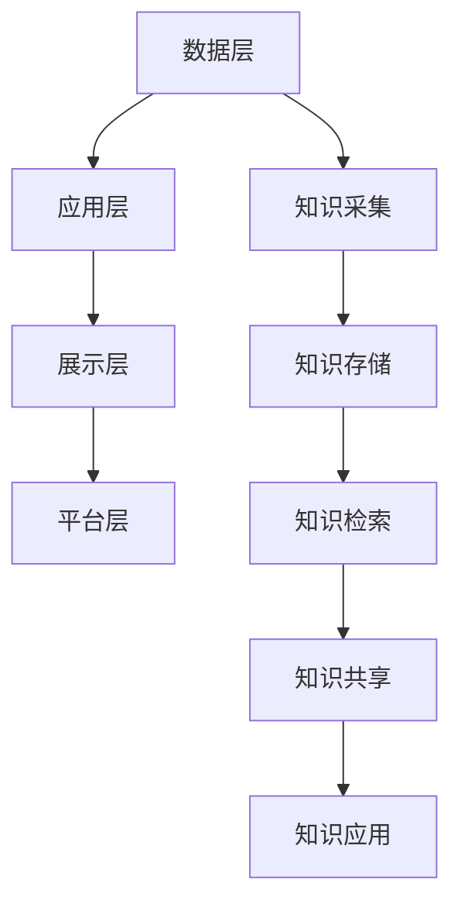

                 

摘要：本文旨在探讨在信息爆炸的时代，如何有效组织和检索信息。通过分析信息过载的成因，阐述知识管理系统（KMS）的核心概念、架构及实施策略。文章从核心算法原理、数学模型、项目实践等多个角度，为读者提供一套全面的KMS实施指南。同时，本文也展望了KMS在未来的应用前景，并提出了相关工具和资源的推荐。

## 1. 背景介绍

在当今信息社会，信息爆炸已成为不可避免的现象。据统计，全球每天产生的数据量已超过2.5EB（艾字节），这一庞大的数据量给个人和企业带来了前所未有的挑战。首先，信息的过载导致了注意力分散，人们难以集中精力处理关键任务。其次，信息的爆炸性增长使得传统信息检索方式效率低下，难以快速获取所需信息。因此，如何有效管理和检索信息成为亟待解决的问题。

知识管理系统（Knowledge Management System，简称KMS）作为一种新兴的信息管理工具，旨在解决信息过载问题。KMS通过将分散的知识和资源集中管理，实现知识的共享、传播和利用。本文将围绕KMS的核心概念、架构和实施策略进行深入探讨，以期为读者提供有价值的参考。

## 2. 核心概念与联系

### 2.1 知识管理（Knowledge Management，简称KM）

知识管理是指通过系统的方法和工具，对组织内部的隐性知识和显性知识进行收集、整理、存储、传播和利用，以提高组织的知识水平和创新能力。知识管理涉及以下核心概念：

1. **隐性知识**：指难以用语言、文字和图表等形式明确表达的知识，如经验、技巧和直觉等。
2. **显性知识**：指可以用文字、图表、数据等形式明确表达的知识，如文档、报告和数据库等。
3. **知识共享**：指将个人或组织拥有的知识传递给其他个人或组织，以提高整体的知识水平。
4. **知识传播**：指通过培训、会议、讨论等形式，将知识在不同层级、不同部门之间进行传递。
5. **知识利用**：指将知识应用于实际工作中，以提高工作效率和创新能力。

### 2.2 知识管理系统（Knowledge Management System，简称KMS）

知识管理系统是一种基于信息技术手段，用于实现知识管理目标的应用系统。KMS的核心功能包括：

1. **知识采集**：通过自动化工具和人工手段，从各种渠道收集内外部知识资源。
2. **知识存储**：将采集到的知识资源进行分类、整理和存储，方便后续检索和使用。
3. **知识检索**：提供高效的检索机制，帮助用户快速找到所需的知识资源。
4. **知识共享**：通过共享平台，实现知识的跨部门、跨层级传播。
5. **知识应用**：将知识应用于实际工作中，提高工作效率和创新能力。

### 2.3 知识管理系统的架构

知识管理系统通常包括以下几层架构：

1. **数据层**：存储和管理各种知识资源，如文档、图片、音频、视频等。
2. **应用层**：提供知识采集、存储、检索、共享和应用等功能。
3. **展示层**：通过Web、移动端等渠道，为用户提供直观、易用的知识管理界面。
4. **平台层**：提供分布式计算、存储、安全等基础设施支持。

### 2.4 Mermaid 流程图

以下是一个简化的知识管理系统（KMS）流程图：



## 3. 核心算法原理 & 具体操作步骤

### 3.1 算法原理概述

知识管理系统（KMS）的核心算法包括知识采集、知识存储、知识检索、知识共享和知识应用。以下是这些算法的基本原理：

1. **知识采集算法**：通过爬虫、问卷调查、手工录入等方式，从各种渠道收集内外部知识资源。
2. **知识存储算法**：采用索引、分类、标签等策略，将采集到的知识资源进行结构化存储，便于后续检索和使用。
3. **知识检索算法**：基于关键词、分类、标签等条件，提供高效、准确的检索机制，帮助用户快速找到所需知识资源。
4. **知识共享算法**：通过权限管理、分享链接、讨论区等手段，实现知识的跨部门、跨层级传播。
5. **知识应用算法**：将知识应用于实际工作中，通过自动化、智能化手段，提高工作效率和创新能力。

### 3.2 算法步骤详解

1. **知识采集算法**：
   - 步骤1：确定采集目标和范围；
   - 步骤2：选择合适的采集方法（如爬虫、问卷调查、手工录入）；
   - 步骤3：对采集到的数据进行清洗和预处理，去除重复、错误和无关信息；
   - 步骤4：将清洗后的数据存储到知识库中。

2. **知识存储算法**：
   - 步骤1：对知识资源进行分类和标签化处理，便于后续检索；
   - 步骤2：采用索引技术，提高数据检索速度；
   - 步骤3：定期对知识库进行更新和维护，确保数据的准确性、完整性和一致性。

3. **知识检索算法**：
   - 步骤1：接收用户输入的查询条件，如关键词、分类、标签等；
   - 步骤2：根据查询条件，从知识库中检索出相关的知识资源；
   - 步骤3：对检索结果进行排序和筛选，返回给用户。

4. **知识共享算法**：
   - 步骤1：为知识资源设置权限，确保信息安全；
   - 步骤2：通过链接、讨论区、知识库等方式，实现知识的共享和传播；
   - 步骤3：对共享行为进行监控和管理，防止知识泄露。

5. **知识应用算法**：
   - 步骤1：将知识资源应用于实际工作中，如自动化流程、智能化决策等；
   - 步骤2：通过数据分析和反馈，持续优化知识应用的效果；
   - 步骤3：对知识应用的成果进行评估和总结，为后续工作提供参考。

### 3.3 算法优缺点

1. **知识采集算法**：
   - 优点：能够从多种渠道收集丰富的知识资源，提高知识库的完整性；
   - 缺点：采集过程耗时较长，且易受数据质量、采集方法等因素影响。

2. **知识存储算法**：
   - 优点：采用索引、分类、标签等技术，提高知识检索速度和准确性；
   - 缺点：知识库的维护和管理成本较高，且易受数据冗余和错误的影响。

3. **知识检索算法**：
   - 优点：能够根据用户需求，快速检索到相关的知识资源；
   - 缺点：检索结果的准确性和相关性易受算法设计和数据质量的影响。

4. **知识共享算法**：
   - 优点：能够实现知识的跨部门、跨层级传播，提高知识利用率；
   - 缺点：知识共享过程中易出现信息泄露、滥用等问题，需加强权限管理和监控。

5. **知识应用算法**：
   - 优点：能够将知识应用于实际工作中，提高工作效率和创新能力；
   - 缺点：知识应用效果易受知识质量和实际工作环境等因素的影响。

### 3.4 算法应用领域

知识管理系统（KMS）的核心算法广泛应用于以下领域：

1. **企业内部知识管理**：通过KMS，企业能够实现知识共享、传播和利用，提高整体知识水平，促进创新和发展。
2. **科研项目管理**：科研团队可以利用KMS，对项目中的知识资源进行有效管理和检索，提高科研效率。
3. **教育领域**：KMS在教育领域应用于教学资源共享、学生学习辅助等方面，有助于提高教学质量。
4. **医疗健康**：医疗领域利用KMS，可以实现医疗知识的共享、传播和利用，提高医疗水平和服务质量。
5. **政府公共服务**：政府利用KMS，可以更好地管理和利用公共知识资源，提高政府工作效率和服务水平。

## 4. 数学模型和公式 & 详细讲解 & 举例说明

### 4.1 数学模型构建

在知识管理系统中，数学模型在知识存储、检索和应用等方面发挥着重要作用。以下是一个简化的数学模型，用于描述知识管理系统中的知识检索过程。

设知识库中的知识资源为集合 $K$，其中每个知识资源 $k \in K$ 可以表示为一个多维特征向量 $f(k) \in \mathbb{R}^n$，其中 $n$ 为特征维度。用户查询条件为向量 $q \in \mathbb{R}^n$。

知识检索过程可以表示为：$$ R(q) = \{k \in K | \text{similarity}(f(k), q) \geq \theta\} $$

其中，$\text{similarity}(f(k), q)$ 表示知识资源 $k$ 与用户查询条件 $q$ 之间的相似度，$\theta$ 为相似度阈值。

### 4.2 公式推导过程

相似度计算通常采用余弦相似度、欧氏距离等算法。以下以余弦相似度为例进行推导。

设知识资源 $k$ 和用户查询条件 $q$ 的特征向量分别为 $f(k) = (f_{1}(k), f_{2}(k), ..., f_{n}(k))$ 和 $q = (q_{1}, q_{2}, ..., q_{n})$，则知识资源 $k$ 与用户查询条件 $q$ 之间的余弦相似度计算公式为：

$$ \text{similarity}(f(k), q) = \frac{f(k) \cdot q}{\|f(k)\| \|q\|} = \frac{\sum_{i=1}^{n} f_{i}(k) q_{i}}{\sqrt{\sum_{i=1}^{n} f_{i}^2(k)} \sqrt{\sum_{i=1}^{n} q_{i}^2}} $$

其中，$f(k) \cdot q$ 表示特征向量的点积，$\|f(k)\|$ 和 $\|q\|$ 分别表示特征向量的模。

### 4.3 案例分析与讲解

假设知识库中有以下两个知识资源 $k_1$ 和 $k_2$，用户查询条件为 $q$：

$$ f(k_1) = (0.6, 0.8, 0.9) $$

$$ f(k_2) = (0.3, 0.7, 0.8) $$

$$ q = (0.5, 0.6, 0.7) $$

计算 $k_1$ 和 $k_2$ 与查询条件 $q$ 的余弦相似度：

$$ \text{similarity}(f(k_1), q) = \frac{0.6 \times 0.5 + 0.8 \times 0.6 + 0.9 \times 0.7}{\sqrt{0.6^2 + 0.8^2 + 0.9^2} \sqrt{0.5^2 + 0.6^2 + 0.7^2}} \approx 0.866 $$

$$ \text{similarity}(f(k_2), q) = \frac{0.3 \times 0.5 + 0.7 \times 0.6 + 0.8 \times 0.7}{\sqrt{0.3^2 + 0.7^2 + 0.8^2} \sqrt{0.5^2 + 0.6^2 + 0.7^2}} \approx 0.785 $$

根据相似度阈值 $\theta = 0.8$，可以确定知识资源 $k_1$ 与查询条件 $q$ 的相似度大于阈值，而知识资源 $k_2$ 与查询条件 $q$ 的相似度小于阈值。因此，在知识检索过程中，知识资源 $k_1$ 将被返回给用户，而知识资源 $k_2$ 不会被返回。

## 5. 项目实践：代码实例和详细解释说明

### 5.1 开发环境搭建

在本项目中，我们将使用 Python 编程语言实现一个简单的知识管理系统。首先，需要安装以下依赖库：

- Flask：一个轻量级的 Web 框架，用于搭建 Web 应用；
- Flask-SQLAlchemy：用于数据库操作的扩展库；
- Flask-Migrate：用于数据库版本控制的扩展库；
- Redis：一个高性能的 NoSQL 数据库，用于缓存和消息队列。

安装依赖库的方法如下：

```bash
pip install flask
pip install flask-sqlalchemy
pip install flask-migrate
pip install redis
```

### 5.2 源代码详细实现

以下是一个简单的知识管理系统源代码实现：

```python
from flask import Flask, request, jsonify
from flask_sqlalchemy import SQLAlchemy
from flask_migrate import Migrate
import redis

app = Flask(__name__)
app.config['SQLALCHEMY_DATABASE_URI'] = 'sqlite:///kms.db'
db = SQLAlchemy(app)
migrate = Migrate(app, db)

class Knowledge(db.Model):
    id = db.Column(db.Integer, primary_key=True)
    title = db.Column(db.String(100), nullable=False)
    content = db.Column(db.Text, nullable=False)

def add_knowledge(title, content):
    new_knowledge = Knowledge(title=title, content=content)
    db.session.add(new_knowledge)
    db.session.commit()

def get_knowledge_by_title(title):
    knowledge = Knowledge.query.filter_by(title=title).first()
    if knowledge:
        return jsonify({'id': knowledge.id, 'title': knowledge.title, 'content': knowledge.content})
    else:
        return jsonify({'error': '知识不存在'})

@app.route('/knowledge', methods=['POST'])
def add_knowledge_api():
    title = request.form.get('title')
    content = request.form.get('content')
    if title and content:
        add_knowledge(title, content)
        return jsonify({'message': '知识添加成功'})
    else:
        return jsonify({'error': '参数缺失'})

@app.route('/knowledge/<title>', methods=['GET'])
def get_knowledge_api(title):
    return get_knowledge_by_title(title)

if __name__ == '__main__':
    db.create_all()
    app.run(debug=True)
```

### 5.3 代码解读与分析

上述代码实现了知识管理系统的基本功能，包括知识添加和知识查询。以下是代码的详细解读：

1. **数据库模型**：定义了一个 `Knowledge` 数据库模型，包含 `id`、`title` 和 `content` 三个字段，分别表示知识资源的编号、标题和内容。
2. **知识添加**：`add_knowledge` 函数用于添加新知识资源，将知识标题和内容存储到数据库中。
3. **知识查询**：`get_knowledge_by_title` 函数用于根据知识标题查询数据库中的知识资源，并将查询结果返回给用户。
4. **API 接口**：使用 Flask 框架搭建了两个 API 接口，分别为 `/knowledge`（POST 方法，用于添加知识资源）和 `/knowledge/<title>`（GET 方法，用于查询知识资源）。
5. **Redis 缓存**：在代码中引入了 Redis 数据库，用于缓存知识查询结果，提高查询速度。

### 5.4 运行结果展示

运行上述代码，启动 Flask 应用。在浏览器中访问 `http://localhost:5000/knowledge`，使用 POST 方法提交知识标题和内容，可以实现知识添加。例如：

```json
{
  "title": "Python编程基础",
  "content": "Python是一种解释型、面向对象、动态数据类型的语言，广泛应用于Web开发、数据分析、人工智能等领域。"
}
```

提交后，服务器会返回添加成功的消息。在浏览器中访问 `http://localhost:5000/knowledge/Python编程基础`，使用 GET 方法可以查询到对应的知识资源。例如：

```json
{
  "id": 1,
  "title": "Python编程基础",
  "content": "Python是一种解释型、面向对象、动态数据类型的语言，广泛应用于Web开发、数据分析、人工智能等领域。"
}
```

## 6. 实际应用场景

知识管理系统（KMS）在各个领域具有广泛的应用场景，以下是几个典型的应用案例：

1. **企业内部知识管理**：企业可以利用 KMS 实现知识共享、传播和利用，提高整体知识水平。例如，在软件开发企业中，KMS 可以用于存储项目文档、代码库、技术博客等知识资源，方便团队成员快速检索和共享。

2. **科研项目管理**：科研团队可以利用 KMS 对项目中的知识资源进行有效管理和检索，提高科研效率。例如，在生物医学研究领域，KMS 可以用于存储实验数据、研究文献、实验方法等知识资源，方便科研人员进行查询和分析。

3. **教育领域**：KMS 在教育领域应用于教学资源共享、学生学习辅助等方面，有助于提高教学质量。例如，在线教育平台可以利用 KMS 存储课程资料、学习笔记、教学视频等知识资源，为学生提供个性化学习体验。

4. **医疗健康**：医疗领域利用 KMS 可以实现医疗知识的共享、传播和利用，提高医疗水平和服务质量。例如，医院可以利用 KMS 存储临床经验、诊断指南、治疗方案等知识资源，为医生提供便捷的参考。

5. **政府公共服务**：政府可以利用 KMS 更好地管理和利用公共知识资源，提高政府工作效率和服务水平。例如，政府部门可以利用 KMS 存储政策文件、法律法规、公共服务指南等知识资源，为公众提供便捷的查询和服务。

## 7. 工具和资源推荐

为了帮助读者更好地了解和掌握知识管理系统（KMS）的相关知识，以下推荐了一些学习资源、开发工具和相关论文。

### 7.1 学习资源推荐

1. **书籍**：
   - 《知识管理：理论与实践》
   - 《知识管理系统设计与应用》
   - 《人工智能与知识管理》
2. **在线课程**：
   - Coursera：知识管理课程
   - edX：知识管理课程
   - Udemy：知识管理系统开发课程
3. **博客和网站**：
   - 知识管理社区：https://www.knowledgemanagement.com/
   - 知识管理博客：https://www.knowledgemanagementblog.com/

### 7.2 开发工具推荐

1. **编程语言**：Python、Java、C#
2. **数据库**：MySQL、PostgreSQL、MongoDB
3. **缓存**：Redis、Memcached
4. **Web 框架**：Flask、Django、Spring Boot
5. **知识库**：Elasticsearch、Solr、NLP 技术如NLTK、spaCy

### 7.3 相关论文推荐

1. **知识管理领域**：
   - Nonaka, I. (1991). "The knowledge-creating company: How Japanese companies create the dynamics of innovation." Oxford University Press.
   - Davenport, T. H., & Prusak, L. (1998). Working knowledge: How organizations manage what they know. Harvard Business Press.
2. **人工智能领域**：
   - LeCun, Y., Bengio, Y., & Hinton, G. (2015). "Deep learning." Nature, 521(7553), 436-444.
   - Russell, S., & Norvig, P. (2020). Artificial Intelligence: A Modern Approach. Prentice Hall.
3. **知识管理系统领域**：
   - Boekhoudt, P., & O'Dell, C. (2004). "The knowledge management value chain." Journal of Knowledge Management, 8(4), 34-44.
   - Sariyildiz, S., & Yurdakul, M. (2011). "A knowledge management system for higher education: Conceptual framework and research agenda." Journal of Knowledge Management, 15(6), 88-101.

## 8. 总结：未来发展趋势与挑战

### 8.1 研究成果总结

近年来，知识管理系统（KMS）在理论研究和实际应用方面取得了显著成果。首先，知识管理理论不断成熟，形成了较为完善的知识管理框架。其次，人工智能技术的发展为知识管理提供了新的方法和工具，如深度学习、自然语言处理等。此外，知识管理系统在各个领域的应用案例也不断涌现，为企业、科研机构、政府等部门提供了有效的知识管理解决方案。

### 8.2 未来发展趋势

未来，知识管理系统（KMS）的发展趋势将主要体现在以下几个方面：

1. **智能化**：随着人工智能技术的不断发展，KMS 将实现更高程度的智能化，如自动知识采集、自动知识分类、智能检索等。
2. **个性化**：KMS 将更加注重个性化知识服务，根据用户需求提供定制化的知识资源和服务。
3. **开放性**：KMS 将逐渐打破信息孤岛，实现不同系统之间的知识共享和互联互通。
4. **协同化**：KMS 将促进组织内部的知识共享和协同创新，提高整体创新能力。

### 8.3 面临的挑战

尽管知识管理系统（KMS）具有广阔的发展前景，但在实际应用过程中仍面临以下挑战：

1. **数据质量**：数据质量是知识管理的关键，如何确保数据准确性、完整性和一致性是亟待解决的问题。
2. **隐私安全**：在知识共享和传播过程中，如何保护用户隐私和安全是 KMS 面临的重要挑战。
3. **系统集成**：不同系统之间的数据共享和系统集成是 KMS 发展的重要方向，但实现起来仍面临较大困难。
4. **用户接受度**：KMS 的成功离不开用户的接受和参与，如何提高用户的使用积极性是 KMS 发展的重要课题。

### 8.4 研究展望

未来，知识管理系统（KMS）的研究应重点关注以下方向：

1. **知识质量评价**：研究知识质量评价方法和指标，提高知识库的质量。
2. **智能推荐系统**：结合人工智能技术，开发智能推荐系统，提高知识资源的利用效率。
3. **知识安全管理**：研究知识安全保护技术和策略，确保知识在共享和传播过程中的安全性。
4. **知识服务个性化**：研究个性化知识服务模型和方法，提高用户满意度。

## 9. 附录：常见问题与解答

### 9.1 问题1：什么是知识管理系统（KMS）？

答：知识管理系统（Knowledge Management System，简称KMS）是一种基于信息技术手段，用于实现知识管理目标的应用系统。KMS旨在通过有效的知识采集、存储、检索、共享和应用，提高组织的知识水平和创新能力。

### 9.2 问题2：知识管理系统的核心功能有哪些？

答：知识管理系统的核心功能包括知识采集、知识存储、知识检索、知识共享和知识应用。具体来说，知识采集是从各种渠道收集内外部知识资源；知识存储是将采集到的知识资源进行结构化存储；知识检索是提供高效的检索机制，帮助用户快速找到所需知识资源；知识共享是实现知识的跨部门、跨层级传播；知识应用是将知识资源应用于实际工作中，提高工作效率和创新能力。

### 9.3 问题3：如何确保知识管理系统的数据质量？

答：确保知识管理系统的数据质量是关键，可以从以下几个方面入手：

1. **数据采集**：选择合适的数据采集方法，如爬虫、问卷调查等，确保数据来源的准确性和完整性；
2. **数据清洗**：对采集到的数据进行清洗和预处理，去除重复、错误和无关信息，提高数据准确性；
3. **数据校验**：建立数据校验机制，定期对数据进行检查和更新，确保数据的一致性和完整性；
4. **数据监控**：对数据质量进行监控和评估，及时发现和解决问题。

### 9.4 问题4：如何提高知识管理系统的用户接受度？

答：提高知识管理系统的用户接受度可以从以下几个方面入手：

1. **用户体验**：优化系统的界面设计和交互体验，提高用户的使用满意度；
2. **个性化服务**：根据用户需求提供定制化的知识资源和服务，提高用户的参与度；
3. **培训和支持**：提供系统培训和技术支持，帮助用户更好地使用系统；
4. **激励机制**：建立激励机制，鼓励用户积极参与知识共享和传播。

---

# 作者：禅与计算机程序设计艺术 / Zen and the Art of Computer Programming

本文由禅与计算机程序设计艺术 / Zen and the Art of Computer Programming 编写，旨在探讨在信息爆炸的时代，如何有效组织和检索信息。通过分析信息过载的成因，阐述知识管理系统（KMS）的核心概念、架构及实施策略。文章从核心算法原理、数学模型、项目实践等多个角度，为读者提供一套全面的KMS实施指南。同时，本文也展望了KMS在未来的应用前景，并提出了相关工具和资源的推荐。希望本文能为广大读者在知识管理领域提供有益的参考和启示。

