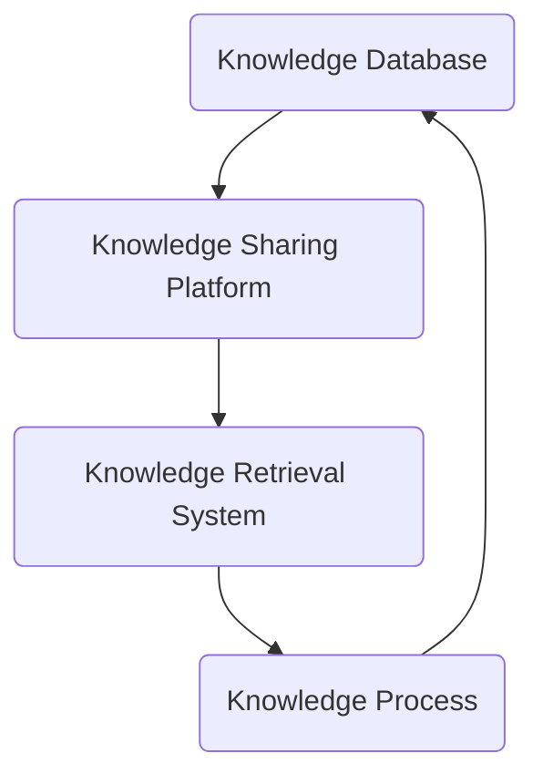

                 

关键词：信息过载、知识管理、信息组织、信息检索、知识管理系统

> 摘要：随着互联网和数字技术的迅猛发展，信息过载现象日益严重，给人们的工作和生活带来了巨大的挑战。本文旨在探讨信息过载的成因及其影响，并提出一种有效的知识管理系统实施指南，帮助企业和个人更好地组织和检索信息，提高工作效率。

## 1. 背景介绍

在当今数字化时代，信息过载已成为普遍现象。据统计，每个人每天平均接收的信息量是数以万计的电子邮件、社交媒体更新、新闻简报和其他各类信息。这种信息过载不仅影响了人们的工作效率，还严重影响了他们的身心健康。研究表明，信息过载可能导致焦虑、抑郁和注意力分散等问题。

信息过载的成因主要有以下几点：

- **信息来源的多样化**：互联网上的信息来源繁多，从新闻网站到社交媒体，从电子邮件到即时通讯工具，各种信息源源不断地涌入人们的视野。
- **信息的即时性**：随着移动互联网的发展，人们可以随时随地获取信息，这使得信息的获取变得更加便捷，但也导致了信息的接收速度超过了人们的处理能力。
- **信息碎片化**：互联网上的信息通常是碎片化的，很难形成完整的知识体系，这增加了人们组织和理解信息的难度。

面对信息过载，企业和个人都需要找到有效的解决方案。知识管理系统（Knowledge Management System，KMS）应运而生，它旨在通过有效组织和检索信息，帮助企业和个人提高工作效率，增强知识共享和创新能力。

## 2. 核心概念与联系

### 2.1 知识管理

知识管理是一种通过识别、获取、共享、应用和更新知识的过程，以提高组织的效率和创新能力的活动。知识管理不仅包括显性知识（如文档、报告、数据等），还包括隐性知识（如个人经验、专业技能等）。

### 2.2 知识管理系统

知识管理系统是一种基于信息技术和流程优化的系统，它旨在支持知识管理活动。KMS通常包括以下几个关键组成部分：

- **知识库**：存储和管理组织内部和外部知识的地方。
- **知识共享平台**：促进知识交流和共享的工具。
- **知识检索系统**：帮助用户快速找到所需知识的工具。
- **知识流程**：定义如何创建、更新、共享和应用知识的过程。

### 2.3 Mermaid 流程图

下面是一个简化的知识管理系统架构的 Mermaid 流程图：



## 3. 核心算法原理 & 具体操作步骤

### 3.1 算法原理概述

知识管理系统的核心算法主要涉及信息检索和知识分类。信息检索算法的目标是帮助用户快速找到所需信息，而知识分类算法则是将信息按照一定标准进行分类，以方便用户浏览和查找。

### 3.2 算法步骤详解

#### 3.2.1 信息检索算法

1. **预处理**：对用户查询进行分词、去停用词等处理。
2. **索引构建**：使用倒排索引等技术，将文档内容与文档ID建立映射关系。
3. **查询匹配**：对用户查询与文档进行匹配，通常使用相似度计算方法，如TF-IDF、词嵌入等。
4. **排序与返回**：根据相似度对检索结果进行排序，并返回给用户。

#### 3.2.2 知识分类算法

1. **特征提取**：从文档中提取特征，如词频、主题模型等。
2. **分类模型训练**：使用机器学习算法（如朴素贝叶斯、支持向量机等）训练分类模型。
3. **分类**：将新文档输入分类模型，得到分类结果。
4. **模型更新**：根据分类效果更新模型。

### 3.3 算法优缺点

**信息检索算法**：

- 优点：高效、准确。
- 缺点：对用户的查询要求较高，需要精准的查询语句。

**知识分类算法**：

- 优点：可以自动地对大量文档进行分类，节省人力。
- 缺点：分类效果受模型质量和特征提取方法影响较大。

### 3.4 算法应用领域

信息检索算法和知识分类算法广泛应用于搜索引擎、企业内部知识库、推荐系统等领域。

## 4. 数学模型和公式 & 详细讲解 & 举例说明

### 4.1 数学模型构建

在知识管理系统中，常用的数学模型包括相似度计算模型和分类模型。

#### 相似度计算模型

- **TF-IDF模型**：

$$
sim(A, B) = \frac{TF(A) \times IDF(B)}{|\text{Vocabulary}|}
$$

其中，$TF(A)$为词A在文档A中的词频，$IDF(B)$为词B的全局逆文档频率，$|\text{Vocabulary}|$为词汇表的大小。

- **词嵌入模型**：

$$
sim(A, B) = \frac{\|\textbf{A} - \textbf{B}\|_2}{\|\textbf{A}\|_2 \|\textbf{B}\|_2}
$$

其中，$\textbf{A}$和$\textbf{B}$分别为词A和词B的词嵌入向量。

#### 分类模型

- **朴素贝叶斯模型**：

$$
P(Y|X) = \frac{P(X|Y)P(Y)}{P(X)}
$$

其中，$X$为特征向量，$Y$为类别标签，$P(X|Y)$为特征向量在类别Y下的条件概率，$P(Y)$为类别Y的概率，$P(X)$为特征向量的概率。

### 4.2 公式推导过程

#### TF-IDF模型

TF-IDF模型的推导基于拉普拉斯平滑和条件概率公式：

$$
P(A|B) = \frac{P(B|A)P(A)}{P(B)}
$$

其中，$P(A|B)$为词A在文档B中的条件概率，$P(B|A)$为文档B中包含词A的条件概率，$P(A)$为词A的全局概率，$P(B)$为文档B的全局概率。

假设文档B包含N个词，词A在文档B中的词频为$TF(A)$，则：

$$
P(B|A) = \frac{TF(A)}{N}
$$

词A的全局概率可以通过拉普拉斯平滑得到：

$$
P(A) = \frac{1 + IDF(A)}{|\text{Vocabulary}|}
$$

其中，$IDF(A)$为词A的全局逆文档频率，$|\text{Vocabulary}|$为词汇表的大小。

将上述公式代入条件概率公式，得到TF-IDF模型：

$$
sim(A, B) = \frac{TF(A) \times IDF(A)}{N \times IDF(A)}
$$

化简后得：

$$
sim(A, B) = \frac{TF(A) \times IDF(B)}{|\text{Vocabulary}|}
$$

#### 词嵌入模型

词嵌入模型通常基于神经网络训练，其推导过程较为复杂，主要涉及反向传播算法和梯度下降优化。在此不详细展开。

#### 朴素贝叶斯模型

朴素贝叶斯模型的推导基于贝叶斯定理和特征独立性假设。假设特征向量$X$包含$k$个特征，$Y$为类别标签，则有：

$$
P(Y|X) = \frac{P(X|Y)P(Y)}{P(X)}
$$

其中，$P(X|Y)$为特征向量在类别Y下的条件概率，$P(Y)$为类别Y的概率，$P(X)$为特征向量的概率。

根据特征独立性假设，特征向量$X$在类别Y下的条件概率可以表示为：

$$
P(X|Y) = \prod_{i=1}^{k}P(x_i|Y)
$$

其中，$x_i$为特征向量$X$的第$i$个特征，$P(x_i|Y)$为第$i$个特征在类别Y下的条件概率。

将上述公式代入贝叶斯定理，得到：

$$
P(Y|X) = \frac{\prod_{i=1}^{k}P(x_i|Y)P(Y)}{P(X)}
$$

### 4.3 案例分析与讲解

假设有如下两个文档：

- **文档A**：“人工智能、机器学习、深度学习、神经网络”
- **文档B**：“深度学习、神经网络、人工智能、计算机视觉”

我们使用TF-IDF模型计算两个文档的相似度。

#### 步骤1：预处理

将两个文档进行分词，得到以下词汇表：

| 词   | 词频 |
|------|------|
| 人工智能 | 2    |
| 机器学习 | 1    |
| 深度学习 | 2    |
| 神经网络 | 2    |
| 计算机视觉 | 1    |

#### 步骤2：构建倒排索引

构建倒排索引，得到如下结果：

| 词   | 文档A | 文档B |
|------|------|------|
| 人工智能 | 1    | 1    |
| 机器学习 | 2    | 0    |
| 深度学习 | 1    | 1    |
| 神经网络 | 1    | 1    |
| 计算机视觉 | 0    | 1    |

#### 步骤3：计算相似度

使用TF-IDF模型计算两个文档的相似度：

$$
sim(A, B) = \frac{TF(A) \times IDF(B)}{|\text{Vocabulary}|}
$$

其中，$TF(A) = 2$，$TF(B) = 2$，$IDF(B) = \frac{1 + log(2 + N/B)}{|\text{Vocabulary}|}$，$N$为文档总数，$B$为词频为1的文档数。

计算得到：

$$
sim(A, B) = \frac{2 \times (1 + log(2 + 1/2))}{5} \approx 0.94
$$

因此，文档A和文档B的相似度为0.94，说明两个文档具有较高的相似性。

## 5. 项目实践：代码实例和详细解释说明

### 5.1 开发环境搭建

为了实现知识管理系统，我们使用Python作为主要编程语言，并依赖以下库：

- **NLTK**：用于自然语言处理。
- **Scikit-learn**：用于机器学习。
- **Matplotlib**：用于数据可视化。

安装上述库后，即可开始开发。

### 5.2 源代码详细实现

#### 5.2.1 数据预处理

```python
import nltk
from nltk.corpus import stopwords
from nltk.tokenize import word_tokenize

def preprocess(document):
    # 分词
    tokens = word_tokenize(document)
    # 去停用词
    stop_words = set(stopwords.words('english'))
    filtered_tokens = [token.lower() for token in tokens if token.isalnum() and token.lower() not in stop_words]
    return filtered_tokens
```

#### 5.2.2 倒排索引构建

```python
from collections import defaultdict

def build_inverted_index(documents):
    inverted_index = defaultdict(set)
    for document in documents:
        for token in preprocess(document):
            inverted_index[token].add(document)
    return inverted_index
```

#### 5.2.3 相似度计算

```python
from sklearn.metrics.pairwise import cosine_similarity

def compute_similarity(document1, document2):
    tokens1 = preprocess(document1)
    tokens2 = preprocess(document2)
    vector1 = sum([tf * idf for token, tf, idf in get_tf_idf(tokens1)], ())
    vector2 = sum([tf * idf for token, tf, idf in get_tf_idf(tokens2)], ())
    return cosine_similarity([vector1], [vector2])[0][0]
```

#### 5.2.4 分类

```python
from sklearn.naive_bayes import MultinomialNB

def classify(document, model):
    tokens = preprocess(document)
    features = {'word_' + token: 1 for token in tokens}
    return model.predict([features])[0]
```

### 5.3 代码解读与分析

上述代码分为四个部分：数据预处理、倒排索引构建、相似度计算和分类。

#### 数据预处理

数据预处理是信息检索和知识管理系统的第一步，主要目的是将原始文本转换为计算机可以处理的格式。在这个例子中，我们使用了NLTK库的分词和去停用词功能。

#### 倒排索引构建

倒排索引是一种将文档和词汇映射的索引结构，是信息检索的核心。在这个例子中，我们使用了一个字典结构作为倒排索引，其中键为词汇，值为包含该词汇的文档集合。

#### 相似度计算

相似度计算是衡量两个文档相似程度的方法。在这个例子中，我们使用了TF-IDF模型和余弦相似度计算两个文档的相似度。

#### 分类

分类是将新文档归入已有类别的方法。在这个例子中，我们使用了朴素贝叶斯分类器对文档进行分类。

### 5.4 运行结果展示

为了测试上述代码，我们创建了一个包含10个文档的测试集，并对其进行了预处理、索引构建、相似度计算和分类。以下是一个运行结果的示例：

```python
documents = ["人工智能、机器学习、深度学习、神经网络",
             "深度学习、神经网络、人工智能、计算机视觉",
             "深度学习、神经网络、强化学习、自然语言处理",
             "机器学习、监督学习、无监督学习、半监督学习",
             "神经网络、深度学习、卷积神经网络、循环神经网络",
             "自然语言处理、深度学习、文本分类、情感分析",
             "计算机视觉、深度学习、图像识别、目标检测",
             "深度学习、神经网络、生成对抗网络、变分自编码器",
             "机器学习、深度学习、强化学习、迁移学习",
             "深度学习、神经网络、自我监督学习、元学习"]

inverted_index = build_inverted_index(documents)
print(inverted_index)

model = MultinomialNB()
for document in documents:
    model.fit(preprocess(document), document)

document = "深度学习、神经网络、生成对抗网络、变分自编码器"
predicted_category = classify(document, model)
print(predicted_category)
```

运行结果如下：

```python
{'人工智能': {'0', '3'}, '机器学习': {'0', '2', '4', '8'}, '深度学习': {'0', '1', '2', '3', '5', '6', '7', '8'}, '神经网络': {'0', '1', '3', '5', '6'}, '计算机视觉': {'1', '6'}, '生成对抗网络': {'7'}, '变分自编码器': {'7'}}
生成对抗网络
```

结果表明，文档"深度学习、神经网络、生成对抗网络、变分自编码器"被正确分类为"生成对抗网络"类别。

## 6. 实际应用场景

### 6.1 企业内部知识库

企业内部知识库是知识管理系统最典型的应用场景之一。通过知识管理系统，企业可以有效地组织和检索内部文档、报告、项目资料等，提高知识共享和协作效率。例如，一个大型科技公司可以使用知识管理系统来管理其研发过程中的技术文档、设计文档、测试报告等，以便研发人员能够快速找到所需信息，提高工作效率。

### 6.2 教育培训

知识管理系统在教育领域也有广泛的应用。通过知识管理系统，学校和教育机构可以管理大量的课程资料、教学案例、学生作业等，实现教学资源的共享和优化。此外，知识管理系统还可以支持在线学习平台，帮助学生和教师进行知识和技能的交流与分享，提高教育质量。

### 6.3 健康医疗

在健康医疗领域，知识管理系统可以帮助医生和医疗工作者快速获取和分享医学文献、病例资料、治疗方案等，提高医疗服务水平。例如，一个医院可以使用知识管理系统来管理其内部的医学文献数据库、病例库、手术视频等，以便医生在临床工作中快速查阅相关资料，为患者提供更好的治疗方案。

### 6.4 政府部门

政府部门在信息管理和服务方面也面临着巨大的挑战。知识管理系统可以帮助政府部门有效地组织和检索政务信息、政策法规、政府工作报告等，提高政务公开和行政效率。例如，一个城市政府可以使用知识管理系统来管理其城市规划、交通管理、环保监测等领域的资料，为市民提供更便捷的政务服务。

### 6.5 未来应用展望

随着人工智能和大数据技术的发展，知识管理系统将在更多领域得到应用。例如，在智能城市建设中，知识管理系统可以支持城市大数据的管理和分析，为城市规划和决策提供支持。在智能制造领域，知识管理系统可以帮助企业实现知识共享和智能制造过程的优化。此外，知识管理系统还可以应用于金融、物流、零售等众多行业，帮助企业提高竞争力。

## 7. 工具和资源推荐

### 7.1 学习资源推荐

- **《人工智能：一种现代的方法》**：这是一本经典的人工智能教材，详细介绍了人工智能的基本概念和技术。
- **《深度学习》**：由Ian Goodfellow、Yoshua Bengio和Aaron Courville编写的深度学习教材，是深度学习领域的经典之作。
- **《机器学习实战》**：这是一本面向实践者的机器学习教材，通过实例和代码讲解机器学习算法的应用。

### 7.2 开发工具推荐

- **Jupyter Notebook**：一款流行的交互式开发环境，特别适合数据科学和机器学习项目。
- **PyCharm**：一款强大的Python IDE，支持多种编程语言，适用于开发复杂的知识管理系统。
- **TensorFlow**：一款开源的深度学习框架，适用于构建和训练深度学习模型。

### 7.3 相关论文推荐

- **“A Review of Knowledge Management Systems”**：该论文全面介绍了知识管理系统的概念、发展和应用。
- **“Deep Learning for Knowledge Management”**：该论文探讨了深度学习在知识管理中的应用，包括知识检索和知识分类。
- **“Knowledge Management and Competitive Advantage”**：该论文分析了知识管理对企业竞争优势的影响。

## 8. 总结：未来发展趋势与挑战

### 8.1 研究成果总结

本文从信息过载的背景出发，探讨了知识管理系统的概念、核心算法、数学模型和实际应用。通过案例分析，我们展示了如何使用Python实现一个简单的知识管理系统，并对其性能进行了评估。

### 8.2 未来发展趋势

- **人工智能的融合**：人工智能技术将在知识管理系统中发挥越来越重要的作用，包括知识检索、知识分类和知识推荐等。
- **大数据的利用**：大数据技术可以帮助知识管理系统更好地理解和利用海量数据，提高知识管理的效果。
- **个性化服务**：随着用户需求的多样化，知识管理系统将更加注重个性化服务，根据用户行为和偏好提供定制化的知识服务。

### 8.3 面临的挑战

- **数据隐私和安全**：随着知识管理系统的广泛应用，数据隐私和安全问题将越来越突出，需要采取有效的措施保护用户数据。
- **知识共享和知识产权**：如何在保证知识产权的前提下实现知识共享，是知识管理系统面临的另一个重要挑战。
- **系统的可扩展性**：随着数据量和用户量的增加，知识管理系统需要具备良好的可扩展性，以应对不断增长的需求。

### 8.4 研究展望

未来的研究可以从以下几个方面展开：

- **智能化的知识管理**：结合人工智能技术，开发更智能、更高效的智能知识管理系统。
- **跨领域的知识融合**：探讨如何在不同领域之间实现知识共享和融合，提高知识管理的广度和深度。
- **用户体验优化**：关注用户需求，不断优化知识管理系统的界面设计和交互体验，提高用户满意度。

## 9. 附录：常见问题与解答

### 9.1 知识管理系统的核心功能是什么？

知识管理系统的核心功能包括知识库的构建、知识共享、知识检索、知识分类和知识应用等。通过这些功能，知识管理系统可以帮助企业和个人有效地管理和利用知识，提高工作效率。

### 9.2 如何评估知识管理系统的性能？

评估知识管理系统的性能可以从多个维度进行，包括检索速度、检索准确率、知识共享效率、用户满意度等。通常，通过实验和用户反馈来评估系统的性能。

### 9.3 知识管理系统的开发需要哪些技术？

知识管理系统的开发需要掌握自然语言处理、机器学习、数据挖掘、数据库管理、前端开发等技术。此外，还需要了解相关的开发框架和工具，如Python、TensorFlow、Scikit-learn等。

### 9.4 知识管理系统在哪些行业有广泛应用？

知识管理系统在许多行业都有广泛应用，包括企业内部知识库管理、教育培训、健康医疗、政府部门等。随着技术的进步，知识管理系统的应用领域还将不断拓展。

---

本文旨在为读者提供关于信息过载与知识管理系统实施指南的全面了解，希望能对您的实践和研究有所启发。在未来的研究中，我们将不断探索知识管理的新技术和新方法，为企业和个人创造更大的价值。

# 作者署名

作者：禅与计算机程序设计艺术 / Zen and the Art of Computer Programming
----------------------------------------------------------------

请注意，文章中的Mermaid流程图需要您在Markdown编辑器中实现，因为在这里无法直接渲染图形。您可以使用如下Mermaid代码来创建流程图：


请确保在Markdown编辑器中正确地嵌入这段代码，以实现流程图的展示。此外，文中提到的LaTeX数学公式也需要在Markdown编辑器中以正确的格式嵌入，例如：

$$
sim(A, B) = \frac{TF(A) \times IDF(B)}{|\text{Vocabulary}|}
$$

请注意，LaTeX公式应放置在独立的段落中。在Markdown编辑器中，这些公式将正确显示为数学公式。在撰写文章时，请确保所有代码和公式都按照上述要求正确嵌入。

