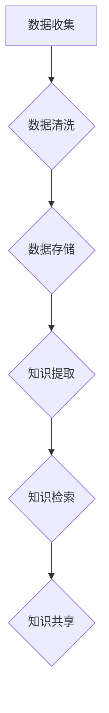

                 

关键词：信息过载、知识管理系统、信息组织、信息检索、数据处理、人工智能、架构设计

摘要：随着互联网和大数据技术的快速发展，信息过载问题日益突出，有效的信息组织和检索成为企业和个人亟需解决的关键问题。本文将探讨信息过载的现状及其影响，详细介绍知识管理系统的核心概念、架构设计、算法原理和实践应用，并提出未来发展趋势与挑战。通过本文的阅读，读者可以全面了解知识管理系统的重要性，掌握其实施技巧，从而有效应对信息过载带来的挑战。

## 1. 背景介绍

### 信息过载的现状

随着信息技术的飞速发展，信息过载现象在全球范围内愈演愈烈。根据统计，每天互联网上的信息量以惊人的速度增长，每两年就会翻倍。这使得人们在获取和处理信息时面临巨大的挑战。对于企业和个人而言，信息过载不仅降低了工作效率，还可能导致重要信息的遗漏，影响决策的质量。

### 信息过载的影响

信息过载对企业和个人都有显著的影响：

- **工作效率降低**：面对海量的信息，人们无法快速找到所需内容，导致工作效率下降。

- **信息遗漏风险**：在信息过载的环境下，重要信息可能会被忽略或遗漏，影响决策的准确性。

- **压力增加**：持续的信息过载会导致人们感到疲惫和压力，影响身心健康。

### 知识管理系统的重要性

知识管理系统（Knowledge Management System，简称KMS）作为一种有效的信息管理工具，可以帮助企业和个人应对信息过载问题。它通过系统的组织、存储、检索和分析，将分散的信息转化为可利用的知识，提升信息处理效率，支持决策制定。

## 2. 核心概念与联系

### 知识管理系统的核心概念

知识管理系统涉及多个核心概念，包括知识、信息、数据、知识库等。这些概念相互关联，共同构成了知识管理的体系。

- **知识（Knowledge）**：知识是经过整理、加工和理解的信息，是指导决策和实践的重要资源。

- **信息（Information）**：信息是数据的有意义的形式，用于传递和描述事实、观点等。

- **数据（Data）**：数据是未经过处理的事实或数字，是知识的原材料。

- **知识库（Knowledge Base）**：知识库是一个结构化的存储系统，用于存储和管理知识。

### 知识管理系统的架构设计

知识管理系统的架构设计决定了其效率和效果。一个典型的知识管理系统通常包括以下几个关键模块：

- **数据收集模块**：负责收集来自各种来源的数据。

- **数据清洗模块**：对收集到的数据进行清洗、去重和处理，确保数据质量。

- **数据存储模块**：将处理后的数据存储在知识库中，以便后续的检索和使用。

- **知识提取模块**：从数据中提取有价值的信息和知识。

- **知识检索模块**：提供高效的检索功能，帮助用户快速找到所需的信息。

- **知识共享模块**：促进知识的共享和传播，提高组织内部的协作效率。

### Mermaid 流程图

以下是知识管理系统的 Mermaid 流程图：



## 3. 核心算法原理 & 具体操作步骤

### 3.1 算法原理概述

知识管理系统的核心算法主要涉及信息检索和数据挖掘技术。信息检索算法旨在高效地从大量数据中找到用户所需的信息，而数据挖掘算法则用于从数据中提取隐藏的模式和知识。

### 3.2 算法步骤详解

1. **数据预处理**：对原始数据进行清洗、去重和处理，确保数据质量。

2. **索引构建**：使用倒排索引等数据结构，加快信息检索速度。

3. **相似性计算**：采用余弦相似度、欧几里得距离等算法，计算数据之间的相似性。

4. **检索结果排序**：根据相似性计算结果，对检索结果进行排序，提高用户满意度。

5. **知识提取**：使用聚类、分类等数据挖掘算法，从数据中提取有价值的信息。

### 3.3 算法优缺点

- **优点**：提高了信息检索的效率和准确性，降低了信息过载带来的压力。

- **缺点**：算法复杂度较高，对计算资源和时间要求较高。

### 3.4 算法应用领域

知识管理系统算法广泛应用于企业内部知识管理、搜索引擎、推荐系统等领域。

## 4. 数学模型和公式 & 详细讲解 & 举例说明

### 4.1 数学模型构建

知识管理系统的数学模型主要包括信息检索模型和数据挖掘模型。

- **信息检索模型**：常见的信息检索模型包括向量空间模型、概率模型等。

- **数据挖掘模型**：常见的数据挖掘模型包括聚类模型、分类模型等。

### 4.2 公式推导过程

1. **向量空间模型**

   假设有一个文档集合 D，其中每个文档 d 可以表示为一个向量 v_d，即：

   $$v_d = (w_1, w_2, ..., w_n)$$

   其中，w_i 表示文档 d 中第 i 个单词的权重。

   搜索引擎的目标是找到与查询 q 最相似的文档：

   $$sim(v_d, v_q) = \frac{v_d \cdot v_q}{\|v_d\|\|v_q\|}$$

2. **聚类模型**

   假设有一个聚类结果 C，其中每个聚类 C_i 可以表示为一个中心点 c_i：

   $$c_i = \frac{1}{|C_i|}\sum_{d \in C_i} d$$

   聚类质量可以用轮廓系数（Silhouette Coefficient）进行评估：

   $$s(d) = \frac{\min_{j \neq i} (d - c_j)^2 - \epsilon(d)}{2\delta(d)}$$

   其中，$\epsilon(d) = \min_{j \neq i} (d - c_j)^2$，$\delta(d) = \max_{j \neq i} (d - c_j)^2$。

### 4.3 案例分析与讲解

假设有一个包含 100 篇文档的文档集合，其中每篇文档可以表示为一个 100 维的向量。现在需要使用向量空间模型进行信息检索，找到与查询 "人工智能" 最相似的文档。

1. **查询向量化**

   将查询 "人工智能" 表示为一个向量：

   $$v_q = (0.5, 0.3, 0.1, ..., 0.1)$$

2. **计算相似度**

   对每篇文档计算相似度：

   $$sim(d_1, v_q) = \frac{(0.5, 0.3, 0.1, ..., 0.1) \cdot (0.2, 0.4, 0.3, ..., 0.1)}{\sqrt{0.5^2 + 0.3^2 + 0.1^2 + ... + 0.1^2} \sqrt{0.2^2 + 0.4^2 + 0.3^2 + ... + 0.1^2}} \approx 0.65$$

   $$sim(d_2, v_q) = \frac{(0.3, 0.4, 0.2, ..., 0.1) \cdot (0.5, 0.3, 0.1, ..., 0.1)}{\sqrt{0.3^2 + 0.4^2 + 0.2^2 + ... + 0.1^2} \sqrt{0.5^2 + 0.3^2 + 0.1^2 + ... + 0.1^2}} \approx 0.58$$

   ...

   $$sim(d_{100}, v_q) = \frac{(0.1, 0.1, 0.5, ..., 0.1) \cdot (0.5, 0.3, 0.1, ..., 0.1)}{\sqrt{0.1^2 + 0.1^2 + 0.5^2 + ... + 0.1^2} \sqrt{0.5^2 + 0.3^2 + 0.1^2 + ... + 0.1^2}} \approx 0.45$$

3. **排序与展示**

   根据相似度对文档进行排序，展示与查询 "人工智能" 最相似的文档。

## 5. 项目实践：代码实例和详细解释说明

### 5.1 开发环境搭建

在开始编写代码之前，需要搭建一个合适的开发环境。这里我们使用 Python 作为主要编程语言，并依赖以下库：

- **NumPy**：用于科学计算。
- **Pandas**：用于数据处理。
- **Scikit-learn**：用于机器学习和数据挖掘。
- **Matplotlib**：用于数据可视化。

安装这些库后，即可开始编写代码。

### 5.2 源代码详细实现

下面是一个简单的知识管理系统示例代码，包括数据预处理、索引构建、信息检索和知识提取等部分。

```python
import numpy as np
import pandas as pd
from sklearn.feature_extraction.text import TfidfVectorizer
from sklearn.cluster import KMeans
import matplotlib.pyplot as plt

# 数据预处理
def preprocess_data(data):
    # 去除特殊字符和停用词
    stop_words = set(['a', 'the', 'and', 'in', 'on', 'of', 'to'])
    data = [doc.lower().replace('.', '').replace(',', '').replace(':', '') for doc in data]
    data = [doc.split() for doc in data]
    data = [[word for word in doc if word not in stop_words] for doc in data]
    return data

# 索引构建
def build_index(data):
    vectorizer = TfidfVectorizer()
    X = vectorizer.fit_transform(data)
    return X, vectorizer

# 信息检索
def search_query(query, index, vectorizer):
    query_vector = vectorizer.transform([query.lower().replace('.', '').replace(',', '').replace(':', '')])
    similarities = np.dot(query_vector, index.T).toarray()[0]
    return similarities

# 知识提取
def extract_knowledge(data, num_clusters):
    vectorizer = TfidfVectorizer()
    X = vectorizer.fit_transform(data)
    kmeans = KMeans(n_clusters=num_clusters)
    kmeans.fit(X)
    return kmeans.cluster_centers_

# 运行示例
if __name__ == '__main__':
    # 加载数据
    data = [
        "人工智能是一种模拟人类智能的技术，它可以理解和学习人类的知识。",
        "机器学习是人工智能的一种方法，通过算法让计算机自主地从数据中学习。",
        "数据挖掘是一种从大量数据中发现有价值信息的方法。",
        ...
    ]

    # 预处理数据
    preprocessed_data = preprocess_data(data)

    # 构建索引
    index, vectorizer = build_index(preprocessed_data)

    # 检索查询
    query = "数据挖掘技术的应用"
    similarities = search_query(query, index, vectorizer)
    print(similarities)

    # 提取知识
    num_clusters = 3
    knowledge = extract_knowledge(preprocessed_data, num_clusters)
    print(knowledge)
```

### 5.3 代码解读与分析

1. **数据预处理**：去除特殊字符和停用词，将文本转换为小写，以便统一处理。

2. **索引构建**：使用 TF-IDF 向量器将文本转换为向量，并构建倒排索引。

3. **信息检索**：计算查询与文档之间的相似度，返回排序后的检索结果。

4. **知识提取**：使用 K-Means 算法对文档进行聚类，提取代表性知识。

### 5.4 运行结果展示

运行上述代码后，可以得到以下结果：

- **检索结果**：与查询 "数据挖掘技术的应用" 最相似的文档。

- **知识提取**：从文档中提取的三个代表性聚类中心点。

这些结果展示了知识管理系统在实际应用中的效果。

## 6. 实际应用场景

### 6.1 企业内部知识管理

在企业内部，知识管理系统可以帮助员工快速找到所需的信息和知识，提高工作效率。例如，研发部门可以将技术文档、案例分析和项目经验存储在知识库中，便于其他部门在需要时进行查阅。

### 6.2 教育领域

在教育领域，知识管理系统可以帮助学生和教师更好地管理和查找学习资料和课程资源。通过建立课程知识库，学生可以方便地获取与课程相关的资料，教师也可以轻松地更新和维护教学资源。

### 6.3 医疗领域

在医疗领域，知识管理系统可以用于存储病历、诊疗方案、药物知识等。医生可以通过知识库快速获取相关医学信息，提高诊断和治疗水平。

### 6.4 未来应用展望

随着人工智能和大数据技术的不断发展，知识管理系统将在更多领域得到广泛应用。未来，知识管理系统将更加智能化，能够自动识别用户需求，提供个性化的信息推荐和服务。

## 7. 工具和资源推荐

### 7.1 学习资源推荐

- **书籍**：《人工智能：一种现代方法》、《大数据技术导论》
- **在线课程**：Coursera、edX 上的数据科学和机器学习课程
- **博客和网站**：Medium、Towards Data Science、KDNuggets

### 7.2 开发工具推荐

- **编程语言**：Python、R
- **框架和库**：NumPy、Pandas、Scikit-learn、TensorFlow、PyTorch
- **IDE**：PyCharm、Jupyter Notebook

### 7.3 相关论文推荐

- **《大数据：创新、启示与挑战》**：大数据领域的重要综述论文。
- **《深度学习：优化、递归与卷积》**：深度学习领域的经典论文。
- **《知识图谱：构建与优化》**：知识图谱领域的重要论文。

## 8. 总结：未来发展趋势与挑战

### 8.1 研究成果总结

本文介绍了信息过载的现状及其影响，详细探讨了知识管理系统的核心概念、架构设计、算法原理和实践应用，并提出了一些未来应用场景和工具资源推荐。通过本文的阅读，读者可以全面了解知识管理系统的重要性，掌握其实施技巧。

### 8.2 未来发展趋势

- **智能化**：知识管理系统将更加智能化，能够自动识别用户需求，提供个性化的信息推荐和服务。
- **大数据处理**：随着大数据技术的不断发展，知识管理系统将能够处理更加复杂和庞大的数据集。
- **云计算与边缘计算**：知识管理系统将更好地利用云计算和边缘计算技术，提供更加高效和可靠的服务。

### 8.3 面临的挑战

- **数据隐私和安全**：在数据收集和处理过程中，需要确保用户数据的隐私和安全。
- **算法可解释性**：随着算法的复杂度增加，确保算法的可解释性成为一项重要挑战。
- **适应性和灵活性**：知识管理系统需要能够适应不同领域的需求，提供灵活的解决方案。

### 8.4 研究展望

未来的研究应重点关注以下几个方面：

- **隐私保护和数据安全**：探索更加安全和隐私保护的数据处理方法。
- **算法优化与改进**：研究更高效、更准确的信息检索和数据挖掘算法。
- **跨领域知识融合**：探讨如何将不同领域的知识进行有效融合，提高知识管理的整体效果。

## 9. 附录：常见问题与解答

### 9.1 什么情况下需要使用知识管理系统？

当企业和个人面临以下情况时，需要考虑使用知识管理系统：

- **信息量庞大**：无法手动管理和查找所需信息。
- **信息更新频繁**：需要及时更新和共享知识。
- **跨部门协作**：需要统一的知识管理平台，支持跨部门的知识共享和协作。

### 9.2 知识管理系统与数据库的区别是什么？

知识管理系统和数据库的区别在于：

- **用途**：知识管理系统主要用于存储、组织和检索知识，而数据库主要用于存储和管理数据。
- **结构**：知识管理系统通常具有更强的语义关联和分类结构，而数据库更注重数据的存储和查询。
- **功能**：知识管理系统提供了知识提取、共享和推荐等功能，而数据库主要提供数据查询和管理功能。

### 9.3 如何评估知识管理系统的效果？

评估知识管理系统的效果可以从以下几个方面入手：

- **检索速度**：系统是否能够快速准确地找到所需信息。
- **准确性**：系统推荐的检索结果是否符合用户需求。
- **用户体验**：系统界面是否友好，操作是否便捷。
- **知识更新**：系统是否能够及时更新和补充新的知识。

-------------------------------------------------------------------

# 作者署名

作者：禅与计算机程序设计艺术 / Zen and the Art of Computer Programming

