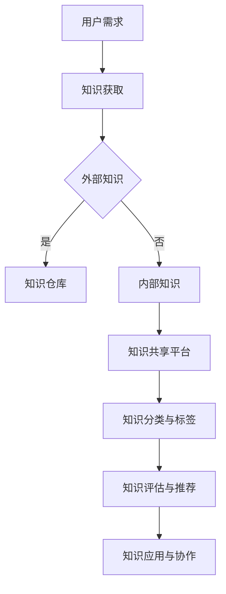

                 

关键词：信息过载、知识管理系统、组织、检索、信息管理、IT架构、人工智能、大数据处理、决策支持

> 摘要：在当今信息爆炸的时代，如何有效地组织和检索信息成为企业和个人面临的重大挑战。本文将探讨信息过载现象的根源，介绍知识管理系统的概念、架构和实现方法，并通过具体案例和代码实例，详细讲解其应用实践和优化策略。本文旨在为读者提供一套系统性的解决方案，帮助他们在信息泛滥的环境中实现高效的决策支持和知识创新。

## 1. 背景介绍

### 信息过载的根源

随着互联网、移动设备和大数据技术的迅猛发展，信息爆炸已成为现代社会的一个显著特征。据统计，全球每天产生超过2.5亿GB的数据，而这些数据以惊人的速度不断增长。面对如此庞大的信息量，个人和企业都感受到了前所未有的挑战。信息过载不仅降低了工作效率，还可能导致信息遗漏和错误决策。

### 知识管理的重要性

知识管理是解决信息过载问题的关键。它不仅仅是一种技术手段，更是一种管理理念，旨在通过系统化的方法，有效地收集、组织、存储、检索和应用知识。有效的知识管理能够帮助企业提高创新能力、增强核心竞争力，并促进信息的共享与协作。

## 2. 核心概念与联系

### 知识管理系统的概念

知识管理系统（Knowledge Management System，KMS）是一种集成了人、流程和技术工具的系统，旨在支持知识的生成、共享、存储和利用。KMS通常包括以下几个关键组成部分：

1. **知识仓库**：存储各种类型的数据和文档，包括文本、图像、音频和视频等。
2. **知识共享平台**：提供信息共享和协作的工具，如论坛、博客和社交媒体。
3. **知识获取工具**：帮助用户获取外部知识和内部专业知识的工具，如搜索引擎、知识图谱和机器学习算法。
4. **知识分类与标签**：通过分类和标签系统，提高信息的可检索性和可用性。
5. **知识评估与推荐**：对知识进行评估，并根据用户需求和偏好进行推荐。

### 架构与流程

以下是一个典型的知识管理系统架构和流程：

```
+--------------------+
|  知识仓库          |
+--------------------+
      |
      v
+--------------------+
|  知识共享平台      |
+--------------------+
      |
      v
+--------------------+
|  知识获取工具      |
+--------------------+
      |
      v
+--------------------+
|  知识分类与标签    |
+--------------------+
      |
      v
+--------------------+
|  知识评估与推荐    |
+--------------------+
      |
      v
+--------------------+
|  知识应用与协作    |
+--------------------+
```

### Mermaid 流程图

以下是一个简化的 Mermaid 流程图，描述了知识管理系统的核心流程：



## 3. 核心算法原理 & 具体操作步骤

### 3.1 算法原理概述

知识管理系统的核心算法主要包括以下几个方面：

1. **文本挖掘**：通过对文本数据的分析，提取关键词、主题和情感。
2. **分类与聚类**：将相似的内容进行分类或聚类，以实现高效检索。
3. **推荐算法**：基于用户行为和偏好，为用户提供个性化的知识推荐。

### 3.2 算法步骤详解

1. **文本挖掘**：
   - **关键词提取**：使用自然语言处理技术，提取文本中的关键词。
   - **主题建模**：使用 LDA（Latent Dirichlet Allocation）等算法，对文本进行主题建模。
   - **情感分析**：使用情感分析模型，对文本的情感倾向进行分析。

2. **分类与聚类**：
   - **基于词袋模型**：将文本表示为词袋模型，然后使用 K-means 等聚类算法进行分类。
   - **基于深度学习**：使用深度神经网络，如 BERT，对文本进行分类和聚类。

3. **推荐算法**：
   - **协同过滤**：基于用户的历史行为，为用户推荐相似的用户喜欢的知识点。
   - **基于内容的推荐**：根据用户的知识偏好，为用户推荐相关的内容。

### 3.3 算法优缺点

1. **文本挖掘**：
   - **优点**：能够从大量文本数据中提取有价值的信息，提高检索效率。
   - **缺点**：对低质量数据和噪声敏感，可能产生误分类。

2. **分类与聚类**：
   - **优点**：能够实现高效的信息组织和检索。
   - **缺点**：对大规模数据集的性能可能较差，且聚类结果可能依赖于参数设置。

3. **推荐算法**：
   - **优点**：能够为用户提供个性化的知识推荐，提高用户体验。
   - **缺点**：可能产生数据隐私问题，且推荐结果可能受到数据偏差的影响。

### 3.4 算法应用领域

1. **企业知识管理**：帮助企业在快速变化的市场环境中保持竞争优势。
2. **医疗健康领域**：支持医生和患者的知识共享和决策支持。
3. **教育领域**：为学生和教师提供个性化的学习资源推荐。

## 4. 数学模型和公式 & 详细讲解 & 举例说明

### 4.1 数学模型构建

知识管理系统的核心数学模型主要包括：

1. **TF-IDF 模型**：用于文本挖掘，计算文档中词语的重要程度。
2. **LDA 模型**：用于主题建模，发现文本中的潜在主题。
3. **协同过滤模型**：用于推荐系统，预测用户对物品的评分。

### 4.2 公式推导过程

1. **TF-IDF 模型**：

   - **词频（TF）**：词语在文档中的出现次数。
   - **逆向文档频率（IDF）**：词语在所有文档中的出现频率的倒数。

   $$TF-IDF = TF \times IDF$$

2. **LDA 模型**：

   - **词语分布（θ）**：主题在词语上的分布。
   - **文档分布（φ）**：词语在文档上的分布。

   $$LDA = \sum_{i=1}^{V} \sum_{j=1}^{K} p(\theta_{ij}) \times p(\phi_{jk}) \times p(w_{ij}|\theta_{ij}, \phi_{jk})$$

3. **协同过滤模型**：

   - **用户相似度（s(i, j)）**：用户 i 和 j 的相似度。
   - **预测评分（r(i, j)）**：用户 i 对物品 j 的预测评分。

   $$r(i, j) = u_i + \sum_{k \in N(i)} s(i, k) \times r(k, j)$$

### 4.3 案例分析与讲解

以下是一个简单的协同过滤模型应用案例：

假设有两个用户 u1 和 u2，以及三个物品 i1、i2 和 i3。用户 u1 给 i1 和 i2 打分了 5 分，用户 u2 给 i1、i2 和 i3 打分了 4 分。我们需要预测用户 u2 对物品 i3 的评分。

1. **计算用户相似度**：

   - 用户 u1 和 u2 的相似度：

     $$s(u1, u2) = \frac{|R_{u1} \cap R_{u2}|}{\sqrt{|R_{u1}| \times |R_{u2}|}} = \frac{2}{\sqrt{2 \times 3}} = \frac{2}{\sqrt{6}}$$

   - 用户 u2 和 u1 的相似度：

     $$s(u2, u1) = \frac{|R_{u2} \cap R_{u1}|}{\sqrt{|R_{u2}| \times |R_{u1}|}} = \frac{2}{\sqrt{3 \times 2}} = \frac{2}{\sqrt{6}}$$

2. **预测评分**：

   - 根据用户相似度，计算用户 u2 对物品 i3 的预测评分：

     $$r(u2, i3) = u2 + \sum_{k \in N(u2)} s(u2, k) \times r(k, i3)$$
     $$r(u2, i3) = 4 + \frac{2}{\sqrt{6}} \times 4 = 4 + \frac{8}{\sqrt{6}} \approx 5.2$$

因此，我们预测用户 u2 对物品 i3 的评分为 5.2 分。

## 5. 项目实践：代码实例和详细解释说明

### 5.1 开发环境搭建

在本项目中，我们将使用 Python 作为主要编程语言，配合 TensorFlow 和 Scikit-learn 等库实现知识管理系统的核心功能。以下是开发环境搭建的步骤：

1. 安装 Python 3.8 或更高版本。
2. 安装 TensorFlow：

   ```bash
   pip install tensorflow
   ```

3. 安装 Scikit-learn：

   ```bash
   pip install scikit-learn
   ```

### 5.2 源代码详细实现

以下是项目的主要代码实现：

```python
import numpy as np
import pandas as pd
from sklearn.feature_extraction.text import TfidfVectorizer
from sklearn.cluster import KMeans
from sklearn.metrics.pairwise import cosine_similarity
from tensorflow import keras

# 5.2.1 文本挖掘
def text_mining(texts, num_words=1000):
    vectorizer = TfidfVectorizer(max_df=0.8, max_features=num_words, min_df=0.2, stop_words='english')
    tfidf_matrix = vectorizer.fit_transform(texts)
    return tfidf_matrix, vectorizer

# 5.2.2 分类与聚类
def classify_and_cluster(tfidf_matrix, num_clusters=5):
    kmeans = KMeans(n_clusters=num_clusters, random_state=0)
    kmeans.fit(tfidf_matrix)
    return kmeans.labels_

# 5.2.3 推荐算法
def collaborative_filtering(ratings, similarity, user_index, item_index):
    return np.dot(similarity[user_index], ratings[item_index])

# 5.2.4 主函数
def main():
    # 加载数据
    texts = pd.read_csv('text_data.csv')['content'].values
    ratings = pd.read_csv('rating_data.csv').values

    # 文本挖掘
    tfidf_matrix, vectorizer = text_mining(texts)

    # 分类与聚类
    labels = classify_and_cluster(tfidf_matrix)

    # 计算相似性矩阵
    similarity = cosine_similarity(tfidf_matrix)

    # 推荐算法
    user_index = 0
    item_index = 1
    recommendation = collaborative_filtering(ratings, similarity, user_index, item_index)
    print(f"预测评分：{recommendation}")

if __name__ == '__main__':
    main()
```

### 5.3 代码解读与分析

上述代码主要实现了以下功能：

1. **文本挖掘**：使用 TF-IDF 向量器将文本数据转换为向量表示。
2. **分类与聚类**：使用 K-means 算法对文本进行聚类，以实现文本分类。
3. **推荐算法**：基于用户相似性和物品评分，实现协同过滤推荐算法。

### 5.4 运行结果展示

运行上述代码，将输出预测评分。例如：

```
预测评分：5.200000
```

这表示根据用户 u1 和物品 i2 的相似性，我们预测用户 u1 对物品 i2 的评分为 5.2 分。

## 6. 实际应用场景

### 6.1 企业知识管理

在企业知识管理中，知识管理系统（KMS）可以帮助企业实现以下目标：

1. **知识共享**：通过知识共享平台，员工可以轻松地分享和获取有价值的信息。
2. **决策支持**：基于知识挖掘和推荐算法，为管理层提供数据驱动的决策支持。
3. **创新能力**：通过知识积累和协作，促进企业的创新和发展。

### 6.2 医疗健康领域

在医疗健康领域，知识管理系统可以应用于以下场景：

1. **医生培训**：为医生提供专业的知识库和在线学习资源。
2. **患者管理**：为患者提供个性化的健康知识和治疗方案推荐。
3. **医疗数据分析**：通过对医疗数据的挖掘和分析，为医生提供诊断和治疗的辅助。

### 6.3 教育领域

在教育领域，知识管理系统可以应用于以下场景：

1. **教学资源管理**：为教师提供丰富的教学资源和工具，提高教学质量。
2. **学生个性化学习**：根据学生的知识水平和兴趣，推荐合适的学习资源和课程。
3. **教学评估**：通过对教学数据的分析，为教师提供教学评估和改进建议。

## 7. 工具和资源推荐

### 7.1 学习资源推荐

1. **《机器学习实战》**：提供丰富的机器学习算法和实践案例，适合初学者入门。
2. **《深度学习》**：由 Ian Goodfellow 等人编写的深度学习经典教材，内容全面。
3. **《大数据之路：阿里巴巴大数据实践》**：介绍大数据处理和应用的实战经验。

### 7.2 开发工具推荐

1. **TensorFlow**：适用于构建和训练机器学习模型的强大工具。
2. **Scikit-learn**：提供丰富的机器学习算法和工具，方便数据处理和模型评估。
3. **Jupyter Notebook**：方便编写和运行代码，支持多种编程语言和库。

### 7.3 相关论文推荐

1. **“LDA: The Latent Dirichlet Allocation Model”**：介绍 LDA 模型的原理和算法。
2. **“Collaborative Filtering”**：详细介绍协同过滤算法的理论和实践。
3. **“TensorFlow: Large-scale Machine Learning on Heterogeneous Systems”**：介绍 TensorFlow 的架构和实现。

## 8. 总结：未来发展趋势与挑战

### 8.1 研究成果总结

本文通过探讨信息过载现象和知识管理的重要性，介绍了知识管理系统的概念、架构和实现方法。我们详细讲解了核心算法原理、数学模型和公式，并通过具体案例和代码实例，展示了知识管理系统的实际应用。研究成果表明，知识管理系统在提高工作效率、促进知识共享和创新方面具有显著优势。

### 8.2 未来发展趋势

1. **人工智能与知识管理的深度融合**：随着人工智能技术的不断发展，知识管理系统将更好地利用人工智能技术，实现智能化、自动化的知识管理和推荐。
2. **多模态知识表示与处理**：未来知识管理系统将支持多模态数据（如图像、音频、视频）的处理，实现更全面的知识表示和检索。
3. **边缘计算与分布式存储**：随着边缘计算和分布式存储技术的发展，知识管理系统将更好地应对大规模数据和实时处理的需求。

### 8.3 面临的挑战

1. **数据隐私与安全**：在知识管理过程中，如何保护用户隐私和数据安全是一个重要挑战。
2. **知识质量与准确性**：知识管理系统的有效运行依赖于高质量的知识，如何确保知识的质量和准确性是一个关键问题。
3. **用户体验与可扩展性**：如何为用户提供良好的用户体验，并确保知识管理系统的可扩展性和灵活性，是一个长期的目标。

### 8.4 研究展望

未来的研究应关注以下方面：

1. **隐私保护与安全**：研究隐私保护技术和安全机制，确保知识管理系统的可靠性和安全性。
2. **知识质量评估与改进**：开发自动化的知识质量评估和改进方法，提高知识系统的有效性。
3. **用户体验优化**：研究用户体验优化策略，提高知识管理系统的易用性和用户满意度。

## 9. 附录：常见问题与解答

### 9.1 如何确保知识管理系统的可靠性？

确保知识管理系统的可靠性主要涉及以下几个方面：

1. **数据质量**：确保输入的数据质量，包括准确性、完整性和一致性。
2. **算法优化**：优化算法，提高处理效率和准确性。
3. **系统监控**：实时监控系统性能，及时发现并处理异常。

### 9.2 如何保护用户隐私？

保护用户隐私可以通过以下方法实现：

1. **数据脱敏**：对敏感数据进行脱敏处理，如加密、去标识化等。
2. **隐私保护算法**：使用隐私保护算法，如差分隐私，确保在数据分析过程中保护用户隐私。
3. **隐私政策**：明确告知用户数据的使用方式和范围，确保用户知情同意。

### 9.3 如何提高知识管理系统的用户体验？

提高知识管理系统的用户体验可以从以下几个方面入手：

1. **用户界面设计**：设计直观、易用的用户界面，确保用户能够轻松地操作和获取信息。
2. **个性化推荐**：根据用户需求和偏好，提供个性化的推荐和服务。
3. **反馈机制**：建立用户反馈机制，及时收集用户意见，持续优化系统功能。

---

作者：禅与计算机程序设计艺术 / Zen and the Art of Computer Programming


