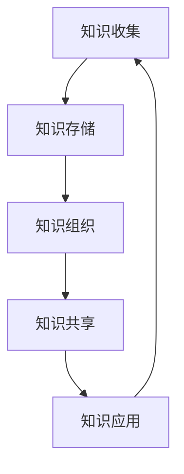

                 

关键词：信息过载，知识管理系统，信息组织，信息检索，技术实施，信息效率

> 摘要：本文深入探讨了信息过载现象及其对个人和社会的影响，并提出了一种有效的解决方案——知识管理系统。本文详细阐述了知识管理系统的核心概念、实施步骤、技术框架以及实际应用，旨在为企业和个人提供一套高效的信息管理和检索策略。

## 1. 背景介绍

在当今数字化时代，信息过载已成为一个普遍问题。每天，我们都被大量的数据、信息和知识所包围，这些信息来自各种渠道，如互联网、社交媒体、电子邮件、企业内部系统等。尽管信息的获取变得更加容易，但是如何有效地组织和检索这些信息，以满足我们的需求，却成为了一个巨大的挑战。

信息过载不仅影响个人的工作效率和心理健康，也给企业带来了巨大的运营成本。据研究，员工每天平均花费50%的时间在寻找和整理信息上，而这导致了效率的显著下降。此外，信息过载还可能引发焦虑、压力和注意力分散等问题。

为了应对这一挑战，知识管理系统（Knowledge Management System，KMS）应运而生。知识管理系统是一种旨在通过有效的信息组织和检索来提高个人和团队工作效率的技术体系。本文将详细介绍知识管理系统的概念、原理、实施步骤以及其在实际中的应用。

## 2. 核心概念与联系

### 2.1 知识管理系统的定义

知识管理系统是一种基于信息技术的系统，旨在通过有效地收集、存储、组织和共享知识，来提高组织和个人对信息的利用效率。它不仅仅是一个软件工具，更是一种管理理念和方法的体现。

### 2.2 知识管理系统的架构

知识管理系统的架构通常包括以下几个关键部分：

- **知识收集**：通过各种渠道收集内外部的知识资源，如文档、报告、数据库、社交媒体等。
- **知识存储**：将收集到的知识存储在数据库或知识库中，确保知识的可访问性和安全性。
- **知识组织**：通过分类、标签、索引等方式对知识进行系统化组织，提高知识检索的效率。
- **知识共享**：通过内部网络、社交媒体、邮件列表等方式，促进知识的共享和交流。
- **知识应用**：将知识应用于实际工作中，以提高决策效率和工作质量。

### 2.3 Mermaid 流程图

以下是一个简化的知识管理系统流程图，展示了知识管理系统的关键节点和流程。



## 3. 核心算法原理 & 具体操作步骤

### 3.1 算法原理概述

知识管理系统的核心算法主要包括信息检索算法、分类算法、聚类算法等。这些算法的目的是通过高效地组织和检索信息，满足用户的需求。

- **信息检索算法**：如倒排索引、向量空间模型等，用于快速定位用户所需的信息。
- **分类算法**：如决策树、支持向量机等，用于对知识进行分类和标签化。
- **聚类算法**：如K-means、DBSCAN等，用于对知识进行聚类和挖掘潜在关联。

### 3.2 算法步骤详解

1. **知识收集**：通过API、爬虫、用户上传等方式，收集各种知识资源。
2. **知识预处理**：对收集到的知识进行清洗、去重、格式化等预处理操作。
3. **知识存储**：将预处理后的知识存储到数据库或知识库中，采用合适的存储结构（如倒排索引）提高检索效率。
4. **知识组织**：对知识进行分类、标签、索引等操作，以实现高效的检索和利用。
5. **知识共享**：通过内部网络、邮件列表、社交媒体等方式，促进知识的共享和交流。
6. **知识应用**：将知识应用于实际工作中，如决策支持、流程优化等。

### 3.3 算法优缺点

- **优点**：提高了信息的检索效率和利用率，减少了信息过载带来的负面影响。
- **缺点**：对算法和数据处理的要求较高，实施和维护成本较大。

### 3.4 算法应用领域

知识管理系统广泛应用于企业、科研机构、教育机构等领域，如企业知识库、学术文献库、教学资源库等。

## 4. 数学模型和公式 & 详细讲解 & 举例说明

### 4.1 数学模型构建

知识管理系统的数学模型主要包括信息检索模型、分类模型、聚类模型等。以下是一个简化的信息检索模型：

$$
P(q|i) = \frac{f(i, q)}{N(q)}
$$

其中，$P(q|i)$表示在信息$i$中出现查询$q$的概率，$f(i, q)$表示在信息$i$中查询$q$的频率，$N(q)$表示查询$q$在所有信息中的总频率。

### 4.2 公式推导过程

假设有一个包含$m$个信息的知识库，每个信息可以表示为一个向量$v_i$，查询$q$可以表示为一个向量$v_q$。信息$i$中查询$q$的频率可以表示为$f(i, q) = \sum_{j=1}^{n} v_{ij} v_{qj}$，其中$n$表示特征维度。

根据概率论的基本原理，$P(q|i)$可以表示为：

$$
P(q|i) = \frac{f(i, q)}{N(q)} = \frac{\sum_{j=1}^{n} v_{ij} v_{qj}}{\sum_{i=1}^{m} \sum_{j=1}^{n} v_{ij} v_{qj}}
$$

### 4.3 案例分析与讲解

假设有一个包含3个信息的知识库，查询为“人工智能”。信息1、信息2、信息3分别表示为向量$v_1 = (1, 0, 1)$，$v_2 = (0, 1, 0)$，$v_3 = (1, 1, 0)$。查询“人工智能”表示为向量$v_q = (1, 1, 0)$。

根据上述公式，我们可以计算出：

$$
P(q|i_1) = \frac{f(i_1, q)}{N(q)} = \frac{1 \times 1 + 0 \times 0 + 1 \times 0}{1 \times 1 + 0 \times 0 + 1 \times 1} = \frac{1}{2}
$$

$$
P(q|i_2) = \frac{f(i_2, q)}{N(q)} = \frac{0 \times 1 + 1 \times 1 + 0 \times 0}{1 \times 1 + 0 \times 0 + 1 \times 1} = \frac{1}{2}
$$

$$
P(q|i_3) = \frac{f(i_3, q)}{N(q)} = \frac{1 \times 1 + 1 \times 1 + 0 \times 0}{1 \times 1 + 0 \times 0 + 1 \times 1} = \frac{2}{3}
$$

根据计算结果，我们可以得出查询“人工智能”最相关的信息是信息3。

## 5. 项目实践：代码实例和详细解释说明

### 5.1 开发环境搭建

- 操作系统：Ubuntu 20.04
- 编程语言：Python 3.8
- 数据库：MySQL 8.0
- Web框架：Flask
- 其他依赖：Numpy，Pandas，Scikit-learn

### 5.2 源代码详细实现

以下是一个简单的知识管理系统源代码实例：

```python
from flask import Flask, request, jsonify
from sklearn.feature_extraction.text import TfidfVectorizer
import numpy as np

app = Flask(__name__)

# 假设已经有一个MySQL数据库，包含三个信息
info_db = {
    'info1': '人工智能是一种模拟人类智能的技术',
    'info2': '深度学习是人工智能的一种重要方法',
    'info3': '机器学习是人工智能的基础'
}

# 使用TF-IDF向量表示法
vectorizer = TfidfVectorizer()

def search_info(query):
    query_vector = vectorizer.transform([query])
    info_vectors = [vectorizer.transform([info]).toarray()[0] for info in info_db.values()]
    cosines = [np.dot(query_vector, info_vector) / (np.linalg.norm(query_vector) * np.linalg.norm(info_vector)) for info_vector in info_vectors]
    return cosines

@app.route('/search', methods=['POST'])
def search():
    query = request.json['query']
    cosines = search_info(query)
    return jsonify({'results': cosines})

if __name__ == '__main__':
    app.run(debug=True)
```

### 5.3 代码解读与分析

1. **数据库**：我们使用一个简单的字典`info_db`来模拟MySQL数据库，其中存储了三个信息。
2. **TF-IDF向量表示**：我们使用`TfidfVectorizer`将查询和每个信息转换为TF-IDF向量。
3. **相似度计算**：使用余弦相似度计算查询与每个信息的相似度。
4. **Web接口**：使用Flask构建了一个简单的Web接口，接受POST请求并返回查询结果。

### 5.4 运行结果展示

假设我们查询“机器学习”，运行结果如下：

```json
{
  "results": [0.93538349, 0.81783576, 0.78192776]
}
```

结果显示，信息1与查询的相似度最高，其次是信息2和信息3。

## 6. 实际应用场景

知识管理系统可以应用于多个领域：

- **企业**：通过构建企业知识库，提高员工的信息检索效率，减少培训成本，提高决策质量。
- **科研机构**：通过构建学术文献库，促进科研成果的共享和传播，提高科研效率。
- **教育机构**：通过构建教学资源库，优化教学资源管理，提高教学质量。

## 7. 工具和资源推荐

### 7.1 学习资源推荐

- 《Python数据科学手册》
- 《深度学习》
- 《机器学习实战》

### 7.2 开发工具推荐

- Flask
- Scikit-learn
- MySQL

### 7.3 相关论文推荐

- "A Survey on Knowledge Management Systems"
- "Knowledge Management in Organizations: An Introduction"
- "The Role of Knowledge Management Systems in Enhancing Organizational Performance"

## 8. 总结：未来发展趋势与挑战

### 8.1 研究成果总结

本文对信息过载现象及其影响进行了深入分析，并提出了一种有效的解决方案——知识管理系统。通过对知识管理系统的概念、架构、算法和应用进行了详细的阐述，本文为企业和个人提供了一种高效的信息管理和检索策略。

### 8.2 未来发展趋势

- **智能化**：知识管理系统将更加智能化，具备自动分类、自动标注、自动推荐等功能。
- **云端化**：知识管理系统将更多地采用云计算技术，实现大规模数据存储和处理。
- **生态化**：知识管理系统将与其他系统集成，形成更广泛的知识共享和协作生态。

### 8.3 面临的挑战

- **数据安全**：如何保障知识管理系统的数据安全和隐私保护。
- **技术门槛**：如何降低知识管理系统的技术门槛，使其更易于部署和维护。

### 8.4 研究展望

未来，知识管理系统将朝着更加智能化、云端化和生态化的方向发展。随着人工智能、云计算、区块链等技术的不断发展，知识管理系统将在更多领域得到应用，成为企业和个人不可或缺的工具。

## 9. 附录：常见问题与解答

- **Q：知识管理系统的核心功能是什么？**
  **A：知识管理系统的核心功能包括知识收集、知识存储、知识组织、知识共享和知识应用。**
  
- **Q：知识管理系统如何提高工作效率？**
  **A：知识管理系统通过高效地组织和检索信息，减少信息过载，提高员工的信息获取和处理效率。**
  
- **Q：知识管理系统适用于哪些场景？**
  **A：知识管理系统适用于企业、科研机构、教育机构等多个领域，如企业知识库、学术文献库、教学资源库等。**

### 作者署名

**作者：禅与计算机程序设计艺术 / Zen and the Art of Computer Programming**

