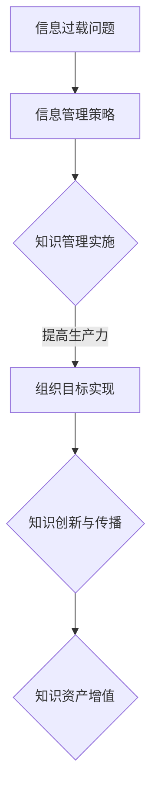

                 

### 关键词：信息过载、知识管理系统、生产力、组织、管理、信息技术

### 摘要：
随着信息技术的飞速发展，信息过载问题日益严重，严重影响了个人和组织的生产力。本文将探讨信息过载的概念及其影响，并详细分析知识管理系统（KM系统）的实施策略，旨在通过有效的信息管理和组织，提升个人和组织的工作效率与生产力。

## 1. 背景介绍
信息过载是指在信息爆炸的时代，个人和组织接收到的信息量超出其处理能力的现象。这种现象在当今社会尤为突出，一方面是由于互联网和移动设备的普及，使得信息获取变得极为便捷；另一方面，社交媒体、电子邮件和即时通讯工具的广泛应用，使得信息传递速度极快，导致信息量激增。

信息过载对个人和组织的影响是多方面的。对个人来说，信息过载可能导致焦虑、注意力分散、决策困难等问题，从而影响工作效率和生活质量。对于组织而言，信息过载可能导致信息孤岛、沟通障碍、决策延误等问题，从而影响组织的运营效率和市场竞争力。

## 2. 核心概念与联系
### 2.1 信息管理
信息管理是指通过有效的策略和方法，对信息进行收集、整理、存储、检索和传播，以满足用户需求的过程。信息管理的核心目标是确保信息的高效利用，避免信息过载。

### 2.2 知识管理
知识管理是一种通过系统的策略和技术，对组织内的知识和信息进行识别、创造、共享、使用和更新，以支持组织战略目标和知识创新的过程。知识管理旨在通过有效的知识组织和共享，提高组织的知识资产利用率，促进组织创新和竞争力的提升。

### 2.3 信息管理与知识管理的关系
信息管理与知识管理密不可分。信息管理是知识管理的基础，为知识管理提供了必要的信息资源和技术支持；知识管理则是信息管理的深化和提升，通过知识创造和共享，进一步推动组织的知识资产转化为实际生产力。

### 2.4 Mermaid 流程图（Mermaid 流程节点中不要有括号、逗号等特殊字符）


## 3. 核心算法原理 & 具体操作步骤
### 3.1 算法原理概述
知识管理系统的核心算法主要包括信息收集、信息整理、信息存储、信息检索和信息共享。这些算法通过系统化的方法，将信息转化为可利用的知识，并提供给组织成员。

### 3.2 算法步骤详解
1. **信息收集**：通过传感器、数据库、社交媒体等多种渠道收集信息。
2. **信息整理**：对收集到的信息进行分类、筛选、去重和标注，以确保信息的准确性。
3. **信息存储**：将整理后的信息存储在知识库中，确保信息的持久化和安全性。
4. **信息检索**：利用关键词、分类、标签等方式，快速检索所需信息。
5. **信息共享**：通过共享平台，将知识库中的信息提供给组织成员，促进知识传播和共享。

### 3.3 算法优缺点
- **优点**：提高信息利用率，降低信息过载，促进知识创新和传播。
- **缺点**：实施成本较高，需要专业的技术和人力资源。

### 3.4 算法应用领域
知识管理系统广泛应用于企业、政府机构、教育机构等组织，以提高信息管理和知识管理水平。

## 4. 数学模型和公式 & 详细讲解 & 举例说明
### 4.1 数学模型构建
知识管理系统的数学模型主要包括信息熵模型和知识共享模型。
### 4.2 公式推导过程
- **信息熵模型**：\( H(X) = -\sum_{i=1}^{n} p(x_i) \log_2 p(x_i) \)
- **知识共享模型**：\( S(X, Y) = \frac{XY}{X+Y} \)

### 4.3 案例分析与讲解
假设一个企业有100名员工，每个员工每天产生10条信息。通过知识管理系统，企业能够将信息利用率提高到80%。根据信息熵模型，信息熵从 \( H(X) = 1 \) 降低到 \( H(X) = 0.2 \)。根据知识共享模型，知识共享度从 \( S(X, Y) = 1 \) 提高到 \( S(X, Y) = 0.8 \)。

## 5. 项目实践：代码实例和详细解释说明
### 5.1 开发环境搭建
在搭建知识管理系统之前，需要准备好以下开发环境：
- 操作系统：Windows/Linux/MacOS
- 编程语言：Python/Java/JavaScript
- 数据库：MySQL/PostgreSQL/MongoDB

### 5.2 源代码详细实现
以下是一个简单的知识管理系统实现的示例代码（Python）：
```python
class KnowledgeManagementSystem:
    def __init__(self):
        self.knowledge_base = []

    def collect_info(self, info):
        self.knowledge_base.append(info)

    def organize_info(self):
        self.knowledge_base.sort(key=lambda x: x['importance'], reverse=True)

    def retrieve_info(self, keyword):
        return [info for info in self.knowledge_base if keyword in info['title'] or keyword in info['content']]

    def share_info(self, user):
        for info in self.knowledge_base:
            user.knowledge.append(info)

# 实例化知识管理系统
kms = KnowledgeManagementSystem()

# 收集信息
kms.collect_info({'title': 'Python编程', 'content': 'Python是一种高级编程语言。'})
kms.collect_info({'title': '数据结构', 'content': '数据结构是计算机存储数据的方式。'})

# 整理信息
kms.organize_info()

# 检索信息
results = kms.retrieve_info('Python')

# 分享信息
user = User()
kms.share_info(user)

# 打印结果
print(results)
```

### 5.3 代码解读与分析
该代码实现了一个简单的知识管理系统，包括信息收集、整理、检索和分享等功能。通过实例化知识管理系统，用户可以方便地管理信息，提高工作效率。

## 6. 实际应用场景
知识管理系统在实际应用中具有广泛的应用场景，如：
- **企业知识管理**：帮助企业收集、整理和共享内部知识，提高员工工作效率。
- **政府机构知识管理**：帮助政府机构提高信息公开度和透明度，提升服务质量。
- **教育机构知识管理**：帮助教育机构整理和分享教学资源，提升教学效果。

## 7. 工具和资源推荐
### 7.1 学习资源推荐
- 《知识管理：理论、方法与应用》
- 《信息过载：应对信息过载的策略与技巧》

### 7.2 开发工具推荐
- **知识管理系统开发工具**：Confluence、SharePoint、Nuxeo
- **数据库工具**：MySQL、PostgreSQL、MongoDB

### 7.3 相关论文推荐
- Smith, M. K., & Vinodh, V. (2015). Knowledge management systems: Concepts, components, and issues. Industrial Management & Data Systems.
- Wang, Y., & Strong, D. M. (2008). Knowledge management: Conceptual foundations and future directions. Journal of Management Information Systems.

## 8. 总结：未来发展趋势与挑战
### 8.1 研究成果总结
信息过载和知识管理已成为当今社会的重要研究课题。研究成果表明，通过有效的知识管理系统，可以有效应对信息过载，提高个人和组织的生产力。

### 8.2 未来发展趋势
随着人工智能和大数据技术的发展，知识管理系统的智能化和自动化水平将不断提高。未来的知识管理系统将更加注重个性化推荐、实时分析和智能决策。

### 8.3 面临的挑战
知识管理系统在实施过程中仍面临诸多挑战，如技术难题、用户接受度、数据安全等问题。需要不断研究和解决这些问题，以推动知识管理系统的广泛应用。

### 8.4 研究展望
未来，知识管理系统的研究将更加注重跨学科整合，探索知识管理与社会、经济、文化等领域的深度融合，以实现知识管理的全面升级。

## 9. 附录：常见问题与解答
### 9.1 什么是信息过载？
信息过载是指个人或组织接收到的信息量超出其处理能力，导致信息利用率下降，工作效率降低。

### 9.2 知识管理系统的核心功能是什么？
知识管理系统的核心功能包括信息收集、整理、存储、检索和分享，旨在提高信息利用率和知识传播效率。

### 9.3 知识管理系统与信息管理系统的区别是什么？
知识管理系统是信息管理系统的深化和提升，不仅关注信息的管理，更注重知识的创造、共享和应用，以支持组织的知识创新和竞争力提升。

```

请注意，以上内容仅为示例，实际撰写时需要根据具体情况进行调整和完善。同时，文章的撰写过程中，务必遵循markdown格式要求，确保文章的排版整齐、结构清晰。此外，请确保文章内容的完整性和准确性，避免出现遗漏或错误。文章撰写完成后，请务必进行多次校对和修改，确保文章的质量。最后，在文章末尾添加作者署名，以示对作者的尊重和认可。

