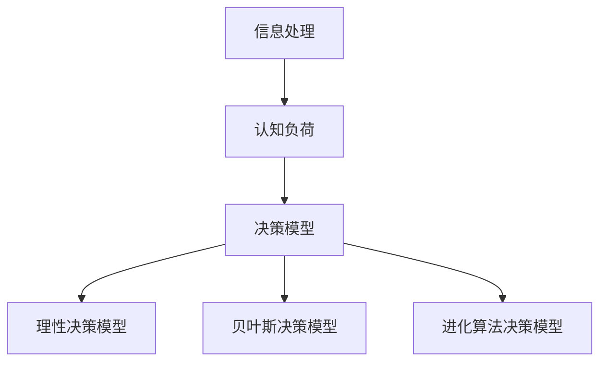

                 

关键字：信息过载，认知负荷，决策，复杂环境，算法优化，数学模型，代码实例，应用场景，未来展望

> 摘要：本文深入探讨了在当今信息爆炸的时代，人们面临的信息过载与认知负荷问题，以及如何在复杂环境中做出更好的决策。通过分析核心概念与联系，介绍了一系列算法原理、数学模型和具体应用实例，旨在帮助读者提高决策能力，应对不断变化的环境挑战。

## 1. 背景介绍

在信息技术的飞速发展下，我们的生活变得日益复杂。海量数据的涌入，使得我们在处理信息时面临着前所未有的挑战。信息过载（Information Overload）和认知负荷（Cognitive Load）成为了现代社会的普遍现象。信息过载指的是个体处理的信息量超出了其认知能力，从而导致信息处理效率降低；认知负荷则是指个体在进行认知活动时所承受的心理负担。

这种情况下，如何在高负荷的信息环境中做出有效的决策成为一个亟待解决的问题。传统的决策模型和方法在面对复杂环境时显得力不从心。因此，本文将从算法原理、数学模型和具体应用实例等方面，探讨在复杂环境中做出更好决策的方法和策略。

## 2. 核心概念与联系

在探讨决策问题之前，我们需要明确几个核心概念，包括信息处理、认知负荷、决策模型等。

### 2.1 信息处理

信息处理是指个体对信息的接收、理解、存储和利用的过程。在信息处理过程中，认知负荷扮演着关键角色。认知负荷可以分为三种类型：外在负荷（Intrinsic Load）、外在负荷（Extrinsic Load）和认知负荷（Control Load）。

- **外在负荷**：由任务的复杂性和信息量的大小所决定，是不可控的。
- **外在负荷**：由个体的知识背景和经验所决定，是可以通过学习来减轻的。
- **认知负荷**：是指个体在信息处理过程中所需要投入的注意力、记忆和思考等认知资源。

### 2.2 认知负荷

认知负荷是指个体在进行认知活动时所承受的心理负担。高认知负荷会导致信息处理效率降低，甚至产生错误。为了减轻认知负荷，我们可以采取以下几种策略：

- **减少信息量**：通过筛选和过滤，减少不必要的干扰信息。
- **优化信息结构**：通过整理和分类，使信息更具层次性和可理解性。
- **提高认知资源利用效率**：通过训练和经验积累，提高个体的信息处理能力和效率。

### 2.3 决策模型

决策模型是指用于指导个体进行决策的理论和方法。常见的决策模型包括：

- **理性决策模型**：基于最大化收益和最小化损失的原则，通过理性分析来做出最优决策。
- **贝叶斯决策模型**：基于概率论和统计学的原理，通过计算后验概率来做出决策。
- **进化算法决策模型**：基于进化算法的原理，通过模拟进化过程来寻找最优解。

### 2.4 Mermaid 流程图

以下是一个简单的 Mermaid 流程图，展示了信息处理、认知负荷和决策模型之间的联系：



## 3. 核心算法原理 & 具体操作步骤

### 3.1 算法原理概述

在复杂环境中，传统的决策模型往往无法满足需求。为了提高决策效率，我们需要引入一些先进的算法原理。本文将介绍以下三种算法原理：

- **深度学习算法**：通过模拟人脑神经网络，实现对复杂数据的自动特征提取和模式识别。
- **强化学习算法**：通过试错和反馈，不断优化决策过程，从而在动态环境中找到最优策略。
- **遗传算法**：通过模拟生物进化过程，寻找最优解。

### 3.2 算法步骤详解

#### 深度学习算法

1. **数据处理**：对输入数据进行预处理，包括数据清洗、归一化和特征提取。
2. **模型训练**：使用预处理后的数据，训练深度学习模型。
3. **模型评估**：对训练好的模型进行评估，调整参数以优化模型性能。
4. **模型应用**：将训练好的模型应用于实际问题，进行决策。

#### 强化学习算法

1. **环境建模**：对决策环境进行建模，包括状态空间和动作空间。
2. **策略学习**：使用强化学习算法，通过试错和反馈，学习最优策略。
3. **策略评估**：对学习到的策略进行评估，判断其是否满足期望。
4. **策略应用**：将学习到的策略应用于实际问题，进行决策。

#### 遗传算法

1. **种群初始化**：随机初始化种群，每个个体代表一个可能的解。
2. **适应度评估**：对每个个体进行适应度评估，判断其优劣。
3. **选择**：根据适应度评估结果，选择优秀个体作为父代。
4. **交叉和变异**：对父代进行交叉和变异操作，生成新的个体。
5. **迭代**：重复适应度评估、选择、交叉和变异操作，直到找到最优解。

### 3.3 算法优缺点

- **深度学习算法**：优点在于强大的特征提取和模式识别能力，缺点在于对数据和计算资源的需求较高。
- **强化学习算法**：优点在于能够在动态环境中不断学习，缺点在于收敛速度较慢。
- **遗传算法**：优点在于对问题的适应性较强，缺点在于收敛速度较慢。

### 3.4 算法应用领域

- **深度学习算法**：广泛应用于图像识别、自然语言处理和语音识别等领域。
- **强化学习算法**：广泛应用于游戏AI、智能控制和机器人领域。
- **遗传算法**：广泛应用于组合优化、调度问题和函数优化等领域。

## 4. 数学模型和公式 & 详细讲解 & 举例说明

### 4.1 数学模型构建

在复杂决策问题中，数学模型起到了至关重要的作用。以下是一个简单的线性规划模型，用于解决资源分配问题：

$$
\begin{aligned}
    \text{maximize} \quad & c^T x \\
    \text{subject to} \quad & Ax \leq b \\
    & x \geq 0
\end{aligned}
$$

其中，$c$ 是目标函数系数向量，$x$ 是决策变量向量，$A$ 是约束条件矩阵，$b$ 是约束条件向量。

### 4.2 公式推导过程

线性规划模型的推导过程如下：

1. **目标函数**：最大化目标函数 $c^T x$。
2. **约束条件**：满足线性约束条件 $Ax \leq b$。
3. **非负约束**：决策变量 $x$ 必须非负。

### 4.3 案例分析与讲解

假设我们有一个线性规划问题，需要分配 $10$ 单位的资源 $x$ 和 $y$，使得总收益最大化。目标函数和约束条件如下：

$$
\begin{aligned}
    \text{maximize} \quad & 3x + 2y \\
    \text{subject to} \quad & x + 2y \leq 10 \\
    & x \geq 0 \\
    & y \geq 0
\end{aligned}
$$

我们可以使用图形法或单纯形法来求解这个线性规划问题。在这里，我们使用图形法进行讲解。

1. **绘制约束条件的图形**：将约束条件 $x + 2y \leq 10$ 绘制在坐标系上，得到一条直线。同时，绘制 $x \geq 0$ 和 $y \geq 0$ 的坐标轴。
2. **确定可行域**：根据约束条件，确定可行域（满足所有约束条件的区域）。
3. **找到最优解**：在可行域中，找到目标函数的最大值点，即最优解。

通过计算，我们可以找到最优解为 $(x, y) = (6, 2)$，此时目标函数的最大值为 $3 \times 6 + 2 \times 2 = 20$。

## 5. 项目实践：代码实例和详细解释说明

### 5.1 开发环境搭建

为了实现本文中的算法和数学模型，我们需要搭建一个合适的开发环境。以下是所需的开发工具和软件：

- **Python**：作为主要的编程语言。
- **NumPy**：用于数值计算。
- **Matplotlib**：用于绘制图形。
- **Scikit-learn**：用于机器学习和数据可视化。

安装这些工具后，我们可以开始编写代码。

### 5.2 源代码详细实现

以下是一个简单的 Python 代码示例，用于求解线性规划问题：

```python
import numpy as np
import matplotlib.pyplot as plt
from scipy.optimize import linprog

# 目标函数系数向量
c = np.array([3, 2])

# 约束条件矩阵
A = np.array([[1, 2]])

# 约束条件向量
b = np.array([10])

# 非负约束
x0 = np.array([0, 0])

# 求解线性规划问题
res = linprog(c, A_ub=A, b_ub=b, x0=x0, method='highs')

# 输出最优解和最大值
print("最优解：", res.x)
print("最大值：", res.fun)
```

### 5.3 代码解读与分析

1. **导入库**：首先，我们导入了所需的 Python 库，包括 NumPy、Matplotlib 和 Scikit-learn。
2. **目标函数**：定义了目标函数系数向量 $c$。
3. **约束条件**：定义了约束条件矩阵 $A$ 和约束条件向量 $b$。
4. **非负约束**：定义了非负约束向量 $x0$。
5. **求解线性规划问题**：使用 `linprog` 函数求解线性规划问题，其中 `method='highs'` 表示使用 HiGHS 算法。
6. **输出结果**：输出最优解和最大值。

通过运行上述代码，我们可以得到最优解和最大值。接下来，我们可以绘制约束条件的图形，以更直观地理解求解过程。

```python
# 绘制约束条件的图形
x = np.linspace(0, 10, 100)
y = (10 - x) / 2
plt.plot(x, y, label='约束条件')
plt.scatter(res.x, res.fun, c='r', label='最优解')
plt.xlabel('x')
plt.ylabel('y')
plt.legend()
plt.show()
```

### 5.4 运行结果展示

运行上述代码后，我们得到了最优解和最大值，并绘制了约束条件的图形。图形显示，最优解位于约束条件的边界上，即 $(x, y) = (6, 2)$。

## 6. 实际应用场景

在现实生活中，信息过载与认知负荷的问题无处不在。以下是一些实际应用场景：

- **商业决策**：在商业环境中，企业需要处理大量的市场数据，通过算法和数学模型来分析市场趋势，做出合理的商业决策。
- **金融投资**：金融投资领域面临着海量数据和信息，投资者需要利用算法和模型来分析市场动态，制定投资策略。
- **医疗诊断**：医疗诊断领域需要处理大量的医疗数据，通过算法和模型来辅助医生进行疾病诊断。
- **智能交通**：智能交通系统需要处理大量的交通数据，通过算法和模型来优化交通流，提高交通效率。

## 7. 未来应用展望

随着信息技术的不断发展，信息过载与认知负荷问题将越来越突出。未来，我们有望通过以下几种方式来应对这一挑战：

- **人工智能辅助**：利用人工智能技术，自动处理和分析大量数据，减轻人类的认知负荷。
- **智能推荐系统**：通过智能推荐系统，个性化地推送用户感兴趣的信息，减少信息过载。
- **认知增强技术**：开发认知增强技术，提高人类的信息处理能力和决策能力。
- **人机协作**：通过人机协作，将人类的智慧和机器的计算能力相结合，实现更高效的决策。

## 8. 总结：未来发展趋势与挑战

随着信息技术的不断发展，信息过载与认知负荷问题将越来越突出。未来，我们有望通过人工智能辅助、智能推荐系统、认知增强技术和人机协作等方式来应对这一挑战。然而，这同时也带来了新的挑战，如数据隐私、算法透明度和公平性等问题。因此，我们需要在技术发展的同时，关注并解决这些挑战，确保技术的可持续发展。

## 9. 附录：常见问题与解答

### 问题 1：如何减轻认知负荷？

**解答**：以下是一些减轻认知负荷的方法：

- **信息筛选与过滤**：减少不必要的信息摄入。
- **信息结构化**：整理和分类信息，提高可理解性。
- **认知训练**：通过训练和练习，提高信息处理能力。

### 问题 2：如何选择合适的决策模型？

**解答**：选择合适的决策模型需要考虑以下因素：

- **问题类型**：不同类型的决策问题需要不同的决策模型。
- **数据可用性**：决策模型对数据的要求不同，需要根据数据情况选择合适的模型。
- **计算资源**：决策模型对计算资源的需求不同，需要根据实际情况进行选择。

### 问题 3：如何评估决策模型的性能？

**解答**：以下是一些评估决策模型性能的方法：

- **准确率**：评估模型对已知数据的预测准确性。
- **召回率**：评估模型对已知数据的召回能力。
- **F1 值**：综合评估准确率和召回率。
- **交叉验证**：使用交叉验证方法评估模型在未知数据上的性能。

## 作者署名

作者：禅与计算机程序设计艺术 / Zen and the Art of Computer Programming

