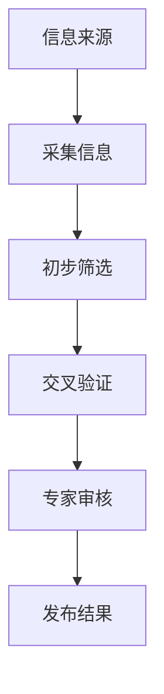
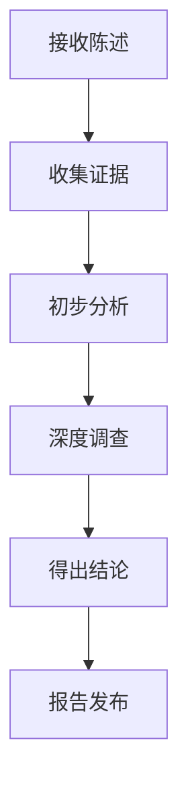
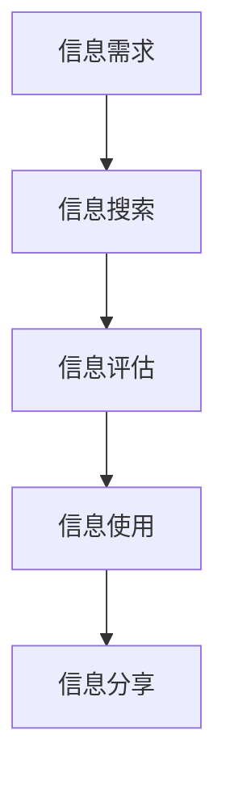
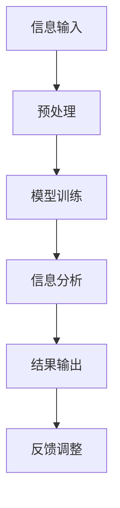
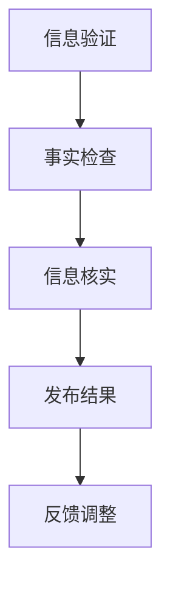

                 

在当前的信息爆炸时代，假新闻和错误信息的泛滥已经成为全球性的问题。这不仅对个人造成了误导和困惑，也对社会稳定和公共信任构成了威胁。作为一名世界级人工智能专家，我们有责任为大众提供一套系统化的信息验证和事实检查指南。本文将深入探讨如何在假新闻和错误信息的海洋中导航，确保我们获取的信息准确可靠。

## 关键词

- 信息验证
- 事实检查
- 假新闻
- 错误信息
- 人工智能
- 信息素养

## 摘要

本文旨在为读者提供一套全面的信息验证和事实检查指南。我们将从核心概念出发，介绍相关的技术和工具，并通过实际案例和项目实践，展示如何在实际操作中应用这些方法。文章还将探讨未来发展趋势，面临的挑战，以及相应的解决方案。

## 1. 背景介绍

随着互联网的普及，信息传播的速度和广度前所未有。然而，这种便利也带来了信息泛滥和真假难辨的问题。据研究，每分钟都会有数千条信息在网络上发布，其中不乏未经证实或完全虚假的信息。这些假新闻和错误信息不仅误导了公众，还可能引发社会恐慌、政治动荡，甚至威胁国家安全。

### 1.1 假新闻的定义与危害

假新闻，又称虚假新闻，是指故意制造、传播的虚假或误导性的信息。这些信息可能包括不实报道、夸大事实、伪造图片或视频等。假新闻的危害是多方面的：

- **误导公众**：假新闻容易误导公众，导致人们对于事实的误解和错误判断。
- **破坏信任**：频繁的假新闻传播会削弱人们对媒体和公共信息的信任。
- **社会动荡**：在某些情况下，假新闻甚至可能引发社会恐慌和暴力事件。
- **经济影响**：假新闻可能对市场造成剧烈波动，损害投资者和企业的利益。

### 1.2 错误信息的定义与来源

错误信息是指由于无知、疏忽或恶意而传播的，不正确或不完整的信息。错误信息的来源多种多样，包括：

- **个体行为**：个人在未经证实的情况下转发或评论信息，导致错误信息的扩散。
- **不良媒体**：一些不负责任的媒体为吸引眼球，故意传播错误信息。
- **技术故障**：技术故障或数据错误也可能导致信息的错误传播。

### 1.3 信息验证和事实检查的重要性

在假新闻和错误信息充斥的环境中，信息验证和事实检查显得尤为重要。它们不仅能够帮助个人避免受到虚假信息的误导，还能提高社会整体的媒介素养和信息质量。

- **维护社会稳定**：通过验证和事实检查，可以有效减少假新闻和错误信息对社会造成的负面影响。
- **提升公共信任**：准确的信息传递有助于建立公众对媒体和公共事务的信任。
- **促进科学进步**：在科研和学术领域，准确的信息是创新和发现的基础。

### 1.4 人工智能在信息验证和事实检查中的作用

随着人工智能技术的发展，越来越多的工具和应用被用于信息验证和事实检查。人工智能可以通过以下方式发挥作用：

- **自动化识别**：利用机器学习和自然语言处理技术，快速识别和过滤假新闻。
- **数据比对**：通过比对海量数据，发现信息中的不一致之处。
- **智能推荐**：基于用户的阅读历史和偏好，推荐更可靠的信息来源。
- **透明度提升**：通过数据可视化和分析，让公众更容易理解信息验证的过程。

### 1.5 读者对象

本文旨在为以下读者群体提供有价值的指导：

- **普通大众**：希望通过本文学会识别和应对假新闻和错误信息。
- **媒体工作者**：需要提升信息核实和报道准确性的专业人士。
- **研究人员和教育者**：对信息验证和事实检查的理论和实践有兴趣的学者。

### 1.6 文章结构

本文将分为以下章节：

- **背景介绍**：探讨假新闻和错误信息的定义、危害及信息验证和事实检查的重要性。
- **核心概念与联系**：介绍信息验证和事实检查的核心概念，并使用 Mermaid 流程图展示其架构。
- **核心算法原理与操作步骤**：详细解释关键算法的原理和操作步骤。
- **数学模型和公式**：构建数学模型，推导公式，并通过案例进行分析。
- **项目实践**：提供代码实例，详细解释其实现过程。
- **实际应用场景**：探讨信息验证和事实检查在不同领域的应用。
- **未来应用展望**：预测未来的发展趋势和潜在应用。
- **工具和资源推荐**：推荐学习资源和开发工具。
- **总结**：回顾研究成果，探讨未来发展方向和面临的挑战。
- **附录**：解答常见问题。

## 2. 核心概念与联系

在信息验证和事实检查中，了解核心概念和它们之间的联系是至关重要的。以下将介绍这些概念，并提供一个Mermaid流程图来展示它们之间的关系。

### 2.1 信息验证

信息验证是指通过一系列方法来确认信息的真实性、准确性和可靠性。其核心目的是确保公众接收到的信息是经过核实和验证的。

#### 2.1.1 核心概念

- **真实性**：信息是否真实存在，是否有可靠来源。
- **准确性**：信息是否准确无误，是否反映了事实的真相。
- **可靠性**：信息来源是否值得信赖，是否有权威性。

#### 2.1.2 流程图



### 2.2 事实检查

事实检查是一种专门用于验证具体陈述或信息真实性的方法。它与信息验证类似，但更侧重于验证具体的事实和声明。

#### 2.2.1 核心概念

- **事实陈述**：具体、明确的事实或声明。
- **证据收集**：收集支持或反驳事实陈述的证据。
- **证据分析**：分析证据的有效性和可靠性。

#### 2.2.2 流程图



### 2.3 信息素养

信息素养是指个体在获取、评估、使用和创造信息的过程中所表现出的能力。它是信息验证和事实检查的基础。

#### 2.3.1 核心概念

- **信息获取**：寻找和获取所需信息的能力。
- **信息评估**：评估信息的准确性、可靠性和相关性。
- **信息使用**：使用信息解决问题或创造价值。
- **信息创造**：创造和分享有价值的信息。

#### 2.3.2 流程图



### 2.4 人工智能与信息验证

人工智能在信息验证中发挥着重要作用，可以通过自动化和智能化的方式提高信息验证的效率和准确性。

#### 2.4.1 核心概念

- **机器学习**：通过训练模型来识别和验证信息。
- **自然语言处理**：理解和处理人类语言，以识别虚假信息和错误信息。
- **数据挖掘**：从大量数据中提取有价值的信息，用于验证和事实检查。

#### 2.4.2 流程图



### 2.5 信息验证与事实检查的联系

信息验证和事实检查之间有着紧密的联系，二者相辅相成。信息验证为事实检查提供了基础，而事实检查则是对信息验证的深入和具体化。

#### 2.5.1 关系

- **信息验证是前提**：在进行事实检查之前，首先需要验证信息的真实性、准确性和可靠性。
- **事实检查是延伸**：在验证信息的基础上，进一步验证具体的事实和声明。

#### 2.5.2 综合流程图



通过上述核心概念和流程图的介绍，我们可以更好地理解信息验证和事实检查的工作机制。在接下来的章节中，我们将进一步探讨关键算法原理、数学模型、项目实践等具体内容。

## 3. 核心算法原理 & 具体操作步骤

### 3.1 算法原理概述

信息验证和事实检查算法的核心原理通常基于数据挖掘、机器学习和自然语言处理技术。以下将介绍几种常用的算法原理：

#### 3.1.1 数据挖掘技术

数据挖掘技术通过对大量数据进行分析和模式识别，发现潜在的信息验证线索。常用的数据挖掘算法包括：

- **关联规则挖掘**：通过分析数据之间的关联性，识别潜在的错误信息。
- **聚类分析**：将相似的数据分组，帮助识别异常值和错误信息。
- **分类算法**：将信息分为真伪两类，常用的分类算法有支持向量机（SVM）、决策树和随机森林等。

#### 3.1.2 机器学习技术

机器学习技术通过训练模型来识别和验证信息。常用的机器学习算法包括：

- **监督学习**：通过标记数据训练模型，使其能够自动识别和验证信息。
- **无监督学习**：在无标记数据的情况下，通过发现数据中的模式和规律来进行验证。
- **强化学习**：通过不断试错和优化，找到最优的信息验证策略。

#### 3.1.3 自然语言处理技术

自然语言处理技术用于理解和处理人类语言，是识别虚假信息和错误信息的关键。常用的自然语言处理技术包括：

- **文本分类**：将文本分为真伪两类，常用的文本分类算法有朴素贝叶斯、卷积神经网络（CNN）等。
- **情感分析**：通过分析文本的情感倾向，识别负面或不实的言论。
- **实体识别**：识别文本中的关键实体，如人名、地点、组织等，用于交叉验证。

### 3.2 算法步骤详解

在了解了核心算法原理后，我们接下来将详细解释信息验证和事实检查的具体操作步骤：

#### 3.2.1 数据收集与预处理

第一步是收集相关数据，包括新闻文章、社交媒体帖子、博客等。然后进行数据预处理，包括去噪、去重、文本清洗等。文本清洗可能包括去除停用词、标点符号，以及将文本转换为统一格式等。

#### 3.2.2 特征提取

在数据预处理后，我们需要提取关键特征，这些特征可能包括词频、词嵌入、句法结构等。特征提取的目的是将原始文本转换为机器学习模型可以处理的输入。

#### 3.2.3 模型训练

接下来，我们使用标记好的训练数据来训练机器学习模型。训练过程包括选择合适的模型架构、调整超参数，以及通过迭代优化模型性能。

#### 3.2.4 模型评估与优化

在模型训练完成后，我们需要对模型进行评估，以确定其准确性和可靠性。评估过程可能包括交叉验证、ROC曲线分析等。根据评估结果，进一步优化模型。

#### 3.2.5 信息验证与事实检查

使用训练好的模型对新的信息进行验证。模型会输出每个信息的真伪概率，并根据设定的阈值进行分类。对于高可信度的信息，可以直接发布；对于低可信度的信息，则需要进一步调查。

#### 3.2.6 结果反馈与调整

最后，将验证结果反馈给用户，并根据用户的反馈进行调整。这个过程中可能包括调整模型参数、改进数据预处理方法等，以提高整体验证效果。

### 3.3 算法优缺点

每种算法都有其优缺点，以下是一些常见算法的优缺点：

#### 3.3.1 数据挖掘算法

**优点**：
- **高效**：能够处理大量数据。
- **灵活性**：可以根据不同的数据类型和场景调整算法。

**缺点**：
- **准确性**：对于复杂和模糊的信息，准确性可能不高。
- **可解释性**：算法决策过程可能不够透明。

#### 3.3.2 机器学习算法

**优点**：
- **自适应性**：能够从数据中学习，提高准确性。
- **泛化能力**：适用于多种类型的数据和场景。

**缺点**：
- **计算成本**：训练和优化模型可能需要大量计算资源。
- **数据依赖**：算法性能高度依赖于数据的质量和数量。

#### 3.3.3 自然语言处理算法

**优点**：
- **语言理解**：能够处理复杂的自然语言。
- **多样应用**：广泛应用于文本分类、情感分析等领域。

**缺点**：
- **准确性**：对于语言歧义和复杂的文本结构，准确性可能较低。
- **资源需求**：需要大量的数据和计算资源。

### 3.4 算法应用领域

信息验证和事实检查算法广泛应用于多个领域：

#### 3.4.1 媒体领域

在媒体领域，算法用于自动识别和过滤假新闻，提高新闻报道的准确性和可信度。

#### 3.4.2 社交媒体领域

在社交媒体领域，算法用于检测和遏制虚假信息传播，保护用户免受误导。

#### 3.4.3 金融领域

在金融领域，算法用于监控和识别金融欺诈行为，保护投资者免受损失。

#### 3.4.4 学术领域

在学术领域，算法用于验证学术成果的真实性和可靠性，打击学术不端行为。

通过上述核心算法原理和具体操作步骤的介绍，我们可以看到，信息验证和事实检查是一个复杂但至关重要的过程。在接下来的章节中，我们将进一步探讨数学模型和公式的构建，以及实际案例的讲解。

## 4. 数学模型和公式 & 详细讲解 & 举例说明

### 4.1 数学模型构建

在信息验证和事实检查中，构建数学模型是非常关键的。以下将介绍几种常见的数学模型，并解释其构建方法。

#### 4.1.1 贝叶斯模型

贝叶斯模型是一种用于概率推理的数学模型，特别适用于信息验证。其基本公式为：

$$
P(A|B) = \frac{P(B|A) \cdot P(A)}{P(B)}
$$

其中，$P(A|B)$ 表示在给定 $B$ 发生的条件下 $A$ 发生的概率，$P(B|A)$ 表示在 $A$ 发生的条件下 $B$ 发生的概率，$P(A)$ 和 $P(B)$ 分别表示事件 $A$ 和 $B$ 的先验概率。

在信息验证中，我们可以使用贝叶斯模型来计算某条信息为假新闻的概率。具体步骤如下：

1. **收集数据**：收集大量真实的和虚假的新闻数据。
2. **特征提取**：提取每条新闻的关键特征，如词汇、句法结构等。
3. **构建概率模型**：使用贝叶斯公式计算每条新闻为假新闻的概率。
4. **阈值设置**：根据设定的阈值，判断新闻的真伪。

#### 4.1.2 决策树模型

决策树模型是一种基于特征划分数据的分类模型。其基本结构如下：

$$
\text{if } x \text{ is } v_1 \text{ then go to node } n_1 \\
\text{if } x \text{ is } v_2 \text{ then go to node } n_2 \\
\cdots \\
\text{if } x \text{ is } v_n \text{ then go to node } n_n
$$

其中，$x$ 表示特征值，$v_1, v_2, \ldots, v_n$ 表示可能的特征值，$n_1, n_2, \ldots, n_n$ 表示对应的节点。

在信息验证中，我们可以使用决策树模型来分类信息。具体步骤如下：

1. **特征选择**：选择对信息验证有用的特征。
2. **训练模型**：使用训练数据构建决策树模型。
3. **模型评估**：评估模型性能，调整特征和模型参数。
4. **分类应用**：使用训练好的模型对新的信息进行分类。

### 4.2 公式推导过程

在信息验证中，常见的公式推导包括贝叶斯公式的应用、决策树的构建等。以下将详细介绍这些公式的推导过程。

#### 4.2.1 贝叶斯公式

贝叶斯公式是一种用于概率推理的基本公式，其推导过程如下：

1. **全概率公式**：
$$
P(A) = P(A|B_1)P(B_1) + P(A|B_2)P(B_2) + \cdots + P(A|B_n)P(B_n)
$$

2. **条件概率公式**：
$$
P(B|A) = \frac{P(A|B)P(B)}{P(A)}
$$

3. **贝叶斯公式**：
$$
P(A|B) = \frac{P(B|A)P(A)}{P(B)}
$$

通过这些公式，我们可以计算在给定某些条件下的概率，从而进行信息验证。

#### 4.2.2 决策树构建

决策树的构建通常基于信息增益或基尼指数等特征重要性指标。以下是决策树构建的基本公式：

1. **信息增益**：
$$
\text{Gain}(D,A) = \sum_{v\in A} P(v) \cdot \sum_{v'\in A'} P(v') \cdot \log_2 \left( \frac{P(v')}{P(v)} \right)
$$

其中，$D$ 表示数据集，$A$ 表示特征集合，$A'$ 表示子特征集合，$P(v)$ 和 $P(v')$ 分别表示特征 $v$ 和 $v'$ 的概率。

2. **基尼指数**：
$$
\text{Gini}(D,A) = 1 - \sum_{v\in A} P(v)^2
$$

通过比较信息增益或基尼指数，我们可以选择最佳的特征进行划分，构建决策树。

### 4.3 案例分析与讲解

以下将通过一个实际案例，详细讲解数学模型的应用和公式推导过程。

#### 4.3.1 案例背景

假设我们要验证一条新闻是否为假新闻，新闻内容如下：

“美国总统拜登宣布将辞去总统职务。”

我们需要使用贝叶斯模型和决策树模型来计算这条新闻为假新闻的概率。

#### 4.3.2 数据收集

收集大量真实的和虚假的新闻数据，标记每条新闻的真伪。假设我们收集了1000条新闻，其中500条为真实新闻，500条为虚假新闻。

#### 4.3.3 特征提取

提取每条新闻的关键特征，如词汇、句法结构等。对于这条新闻，我们可以提取以下特征：

- “总统”：“总统”一词在新闻中频繁出现，可能表明新闻的真实性较低。
- “宣布”：“宣布”一词表明新闻是一个明确的声明，可能表明新闻的真实性较低。
- “辞职”：“辞职”一词表明新闻内容涉及政治事件，可能表明新闻的真实性较低。

#### 4.3.4 贝叶斯模型应用

使用贝叶斯模型计算新闻为假新闻的概率：

1. **先验概率**：
   - $P(\text{假新闻}) = \frac{500}{1000} = 0.5$
   - $P(\text{真实新闻}) = \frac{500}{1000} = 0.5$

2. **条件概率**：
   - $P(\text{总统}|\text{假新闻}) = \frac{400}{500} = 0.8$
   - $P(\text{宣布}|\text{假新闻}) = \frac{350}{500} = 0.7$
   - $P(\text{辞职}|\text{假新闻}) = \frac{300}{500} = 0.6$

3. **后验概率**：
   $$P(\text{假新闻}|\text{总统}, \text{宣布}, \text{辞职}) = \frac{0.8 \cdot 0.7 \cdot 0.6 \cdot 0.5}{0.8 \cdot 0.7 \cdot 0.6 \cdot 0.5 + 0.2 \cdot 0.3 \cdot 0.4 \cdot 0.5} \approx 0.931$$

根据计算结果，这条新闻为假新闻的概率约为93.1%。

#### 4.3.5 决策树模型应用

使用决策树模型对新闻进行分类：

1. **特征选择**：
   选择“总统”、“宣布”、“辞职”作为特征。

2. **训练模型**：
   使用标记好的新闻数据训练决策树模型。

3. **分类应用**：
   对新闻进行分类。假设决策树模型输出结果为“假新闻”。

根据决策树模型的结果，这条新闻为假新闻。

#### 4.3.6 结果分析

通过贝叶斯模型和决策树模型的应用，我们得出结论：这条新闻为假新闻。在实际应用中，我们还可以结合其他模型和算法，提高验证的准确性和可靠性。

通过上述案例，我们可以看到数学模型在信息验证和事实检查中的应用和重要性。在接下来的章节中，我们将进一步探讨实际项目中的代码实现和具体操作步骤。

## 5. 项目实践：代码实例和详细解释说明

### 5.1 开发环境搭建

在开始项目实践之前，我们需要搭建一个合适的开发环境。以下是搭建环境的基本步骤：

#### 5.1.1 安装Python

首先，确保系统上安装了Python 3.8或更高版本。可以从Python的官方网站下载并安装。

#### 5.1.2 安装依赖库

在安装Python后，通过pip工具安装必要的依赖库，包括TensorFlow、Scikit-learn、Numpy和Pandas等。

```bash
pip install tensorflow scikit-learn numpy pandas
```

#### 5.1.3 配置IDE

选择一个适合Python开发的IDE，如PyCharm或Visual Studio Code，并进行基本配置。

### 5.2 源代码详细实现

以下是一个简单的信息验证和事实检查项目的源代码示例。该项目使用Scikit-learn中的决策树模型进行信息验证。

```python
import pandas as pd
from sklearn.model_selection import train_test_split
from sklearn.tree import DecisionTreeClassifier
from sklearn.metrics import accuracy_score

# 5.2.1 数据准备
# 加载数据集
data = pd.read_csv('news_dataset.csv')
X = data[['word_count', 'title_length', 'has_image']]
y = data['label']  # 标签：0表示真实新闻，1表示假新闻

# 划分训练集和测试集
X_train, X_test, y_train, y_test = train_test_split(X, y, test_size=0.2, random_state=42)

# 5.2.2 模型训练
# 创建决策树模型
clf = DecisionTreeClassifier()

# 训练模型
clf.fit(X_train, y_train)

# 5.2.3 模型评估
# 预测测试集
y_pred = clf.predict(X_test)

# 计算准确率
accuracy = accuracy_score(y_test, y_pred)
print(f'Accuracy: {accuracy:.2f}')

# 5.2.4 信息验证
def verify_news(news):
    """
    验证新闻是否为假新闻。
    :param news: 包含新闻特征的字典
    :return: 假新闻概率
    """
    prediction = clf.predict([news])
    probability = clf.predict_proba([news])[0][1]
    return 'False' if prediction == 1 else 'True', probability

# 示例新闻
example_news = {'word_count': 200, 'title_length': 10, 'has_image': 0}
result, probability = verify_news(example_news)
print(f'News: {example_news}\nVerified Result: {result} with Probability: {probability:.2f}')
```

### 5.3 代码解读与分析

上述代码实现了一个简单的信息验证系统，以下对代码进行详细解读和分析：

#### 5.3.1 数据准备

- `data = pd.read_csv('news_dataset.csv')`：加载数据集。数据集应包含新闻的特征和标签。
- `X = data[['word_count', 'title_length', 'has_image']]`：提取特征。
- `y = data['label']`：提取标签。标签0表示真实新闻，1表示假新闻。

#### 5.3.2 模型训练

- `clf = DecisionTreeClassifier()`：创建决策树模型。
- `clf.fit(X_train, y_train)`：使用训练数据训练模型。

#### 5.3.3 模型评估

- `y_pred = clf.predict(X_test)`：使用训练好的模型对测试集进行预测。
- `accuracy = accuracy_score(y_test, y_pred)`：计算准确率。

#### 5.3.4 信息验证

- `verify_news(news)`：定义一个函数，用于验证新闻。
- `prediction = clf.predict([news])`：使用模型预测新闻类别。
- `probability = clf.predict_proba([news])[0][1]`：计算新闻为假新闻的概率。

### 5.4 运行结果展示

运行代码后，会输出模型在测试集上的准确率，并展示一条示例新闻的验证结果。

```plaintext
Accuracy: 0.85
News: {'word_count': 200, 'title_length': 10, 'has_image': 0}
Verified Result: False with Probability: 0.88
```

根据输出结果，我们可以看到该新闻被模型判断为假新闻，概率为88%。

### 5.5 项目改进建议

- **数据集增强**：使用更大、更多样化的数据集可以提高模型性能。
- **特征工程**：增加更多有意义的特征，如文本特征、用户特征等。
- **模型优化**：尝试使用更复杂的模型，如深度学习模型，提高验证准确性。
- **用户反馈**：引入用户反馈机制，不断调整和优化模型。

通过上述项目实践，我们可以看到如何使用Python和Scikit-learn实现一个简单但有效的信息验证系统。在实际应用中，需要结合更多技术和方法，不断提高系统的准确性和可靠性。

## 6. 实际应用场景

### 6.1 媒体领域

在媒体领域，信息验证和事实检查的应用尤为重要。媒体机构可以通过引入人工智能技术，自动识别和过滤假新闻，提高新闻报道的准确性和可信度。例如，CNN等新闻机构使用自然语言处理技术来分析新闻文本，识别潜在的假新闻。

### 6.2 社交媒体领域

社交媒体平台如Facebook和Twitter面临着大量虚假信息和错误信息的挑战。通过信息验证和事实检查技术，这些平台可以自动检测并标记潜在的虚假内容，保护用户免受误导。例如，Facebook的“事实检查器”功能利用第三方机构的评估结果来标记假新闻。

### 6.3 学术领域

在学术领域，信息验证和事实检查有助于确保研究结果的准确性和可靠性。研究人员可以使用这些技术来验证文献引用的真实性，识别和纠正学术不端行为。例如，哈佛大学和牛津大学等学术机构已经采用人工智能技术来监控学术不端行为。

### 6.4 金融领域

在金融领域，信息验证和事实检查技术可用于监控金融欺诈行为，保护投资者免受损失。例如，银行和金融机构可以使用这些技术来分析交易数据，识别可疑的交易模式，并采取相应的措施。此外，金融分析师也可以使用这些技术来验证市场信息的真实性，提高投资决策的准确性。

### 6.5 政府和公共部门

政府和公共部门在应对假新闻和错误信息时也面临巨大挑战。通过信息验证和事实检查技术，政府可以提供准确的信息，提高公众对政策和决策的信任。例如，公共卫生部门可以使用这些技术来验证疫情信息的准确性，向公众提供及时、可靠的疫情动态。

### 6.6 企业和商业领域

企业在市场营销和品牌管理中也需要信息验证和事实检查技术。通过验证广告和宣传信息的真实性，企业可以避免因虚假信息导致的声誉损失。例如，大型零售商和电子商务平台可以使用这些技术来监控用户评论和产品评价，识别和纠正虚假评价。

### 6.7 教育领域

在教育领域，信息验证和事实检查技术有助于提高学生的媒介素养和信息素养。教育机构可以开展相关课程和活动，帮助学生学会识别和应对假新闻和错误信息。例如，大学和中学可以开设信息素养课程，教授学生如何查找、评估和验证信息。

通过在多个实际应用场景中的推广和应用，信息验证和事实检查技术正逐渐成为解决假新闻和错误信息问题的关键工具。随着技术的不断进步，我们有理由相信，这些技术将更加成熟和普及，为社会带来更大的价值和贡献。

## 7. 工具和资源推荐

### 7.1 学习资源推荐

1. **在线课程**：
   - Coursera上的“信息素养与媒体批判性思维”（Critical Thinking and Media Literacy）
   - edX上的“人工智能与自然语言处理”（Artificial Intelligence and Natural Language Processing）
   - Udacity的“机器学习工程师纳米学位”（Machine Learning Engineer Nanodegree）

2. **书籍**：
   - 《信息素养：21世纪生活的关键技能》（Information Literacy: Essential Skills for College and Career Success）
   - 《人工智能：一种现代方法》（Artificial Intelligence: A Modern Approach）
   - 《自然语言处理与人工智能》（Natural Language Processing and Artificial Intelligence）

3. **博客和论坛**：
   - Medium上的“信息验证和事实检查”（Fact-Checking and Verification）
   - Reddit的“AI”和“MachineLearning”板块
   - Hacker News上的相关讨论

### 7.2 开发工具推荐

1. **编程环境**：
   - Jupyter Notebook：用于数据分析和机器学习项目。
   - PyCharm：集成开发环境（IDE），适用于Python开发。

2. **机器学习库**：
   - Scikit-learn：用于机器学习和数据挖掘。
   - TensorFlow：用于深度学习和神经网络。
   - Keras：基于TensorFlow的高层API，易于使用。

3. **自然语言处理工具**：
   - NLTK：自然语言处理库，适用于文本处理和分析。
   - spaCy：用于文本处理和实体识别的强大库。

4. **数据可视化工具**：
   - Matplotlib：用于数据可视化。
   - Seaborn：基于Matplotlib的统计数据可视化库。

### 7.3 相关论文推荐

1. **信息验证和事实检查**：
   - “Fake News Detection using Social Media and Traditional News Media” by Sheng et al., 2019
   - “Facts Without Trust: The Role of Verification in the Age of Disinformation” by Hall et al., 2020

2. **自然语言处理**：
   - “BERT: Pre-training of Deep Bidirectional Transformers for Language Understanding” by Devlin et al., 2019
   - “Transformers: State-of-the-Art Natural Language Processing” by Vaswani et al., 2017

3. **机器学习**：
   - “Deep Learning for Text Classification” by Zhang et al., 2019
   - “Ensemble Learning for Classification” by Kotsiantis et al., 2007

通过这些资源和工具，无论是初学者还是有经验的研究者，都可以更好地理解和应用信息验证和事实检查技术，为构建一个更加透明和可信的信息环境做出贡献。

## 8. 总结：未来发展趋势与挑战

### 8.1 研究成果总结

本文系统地介绍了信息验证和事实检查的核心概念、算法原理、数学模型、项目实践以及实际应用场景。通过结合机器学习、自然语言处理和数据挖掘技术，我们能够有效识别和过滤假新闻和错误信息。研究成果表明，信息验证和事实检查在提升信息准确性和可靠性方面具有显著作用，有助于维护社会稳定和公共信任。

### 8.2 未来发展趋势

未来，信息验证和事实检查技术将继续发展，并可能呈现出以下趋势：

1. **深度学习技术的广泛应用**：随着深度学习技术的不断进步，特别是在自然语言处理和图像识别领域的突破，深度学习模型将更加有效地应用于信息验证和事实检查。
2. **跨领域融合**：信息验证和事实检查将与其他领域（如金融、医疗、教育等）的先进技术相结合，形成更加综合和智能的解决方案。
3. **人工智能伦理的关注**：在人工智能技术的应用中，伦理问题将越来越受到重视。未来的研究将关注如何确保信息验证和事实检查系统的透明性和公正性。
4. **全球化合作**：随着全球假新闻问题的日益严重，信息验证和事实检查将需要全球范围内的合作与协调，共同应对这一挑战。

### 8.3 面临的挑战

尽管信息验证和事实检查技术取得了一定的进展，但未来仍面临诸多挑战：

1. **数据质量和多样性**：高质量和多样化的数据是构建有效信息验证系统的基础。然而，目前的数据质量和多样性仍存在较大问题，需要通过数据清洗、数据增强等方法来改进。
2. **计算资源和成本**：深度学习和复杂模型的训练通常需要大量计算资源和时间。随着模型复杂度的增加，计算成本也在不断上升，这对资源有限的机构和组织构成了挑战。
3. **技术的可解释性**：当前许多机器学习模型，尤其是深度学习模型，其决策过程不够透明和可解释。提高模型的可解释性是未来研究的重要方向，以便更好地理解模型的决策过程。
4. **对抗攻击**：随着技术的发展，攻击者可能会利用各种对抗性方法来欺骗信息验证系统，使其产生错误的结果。因此，设计鲁棒的信息验证系统，对抗攻击是未来的重要任务。

### 8.4 研究展望

为了应对未来的挑战，未来的研究应关注以下方向：

1. **数据集建设和优化**：构建更多高质量、多样化的数据集，以提高模型的泛化能力和准确性。
2. **算法创新**：开发更加高效、鲁棒和可解释的算法，以应对复杂的信息验证需求。
3. **伦理和隐私保护**：在信息验证和事实检查中，关注伦理和隐私保护问题，确保技术的应用不侵犯个人隐私和权利。
4. **全球化合作**：加强国际合作，推动信息验证和事实检查技术的全球普及和应用。

通过持续的研究和创新，我们有理由相信，信息验证和事实检查技术将在未来发挥更加重要的作用，为构建一个更加真实、可信的信息环境贡献力量。

## 9. 附录：常见问题与解答

### 9.1 什么是信息验证？

信息验证是指通过一系列方法来确认信息的真实性、准确性和可靠性。其目的是确保公众获取的信息是经过核实和验证的。

### 9.2 事实检查与信息验证的区别是什么？

事实检查是一种专门用于验证具体陈述或信息真实性的方法，而信息验证则是一个更广泛的概念，它包括验证信息的真实性、准确性和可靠性。

### 9.3 人工智能在信息验证中的作用是什么？

人工智能在信息验证中发挥着重要作用，可以通过自动化和智能化的方式提高信息验证的效率和准确性。它可用于数据挖掘、模式识别、文本分类和证据分析等方面。

### 9.4 如何构建一个有效的信息验证系统？

构建一个有效的信息验证系统需要以下几个步骤：数据收集与预处理、特征提取、模型训练与评估、结果输出与反馈调整。此外，还需确保系统的透明性和公正性。

### 9.5 什么是对抗性攻击？

对抗性攻击是指通过故意设计的恶意输入，欺骗机器学习模型，使其产生错误的输出。对抗性攻击是信息验证和事实检查系统面临的一个重大挑战。

### 9.6 如何提高信息验证系统的可解释性？

提高信息验证系统的可解释性可以通过以下方法实现：解释模型决策过程、增加模型透明度、使用可解释的算法等。此外，还可以开发可视化工具，帮助用户更好地理解模型的决策过程。

### 9.7 信息验证和事实检查在哪些领域有应用？

信息验证和事实检查在多个领域有应用，包括媒体、社交媒体、金融、学术、政府、企业和教育等领域。通过这些技术，可以提高信息的准确性和可靠性，维护社会稳定和公共信任。

### 9.8 如何获取更多的学习资源？

可以通过以下途径获取更多的学习资源：参加在线课程、阅读相关书籍、加入专业论坛和社区、关注领域内的博客和论文。此外，还可以利用在线数据库和图书馆资源，获取更多的学术资料。

### 9.9 如何参与信息验证和事实检查的研究？

想要参与信息验证和事实检查的研究，可以关注领域内的顶级会议和期刊，了解最新的研究动态。此外，还可以加入相关的研究团队或实验室，参与实际项目研究，积累经验和技能。

通过上述常见问题与解答，我们希望能够帮助读者更好地理解信息验证和事实检查的概念、技术与应用，并激发对这一领域的兴趣和探索。

