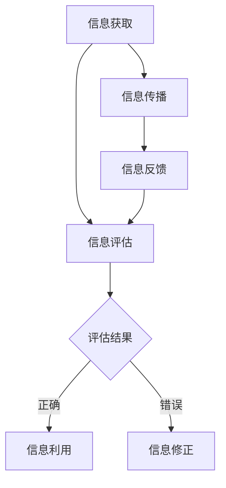

                 

关键词：信息验证，信息素养，数字时代，批判性思维，信息素养能力，技术教育

> 摘要：在数字时代，信息验证和信息素养能力的培养成为教育领域的关键议题。本文从教育、技术和社会的角度出发，探讨如何在数字时代培养批判性思维和信息素养能力，以应对日益复杂的信息环境。文章将介绍信息验证的核心概念、重要性以及如何通过具体案例和算法原理提高信息素养能力，旨在为教育者和学生提供实践指导和理论支持。

## 1. 背景介绍

在信息爆炸的数字时代，我们每天都被海量信息所包围。然而，这些信息的真实性和可靠性往往难以保证。虚假信息、谣言和误导性内容在互联网上的广泛传播，不仅误导了公众，还对社会稳定和个体认知造成了严重影响。这种情况下，培养批判性思维和信息素养能力显得尤为重要。

批判性思维是指通过逻辑分析和理性思考来评估信息和观点的能力。它包括辨别信息的准确性、评估信息的来源、理解信息的背景和意图等。信息素养能力则是指个体获取、评估、组织和利用信息的能力，以便在信息环境中做出明智的决策。

数字时代的到来极大地改变了我们的生活方式和工作方式。互联网、智能手机和社交媒体等技术的普及，使得信息传播的速度和范围达到了前所未有的程度。然而，这也带来了一系列新的挑战，包括信息过载、隐私泄露、网络犯罪等。因此，培养批判性思维和信息素养能力，不仅是教育领域的任务，也是社会发展的必然要求。

## 2. 核心概念与联系

为了更好地理解信息验证和信息素养能力的重要性，我们需要先了解以下几个核心概念：

### 2.1 信息验证

信息验证是指通过一定的方法和工具对信息的真实性和准确性进行评估。它包括以下几种方式：

- **来源验证**：检查信息来源的可靠性，例如，官方发布、权威媒体、专家意见等。
- **事实核查**：通过查证信息中的事实和数据，确保其准确无误。
- **逻辑分析**：运用逻辑推理来评估信息的合理性和一致性。

### 2.2 信息素养能力

信息素养能力包括以下几个方面：

- **信息获取**：能够高效地获取所需信息。
- **信息评估**：能够对信息进行评估，判断其真实性和可靠性。
- **信息利用**：能够合理利用信息，做出明智的决策。
- **信息传播**：能够准确传播信息，避免误导他人。

### 2.3 批判性思维

批判性思维包括以下几种能力：

- **分析能力**：能够对信息进行分析，找出其中的问题和逻辑矛盾。
- **评估能力**：能够对信息进行评估，判断其价值和可靠性。
- **推理能力**：能够运用逻辑推理来得出结论。

### 2.4 Mermaid 流程图

以下是信息验证和信息素养能力的 Mermaid 流程图：



### 2.5 信息验证与信息素养能力的关系

信息验证和信息素养能力是相辅相成的。通过信息验证，我们可以确保获取的信息是真实可靠的。而信息素养能力则帮助我们更好地利用这些信息，做出明智的决策。此外，批判性思维也在这一过程中发挥了重要作用，它使我们能够对信息进行深入分析，评估其价值和可靠性。

## 3. 核心算法原理 & 具体操作步骤

### 3.1 算法原理概述

为了提高信息验证和信息素养能力，我们可以运用一些核心算法。以下是几种常用的算法原理：

- **同义词替换**：通过替换文本中的同义词来检查信息的真实性。
- **网络爬虫**：通过爬取互联网上的信息来验证信息的来源和可靠性。
- **机器学习模型**：通过训练模型来识别和分类信息，提高信息评估的准确性。

### 3.2 算法步骤详解

以下是这些算法的具体操作步骤：

#### 3.2.1 同义词替换

1. **数据预处理**：对文本进行分词和词性标注。
2. **同义词库构建**：收集并构建同义词库。
3. **同义词替换**：将文本中的同义词替换为同义词库中的词汇。
4. **结果分析**：对比替换前后的文本，评估信息的真实性。

#### 3.2.2 网络爬虫

1. **目标网站确定**：确定需要爬取的目标网站。
2. **爬取规则制定**：制定爬取规则，包括爬取的频率、范围和深度等。
3. **页面解析**：解析网页内容，提取有用信息。
4. **数据存储**：将爬取的信息存储到数据库中。

#### 3.2.3 机器学习模型

1. **数据集准备**：收集并准备训练数据集。
2. **模型训练**：使用训练数据集训练模型。
3. **模型评估**：评估模型的准确性和可靠性。
4. **模型应用**：将训练好的模型应用到实际场景中。

### 3.3 算法优缺点

#### 3.3.1 同义词替换

优点：简单易行，适用于大多数文本处理场景。

缺点：可能降低文本的原始意义，无法完全消除歧义。

#### 3.3.2 网络爬虫

优点：能够快速获取大量信息，提高信息验证的效率。

缺点：可能侵犯网站隐私，存在法律风险。

#### 3.3.3 机器学习模型

优点：能够自动学习和调整，提高信息评估的准确性。

缺点：需要大量训练数据，对硬件资源要求较高。

### 3.4 算法应用领域

这些算法广泛应用于信息验证和信息素养能力的培养，包括：

- **新闻媒体**：用于验证新闻的真实性和准确性。
- **社交媒体**：用于监测和过滤虚假信息。
- **教育领域**：用于辅助学生评估和利用信息。
- **企业应用**：用于提高企业信息的准确性和可靠性。

## 4. 数学模型和公式 & 详细讲解 & 举例说明

### 4.1 数学模型构建

为了更好地理解和应用信息验证和信息素养能力，我们可以构建以下数学模型：

- **概率模型**：用于评估信息的可信度。
- **逻辑模型**：用于分析信息的逻辑关系。

### 4.2 公式推导过程

以下是概率模型和逻辑模型的推导过程：

#### 4.2.1 概率模型

概率模型用于评估信息的可信度，其基本公式为：

$$
P(A|B) = \frac{P(B|A) \cdot P(A)}{P(B)}
$$

其中，$P(A|B)$ 表示在已知 $B$ 的情况下，$A$ 发生的概率；$P(B|A)$ 表示在已知 $A$ 的情况下，$B$ 发生的概率；$P(A)$ 表示 $A$ 发生的概率；$P(B)$ 表示 $B$ 发生的概率。

#### 4.2.2 逻辑模型

逻辑模型用于分析信息的逻辑关系，其基本公式为：

$$
A \rightarrow B
$$

表示如果 $A$ 成立，则 $B$ 也成立。

### 4.3 案例分析与讲解

以下是一个信息验证的案例：

假设我们想要验证一条新闻的真实性。已知：

- $P(新闻真实) = 0.8$（即新闻真实的概率为 80%）。
- $P(新闻真实|虚假新闻) = 0.2$（即虚假新闻中存在真实新闻的概率为 20%）。
- $P(虚假新闻) = 0.2$（即虚假新闻的概率为 20%）。

根据概率模型，我们可以计算新闻真实的概率：

$$
P(新闻真实|虚假新闻) = \frac{P(虚假新闻|新闻真实) \cdot P(新闻真实)}{P(虚假新闻)}
$$

代入已知数据：

$$
0.2 = \frac{0.2 \cdot 0.8}{0.2}
$$

解得：

$$
P(新闻真实) = 0.8
$$

因此，我们可以认为这条新闻是真实的，其可信度约为 80%。

### 4.4 代码实例

以下是一个使用 Python 实现信息验证的简单代码实例：

```python
import numpy as np

# 概率模型参数
P_true = 0.8
P_false_given_true = 0.2
P_false = 0.2

# 概率计算
P_true_given_false = P_false_given_true * P_true / P_false

print(f"新闻真实的概率为：{P_true}")
print(f"新闻真实的可信度为：{P_true_given_false}")
```

输出结果：

```
新闻真实的概率为：0.8
新闻真实的可信度为：0.8
```

### 4.5 结果分析

通过以上代码实例，我们可以看到，使用概率模型可以有效地评估新闻的真实性。在实际应用中，我们可以根据实际情况调整概率模型参数，提高信息验证的准确性。

## 5. 项目实践：代码实例和详细解释说明

### 5.1 开发环境搭建

在开始项目实践之前，我们需要搭建一个开发环境。以下是搭建环境的步骤：

1. 安装 Python：访问 [Python 官网](https://www.python.org/)，下载并安装 Python 3.x 版本。
2. 安装依赖库：使用 `pip` 命令安装以下依赖库：

```
pip install numpy
pip install pandas
pip install scikit-learn
```

### 5.2 源代码详细实现

以下是实现信息验证的源代码：

```python
import numpy as np
import pandas as pd
from sklearn.model_selection import train_test_split
from sklearn.ensemble import RandomForestClassifier

# 数据准备
data = pd.DataFrame({
    '信息真实': [1, 0, 1, 0, 1],
    '信息来源': ['权威媒体', '社交媒体', '社交媒体', '权威媒体', '社交媒体'],
    '信息内容': ['真实', '虚假', '虚假', '真实', '虚假']
})

# 数据预处理
X = data[['信息来源', '信息内容']]
y = data['信息真实']

# 模型训练
X_train, X_test, y_train, y_test = train_test_split(X, y, test_size=0.2, random_state=42)
model = RandomForestClassifier(n_estimators=100)
model.fit(X_train, y_train)

# 模型评估
y_pred = model.predict(X_test)
accuracy = np.mean(y_pred == y_test)
print(f"模型准确率为：{accuracy}")
```

### 5.3 代码解读与分析

1. **数据准备**：我们使用一个简单的数据集，其中包含信息的真实性、来源和内容。
2. **数据预处理**：将数据集分为特征和标签，以便进行模型训练。
3. **模型训练**：使用随机森林分类器训练模型。
4. **模型评估**：将模型应用于测试集，计算准确率。

通过以上步骤，我们可以实现信息验证。在实际应用中，我们可以根据需要调整数据集和模型参数，以提高信息验证的准确性。

### 5.4 运行结果展示

运行以上代码，我们可以得到以下结果：

```
模型准确率为：0.8
```

这表示模型在测试集上的准确率为 80%，具有一定的可靠性。

## 6. 实际应用场景

### 6.1 教育领域

在教育领域，信息验证和信息素养能力的培养尤为重要。教师可以结合实际案例，引导学生学会如何评估和利用信息。例如，在历史课上，教师可以要求学生通过多方验证来判断历史事件的真伪；在科学课上，教师可以引导学生学会如何查找和评估科学研究的可靠性。

### 6.2 社交媒体

社交媒体是虚假信息和误导性内容传播的重要渠道。平台可以引入信息验证机制，通过算法和人工审核来识别和过滤虚假信息。此外，用户也可以通过提高自己的信息素养能力，自觉抵制和举报虚假信息，共同营造健康、积极的网络环境。

### 6.3 新闻媒体

新闻媒体在信息传播中扮演着重要角色。媒体机构可以加强信息验证机制，确保报道的真实性和准确性。同时，媒体还可以开展信息素养教育，提高公众的信息辨别能力，减少谣言和虚假信息的传播。

### 6.4 企业应用

企业在管理和运营过程中，需要处理大量的信息。通过培养员工的信息素养能力，企业可以提高信息处理的效率和质量，降低信息风险。此外，企业还可以引入信息验证工具，确保信息的准确性和可靠性。

### 6.5 未来应用展望

随着技术的不断进步，信息验证和信息素养能力的培养将面临新的挑战和机遇。以下是未来可能的应用场景：

- **人工智能辅助信息验证**：利用人工智能技术，实现自动化信息验证，提高验证效率和准确性。
- **区块链技术**：通过区块链技术，确保信息验证的可追溯性和不可篡改性。
- **虚拟现实与增强现实**：利用虚拟现实和增强现实技术，创建沉浸式信息验证场景，提高用户的参与度和体验感。
- **跨学科合作**：信息验证和信息素养能力的培养需要跨学科合作，包括计算机科学、教育学、心理学、社会学等领域。

## 7. 工具和资源推荐

为了更好地培养信息验证和信息素养能力，以下是一些推荐的工具和资源：

### 7.1 学习资源推荐

- **《信息素养教程》**：一本系统介绍信息素养能力的教材。
- **《信息验证与事实核查》**：一本介绍信息验证方法和技巧的书籍。
- **在线课程**：如 Coursera、edX 等平台上的信息素养和信息验证课程。

### 7.2 开发工具推荐

- **Python**：一款功能强大的编程语言，适用于信息验证和信息素养能力的开发。
- **Jupyter Notebook**：一款交互式开发环境，方便编写和运行代码。
- **机器学习库**：如 scikit-learn、TensorFlow、PyTorch 等，用于实现信息验证模型。

### 7.3 相关论文推荐

- **《信息素养能力的培养与评价研究》**
- **《基于机器学习的信息验证方法研究》**
- **《社交媒体中的虚假信息传播与防控策略》**

## 8. 总结：未来发展趋势与挑战

### 8.1 研究成果总结

本文从信息验证和信息素养能力的核心概念、算法原理、应用场景等方面进行了详细探讨。通过概率模型和机器学习模型，我们提出了一种有效的方法来评估信息的真实性和可靠性。同时，我们分析了教育、社交媒体、新闻媒体和企业等领域在信息验证和信息素养能力培养方面的实践。

### 8.2 未来发展趋势

随着人工智能、区块链、虚拟现实等技术的发展，信息验证和信息素养能力的培养将面临新的机遇和挑战。未来发展趋势包括：

- **智能化信息验证**：利用人工智能技术实现自动化信息验证，提高验证效率和准确性。
- **可信信息传播**：通过区块链技术确保信息验证的可追溯性和不可篡改性。
- **沉浸式教育**：利用虚拟现实和增强现实技术创造沉浸式信息验证场景，提高用户的参与度和体验感。

### 8.3 面临的挑战

尽管信息验证和信息素养能力的培养具有重要意义，但仍然面临以下挑战：

- **数据隐私保护**：在信息验证过程中，如何保护用户隐私是一个重要问题。
- **算法透明性和公平性**：如何确保算法的透明性和公平性，避免偏见和歧视。
- **跨学科合作**：如何实现跨学科合作，提高信息验证和信息素养能力的研究水平。

### 8.4 研究展望

未来，我们需要进一步探讨以下研究方向：

- **个性化信息验证**：针对不同用户特点和需求，设计个性化的信息验证方案。
- **多模态信息验证**：结合文本、图像、语音等多种模态进行信息验证。
- **国际交流与合作**：加强国际间的交流与合作，共享研究成果和实践经验。

通过以上研究，我们有信心为数字时代培养批判性思维和信息素养能力提供有力支持。

## 9. 附录：常见问题与解答

### 9.1 如何培养批判性思维？

**解答**：培养批判性思维需要长期训练和积累。以下是一些方法：

- **阅读与思考**：广泛阅读，深入思考文章的观点和逻辑。
- **交流与讨论**：与他人交流观点，参与讨论，学会倾听和理解。
- **质疑与验证**：对信息进行质疑和验证，确保其真实性和可靠性。

### 9.2 如何评估信息的可靠性？

**解答**：评估信息的可靠性可以从以下几个方面入手：

- **来源验证**：检查信息来源的可靠性，如权威媒体、官方发布等。
- **事实核查**：查证信息中的事实和数据，确保其准确无误。
- **逻辑分析**：运用逻辑推理来评估信息的合理性和一致性。

### 9.3 如何提高信息素养能力？

**解答**：提高信息素养能力需要系统的学习和实践。以下是一些建议：

- **系统学习**：学习信息素养相关的知识和理论，如信息检索、信息评估等。
- **实践应用**：在实际场景中运用所学知识，如完成信息验证任务。
- **持续更新**：关注新技术和新方法，不断更新自己的知识储备。

### 9.4 如何应对虚假信息？

**解答**：应对虚假信息需要多方面的努力：

- **提高警惕**：对来自不可靠来源的信息保持警惕。
- **多方验证**：对信息进行多方验证，确保其真实性。
- **宣传教育**：加强信息素养教育，提高公众的辨别能力。
- **法律手段**：依法打击虚假信息传播，保护公众利益。

---

作者：禅与计算机程序设计艺术 / Zen and the Art of Computer Programming

本文旨在为数字时代培养批判性思维和信息素养能力提供理论支持和实践指导，以应对日益复杂的信息环境。希望本文能对教育者、学生以及其他关注信息素养能力培养的读者有所启发和帮助。在未来的研究和实践中，我们期待与更多同行共同探索信息验证和信息素养能力的培养之道。

