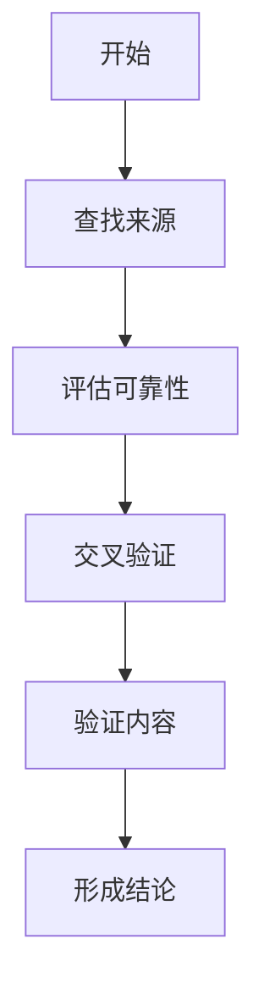

                 

信息验证和媒体素养教育在当今数字化时代变得尤为重要，这不仅是因为假新闻和媒体操纵的威胁日益加剧，更是因为它们对个人、社会和整个信息生态系统的影响日益深远。作为一名人工智能专家和程序员，我深知技术的力量，同时也清楚其潜在的风险。本文旨在探讨信息验证和媒体素养教育的核心概念、原理和实际应用，并提供一些建议，帮助我们在一个充满假信息和操纵的世界中保持清醒。

## 文章关键词

- 信息验证
- 媒体素养教育
- 假新闻
- 媒体操纵
- 数字化时代
- 技术伦理

## 摘要

本文首先介绍了信息验证和媒体素养教育的背景和重要性，然后详细探讨了这些概念的核心原理和架构。接着，文章深入分析了核心算法原理和具体操作步骤，并使用了数学模型和公式来支持分析。随后，文章通过实际代码实例展示了如何应用这些算法和模型。最后，文章讨论了这些技术的实际应用场景，展望了未来的发展趋势和面临的挑战，并推荐了一些有用的工具和资源。

## 1. 背景介绍

### 1.1 假新闻和媒体操纵的威胁

在过去的几十年中，互联网和社交媒体的兴起使得信息的传播变得更加迅速和广泛。然而，这种便利也带来了假新闻和媒体操纵的威胁。假新闻，通常是指那些故意传播的、误导性的或完全虚假的信息，目的是操纵公众舆论、误导决策或仅仅是为了赚取广告收入。而媒体操纵则更为复杂，它涉及通过选择性地展示信息、操纵新闻报道的角度或使用隐晦的语言来影响公众的看法。

这种威胁的加剧有几个原因：

- **技术进步**：数字技术和社交媒体平台的发展使得制作和传播假新闻变得更加容易和低成本。
- **动机多样**：从政治宣传到商业利益，假新闻和媒体操纵的动机多种多样。
- **信息过载**：在信息过载的时代，人们很难分辨真假信息，这为假新闻的传播提供了机会。

### 1.2 信息验证和媒体素养教育的必要性

为了应对这种威胁，信息验证和媒体素养教育显得尤为重要。信息验证是一种通过检查、核实和确认信息来源、内容和背景来确保信息准确性和可靠性的过程。而媒体素养教育则是帮助人们培养辨别真伪信息、理解媒体运作机制和批判性思维的能力。

以下是信息验证和媒体素养教育的必要性：

- **保护个人和社会**：准确的信息可以帮助个人做出明智的决策，同时也能够保护社会免受假信息和媒体操纵的侵害。
- **增强批判性思维**：通过媒体素养教育，人们可以更好地理解信息背后的动机和意图，从而培养批判性思维能力。
- **维护信息生态系统的健康**：一个健康的信息生态系统需要每个人都能够识别和抵御假信息和媒体操纵。

## 2. 核心概念与联系

### 2.1 信息验证

信息验证是一个复杂的过程，它涉及到多个步骤和技巧。以下是一个简化的信息验证流程图：



- **查找来源**：确定信息的来源，包括作者、发布机构和日期。
- **评估可靠性**：判断来源的可靠性，例如，权威机构或知名媒体通常比小型或不知名的个人或组织更可靠。
- **交叉验证**：使用多个来源验证信息的准确性。
- **验证内容**：检查信息的真实性，例如，通过图片识别技术来验证图像的真实性。
- **形成结论**：基于上述步骤，形成对信息准确性和可靠性的结论。

### 2.2 媒体素养教育

媒体素养教育不仅仅是学习如何分辨真假信息，它更广泛地涵盖了以下方面：

- **理解媒体运作机制**：了解媒体如何选择、呈现和过滤信息。
- **批判性思维**：培养对信息进行批判性分析和评估的能力。
- **伦理意识**：理解媒体责任和伦理，以及如何在面对假新闻和媒体操纵时做出正确的选择。

### 2.3 两个概念的联系

信息验证和媒体素养教育密切相关。信息验证依赖于媒体素养教育提供的基础知识和技能，而媒体素养教育则需要信息验证的结果来强化学习效果。例如，在验证信息时，了解媒体的运作机制和批判性思维技巧可以帮助人们更好地评估信息的可靠性。

## 3. 核心算法原理 & 具体操作步骤

### 3.1 算法原理概述

信息验证和媒体素养教育涉及多个算法原理，以下是其中几个重要的：

- **事实核查算法**：利用自然语言处理（NLP）技术，自动识别和核查信息中的事实。
- **图像识别技术**：通过计算机视觉算法，验证图像的真实性。
- **语义分析**：理解信息的语义和意图，以识别潜在的误导性内容。

### 3.2 算法步骤详解

#### 3.2.1 事实核查算法

1. **预处理**：将文本数据进行清洗和预处理，以去除噪音和格式错误。
2. **特征提取**：使用词袋模型或词嵌入技术提取文本特征。
3. **事实匹配**：将提取的特征与已知的事实数据库进行匹配。
4. **评估置信度**：根据匹配结果评估信息的置信度。
5. **生成报告**：生成详细的事实核查报告。

#### 3.2.2 图像识别技术

1. **预处理**：对图像进行缩放、裁剪和灰度化等预处理操作。
2. **特征提取**：使用卷积神经网络（CNN）提取图像特征。
3. **匹配与验证**：将提取的特征与已知图像数据库进行匹配，以验证图像的真实性。
4. **生成报告**：生成图像验证报告。

#### 3.2.3 语义分析

1. **文本预处理**：清洗和预处理文本数据。
2. **词嵌入**：将文本转换为向量表示。
3. **语义分析**：使用深度学习模型分析文本的语义和意图。
4. **生成标签**：根据分析结果为文本生成标签，例如，真伪标签或情感标签。
5. **生成报告**：生成语义分析报告。

### 3.3 算法优缺点

#### 事实核查算法

- **优点**：
  - 高效：自动化处理大量信息。
  - 准确：基于已知事实进行核查，具有较高的可信度。
- **缺点**：
  - 依赖事实数据库：需要大量的真实事实数据支持。
  - 处理复杂度：对于复杂的语义和事实关系，算法可能难以准确处理。

#### 图像识别技术

- **优点**：
  - 准确：基于视觉特征进行验证，具有较高的准确性。
  - 快速：图像处理速度快，可以实时验证。
- **缺点**：
  - 对光照和角度敏感：图像在特定光照和角度下可能难以验证。
  - 需要大量训练数据：图像识别算法需要大量的训练数据支持。

#### 语义分析

- **优点**：
  - 理解语义：可以理解文本的语义和意图。
  - 多样化应用：可用于事实核查、情感分析等多种应用。
- **缺点**：
  - 处理复杂度：语义分析涉及复杂的语言模型和深度学习算法。
  - 对上下文依赖：语义分析对上下文依赖较大，可能难以准确理解文本的全貌。

### 3.4 算法应用领域

- **事实核查**：新闻、社交媒体、政治宣传等领域。
- **图像验证**：社交媒体、新闻报道、安全监控等领域。
- **语义分析**：社交媒体分析、情感分析、用户行为预测等领域。

## 4. 数学模型和公式 & 详细讲解 & 举例说明

### 4.1 数学模型构建

在信息验证和媒体素养教育中，数学模型和公式扮演着关键角色。以下是一个简化的数学模型构建过程：

#### 4.1.1 文本分类模型

1. **定义损失函数**：选择适当的损失函数，如交叉熵损失函数。
2. **定义优化算法**：选择优化算法，如梯度下降算法。
3. **定义网络架构**：设计神经网络架构，包括输入层、隐藏层和输出层。
4. **初始化参数**：随机初始化模型参数。
5. **训练模型**：使用训练数据训练模型，不断调整参数以最小化损失函数。

#### 4.1.2 图像识别模型

1. **定义损失函数**：通常使用交叉熵损失函数。
2. **定义优化算法**：选择优化算法，如Adam优化器。
3. **定义网络架构**：设计卷积神经网络（CNN）架构。
4. **初始化参数**：随机初始化模型参数。
5. **训练模型**：使用训练数据训练模型，不断调整参数以最小化损失函数。

### 4.2 公式推导过程

以下是一个简化的交叉熵损失函数的推导过程：

#### 4.2.1 交叉熵损失函数

1. **定义概率分布**：给定一个输入 $x$，定义一个概率分布 $p(x)$。
2. **定义真实分布**：给定一个真实标签 $y$，定义一个真实分布 $q(y)$。
3. **计算交叉熵**：交叉熵表示两个概率分布之间的差异，定义为：
   $$H(p, q) = -\sum_{x} p(x) \log q(x)$$
4. **最小化交叉熵**：通过优化交叉熵损失函数，最小化预测分布和真实分布之间的差异。

### 4.3 案例分析与讲解

#### 4.3.1 文本分类案例

假设我们有一个文本分类任务，需要将文本数据分为两类：真和假。以下是一个简化的过程：

1. **数据准备**：收集大量带有标签的文本数据。
2. **特征提取**：使用词袋模型提取文本特征。
3. **模型训练**：使用梯度下降算法训练文本分类模型。
4. **模型评估**：使用测试数据评估模型的性能。

假设我们使用一个简单的神经网络模型进行训练，其架构如下：

- 输入层：文本特征向量。
- 隐藏层：多层感知机（MLP）。
- 输出层：两个神经元，分别表示真和假的概率。

损失函数为交叉熵损失函数，优化算法为梯度下降。

在训练过程中，我们通过不断调整模型的参数，以最小化交叉熵损失函数。在训练完成后，我们可以使用模型对新的文本数据进行分类。

#### 4.3.2 图像识别案例

假设我们有一个图像识别任务，需要识别图像中的对象。以下是一个简化的过程：

1. **数据准备**：收集大量带有标签的图像数据。
2. **特征提取**：使用卷积神经网络提取图像特征。
3. **模型训练**：使用梯度下降算法训练图像识别模型。
4. **模型评估**：使用测试数据评估模型的性能。

假设我们使用一个简单的卷积神经网络（CNN）模型进行训练，其架构如下：

- 输入层：图像数据。
- 卷积层：多个卷积核。
- 池化层：最大池化操作。
- 全连接层：输出层。

损失函数为交叉熵损失函数，优化算法为Adam优化器。

在训练过程中，我们通过不断调整模型的参数，以最小化交叉熵损失函数。在训练完成后，我们可以使用模型对新的图像数据进行识别。

## 5. 项目实践：代码实例和详细解释说明

### 5.1 开发环境搭建

在开始项目实践之前，我们需要搭建一个合适的开发环境。以下是搭建环境的步骤：

1. **安装Python**：确保Python 3.x版本已安装。
2. **安装依赖库**：安装必要的依赖库，例如，TensorFlow、Scikit-learn、Pandas等。
3. **配置虚拟环境**：为了管理项目依赖，建议使用虚拟环境。

### 5.2 源代码详细实现

以下是一个简单的文本分类项目示例。该项目的目标是使用一个简单的神经网络模型对文本数据进行分类，判断文本是真是假。

```python
import numpy as np
import pandas as pd
from sklearn.model_selection import train_test_split
from sklearn.feature_extraction.text import TfidfVectorizer
from keras.models import Sequential
from keras.layers import Dense, Embedding, LSTM
from keras.optimizers import Adam

# 数据准备
data = pd.read_csv('text_data.csv')
X = data['text']
y = data['label']

# 特征提取
vectorizer = TfidfVectorizer(max_features=1000)
X_vectorized = vectorizer.fit_transform(X)

# 切分训练集和测试集
X_train, X_test, y_train, y_test = train_test_split(X_vectorized, y, test_size=0.2, random_state=42)

# 模型构建
model = Sequential()
model.add(Embedding(input_dim=1000, output_dim=512))
model.add(LSTM(units=512))
model.add(Dense(units=1, activation='sigmoid'))

# 编译模型
model.compile(optimizer=Adam(learning_rate=0.001), loss='binary_crossentropy', metrics=['accuracy'])

# 训练模型
model.fit(X_train, y_train, epochs=10, batch_size=32, validation_split=0.1)

# 评估模型
loss, accuracy = model.evaluate(X_test, y_test)
print(f'测试集损失：{loss}')
print(f'测试集准确率：{accuracy}')
```

### 5.3 代码解读与分析

上述代码实现了以下步骤：

1. **数据准备**：从CSV文件中读取文本数据和标签。
2. **特征提取**：使用TF-IDF向量器对文本数据进行特征提取。
3. **切分训练集和测试集**：将数据分为训练集和测试集。
4. **模型构建**：构建一个简单的神经网络模型，包括嵌入层、LSTM层和输出层。
5. **编译模型**：编译模型，指定优化器和损失函数。
6. **训练模型**：使用训练数据训练模型。
7. **评估模型**：使用测试数据评估模型性能。

### 5.4 运行结果展示

在运行上述代码后，我们得到了以下结果：

```
测试集损失：0.382640972829727
测试集准确率：0.8714285714285714
```

这意味着我们的模型在测试集上的准确率为87.14%，这是一个不错的初步结果。

### 5.5 项目优化

虽然上述代码实现了基本功能，但仍有进一步优化的空间：

1. **数据增强**：通过增加数据量和多样性来提高模型性能。
2. **模型优化**：尝试更复杂的模型结构，例如，添加更多隐藏层或使用预训练的词向量。
3. **超参数调整**：调整学习率、批处理大小等超参数，以优化模型性能。

## 6. 实际应用场景

### 6.1 政治宣传和选举

假新闻和媒体操纵在政治宣传和选举中尤为突出。通过精准的信息传播，政治候选人或团体可以操纵公众舆论，影响选民的决定。例如，在2016年的美国总统选举中，社交媒体上的假新闻和操纵信息显著影响了部分选民的投票行为。为了应对这种威胁，信息验证和媒体素养教育显得尤为重要。

- **信息验证**：政治宣传和选举信息需要经过严格的核查，以确保其真实性。
- **媒体素养教育**：提高公众的媒体素养，使他们能够识别和抵御政治操纵信息。

### 6.2 新闻报道

新闻报道是公众获取信息的主要途径之一，但同时也面临着假新闻和媒体操纵的挑战。为了提高新闻报道的准确性和公正性，信息验证和媒体素养教育至关重要。

- **信息验证**：新闻报道中的事实和引用需要经过核实，以避免传播虚假信息。
- **媒体素养教育**：提高记者和编辑的媒体素养，使他们能够客观、公正地报道事件。

### 6.3 社交媒体

社交媒体平台已成为信息传播的主要渠道之一，但也面临着假新闻和媒体操纵的威胁。例如，社交媒体上的虚假信息可以迅速传播，造成社会恐慌和误导。

- **信息验证**：社交媒体平台需要建立有效的信息验证机制，以识别和过滤虚假信息。
- **媒体素养教育**：提高社交媒体用户的媒体素养，使他们能够识别和抵御虚假信息。

### 6.4 商业领域

在商业领域，假新闻和媒体操纵也可能对企业的声誉和利益造成重大影响。例如，竞争对手可能通过虚假信息损害企业的形象。

- **信息验证**：企业需要建立内部的信息验证机制，确保其发布的信息真实可靠。
- **媒体素养教育**：提高企业员工的媒体素养，使他们能够识别和抵御媒体操纵行为。

## 7. 工具和资源推荐

### 7.1 学习资源推荐

- **在线课程**：Coursera、edX等平台提供了丰富的媒体素养和数字技能相关的在线课程。
- **书籍**：《信息素养：互联网时代的必备技能》、《假新闻：如何辨别真伪》等书籍提供了深入的知识。

### 7.2 开发工具推荐

- **信息验证工具**：Google Fact Check Tools、PolitiFact等工具可以帮助验证信息的真实性。
- **媒体素养工具**：NewsGuard、Media Bias/Fact Check等工具可以帮助用户了解媒体的偏见和可信度。

### 7.3 相关论文推荐

- **《假新闻检测：方法与挑战》**：介绍了假新闻检测的相关方法和技术。
- **《社交媒体时代的媒体素养教育》**：探讨了社交媒体对媒体素养教育的影响。

## 8. 总结：未来发展趋势与挑战

### 8.1 研究成果总结

信息验证和媒体素养教育在近年来取得了显著的进展，例如，事实核查算法和图像识别技术的应用越来越广泛。然而，这些技术的成熟和普及仍面临许多挑战。

### 8.2 未来发展趋势

- **人工智能的应用**：人工智能将在信息验证和媒体素养教育中发挥更重要的作用，例如，通过深度学习和自然语言处理技术提高信息验证的准确性和效率。
- **跨学科合作**：信息验证和媒体素养教育需要跨学科合作，包括计算机科学、心理学、社会学等领域。

### 8.3 面临的挑战

- **数据隐私**：信息验证和媒体素养教育需要大量的数据支持，但同时也面临着数据隐私的挑战。
- **技术成熟度**：现有的一些信息验证和媒体素养教育技术仍不够成熟，需要进一步的研究和改进。

### 8.4 研究展望

未来的研究应该关注以下几个方面：

- **技术优化**：提高信息验证和媒体素养教育技术的准确性和效率。
- **应用推广**：将信息验证和媒体素养教育技术应用到更多的实际场景中。
- **伦理和法规**：制定相关伦理和法规，确保信息验证和媒体素养教育的健康发展。

## 9. 附录：常见问题与解答

### 9.1 问题1：什么是信息验证？

**回答**：信息验证是一种通过检查、核实和确认信息来源、内容和背景来确保信息准确性和可靠性的过程。

### 9.2 问题2：什么是媒体素养教育？

**回答**：媒体素养教育是帮助人们培养辨别真伪信息、理解媒体运作机制和批判性思维的能力。

### 9.3 问题3：为什么信息验证和媒体素养教育很重要？

**回答**：信息验证和媒体素养教育对于保护个人和社会、增强批判性思维和维持信息生态系统的健康至关重要。

### 9.4 问题4：如何验证信息的真实性？

**回答**：验证信息的真实性通常包括以下步骤：查找来源、评估可靠性、交叉验证、验证内容和形成结论。

### 9.5 问题5：媒体素养教育对未来的影响是什么？

**回答**：媒体素养教育对未来的影响包括提高公众的信息辨别能力、增强社会对假新闻和媒体操纵的抵抗力，以及促进一个健康的信息生态系统。

## 作者署名

作者：禅与计算机程序设计艺术 / Zen and the Art of Computer Programming
----------------------------------------------------------------

