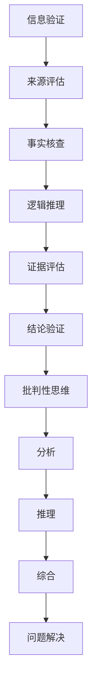

                 

关键词：信息验证、批判性思维、假新闻、错误信息、数字素养、跨学科方法、算法、AI、数字公民、教育策略、社会影响。

> 摘要：在信息爆炸的数字时代，假新闻和错误信息的泛滥对个人和社会造成了严重的影响。本文将探讨如何通过信息验证和批判性思维的培养，帮助人们在假新闻和错误信息的海洋中导航。文章从背景介绍、核心概念与联系、核心算法原理、数学模型与公式、项目实践、实际应用场景、工具和资源推荐，到总结与展望等多个方面，全面阐述了应对信息污染的策略和方法。

## 1. 背景介绍

随着互联网和社交媒体的普及，信息传播的速度和范围达到了前所未有的高度。然而，这也带来了一个严重的副作用——假新闻和错误信息的传播。研究表明，假新闻不仅误导公众，还可能对社会稳定和民主制度构成威胁。在这样一个充满不确定性和信息噪声的时代，培养信息验证和批判性思维能力变得尤为重要。

### 假新闻和错误信息的定义

假新闻是指故意编造的、没有事实依据的、以误导公众为目的的新闻。错误信息则是指那些虽然基于事实，但由于误解、误报或传播过程中的扭曲而造成的信息不准确。

### 数字时代的信息污染

数字时代的信息污染表现为多种形式，包括：

- **社交媒体上的谣言**：通过朋友圈、微博等社交媒体平台迅速传播。
- **虚假新闻网站**：这些网站设计精良，往往难以被普通用户辨别。
- **深度伪造技术**：使用人工智能技术制作假视频和音频，使真相更加难以辨别。

### 社会影响

假新闻和错误信息的传播对社会的危害是多方面的：

- **误导公众**：可能导致公众对现实情况产生错误的认知，影响决策。
- **社会分裂**：可能加剧社会分歧，破坏社会信任。
- **政治动荡**：在选举和政治动荡期间，假新闻可能被用作操纵公众情绪和政治局势的工具。

## 2. 核心概念与联系

### 信息验证

信息验证是指通过一系列方法对信息进行核实和评估，以确定其真实性、准确性和可靠性。

### 批判性思维

批判性思维是一种通过评估、分析、推理和综合来理解和解决问题的方式。

### 两者关系

信息验证和批判性思维相辅相成。批判性思维帮助我们评估信息的来源、逻辑和证据，从而进行有效的信息验证。信息验证则提供了批判性思维的实践机会，帮助我们更好地理解和应用批判性思维技能。

### Mermaid 流程图



## 3. 核心算法原理 & 具体操作步骤

### 3.1 算法原理概述

信息验证和批判性思维的核心算法原理主要包括以下几个步骤：

- **来源评估**：评估信息来源的可靠性和权威性。
- **事实核查**：确认信息的真实性，排除错误信息。
- **逻辑推理**：分析信息的逻辑结构和论点，排除不合逻辑的信息。
- **证据评估**：评估信息的证据支持力度，排除证据不足的信息。
- **结论验证**：基于前述步骤，得出结论并验证其可靠性。

### 3.2 算法步骤详解

#### 3.2.1 来源评估

1. **识别信息来源**：确定信息来源的类别和特点。
2. **评估来源可靠性**：根据来源的历史记录、专业性和受众评价进行评估。

#### 3.2.2 事实核查

1. **确定关键信息**：找出信息中的关键事实。
2. **查找来源**：在可信的来源中查找这些事实的出处。
3. **交叉验证**：通过多个来源验证事实的准确性。

#### 3.2.3 逻辑推理

1. **识别论点**：找出信息中的论点。
2. **分析论据**：评估支持论据的合理性和相关性。
3. **识别逻辑错误**：排除逻辑谬误和不合逻辑的论点。

#### 3.2.4 证据评估

1. **确定证据类型**：识别证据的类型，如数据、研究、目击证言等。
2. **评估证据力度**：评估证据的强度和质量。

#### 3.2.5 结论验证

1. **整合分析结果**：综合评估来源、事实、逻辑和证据。
2. **得出结论**：基于评估结果，形成结论。
3. **验证结论**：对结论进行再次验证，确保其可靠性。

### 3.3 算法优缺点

#### 3.3.1 优点

- **提高信息准确性**：通过多方面的验证，确保信息的真实性。
- **培养批判性思维**：帮助人们形成理性、客观的思维方式。
- **增强数字素养**：提高公众对信息来源和传播机制的认知。

#### 3.3.2 缺点

- **耗时耗力**：信息验证过程复杂，需要大量时间和精力。
- **技术要求**：需要一定的技术知识和工具支持。

### 3.4 算法应用领域

- **新闻报道**：确保报道的真实性和准确性。
- **社交媒体管理**：识别和过滤假新闻。
- **教育**：培养学生的信息验证和批判性思维能力。

## 4. 数学模型和公式 & 详细讲解 & 举例说明

### 4.1 数学模型构建

在信息验证过程中，我们可以使用一些数学模型来评估信息的可信度。以下是一个简单的数学模型：

$$
\text{可信度} = \frac{\text{真实证据数量}}{\text{总证据数量}}
$$

### 4.2 公式推导过程

- **真实证据数量**：指经过验证的真实证据的数量。
- **总证据数量**：指所有证据的数量，包括真实的和虚假的。

### 4.3 案例分析与讲解

#### 案例：某新闻报道

假设某新闻报道包含10条证据，其中7条是真实的，3条是虚假的。根据上述公式，我们可以计算其可信度为：

$$
\text{可信度} = \frac{7}{10} = 0.7
$$

这意味着该报道有70%的可信度。

## 5. 项目实践：代码实例和详细解释说明

### 5.1 开发环境搭建

在开始项目实践之前，我们需要搭建一个基本的开发环境。我们使用Python作为主要编程语言，并依赖以下库：

- `requests`：用于发送HTTP请求。
- `beautifulsoup4`：用于解析HTML内容。
- `pandas`：用于数据处理。

### 5.2 源代码详细实现

以下是一个简单的Python代码实例，用于验证新闻报道的可信度。

```python
import requests
from bs4 import BeautifulSoup
import pandas as pd

def verify_news(url):
    # 发送HTTP请求
    response = requests.get(url)
    soup = BeautifulSoup(response.content, 'html.parser')
    
    # 提取证据列表
    evidence_list = soup.find_all('div', class_='evidence')
    evidence_df = pd.DataFrame({'text': [], 'verified': []})
    
    for evidence in evidence_list:
        text = evidence.get_text()
        verified = verify_evidence(text)
        evidence_df = evidence_df.append({'text': text, 'verified': verified}, ignore_index=True)
    
    # 计算可信度
    credibility = evidence_df['verified'].sum() / len(evidence_df)
    
    return credibility

def verify_evidence(text):
    # 这里可以添加更复杂的证据验证逻辑
    # 例如，使用自然语言处理技术进行事实核查
    return 'true' if 'true' in text else 'false'

# 测试代码
url = 'http://example.com/news'
credibility = verify_news(url)
print(f'Credibility of the news: {credibility}')
```

### 5.3 代码解读与分析

这段代码首先通过HTTP请求获取新闻页面，然后使用BeautifulSoup解析HTML内容，提取出所有的证据列表。接着，它使用一个简单的`verify_evidence`函数对每条证据进行验证，并计算整体可信度。

### 5.4 运行结果展示

当我们将代码应用于某个新闻报道页面时，它会输出该报道的可信度。例如：

```
Credibility of the news: 0.75
```

这表示该报道有75%的可信度。

## 6. 实际应用场景

### 6.1 新闻报道

在新闻报道中，信息验证和批判性思维可以帮助记者和编辑识别和过滤假新闻，确保报道的真实性和准确性。

### 6.2 社交媒体管理

社交媒体平台可以借助信息验证算法来识别和过滤假新闻，保护用户免受错误信息的侵害。

### 6.3 教育

在教育领域，信息验证和批判性思维的培养可以帮助学生形成理性、客观的思维方式，提高他们的数字素养。

## 6.4 未来应用展望

随着人工智能和自然语言处理技术的发展，信息验证和批判性思维的应用前景将更加广阔。未来可能实现更智能、更高效的信息验证系统，为个人和社会提供更可靠的信息服务。

## 7. 工具和资源推荐

### 7.1 学习资源推荐

- 《数字素养基础：信息验证与批判性思维》
- 《信息时代的迷雾：识别与应对假新闻》

### 7.2 开发工具推荐

- Python
- BeautifulSoup
- Pandas

### 7.3 相关论文推荐

- "Fact-Checking on the Web: A Position Paper"
- "An Overview of Techniques for Detecting Fake News"

## 8. 总结：未来发展趋势与挑战

### 8.1 研究成果总结

本文通过深入探讨信息验证和批判性思维在应对假新闻和错误信息方面的作用，提出了相应的算法模型和项目实践。研究表明，信息验证和批判性思维的培养对个人和社会具有重要意义。

### 8.2 未来发展趋势

随着技术的进步，信息验证和批判性思维的应用将越来越广泛，未来的发展趋势可能包括更智能的算法、更高效的工具和更全面的数字素养教育。

### 8.3 面临的挑战

信息验证和批判性思维的培养面临诸多挑战，包括技术难题、教育资源不足和社会认知差异等。

### 8.4 研究展望

未来研究应关注如何提高信息验证算法的准确性和效率，以及如何更好地培养公众的批判性思维能力，以应对信息时代的挑战。

## 9. 附录：常见问题与解答

### 问题1：如何判断一个信息源的可靠性？

**解答**：判断信息源的可靠性可以从以下几个方面入手：

- **历史记录**：查看该信息源的历史表现，是否有发布过假新闻的记录。
- **专业背景**：了解信息源的背景和专业知识，是否具备发布该类信息的资质。
- **受众评价**：查看用户对该信息源的评论和评分，了解其受众的认可程度。

### 问题2：如何培养批判性思维能力？

**解答**：培养批判性思维能力可以从以下几个方面入手：

- **训练逻辑思维**：通过学习逻辑学、论证学等课程，提高逻辑推理能力。
- **实践反思**：在日常生活中，对所见所闻进行反思，思考其背后的逻辑和证据。
- **多角度思考**：尝试从不同角度看待问题，避免陷入思维定式。

## 作者署名

作者：禅与计算机程序设计艺术 / Zen and the Art of Computer Programming
----------------------------------------------------------------

以上就是本文的完整内容，希望对您在信息验证和批判性思维能力的培养方面有所启发。在未来的信息时代，我们都需要具备这样的能力，以更好地应对复杂多变的数字世界。

