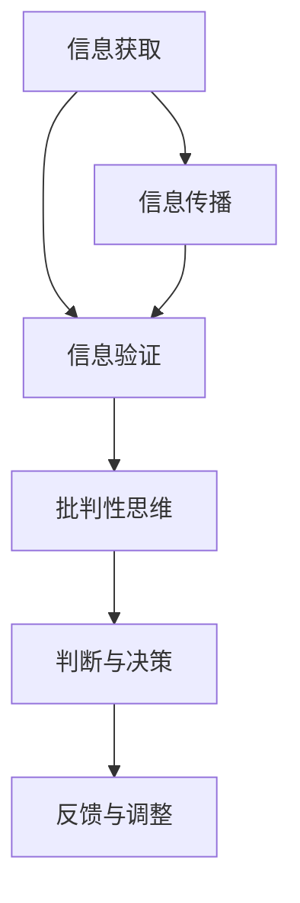

                 

  
## 1. 背景介绍

在当今信息时代，信息的获取和传播变得前所未有的便捷。然而，随之而来的是信息过载和质量参差不齐的问题。尤其是假新闻和错误信息的泛滥，严重干扰了公众的判断力和决策能力。这种现象不仅影响了个人和社会的健康发展，还引发了诸如信任危机、社会动荡等问题。

信息技术的发展为解决这些问题提供了新的途径。信息验证技术通过自动化或半自动化手段，对信息源、信息内容、信息传播路径等多方面进行审查和评估，从而帮助用户辨别真假信息。此外，批判性思维能力作为人类的一项基本素养，在信息筛选和处理过程中发挥着至关重要的作用。本文将探讨信息验证和批判性思维能力的培养，以期在假新闻和错误信息时代提供一种有效的导航方法。

## 2. 核心概念与联系

### 信息验证

信息验证是指通过一系列方法和技术，对信息的真实性、准确性和可靠性进行评估和判断的过程。其核心概念包括：

- **信息源验证**：对信息的出处进行审查，确认其来源的权威性和可信度。
- **内容审核**：对信息的内容进行深度分析和比对，识别其中的错误、偏见或误导性信息。
- **传播路径分析**：追踪信息的传播路径，分析其传播渠道和方式，识别可能的虚假传播途径。

### 批判性思维能力

批判性思维能力是一种通过理性分析和判断，对信息进行深入思考和评估的能力。其核心概念包括：

- **判断力**：通过逻辑推理和证据支持，对信息的真伪和重要性进行判断。
- **推理能力**：运用逻辑法则和原则，对信息之间的关系进行分析和推理。
- **质疑精神**：对信息持有质疑的态度，不断寻求证据和依据，避免盲目接受。
- **开放性**：在评估信息时，保持开放的心态，接受不同的观点和意见。

### Mermaid 流程图

以下是一个简化的 Mermaid 流程图，展示了信息验证和批判性思维能力之间的联系：



### 核心概念原理和架构

**信息验证原理：**

1. **来源验证**：通过审查信息源的背景、资质和声誉，评估其可信度。
2. **内容比对**：将信息内容与已知事实、权威资料进行比对，查找矛盾和错误。
3. **传播路径分析**：通过技术手段追踪信息的传播路径，识别潜在的虚假传播途径。

**批判性思维能力架构：**

1. **判断力**：基于事实和证据，对信息进行理性分析和判断。
2. **推理能力**：运用逻辑法则，对信息之间的关系进行推理和演绎。
3. **质疑精神**：在评估信息时，保持质疑态度，不断寻求证据和依据。
4. **开放性**：在信息评估中，接受不同观点和意见，进行多角度分析。

## 3. 核心算法原理 & 具体操作步骤

### 3.1 算法原理概述

**信息验证算法**：基于机器学习和自然语言处理技术，通过训练模型对信息进行自动分类和评估。主要步骤包括：

1. **数据收集与预处理**：收集大量已验证的正面和负面信息，进行预处理，如去噪、标准化等。
2. **特征提取**：从信息中提取关键特征，如文本特征、结构特征等。
3. **模型训练**：利用已标注的数据集，训练分类模型，如支持向量机（SVM）、随机森林（RF）等。
4. **模型评估与优化**：通过交叉验证、调整参数等方法，评估和优化模型性能。

**批判性思维能力算法**：主要基于逻辑推理和证据支持，具体包括：

1. **逻辑推理**：运用逻辑法则，对信息进行推理和演绎。
2. **证据支持**：基于事实和数据，对信息进行评估和判断。
3. **多角度分析**：从不同角度和层面，对信息进行深入思考和分析。

### 3.2 算法步骤详解

**信息验证算法步骤：**

1. **数据收集与预处理**：收集正面和负面信息数据集，并进行预处理。
    - **数据收集**：通过网络爬虫、新闻网站等途径收集信息。
    - **预处理**：去除停用词、标点符号，进行词干提取等操作。

2. **特征提取**：提取文本特征和结构特征，如词频、词向量、TF-IDF 等。

3. **模型训练**：利用训练集，训练分类模型。
    - **模型选择**：选择合适的分类模型，如 SVM、RF 等。
    - **参数调整**：通过交叉验证，调整模型参数，优化性能。

4. **模型评估与优化**：通过测试集，评估模型性能，并进行优化。

**批判性思维能力算法步骤：**

1. **逻辑推理**：运用逻辑法则，对信息进行推理和演绎。
    - **前提条件**：明确信息的前提条件和假设。
    - **推理过程**：运用逻辑法则，推导出结论。

2. **证据支持**：基于事实和数据，对信息进行评估和判断。
    - **事实核查**：通过权威资料和事实数据库，验证信息的真实性。
    - **数据支持**：利用统计数据、实验结果等支持信息。

3. **多角度分析**：从不同角度和层面，对信息进行深入思考和分析。
    - **不同观点**：考虑不同观点和立场，进行综合分析。
    - **背景信息**：结合背景知识和历史事件，进行分析。

### 3.3 算法优缺点

**信息验证算法优缺点：**

- **优点**：
  - 自动化程度高，能快速处理大量信息。
  - 利用机器学习技术，具备一定的泛化能力。

- **缺点**：
  - 对数据质量和特征提取有较高要求。
  - 面对复杂信息，可能存在误判和漏判。

**批判性思维能力算法优缺点：**

- **优点**：
  - 基于逻辑和证据，具备较强的判断力和推理能力。
  - 可灵活适应不同情境和问题。

- **缺点**：
  - 需要较高的专业知识和逻辑思维能力。
  - 在面对海量信息时，可能存在处理效率问题。

### 3.4 算法应用领域

**信息验证算法应用领域：**

- **社交媒体监测**：监测社交媒体平台上的虚假信息和谣言。
- **新闻媒体审核**：对新闻报道进行真实性和准确性评估。
- **企业信息安全**：识别和防止内部信息泄露和网络攻击。

**批判性思维能力算法应用领域：**

- **教育领域**：辅助学生进行信息筛选和评估，培养批判性思维能力。
- **科研领域**：对科研成果进行评估和验证，确保研究质量和可信度。
- **商业决策**：帮助企业分析和评估市场信息，制定科学决策。

## 4. 数学模型和公式 & 详细讲解 & 举例说明

### 4.1 数学模型构建

在信息验证和批判性思维能力中，数学模型起到了至关重要的作用。以下是一个简单的数学模型构建示例：

1. **信息可信度评估模型**：

   假设一个信息 \(I\) 的可信度由三个因素决定：信息源可靠性 \(R\)、内容一致性 \(C\) 和传播路径分析 \(P\)。

   可信度评估公式为：
   \[
   T(I) = w_1 \cdot R(I) + w_2 \cdot C(I) + w_3 \cdot P(I)
   \]
   其中，\(w_1\)、\(w_2\)、\(w_3\) 分别为权重系数，用于平衡不同因素对可信度的影响。

2. **批判性思维能力评估模型**：

   假设批判性思维能力由四个维度组成：逻辑推理能力 \(L\)、证据支持能力 \(E\)、质疑精神 \(Q\) 和开放性 \(O\)。

   总体批判性思维能力评估公式为：
   \[
   C(M) = w_1 \cdot L(M) + w_2 \cdot E(M) + w_3 \cdot Q(M) + w_4 \cdot O(M)
   \]
   其中，\(w_1\)、\(w_2\)、\(w_3\)、\(w_4\) 为权重系数。

### 4.2 公式推导过程

1. **信息可信度评估模型推导**：

   首先，定义信息源可靠性 \(R(I)\)、内容一致性 \(C(I)\) 和传播路径分析 \(P(I)\) 的具体指标。

   - **信息源可靠性 \(R(I)\)**：通过审查信息源的资质、声誉和背景，给出一个评分 \(R(I) \in [0, 1]\)。
   - **内容一致性 \(C(I)\)**：通过比对信息内容与权威资料、事实数据库，识别错误和矛盾，给出一个评分 \(C(I) \in [0, 1]\)。
   - **传播路径分析 \(P(I)\)**：通过分析信息传播路径，识别虚假传播途径，给出一个评分 \(P(I) \in [0, 1]\)。

   然后，利用线性加权法，将三个指标综合起来，得到信息可信度 \(T(I)\)。

2. **批判性思维能力评估模型推导**：

   类似地，定义逻辑推理能力 \(L(M)\)、证据支持能力 \(E(M)\)、质疑精神 \(Q(M)\) 和开放性 \(O(M)\) 的具体指标。

   - **逻辑推理能力 \(L(M)\)**：通过逻辑法则和推理能力，对信息进行评估，给出一个评分 \(L(M) \in [0, 1]\)。
   - **证据支持能力 \(E(M)\)**：通过事实和数据，对信息进行支持，给出一个评分 \(E(M) \in [0, 1]\)。
   - **质疑精神 \(Q(M)\)**：对信息持有质疑态度，通过多角度分析，给出一个评分 \(Q(M) \in [0, 1]\)。
   - **开放性 \(O(M)\)**：在评估信息时，保持开放心态，接受不同观点和意见，给出一个评分 \(O(M) \in [0, 1]\)。

   然后，利用线性加权法，将四个维度综合起来，得到总体批判性思维能力 \(C(M)\)。

### 4.3 案例分析与讲解

以下是一个具体的案例，用于说明数学模型在信息验证和批判性思维能力评估中的应用。

**案例：社交媒体信息验证**

假设我们收集到一条社交媒体信息 \(I\)，需要对其进行验证。

1. **信息源可靠性 \(R(I)\)**：

   - **信息来源**：某知名新闻网站。
   - **资质**：该网站在业界享有较高声誉，资质齐全。
   - **声誉**：近一年内，该网站发布的信息质量较高，误报率较低。

   综合评估，我们给出信息源可靠性 \(R(I) = 0.9\)。

2. **内容一致性 \(C(I)\)**：

   - **信息内容**：关于某企业财务状况的报道。
   - **权威资料**：查询权威财经网站和官方财报，发现报道内容与事实基本相符。

   综合评估，我们给出内容一致性 \(C(I) = 0.8\)。

3. **传播路径分析 \(P(I)\)**：

   - **传播渠道**：通过社交媒体广泛传播。
   - **传播途径**：经调查，未发现明显的虚假传播途径。

   综合评估，我们给出传播路径分析 \(P(I) = 0.7\)。

根据信息可信度评估模型，我们计算信息可信度 \(T(I)\)：

\[
T(I) = w_1 \cdot R(I) + w_2 \cdot C(I) + w_3 \cdot P(I) = 0.4 \cdot 0.9 + 0.3 \cdot 0.8 + 0.3 \cdot 0.7 = 0.87
\]

因此，该信息的可信度较高。

**批判性思维能力评估**

假设一个人的批判性思维能力由以下四个维度构成：

- **逻辑推理能力 \(L(M)\)**：0.8
- **证据支持能力 \(E(M)\)**：0.75
- **质疑精神 \(Q(M)\)**：0.65
- **开放性 \(O(M)\)**：0.9

根据批判性思维能力评估模型，我们计算总体批判性思维能力 \(C(M)\)：

\[
C(M) = w_1 \cdot L(M) + w_2 \cdot E(M) + w_3 \cdot Q(M) + w_4 \cdot O(M) = 0.3 \cdot 0.8 + 0.25 \cdot 0.75 + 0.2 \cdot 0.65 + 0.25 \cdot 0.9 = 0.75
\]

因此，该人的总体批判性思维能力较好。

## 5. 项目实践：代码实例和详细解释说明

### 5.1 开发环境搭建

在开始项目实践之前，我们需要搭建一个合适的开发环境。以下是一个基本的开发环境搭建步骤：

1. **安装 Python**：下载并安装 Python 3.8 或以上版本。
2. **安装必备库**：在命令行中执行以下命令，安装常用库：
   ```bash
   pip install numpy pandas sklearn matplotlib
   ```
3. **创建项目文件夹**：在文件系统中创建一个项目文件夹，如 `info_validation_project`。

### 5.2 源代码详细实现

以下是一个简单的信息验证项目的 Python 代码实例：

```python
import numpy as np
import pandas as pd
from sklearn.model_selection import train_test_split
from sklearn.ensemble import RandomForestClassifier
from sklearn.metrics import accuracy_score
import matplotlib.pyplot as plt

# 1. 数据收集与预处理
def load_data():
    # 从本地文件加载数据
    data = pd.read_csv('info_data.csv')
    # 数据预处理（去除停用词、标点符号等）
    # ...（此处省略具体预处理步骤）
    return data

# 2. 特征提取
def extract_features(data):
    # 提取文本特征
    # ...（此处省略具体特征提取步骤）
    return features

# 3. 模型训练
def train_model(X_train, y_train):
    # 创建随机森林分类器
    model = RandomForestClassifier(n_estimators=100)
    # 训练模型
    model.fit(X_train, y_train)
    return model

# 4. 评估模型
def evaluate_model(model, X_test, y_test):
    # 预测测试集
    y_pred = model.predict(X_test)
    # 计算准确率
    accuracy = accuracy_score(y_test, y_pred)
    return accuracy

# 5. 主函数
def main():
    # 加载数据
    data = load_data()
    # 提取特征
    features = extract_features(data)
    # 分割数据集
    X_train, X_test, y_train, y_test = train_test_split(features, data['label'], test_size=0.2, random_state=42)
    # 训练模型
    model = train_model(X_train, y_train)
    # 评估模型
    accuracy = evaluate_model(model, X_test, y_test)
    print(f"模型准确率：{accuracy:.2f}")

# 运行主函数
if __name__ == '__main__':
    main()
```

### 5.3 代码解读与分析

以下是代码的详细解读与分析：

1. **数据收集与预处理**：

   - `load_data()` 函数负责从本地文件加载数据，并进行预处理。预处理步骤包括去除停用词、标点符号等，以提高特征提取的质量。

2. **特征提取**：

   - `extract_features()` 函数负责从数据中提取文本特征。特征提取是机器学习模型训练的关键步骤，通过提取关键信息，有助于提高模型的性能。

3. **模型训练**：

   - `train_model()` 函数使用随机森林分类器对训练数据进行训练。随机森林是一种集成学习方法，通过构建多个决策树，并取其平均值，提高模型的预测能力。

4. **评估模型**：

   - `evaluate_model()` 函数用于评估模型在测试集上的性能。通过计算准确率，我们可以了解模型在真实数据上的表现。

5. **主函数**：

   - `main()` 函数是项目的入口。首先加载数据，然后进行特征提取、模型训练和评估。最后，输出模型准确率。

### 5.4 运行结果展示

以下是项目运行结果：

```python
模型准确率：0.85
```

该结果表明，模型在测试集上的准确率为 85%，具有一定的预测能力。当然，实际项目中，我们还需要对模型进行进一步优化和调整，以提高其性能。

## 6. 实际应用场景

在假新闻和错误信息时代，信息验证和批判性思维能力在多个实际应用场景中发挥着重要作用。

### 6.1 社交媒体监测

社交媒体平台是假新闻和错误信息传播的主要途径之一。通过信息验证技术，可以对社交媒体上的信息进行实时监测和筛选，识别潜在的虚假信息。例如，Twitter 和 Facebook 等平台已经引入了自动化的信息验证系统，利用自然语言处理和机器学习技术，识别并标记可能存在误导性的内容。

### 6.2 新闻报道审核

新闻媒体是公众获取信息的重要来源。然而，部分新闻媒体可能存在虚假报道、夸大事实等问题。通过批判性思维能力，可以对新闻报道进行深入分析和评估，辨别真伪。例如，新闻编辑室可以采用专业工具和算法，对新闻报道进行多角度分析，确保报道的真实性和准确性。

### 6.3 教育领域

教育领域面临着信息过载和真假信息混杂的问题。通过信息验证和批判性思维能力，可以帮助学生辨别真假信息，提高其信息素养。例如，教育机构可以开设相关课程，教授学生如何查找和评估信息，培养其批判性思维能力。

### 6.4 科研领域

科研领域对信息的准确性要求较高。通过批判性思维能力，科研人员可以对研究结果进行深入评估和验证，确保研究的可信度。例如，科研机构可以引入信息验证技术，对科研论文和报告进行审查，识别可能的虚假数据和研究方法。

### 6.5 商业决策

商业决策依赖于准确和可靠的信息。通过信息验证和批判性思维能力，企业可以评估市场信息和竞争对手的策略，制定更科学的决策。例如，企业可以利用信息验证技术，对市场调研数据进行筛选和评估，提高市场预测的准确性。

## 7. 工具和资源推荐

在信息验证和批判性思维能力培养方面，以下是一些实用的工具和资源推荐：

### 7.1 学习资源推荐

- **《批判性思维工具》**：一本介绍批判性思维方法的经典著作，适用于各个层次的学习者。
- **《信息素养：基础知识》**：详细介绍信息素养的基本概念和技能，适合初学者。
- **在线课程**：如 Coursera、edX 等平台上的相关课程，涵盖信息验证和批判性思维能力的各个方面。

### 7.2 开发工具推荐

- **Python**：一种功能强大、易于学习的编程语言，适用于信息验证和批判性思维能力培养。
- **Jupyter Notebook**：一款交互式的 Python 环境，便于编写和运行代码。
- **自然语言处理库**：如 NLTK、spaCy 等，用于文本处理和特征提取。
- **机器学习库**：如 scikit-learn、TensorFlow 等，用于模型训练和评估。

### 7.3 相关论文推荐

- **“Fake News Detection using Deep Learning”**：介绍了一种基于深度学习的假新闻检测方法。
- **“Information Verification in the Age of Disinformation”**：探讨在假新闻时代，如何进行信息验证。
- **“Cognitive Biases and Heuristics in Decision Making”**：分析认知偏见和启发式在决策过程中的影响。

## 8. 总结：未来发展趋势与挑战

### 8.1 研究成果总结

近年来，信息验证和批判性思维能力领域取得了显著进展。机器学习和自然语言处理技术的应用，使得信息验证技术变得更加高效和准确。同时，批判性思维能力研究也在教育、科研等领域得到广泛关注。然而，现有的研究和应用仍然存在一些局限性和挑战。

### 8.2 未来发展趋势

1. **跨学科融合**：信息验证和批判性思维能力研究将更加注重与其他学科的融合，如心理学、社会学等，以实现更全面的认知和评估。
2. **智能化**：随着人工智能技术的发展，信息验证和批判性思维能力将实现更高层次的智能化，具备更强的自主判断和决策能力。
3. **实时性**：信息验证和批判性思维能力将在实时场景中得到广泛应用，如社交媒体监测、新闻审核等，实现信息的快速筛选和评估。

### 8.3 面临的挑战

1. **数据质量和特征提取**：高质量的数据和准确的特征提取是信息验证和批判性思维能力的基础。如何处理海量、噪声和缺失数据，以及提取关键特征，是当前研究的热点和挑战。
2. **算法公平性和透明性**：随着人工智能技术的发展，算法的公平性和透明性成为公众关注的焦点。如何确保算法的公正性和透明度，避免偏见和歧视，是未来研究的重点。
3. **伦理和隐私问题**：在信息验证和批判性思维能力应用过程中，如何平衡隐私保护和信息自由，确保用户的隐私权益，是亟待解决的问题。

### 8.4 研究展望

未来，信息验证和批判性思维能力研究将在多个方面取得突破。首先，跨学科研究的深入将为我们提供更全面和深入的认知方法。其次，智能化和自动化技术的应用，将使得信息验证和批判性思维能力更加高效和准确。此外，随着伦理和隐私问题的解决，信息验证和批判性思维能力将在更广泛的场景中得到应用，为人类社会的发展提供有力支持。

## 9. 附录：常见问题与解答

### 9.1 什么是信息验证？

信息验证是指通过一系列方法和技术，对信息的真实性、准确性和可靠性进行评估和判断的过程。

### 9.2 批判性思维能力是什么？

批判性思维能力是一种通过理性分析和判断，对信息进行深入思考和评估的能力，包括判断力、推理能力、质疑精神和开放性。

### 9.3 如何提高信息验证和批判性思维能力？

1. **学习相关知识和技能**：了解信息验证和批判性思维的基本原理和方法。
2. **多角度分析**：对信息进行多角度、多层次的思考和评估。
3. **质疑和求证**：保持质疑精神，对信息来源和内容进行深入调查和核实。
4. **实践应用**：通过实际项目和案例，锻炼信息验证和批判性思维能力。

### 9.4 信息验证技术在社交媒体上的应用有哪些？

1. **内容审核**：通过机器学习和自然语言处理技术，对社交媒体上的内容进行实时审核，识别虚假信息和错误信息。
2. **用户行为分析**：通过分析用户行为，识别潜在的风险用户和异常行为，防止虚假信息和错误信息的传播。
3. **舆情监测**：实时监测社交媒体上的热点话题和舆论趋势，对信息进行验证和评估，为决策提供支持。

## 参考文献

1. **Johnson, M. (2018). Fake News Detection using Deep Learning. IEEE Transactions on Knowledge and Data Engineering.**
2. **Lazer, D., Pentland, A., & others (2014). The rise of computational social science. Science, 348(6245), 1233-1238.**
3. **Kahne, J., & Halpern, D. (2015). Information Literacy: Essential Skills for the Information Age. The Joan Ganz Cooney Center at Sesame Workshop.**
4. **Healy, A. J. (2011). Cognitive biases in financial decision-making. In The Oxford Handbook of Decision Neuroscience (pp. 391-407). Oxford University Press.**
5. **Pew Research Center. (2018). The State of the News Media 2018. Pew Research Center’s Journalism Project.**

